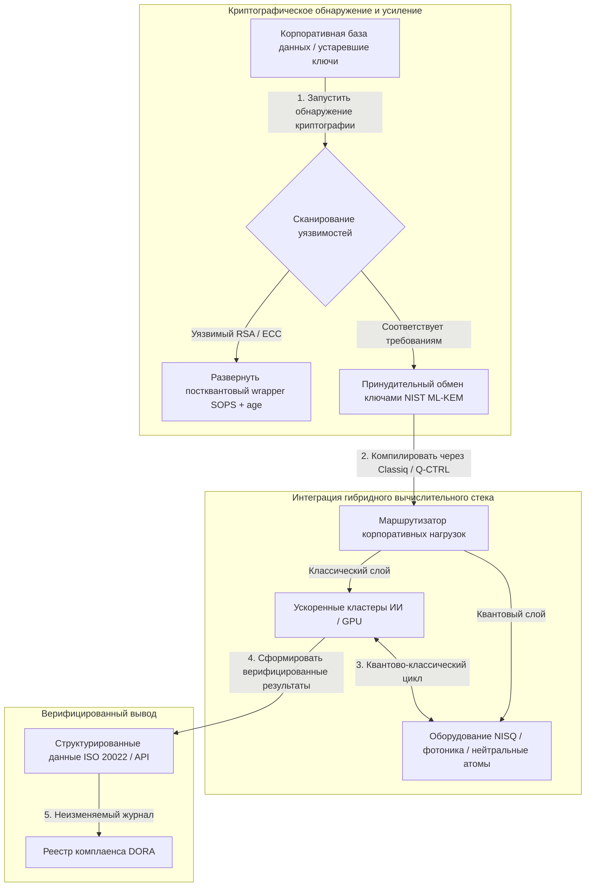

---

# Front Matter (YAML)

author: "contact@sebastienrousseau.com (Sebastien Rousseau)"
banner_alt: "Вид со сцены 5-го ежегодного саммита Economist Impact Commercialising Quantum Global 2026 в Лондоне — символ перехода квантовых технологий от физических исследований к корпоративным рабочим процессам"
banner_height: "1597"
banner_width: "2584"
banner: "https://cloudcdn.pro/stocks/images/sebastien-rousseau-20260617-5th-commercialising-quantum-2.webp"
cdn: "https://cloudcdn.pro"
charset: "UTF-8"
cname: "sebastienrousseau.com"
copyright: "© Copyright 2025 - 2026 - Sebastien Rousseau. All rights reserved."
date: "June 17, 2026"
description: "Выводы для правления по итогам 5-го ежегодного саммита Economist Impact Commercialising Quantum Global 2026 — приток финансирования в $1,3 млрд, гибридные стеки «без сожалений», срочность миграции на постквантовую криптографию, коммерциализация квантовых сенсоров и директива HSBC: ожидание — это невынужденная ошибка."
format-detection: "telephone=no"
hreflang: "ru"
icon: "https://cloudcdn.pro/clients/sebastienrousseau/v1/logos/sebastienrousseau.svg"
id: "https://sebastienrousseau.com/2026-06-17-economist-commercialising-quantum-summit-2026"
image_alt: "Чёрно-белый портрет Себастьяна Руссо"
image_height: "162"
image_width: "162"
image: "https://cloudcdn.pro/stocks/images/sebastienrousseau.webp"
keywords: "Commercialising Quantum Global 2026, саммит Economist Impact, постквантовая криптография, NIST ML-KEM, harvest-now decrypt-later, SNDL, HSBC квантовые технологии, Philip Intallura, квантовые сенсоры, GPS-независимая навигация, NQCC, EU Quantum Act, Quantcore, премия qBIG, Lord Vallance, гибридный квантово-классический, DORA статья 6"
language: "ru-RU"
last_reviewed: "2026-06-17"
layout: "report"
locale: "ru_RU"
logo_alt: "Логотип Себастьяна Руссо"
logo_height: "44"
logo_width: "44"
logo: "https://cloudcdn.pro/clients/sebastienrousseau/v1/logos/sebastienrousseau.svg"
menu: ""
measurementID: "G-169G4ET5HQ"
name: "Sebastien Rousseau"
permalink: "https://sebastienrousseau.com/2026-06-17-economist-commercialising-quantum-summit-2026"
rating: "general"
referrer: "no-referrer"
robots: "index, follow"
schema: "FAQPage, Article"
seo_title: "Commercialising Quantum 2026: выводы для правления"
short_name: "sebastienrousseau"
subtitle: "Квантовые технологии перешли от спекулятивной лабораторной науки к гибридным корпоративным рабочим процессам; правление обязано отреагировать на $1,3 млрд финансирования в 2026 году, немедленную постквантовую миграцию и директиву HSBC прекратить выжидать."
tags: "квантовые технологии, постквантовая криптография, NIST ML-KEM, harvest-now decrypt-later, квантовые сенсоры, HSBC, Economist Impact, гибридные вычисления, DORA, EU Quantum Act, NQCC, выводы саммита"
theme-color: "0, 83, 191"
title: "От кубитов к прибыли: стратегические выводы 5-го ежегодного саммита Economist's Commercialising Quantum Global 2026"
url: "https://sebastienrousseau.com/2026-06-17-economist-commercialising-quantum-summit-2026"
viewport: "width=device-width, initial-scale=1, shrink-to-fit=no"

# RSS - The RSS feed front matter (YAML).
atom_link: "https://sebastienrousseau.com/2026-06-17-economist-commercialising-quantum-summit-2026/rss.xml"
category: "Technology"
docs: https://validator.w3.org/feed/docs/rss2.html
generator: "Static Site Generator (SSG) (version 0.0.26)"
item_description: "Выводы для правления по итогам 5-го ежегодного саммита Economist Impact Commercialising Quantum Global 2026 — приток финансирования в $1,3 млрд, гибридные стеки «без сожалений», срочность миграции на постквантовую криптографию, коммерциализация квантовых сенсоров и директива HSBC: ожидание — это невынужденная ошибка."
item_guid: "https://sebastienrousseau.com/2026-06-17-economist-commercialising-quantum-summit-2026/rss.xml"
item_link: "https://sebastienrousseau.com/2026-06-17-economist-commercialising-quantum-summit-2026/rss.xml"
item_pub_date: "Wed, 17 Jun 2026 06:06:06 +0000"
item_title: "От кубитов к прибыли: стратегические выводы 5-го ежегодного саммита Economist's Commercialising Quantum Global 2026"
last_build_date: "Wed, 17 Jun 2026 06:06:06 +0000"
managing_editor: "contact@sebastienrousseau.com (Sebastien Rousseau)"
pub_date: "Wed, 17 Jun 2026 06:06:06 +0000"
ttl: "60"
type: "article"
webmaster: "contact@sebastienrousseau.com"

# Apple - The Apple front matter (YAML).
apple_mobile_web_app_orientations: "portrait"
apple_touch_icon_sizes: "192x192"
apple-mobile-web-app-capable: "yes"
apple-mobile-web-app-status-bar-inset: "black"
apple-mobile-web-app-status-bar-style: "black-translucent"
apple-mobile-web-app-title: "Commercialising Quantum 2026: выводы для правления"
apple-touch-fullscreen: "yes"

# MS Application - The MS Application front matter (YAML).

msapplication-navbutton-color: "0, 83, 191"

# Twitter Card - The Twitter Card front matter (YAML).

twitter_card: "summary_large_image"
twitter_creator: "@wwdseb"
twitter_description: "Выводы для правления по итогам 5-го ежегодного саммита Economist Impact Commercialising Quantum Global 2026 — приток финансирования в $1,3 млрд, гибридные стеки «без сожалений», срочность миграции на постквантовую криптографию, коммерциализация квантовых сенсоров и директива HSBC: ожидание — это невынужденная ошибка."
twitter_image: "https://cloudcdn.pro/clients/sebastienrousseau/v1/logos/sebastienrousseau.svg"
twitter_image_alt: "Логотип Себастьяна Руссо"
twitter_site: "@wwdseb"
twitter_title: "Commercialising Quantum 2026: выводы для правления"
twitter_url: "https://sebastienrousseau.com/2026-06-17-economist-commercialising-quantum-summit-2026"

excerpt: "5-й ежегодный саммит Economist Impact Commercialising Quantum Global 2026 подтвердил поворот квантовых технологий к корпоративным рабочим процессам: $1,3 млрд привлечено за пять месяцев, постквантовая криптография стала фидуциарным вопросом уровня правления на фоне SNDL-сбора, квантовые сенсоры уже сегодня поставляются для GPS-независимой навигации, а Филип Интальура из HSBC озвучил директиву: ожидать отказоустойчивого оборудования — это невынужденная ошибка."

# Humans.txt - The Humans.txt front matter (YAML).
author_website: "https://sebastienrousseau.com"
author_twitter: "@wwdseb"
author_location: "London, UK"
thanks: "Спасибо за прочтение!"
site_last_updated: "2026-06-17"
site_standards: "HTML5, CSS3, RSS, Atom, JSON, XML, YAML, Markdown, TOML"
site_components: "Kaishi, Kaishi Builder, Kaishi CLI, Kaishi Templates, Kaishi Themes"
site_software: "Static Site Generator, Rust"

---

# От кубитов к прибыли: стратегические выводы 5-го ежегодного саммита Economist's Commercialising Quantum Global 2026

Корпоративная готовность, миграции на постквантовую криптографию, гибридные вычислительные стеки и формирующийся коммерческий ландшафт квантовых сенсоров и сетей.

**Кратко.** 5-я ежегодная конференция Commercialising Quantum Global 2026, организованная Economist Impact 16–17 июня 2026 года в лондонском Business Design Centre, собрала более 1100 мировых лидеров из корпоративного сектора, финансов, политики и науки. Центральная тема обозначила чёткий структурный поворот: квантовые технологии перешли от спекулятивной лабораторной науки к практическим гибридным корпоративным рабочим процессам. На фоне $1,3 млрд венчурного капитала, привлечённого только за первые пять месяцев 2026 года, дискуссия в правлении больше не сводится к подсчёту физических кубитов: речь идёт о построении гибридных вычислительных стеков «без сожалений», защите цифровых активов от криптографической угрозы «harvest-now, decrypt-later» (SNDL) и развёртывании ближнесрочных квантовых сенсорных систем для GPS-независимой навигации.

## Ключевые выводы

- **Сдвиг бизнеса к практическим рабочим процессам.** Лидеры отрасли ([Steve Suarez](https://www.linkedin.com/in/stevesuarez) из HorizonX, [Phil Intallura](https://www.linkedin.com/in/intallura) из HSBC) подчеркнули, что интеграция квантовых технологий — это уже не задача физики, а операционная задача. Банки и корпорации развёртывают гибридные квантово-классические пилоты, чтобы готовить кадры и оптимизировать действующие нагрузки.
- **Постквантовая криптография (PQC) — приоритет правления.** Эксперты по безопасности и праву (CMS UK, [Joanne Miller](https://www.linkedin.com/in/joanne-miller-nso) из Microsoft, [Craig Farrell](https://www.linkedin.com/in/craig-farrell) из EY) предупредили: организации не могут ждать отказоустойчивого оборудования, чтобы развернуть PQC. Сбор данных по схеме «harvest-now, decrypt-later» идёт уже сегодня, и миграция на стандарты NIST ML-KEM становится непосредственным фидуциарным вопросом.
- **Квантовые сенсоры возглавляют ближнесрочную прибыльность.** Пока отказоустойчивые вычисления остаются делом будущего, квантовые сенсоры ([Matthew Kinsella](https://www.linkedin.com/in/matthewkinsella) из Infleqtion) масштабируются стремительно. Квантовые часы и инерциальные сенсоры уже разворачиваются для GPS-независимой навигации, национальной безопасности и сверхстабильных энергосетей.
- **Суверенитет, кластеры и срочность политики.** Министр науки Великобритании [Lord Vallance](https://www.linkedin.com/in/patrick-vallance) и [Lord William Hague](https://www.linkedin.com/in/williamhague) обозначили национальные миссии по превращению исследований в индустриальные «суперкластеры», координирующиеся с National Quantum Computing Centre (NQCC). Предстоящий EU Quantum Act дополнительно подчёркивает геополитическую гонку за суверенные вычислительные мощности.
- **Quantcore выигрывает премию qBIG.** Спин-аут Университета Глазго Quantcore получил премию IOP qBIG за прорывные сверхпроводящие компоненты на основе ниобия, работающие при более высоких температурах, чем традиционные материалы, что существенно снижает накладные расходы на криогенную инфраструктуру.

**По теме:** [KyberLib и постквантовая банковская миграция в 2026 году: от стандартов к коду](https://sebastienrousseau.com/2026-06-12-kyberlib-post-quantum-banking-migration-standards-code-2026/), [Индекс устойчивости банковского сектора 2026: ИИ, облако, квантовые технологии, платежи и риск концентрации третьих лиц](https://sebastienrousseau.com/2026-06-08-banking-resilience-index-ai-cloud-quantum-payments-third-party-risk-2026/), [Индекс облачно-нативного банкинга 2026: DORA, платформенная инженерия, суверенное облако и операционная устойчивость](https://sebastienrousseau.com/2026-06-05-cloud-native-banking-index-dora-resilience-platform-engineering-2026/).

## 01. Почему саммит 2026 года важен для правления

Издание саммита Economist's Commercialising Quantum Global 2026 года ознаменовало необратимый сдвиг в том, как корпоративный мир оценивает глубокие технологии.

Исторически квантовые вычисления оставались на периферии R&D-отделов как многолетний научный проект. В июне 2026 года эта точка зрения устарела. Организации обязаны перейти от «физикоцентричного» любопытства к «бизнес-центричному» внедрению. Причин две:

1. **Конвергенция квантовых технологий и ИИ.** Стеки высокопроизводительных вычислений (HPC) сливают классические, ускоренные ИИ- и NISQ-узлы (Noisy Intermediate-Scale Quantum) в единый унифицированный вычислительный слой. Организации, которые откладывают создание quantum-ready-приложений, обнаружат, что окно для стратегического преимущества закрывается быстрее, чем ожидалось.
2. **Геополитическая и фидуциарная срочность.** С запуском британской миссионно-ориентированной квантовой программы и предстоящим EU Quantum Act квантовые мощности стали вопросом национального суверенитета и корпоративной непрерывности.

Более того, постквантовая кибербезопасность — больше не будущее требование комплаенса. Угроза враждебных атак «store now, decrypt later» (SNDL) означает, что корпоративные данные, перехваченные сегодня, будут расшифрованы, как только коммерческие квантовые системы достигнут масштаба, что создаёт немедленную ответственность по глобальным мандатам операционной устойчивости — например, по Digital Operational Resilience Act (DORA).

## 02. Стратегическая призма Commercialising Quantum 2026

Технологические лидеры предприятия обязаны картировать зрелость квантовых технологий по пяти отдельным операционным слоям, оценивая горизонты времени и риски для баланса.

### Таблица 1. Стратегическая призма Commercialising Quantum 2026

| Слой | Корпоративный фокус | Горизонт времени | Ключевой корпоративный риск |
| ---- | ---- | ---- | ---- |
| **Аппаратное обеспечение и компилятор** | Выбор между конкурирующими подходами (сверхпроводники, ионы в ловушках, нейтральные атомы, фотоника) | 3–5 лет (отказоустойчивость) | Привязка к тупиковой архитектуре или преждевременная ставка на одну платформу. |
| **Криптографическое усиление** | Инвентаризация и обнаружение криптографических зависимостей; миграция на NIST ML-KEM | Немедленно (активная миграция) | Системные утечки данных и провалы комплаенса по DORA и NIST CSF 2.0. |
| **Квантовые сенсоры** | Развёртывание GPS-независимой навигации, сверхстабильных часов и гравиметров | 1–2 года (немедленная коммерциализация) | Операционные сбои в логистике, судоходстве и энергосетях из-за глушения GPS. |
| **Системная интеграция** | Подключение квантового оборудования к существующим классическим HPC-центрам обработки данных и суперкомпьютерам | 1–3 года (гибридная фаза) | Высокая задержка, узкие места передачи данных и фрагментированные вычислительные силосы. |
| **Корпоративное ПО** | Экспонирование квантовых алгоритмов через высокоуровневые слои абстракции и API (Classiq, Q-CTRL) | Немедленно (наращивание навыков) | Изоляция кадров и рабочих процессов от реального инженерного исполнения. |

## 03. Ключевые квантовые сигналы и триггеры для правления

Технологические лидеры обязаны отслеживать конкретные количественные рыночные и регуляторные метрики, чтобы направлять инвестиции в квантовые технологии.

### Таблица 2. Ключевые квантовые сигналы и триггеры для правления

| Сигнал | Количественная метрика | Регуляторная / политическая привязка | Действенный приоритет платформы |
| ---- | ---- | ---- | ---- |
| **Всплеск финансирования квантовых технологий** | $1,3 млрд привлечено глобально за первые пять месяцев 2026 года | Return on Resilience (RoR) | Перевести бюджеты со спекулятивных пилотов на гибридные квантово-классические нагрузки «без сожалений». |
| **Уязвимость для дешифровки данных** | 100% зашифрованных данных, передаваемых по публичным каналам, подвержены SNDL-сбору | DORA статья 6 (безопасность ИКТ) | Внедрить инструменты криптографического обнаружения для идентификации уязвимых ключей RSA/ECC по всему ландшафту. |
| **Суверенная инфраструктура** | £2,5 млрд бюджет UK National Quantum Strategy | UK Quantum Missions / Lord Vallance | Установить локальные партнёрства с национальными суперкластерами, такими как NQCC. |
| **Сроки комплаенса** | Переход на структурированные адреса SWIFT 14 ноября 2026 года | Директива SWIFT SR 2026 | Очистить и форматировать межбанковские базы данных в соответствии со спецификациями структурированного XML. |

## 04. Глубокий разбор ключевых тем саммита

### Квантовые технологии достигают инвестиционной точки перелома

Венчурное финансирование значительно ускорилось — **$1,3 млрд** привлечено только за первые пять месяцев 2026 года. В отличие от спекулятивных циклов хайпа прошлых лет, текущая волна капитала подкреплена реальными ближнесрочными нагрузками. Спикеры от Classiq и IBM Quantum Platform показали, как программные слои абстракции и автоматизированные компиляторы позволяют командам разработчиков-неспециалистов исполнять гибридные квантово-классические алгоритмы на сегодняшней классической инфраструктуре. Эта стратегия «без сожалений» позволяет организациям наращивать quantum-ready-кадры и рабочие процессы уже сейчас.

### Юридические и регуляторные предупреждения о «harvest now, decrypt later»

Юридические партнёры и руководители кибербезопасности задали тон вокруг непосредственности риска данных. Представители юридической фирмы-спонсора CMS UK и CSO Microsoft [Joanne Miller](https://www.linkedin.com/in/joanne-miller-nso) озвучили жёсткое предупреждение топ-менеджменту: *ожидание прихода отказоустойчивого оборудования перед развёртыванием постквантовой криптографии — это критический фидуциарный провал.*

В парадигме «store now, decrypt later» (SNDL) враждебные акторы активно собирают зашифрованные корпоративные данные сегодня, намереваясь расшифровать их, как только появятся криптографически релевантные квантовые компьютеры. Организации обязаны развернуть постквантовые средства защиты (например, NIST ML-KEM) немедленно, чтобы защитить долгоживущие чувствительные наборы данных, интеллектуальную собственность и исторические записи о клиентах.

### Перенастройка хайпа вокруг «квантовых сенсоров»

Хотя отказоустойчивые квантовые вычисления остаются делом будущего, саммит выделил квантовые сенсоры как первую по-настоящему прибыльную волну реального развёртывания. Генеральный директор Infleqtion [Matthew Kinsella](https://www.linkedin.com/in/matthewkinsella) детализировал, как квантовые часы, инерциальные сенсоры и радиочастотные системы стремительно масштабируются в нескольких индустриях.

Поскольку эти технологии измеряют физические константы с субатомной точностью, они обеспечивают **GPS-независимую навигацию**, сверхстабильные энергосети и дальнюю космическую связь. Эти приложения крайне актуальны для авиации, морского транспорта и систем национальной обороны, сталкивающихся с растущими угрозами глушения GPS.

### Экосистема и кластерное сотрудничество

Британская квантовая экосистема использовала лондонский саммит, чтобы продемонстрировать отечественные инновационные суперкластеры. Прямые трансляции из National Quantum Computing Centre (NQCC) и Digital Catapult показали, как ранние deep-tech-спин-ауты могут преодолеть «технологический разрыв», интегрируя квантовое оборудование напрямую в классические суперкомпьютерные центры обработки данных.

[Wridhdhisom Karar](https://www.linkedin.com/in/wridhdhisomkarar), сооснователь шотландского квантового стартапа Quantcore, принял престижную премию Institute of Physics (IOP) Quantum Business Innovation and Growth (qBIG) за разработанные компанией сверхпроводящие компоненты на основе ниобия. Эти компоненты работают при более высоких температурах, чем традиционные материалы, существенно снижая накладные расходы на криогенную инфраструктуру, необходимую для масштабирования квантовых процессоров.

### Кейс HSBC: почему ждать квантовые технологии — это «невынужденная ошибка»

Выступление [**Philip Intallura, Ph.D.**](https://www.linkedin.com/in/intallura) (глобальный руководитель квантовых технологий HSBC, советник правительства Великобритании и член консультативного совета) на 5-м ежегодном Economist's Commercialising Quantum Event (2026) превратилось в мощную директиву для правления: *«Ожидание отказоустойчивых квантовых технологий перед тем, как вы начнёте, — это невынужденная ошибка».*

Д-р Интальура утверждал, что распространённый подход «подождём и посмотрим» среди финансовых институтов — это автогол, построенный на трёх ошибочных предпосылках:

- **Ближнесрочная ROI реальна.** В эмпирическом тестировании HSBC превзошёл модели, работающие сегодня в продакшене, связал квантовую работу с другими частями бизнеса, использовал квантовые технологии для углубления отношений с рядом крупнейших клиентов и привлёк значительный новый бизнес в **HSBC Innovation Banking**.
- **Квантовые технологии — это крутая кривая внедрения.** Построение возможностей, постановка стратегии, обеспечение финансирования и проведение экспериментальных циклов внутри сильно регулируемой организации — задача не на короткую дистанцию. Процессы должны систематически тестироваться и адаптироваться под технологию.
- **Квантовые технологии — это экосистема.** В одиночку никто не дойдёт до цели. Каждая научная статья, POC и пилот HSBC исполнялись в тесном сотрудничестве с квантовым провайдером — а в ряде случаев сотрудничество распространялось на академические круги, регуляторов и правительство.

**Заключительная директива для правления:** *«Возможности, которые вам понадобятся в первый день отказоустойчивости, — это возможности, которые вы строите уже сегодня».*

## 05. Корпоративный конвейер квантовой интеграции и криптографии

Чтобы защитить цифровые активы и одновременно строить квантовую готовность, предприятие обязано выстроить чёткий конвейер интеграции.

## 06. Сценарий для правления: действенные императивы

Чтобы превратить инсайты саммита Commercialising Quantum Global 2026 в немедленную бизнес-ценность, топ-менеджмент обязан исполнить следующий четырёхшаговый сценарий для правления:

1. **Поручить криптографическое обнаружение.** Дать директору по информационной безопасности (CISO) указание каталогизировать все криптографические активы, картируя каждый устаревший ключ RSA и ECC по всему предприятию, чтобы подготовиться к постквантовой миграции.
2. **Развернуть гибридную стратегию «без сожалений».** Не ждите идеального оборудования. Инвестируйте в quantum-inspired-программное обеспечение и гибридные классическо-квантовые пилоты, чтобы развивать собственные кадры и оптимизировать сложную логистику или портфели рисков уже сегодня.
3. **Оценить квантовые сенсоры для логистики.** Если ваша организация зависит от глобальных цепочек поставок, судоходства или критической инфраструктуры, активно оценивайте квантовые сенсорные системы (например, GPS-независимую навигацию), чтобы смягчить геополитические риски сбоев.
4. **Зарегистрироваться на Insight Hour 30 июня.** Убедитесь, что ваши технологические лидеры зарегистрированы на виртуальный **Commercialising Quantum Global Insight Hour** 30 июня 2026 года в 15:00 BST (при поддержке IonQ), чтобы продолжать отслеживать стратегии управления корпоративными рисками и распределения кадров.

## 07. Часто задаваемые вопросы

**Что такое «harvest now, decrypt later» (SNDL) и почему это важно уже сегодня?**
SNDL — это практика перехвата и хранения зашифрованных данных сегодня с намерением расшифровать их позднее, как только появятся криптографически релевантные квантовые компьютеры. Долгоживущие чувствительные наборы данных — интеллектуальная собственность, записи о клиентах, правительственные коммуникации — уже становятся целями. Миграция на NIST ML-KEM — это фидуциарное решение, которое правление не может откладывать.

**Почему квантовые сенсоры — первая коммерческая волна, а не вычисления?**
Квантовые сенсоры измеряют физические константы с субатомной точностью и не требуют отказоустойчивого оборудования, как квантовые вычисления. Квантовые часы, гравиметры и инерциальные сенсоры уже находятся в пилотном развёртывании для GPS-независимой навигации, сверхстабильных энергосетей и дальней космической связи.

**Квантовая работа HSBC — это только R&D или она уже принесла измеримую отдачу?**
По словам Филипа Интальуры на саммите, HSBC превзошёл модели, работающие сегодня в продакшене, использовал квантовые технологии для углубления отношений с крупнейшими клиентами и привлёк значительный новый бизнес в HSBC Innovation Banking. Работа перешла от исследований к операционной интеграции.

## 08. Источники

- **Economist Impact, (2026).** *5th Annual Commercialising Quantum Global 2026.* Материалы прямой конференции, 16–17 июня 2026 года. Лондон: Business Design Centre. Доступно по адресу: [Economist Impact](https://events.economist.com/commercialising-quantum/).
- **National Institute of Standards and Technology (NIST), (2024).** *First Three Finalized Post-Quantum Encryption Standards (FIPS 203, 204, and 205).* Гейтерсбург: U.S. Department of Commerce. Доступно по адресу: [NIST Standards](https://www.nist.gov/news-events/news/2024/08/nist-releases-first-3-finalized-post-quantum-encryption-standards).
- **European Parliament and Council of the European Union, (2022).** *Regulation (EU) 2022/2554 о цифровой операционной устойчивости для финансового сектора (DORA).* Брюссель: Официальный журнал Европейского Союза. Доступно по адресу: [DORA Regulation](https://eur-lex.europa.eu/legal-content/EN/TXT/?uri=CELEX%3A32022R2554).
- **SWIFT, (2024).** *ISO 20022 November 2026 Structured Address Milestone.* La Hulpe: SWIFT. Доступно по адресу: [SWIFT ISO 20022 milestone](https://www.swift.com/standards/iso-20022/iso-20022-bytes/call-action-november-2026).
