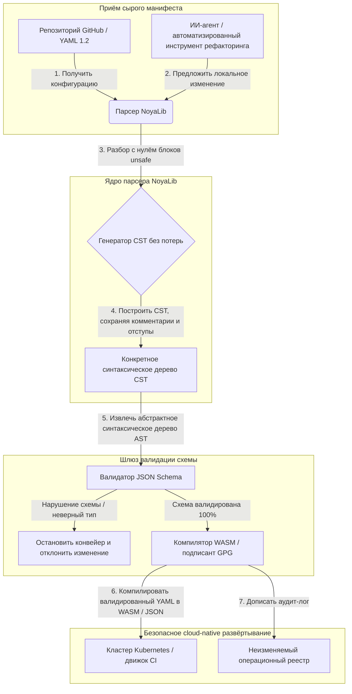

---

# Front Matter (YAML)

author: "contact@sebastienrousseau.com (Sebastien Rousseau)"
banner_alt: "Архитектурная геометрия в драматическом освещении — символ роли NoyaLib как несущего безопасного парсера YAML на Rust под CI, Kubernetes, MCP и конфигурациями финансовых сервисов"
banner_height: "1597"
banner_width: "2584"
banner: "https://cloudcdn.pro/stocks/images/ken-cheung-KonWFWUaAuk.webp"
cdn: "https://cloudcdn.pro"
charset: "UTF-8"
cname: "sebastienrousseau.com"
copyright: "© Copyright 2025 - 2026 - Sebastien Rousseau. All rights reserved."
date: "June 18, 2026"
description: "NoyaLib — парсер YAML 1.2 на Rust без unsafe, 406/406 спецификации, валидация JSON Schema, CST без потерь и привязки MCP/WASM для финансов."
format-detection: "telephone=no"
hreflang: "ru"
icon: "https://cloudcdn.pro/clients/sebastienrousseau/v1/logos/sebastienrousseau.svg"
id: "https://sebastienrousseau.com/2026-06-18-noyalib-safe-yaml-rust-ai-mcp-financial-infrastructure-2026"
image_alt: "Чёрно-белый портрет Себастьяна Руссо"
image_height: "162"
image_width: "162"
image: "https://cloudcdn.pro/stocks/images/sebastienrousseau.webp"
keywords: "безопасный парсер YAML на Rust, NoyaLib, соответствие спецификации YAML 1.2, Rust без unsafe, валидация JSON Schema, CST без потерь, MCP, Model Context Protocol, WebAssembly, манифесты Kubernetes, конфигурация CI/CD, DORA статья 5, BCBS 239, операционный риск Basel III, финансовая инфраструктура, безопасность конфигураций, цепочка поставок ПО"
language: "ru-RU"
last_reviewed: "2026-06-18"
layout: "report"
locale: "ru_RU"
logo_alt: "Логотип Себастьяна Руссо"
logo_height: "44"
logo_width: "44"
logo: "https://cloudcdn.pro/clients/sebastienrousseau/v1/logos/sebastienrousseau.svg"
menu: ""
measurementID: "G-169G4ET5HQ"
name: "Sebastien Rousseau"
permalink: "https://sebastienrousseau.com/2026-06-18-noyalib-safe-yaml-rust-ai-mcp-financial-infrastructure-2026"
rating: "general"
referrer: "no-referrer"
robots: "index, follow"
schema: "FAQPage, Article"
seo_title: "Безопасный парсер YAML на Rust для ИИ, MCP и финансов"
short_name: "sebastienrousseau"
subtitle: "Более безопасный стек YAML на Rust — NoyaLib — превращает YAML 1.2 из удобной разметки в криптографически защищённый, соответствующий спецификации контрольный слой конфигураций для ИИ-агентов, MCP, Kubernetes и инфраструктуры финансовых сервисов."
tags: "безопасный парсер YAML на Rust, NoyaLib, YAML 1.2, Rust без unsafe, JSON Schema, MCP, WebAssembly, Kubernetes, DORA, BCBS 239, Basel III, финансовая инфраструктура, безопасность цепочки поставок"
theme-color: "0, 83, 191"
title: "Почему YAML нужен более безопасный стек на Rust для ИИ, MCP и финансовой инфраструктуры в 2026 году"
url: "https://sebastienrousseau.com/2026-06-18-noyalib-safe-yaml-rust-ai-mcp-financial-infrastructure-2026"
viewport: "width=device-width, initial-scale=1, shrink-to-fit=no"

# RSS - The RSS feed front matter (YAML).
atom_link: "https://sebastienrousseau.com/2026-06-18-noyalib-safe-yaml-rust-ai-mcp-financial-infrastructure-2026/rss.xml"
category: "Technology"
docs: https://validator.w3.org/feed/docs/rss2.html
generator: "Static Site Generator (SSG) (version 0.0.26)"
item_description: "NoyaLib — парсер YAML 1.2 на Rust без unsafe, 406/406 спецификации, валидация JSON Schema, CST без потерь и привязки MCP/WASM для финансов."
item_guid: "https://sebastienrousseau.com/2026-06-18-noyalib-safe-yaml-rust-ai-mcp-financial-infrastructure-2026/rss.xml"
item_link: "https://sebastienrousseau.com/2026-06-18-noyalib-safe-yaml-rust-ai-mcp-financial-infrastructure-2026/rss.xml"
item_pub_date: "Thu, 18 Jun 2026 06:06:06 +0000"
item_title: "Почему YAML нужен более безопасный стек на Rust для ИИ, MCP и финансовой инфраструктуры в 2026 году"
last_build_date: "Thu, 18 Jun 2026 06:06:06 +0000"
managing_editor: "contact@sebastienrousseau.com (Sebastien Rousseau)"
pub_date: "Thu, 18 Jun 2026 06:06:06 +0000"
ttl: "60"
type: "article"
webmaster: "contact@sebastienrousseau.com"

# Apple - The Apple front matter (YAML).
apple_mobile_web_app_orientations: "portrait"
apple_touch_icon_sizes: "192x192"
apple-mobile-web-app-capable: "yes"
apple-mobile-web-app-status-bar-inset: "black"
apple-mobile-web-app-status-bar-style: "black-translucent"
apple-mobile-web-app-title: "Безопасный парсер YAML на Rust для ИИ, MCP и финансов"
apple-touch-fullscreen: "yes"

# MS Application - The MS Application front matter (YAML).

msapplication-navbutton-color: "0, 83, 191"

# Twitter Card - The Twitter Card front matter (YAML).

twitter_card: "summary_large_image"
twitter_creator: "@wwdseb"
twitter_description: "NoyaLib — парсер YAML 1.2 на Rust без unsafe, 406/406 спецификации, валидация JSON Schema, CST без потерь и привязки MCP/WASM для финансов."
twitter_image: "https://cloudcdn.pro/clients/sebastienrousseau/v1/logos/sebastienrousseau.svg"
twitter_image_alt: "Логотип Себастьяна Руссо"
twitter_site: "@wwdseb"
twitter_title: "Безопасный парсер YAML на Rust для ИИ, MCP и финансов"
twitter_url: "https://sebastienrousseau.com/2026-06-18-noyalib-safe-yaml-rust-ai-mcp-financial-infrastructure-2026"

excerpt: "NoyaLib — более безопасный стек YAML на Rust: ноль блоков unsafe, 406/406 соответствие спецификации YAML 1.2, конкретное синтаксическое дерево (CST) без потерь, валидация JSON Schema (Draft 2020-12) и привязки MCP/WASM — спроектированный для ИИ-агентов, Kubernetes, CI/CD и контрольного слоя конфигураций за финансовой инфраструктурой."

# Humans.txt - The Humans.txt front matter (YAML).
author_website: "https://sebastienrousseau.com"
author_twitter: "@wwdseb"
author_location: "London, UK"
thanks: "Спасибо за прочтение!"
site_last_updated: "2026-06-18"
site_standards: "HTML5, CSS3, RSS, Atom, JSON, XML, YAML, Markdown, TOML"
site_components: "Kaishi, Kaishi Builder, Kaishi CLI, Kaishi Templates, Kaishi Themes"
site_software: "Static Site Generator, Rust"

---

# Почему YAML нужен более безопасный стек на Rust для ИИ, MCP и финансовой инфраструктуры в 2026 году

Более безопасный стек YAML на Rust имеет значение, потому что YAML сегодня несёт на себе конвейеры CI/CD, манифесты Kubernetes, правила [Open Policy Agent](https://www.openpolicyagent.org/) и реестры инструментов Model Context Protocol (MCP) — и единственный двусмысленный разбор способен сломать клиринговую систему, неверно настроить группу безопасности или выдать локальному ИИ-агенту не те разрешения. [NoyaLib](https://github.com/sebastienrousseau/noyalib) — это экосистема разбора и валидации [YAML 1.2](https://yaml.org/spec/1.2.2/), написанная на чистом Rust без блоков unsafe, спроектированная так, чтобы эта инфраструктура была безопасна по умолчанию.

## Краткий ответ

**Что такое NoyaLib одной фразой?** NoyaLib — это открытая экосистема разбора и валидации YAML 1.2 на чистом Rust с нулём блоков `unsafe`, 100%-ным соответствием официальному набору из 406 тестов спецификации YAML, конкретным синтаксическим деревом (CST) без потерь и валидацией [JSON Schema](https://json-schema.org/) в реальном времени, спроектированная для безопасной по умолчанию конфигурации ИИ-агентов, MCP, Kubernetes и финансовой инфраструктуры.

## Резюме для руководства

YAML выглядит скромно — до тех пор, пока двусмысленный разбор или нарушение схемы не сломает многомиллиардную продакшен-систему клиринга. В 2026 году YAML — фактический стандарт для конвейеров [CI/CD](https://docs.github.com/en/actions/learn-github-actions/workflow-syntax-for-github-actions), манифестов [Kubernetes](https://kubernetes.io/docs/concepts/configuration/overview/), правил [Open Policy Agent](https://www.openpolicyagent.org/) и реестров инструментов Model Context Protocol (MCP). Непрозрачные устаревшие парсеры с уязвимостями памяти и деструктивным разбором — неприемлемый риск безопасности. NoyaLib — это экосистема YAML 1.2 на чистом Rust без unsafe: 100%-ное соответствие всем 406 официальным тестам набора, конкретное синтаксическое дерево (CST) без потерь, сохраняющее комментарии и отступы, и встроенная валидация JSON Schema. Результат — YAML, переосмысленный как поддающийся аудиту, защищённый и доступный агентам контрольный слой конфигураций.

## Ключевые выводы

- **Конфигурация — это продакшен-код.** Один некорректно сформированный YAML-файл способен неверно настроить cloud-native группы безопасности или разрешения ИИ-агента. NoyaLib рассматривает YAML как критическую инфраструктуру.
- **Дизайн без unsafe.** Полностью построенный на безопасном Rust с нулём блоков `unsafe`, NoyaLib устраняет уязвимости безопасности памяти — переполнения буфера, удалённое выполнение кода — в основных слоях разбора.
- **Абсолютное соответствие 406/406 спецификации.** Математически валидирует структуры конфигураций, устраняя расхождения разбора и структурный дрейф между staging- и продакшен-средами.
- **Конкретное синтаксическое дерево без потерь.** В отличие от устаревших парсеров, отбрасывающих комментарии и форматирование, NoyaLib сохраняет отступы и аннотации, обеспечивая безопасный round-trip автоматизированный рефакторинг ИИ-агентами.
- **Фидуциарная ценность уровня правления.** Связывает целостность конфигурации с метриками капитала по операционному риску [DORA статья 5](https://eur-lex.europa.eu/legal-content/EN/TXT/?uri=CELEX%3A32022R2554) и [Basel III](https://www.bis.org/bcbs/publ/d424.htm), напрямую защищая высшее руководство от персональной ответственности.

**По теме:** [KyberLib и постквантовая банковская миграция в 2026 году: от стандартов к коду](https://sebastienrousseau.com/2026-06-12-kyberlib-post-quantum-banking-migration-standards-code-2026/), [Индекс облачно-нативного банкинга 2026: DORA, платформенная инженерия, суверенное облако и операционная устойчивость](https://sebastienrousseau.com/2026-06-05-cloud-native-banking-index-dora-resilience-platform-engineering-2026/), [AI-Aware Dotfiles в 2026 году: построение защищённой, воспроизводимой рабочей станции разработчика для MCP, SLSA и многошелловой паритетности](https://sebastienrousseau.com/2026-06-16-ai-aware-dotfiles-secure-reproducible-workstation-2026/).

## 01. Почему более безопасный стек YAML на Rust важен в 2026 году

В июне 2026 года корпоративные IT-инфраструктуры сильно распределены и всё больше автоматизированы.

YAML тихо стал несущим языком конфигураций для всего стека программной инженерии. Он несёт рабочие процессы непрерывной интеграции (CI), компилирующие продакшен-артефакты, манифесты [Kubernetes](https://kubernetes.io/docs/concepts/overview/), оркестрирующие глобальные cloud-native кластеры, и схемы серверов [Model Context Protocol](https://modelcontextprotocol.io/) (MCP), дающие локальным ИИ-агентам разрешение на выполнение локальных операций.

Устаревшие парсеры YAML — [PyYAML](https://pyyaml.org/), [yaml-cpp](https://github.com/jbeder/yaml-cpp), [libyaml](https://github.com/yaml/libyaml) — несут два структурных риска:

1. **Уязвимости приведения типов («норвежская проблема»).** Устаревшие парсеры часто приводят незакавыченные строки (код страны `NO` — к булевому `false`, аналогично `yes`/`no`) — см. [булевый тег YAML 1.1 против 1.2](https://yaml.org/type/bool.html) — что приводит к критическим сбоям систем или молчаливым ошибкам конфигурации безопасности.
2. **Эксплойты безопасности памяти.** Непрозрачные парсеры на C/C++ страдают от утечек памяти и эксплойтов переполнения буфера, что может привести к удалённому выполнению кода (RCE) на основных серверах сборки.

[NoyaLib](https://github.com/sebastienrousseau/noyalib) решает эти задачи. Это экосистема разбора и валидации YAML 1.2 на чистом Rust без unsafe. Достигая абсолютного соответствия 406/406 спецификации и обеспечивая строгую валидацию JSON Schema непосредственно во время разбора, NoyaLib даёт высокий **Return on Resilience (RoR)** — предотвращая простои, вызванные конфигурацией, и защищая цепочки поставок ПО финансового уровня.

## 02. Архитектурная призма NoyaLib 2026

Экосистема NoyaLib работает как защищённый, не теряющий данных парсер конфигураций. Каждый локальный и облачный манифест структурно валидируется и защищается на самом нижнем уровне исполнения.

### Таблица 1. Слои архитектуры NoyaLib и снижение рисков

| Слой | Дизайнерское решение | Почему это важно | Риск при неверной реализации |
| ---- | ---- | ---- | ---- |
| **Слой парсера** | Парсер на чистом Rust, совместимый с YAML 1.2, без блоков `unsafe` | Устраняет уязвимости безопасности памяти и переполнения буфера на самом нижнем уровне исполнения. | Удалённое выполнение кода (RCE) на основных серверах сборки. |
| **Слой соответствия** | 100% соответствие 406/406 тестам официального набора YAML 1.2 | Устраняет расхождения разбора и дрейф приведения типов между staging и продакшеном. | Ошибки приведения типов «норвежской проблемы», отключающие группы безопасности. |
| **Слой синтаксического дерева** | Конкретное синтаксическое дерево (CST) без потерь | Сохраняет комментарии, отступы и порядок при round-trip разборе и программном рефакторинге. | Автоматизированный ИИ-рефакторинг, уничтожающий аннотации разработчиков. |
| **Слой валидации** | Валидация [JSON Schema (Draft 2020-12)](https://json-schema.org/draft/2020-12/release-notes) во время разбора | Применяет строгие модели данных к конфигурационным файлам до того, как они попадут в продакшен-кластеры. | Некорректно сформированные конфигурационные файлы, вызывающие падения cloud-native кластеров. |
| **Слой интерфейса** | Привязки WebAssembly (WASM) и MCP | Позволяет валидации конфигураций выполняться непосредственно внутри браузеров, edge-узлов и локальных агентских инструментов. | Силосы инструментов, где валидация не может выполняться на edge-устройствах. |

## 03. Ключевые сигналы безопасности рабочей станции и конфигурации

Чтобы поддерживать абсолютную безопасность по всему ландшафту разработки и эксплуатации, директорам по информационной безопасности (CISO) необходимо отслеживать конкретные количественные метрики.

### Таблица 2. Сигналы безопасности рабочей станции и конфигурации

| Сигнал | Метрика / операционный бенчмарк | Привязка к NIST CSF / DORA | Техническая реализация на платформе |
| ---- | ---- | ---- | ---- |
| **Соответствие парсера** | 100% прохождение официального набора тестов YAML 1.2 (406/406 тестов). | [DORA статья 6](https://eur-lex.europa.eu/legal-content/EN/TXT/?uri=CELEX%3A32022R2554) (безопасность ИКТ) | Ядро парсера NoyaLib валидирует все манифесты до исполнения CI. |
| **Профиль безопасности памяти** | Ноль блоков `unsafe` Rust внутри зависимостей парсера и сериализатора. | DORA статья 30 (цепочка поставок) | Автоматизированные проверки компилятора ([`forbid(unsafe_code)`](https://doc.rust-lang.org/reference/attributes/diagnostics.html#the-forbid-attribute)) в сборках cargo. |
| **Валидация схемы** | 100% разобранных конфигурационных файлов проверены против валидных моделей [JSON Schema](https://json-schema.org/). | [NIST CSF 2.0](https://www.nist.gov/cyberframework) (PR.DS-01) | Шлюз валидации в реальном времени, останавливающий конвейеры сборки при нарушениях схемы. |
| **Дрейф конфигурации** | Обнаружение и восстановление локальных конфигурационных файлов до версионированного в git состояния в реальном времени. | Return on Resilience (RoR) | Непрерывная телеметрия, регистрирующая все изменения локальных файлов. |
| **Контроль доступа агента** | Ограниченные разрешения только на чтение для локальных ИИ-инструментов, работающих через MCP-конфигурации. | Управление модельным риском ([SR 11-7](https://www.federalreserve.gov/supervisionreg/srletters/sr1107.htm)) | Границы серверов MCP, ограничивающие операции агента утверждёнными каталогами. |

## 04. Ошибочность непрозрачного разбора конфигураций

Крупная уязвимость в cloud-native операциях — *непрозрачный разбор* — использование парсеров, отбрасывающих структурные метаданные (комментарии, пробелы, порядок документов) или молчаливо приводящих типы во время компиляции. Это поведение влечёт два серьёзных риска безопасности:

1. **Деструктивный рефакторинг.** Когда ИИ-помощник по коду или автоматизированный инструмент рефакторинга обновляет манифест развёртывания, традиционные парсеры отбрасывают комментарии и форматирование разработчиков, уничтожая контекст, необходимый для человеческих ревью и пост-инцидентной форензики.
2. **Расхождения разбора.** Если staging-среда использует парсер на Python, а продакшен — парсер на C, незначительные различия в соответствии спецификации YAML 1.2 могут привести к тому, что валидный staging-манифест провалится или поведёт себя иначе в продакшене, создавая скрытые уязвимости безопасности.

**Конкретное синтаксическое дерево (CST) без потерь** NoyaLib решает эту проблему. Оно сохраняет каждый пробел, комментарий и строку документа в цикле разбора и сериализации. Автоматизированные ИИ-помощники могут редактировать, рефакторить и коммитить конфигурационные файлы, сохраняя 100% написанных человеком аннотаций — абсолютный аудит-след.

## 05. Проектирование ограниченного ИИ-конвейера конфигураций

Чтобы предотвратить попадание вредоносных изменений конфигурации в продакшен-среды, организация обязана внедрить строго ограниченный, схемо-валидируемый конвейер конфигураций.

Приведённый ниже операционный поток показывает, как NoyaLib разбирает сырой YAML, строит CST без потерь, валидирует AST против модели JSON Schema и компилирует привязки WebAssembly для браузерных или edge-сред.

## 06. Сценарий для правления и фидуциарная ответственность

Безопасность конфигураций и целостность цепочки поставок ПО — критические приоритеты уровня правления. Высшее руководство обязано подходить к управлению конфигурациями через призму фидуциарного долга и операционной устойчивости.

- **DORA статья 5 (ответственность правления).** Предписывает, что правление несёт окончательную, не подлежащую делегированию ответственность за управление ИКТ-рисками института. Поскольку конфигурационные файлы контролируют критические cloud-native группы безопасности и маршруты платежей, правление обязано убедиться, что системы, разбирающие эти манифесты, безопасны по памяти и полностью соответствуют спецификации, — чтобы удовлетворять регуляторным аудитам. ([Regulation (EU) 2022/2554](https://eur-lex.europa.eu/legal-content/EN/TXT/?uri=CELEX%3A32022R2554))
- **BCBS 239 (агрегирование и отчётность по риск-данным).** Требует, чтобы риск-отчётность и метрики инфраструктуры были точными, полными и формировались под строгим контролем качества данных. NoyaLib поддерживает BCBS 239, разбирая и валидируя конфигурационные файлы против строгих схем у источника, предотвращая молчаливые утечки данных или сбои, вызванные неверной конфигурацией. ([Стандарт BCBS 239](https://www.bis.org/publ/bcbs239.htm))
- **Смягчение капитальных требований по операционному риску (Basel III).** Сбои, вызванные конфигурацией, напрямую раздувают капитальные требования по операционному риску в рамках Basel III, связывая капитал баланса. Стандартизация корпоративного стека конфигураций на безопасном парсере на чистом Rust, таком как NoyaLib, минимизирует этот риск, сохраняя капитал и защищая доверие клиентов. ([Стандарты Basel III](https://www.bis.org/bcbs/publ/d424.htm))

## 07. Что это означает по типу банка

### Глобальные системно значимые банки (G-SIB)

G-SIB управляют тысячами микросервисов и конвейерами развёртывания во множестве юрисдикций. Их основная задача — поддерживать согласованность конфигураций и предотвращать дрейф безопасности по огромным cloud-native ландшафтам. Стандартизация на более безопасном стеке YAML на Rust, таком как NoyaLib, гарантирует, что все манифесты Kubernetes, конвейеры CI/CD и политики безопасности разбираются и валидируются под единым, безопасным по памяти каркасом — устраняя риск неаудированных «снежинок» конфигураций.

### Транзакционные и корпоративные банки

Транзакционные банки управляют чувствительными платёжными шлюзами и оптовыми клиринговыми инфраструктурами. Доказать абсолютную безопасность кода и конфигураций, развёрнутых в этих продакшен-средах, — не подлежащее обсуждению регуляторное требование. Интеграция NoyaLib гарантирует, что цепочка поставок ПО полностью проверена, не теряет данных и защищена от уязвимостей разбора — контроль, чисто привязанный к DORA статье 6 и [PCI DSS v4.0](https://www.pcisecuritystandards.org/document_library/) раздел 6.

### Региональные и небольшие банки

Региональные банки обязаны поддерживать высокие стандарты кибербезопасности без технологических бюджетов уровня G-SIB. Открытый каркас NoyaLib предоставляет лёгкое, экономически эффективное и высокозащищённое Rust-дружественное решение, позволяя меньшим институтам внедрять безопасность конфигураций корпоративного уровня и защиту цепочки поставок без проприетарных лицензионных сборов.

## 08. Заключение: дорожная карта безопасности конфигураций

Рабочая станция разработчика и cloud-native инфраструктурные конфигурации — критические контрольные слои в цепочке поставок ПО. Допускать, чтобы неаудированные, двусмысленные или небезопасные конфигурационные файлы достигали корпоративных активов, — неприемлемый операционный и регуляторный риск.

Чтобы защитить цепочку поставок ПО и оградить конечные точки от уязвимостей конфигураций, технические и security-руководители высшего звена обязаны исполнить чёткую дорожную карту разработки уже сегодня:

1. **Закрепить декларативную конфигурацию.** Поэтапно отказаться от ручных, неаудированных корректировок конфигураций и закрепить, что все манифесты управляются как версионируемая декларативная система записей.
2. **Принудить валидацию схем.** Применять строгие pre-commit хуки и сканирующие утилиты, чтобы все конфигурационные файлы валидировались против валидных моделей JSON Schema до развёртывания.
3. **Внедрить round-tripping без потерь.** Убедиться, что все автоматизированные ИИ-помощники по коду и инструменты рефакторинга используют разбор без потерь, сохраняющий комментарии, отступы и контекст разработчика.
4. **Защитить цепочку поставок.** Убедиться, что все настройки конфигураций и парсинговые утилиты криптографически верифицированы с использованием библиотек на чистом Rust без unsafe, таких как NoyaLib, до исполнения. ([Каркас SLSA](https://slsa.dev/))

## 09. Часто задаваемые вопросы

**Что такое NoyaLib и почему он используется для разбора YAML?**
NoyaLib — это открытый парсер YAML 1.2 на чистом Rust без unsafe. Он достигает 100%-ного соответствия официальному набору из 406 тестов, обеспечивает строгую валидацию [JSON Schema](https://json-schema.org/) во время разбора и предоставляет привязки WASM и [MCP](https://modelcontextprotocol.io/), что делает его более безопасным стеком YAML на Rust для ИИ-агентов, Kubernetes и финансовой инфраструктуры.

**Почему дизайн без unsafe важен для разбора конфигураций?**
Уязвимости безопасности памяти — переполнения буфера, use-after-free — внутри устаревших парсеров на C/C++ могут привести к удалённому выполнению кода на основных серверах сборки. Дизайн NoyaLib на чистом Rust с [`#![forbid(unsafe_code)]`](https://doc.rust-lang.org/reference/attributes/diagnostics.html#the-forbid-attribute) математически устраняет эти уязвимости во время компиляции.

**Что такое конкретное синтаксическое дерево (CST) без потерь и почему это важно?**
Традиционные парсеры отбрасывают комментарии и форматирование, делая автоматизированные правки ИИ-агентами деструктивными. CST без потерь от NoyaLib сохраняет каждый комментарий, пробел и строку документа — поэтому ИИ-помощники могут безопасно редактировать и рефакторить конфигурационные файлы, сохраняя контекст разработчика, пост-инцидентную форензику и аудит-след в неприкосновенности.

**Как NoyaLib соотносится с DORA, BCBS 239 и Basel III?**
DORA статья 5 возлагает ответственность за ИКТ-риски на правление; BCBS 239 требует контроля качества данных в риск-отчётности; Basel III облагает капитал по операционному риску. NoyaLib поставляет схемо-валидируемый, безопасный по памяти слой разбора, который этим регуляциям нужен для «конфигурации как кода», — делая регуляторное сопоставление прямолинейным, а капитальное требование по операционному риску — меньшим.

## 10. Источники

- **YAML, (2026).** *YAML 1.2 specification*. Доступно по адресу: [YAML 1.2 spec](https://yaml.org/spec/1.2.2/).
- **JSON Schema, (2026).** *JSON Schema Draft 2020-12 release notes*. Доступно по адресу: [JSON Schema Draft 2020-12](https://json-schema.org/draft/2020-12/release-notes).
- **European Parliament and Council of the European Union, (2022).** *Regulation (EU) 2022/2554 о цифровой операционной устойчивости для финансового сектора (DORA)*. Брюссель: Официальный журнал Европейского Союза. Доступно по адресу: [DORA regulation](https://eur-lex.europa.eu/legal-content/EN/TXT/?uri=CELEX%3A32022R2554).
- **Basel Committee on Banking Supervision, (2013).** *Principles for effective risk data aggregation and risk reporting (BCBS 239)*. Базель: Банк международных расчётов. Доступно по адресу: [BCBS 239 standard](https://www.bis.org/publ/bcbs239.htm).
- **Basel Committee on Banking Supervision, (2017).** *Basel III: finalising post-crisis reforms*. Базель: Банк международных расчётов. Доступно по адресу: [Basel III standards](https://www.bis.org/bcbs/publ/d424.htm).
- **Anthropic, (2025).** *Model Context Protocol (MCP) specification*. Доступно по адресу: [Model Context Protocol](https://modelcontextprotocol.io/).
- **GitHub, (2026).** *noyalib open-source repository*. Доступно по адресу: [Репозиторий NoyaLib](https://github.com/sebastienrousseau/noyalib).
