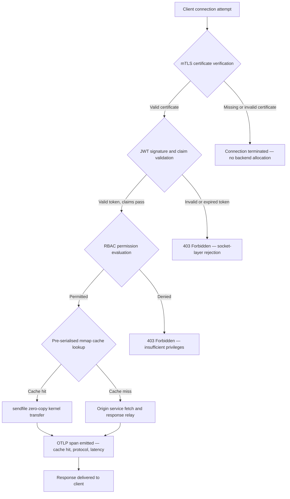

---

# Front Matter (YAML)

author: "contact@sebastienrousseau.com (Sebastien Rousseau)"
banner_alt: "Абстрактный городской пейзаж на печатной плате ночью — визуализация банковского периметра, где передачи zero-copy на уровне ядра, рукопожатия mTLS и валидация JWT сходятся в одном статически скомпилированном бинарном файле"
banner_height: "1597"
banner_width: "2584"
banner: "https://cloudcdn.pro/stocks/images/bit-cloud-GlqbGLCPnQ4.webp"
cdn: "https://cloudcdn.pro"
charset: "UTF-8"
cname: "sebastienrousseau.com"
copyright: "© Copyright 2025 - 2026 - Sebastien Rousseau. All rights reserved."
date: "June 20, 2026"
description: "http-handle — это статически скомпилированный бинарный файл Rust, который обеспечивает 180 000 запросов в секунду на банковском периметре с нулевыми зависимостями от времени выполнения, встроенной проверкой mTLS и JWT, HTTP/2 и HTTP/3 с согласованием ALPN и наблюдаемостью OTLP — устраняя пробелы в безопасности и отказоустойчивости, которые оставляют Nginx и Envoy."
format-detection: "telephone=no"
hreflang: "ru"
icon: "https://cloudcdn.pro/clients/sebastienrousseau/v1/logos/sebastienrousseau.svg"
id: "https://sebastienrousseau.com/2026-06-20-http-handle-zero-dependency-edge-ingress-banking-rust-2026"
image_alt: "Чёрно-белый портрет Себастьена Руссо"
image_height: "162"
image_width: "162"
image: "https://cloudcdn.pro/stocks/images/sebastienrousseau.webp"
keywords: "http-handle, Rust edge ingress, прокси без зависимостей, банковская инфраструктура, mTLS JWT, sendfile zero-copy, ALPN HTTP3, соответствие DORA, Базель III, наблюдаемость OTLP, статический бинарный файл, ARM64 банкинг, zero trust банкинг, лёгкий ingress, безопасность банковских систем Rust"
language: "ru-RU"
last_reviewed: "2026-06-20"
layout: "report"
locale: "ru_RU"
logo_alt: "Логотип Себастьена Руссо"
logo_height: "44"
logo_width: "44"
logo: "https://cloudcdn.pro/clients/sebastienrousseau/v1/logos/sebastienrousseau.svg"
menu: ""
measurementID: "G-169G4ET5HQ"
name: "Sebastien Rousseau"
permalink: "https://sebastienrousseau.com/2026-06-20-http-handle-zero-dependency-edge-ingress-banking-rust-2026"
rating: "general"
referrer: "no-referrer"
robots: "index, follow"
schema: "FAQPage, Article"
seo_title: "http-handle: Ingress Rust без зависимостей для банкинга при 180k запросов/с"
short_name: "sebastienrousseau"
subtitle: "Как один статически скомпилированный бинарный файл Rust обеспечивает 180 000 запросов в секунду с mTLS, JWT и ALPN на банковском периметре — и что это означает для соответствия DORA и Базелю III."
tags: "http-handle, Rust, banking, edge-ingress, mTLS, JWT, ALPN, HTTP3, DORA, Basel-III, zero-copy, sendfile, ARM64, zero-trust, OTLP, observability, open-source, infrastructure"
theme-color: "0, 83, 191"
title: "http-handle: Высокопроизводительный Ingress Edge без Зависимостей для Банкинга в 2026"
url: "https://sebastienrousseau.com/2026-06-20-http-handle-zero-dependency-edge-ingress-banking-rust-2026"
viewport: "width=device-width, initial-scale=1, shrink-to-fit=no"

# RSS - The RSS feed front matter (YAML).
atom_link: "https://sebastienrousseau.com/2026-06-20-http-handle-zero-dependency-edge-ingress-banking-rust-2026/rss.xml"
category: "Technology"
docs: https://validator.w3.org/feed/docs/rss2.html
generator: "Static Site Generator (SSG) (version 0.0.40)"
item_description: "http-handle — это статически скомпилированный бинарный файл Rust, который обеспечивает 180 000 запросов в секунду на банковском периметре с нулевыми зависимостями от времени выполнения, встроенной проверкой mTLS и JWT, HTTP/2 и HTTP/3 с согласованием ALPN и наблюдаемостью OTLP — устраняя пробелы в безопасности и отказоустойчивости, которые оставляют Nginx и Envoy."
item_guid: "https://sebastienrousseau.com/2026-06-20-http-handle-zero-dependency-edge-ingress-banking-rust-2026/rss.xml"
item_link: "https://sebastienrousseau.com/2026-06-20-http-handle-zero-dependency-edge-ingress-banking-rust-2026/rss.xml"
item_pub_date: "Sat, 20 Jun 2026 07:07:07 +0000"
item_title: "http-handle: Высокопроизводительный Ingress Edge без Зависимостей для Банкинга в 2026"
last_build_date: "Sat, 20 Jun 2026 07:07:07 +0000"
managing_editor: "contact@sebastienrousseau.com (Sebastien Rousseau)"
pub_date: "Sat, 20 Jun 2026 07:07:07 +0000"
ttl: "60"
type: "article"
webmaster: "contact@sebastienrousseau.com"

# Apple - The Apple front matter (YAML).
apple_mobile_web_app_orientations: "portrait"
apple_touch_icon_sizes: "192x192"
apple-mobile-web-app-capable: "yes"
apple-mobile-web-app-status-bar-inset: "black"
apple-mobile-web-app-status-bar-style: "black-translucent"
apple-mobile-web-app-title: "Банковский периметр без зависимостей"
apple-touch-fullscreen: "yes"

# MS Application - The MS Application front matter (YAML).

msapplication-navbutton-color: "0, 83, 191"

# Twitter Card - The Twitter Card front matter (YAML).

twitter_card: "summary_large_image"
twitter_creator: "@wwdseb"
twitter_description: "http-handle — это статически скомпилированный бинарный файл Rust, который обеспечивает 180 000 запросов в секунду на банковском периметре с нулевыми зависимостями от времени выполнения, mTLS, JWT и наблюдаемостью OTLP."
twitter_image: "https://cloudcdn.pro/clients/sebastienrousseau/v1/logos/sebastienrousseau.svg"
twitter_image_alt: "Logo of Sebastien Rousseau"
twitter_site: "@wwdseb"
twitter_title: "http-handle: Ingress Rust без зависимостей для банкинга при 180k запросов/с"
twitter_url: "https://sebastienrousseau.com/2026-06-20-http-handle-zero-dependency-edge-ingress-banking-rust-2026"

# Humans.txt - The Humans.txt front matter (YAML).
author_website: "https://sebastienrousseau.com"
author_twitter: "@wwdseb"
author_location: "London, UK"
thanks: "Thanks for reading!"
site_last_updated: "2026-06-20"
site_standards: "HTML5, CSS3, RSS, Atom, JSON, XML, YAML, Markdown, TOML"
site_components: "Kaishi, Kaishi Builder, Kaishi CLI, Kaishi Templates, Kaishi Themes"
site_software: "Static Site Generator, Rust"

---

# http-handle: Высокопроизводительный Ingress Edge без Зависимостей для Банкинга в 2026

<!-- lead-start -->
<aside class="post-lead" aria-label="Резюме статьи">

<strong>TL;DR.</strong> http-handle — это бинарный файл Rust с открытым исходным кодом, статически скомпилированный, который заменяет Nginx и Envoy на банковском периметре. Он обеспечивает 180 000 запросов в секунду на узлах ARM64 через передачи zero-copy <code>sendfile(2)</code> Linux, применяет mTLS и валидацию JWT на уровне сетевого сокета до запуска любого кода приложения, автоматически согласовывает HTTP/2 и HTTP/3 через ALPN и нативно отправляет метрики OpenTelemetry — всё с нулевыми зависимостями от времени выполнения помимо <code>libc</code>.

<strong>Ключевые выводы</strong>

<ul class="post-lead-takeaways">
  <li><strong>Проблема тяжёлых прокси.</strong> Nginx и Envoy несут деревья зависимостей, которые расширяют поверхность CVE и усложняют циклы устранения рисков ICT согласно DORA.</li>
  <li><strong>Производительность zero-copy в масштабе.</strong> Предварительно сериализованные блоки кэша mmap и передачи ядра <code>sendfile(2)</code> поддерживают 180 000 запросов/с на ARM64 с задержкой прокси менее миллисекунды.</li>
  <li><strong>Безопасность на уровне сокета, а не приложения.</strong> Верификация клиентского сертификата mTLS, валидация JWT и оценка RBAC завершаются до того, как для запроса будет выделен какой-либо ресурс бэкенда.</li>
  <li><strong>Встроенное нормативное соответствие.</strong> Уменьшенная поверхность атаки и аудируемое развёртывание единого бинарного файла напрямую отвечают статьям 5 и 6 DORA, операционному риску Базеля III и цепочкам ответственности SM&CR.</li>
</ul>

<strong>Связанное чтение:</strong> <a href="https://sebastienrousseau.com/2026-06-18-noyalib-safe-yaml-rust-ai-mcp-financial-infrastructure-2026">Почему YAML нуждается в более безопасном стеке Rust для ИИ, MCP и финансовой инфраструктуры в 2026</a>, <a href="https://sebastienrousseau.com/2026-06-11-cloudcdn-open-source-blueprint-ai-native-edge-2026">CloudCDN: Blueprint с открытым исходным кодом для нативного ИИ-периметра в 2026</a>, <a href="https://sebastienrousseau.com/2026-05-16-best-cloud-infrastructure-architecture-2026">Лучшая архитектура облачной инфраструктуры для банков и финансовых учреждений в 2026</a>.

</aside>
<!-- lead-end -->

Банковский периметр имеет проблему зависимостей. Каждый экземпляр Nginx или Envoy, маршрутизирующий трафик между клиентом и базовым банковским сервисом, несёт дерево зависимостей: сборки OpenSSL, модули Lua, библиотеки gRPC и слои контейнеров — каждый является потенциальным CVE, каждый требует выделенного цикла исправлений, каждый добавляет вариабельность задержки, усложняющую измерение SLA. В рамках [Регламента о цифровой операционной устойчивости (DORA)](https://eur-lex.europa.eu/eli/reg/2022/2554/oj) эта сложность теперь является нормативной ответственностью в той же мере, что и операционной.

[http-handle](https://github.com/sebastienrousseau/http-handle) использует иной подход. Это единственный статически скомпилированный бинарный файл Rust с нулевыми зависимостями от времени выполнения помимо `libc`. Он обеспечивает 180 000 запросов в секунду на узлах ARM64, применяет взаимный TLS и аутентификацию JWT на уровне сетевого сокета и автоматически согласовывает HTTP/2 и HTTP/3 — всё в рамках развёртывания с памятью менее 20 МБ ОЗУ.

## Краткий ответ

**Что такое http-handle в одном предложении?** http-handle — это бинарный файл Rust с открытым исходным кодом, статически скомпилированный, который заменяет тяжёлые контейнеры прокси на банковском периметре, обеспечивая 180 000 запросов/с на ARM64 через передачи ядра zero-copy `sendfile(2)` Linux, применяя mTLS, JWT и RBAC на уровне сокета до обращения к ресурсам бэкенда и нативно отправляя метрики [OpenTelemetry](https://opentelemetry.io/) — с нулевыми зависимостями от библиотек времени выполнения помимо `libc`.

## Краткое изложение для руководства

Банки использовали Nginx и Envoy на своём периметре в течение десяти лет. Оба функциональны; ни один не был разработан для нормативной среды 2026 года. Образы контейнеров с большим количеством зависимостей генерируют очереди CVE, с которыми команды по соответствию не могут справиться достаточно быстро, а каждое обновление версии библиотеки несёт риск регрессии. Статьи 5 и 6 DORA требуют, чтобы риски ICT управлялись по дизайну, а не исправлялись после обнаружения. Операционные риск-фреймворки Базеля III штрафуют архитектуры, в которых точки отказа умножаются с усложнением системы.

http-handle устраняет проблему зависимостей у источника. Бинарный файл компилируется один раз, статически, без требований к внешним библиотекам во время выполнения. Поверхность атаки сокращается до стандартной библиотеки Rust плюс `libc`. Обеспечение безопасности — верификация сертификатов mTLS, валидация утверждений JWT и управление доступом на основе ролей — выполняется на сетевом сокете до какого-либо выделения ресурсов бэкенда, сворачивая периметр Zero Trust до его наименьшего возможного выражения. Производительность следует из архитектуры: предварительно сериализованные блоки кэша с отображением в память в сочетании с передачами ядра `sendfile(2)` полностью исключают данные из пути копирования CPU-в-память, поддерживая 180 000 запросов/с на оборудовании ARM64. Результатом является уровень ingress, который удовлетворяет требованиям устойчивости DORA, поддерживает аргументы снижения операционного риска Базеля III и даёт старшим руководителям ИТ в рамках SM&CR верифицируемую, однокомпонентную цепочку ответственности за периметральную инфраструктуру.

## Ключевые выводы

- **Меньшие бинарные файлы, меньшие очереди CVE.** Единственный статически скомпилированный бинарный файл имеет один пакет для исправления, один релиз для проверки и один артефакт для аудита. Nginx со стандартным набором модулей поставляется с более чем 30 зависимостями общих библиотек; каждая имеет собственный жизненный цикл уязвимости.
- **Zero-copy — не оптимизация, а конструктивное ограничение.** При 180 000 запросов/с любое копирование данных в пространстве пользователя вносит измеримую вариабельность задержки. `sendfile(2)` передаёт содержимое файлового дескриптора в сетевой сокет полностью в пространстве ядра. В сочетании с блоками кэша ответов, закреплёнными mmap, ЦП никогда не касается пути данных для кэшированных ответов.
- **Периметр безопасности принадлежит сокету.** Валидация JWT и сертификатов mTLS в промежуточном программном обеспечении приложения означает, что бэкенд уже выделил потоки и память до отклонения запроса. Валидация на уровне сокета гарантирует, что неаутентифицированные запросы вообще не потребляют ресурсы бэкенда.
- **OTLP устраняет пробел в наблюдаемости.** Нативная интеграция OpenTelemetry означает, что каждый запрос, каждое решение об аутентификации и каждое согласование протокола производит структурированную телеметрию без агента-помощника. Существующие банковские дашборды напрямую принимают трассировки OTLP.

**Связанное чтение:** [Почему YAML нуждается в более безопасном стеке Rust для ИИ, MCP и финансовой инфраструктуры в 2026](https://sebastienrousseau.com/2026-06-18-noyalib-safe-yaml-rust-ai-mcp-financial-infrastructure-2026/), [CloudCDN: Blueprint с открытым исходным кодом для нативного ИИ-периметра в 2026](https://sebastienrousseau.com/2026-06-11-cloudcdn-open-source-blueprint-ai-native-edge-2026/), [Лучшая архитектура облачной инфраструктуры для банков и финансовых учреждений в 2026](https://sebastienrousseau.com/2026-05-16-best-cloud-infrastructure-architecture-2026/).

## 01. Проблема тяжёлых прокси в банкинге

Nginx и Envoy построили периметр современного интернета. Они настраиваемы, проверены в боевых условиях и поддерживаются крупными сообществами. Они также являются архитектурными решениями, принятыми до существования DORA, до того, как операционные риск-фреймворки Базеля III потребовали количественного снижения сложности, и до того, как облачные узлы ARM64 изменили экономику высокопроизводительных вычислений.

Практическое следствие — разрыв между тем, что нужно банкам, и тем, что обеспечивают тяжёлые контейнеры прокси.

**Поверхность зависимостей.** Стандартное развёртывание Envoy включает OpenSSL, Abseil, Protobuf, gRPC, Lua и десятки вторичных библиотек. Каждая имеет независимый жизненный цикл CVE. Когда National Vulnerability Database публикует критическое предупреждение для OpenSSL, каждый экземпляр Envoy в инфраструктуре становится часами соответствия: оцените, исправьте, протестируйте, переразверните и пересертифицируйте — в каждой среде, где работает бинарный файл. Согласно статье 6 DORA, банки должны демонстрировать, что процессы управления рисками ICT соразмерны, задокументированы и верифицируемы. Дерево зависимостей из множества библиотек делает это доказательство дорогостоящим в поддержании.

**Накладные расходы памяти.** Минимально настроенный рабочий процесс Nginx потребляет 40–80 МБ резидентной памяти при умеренной нагрузке. В масштабе — сотни узлов ingress в торговых системах, платёжных API и клиентских порталах — эти накладные расходы накапливаются в измеримую стоимость инфраструктуры без соответствующего преимущества в производительности по сравнению с хорошо спроектированной альтернативой с единым бинарным файлом.

**Скорость исправлений.** Цепочки поставок образов контейнеров вводят многодневную задержку между публикацией CVE и поступлением проверенного исправления в производство. Базовый образ должен быть перестроен, слой приложения заново наложен, полная матрица тестов повторно запущена и конвейер развёртывания повторно выполнен. Для критических банковских систем, работающих в рамках окон отчётности об инцидентах DORA, этот цикл является структурным риском.

http-handle решает все три проблемы. Один бинарный файл. Одна поверхность CVE. Один артефакт для исправления. Менее 20 МБ ОЗУ для производственного узла ingress.

## 02. Архитектурная линза http-handle 2026

Бинарный файл структурирован как пять взаимозависимых уровней, каждый из которых разработан для устранения конкретной категории риска, накапливаемой традиционными архитектурами прокси.

### Таблица 1: Архитектурные уровни http-handle и снижение рисков

| Уровень | Проектное решение | Почему это важно | Риск при неправильном управлении |
| ---- | ---- | ---- | ---- |
| **Ядро сервера** | Единый бинарный файл Rust, статически скомпилированный, нулевые зависимости помимо `libc` | Один артефакт для исправления; устраняет распространение CVE библиотек по всей инфраструктуре | Атаки dependency confusion; накопление уязвимостей библиотек |
| **Движок ускорения** | Предварительно сериализованные блоки кэша mmap и передачи ядра zero-copy `sendfile(2)` | 180 000 запросов/с на ARM64 с задержкой прокси менее миллисекунды; данные не входят в пространство пользователя для кэшированных ответов | Утечки отображения памяти; узкие места в пространстве ядра при инвалидации кэша |
| **Криптографическая безопасность** | Нативный mTLS с поддержкой горячей перезагрузки сертификатов и согласованием ALPN | Гарантирует целостность данных и совместимость протоколов; ротация сертификатов без потери соединений | Истечение срока действия сертификата, вызывающее перебои в обслуживании; слабые настройки шифра по умолчанию |
| **Плоскость политики доступа** | Валидация JWT на уровне сокета и оценка утверждений RBAC | Неаутентифицированные запросы не потребляют ресурсы бэкенда; Zero Trust применяется на границе ядра | Атаки путаницы алгоритмов JWT; неправильная конфигурация RBAC, предоставляющая избыточные привилегии |
| **Наблюдаемость** | Нативная интеграция [OpenTelemetry (OTLP)](https://opentelemetry.io/docs/specs/otlp/) | Структурированная телеметрия без агентов-помощников; прямое поступление в существующие банковские системы мониторинга | Слепые пятна во время сбоев; неполные аудиторские следы для отчётности об инцидентах DORA |

## 03. Ключевые сигналы производительности и безопасности

Банки, эксплуатирующие http-handle на периметре, должны инструментировать пять поддающихся количественному измерению сигналов для выполнения требований операционной отчётности DORA и внутреннего управления SLA.

### Таблица 2: Операционные ориентиры и нормативные ссылки

| Сигнал | Ориентир | Нормативная ссылка | Техническая реализация |
| ---- | ---- | ---- | ---- |
| **Пропускная способность** | ≥ 180 000 запросов/с на узлах ARM64 при P99 ≤ 1 мс задержки прокси | Операционный риск Базеля III — снижение сложности системы | `sendfile(2)` + предварительно сериализованные блоки кэша mmap; без копирования данных в пространстве пользователя для кэш-попаданий |
| **Поверхность атаки** | Нулевые зависимости от библиотек времени выполнения; один бинарный артефакт на релиз | [Статья 6 DORA](https://eur-lex.europa.eu/eli/reg/2022/2554/oj) — управление рисками ICT по дизайну | Статическая компиляция с `cargo build --release --target aarch64-unknown-linux-musl` |
| **Задержка аутентификации** | Рукопожатие mTLS + валидация JWT завершены до первого байта ответа бэкенда | [Статья 5 DORA](https://eur-lex.europa.eu/eli/reg/2022/2554/oj) — защита безопасности ICT | Перехват на уровне сокета; оценка утверждений JWT в Rust, смежном с ядром, до маршрутизации бэкенда |
| **Доступность сертификатов** | Горячая перезагрузка сертификатов mTLS с нулевым числом потерянных соединений во время ротации | Ответственность высшего руководства SM&CR за доступность периметра | Наблюдатель сертификатов на основе inotify; атомарная замена файлового дескриптора во время перезагрузки |
| **Покрытие наблюдаемости** | 100% запросов, генерирующих спаны OTLP с результатом аутентификации, версией протокола и статусом кэша | Статья 17 DORA — обнаружение инцидентов и отчётность | Нативный экспортёр OTLP; агент-помощник не требуется; транспорт gRPC или HTTP/Protobuf настраиваем |

## 04. Движок zero-copy: mmap и sendfile(2)

Сетевая производительность в высокочастотном банкинге — платежи в реальном времени, API рыночных данных, сервисы аутентификационных токенов — ограничена одним условием больше, чем любым другим: стоимостью перемещения байт из хранилища в сетевой сокет.

Обычные HTTP-серверы читают содержимое файла в буфер пространства пользователя, а затем записывают этот буфер в сокет. Эта последовательность требует двух копий памяти и двух переключений контекста между пространством пользователя и пространством ядра для каждого ответа. При 180 000 запросов в секунду накопленные накладные расходы существенны.

http-handle устраняет обе копии.

**Блоки кэша с отображением в память.** При запуске сервиса он сериализует статическое содержимое ответов в регионы с отображением в память, используя `mmap(2)`. Эти регионы закреплены в кэше страниц ядра. Когда поступает запрос к кэшированному ресурсу, ответ уже отображён в памяти ядра — без чтения с диска, без выделения буфера.

**Передача ядра `sendfile(2)`.** Системный вызов Linux `sendfile(2)` передаёт данные непосредственно из файлового дескриптора — или региона с отображением в память — в файловый дескриптор сетевого сокета, полностью в ядре. Ни один байт не входит в пространство пользователя. Роль ЦП сводится к выдаче системного вызова и обработке события завершения. На узлах ARM64 с этой архитектурой http-handle поддерживает 180 000 запросов/с с задержкой прокси менее миллисекунды при устойчивой нагрузке.

Для банков, выполняющих пакетные сверки в конце месяца, внутридневную отчётность о ликвидности или трафик API оценки мошенничества в реальном времени, инженерное следствие непосредственно: меньше узлов ARM64 на уровень трафика, более низкая стоимость инфраструктуры и меньший риск устойчивости DORA из-за нехватки мощностей.

## 05. Плоскость политики доступа mTLS и JWT

В банкинге аутентификация на периметре — не функция, а нормативное требование. DORA предписывает, чтобы средства управления безопасностью ICT были соразмерны, задокументированы и верифицируемы. SM&CR возлагает личную ответственность за решения в области безопасности инфраструктуры на поимённо назначенных старших менеджеров. Вопрос не в том, аутентифицировать ли на периметре, а на каком уровне.

http-handle применяет трёхэтапную политику Zero Trust до выделения любых ресурсов бэкенда.

**Этап 1: Верификация клиентского сертификата mTLS.** Во время TLS-рукопожатия http-handle запрашивает и проверяет клиентский сертификат по настраиваемому хранилищу доверия. Соединения без действительного сертификата прерываются на рукопожатии. Ни один поток приложения не создаётся, ни один пул памяти не выделяется. Бэкенд никогда не видит запрос.

**Этап 2: Валидация утверждений JWT.** Для соединений, прошедших mTLS, http-handle извлекает и проверяет JSON Web Token из заголовка `Authorization` на уровне сокета. Верификация подписи, проверки истечения срока действия и валидация эмитента происходят до поступления запроса на уровень маршрутизации. Атаки путаницы алгоритмов — когда сервер принимает симметричный алгоритм при ожидаемом асимметричном ключе — блокируются явным разрешительным списком алгоритмов в конфигурации.

**Этап 3: Оценка утверждений RBAC.** Проверенные утверждения JWT сопоставляются с таблицей ролей в памяти. Запросы с недостаточными правами получают ответ 403 на плоскости политики доступа. Сервис бэкенда никогда не вызывается для неавторизованного трафика.

Это упорядочение важно с операционной точки зрения. В традиционной модели — где аутентификация выполняется в промежуточном программном обеспечении приложения — злоумышленник может исчерпать пулы потоков бэкенда неаутентифицированными запросами до выдачи единственного отказа. Аутентификация на уровне сокета полностью устраняет этот вектор атаки.

## 06. Маршрутизация ALPN и цепочка резервного переключения HTTP/3

Банковский трафик поступает в разнообразных сетевых условиях: корпоративная оптика для торговых столов, 5G для клиентов мобильного банкинга, спутниковая связь для удалённых операций и прокси-серверы инспекции TLS в регулируемых средах. Ingress с единственным протоколом создаёт ограничение наименьшего общего знаменателя.

http-handle использует [Application-Layer Protocol Negotiation (ALPN)](https://www.rfc-editor.org/rfc/rfc7301) для автоматического выбора оптимального протокола для каждого соединения.

**HTTP/2** используется по умолчанию для трафика браузеров и API через TCP. Мультиплексированные потоки по одному соединению устраняют блокировку head-of-line, которую HTTP/1.1 вводит при параллельных шаблонах запросов.

**HTTP/3 (QUIC)** активируется, когда сеть поддерживает UDP и клиент объявляет `h3` в своём расширении ALPN. Независимое мультиплексирование потоков QUIC и миграция соединений делают его материально лучшим для клиентов мобильного банкинга в перегруженных сотовых сетях, где TCP-соединения часто прерываются и переустанавливаются.

**Корректное резервное переключение.** Если согласование ALPN не удаётся — потому что промежуточный прокси удаляет расширение или устаревший клиент его опускает — http-handle переключается на HTTP/1.1, сохраняя все заголовки безопасности, применение mTLS и валидацию JWT. Ни одно свойство безопасности не деградирует при резервном переключении протокола.

## 07. Жизненный цикл запроса zero-copy

Следующая диаграмма показывает полный путь запроса от соединения клиента до доставки ответа, включая ворота аутентификации и точки отправки данных наблюдаемости.

Критический путь для ответов при кэш-попадании проходит через три ворота безопасности и один системный вызов. Ни один буфер пространства пользователя не выделяется для тела ответа. Спан OTLP фиксирует результат аутентификации, согласованную ALPN версию протокола, статус кэша и сквозную задержку в одной структурированной записи.

## 08. Нормативное соответствие: DORA, Базель III и SM&CR

### Статьи 5 и 6 DORA — Управление рисками ICT и защита

[Статья 5 DORA](https://eur-lex.europa.eu/eli/reg/2022/2554/oj) требует от финансовых организаций поддержания фреймворков управления рисками ICT. Статья 6 требует внедрения мер защиты и предотвращения, соразмерных профилю риска их систем ICT.

Единственный статически скомпилированный бинарный файл удовлетворяет обоим требованиям более эффективно, чем стек контейнеров из нескольких библиотек. Поверхность атаки поддаётся количественной оценке — один артефакт, одна зависимость (`libc`), одна поверхность CVE — а меры защиты являются структурными, а не процедурными: применение mTLS и JWT не может быть обойдено неправильной конфигурацией, поскольку они выполняются на уровне сокета до запуска любой настраиваемой логики приложения.

### Базель III — Требования к капиталу на покрытие операционного риска

[Фреймворк операционного риска Базеля III](https://www.bis.org/bcbs/basel3.htm) связывает нормативные требования к капиталу с доказуемым снижением риска. Банки, которые могут задокументировать измеримое снижение сложности системы и количества точек отказа ICT, имеют поддающийся количественной оценке аргумент в пользу снижения распределения капитала на операционный риск. Замена инфраструктуры прокси из нескольких контейнеров на узлы ingress с единым бинарным файлом — это именно тот тип снижения сложности, который поддерживает этот аргумент, при условии что инженерная команда может предоставить документацию-аттестацию.

Аудируемые артефакты релиза http-handle — воспроизводимые сборки, манифесты зависимостей, совместимые с SBOM, и операционные журналы на основе OTLP — поддерживают цепочку документации, которую требуют обсуждения капитала в рамках Базеля III.

### SM&CR — Ответственность старшего менеджера

[Senior Managers and Certification Regime (SM&CR)](https://www.fca.org.uk/firms/senior-managers-certification-regime) возлагает личную ответственность на поимённо назначенных старших менеджеров за состояние безопасности ICT систем, находящихся в их ответственности. Ingress с единым бинарным файлом, который горячо перезагружает сертификаты без прерывания обслуживания, генерирует структурированные журналы аудита через OTLP и имеет один версионированный артефакт на развёртывание, даёт поимённо назначенному старшему менеджеру верифицируемую, документируемую цепочку безопасности. Стек контейнеров из нескольких библиотек этого не обеспечивает.

## 09. Что это означает по ролям

### Совет директоров и генеральные директора

Оптимизация регуляторного капитала в рамках операционных риск-фреймворков Базеля III зависит от доказуемого снижения сложности. Замена Nginx или Envoy единым статически скомпилированным бинарным файлом сокращает количество точек отказа ICT способом, поддающимся аудиту и представлению пруденциальным регуляторам. Уменьшенная поверхность CVE также поддерживает пересмотр премий киберстрахования — страховщики устанавливают цены на основе доказуемых показателей поверхности атаки, а бинарный файл ingress с одной зависимостью является конкретной точкой данных.

### Директора по информационной безопасности и директора по рискам

Соответствие DORA требует, чтобы меры защиты ICT были соразмерны и верифицируемы. Применение mTLS и JWT на уровне сокета обеспечивает верифицируемый, не поддающийся обходу шлюз аутентификации на периметре. Горячая ротация сертификатов устраняет риск сервисного окна, который несут традиционные обновления сертификатов. Модель компиляции без зависимостей означает, что когда публикуется критическое предупреждение для `libc`, вся инфраструктура может быть перестроена, протестирована и заново развёрнута из единственного исходного артефакта Rust за часы, а не дни.

### Инженерия и управление ИТ

180 000 запросов/с на стандартном узле ARM64 меняет разговор о размерировании инфраструктуры для платёжных API и сервисов аутентификации. Нативная интеграция OTLP устраняет необходимость в экспортёрах Prometheus, агентах-помощниках или пользовательских отправителях журналов. Модель развёртывания Kubernetes — стандартный под с менее 20 МБ ОЗУ, без привилегированных разрешений контейнера, без доступа к сети хоста. Горячая перезагрузка сертификатов работает без накладных расходов на поэтапный перезапуск Kubernetes.

## FAQ

**Как http-handle обрабатывает ротацию сертификатов под нагрузкой?**
Бинарный файл отслеживает пути файлов сертификатов с помощью наблюдателя inotify. При обнаружении новых файлов сертификата и ключа выполняется атомарная замена активного TLS-контекста — существующие соединения завершаются с использованием предыдущего сертификата, а новые соединения немедленно используют ротированный. Ни одно соединение не теряется. Сервисное окно не требуется.

**Может ли http-handle работать внутри кластера Kubernetes в качестве контроллера ingress?**
Да. Бинарный файл запускается как самостоятельный под со стандартной аннотацией сервиса ingress. Требования к ресурсам составляют менее 20 МБ ОЗУ при полной пропускной способности, без привилегированных разрешений контейнера и без требования доступа к сети хоста. Он также может работать как помощник в сервисных ячейках, где применение mTLS на уровне помощника предпочтительнее централизованной аутентификации шлюза.

**Каков измеримый вклад задержки самого прокси?**
Для ответов при кэш-попадании накладные расходы прокси — от принятия сокета до завершения `sendfile(2)` — составляют менее миллисекунды на оборудовании ARM64. Для ответов при кэш-промахе, требующих получения из источника, накладные расходы составляют те же менее миллисекунды плюс время ответа источника. Сам прокси не добавляет задержку очереди, поскольку аутентификация выполняется синхронно на уровне сокета без выделения пула потоков до завершения проверки учётных данных.

**Как http-handle вписывается в архитектуру Zero Trust наряду с существующим API-шлюзом?**
http-handle работает на границе уровней OSI 4/7: он применяет mTLS транспортного уровня и валидирует JWT прикладного уровня перед маршрутизацией к вышестоящим сервисам. Он может располагаться перед полноценным API-шлюзом — поглощая неаутентифицированный трафик до его поступления на более дорогостоящий уровень обработки шлюза — или полностью заменять шлюз для сервисов, политика доступа которых полностью выразима в утверждениях JWT.

**Является ли бинарный вывод воспроизводимым для целей аудита цепочки поставок?**
Да. Сборка воспроизводима с зафиксированной версией инструментальной цепочки Rust и заблокированным `Cargo.lock`. Генерация SBOM через `cargo cyclonedx` производит совместимый с CycloneDX список материалов для каждого релиза. Оба артефакта могут быть опубликованы во внутренней инструментальной цепочке анализа состава программного обеспечения банка и удовлетворяют требованиям документации рисков цепочки поставок DORA.

## Заключение

Банковский периметр не нуждается в большем количестве функций — ему нужно меньше компонентов, каждый из которых делает меньше и делает это верифицируемо. http-handle сводит уровень ingress к его неприводимому минимуму: единственный бинарный файл Rust, который применяет аутентификацию на сокете, передаёт данные без их копирования и сообщает обо всём, что делает, в структурированной телеметрии. Для банков, ориентирующихся в сроках соответствия DORA, обзорах оптимизации капитала Базеля III и требованиях ответственности SM&CR, эта простота — не инженерное предпочтение, а нормативный аргумент.

[Исходный код http-handle](https://github.com/sebastienrousseau/http-handle) доступен под двойной лицензией MIT и Apache 2.0.

---

*Ссылки*

Basel Committee on Banking Supervision (2011). *Basel III: A global regulatory framework for more resilient banks and banking systems*. Bank for International Settlements. Available at: [https://www.bis.org/publ/bcbs189.pdf](https://www.bis.org/publ/bcbs189.pdf)

European Parliament and Council (2022). Regulation (EU) 2022/2554 on digital operational resilience for the financial sector (DORA). Available at: [https://eur-lex.europa.eu/legal-content/EN/TXT/?uri=CELEX:32022R2554](https://eur-lex.europa.eu/legal-content/EN/TXT/?uri=CELEX:32022R2554)

Financial Conduct Authority (2015). *Senior Managers and Certification Regime (SM&CR)*. Available at: [https://www.fca.org.uk/firms/senior-managers-certification-regime](https://www.fca.org.uk/firms/senior-managers-certification-regime)

Internet Engineering Task Force (2014). *RFC 7301: Transport Layer Security (TLS) Application-Layer Protocol Negotiation Extension*. Available at: [https://www.rfc-editor.org/rfc/rfc7301](https://www.rfc-editor.org/rfc/rfc7301)

OpenTelemetry Authors (2024). *OpenTelemetry Protocol Specification (OTLP)*. Available at: [https://opentelemetry.io/docs/specs/otlp/](https://opentelemetry.io/docs/specs/otlp/)
