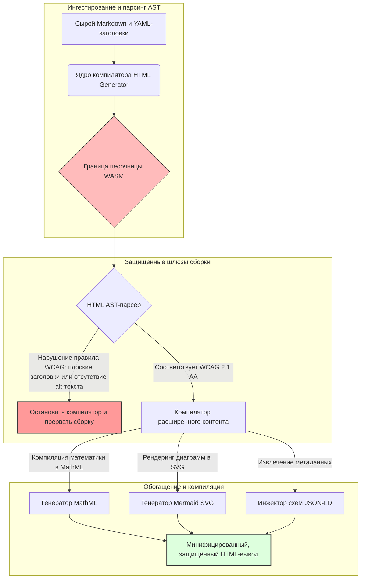

---

# Front Matter (YAML)

author: "contact@sebastienrousseau.com (Sebastien Rousseau)"
banner_alt: "Архитектурная геометрия в структурированном свете — символизирует роль HTML Generator как конвейера преобразования Markdown в HTML с контролем на этапе компиляции для доступных, SEO-готовых и изолированных инфраструктурных публикаций"
banner_height: "1597"
banner_width: "2584"
banner: "https://cloudcdn.pro/stocks/images/markus-winkler-IrRbSND5EUc-unsplash-1200.webp"
cdn: "https://cloudcdn.pro"
charset: "UTF-8"
cname: "sebastienrousseau.com"
copyright: "© Copyright 2025 - 2026 - Sebastien Rousseau. All rights reserved."
date: "June 20, 2026"
description: "HTML Generator — библиотека на Rust, преобразующая Markdown в WCAG-совместимый, SEO-оптимизированный HTML с JSON-LD: доступность как код, поддержка MathML и Mermaid, исполнение в изоляции WebAssembly для безопасных корпоративных публикаций."
format-detection: "telephone=no"
hreflang: "ru"
icon: "https://cloudcdn.pro/clients/sebastienrousseau/v1/logos/sebastienrousseau.svg"
id: "https://sebastienrousseau.com/2026-06-20-html-generator-accessible-seo-structured-markdown-rust-2026"
image_alt: "Чёрно-белый портрет Себастьяна Руссо"
image_height: "162"
image_width: "162"
image: "https://cloudcdn.pro/stocks/images/sebastienrousseau.webp"
keywords: "html-generator, Rust Markdown в HTML, доступность как код, WCAG 2.1 AA, SEO-оптимизированный HTML, JSON-LD, MathML, Mermaid, WebAssembly, EAA, DORA, ADA Title III, доступные публикации, изолированный парсинг, открытый исходный код"
language: "ru-RU"
last_reviewed: "2026-06-20"
layout: "report"
locale: "ru_RU"
logo_alt: "Логотип Себастьяна Руссо"
logo_height: "44"
logo_width: "44"
logo: "https://cloudcdn.pro/clients/sebastienrousseau/v1/logos/sebastienrousseau.svg"
menu: ""
measurementID: "G-169G4ET5HQ"
name: "Sebastien Rousseau"
permalink: "https://sebastienrousseau.com/2026-06-20-html-generator-accessible-seo-structured-markdown-rust-2026"
rating: "general"
referrer: "no-referrer"
robots: "index, follow"
schema: "FAQPage, Article"
seo_title: "Доступность как код: Markdown в AAA HTML с помощью Rust в 2026 году"
short_name: "sebastienrousseau"
subtitle: "Преобразование корпоративных веб-публикаций, технической документации и клиентских порталов из неструктурированных текстов в высокоорганизованные, соответствующие нормативным требованиям и изолированные цифровые активы."
tags: "html-generator, Rust, Markdown, доступность, WCAG, SEO, JSON-LD, MathML, Mermaid, WebAssembly, EAA, DORA, ADA, AI-поиск, RAG, открытый исходный код, банковская инфраструктура"
theme-color: "0, 83, 191"
title: "Преобразование Markdown в доступный, SEO-оптимизированный и структурированный HTML с помощью Rust в 2026 году"
url: "https://sebastienrousseau.com/2026-06-20-html-generator-accessible-seo-structured-markdown-rust-2026"
viewport: "width=device-width, initial-scale=1, shrink-to-fit=no"

# RSS - The RSS feed front matter (YAML).
atom_link: "https://sebastienrousseau.com/2026-06-20-html-generator-accessible-seo-structured-markdown-rust-2026/rss.xml"
category: "Technology"
docs: https://validator.w3.org/feed/docs/rss2.html
generator: "Static Site Generator (SSG) (version 0.0.40)"
item_description: "HTML Generator — библиотека на Rust, преобразующая Markdown в WCAG-совместимый, SEO-оптимизированный HTML с JSON-LD: доступность как код, поддержка MathML и Mermaid, исполнение в изоляции WebAssembly для безопасных корпоративных публикаций."
item_guid: "https://sebastienrousseau.com/2026-06-20-html-generator-accessible-seo-structured-markdown-rust-2026/rss.xml"
item_link: "https://sebastienrousseau.com/2026-06-20-html-generator-accessible-seo-structured-markdown-rust-2026/rss.xml"
item_pub_date: "Sat, 20 Jun 2026 06:06:06 +0000"
item_title: "Преобразование Markdown в доступный, SEO-оптимизированный и структурированный HTML с помощью Rust в 2026 году"
last_build_date: "Sat, 20 Jun 2026 06:06:06 +0000"
managing_editor: "contact@sebastienrousseau.com (Sebastien Rousseau)"
pub_date: "Sat, 20 Jun 2026 06:06:06 +0000"
ttl: "60"
type: "article"
webmaster: "contact@sebastienrousseau.com"

# Apple - The Apple front matter (YAML).
apple_mobile_web_app_orientations: "portrait"
apple_touch_icon_sizes: "192x192"
apple-mobile-web-app-capable: "yes"
apple-mobile-web-app-status-bar-inset: "black"
apple-mobile-web-app-status-bar-style: "black-translucent"
apple-mobile-web-app-title: "Markdown в AAA HTML с Rust"
apple-touch-fullscreen: "yes"

# MS Application - The MS Application front matter (YAML).

msapplication-navbutton-color: "0, 83, 191"

# Twitter Card - The Twitter Card front matter (YAML).

twitter_card: "summary_large_image"
twitter_creator: "@wwdseb"
twitter_description: "HTML Generator — библиотека на Rust, преобразующая Markdown в WCAG-совместимый, SEO-оптимизированный HTML с JSON-LD: доступность как код, поддержка MathML и Mermaid, изоляция WebAssembly для корпоративных публикаций."
twitter_image: "https://cloudcdn.pro/clients/sebastienrousseau/v1/logos/sebastienrousseau.svg"
twitter_image_alt: "Логотип Себастьяна Руссо"
twitter_site: "@wwdseb"
twitter_title: "Доступность как код: Markdown в AAA HTML с Rust"
twitter_url: "https://sebastienrousseau.com/2026-06-20-html-generator-accessible-seo-structured-markdown-rust-2026"

# Humans.txt - The Humans.txt front matter (YAML).
author_website: "https://sebastienrousseau.com"
author_twitter: "@wwdseb"
author_location: "London, UK"
thanks: "Благодарим за чтение!"
site_last_updated: "2026-06-20"
site_standards: "HTML5, CSS3, RSS, Atom, JSON, XML, YAML, Markdown, TOML"
site_components: "Kaishi, Kaishi Builder, Kaishi CLI, Kaishi Templates, Kaishi Themes"
site_software: "Static Site Generator, Rust"

---

# Преобразование Markdown в доступный, SEO-оптимизированный и структурированный HTML с помощью Rust в 2026 году

<!-- lead-start -->
<aside class="post-lead" aria-label="Краткое содержание статьи">

<strong>Кратко.</strong> HTML Generator — это чистый Rust-компилятор Markdown в HTML, обеспечивающий соответствие WCAG 2.1 AA на этапе сборки, инжектирующий схемо-совместимый JSON-LD, нативно рендерящий MathML и Mermaid SVG, и изолирующий парсинг в WebAssembly-песочнице — превращая публикацию в контролируемый конвейер с компиляционными шлюзами для доступности, SEO и безопасности ИКТ.

<strong>Ключевые выводы</strong>

<ul class="post-lead-takeaways">
  <li><strong>Краткий ответ.</strong> Что такое HTML Generator в одном предложении?</li>
  <li><strong>Краткое резюме.</strong> Рендеринг Markdown выглядит тривиально; корректный HTML корпоративного качества — это проблема соответствия нормативным требованиям.</li>
  <li><strong>01. Почему в 2026 году важен HTML-компилятор с приоритетом доступности.</strong> EAA и ADA Title III перевели доступность из инженерной гигиены в категорию фидуциарной ответственности.</li>
  <li><strong>02. Архитектурная модель HTML Generator 2026.</strong> Многоступенчатый конвейер с компиляционными шлюзами от сырого Markdown до защищённого HTML-вывода.</li>
</ul>

<strong>По теме:</strong> <a href="https://sebastienrousseau.com/2026-06-18-noyalib-safe-yaml-rust-ai-mcp-financial-infrastructure-2026">Почему YAML требует более безопасного стека Rust для AI, MCP и финансовой инфраструктуры в 2026 году</a>, Безопасный по умолчанию Static Site Generator для публикаций в эпоху AI в 2026 году, <a href="https://sebastienrousseau.com/2026-06-11-cloudcdn-open-source-blueprint-ai-native-edge-2026">CloudCDN: открытый проект для AI-нативной граничной инфраструктуры в 2026 году</a>.

</aside>
<!-- lead-end -->

В 2026 году веб-контент потребляется AI-поисковыми краулерами, LLM-поисковыми системами и конвейерами Retrieval-Augmented Generation (RAG) в той же мере, что и людьми. Неструктурированный или некорректный HTML снижает машинную обнаруживаемость, а несоблюдение строгих глобальных нормативных актов — таких как [Европейский акт о доступности (EAA)](https://www.accessibility-act.eu/) и [ADA Title III США](https://www.ada.gov/topics/title-iii/) — является однозначной гражданской ответственностью. [HTML Generator](https://github.com/sebastienrousseau/html-generator) — это высокопроизводительная Rust-библиотека, разработанная для устранения этих пробелов на уровне компилятора, а не в постразвёрточных патчах.

## Краткий ответ

**Что такое HTML Generator в одном предложении?** HTML Generator — это компилятор Markdown в HTML с открытым исходным кодом на чистом Rust, обеспечивающий [WCAG 2.1 AA](https://www.w3.org/TR/WCAG21/) на этапе сборки, автоматически генерирующий семантические ориентиры и ARIA-атрибуты, инжектирующий схемо-совместимые метаданные [JSON-LD](https://json-ld.org/) из YAML-заголовков, рендерящий диаграммы Mermaid и математические формулы в доступные SVG и MathML, и работающий в изоляции [WebAssembly](https://webassembly.org/) — превращая корпоративные публикации в конвейер с компиляционными шлюзами фидуциарного уровня.

## Краткое резюме

Рендеринг Markdown выглядит тривиально. HTML корпоративного качества — это проблема соответствия нормативным требованиям. В июне 2026 года каждая корпоративная точка контакта — порталы по связям с инвесторами, регуляторные раскрытия, клиентская документация, справочники API, маркетинговые ресурсы — обрабатывается как людьми, так и машинами. На каждой странице сталкиваются два давления: [EAA](https://www.accessibility-act.eu/) и [ADA Title III](https://www.ada.gov/topics/title-iii/) делают доступность юридическим риском на уровне совета директоров, тогда как AI-ингестирование и конвейеры RAG вознаграждают структурированный, машиночитаемый контент. Стандартные Markdown-библиотеки производят плоский HTML, не проходящий ни через один из этих шлюзов. HTML Generator рассматривает генерацию документов как конвейер с компиляционными шлюзами: валидация WCAG является ошибкой сборки, JSON-LD генерируется из YAML-заголовков без ручной разметки, MathML и Mermaid рендерятся в доступном формате, а весь движок поставляется как WASM-цель, чтобы парсинг недоверенных документов оставался изолированным от хоста.

## Ключевые выводы

- **Доступность как код — новый базовый стандарт.** EAA обязывает обеспечить доступность цифровых потребительских сервисов. HTML Generator оценивает дерево документа на этапе компиляции, автоматически генерируя семантические ориентиры и ARIA-атрибуты — меньше постразвёрточных исправлений, меньше бюджетов на устранение, ни одного пропущенного alt-текста в продакшне.
- **Структурированные данные для AI-поиска.** Современный поиск и RAG зависят от машиночитаемых метаданных. Компилятор анализирует YAML-заголовки и инжектирует [схемо-совместимый JSON-LD](https://schema.org/) непосредственно в заголовок документа, делая контент полностью интерпретируемым для [Google Rich Results](https://developers.google.com/search/docs/appearance/structured-data/intro-structured-data), [Bing Webmaster](https://www.bing.com/webmasters) и LLM-краулеров.
- **Совершенство технического контента.** Технические публикации — это не плоский текст. HTML Generator компилирует математические расширения Markdown в доступный [MathML](https://www.w3.org/Math/), а диаграммы [Mermaid.js](https://mermaid.js.org/) рендерит в адаптивные SVG — оба формата сохраняют WCAG-совместимую структуру вместо замены на непрозрачные изображения.
- **Изоляция WebAssembly.** Парсинг недоверенного Markdown является угрозой безопасности. Нацеливаясь на [WASM](https://webassembly.org/), HTML Generator выполняется в изолированной песочнице, предотвращающей произвольное выполнение кода и защищающей хост-систему — прямо выполняя обязательства по безопасности ИКТ согласно [DORA Article 6](https://eur-lex.europa.eu/legal-content/EN/TXT/?uri=CELEX%3A32022R2554).
- **Фидуциарная защита для советов директоров.** Техническое несоответствие переместилось в зал заседаний совета директоров. Стандартизация на HTML-движке с компиляционными шлюзами защищает директоров и высшее руководство от личной гражданской и регуляторной ответственности по DORA, EAA и ADA Title III.

**По теме:** [Почему YAML требует более безопасного стека Rust для AI, MCP и финансовой инфраструктуры в 2026 году](https://sebastienrousseau.com/2026-06-18-noyalib-safe-yaml-rust-ai-mcp-financial-infrastructure-2026/), Безопасный по умолчанию Static Site Generator для публикаций в эпоху AI в 2026 году, [CloudCDN: открытый проект для AI-нативной граничной инфраструктуры в 2026 году](https://sebastienrousseau.com/2026-06-11-cloudcdn-open-source-blueprint-ai-native-edge-2026/).

## 01. Почему в 2026 году важен HTML-компилятор с приоритетом доступности

Корпоративные веб-ресурсы, библиотеки документации и центры помощи по продуктам являются критически важными цифровыми точками контакта. Сегодня они подвергаются двум интенсивным, пересекающимся давлениям.

Первое — **AI-ингестирование и обнаруживаемость**. Контент всё чаще обрабатывается большими языковыми моделями и конвейерами Retrieval-Augmented Generation. Плоский или некорректный HTML затрудняет парсинг краулерами, оставляя корпоративные исследования и документацию невидимыми для современных парадигм поиска — включая [Google Search Generative Experience](https://blog.google/products/search/generative-ai-search/), просмотр [ChatGPT](https://chat.openai.com/) и корпоративные RAG-агенты.

Второе — **строгое глобальное законодательство о доступности**. В соответствии с [Европейским актом о доступности](https://www.accessibility-act.eu/) (полностью применимым с июня 2025 года) и [ADA Title III США](https://www.ada.gov/topics/title-iii/), корпоративные платформы публикаций обязаны гарантировать полную цифровую доступность. Несоблюдение [WCAG 2.1 AA](https://www.w3.org/TR/WCAG21/) — это уже не инженерный просчёт; это гражданская и регуляторная ответственность, повлёкшая многомиллионные мировые соглашения.

[HTML Generator](https://github.com/sebastienrousseau/html-generator) устраняет оба этих давления напрямую. Это потокобезопасная Rust-библиотека, предназначенная для преобразования Markdown в доступный, SEO-оптимизированный, структурированный HTML. Рассматривая генерацию документов как конвейер с компиляционными шлюзами, движок обеспечивает высокую **окупаемость устойчивости (RoR)** — защищая балансы от судебных разбирательств по доступности и максимизируя машиночитаемость для AI-поиска.

## 02. Архитектурная модель HTML Generator 2026

Фреймворк спроектирован как защищённый многоступенчатый конвейер компиляции, преобразующий сырой текст Markdown в криптографически верифицированные, высокодоступные статические активы.

### Таблица 1: Архитектурные уровни HTML Generator и снижение рисков

| Уровень | Архитектурное решение | Значение | Риск при некорректной обработке |
| ---- | ---- | ---- | ---- |
| **Уровень ввода** | Парсер Markdown и YAML-заголовков | Работает в привычной для авторов среде; разделяет прозу и структурные метаданные. | Несогласованные метаданные, нарушенные карты сайта, пробелы в индексировании. |
| **Структурный уровень** | Автоматическое оглавление и семантические ориентиры с ARIA-тегами | Производит навигируемые, доступные деревья документов по построению. | Плоский HTML, ломающий скринридеры и нарушающий WCAG. |
| **Уровень расширенного контента** | Нативный рендеринг MathML и Mermaid.js SVG | Компилирует формулы и диаграммы в доступные SVG и MathML. | Задержки рендеринга на стороне клиента и некорректный вывод для вспомогательных технологий. |
| **Уровень SEO и данных** | Интегрированная генерация JSON-LD и структурированных метаданных | Инжектирует совместимый с [Schema.org](https://schema.org/) JSON-LD непосредственно в заголовок. | Поисковые системы и AI-краулеры неверно интерпретируют автора, контекст, лицензирование. |
| **Уровень исполнения** | Нативный Rust-компилятор с WASM-целью | Обеспечивает безопасное, изолированное выполнение на серверах, граничных узлах и в браузерах. | Произвольное выполнение кода при парсинге недоверенного Markdown. |

## 03. Ключевые показатели веб-безопасности и доступности

Для проверки того, что публично доступные активы соответствуют современным регуляторным и аудиторским требованиям безопасности, старшие технологические директора должны отслеживать конкретные, измеримые метрики.

### Таблица 2: Показатели веб-безопасности и доступности

| Показатель | Метрика / операционный ориентир | Ссылка EAA / DORA / W3C | Техническая реализация |
| ---- | ---- | ---- | ---- |
| **Соответствие доступности** | 100% скомпилированных страниц проверены по правилам WCAG 2.1 AA. | [EAA](https://www.accessibility-act.eu/) и [ADA Title III](https://www.ada.gov/topics/title-iii/) | HTML-парсер на этапе сборки, оценивающий alt-теги изображений и семантические ориентиры. |
| **Песочница WASM** | 100% недоверенных Markdown-входов компилируется в изолированной среде WebAssembly. | [DORA Article 6](https://eur-lex.europa.eu/legal-content/EN/TXT/?uri=CELEX%3A32022R2554) (безопасность ИКТ) | Изоляция среды парсинга от хост-сервера. |
| **Покрытие структурированными метаданными** | 100% опубликованных статей с инжектированными, схемо-совместимыми JSON-LD заголовками. | Спецификации [Schema.org](https://schema.org/) | Автоматический парсинг заголовков и преобразование в объекты JSON-LD. |
| **Пропускная способность компиляции** | Целевое значение: более 10 000 страниц в секунду на стандартном оборудовании. | Окупаемость устойчивости (RoR) | Высокопараллельный Rust AST-компилятор. |
| **Верификация расширенных сниппетов** | Ноль ошибок парсинга при запуске [Google Rich Results](https://search.google.com/test/rich-results) и [Schema validator](https://validator.schema.org/). | Руководства Google Search | Структурная валидация сгенерированного JSON-LD в конвейере сборки. |

## 04. Миф о простом рендеринге Markdown

Распространённое заблуждение среди технологических менеджеров состоит в том, что конвертация Markdown в HTML — это простая задача замены текста. Многие стандартные библиотеки переводят форматирование Markdown в плоский, неструктурированный HTML. Результат отображается для зрячего пользователя в браузере, но представляет собой ловушку соответствия нормативным требованиям.

Плоскому HTML, как правило, не хватает трёх вещей.

1. **Корректные иерархии заголовков.** Стандартный Markdown не обеспечивает порядок заголовков. Переход от `<h1>` к `<h4>` нарушает WCAG 2.1 AA и ломает навигацию по документу для скринридеров.
2. **Явная семантика таблиц.** Стандартные Markdown-таблицы редко рендерятся с корректными атрибутами `<th>` scope и `<tbody>`, необходимыми для доступного парсинга.
3. **Машиночитаемые метаданные.** Стандартный HTML лишён JSON-LD-хуков, от которых зависят современные AI-поисковые платформы и системы ингестирования RAG.

HTML Generator решает эту проблему, анализируя Markdown в **абстрактное синтаксическое дерево (AST)**. Движок оценивает структуру документа перед генерацией HTML, проверяя вложенность заголовков, инжектируя соответствующие ARIA-атрибуты и подтверждая, что каждый медиа-актив содержит альтернативный текст — превращая доступность из ручного аудита в гарантированный инвариант на этапе компиляции.

## 05. Разработка конвейера сборки «доступность как код»

Чтобы предотвратить публичное развёртывание недоступных или неиндексируемых активов, доступность должна быть строгим шлюзом компилятора. Следующий конвейер показывает, как HTML Generator оценивает Markdown, выполняет валидацию в изоляции WebAssembly и генерирует защищённый, структурированный HTML.

## 06. Регламент совета директоров и фидуциарная ответственность

Соответствие требованиям доступности и веб-безопасности в 2026 году — неотъемлемые вопросы повестки совета директоров. Высшее руководство должно подходить к инфраструктуре публикаций через призму правового риска, сохранения финансовых ресурсов и регуляторной ответственности.

- **Европейский акт о доступности (EAA).** Налагает прямые, юридически обязательные требования соответствия на публичные и частные цифровые порталы. Несоблюдение может повлечь серьёзные финансовые санкции, гражданские судебные иски и немедленный отзыв актива с рынка ЕС. Интегрируя доступность как код, советы директоров могут удостовериться, что несоответствующий код не может быть выпущен — превращая реактивное устранение в структурную правовую защиту.
- **DORA Article 6 (Безопасные среды ИКТ).** Устанавливает строгие правила безопасности ИКТ-сред. Изолируя компиляцию Markdown в WebAssembly-песочнице, организации гарантируют, что парсинг загружаемой клиентами документации или партнёрских каналов не может подвергнуть хост-серверы произвольному выполнению кода, защищая критически важные банковские порталы.
- **Снижение затрат на аудит соответствия.** Традиционное соответствие требованиям доступности опирается на дорогостоящие, ретроспективные постразвёрточные аудиты — десятки тысяч долларов ежегодно на сайт. Внедрение валидации WCAG как блокирующего условия компиляции устраняет эти ретроспективные затраты, перенаправляя бюджет соответствия от защиты к инновациям.

## 07. Что это означает по типу банка / предприятия

### Глобально системно значимые банки (G-SIB)

G-SIB управляют масштабными, многоязычными публичными ресурсами, публикующими тысячи исследовательских материалов, регуляторных раскрытий и документов для инвесторов в нескольких юрисдикциях. Их задача — масштаб и многоязычный паритет. WASM-цель HTML Generator и высокопроизводительный Rust-движок позволяют обновлять, компилировать и развёртывать глобально локализованные исследовательские библиотеки в течение секунд — без задержек рендеринга и регрессий доступности.

### Транзакционные и корпоративные банки

Для транзакционных банков клиентские порталы, документационные хабы и руководства API для разработчиков являются критически важными цифровыми точками контакта. Компиляция этих активов через HTML Generator означает, что клиентские каналы не несут уязвимостей XSS, векторов подмены зависимостей и дефицитов доступности — сохраняя институциональное доверие и сокращая судебный риск.

### Региональные банки и финтех-компании

Региональные банки и гибкие финтех-компании конкурируют на уровне цифрового опыта без бюджетов инженерии G-SIB. HTML Generator предоставляет этим командам корпоративный конвейер публикаций из коробки, позволяя небольшим структурам выпускать доступные, SEO-оптимизированные, изолированные активы, выдерживающие проверку как со стороны регуляторов, так и потенциальных корпоративных клиентов.

## 08. Дорожная карта инфраструктуры публикаций

Публично доступные корпоративные веб-ресурсы являются ключевым компонентом операционной устойчивости. Использование медленных, динамически уязвимых, работающих на базе данных веб-движков — или неподписанных статических активов — представляет собой неприемлемый бизнес-риск.

Для защиты публичных цифровых точек контакта и ограждения балансов от судебных разбирательств по доступности старшие технологические и директора по безопасности должны реализовывать чёткую дорожную карту.

1. **Переход на статические архитектуры.** Вывести из эксплуатации унаследованные динамические CMS-платформы для исследовательских, маркетинговых и документационных ресурсов. Перенести контент в конвейеры с компиляционными шлюзами, такие как HTML Generator.
2. **Обеспечение доступности на этапе сборки.** Внедрить доступность как код. Автоматически прерывать конвейеры компиляции при любом нарушении WCAG 2.1 AA.
3. **Изоляция парсинга в WebAssembly.** Заключить в песочницу весь парсинг документов и контента в WASM-среде, чтобы недоверенный ввод никогда не касался хост-систем.
4. **Инжекция расширенных JSON-LD метаданных.** Обеспечить наличие схемо-совместимых JSON-LD заголовков в каждом опубликованном активе для максимизации AI-обнаруживаемости.

## 09. Часто задаваемые вопросы

**Как HTML Generator обеспечивает доступность?**

Он анализирует сгенерированное HTML-абстрактное синтаксическое дерево на этапе сборки, оценивая документ по правилам [WCAG 2.1 AA](https://www.w3.org/TR/WCAG21/). При нарушении правила — отсутствующий атрибут alt, пропуск заголовка, непомеченный элемент управления формой — компилятор прерывает сборку, рассматривая доступность как инвариант на этапе компиляции, а не как задачу постразвёрточного аудита.

**Почему важна изоляция WebAssembly?**

[WebAssembly](https://webassembly.org/) позволяет движку парсинга Markdown выполняться в изолированной песочнице, отделённой от хост-сервера. Даже когда злоумышленник загружает специально сформированный Markdown-документ, предназначенный для эксплуатации уязвимостей парсера, выполнение блокируется — защищая хост-системы и выполняя обязательства по безопасности ИКТ согласно DORA Article 6.

**Как JSON-LD повышает обнаруживаемость в поиске в 2026 году?**

[JSON-LD](https://json-ld.org/) предоставляет структурированные, машиночитаемые метаданные в заголовке документа. [Google Rich Results](https://developers.google.com/search/docs/appearance/structured-data/intro-structured-data), краулеры Bing и LLM-поисковые агенты немедленно идентифицируют автора, лицензию, дату публикации и семантический контекст — обходя неоднозначность стандартного HTML и увеличивая охват в AI-ориентированном поиске.

**Кто является целевой аудиторией HTML Generator?**

Разработчики статических сайтов, команды документации, технические писатели, Rust-разработчики и инженеры платформ, разворачивающие критически важные для доступности или регуляторные ресурсы. Это также жизнеспособный уровень обработки контента внутри более крупных конвейеров безопасных публикаций, таких как [Static Site Generator (SSG)](https://github.com/sebastienrousseau/static-site-generator).

## 10. Источники

- World Wide Web Consortium (W3C), 2024. [Руководство по доступности веб-контента (WCAG) 2.1 ⧉](https://www.w3.org/TR/WCAG21/ "Web Content Accessibility Guidelines 2.1").
- Schema.org, 2026. [Спецификации структурированных данных Schema.org ⧉](https://schema.org/ "Schema.org structured-data specifications").
- Европейский парламент и Совет Европейского союза, 2022. [Регламент (ЕС) 2022/2554 о цифровой операционной устойчивости финансового сектора (DORA) ⧉](https://eur-lex.europa.eu/legal-content/EN/TXT/?uri=CELEX%3A32022R2554 "DORA Regulation").
- Европейская комиссия, 2025. [Европейский акт о доступности ⧉](https://www.accessibility-act.eu/ "European Accessibility Act").
- Министерство юстиции США, 2024. [ADA Title III ⧉](https://www.ada.gov/topics/title-iii/ "ADA Title III").
- Сообщество WebAssembly, 2026. [Спецификация WebAssembly ⧉](https://webassembly.org/ "WebAssembly").
- GitHub, 2026. [Репозиторий HTML Generator ⧉](https://github.com/sebastienrousseau/html-generator "HTML Generator open-source repository").

<!-- enrich-start -->
<aside class="author-card" aria-label="Об авторе"><strong class="author-card-name"><a href="/about/index.html">Sebastien Rousseau</a></strong>Старший банковский технолог, пишущий о практическом применении AI, платёжной инфраструктуре, токенизированных деньгах, ISO 20022, постквантовой безопасности, cloud-native финансовых услугах, инфраструктуре с открытым исходным кодом и регулируемых цифровых рынках.Более 20 лет опыта в HSBC Commercial &amp; Investment Bank, PayPal, Barclays, Shazam, AKQA, Virgin Group. <a href="/about/index.html">Полный профиль</a> &middot; <a href="https://www.linkedin.com/in/sebastienrousseau/" rel="external noopener">LinkedIn</a> &middot; <a href="https://github.com/sebastienrousseau" rel="external noopener">GitHub</a></aside>

Последняя проверка <time datetime="2026-06-20">2026-06-20</time>.

<!-- enrich-end -->
