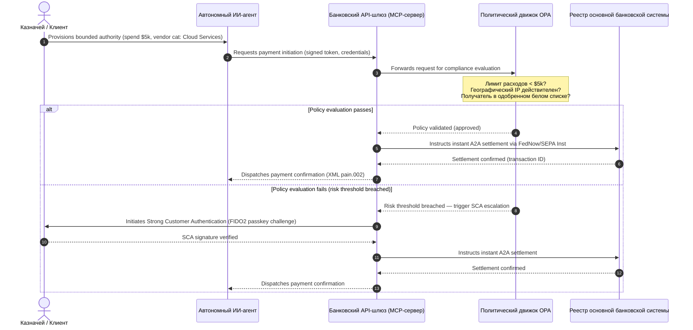

# Обзор глобальных платежей 2026: операционная модель, риски и доходы в агентском, невидимом и работающем в реальном времени мире

Глобальный платёжный цикл 2026 года определяется тремя сходящимися силами — агентской коммерцией, невидимыми встроенными платежами и исполнением в реальном времени — поверх токенизированного единого реестра в рамках Project Agorá и жёсткого срока перехода SWIFT на структурированные адреса в ноябре 2026 года.

<!-- lead-start -->
<aside class="post-lead" aria-label="Article summary">

<strong>TL;DR.</strong> Платёжный ландшафт 2026 года перешёл от миграции сообщений к многомерной операционной модели, где риски и доходы диктуются исполнением в реальном времени. В материале сведены прогнозы J.P. Morgan, Global Payments, HSBC и Payments Association на 2026 год в четырёхопорный операционный план G-SIB, охватывающий агентскую коммерцию с инициированием транзакций моделями, всегда доступные казначейские API, токенизированные единые реестры в рамках BIS Project Agorá и срок 14 ноября 2026 года для структурированных адресов SWIFT.

<strong>Ключевые выводы</strong>

<ul class="post-lead-takeaways">
  <li><strong>Агентская коммерция открывает рубеж делегированной ответственности.</strong> По прогнозам, автономные ИИ-агенты будут опосредовать $3-$5 трлн годовой коммерции к 2030 году. Банки должны определить контроль доступа MCP, делегирование SCA в рамках PSD3/PSR и закрепить ответственность за KYC/AML в платёжных цепочках с несколькими агентами.</li>
  <li><strong>Всегда доступная ликвидность стала операционной и регуляторной нормой.</strong> Казначейские API 24/7 и виртуальные счета минимизируют застрявшие средства и повышают планку устойчивости. По требованиям DORA продукты ликвидности в реальном времени должны опираться на гео-резервированную инфраструктуру active-active с доступностью 99,999%.</li>
  <li><strong>Токенизация выросла до регулируемых единых реестров.</strong> Project Agorá — крупнейший государственно-частный фреймворк для токенизированных депозитов коммерческих банков и резервов центральных банков. Банкам нужен пятишаговый путь токенизации с явным пруденциальным режимом.</li>
  <li><strong>Переход на структурированные адреса 14 ноября 2026 года имеет жёсткую дату.</strong> Неструктурированные поля почтовых адресов в сообщениях CBPR+ и SEPA вызовут немедленные отказы. Требуется чистое управление данными в продуктовых, технологических и комплаенс-командах.</li>
</ul>

<strong>По теме:</strong> <a href="https://sebastienrousseau.com/2026-06-23-iso-20022-pain001-programmable-liquidity-autonomic-treasury-2026">From Pain.001 to Programmable Liquidity: ISO 20022 as the Autonomic Nervous System of Treasury in 2026</a>, <a href="https://sebastienrousseau.com/2026-06-24-cross-border-iso-20022-open-finance-tokenised-deposits-treasury-2026">Cross-Border 2026: ISO 20022, Open Finance and Tokenised Deposits in Corporate Treasury</a>, <a href="https://sebastienrousseau.com/2026-06-25-quantum-dawn-cib-kyberlib-quantum-resilient-payments-stack-2026">Quantum Dawn for CIB: From KyberLib to a Quantum-Resilient Payments Stack</a>.

</aside>
<!-- lead-end -->

Для глобальных транзакционных банков цикл 2026-2028 годов — это структурное окно возможностей. Современная платёжная инфраструктура больше не административная утилита — это ядро банковской технологической стратегии. Внутри G-SIB и крупных региональных институтов технологии, регулирование и ожидания клиентов сошлись в одной операционной плоскости.

Три силы определяют этот цикл, и каждая напрямую соответствует приоритету топ-менеджмента.

- **Агентская коммерция** — дистрибуция каналов, дизайн продуктов, распределение ответственности и Model Risk Management под надзорным контролем.
- **Невидимые платежи** — клиентский опыт с риском дезинтермедиации там, где банки не встраивают свой реестр в корпоративные и торговые фронт-энды.
- **Исполнение в реальном времени** — скорость капитала, влекущая изменения в управлении ликвидностью, кредитном риске, операционной устойчивости и защите от мошенничества.

Финансовые ставки существенны. Мошенничество масштабируется по скорости и изощрённости; регуляторные сроки жёсткие; банки, проактивно модернизирующие свои основные системы, открывают значительные возможности комиссионных доходов. Цена бездействия противоположна: немедленные отказы транзакций, операционные узкие места, регуляторные штрафы и быстрая эрозия доли рынка.

## Сходимость глобальных платёжных авторитетов

В отчёте сведены платёжные и торговые прогнозы 2026 года от четырёх авторитетных отраслевых голосов — [J.P. Morgan Payments](https://www.jpmorgan.com/payments/newsroom/payments-outlook-2026-trends-report-released "J.P. Morgan Payments — Outlook 2026"), [Global Payments](https://investors.globalpayments.com/news-events/press-releases/detail/497/global-payments-releases-its-2026-commerce-and-payment "Global Payments — 2026 Commerce and Payment Trends Report"), HSBC и The Payments Association — и сопоставлены с [G20 Roadmap for Enhancing Cross-Border Payments](https://www.fsb.org/2026/03/fsb-kicks-off-new-implementation-phase-to-enhance-cross-border-payments-through-public-private-partnership/ "FSB — cross-border payments implementation phase, March 2026").

Каждая организация подходит к экосистеме с разного рыночного угла, но их выводы сходятся на трёх инвариантах.

1. **Мгновенные платёжные каналы на основе API — это базовая норма.** Старые модели пакетной обработки маргинализированы для трансграничных и крупных потоков; скорость транзакций в этих сегментах диктуется всегда доступным обменом сообщениями в реальном времени.
2. **ИИ — это и угроза, и защита.** Генеративные инструменты и дипфейки масштабируют мошенничество с транзакциями, что требует многоуровневой защиты на основе машинного обучения в реальном времени.
3. **Токенизация — это инфраструктура, готовая к промышленной эксплуатации.** Реестры объединяются для размещения токенизированных коммерческих обязательств и оптовых цифровых валют центральных банков.

| Отчёт | Основная аудитория | Фокус | Ключевая опора | Импликация для банка |
| --- | --- | --- | --- | --- |
| **J.P. Morgan Payments** | Корпоративные казначеи, G-SIBs | Real-time liquidity, fraud | APIs, AI biometrics | Rebuild liquidity, FX, and risk systems for continuous 365-day settlement. |
| **Global Payments** | Merchants, e-commerce | POS evolution, omnichannel | Agentic commerce, frictionless checkout | Build secure, API-gated merchant payment corridors for autonomous AI agents. |
| **HSBC Insights** | Multinational corporates | ERP integrations (SAP/Oracle), real-time cash | Treasury-as-a-Service, cash visibility | Monetise transactional API suites and embed real-time cash ledger reporting at source. |
| **The Payments Association** | Fintechs, payment institutions | Stablecoins, tokenisation, global regulation | Regulated digital assets, policy compliance | Prepare balance sheets for tokenised deposits and navigate PSD3/PSR liability structures. |

Четыре прогноза фактически определяют операционный стек частного сектора, работающий поверх инфраструктуры публичной политики G20, переводя политические намерения в конкретные решения по ликвидности, токенизации, данным и контролю мошенничества внутри банков.

## Опора 1 — Агентская коммерция и невидимые платежи

Агентская коммерция — это переход от чек-аута «купить в один клик», управляемого человеком, к инициированию транзакций моделями. Отраслевые прогнозы сходятся на $3-$5 трлн годовой коммерции, опосредованной автономными агентами к 2030 году — это однозначный процент глобального платёжного объёма, исполняемый без человеческого клика «купить».

В розничной и коммерческой экосистеме есть соответствующий разрыв. Явное большинство потребителей теперь ожидают почти безфрикционных платежей, однако менее половины продавцов отдали приоритет чек-ауту в один клик или каталогам товаров, доступным через API. ИИ-агенты не могут проходить устаревшие многостраничные экраны чек-аута, рассчитанные на человеческий глаз; им нужны структурированные API-рукопожатия типа «машина-машина».

### Приоритеты банка и операционные последствия

- **Ответственность за KYC и AML.** Банки должны определить, кто несёт комплаенс-обязательство внутри агентской цепочки транзакций. Если личный ИИ-агент потребителя инициирует транзакцию через агентский чек-аут продавца, банк должен убедиться, что инициирующие делегированные полномочия криптографически привязаны к основному владельцу счёта.
- **Перепроектирование ответственности и возвратных платежей.** Карточные схемы и каналы A2A проектировались вокруг человеческой авторизации. Когда ИИ-агент совершает ошибочную покупку — например, заказывает неверный промышленный запас из-за ошибки разбора данных — банки должны чётко распределить ответственность между потребителем, поставщиком агента и продавцом.
- **Рисковая оценка агентских потоков.** Движки маршрутизации платежей должны динамически оценивать риск агентских платежей, применяя более высокие резервные требования или ставки интерчейнджа к нечеловеческим транзакциям до тех пор, пока не накопится стабильная история расчётов.

### Ограниченное действие и ограниченные полномочия

Чтобы смягчить «неограниченное действие» — корпоративный агент закупок, запускающий бесконечный рекурсивный цикл закупок из-за программного сбоя — банки должны развернуть **API-шлюзы с ограниченными полномочиями**. Шлюзы обеспечивают политические лимиты в трёх измерениях.

1. **Многоуровневые финансовые лимиты** — расходы агента ограничены по размеру транзакции, суточному совокупному значению и категории продавца.
2. **Контекстно-зависимые предохранители** — вторичные сигналы (время суток, IP-геолокация, частота транзакций) оцениваются до того, как реестр высвободит средства.
3. **Эскалация с участием человека** — обязательная человеческая авторизация через Strong Customer Authentication (SCA) в рамках PSD3 / PSR срабатывает всякий раз, когда транзакция превышает рисковые пороги.

Диаграмма Mermaid ниже показывает целевую архитектуру, которую многие банки узнают как агентский платёжный поток с ограниченными полномочиями.

### Model Context Protocol (MCP)

Чтобы подключить локализованные ИИ-модели к управляемым банком исполнительным слоям, отрасль стандартизируется вокруг [Model Context Protocol (MCP)](https://modelcontextprotocol.io "Model Context Protocol — open standard for LLM tool integration") — открытого протокола, позволяющего LLM вызывать чётко ограниченные, проверяемые инструменты и API без прямого доступа к основным системам.

Обёртывание банковских API (инициирование платежа, запрос баланса, верификация контрагента) внутри MCP-сервера удерживает LLM вдали от таблиц баз данных и системных root-контролей. Модель взаимодействует с реестром только через структурированные, проверяемые конечные точки с ограничением скорости — безопасность обеспечивается на границе исполнения агентских инструментов, а не закопана внутри модели.

## Опора 2 — Трансформация казначейства и переосмысленная ликвидность

Скорость транзакционного банкинга в 2026 году задаётся переходом от пакетной обработки в конце дня к всегда доступным казначейским операциям в реальном времени. Многонациональные корпорации больше не терпят застрявших средств — ликвидности, простаивающей на локальных счетах в выходные или праздники из-за закрытых расчётных систем.

### Экономическое обоснование ликвидности в реальном времени

J.P. Morgan и HSBC сообщают, что корпорации с продвинутыми возможностями обработки денежных потоков и данных в реальном времени с существенно большей вероятностью обгоняют конкурентов по росту выручки и эффективности капитала, главным образом за счёт сокращения застрявшей ликвидности и оптимизации циклов оборотного капитала.

Чтобы захватить эту ценность, банки выпускают **API-продукты Treasury-as-a-Service (TaaS)**, позволяющие корпоративным ERP (SAP, Oracle) подключаться напрямую к реестру банка.

- **API балансов в реальном времени** на схеме `camt.052` — заменяют протоколы передачи файлов мгновенной, событийно-управляемой отчётностью о денежных позициях.
- **API массового инициирования платежей** на `pain.001` — прямое сквозное исполнение пакетов платежей поставщикам из реестра ERP.
- **API непрерывного FX** — казначейские движки фиксируют курсы обмена валют алгоритмически в реальном времени для трансграничного расчёта, устраняя риск рыночного разрыва за ночь.
- **API виртуальных счетов** — корпорации динамически создают и закрывают тысячи субсчетов для автоматизированного сопоставления дебиторской задолженности и разделения реестра.

### Операционная устойчивость и DORA

Предложение всегда доступной ликвидности трансформирует профиль рисков банка. Платформа должна обеспечивать **99,999% операционной доступности** под непрерывной нагрузкой в реальном времени.

В рамках [Digital Operational Resilience Act (DORA)](https://eur-lex.europa.eu/legal-content/EN/TXT/?uri=CELEX%3A32022R2554 "Regulation (EU) 2022/2554 — Digital Operational Resilience Act") это не ИТ-KPI — это строгое регуляторное требование. Регуляторы ожидают, что банки докажут способность поверхности казначейских API в реальном времени и базы данных реестра поглощать жёсткие, но правдоподобные кибератаки, сетевые отказы и сбои гиперскейлеров без прерывания критических платежей или ущерба для системной ликвидности. Это требует гео-резервированных, active-active мультиоблачных архитектур баз данных, слоёв обнаружения угроз в реальном времени и автоматизированного отказоустойчивого переключения — видимых в строке расходов на изменения, а не только в аудиторском досье.

### Непрерывный FX и трансграничные инновации

Казначейство в реальном времени не может жить в границах одной валюты. G-SIB развёртывают инфраструктуру непрерывного FX — платформа [Wire 365](https://www.jpmorgan.com/insights/payments/fx-cross-border/wire-365-global-clearing "J.P. Morgan — Wire 365 global clearing reinvented") от J.P. Morgan обрабатывает трансграничные платежи и валютные конвертации в любой день года, за пределами традиционных часов RTGS центрального банка. Этот слой напрямую сопрягается с системами токенизированных депозитов и единых реестров, обсуждаемыми в Опоре 3.

## Опора 3 — Токенизированные депозиты и единый реестр

Токенизация выросла из изолированных пилотных проектов уровня proof-of-concept в масштабируемую, банковского уровня денежную инфраструктуру. Фокус сместился с частных стейблкоинов и спекулятивных криптоактивов на **токенизированные депозиты коммерческих банков** и **оптовые цифровые валюты центральных банков (wCBDC)**, работающие на программируемых единых реестрах.

Эталонным фреймворком является [Project Agorá](https://www.bis.org/about/bisih/topics/fmis/agora.htm "BIS Project Agorá — tokenisation of wholesale cross-border payments") — крупное государственно-частное сотрудничество, созванное BIS и IIF, с участием семи центральных банков и более 40 частных финансовых институтов. Проект изучает, как токенизированные депозиты коммерческих банков интегрируются с токенизированными оптовыми CBDC на общем программируемом реестре для устранения трений трансграничного расчёта, координации комплаенс-проверок и обеспечения атомарной финальности 24/7.

### Пятишаговый путь токенизации

Для G-SIB и крупных региональных банков токенизация — это пошаговый путь от внутренней оптимизации к открытой рыночной совместимости.

1. **Внутренняя казначейская ликвидность** — токенизация внутренних корпоративных денежных балансов (например, JPM Coin или эквивалентные частные банковские реестры) для обеспечения мгновенного, круглосуточного трансграничного перевода и неттинга между собственными филиалами банка.
2. **Ограниченные многобанковские коридоры** — закрытые, регулируемые консорциумы (песочница Project Agorá) для тестирования межбанковских расчётов и состояния общего реестра между различными институтами.
3. **Непрерывный программируемый FX** — смарт-контракты на едином реестре исполняют мгновенный FX по принципу Payment-versus-Payment (PvP), устраняя риск расчёта между часовыми поясами.
4. **Токенизированные реальные активы (RWA)** — токенизированная денежная сторона интегрируется с токенизированными ценными бумагами, долговыми обязательствами или торговыми реестрами для мгновенной финальности Delivery-versus-Payment (DvP), сокращая блокировку капитала с дней до миллисекунд.
5. **Регулируемая публичная/гибридная совместимость** — обёртки безопасных шлюзов позволяют институциональной ликвидности безопасно взаимодействовать с открытыми публичными сетями.

### Пруденциальные и балансовые последствия

К токенизированным деньгам нужно подходить через пруденциальные фреймворки с осторожностью. Надзорные органы подчёркивают, что токенизированный депозит должен быть экономически эквивалентен традиционному депозиту коммерческого банка — то есть необеспеченным обязательством на балансе банка с тем же страхованием вкладов.

Операционно токенизированные депозиты вносят риски, которые классические модели стресс-тестирования ликвидности не были рассчитаны симулировать. Смарт-контракты исполняют программируемые снятия со скоростями и объёмами, которые устаревшие допущения не охватывают. В рамках Basel III банки должны обеспечить, чтобы рисковый движок мог моделировать программируемые оттоки денежных средств, а токенизированный реестр чисто взаимодействовал с устаревшими системами RTGS на протяжении ежедневного цикла ликвидности.

### Стейблкоины против токенизированных депозитов — нюансированная позиция

Частные полностью обеспеченные стейблкоины (USDC и др.) продолжают захватывать долю рынка в розничных трансграничных переводах и децентрализованной коммерции, но не обладают способностью создавать кредит и финальностью расчёта коммерческой банковской системы.

Вместо конкуренции на розничных каналах транзакционные банки выстраивают кастоди, выпускают собственные регулируемые токенизированные обязательственные инструменты и строят безопасные шлюзы on-/off-ramp. Корпоративные клиенты получают программную гибкость, сохраняя капитал внутри регулируемого периметра.

### Вопросы, которые совет директоров должен задать о токенизированных деньгах

- **Участие в едином реестре.** Какова наша активная стратегическая дорожная карта участия в оптовых государственно-частных инициативах единого реестра, таких как Project Agorá?
- **Балансовое и рисковое моделирование.** Обновили ли наши рисковые движки и фреймворки достаточности капитала стресс-тестирование, чтобы учесть скорость оттоков токенов, инициируемых смарт-контрактами?
- **Сегменты клиентов первой волны.** Какие из наших сегментов корпоративного казначейства и коммерческого банкинга получат немедленную выгоду от программируемого, токенизированного расчёта DvP/PvP?

## Опора 4 — Структурированные данные и защита от мошенничества

Инфраструктурный комплаенс в 2026 году доминируется **переходом на структурированные адреса 14 ноября 2026 года**, установленным в [SWIFT Standards Release (SR) 2026](https://www.swift.com/standards/iso-20022/removal-unstructured-address "SWIFT — Removal of unstructured address, November 2026"). С этой даты платёжные сети CBPR+ и SEPA прекращают принимать полностью неструктурированные блоки почтовых адресов в свободной форме (`<AdrLine>`) в платёжных сообщениях. Любое трансграничное или внутреннее сообщение, несущее неструктурированный адрес там, где ожидаются структурированные элементы, будет задержано или отклонено сетью.

Большинство институтов знает дату. Многие рассматривают её как поверхностное упражнение по маппингу на интерфейсном слое. На деле это более глубокая задача качества и управления данными. Чтобы избежать катастрофических уровней отказов, платёжным операциям нужна чёткая кросс-функциональная управленческая рамка.

- **Продукт и операции.** Захват данных у источника. Клиентские цифровые порталы, интерфейсы онбординга и поля ввода корпоративных ERP должны обеспечивать структурированные поля адреса (`<StrtNm>`, `<PstCd>`, `<TwnNm>`, `<Ctry>`) в момент инициирования платежа.
- **Технологии.** Парсинг, маппинг, валидация схем. Движки валидации блокируют устаревшие файлы до того, как они попадают на интерфейс SWIFT. Локально развёрнутые модели машинного обучения разбирают устаревшие неструктурированные блоки адресов в XML-совместимые теги под `<PstlAdr>`.
- **Комплаенс и риски.** Проверка санкционных списков, мониторинг транзакций и логика AML обновлены для приёма структурированных XML-полей — что снижает уровни ложных срабатываний и ручных расследований.

### Бизнес-обоснование структурированных данных

Если рассматривать программу структурированных данных как комплаенс-затраты — она дорога. Если как стимулятор доходов — она окупает себя.

1. **Продвинутое кредитное решение.** Структурированные данные о счетах-фактурах, переводных назначениях и конечном должнике позволяют банкам строить автоматизированные, точные программы финансирования оборотного капитала и факторинга счетов в цепочке поставок для корпоративных клиентов.
2. **Автоматизированное сопоставление дебиторской задолженности.** Раскрытие структурированных идентификаторов сторон и счетов-фактур поддерживает премиальные продукты сверки денежных средств и пулинга виртуальных счетов, генерируя новые комиссионные доходы.
3. **Монетизируемая аналитика транзакций.** Банки упаковывают и продают детализированные дашборды аналитики ликвидности и закупочных паттернов в реальном времени корпоративным финансовым директорам и казначеям.

### Многослойная ИИ-защита от мошенничества

По мере ускорения скоростей транзакций до реального времени мошеннические техники масштабируются. Недавние исследования показывают, что дипфейки составляют около 40% попыток биометрического мошенничества, при этом синтетические медиа всё чаще используются для обхода контроля голосового и лицевого распознавания в потоках онбординга и платежей.

Защита — это **трёхслойная модель ИИ против мошенничества**.

1. **Слой идентификации.** Биометрически верифицированные ключи доступа [FIDO2](https://fidoalliance.org/fido2/ "FIDO Alliance — FIDO2 specification"), криптографически подписанная привязка к устройствам и децентрализованные цифровые ID-кошельки для защиты доступа к платежам.
2. **Поведенческий слой.** Непрерывная поведенческая биометрия — темп навигации в сессии, ритм набора, ориентация устройства — для обнаружения автоматизированного исполнения ботами или попыток перехвата сессии.
3. **Слой транзакций.** Структурированные поля ISO 20022 питают рисковые движки машинного обучения в реальном времени, сопоставляя метаданные транзакций с общесетевой консорциальной разведкой для выявления подозрительных транзакций в течение миллисекунд после инициирования.

Чтобы удовлетворить надзорные органы, ИИ-модели слоя транзакций включают строгие **параметры интерпретируемости** и работают в рамках выделенной программы Model Risk Management (MRM). Регуляторы ожидают, что банки объяснят конкретные точки данных и алгоритмическую логику, вызвавшую автоматическую блокировку или предупреждение о мошенничестве, в соответствии с [US Federal Reserve SR 11-7](https://www.federalreserve.gov/frrs/guidance/supervisory-guidance-on-model-risk-management.htm "US Federal Reserve — Supervisory Guidance on Model Risk Management, SR 11-7") и [PRA SS1/23](https://www.bankofengland.co.uk/prudential-regulation/publication/2023/may/model-risk-management-principles-for-banks-ss "Bank of England PRA SS1/23 — Model Risk Management principles for banks") Банка Англии.

## Повестка совета директоров 2026-2028

Чтобы реализовать все четыре опоры, управляющие органы G-SIB и региональных банков должны выстроить операционные и технологические инвестиции по чёткой дорожной карте с тремя горизонтами.

### Горизонт 1 — Немедленный комплаенс и укрепление ядра (0-12 месяцев)

- **Фокус.** Стандартизировать качество данных ISO 20022 и обеспечить базовые транзакционные пути в реальном времени.
- **Индикатор успеха (KPI).** Ноль отказов из-за неструктурированных адресов в SWIFT и SEPA после перехода 14 ноября 2026 года.
- **Ответственный руководитель.** Главный операционный директор / Глава платёжных операций.
- **Тип результата.** Беспроигрышный шаг. Обновления схемы основной базы данных и движок валидации SWIFT SR 2026.

### Горизонт 2 — Автоматизация и агентские предохранители (12-24 месяца)

- **Фокус.** Агентские API-шлюзы с ограниченными полномочиями и непрерывная архитектура защиты от мошенничества.
- **Индикатор успеха (KPI).** 100% транзакций API типа машина-машина и инициированных ИИ валидированы через аппаратную привязку FIDO2 и политические движки с ограниченными полномочиями.
- **Ответственный руководитель.** Главный директор по информатизации / Главный директор по рискам.
- **Тип результата.** Беспроигрышный шаг (защита от мошенничества) плюс стратегическая опция (агентская коммерция). Развёртывание MCP и трёхслойный ИИ против мошенничества.

### Горизонт 3 — Платформенная токенизация и единые реестры (24-36 месяцев)

- **Фокус.** Перевести казначейские активы на токенизированные депозиты и участвовать в общих трансграничных реестрах.
- **Индикатор успеха (KPI).** Не менее 15% объёма расчётов корпоративного казначейства высокой стоимости обрабатывается нативно через инструменты токенизированных депозитов или соглашения единых реестров (например, коридоры Project Agorá).
- **Ответственный руководитель.** Групповой казначей / Глава транзакционного банкинга.
- **Тип результата.** Стратегическая опция. Программируемая инфраструктура реестра, правила ликвидности на смарт-контрактах, адаптеры расчёта DvP/PvP.

## Часто задаваемые вопросы

**Действительно ли агентская коммерция достигнет $3-$5 трлн к 2030 году?**
Базовый сценарий McKinsey указывает на $5 трлн продаж агентской коммерции к 2030 году, при этом ряд независимых прогнозов группируется в диапазоне $3-$5 трлн. Разброс отражает то, как агрессивно продавцы выпускают машинно-читаемые API чек-аута и как быстро банки позволяют агентам совершать транзакции в рамках делегирования SCA — узкое горлышко на стороне банков и продавцов, а не возможностей агентов.

**Распространяется ли переход SWIFT 14 ноября 2026 года и на внутренние потоки SEPA?**
Да. Требование структурированного адреса применяется к трансграничным CBPR+ и к платёжным сообщениям SEPA. Банкам, работающим с обоими каналами, нужна единая каноническая схема адресов выше интерфейса SWIFT, а не два параллельных маппинга.

**Является ли токенизированный депозит тем же, что и стейблкоин?**
Нет. Токенизированный депозит — это необеспеченное обязательство на балансе регулируемого банка, с тем же страхованием вкладов, что и традиционный депозит. Стейблкоин — это обычно полностью обеспеченный инструмент, выпускаемый небанком, без способности к созданию кредита. Дизайн Project Agorá предполагает, что токенизированные депозиты соседствуют с оптовыми CBDC на общем программируемом реестре; стейблкоины не фигурируют в оптовой стороне расчётов.

**Как Project Agorá соотносится с существующими пилотами wCBDC?**
Agorá — это интегрирующая рамка. Национальные эксперименты wCBDC покрывают сторону центральнобанковских денег; Agorá приводит токенизированные коммерческие депозиты на тот же программируемый реестр, чтобы трансграничный расчёт был атомарным по обоим типам денег. Семь участвующих центральных банков и более 40 частных институтов делают его крупнейшей государственно-частной площадкой проектирования архитектуры оптовых токенизированных денег.

**Каков минимальный комплаенс DORA для API TaaS?**
Гео-резервированное развёртывание active-active, задокументированные жёсткие, но правдоподобные кибер-сценарии с поимёнными ответственными в рамках SM&CR (Великобритания) и протестированное отказоустойчивое переключение, не прерывающее критические платежи. Без этого продукт TaaS — это регуляторная ответственность раньше, чем линия дохода.

## Источники

- Bank for International Settlements (BIS) Innovation Hub. (2026). *Project Agorá: exploring tokenisation of wholesale cross-border payments*. [BIS Project Agorá](https://www.bis.org/about/bisih/topics/fmis/agora.htm).
- Deutsche Bank. (2026). *Digital Money: a perspective on stablecoins, tokenised deposits and CBDCs*. [Deutsche Bank Flow](https://flow.db.com/publications/flow-white-papers-and-guides/digital-money-a-perspective-on-stablecoins-tokenised-deposits-and-cbdcs).
- European Parliament and Council. (2022). *Regulation (EU) 2022/2554 on Digital Operational Resilience (DORA)*. [DORA Regulation](https://eur-lex.europa.eu/legal-content/EN/TXT/?uri=CELEX%3A32022R2554).
- Financial Stability Board. (2026). *FSB kicks off new implementation phase to enhance cross-border payments*. [FSB statement](https://www.fsb.org/2026/03/fsb-kicks-off-new-implementation-phase-to-enhance-cross-border-payments-through-public-private-partnership/).
- Global Payments. (2025). *2026 Commerce and Payment Trends Report — press release*. [Global Payments press release](https://investors.globalpayments.com/news-events/press-releases/detail/497/global-payments-releases-its-2026-commerce-and-payment).
- J.P. Morgan Payments. (2026). *Payments Outlook 2026 Trends Report Released*. [J.P. Morgan Newsroom](https://www.jpmorgan.com/payments/newsroom/payments-outlook-2026-trends-report-released).
- J.P. Morgan Insights. (2026). *5 Payment Trends to Watch for in 2026*. [J.P. Morgan Trends](https://www.jpmorgan.com/insights/payments/trends-innovation/five-payment-trends-in-2026).
- J.P. Morgan FX & Cross-Border. (2026). *Wire 365: Global Clearing Reinvented*. [J.P. Morgan FX Wire 365](https://www.jpmorgan.com/insights/payments/fx-cross-border/wire-365-global-clearing).
- SWIFT. (2026). *ISO 20022 milestone for November 2026: unstructured addresses to be removed*. [SWIFT ISO 20022 Milestone](https://www.swift.com/news-events/news/iso-20022-milestone-november-2026-unstructured-addresses-be-removed).
- SWIFT Standards. (2026). *Removal of unstructured address*. [SWIFT Standards](https://www.swift.com/standards/iso-20022/removal-unstructured-address).
- Bank of England. (2023). *Supervisory Statement (SS1/23) — Model Risk Management principles for banks*. [Bank of England PRA SS1/23](https://www.bankofengland.co.uk/prudential-regulation/publication/2023/may/model-risk-management-principles-for-banks-ss).
- US Federal Reserve. (2011). *Supervisory Guidance on Model Risk Management (SR 11-7)*. [SR 11-7](https://www.federalreserve.gov/frrs/guidance/supervisory-guidance-on-model-risk-management.htm).
- McKinsey & Company. (2025). *McKinsey forecast: $5 trillion in agentic commerce sales by 2030* (via Digital Commerce 360). [McKinsey agentic forecast](https://www.digitalcommerce360.com/2025/10/20/mckinsey-forecast-5-trillion-agentic-commerce-sales-2030/).
- HSBC Business. (2026). *HSBC Business Insights*. [HSBC Insights](https://www.business.hsbc.com/en-gb/insights).
- Bright Defense. (2026). *Deepfake Statistics: A Growing Security Concern*. [Deepfake fraud statistics](https://www.brightdefense.com/resources/deepfake-statistics/).
- European Banking Authority. (2019). *Guidelines on outsourcing arrangements (EBA/GL/2019/02)*. [EBA Outsourcing Guidelines](https://www.eba.europa.eu/regulation-and-policy/internal-governance/guidelines-on-outsourcing-arrangements).

<!-- enrich-start -->
<aside class="author-card" aria-label="About the author"><strong class="author-card-name"><a href="/about/index.html">Sebastien Rousseau</a></strong>Старший банковский технолог, пишущий о прикладном ИИ, миграции на ISO 20022, постквантовой криптографии для финансовых услуг и структурной трансформации оптовых платежей.20+ лет в HSBC Commercial &amp; Investment Bank, PayPal, Barclays, Shazam, AKQA, Virgin Group. <a href="/about/index.html">Полный профиль</a> &middot; <a href="https://www.linkedin.com/in/sebastienrousseau/" rel="external noopener">LinkedIn</a> &middot; <a href="https://github.com/sebastienrousseau" rel="external noopener">GitHub</a></aside>

Последний пересмотр <time datetime="2026-06-25">2026-06-25</time>.

<!-- enrich-end -->
