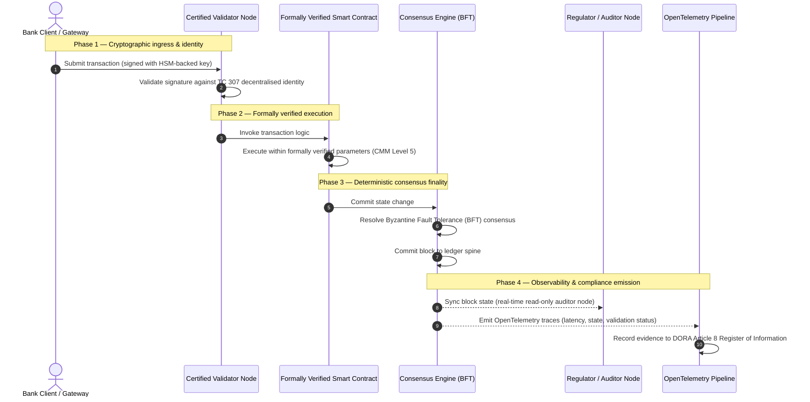

# От доказательства к истине: почему сертифицированные блокчейны определят следующую эру банковского доверия

## Стратегическое резюме (главное)

Оптовый банкинг и глобальные транзакции в 2026 году находятся на историческом переломном рубеже. По мере того как финансовые услуги переходят на нативно цифровые, клиринговые сети реального времени, а искусственный интеллект вносит вероятностный недетерминизм, традиционные аналоговые, ретроспективные модели гарантии (такие как статические аудиты на основе юридического лица) перестают отвечать современным требованиям управления рисками и фидуциарным обязанностям.

Технический комитет ISO/IEC TC 307 установил нормализованную основу для технологий распределённого реестра. Однако подлинное институциональное внедрение требует перехода от описательных рекомендаций к предписывающей, независимо сертифицируемой гарантии блокчейна. Оценивая управление реестром, целостность консенсуса, безопасность смарт-контрактов и криптографическую гибкость по строгой пятиуровневой модели зрелости возможностей (CMM), банки могут перейти от разрозненных, специфичных для поставщика допущений к сертифицируемой, аудируемой советом директоров финансовой истине.

## Ключевые выводы

* **Фидуциарный разрыв трения**: сегодня мы умеем сертифицировать банк (Basel III), облако (ISO 27001) и системы управления ИИ (ISO 42001), но пока не умеем сертифицировать распределённый реестр, который всё больше определяет, что является истиной. Эта асимметрия — серьёзная операционная уязвимость.  
* **DORA вводит прямую фидуциарную ответственность**: согласно статье 5 DORA, советы директоров банков несут прямую, неделегируемую личную ответственность за операционную устойчивость всех развёртываний третьих сторон и реестров, с суровыми личными санкциями по режиму SM&CR за нарушения.  
* **Аудиторский хребет ИИ**: там, где машинное обучение даёт невоспроизводимые, вероятностные результаты, сертифицированный блокчейн обеспечивает детерминированную фиксацию состояния. Запись версий моделей, входных данных и решений о валидации в цепочке удовлетворяет ISO 42001 и стандартам управления модельным риском.  
* **Индекс сертифицированных блокчейнов**: этот индекс формализует управление, консенсус, смарт-контракты и наблюдаемость в проверяемую, готовую к аудиту оценочную карту по шкале CMM от 0 до 5, переводя инженерные метрики в утверждённые советом заявления о риск-аппетите.

## 01. Фидуциарный разрыв трения в цифровом банкинге

В классическом банкинге доверие реляционно, институционально и ретроспективно. Оно опирается на независимых сторонних аудиторов, проверяющих финансовое состояние в фиксированные моменты времени и согласующих расхождения между силосами двусторонних реестров. На управляемых API рынках реального времени 2026 года эта модель вносит запретительные задержки и структурные риски.

Когда транзакции рассчитываются мгновенно, внутридневные пулы ликвидности динамически управляются шлюзами API, а собственность на активы токенизируется в общих реестрах, ретроспективные аудиты становятся криминалистическими упражнениями, а не превентивными контролями. Фидуциары больше не могут полагаться лишь на сертификацию юридического лица. Они должны сертифицировать сам цифровой субстрат.

Сейчас банки работают в условиях вопиющей архитектурной асимметрии:

1. **Сертифицированная облачная инфраструктура**: аппаратные узлы, виртуализированные контейнеры и физические центры обработки данных валидируются по контролям ISO/IEC 27001 и SOC 2 Type II.  
2. **Сертифицированные процессы управления**: политики операционного риска, планы непрерывности деятельности и алгоритмические развёртывания регулируются строгими рамками риска.  
3. **Несертифицированные движки реестра**: механизмы распределённого консенсуса, цепочки поставок узлов-валидаторов, границы смарт-контрактов и модели управления сетью оставлены несертифицированным, заказным или специфичным для консорциума допущениям.

Эта асимметрия — критическая точка отказа. Банк может запускать валидированное приложение внутри безопасного, сертифицированного по ISO 27001 облачного контейнера, но если этот контейнер записывает в распределённый реестр с централизованным контролем валидаторов, уязвимыми параметрами консенсуса или неаудированными смарт-контрактами, целостность транзакции скомпрометирована. Чтобы преодолеть этот разрыв, сам движок реестра должен стать сертифицируемым объектом гарантии.

## 02. Основа нормализации ISO/IEC TC 307

Фундаментальную работу, необходимую для нормализации распределённых реестров, выполняет Технический комитет ISO/IEC TC 307 (Технологии блокчейна и распределённого реестра). Вместо того чтобы рассматривать блокчейн как изолированный технический протокол, TC 307 подходит к нему как к институциональной инфраструктуре доверия, организуя свою работу вокруг пяти основных столпов:

1. **Таксономия и терминология (ISO 22739)**: устанавливает общую номенклатуру, обеспечивая согласованные юридические и операционные определения в разных юрисдикциях, финансовых схемах и учреждениях.  
2. **Референсная архитектура (ISO/TR 23245)**: определяет границы, уровни, потоки данных и функциональные компоненты соответствующей системы распределённого реестра.  
3. **Безопасность, конфиденциальность и смарт-контракты (ISO/TR 23244 / ISO 23613)**: устанавливает базовые рекомендации по безопасности для систем цифровых активов и детализирует лучшие практики снижения уязвимостей смарт-контрактов и управления их жизненным циклом.  
4. **Рамки совместимости**: рассматривает механизмы обмена данными и активами между гетерогенными сетями реестров, предотвращая образование изолированных токенизированных силосов.  
5. **Децентрализованная идентичность и якоря доверия**: интегрирует основанные на реестре криптографические идентификаторы с формальными инфраструктурами открытых ключей (PKI) и государственно уполномоченными реестрами.

В совокупности TC 307 сигнализирует переход DLT от заказного инженерного выбора к нормализованной архитектурной дисциплине. Однако TC 307 остаётся преимущественно описательным. Он определяет, как выглядит совершенство (рекомендации), но не предоставляет предписывающего протокола верификации (гарантии), который требуется риск-менеджерам и надзорным органам, чтобы авторизовать производственные развёртывания критических или важных функций (CIF).

## 03. Рекомендации против гарантии: фидуциарное различие

Участники финансовых рынков не внедряют технологию потому, что она инновационна или элегантна; они внедряют её, когда ею можно управлять, её можно аудировать, защищать и согласовывать с требованиями к капитальным резервам. Вот почему нормализация в банкинге естественно распадается на два уровня:

* **Рекомендации (рамка)**: очерчивают лучшие практики, референсные цели и архитектурные ориентиры (напр. ISO/IEC TC 307, рамки NIST).  
* **Гарантия (доказательство)**: предоставляет независимые, непрерывные и проверяемые третьей стороной доказательства того, что рамка внедрена и работает как задумано (напр. сертификация ISO 27001, аудиты SOC 2, регуляторные проверки).

Полагаться на несертифицированный консенсус реестра, сертифицируя при этом облачную инфраструктуру, — критический регуляторный пробел. «Неизменяемый» блокчейн не обязательно «институционально доверенный». Неизменяемость гарантирует лишь то, что введённые данные остаются неизменными; она не проверяет, безопасны ли узлы-валидаторы, устойчив ли протокол консенсуса к сговору, математически ли корректна логика смарт-контрактов и соответствует ли управление криптографическими ключами постквантовым мандатам.

Чтобы закрыть этот разрыв, Индекс сертифицированных блокчейнов 2026 формализует эти требования в измеримую модель зрелости возможностей (CMM), сопоставленную с глобальными банковскими регуляциями.

## 04. Индекс сертифицированных блокчейнов 2026

Чтобы дать высшему руководству возможность оценивать и сертифицировать свои платформы реестра, этот индекс структурирует инфраструктуру распределённого реестра в пять аудируемых операционных уровней, оцениваемых по шкале CMM от 0 до 5.

## Таблица 1: архитектура Индекса сертифицированных блокчейнов

| Уровень индекса | Уровень зрелости (CMM) | Техническая и операционная метрика | Регуляторная / фидуциарная контрольная ссылка |
| ---- | ---- | ---- | ---- |
| **Управление реестром** | **Уровень 0**: специальный консорциум**Уровень 3**: автоматизированная проверка и ротация валидаторов**Уровень 5**: децентрализованное, многостороннее криптографическое якорение идентичности | % узлов-валидаторов, управляемых проверенными финансовыми организациями; среднее время разрешения споров валидаторов; географическое распределение узлов | **DORA статья 5** (Управление и организация); **CPMI-IOSCO PFMI Принцип 2** (Управление) и **Принцип 3** (Рамка комплексного управления рисками) |
| **Целостность консенсуса** | **Уровень 0**: один узел или непрозрачный PoW**Уровень 3**: аудированный BFT с детерминированной финальностью**Уровень 5**: многоюрисдикционный, формально верифицированный консенсус с непрерывным мониторингом задержки | макс. допустимая задержка консенсуса; порог устойчивости к сговору; SLA доступности при симулированном разделении узлов | **DORA статья 6** (Рамка управления ИКТ-рисками); **CPMI-IOSCO PFMI Принцип 8** (Окончательность расчёта) |
| **Идентичность и криптография** | **Уровень 0**: слабые ключи RSA / ECDSA**Уровень 3**: мультиподпись с управлением ключами на базе HSM**Уровень 5**: квантово-безопасные гибридные ключи (FIPS 203 ML-KEM) и шлюзы конфиденциальности с нулевым разглашением | % транзакций реестра, подписанных ключами на базе HSM; оценка готовности к миграции PQC; задержка доказательств ZK | **NIST FIPS 203 / 204**; **ISO/IEC 27001** (Управление информационной безопасностью) |
| **Гарантия смарт-контрактов** | **Уровень 0**: неаудированные скрипты Solidity**Уровень 3**: автоматизированная валидация компилятора и внешний аудит**Уровень 5**: формально верифицированные, неизменяемые смарт-контракты с обновлениями типа «предохранитель» | % смарт-контрактов с математической формальной верификацией; количество предупреждений компилятора; покрытие сканирований уязвимостей | **Рекомендации EBA по аутсорсингу** (пункты 81, 113-117); **DORA статья 30** (Минимальные договорные положения) |
| **Аудит и наблюдаемость** | **Уровень 0**: ручной сбор логов**Уровень 3**: структурированные трейсы OTel и аудиторские узлы только для чтения**Уровень 5**: автоматизированная, непрерывная сверка с реестром по статье 8 | % транзакций, охваченных трейсами OpenTelemetry; задержка от фиксации блока до синхронизации аудиторского узла | **BCBS 239** (Агрегация рисковых данных); **DORA статья 8** (Реестр информации / схемы ITS) |

## Таблица 2: ключевые сигналы доверия, сопоставленные с глобальными банковскими стандартами

| Сигнал / ориентир | Метрика | Влияние на банковские платформы | Регуляторный источник |
| ---- | ---- | ---- | ---- |
| **Прогресс ISO/IEC TC 307** | Переход от технических отчётов ISO/TR к формальным схемам сертификации | Устанавливает первую нормализованную рамку для сертификации движков распределённого реестра | **ISO/IEC JTC 1 / SC 44** (Технологии распределённого реестра) |
| **Прототипная фаза Проекта Agorá** | Более 40 участвующих коммерческих банков; тестирование единого реестра токенизированных депозитов | Перемещает трансграничный клиринг от обмена сообщениями (SWIFT) к атомарному токенизированному расчёту | **Инновационный хаб Банка международных расчётов (BIS)** |
| **Аудит третьей стороны DORA статья 30** | 100 % поставщиков узлов и хостов инфраструктуры аудированы по критериям безопасности | Устраняет «теневые узлы-валидаторы»; требует полной прозрачности цепочки поставок | **Европейские надзорные органы (ESA)** |
| **ISO/IEC 42001 (управление ИИ)** | Логи моделей и обучения ИИ сделаны криптографически неизменяемыми в цепочке | Использует блокчейн как неизменяемый доказательный реестр («аудиторский хребет») для машинного обучения | **ISO/IEC 42001:2023** (Информационные технологии — Искусственный интеллект) |
| **Достаточность капитала Basel III** | Снижение буферов капитала под операционный риск на основе задокументированного снижения сложности | Нормализованные рамки операционного риска напрямую засчитывают проверенную устойчивость реестра | **Базельский комитет по банковскому надзору (BCBS)** |

## 05. «Аудиторский хребет» ИИ: вероятностный интеллект на детерминированной инфраструктуре

Одна из самых мощных стратегических ролей сертифицированного блокчейна в 2026 году — выступать в качестве **«аудиторского хребта»** для развёртываний искусственного интеллекта. Современные финансовые системы становятся всё более вероятностными. Кредитный скоринг, обнаружение мошенничества в реальном времени, алгоритмическая торговля и автономные взаимодействия с клиентами управляются моделями машинного обучения, которые эволюционируют, дрейфуют и адаптируются со временем. Эти модели недетерминированы: при одном и том же входе в два разных момента они могут давать разные выходы из-за динамических весов и непрерывного обучения.

Этот недетерминизм порождает глубокий вызов управления по **ISO/IEC 42001 (управление ИИ)** и стандартам управления модельным риском (MRM) (таким как **SR 11-7 Федеральной резервной системы США** и **SS1/23 британского PRA**): *как аудировать, объяснять и защищать решения, которые не являются строго воспроизводимыми?*

Сертифицированный распределённый реестр обеспечивает детерминированный противовес. Там, где модели ИИ работают вероятностно, сертифицированный блокчейн записывает их параметры детерминированно, устанавливая неизменяемый доказательный хребет:

* **Версионирование моделей и якорение весов**: каждая развёрнутая версия модели, её связанные веса и контрольные суммы её обучающих данных хешируются и записываются в реестр во время сборки, удовлетворяя требования цепочки поставок **SLSA Level 3**.  
* **Контекстное логирование входов**: когда модель ИИ выполняет критическое решение (напр. одобряет кредит или помечает транзакцию), точные контекстные входы и хеши модели записываются в реестр, создавая устойчивую к подделке историю.  
* **Аудируемость без доступа к коду**: если регулятор спрашивает «почему ваша модель отклонила эту кредитную заявку 3 июня?», банку не нужно ни раскрывать свой проприетарный код, ни пытаться воссоздать точное состояние модели. Он предъявляет криптографически подписанную запись в цепочке о входах, весах и состоянии валидации.

Якоря вероятностные решения моделей машинного обучения к детерминированному консенсусу сертифицированного блокчейна, учреждение создаёт защищаемую, восстанавливаемую и независимо проверяемую временную шкалу автоматизированных действий.

## 06. Визуализация сертифицированного конвейера от консенсуса к аудиту

Следующая диаграмма последовательности иллюстрирует жизненный цикл транзакции, проходящей через сертифицированную блокчейн-платформу, показывая, как шлюзы валидации, целостность консенсуса, выполнение смарт-контрактов и эмиссия телеметрии переплетаются, чтобы произвести готовое для совета директоров регуляторное доказательство:

Критический путь этой транзакционной последовательности требует, чтобы каждый шаг валидации, выполнения и консенсуса был криптографически подписан, обеспечивая сквозное происхождение. Аудиторский узел регулятора синхронизирует состояние блоков в реальном времени, устраняя потребность в ретроспективной, ручной финансовой сверке.

## 07. Настольная книга совета для высшего руководства

Чтобы успешно пройти переход от организационного доверия к инфраструктурному, руководители и высшее руководство банков должны немедленно выполнить четыре ключевые директивы:

1. **Сделать аудиты реестра обязательными в управлении рисками предприятия (ERM)**: ввести политику, согласно которой ни одна платформа распределённого реестра — частная, публичная или консорциумная — не может быть развёрнута для критических или важных функций (CIF) без аудита по пятиуровневой **архитектуре Индекса сертифицированных блокчейнов** (минимум CMM Уровень 3).  
2. **Интегрировать блокчейны как доказательный хребет ИИ по ISO 42001**: поручить директору по рискам и ведущему архитектору ИИ интегрировать все высоковлиятельные модели машинного обучения с сертифицированным блокчейном, создав устойчивый к подделке аудиторский реестр версий моделей, весов, входов и решений.  
3. **Аудировать цепочку поставок узлов-валидаторов (DORA статья 30)**: требовать, чтобы отдел закупок аудировал все третьи стороны, размещающие узлы-валидаторы или управляющие облачным хостингом для сетей DLT, применяя те же стандарты кибербезопасности и операционной устойчивости, что и для внутренних облачных узлов банка.  
4. **Согласовать архитектуры реестра с CPMI-IOSCO и BCBS 239**: поручить команде платформенной инженерии согласовать выходную телеметрию реестра непосредственно с требованиями к отчётности данных **BCBS 239** и обеспечить, чтобы параметры консенсуса и окончательности расчёта строго соответствовали **Принципам 8 и 9 CPMI-IOSCO**.

## 08. Часто задаваемые вопросы

**Является ли ISO/IEC TC 307 стандартом сертификации?**  
Нет. ISO/IEC TC 307 — это технический комитет, устанавливающий терминологию, референсные архитектуры и рекомендации по безопасности. Хотя он определяет, «как выглядит совершенство» (рекомендации), отрасль должна операционализировать эти документы в формальные, аудируемые схемы сертификации (гарантия), чтобы удовлетворить банковских надзорных органов.

**Как сертифицированный блокчейн поддерживает соответствие DORA?**  
Согласно статье 5 DORA, советы банков несут прямую личную ответственность за технологическую устойчивость. Сертифицированный блокчейн предоставляет проверяемое криптографическое доказательство целостности консенсуса, контроля цепочки поставок валидаторов и безопасности смарт-контрактов, давая членам совета документируемые «разумные шаги», необходимые для защиты от претензий о личной ответственности по SM&CR.

В чём разница между традиционным аудитом реестра и аудитом сертифицированного блокчейна?  
Традиционный аудит ретроспективен: он проверяет ручные записи и статические файлы после того, как транзакции рассчитаны. Аудит сертифицированного блокчейна непрерывен и происходит в реальном времени; узлы-валидаторы, консенсусный движок BFT и формально верифицированные смарт-контракты сертифицированы выполнять транзакции детерминированно, испуская структурированную телеметрию (OpenTelemetry), которая непрерывно валидирует состояние системы.

Можно ли сертифицировать публичные блокчейны для банковского использования?  
В большинстве юрисдикций чисто безразрешительные публичные блокчейны не удовлетворяют банковским регуляциям из-за отсутствия проверки идентичности валидаторов, непредсказуемых транзакционных издержек и недетерминированной финальности (напр. вероятностные форки proof-of-work/stake). Сертифицированные блокчейны в банкинге обычно используют корпоративные разрешительные архитектуры или жёстко регулируемые публично-гибридные архитектуры, где операторы узлов-валидаторов являются идентифицированными и аудированными финансовыми организациями.

## 09. Источники

* Базельский комитет по банковскому надзору (BCBS), 2013. *Principles for effective risk data aggregation and reporting (BCBS 239)*. Базель: Банк международных расчётов. Доступно по: [https://www.bis.org/publ/bcbs239.pdf](https://www.bis.org/publ/bcbs239.pdf).  
* Committee on Payments and Market Infrastructures и Technical Committee of the International Organization of Securities Commissions (CPMI-IOSCO), 2012. *Principles for financial market infrastructures*. Базель: Банк международных расчётов. Доступно по: [https://www.bis.org/cpmi/publ/d101a.pdf](https://www.bis.org/cpmi/publ/d101a.pdf).  
* Европейская банковская организация (EBA), 2019. *EBA/GL/2019/02 — Guidelines on outsourcing arrangements*. Париж: EBA. Доступно по: [https://www.eba.europa.eu/regulation-and-policy/internal-governance/guidelines-on-outsourcing-arrangements](https://www.eba.europa.eu/regulation-and-policy/internal-governance/guidelines-on-outsourcing-arrangements).  
* Европейский парламент и Совет Европейского Союза, 2022. *Регламент (ЕС) 2022/2554 о цифровой операционной устойчивости финансового сектора (DORA)*. Брюссель: Официальный журнал Европейского Союза. Доступно по: [https://eur-lex.europa.eu/legal-content/EN/TXT/?uri=CELEX%3A32022R2554](https://eur-lex.europa.eu/legal-content/EN/TXT/?uri=CELEX%3A32022R2554).  
* ISO/IEC JTC 1/SC 42, 2023. *ISO/IEC 42001:2023 — Information technology — Artificial intelligence — Management system*. Женева: Международная организация по стандартизации. Доступно по: [https://www.iso.org/standard/81230.html](https://www.iso.org/standard/81230.html).  
* Технический комитет ISO/IEC 307, 2020. *ISO/IEC 22739:2020 — Blockchain and distributed ledger technologies — Vocabulary*. Женева: Международная организация по стандартизации. Доступно по: [https://www.iso.org/standard/73771.html](https://www.iso.org/standard/73771.html).  
* National Institute of Standards and Technology (NIST), 2026. *First Three Finalized Post-Quantum Encryption Standards (FIPS 203, 204, and 205)*. Гейтерсберг: U.S. Department of Commerce. Доступно по: [https://www.nist.gov/news-events/news/2024/08/nist-releases-first-3-finalized-post-quantum-encryption-standards](https://www.nist.gov/news-events/news/2024/08/nist-releases-first-3-finalized-post-quantum-encryption-standards).
