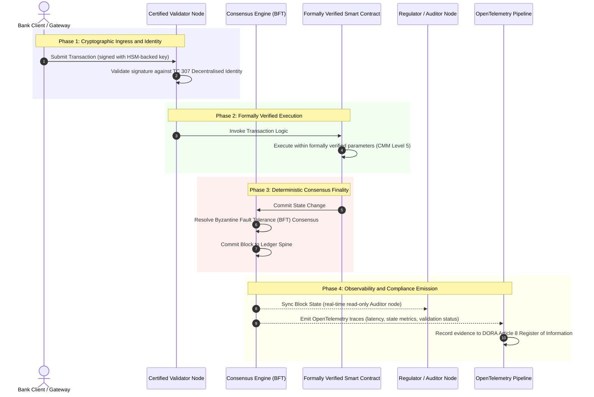

# От доказательства к истине: почему сертифицированные блокчейны определят новую эру банковского доверия

**Неизменяемое — не то же самое, что доверенное.** По мере того как оптовый банкинг переходит к расчётам в реальном времени и вероятностному ИИ, реестр, который решает, что истинно, стал тем единственным слоем, который банки всё ещё не могут сертифицировать. Они сертифицируют юридическое лицо по Basel III, облако по ISO 27001 и свой ИИ по ISO 42001, но распределённый реестр — его управление, консенсус, криптографию и смарт-контракты — оставляют на уровне допущений конкретного поставщика. В этом отчёте утверждается, что закрытие этого фидуциарного разрыва требует перехода от руководства ISO/IEC TC 307 к предписывающей гарантии: оценки реестра по 5-уровневому Индексу сертифицированного блокчейна, который превращает инженерные метрики в проверяемую советом директоров, защитимую по DORA истину.

<!-- lead-start -->
<aside class="post-lead" aria-label="Краткое содержание статьи">

<strong>Коротко.</strong> Банки сертифицируют юридическое лицо, облако и свой ИИ, но не реестр, который всё чаще определяет, что истинно. ISO/IEC TC 307 даёт руководство, а не гарантию. 5-уровневый Индекс сертифицированного блокчейна оценивает управление реестром, целостность консенсуса, идентификацию и криптографию, гарантию смарт-контрактов и наблюдаемость по модели зрелости, закрывая фидуциарный разрыв и давая вероятностному ИИ детерминированный аудиторский хребет.

<strong>Ключевые выводы</strong>

<ul class="post-lead-takeaways">
  <li><strong>Фидуциарный разрыв трения.</strong> Банк (Basel III), облако (ISO 27001) и система управления ИИ (ISO 42001) могут быть сертифицированы; распределённый реестр, который решает, что истинно, пока нет. Эта асимметрия — действующая операционная уязвимость.</li>
  <li><strong>DORA делает это персональным.</strong> Согласно DORA Article 5, советы директоров банков несут прямую, неделегируемую ответственность за устойчивость сторонних и реестровых развёртываний, с персональными санкциями SM&amp;CR за нарушения.</li>
  <li><strong>Аудиторский хребет для ИИ.</strong> Машинное обучение невоспроизводимо; сертифицированный блокчейн детерминированно фиксирует версии моделей, входные данные и решения о валидации в цепочке, удовлетворяя ISO 42001 и стандартам управления модельным риском.</li>
  <li><strong>Индекс сертифицированного блокчейна.</strong> Управление, консенсус, криптография, смарт-контракты и наблюдаемость становятся оценочной картой CMM от 0 до 5, которая переводит инженерные метрики в утверждённые советом директоров декларации риск-аппетита.</li>
</ul>

<strong>По теме:</strong> <a href="https://sebastienrousseau.com/2026-07-02-certified-blockchains-banking-trust-tc307-assurance-2026">Сертифицированные блокчейны и банковское доверие: гарантия TC 307</a>, <a href="https://sebastienrousseau.com/2026-07-24-global-payments-outlook-operating-model-risk-revenue">Глобальный прогноз платежей на 2026 год</a>.

</aside>
<!-- lead-end -->

> **Резюме для руководства**
>
> - **Оптовый банкинг находится на переломном этапе.** Клиринг в реальном времени и вероятностный ИИ ломают аналоговую, ретроспективную модель гарантии: статические аудиты на уровне юридического лица больше не отвечают современным требованиям управления рисками или фидуциарным требованиям.
> - **TC 307 — это базовый уровень, а не сертификат.** ISO/IEC TC 307 стандартизировал словарь, эталонную архитектуру и руководство по безопасности для распределённых реестров, но носит описательный характер. Он определяет, как выглядит хорошее решение; он не обеспечивает предписывающую проверку, которая нужна риск-офицерам и надзорным органам для авторизации промышленного развёртывания.
> - **Гарантия означает оценку реестра.** Управление, целостность консенсуса, безопасность смарт-контрактов и криптографическая гибкость, оценённые по строгой 5-уровневой модели зрелости, переводят банки от лоскутных, зависящих от поставщика допущений к сертифицируемой, проверяемой советом директоров финансовой истине.
> - **Реестр — это аудиторский хребет для ИИ.** Привязка версий моделей, входных данных и решений о валидации к детерминированному консенсусу даёт невоспроизводимому машинному обучению защитимую, реконструируемую доказательную запись согласно ISO 42001, SR 11-7 и PRA SS1/23.

## Фидуциарный разрыв трения в цифровом банкинге

В классическом банкинге доверие является реляционным, институциональным и ретроспективным. Оно зависит от независимых сторонних аудиторов, проверяющих финансовое состояние в статические моменты времени и согласовывающих расхождения между двусторонними хранилищами реестров. На рынках 2026 года, работающих в реальном времени и управляемых API, эта модель порождает недопустимые задержки и структурные риски.

Когда транзакции рассчитываются мгновенно, внутридневные пулы ликвидности динамически управляются API-шлюзами, а право собственности на активы токенизировано в общих реестрах, ретроспективные аудиты становятся криминалистическими упражнениями, а не превентивными средствами контроля. Фидуциары больше не могут полагаться исключительно на сертификацию корпоративного юридического лица. Они должны сертифицировать сам цифровой субстрат.

В настоящее время банки работают в условиях вопиющей архитектурной асимметрии:

1. **Сертифицированная облачная инфраструктура**: аппаратные узлы, виртуализированные контейнеры и физические центры обработки данных проверяются на соответствие средствам контроля ISO/IEC 27001 и SOC 2 Type II.  
2. **Сертифицированные процессы управления**: политики операционного риска, планы обеспечения непрерывности деятельности и алгоритмические развёртывания управляются в рамках строгих структур управления рисками.  
3. **Несертифицированные механизмы реестра**: основные распределённые механизмы консенсуса, цепочки поставок валидирующих узлов, границы смарт-контрактов и модели сетевого управления оставлены на уровне несертифицированных, кастомных или специфичных для консорциума допущений.

Эта асимметрия — серьёзная точка отказа. Банк может запускать проверенное приложение внутри защищённого, сертифицированного по ISO 27001 облачного контейнера, но если этот контейнер пишет в распределённый реестр с централизованным контролем валидаторов, уязвимыми параметрами консенсуса или непроверенными смарт-контрактами, целостность транзакции скомпрометирована. Чтобы преодолеть этот разрыв, сам механизм реестра должен стать сертифицируемым объектом гарантии.

## Базовый уровень стандартизации ISO/IEC TC 307

Основополагающая работа, необходимая для стандартизации распределённых реестров, ведётся Техническим комитетом ISO/IEC 307 (TC 307\) (Blockchain and distributed ledger technologies). Вместо того чтобы рассматривать блокчейн как изолированный технический протокол, TC 307 подходит к нему как к институциональной инфраструктуре доверия, организуя свою работу вокруг пяти ключевых столпов:

1. **Таксономия и словарь (ISO 22739\)**: устанавливает общую номенклатуру, обеспечивая последовательные правовые и операционные определения в разных юрисдикциях, финансовых схемах и учреждениях.  
2. **Эталонная архитектура (ISO/TR 23245\)**: определяет границы, слои, потоки данных и функциональные компоненты соответствующей системы распределённого реестра.  
3. **Безопасность, конфиденциальность и смарт-контракты (ISO/TR 23244 / ISO 23613\)**: устанавливает базовые рекомендации по безопасности для систем цифровых активов и детализирует лучшие практики по устранению уязвимостей смарт-контрактов и управлению жизненным циклом.  
4. **Структуры взаимодействия**: рассматривают механизмы обмена данными и активами между разнородными сетями реестров, предотвращая формирование изолированных токенизированных хранилищ.  
5. **Децентрализованная идентификация и якоря доверия**: интегрирует криптографические идентификаторы на основе реестра с формальными инфраструктурами открытых ключей (PKI) и санкционированными государством реестрами.

В совокупности TC 307 знаменует переход DLT от кастомного инженерного выбора к стандартизированной архитектурной дисциплине. Однако TC 307 остаётся преимущественно описательным. Он определяет, как выглядит хорошее решение (руководство), но не обеспечивает предписывающий протокол проверки (гарантию), который требуется риск-офицерам и надзорным органам для авторизации промышленных развёртываний критических или важных функций (CIFs).

## Руководство против гарантии: фидуциарное различие

Участники финансового рынка не внедряют технологию потому, что она инновационна или элегантна; они внедряют её, когда ею можно управлять, её можно аудировать, защищать и согласовывать с требованиями к капитальным резервам. Именно поэтому стандартизация в банкинге естественным образом разрешается в два слоя:

* **Руководство (структура)**: описывает лучшие практики, эталонные цели и архитектурные рекомендации (например, ISO/IEC TC 307, структуры NIST).  
* **Гарантия (доказательство)**: обеспечивает независимое, непрерывное и проверяемое третьей стороной свидетельство того, что структура реализована и работает так, как задумано (например, сертификация ISO 27001, аудиты SOC 2, регуляторные проверки).

Опора на несертифицированный консенсус реестра при сертификации облачной инфраструктуры — критический регуляторный разрыв. Блокчейн, который является «неизменяемым», не обязательно является «институционально доверенным». Неизменяемость гарантирует лишь то, что введённые данные не изменены; она не проверяет, что валидирующие узлы защищены, что протокол консенсуса устойчив к сговору, что логика смарт-контракта математически надёжна или что управление криптографическими ключами соответствует постквантовым требованиям.

Чтобы закрыть этот разрыв, Индекс сертифицированного блокчейна 2026 года формализует эти требования в измеримую модель зрелости (CMM), сопоставленную с глобальными банковскими нормами.

## Индекс сертифицированного блокчейна 2026 года

Чтобы дать высшему руководству возможность оценивать и сертифицировать свои реестровые платформы, этот индекс структурирует инфраструктуру распределённого реестра в пять аудируемых операционных слоёв, оцениваемых по шкале CMM от 0 до 5.

### Таблица 1: Архитектура Индекса сертифицированного блокчейна

| Слой индекса | Уровень зрелости (CMM) | Техническая и операционная метрика | Регуляторная / фидуциарная контрольная привязка |
| ---- | ---- | ---- | ---- |
| **Управление реестром** | **Level 0**: специальный консорциум**Level 3**: автоматизированная проверка и ротация валидаторов**Level 5**: децентрализованная, многосторонняя криптографическая привязка идентичности | % валидирующих узлов, управляемых проверенными финансовыми организациями; среднее время разрешения споров валидаторов; географическое распределение узлов | **DORA Article 5** (Governance and Organisation); **CPMI-IOSCO PFMI Principle 2** (Governance) и **Principle 3** (Framework for the comprehensive management of risks) |
| **Целостность консенсуса** | **Level 0**: одиночный узел или непрозрачный POW**Level 3**: проверенный BFT с детерминированной окончательностью**Level 5**: многоюрисдикционный, формально верифицированный консенсус с непрерывным мониторингом задержки | Максимально допустимая задержка консенсуса; порог устойчивости к сговору; SLA доступности при смоделированном разделении узлов | **DORA Article 6** (ICT Risk Management Framework); **CPMI-IOSCO PFMI Principle 8** (Settlement Finality) |
| **Идентификация и криптография** | **Level 0**: слабые ключи RSA / ECDSA**Level 3**: мультиподпись с управлением ключами на базе HSM**Level 5**: квантово-устойчивые гибридные ключи (FIPS 203 ML-KEM) и шлюзы конфиденциальности с нулевым разглашением | % транзакций реестра, подписанных ключами на базе HSM; оценка готовности к миграции на PQC; задержка ZK-доказательств | **NIST FIPS 203 / 204**; **ISO/IEC 27001** (Information Security Management) |
| **Гарантия смарт-контрактов** | **Level 0**: непроверенные скрипты solidity**Level 3**: автоматизированная валидация компилятора и внешний аудит**Level 5**: формально верифицированные, неизменяемые смарт-контракты с обновлениями через аварийный выключатель | % смарт-контрактов с математической формальной верификацией; количество предупреждений компилятора; охват сканирования уязвимостей | **EBA Guidelines on Outsourcing Arrangements** (Paragraphs 81, 113-117); **DORA Article 30** (Minimum Contractual Clauses) |
| **Аудит и наблюдаемость** | **Level 0**: ручной сбор логов**Level 3**: структурированные трассы OTel и узлы аудитора только для чтения**Level 5**: автоматизированная, непрерывная сверка с реестром Article 8 | % транзакций, охваченных трассами OpenTelemetry; задержка от фиксации блока реестра до синхронизации узла аудитора | **BCBS 239** (Risk Data Aggregation); **DORA Article 8** (Register of Information / ITS Schemas) |

### Таблица 2: Ключевые сигналы доверия, сопоставленные с глобальными банковскими стандартами

| Сигнал / ориентир | Метрика | Влияние на банковские платформы | Регуляторный источник |
| ---- | ---- | ---- | ---- |
| **Прогресс ISO/IEC TC 307** | Переход от технических отчётов ISO/TR к формальным схемам сертификации | Устанавливает первую стандартизированную структуру для сертификации механизмов распределённого реестра | **ISO/IEC JTC 1 / SC 44** (Distributed Ledger Technologies) |
| **Этап прототипа Project Agorá** | 40+ участвующих коммерческих банков; тестирование единого реестра токенизированных депозитов | Смещение трансграничного клиринга от обмена сообщениями (SWIFT) к атомарным токенизированным расчётам | **Bank for International Settlements (BIS) Innovation Hub** |
| **Аудит третьих сторон DORA Article 30** | 100% провайдеров узлов и хостов инфраструктуры проверены по критериям безопасности | Устраняет «теневые валидирующие узлы»; предписывает полную прозрачность цепочки поставок | **European Supervisory Authorities (ESA)** |
| **ISO/IEC 42001 (управление ИИ)** | Криптографически зафиксированные в цепочке логи модели ИИ и обучения | Использует блокчейн как неизменяемый доказательный реестр («аудиторский хребет») для машинного обучения | **ISO/IEC 42001:2023** (Information technology, Artificial intelligence) |
| **Достаточность капитала Basel III** | Снижение буферов капитала под операционный риск на основе задокументированного снижения сложности | Стандартизированные структуры операционного риска напрямую засчитывают проверенную устойчивость реестра | **Basel Committee on Banking Supervision (BCBS)** |

## «Аудиторский хребет» ИИ: вероятностный интеллект на детерминированной инфраструктуре

Одна из самых мощных стратегических ролей сертифицированного блокчейна в 2026 году — выступать в качестве **«аудиторского хребта»** для развёртываний искусственного интеллекта. Современные финансовые системы всё более вероятностны. Кредитный скоринг, обнаружение мошенничества в реальном времени, алгоритмическая торговля и автономные взаимодействия с клиентами управляются моделями машинного обучения, которые эволюционируют, дрейфуют и адаптируются со временем. Эти модели недетерминированы: при одинаковом входе в два разных момента времени они могут выдавать разные результаты из-за динамических весов и непрерывного обучения.

Этот недетерминизм создаёт глубокую проблему управления в рамках стандартов **ISO/IEC 42001 (управление ИИ)** и **управления модельным риском (MRM)** (таких как **US Federal Reserve SR 11-7** и **UK PRA SS1/23**): *как аудировать, объяснять и защищать решения, которые не являются строго воспроизводимыми?*

Сертифицированный распределённый реестр обеспечивает детерминированный противовес. Пока модели ИИ работают вероятностно, сертифицированный блокчейн детерминированно фиксирует их параметры, устанавливая неизменяемый доказательный хребет:

* **Версионирование моделей и привязка весов**: каждая развёрнутая версия модели, связанные с ней веса и контрольные суммы обучающих данных хешируются и записываются в реестр во время сборки, удовлетворяя требованиям цепочки поставок **SLSA Level 3**.  
* **Логирование контекстных входных данных**: когда модель ИИ выполняет критическое решение (например, одобряет кредит или помечает транзакцию), точные контекстные входные данные и хеши модели записываются в реестр, создавая историю с защитой от подделки.  
* **Аудируемость без доступа к коду**: если регулятор спрашивает: «Почему ваша модель отклонила эту кредитную заявку 3 июня?», банку не нужно раскрывать проприетарный код или пытаться воссоздать точное состояние модели. Он представляет криптографически подписанную запись в цепочке реестра о входных данных, весах и состоянии валидации.

Привязывая вероятностные решения моделей машинного обучения к детерминированному консенсусу сертифицированного блокчейна, учреждение создаёт защитимую, реконструируемую и независимо проверяемую хронологию автоматизированных действий.

## Визуализация сертифицированного конвейера от консенсуса к аудиту

Следующая диаграмма последовательности иллюстрирует жизненный цикл транзакции, проходящей через сертифицированную блокчейн-платформу, показывая, как ворота валидации, целостность консенсуса, исполнение смарт-контракта и эмиссия телеметрии сцепляются друг с другом, чтобы произвести готовое для совета директоров регуляторное свидетельство:

Критический путь для этой транзакционной последовательности требует, чтобы каждый шаг валидации, исполнения и консенсуса был криптографически подписан, обеспечивая сквозное происхождение. Узел аудитора регулятора синхронизирует состояние блока в реальном времени, устраняя необходимость в ретроспективной, ручной финансовой сверке.

## Сценарий для совета директоров и старших менеджеров

Чтобы успешно управлять переходом от организационного доверия к инфраструктурному, руководители и старшие менеджеры банков должны немедленно выполнить четыре ключевые директивы:

1. **Обязать проводить аудиты реестра в рамках управления рисками предприятия (ERM)**: ввести политику, согласно которой ни одна платформа распределённого реестра — частная, публичная или консорциумная — не может быть развёрнута для критических или важных функций (CIFs), пока она не пройдёт аудит по 5-слойной **Архитектуре Индекса сертифицированного блокчейна** (минимум CMM Level 3).  
2. **Интегрировать блокчейны как доказательный хребет ИИ по ISO 42001**: поручить директору по рискам и ведущему архитектору ИИ интегрировать все высокоэффективные модели машинного обучения с сертифицированным блокчейном, создавая защищённый от подделки аудиторский реестр версий моделей, весов, входных данных и решений.  
3. **Аудировать цепочку поставок валидирующих узлов (DORA Article 30\)**: потребовать от отдела закупок аудита всех сторонних организаций, размещающих валидирующие узлы или управляющих облачным хостингом для сетей DLT, предписав соответствие тем же стандартам кибербезопасности и операционной устойчивости, что применяются к внутренним облачным узлам банка.  
4. **Согласовать архитектуры реестра с CPMI-IOSCO и BCBS 239**: поручить команде платформенной инженерии согласовать выходную телеметрию реестра напрямую с требованиями к отчётности по данным **BCBS 239** и обеспечить строгое соответствие параметров консенсуса и окончательности расчётов **CPMI-IOSCO Principles 8 and 9**.

## Часто задаваемые вопросы

**Является ли ISO/IEC TC 307 стандартом сертификации?**  
Нет. ISO/IEC TC 307 — это технический комитет, который устанавливает словарь, эталонные архитектуры и руководства по безопасности. Хотя он определяет, «как выглядит хорошее решение» (руководство), отрасль должна операционализировать эти документы в формальные, аудируемые схемы сертификации (гарантию), чтобы удовлетворить банковских надзорных органов.

**Как сертифицированный блокчейн поддерживает соответствие DORA?**  
Согласно DORA Article 5, советы директоров банков несут прямую, персональную ответственность за устойчивость технологий. Сертифицированный блокчейн обеспечивает проверяемое, криптографическое свидетельство целостности консенсуса, контроля цепочки поставок валидаторов и безопасности смарт-контрактов, давая членам совета директоров документируемые «разумные меры», необходимые для защиты от исков о персональной ответственности SM\&CR.

**В чём разница между традиционным аудитом реестра и аудитом сертифицированного блокчейна?**  
Традиционный аудит ретроспективен, проверяя ручные записи и статические файлы после того, как транзакции прошли клиринг. Аудит сертифицированного блокчейна непрерывен и происходит в реальном времени; валидирующие узлы, механизм консенсуса BFT и формально верифицированные смарт-контракты сертифицированы для детерминированного исполнения транзакций, эмитируя структурированную телеметрию (OpenTelemetry), которая непрерывно проверяет работоспособность системы.

**Могут ли публичные блокчейны быть сертифицированы для банковского использования?**  
В большинстве юрисдикций чисто бесразрешительные публичные блокчейны не удовлетворяют банковским нормам из-за отсутствия проверки идентичности валидаторов, непредсказуемых комиссий за газ/транзакции и недетерминированной окончательности (например, вероятностные форки proof-of-work/stake). Сертифицированные блокчейны в банкинге обычно используют корпоративные разрешительные или строго регулируемые публично-гибридные архитектуры, в которых операторы валидирующих узлов являются идентифицированными и проаудированными финансовыми организациями.

## Ссылки

* Базельский комитет по банковскому надзору (BCBS), 2013\. *Принципы эффективной агрегации данных о рисках и отчётности (BCBS 239\)*. Базель: Банк международных расчётов. Доступно по адресу: [Базельский комитет по банковскому надзору (BCBS), 2013\.](https://www.bis.org/publ/bcbs239.pdf "Базельский комитет по банковскому надзору (BCBS), 2013\.").  
* Комитет по платёжным и рыночным инфраструктурам и Технический комитет Международной организации комиссий по ценным бумагам (CPMI-IOSCO), 2012\. *Принципы для инфраструктур финансового рынка*. Базель: Банк международных расчётов. Доступно по адресу: [Комитет по платёжным и рыночным инфраструктурам и Технический комитет Международной организации комиссий по ценным бумагам (CPMI-IOSCO), 2012\.](https://www.bis.org/cpmi/publ/d101a.pdf "Комитет по платёжным и рыночным инфраструктурам и Технический комитет Международной организации комиссий по ценным бумагам (CPMI-IOSCO), 2012\.").  
* Европейское банковское управление (EBA), 2019\. *EBA/GL/2019/02, Руководство по механизмам аутсорсинга*. Париж: EBA. Доступно по адресу: [Европейское банковское управление (EBA), 2019\.](https://www.eba.europa.eu/regulation-and-policy/internal-governance/guidelines-on-outsourcing-arrangements "Европейское банковское управление (EBA), 2019\.").  
* Европейский парламент и Совет Европейского союза, 2022\. *Регламент (ЕС) 2022/2554 о цифровой операционной устойчивости финансового сектора (DORA)*. Брюссель: Официальный журнал Европейского союза. Доступно по адресу: [Европейский парламент и Совет Европейского союза, 2022\.](https://eur-lex.europa.eu/legal-content/EN/TXT/?uri=CELEX%3A32022R2554 "Европейский парламент и Совет Европейского союза, 2022\.").  
* ISO/IEC JTC 1/SC 42, 2023\. *ISO/IEC 42001:2023, Информационные технологии, Искусственный интеллект, Система менеджмента*. Женева: Международная организация по стандартизации. Доступно по адресу: [ISO/IEC JTC 1/SC 42, 2023\.](https://www.iso.org/standard/81230.html "ISO/IEC JTC 1/SC 42, 2023\.").  
* Технический комитет ISO/IEC 307, 2020\. *ISO/IEC 22739:2020, Блокчейн и технологии распределённого реестра, Словарь*. Женева: Международная организация по стандартизации. Доступно по адресу: [Технический комитет ISO/IEC 307, 2020\.](https://www.iso.org/standard/73771.html "Технический комитет ISO/IEC 307, 2020\.").  
* Национальный институт стандартов и технологий (NIST), 2026\. *Первые три финализированных стандарта постквантового шифрования (FIPS 203, 204 и 205\)*. Гейтерсберг: Министерство торговли США. Доступно по адресу: [Национальный институт стандартов и технологий (NIST), 2026\.](https://www.nist.gov/news-events/news/2024/08/nist-releases-first-3-finalised-post-quantum-encryption-standards "Национальный институт стандартов и технологий (NIST), 2026\.").

