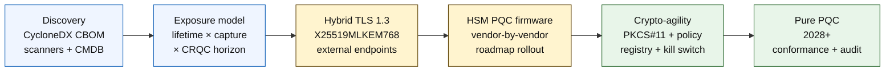

# Quantum-Safe Banking Index 2026: Postkvantkryptografi, QKD, kryptoagilitet och harvest-now-decrypt-later-risk

<!-- lead-start: manual -->
<aside class="post-lead" aria-label="Artikelsammanfattning">

<strong>Sammanfattning.</strong> Kvantsäker bankverksamhet 2026 är ett leveransprogram med en deadline som sätts av skärningen mellan två kurvor — konfidentialitetslivslängden på den data institutet håller idag och ankomsthorisonten för en kryptografiskt relevant kvantdator (CRQC). NIST FIPS 203 / 204 / 205 är slutgiltiga sedan augusti 2024; CNSA 2.0 sätter det amerikanska federala måltillståndet till 2033; harvest-now-decrypt-later sker redan på långlivade data. Styrelsens kvantkort spårar fyra exakta procenttal: inventeringsfullständighet, HNDL-exponering, NIST-migrationsprogress, kryptoagilitetsberedskap.

<strong>Huvudpunkter</strong>

<ul class="post-lead-takeaways">
  <li><strong>Algoritmdebatten avslutades den 13 augusti 2024.</strong> ML-KEM (FIPS 203), ML-DSA (FIPS 204), SLH-DSA (FIPS 205) är svaren. Banker som fortfarande kör interna utvärderingar för att "välja vinnaren" är 18 månader efter.</li>
  <li><strong>Harvest-now-decrypt-later gäller redan.</strong> Allt med en konfidentialitetslivslängd bortom trovärdig CRQC-ankomst — 30-åriga bolån, livförsäkringsteckning, MiFID II- / GDPR-transaktionsinspelningar, M&amp;A-bevarandearkiv — måste flyttas till hybrid kvantsäker nyckelinkapsling nu, inte när en CRQC tillkännages.</li>
  <li><strong>Inventering är den grindande mognaden.</strong> En kryptografisk materialförteckning (CBOM) — protokoll, bibliotek, certifikat, HSM-partition, leverantörsberoende, applikationsägare, dataklassificeringslivslängd — är förutsättningen för allt annat. Spåra färskhet, inte täckning.</li>
  <li><strong>Hybrid TLS 1.3 är 2026 års utrullning.</strong> X25519MLKEM768 hybrid key share är vad Chrome / Firefox / Cloudflare / Akamai faktiskt förhandlar idag. Ren ML-KEM-TLS väntar på HSM-firmware och CA-beredskap.</li>
  <li><strong>Kryptoagilitet är den hållbara leveransen.</strong> PKCS#11-abstraktion, märkta nycklar, policyregister som mappar affärstjänst till tillåten algoritmuppsättning. Utan det blir nästa algoritmövergång ännu ett flerårsprogram.</li>
</ul>
</aside>
<!-- lead-end -->

Kvantsäker bankverksamhet 2026 handlar om operativ migration, inte spekulation. NIST har slutfört de tre första postkvantkryptografiska standarderna, och bankerna måste nu förstå vilka system som är beroende av RSA, ECC, TLS, signaturer, HSM:er, certifikat, betalningskanaler, arkiv och långlivade konfidentiella data. Indexfrågan är enkel: kan institutet byta ut kryptografin innan hotet blir operativt?

---

> **Sammanfattning / Huvudpunkter**
>
> - **NIST:s standarder är nu konkreta.** FIPS 203 definierar ML-KEM för nyckelinkapsling, FIPS 204 definierar ML-DSA för signaturer och FIPS 205 definierar SLH-DSA som en tillståndslös hashbaserad signaturstandard.
> - **Inventering är den första mognadsgrinden.** En bank kan inte migrera det den inte kan hitta: certifikat, nycklar, protokoll, applikationer, leverantörer, HSM:er, API:er, arkiv och inbäddade system måste kartläggas.
> - **Kryptoagilitet är det hållbara målet.** Målet är inte ett engångsbyte av algoritm; det är förmågan att byta kryptografiska primitiver utan att designa om hela applikationer.
> - **Långlivade data förändrar brådskan.** Harvest-now-decrypt-later-risk innebär att data som fångas idag kan bli läsbara senare om de förblir värdefulla tillräckligt länge.
> - **QKD är ett specialiserat komplement.** Kvantnyckeldistribution kan vara relevant för kanaler med högst värde, men ersätter inte en institutionsövergripande PQC-migration.
>
---

## Varför 2026 är året då detta index har betydelse

Tre förskjutningar 2024-2025 gjorde kvantsäkerhet till ett mätbart bankprogram snarare än en forskningsbevakningspunkt. För det första slutförde NIST de primära postkvantstandarderna den 13 augusti 2024: [FIPS 203 (ML-KEM) ⧉](https://nvlpubs.nist.gov/nistpubs/FIPS/NIST.FIPS.203.pdf "FIPS 203 — Module-Lattice-Based Key-Encapsulation Mechanism"), [FIPS 204 (ML-DSA) ⧉](https://nvlpubs.nist.gov/nistpubs/FIPS/NIST.FIPS.204.pdf "FIPS 204 — Module-Lattice-Based Digital Signature Standard"), [FIPS 205 (SLH-DSA) ⧉](https://nvlpubs.nist.gov/nistpubs/FIPS/NIST.FIPS.205.pdf "FIPS 205 — Stateless Hash-Based Digital Signature Standard"). Algoritmvalsdebatten avslutades det datumet; banker som fortfarande kör interna arbetsströmmar om "vilket schema vinner" 2026 är 18 månader efter.

För det andra satte [NSA:s CNSA 2.0 ⧉](https://media.defense.gov/2022/Sep/07/2003071834/-1/-1/0/CSA_CNSA_2.0_ALGORITHMS_.PDF "Commercial National Security Algorithm Suite 2.0") det amerikanska federala måltillståndet till 2033 med mellanliggande brytpunkter från 2027 för signering av mjukvara och firmware, 2030 för webbläsare och operativsystem. Varje bank med exponering mot amerikansk federal motpart — FedNow, Treasury-operationer, federala kundkonton — ligger inom den perimetern för de system som vidrör federala data. Klockan är inte längre abstrakt.

För det tredje är [Harvest-Now-Decrypt-Later (HNDL) ⧉](https://csrc.nist.gov/Projects/post-quantum-cryptography "NIST:s program för postkvantkryptografi") det bärande riskargumentet för brådska. Sofistikerade motståndare fångar redan TLS-skyddade betalningsmeddelanden, SWIFT-kuvert, KYC-dokumentation och långlivat arkivkrypteringstext vid stora finanscentra. Data som fångas 2026 behöver bara förbli konfidentialitetskänsliga vid dekrypteringsögonblicket — för 30-åriga bolån, livförsäkringsteckning, MiFID II- / GDPR-transaktionsinspelningar och M&A-bevarandearkiv sträcker sig det fönstret långt bortom varje trovärdig uppskattning av en kryptografiskt relevant kvantdator (CRQC). Motståndaren behöver inte en kvantdator idag. De behöver en innan datan slutar betyda något.

Quantum-Safe Banking Index mäter om ditt institut kan leverera migrationen innan den skärningen inträffar. Arbetet handlar inte längre om huruvida man ska migrera; det handlar om huruvida migrationen slutförs på en försvarbar tidslinje.

## Indexarkitekturen 2026

| Indexlager | Riktning 2026 | Beredskapsmått | Risk vid feltahantering |
|---|---|---|---|
| **Inventering** | Kartlägg kryptografiska tillgångar, protokoll, certifikat, leverantörer och dataklasser | Andel av beståndet som inventerats | Okända kvantsårbara beroenden |
| **Exponering** | Klassificera system efter konfidentialitetslivslängd och transaktionskritikalitet | Högrisktillgångar efter värde och livslängd | Felprioriterad migration |
| **Migration** | Inför hybridmönster och PQC-redo mönster i linje med NIST:s standarder | ML-KEM- och ML-DSA-beredskap | Akut omplattformering under deadline |
| **Kryptoagilitet** | Separera applikationslogik från kryptografiska primitiver | Policyledd kryptotäckning | Hårdkodade algoritmer över beståndet |
| **Assurans** | Testa interoperabilitet, prestanda, HSM-stöd, certifikat och leverantörsberedskap | Andel godkända tester och eftersläpning av undantag | Trasiga kanaler eller svaga reservkontroller |

### Styrelsens kvantkort

Ett trovärdigt kvantberedskapskort kräver att man spårar exakta procenttal, inte bara projektstatusar:

1. **Inventeringsfullständighet:** Andelen tier-1-applikationer med en fullständigt kartlagd kryptografisk materialförteckning (CBOM).
2. **HNDL-exponering:** Volymen långlivade konfidentiella data (t.ex. PII, affärshemligheter) som överförs över nätverk utan hybrid kvantsäker nyckelinkapsling.
3. **NIST-migrationsprogress:** Andelen asymmetriska krypteringsnycklar och digitala signaturer som migrerats till FIPS 203 (ML-KEM)- och FIPS 204 (ML-DSA)-standarderna.
4. **Kryptoagilitetsberedskap:** Andelen kritiska system där kryptografiska algoritmer kan roteras via central policy utan att kräva omkompilering av kod.

## Aktuella signaler att spåra

| Signal | Vad det betyder för banker | Källa |
|---|---|---|
| **FIPS 203 ML-KEM** | Primär NIST-standard för allmän nyckeletablering vid kryptering | [NIST ⧉](https://www.nist.gov/news-events/news/2024/08/nist-releases-first-3-finalized-post-quantum-encryption-standards "Första tre slutgiltiga postkvantkrypteringsstandarderna") |
| **FIPS 204 ML-DSA** | Primär NIST-standard för digitala signaturer | [NIST ⧉](https://www.nist.gov/news-events/news/2024/08/nist-releases-first-3-finalized-post-quantum-encryption-standards "Första tre slutgiltiga postkvantkrypteringsstandarderna") |
| **FIPS 205 SLH-DSA** | Hashbaserat signaturalternativ och reservdesign | [NIST ⧉](https://www.nist.gov/news-events/news/2024/08/nist-releases-first-3-finalized-post-quantum-encryption-standards "Första tre slutgiltiga postkvantkrypteringsstandarderna") |
| **Omedelbar integration uppmuntras** | NIST säger uttryckligen åt administratörer att börja integrera standarderna eftersom full integration tar tid | [NIST ⧉](https://www.nist.gov/news-events/news/2024/08/nist-releases-first-3-finalized-post-quantum-encryption-standards "Första tre slutgiltiga postkvantkrypteringsstandarderna") |
| **Bankernas kvantprogram expanderar** | Storbanker utforskar kvantteknologier samtidigt som de förbereder PQC-övergångar | [Quantum Insider ⧉](https://thequantuminsider.com/2026/03/27/15-plus-global-banks-probing-the-wonderful-world-of-quantum-technologies/ "Översikt över globala banker som utforskar kvantteknologier") |

## Migrationen börjar med kryptografins liggare

Migrationssekvensen är vid det här laget välförstådd. Varje grind producerar bevis som driver nästa; att hoppa över eller komprimera en grind är vad som genererar den akuta omplattformeringsrisken som dyker upp i indexarkitekturens felkolumn.

Den första leveransen är inte en ny algoritm; det är en kryptografisk materialförteckning (CBOM). Banker behöver en levande inventering som kopplar affärstjänster till algoritmer, bibliotek, certifikat, nyckellängder, HSM:er, datalivslängder, leverantörer och operativa ägare. Utan den liggaren blir kvantsäker migration gissningsarbete.

CBOM-postuppsättningen bör fånga, för varje kryptografisk primitiv: protokollet eller gränssnittet (TLS 1.3, IPsec, SSH, eget format för betalningsmeddelanden), algoritmen och parameteruppsättningen (RSA-2048, ECDH P-256, ML-KEM-768, ML-DSA-65), biblioteket och versionen (OpenSSL 3.4, BoringSSL commit-hash, leverantörens SDK-bygge), hårdvarugränsen (HSM-partition, TPM, secure enclave eller ingen), certifikatidentiteten i tillämpliga fall, applikationsägaren och dataklassificeringslivslängden. Verktyg som hamnar i produktion 2025-2026 — IBM Quantum Safe Inventory, den öppna källkoden [CycloneDX CBOM-specifikation ⧉](https://cyclonedx.org/capabilities/cbom/ "CycloneDX Cryptography Bill of Materials"), företagsskannrar från CryptoNext / Sandbox / PQShield — integreras i befintliga CMDB-pipelines. Inget av dem är fullständigt på egen hand; räkna med en bygglivscykel på 12-18 månader för CBOM även med leverantörsverktyg och dedikerad bemanning.

Måttet att spåra är färskhet, inte täckning. En CBOM som är två månader gammal är värre än ingen CBOM alls eftersom den ger säkerhetsteamet falsk tilltro till vad som har migrerats.

## Hybrid först, agil alltid

De flesta banker kommer inte att byta allt på en gång. Det realistiska mönstret är hybridutrullning, där klassiska och postkvantmekanismer körs tillsammans medan leverantörer, protokoll, certifikat och operativ tooling mognar. Det långsiktiga målet är kryptoagilitet: policyledda kryptografiska val som kan ändras utan att bygga om affärsapplikationen.

[Insert Interactive Component: Harvest-Now-Decrypt-Later (HNDL) Risk Calculator — A slider-based tool where executives input data shelf-life vs. estimated quantum timeline to see their exposure window.]

> **Kärninsikt:** Om dina data måste förbli konfidentiella i 10 år, och en kryptografiskt relevant kvantdator (CRQC) är 7 år bort, ligger din migrationsdeadline inte 7 år fram i tiden — den var 3 år sedan.

I praktiken betyder detta TLS 1.3 med hybriden `X25519MLKEM768` key share för externt vända ändpunkter (Chrome / Firefox / Cloudflare / Akamai stödjer alla detta idag), klassiska signaturkedjor tills HSM- och CA-infrastrukturen kommer ikapp, och ett PKCS#11-abstraktionslager som låter policyregistret rotera algoritmer utan att kompilera om affärsapplikationer. Kryptoagilitet är vad som avgör om nästa algoritmövergång (när, inte om) blir en sexveckorsrotation eller ännu ett sjuårsprogram.

## Var QKD passar in

Kvantnyckeldistribution hör hemma i indexet som ett kanalval med hög känslighet, särskilt för finansmarknadsinfrastruktur, centralbanksanslutning och extremt känsliga institutionella flöden. Den bör behandlas som ett komplement till PQC, inte som en ursäkt för att fördröja företagsmigrationen.

## Vad detta betyder per banktyp

### Globalt systemviktiga banker

Det svåra problemet är skalan: tiotusentals TLS-ändpunkter, hundratals HSM-partitioner, dussintals interna certifikatutfärdare, hundratals affärsapplikationer med inbäddade kryptografiska primitiver och leverantörs-SDK:er som banken inte kan modifiera. Investeringen är inte ännu en pilot; det är CBOM-verktygen, PKCS#11-abstraktionslagret kopplat till varje nytt bygge, HSM-konsolideringsplanen som väljer en leverantör att leda PQC-firmware och accepterar en flerårig svans på de andra, samt policyregistret som blir den hållbara kryptoagilitetsytan långt efter att FIPS 203 / 204 / 205-migrationen slutförts.

### Transaktions- och affärsbanker

Migrationsomfattningen är smalare än på G-SIB-nivå men HNDL-exponeringen är akut: SWIFT-meddelanden över gränser, strukturerad betalningsdata som bär företagsmotparts-PII, dokumentutbytesplattformar som håller handelsfinansieringsdokumentation och rapporteringsarkiv med lång lagring. Prioritera hybrid TLS på varje kundvänd ändpunkt och PQC i vila för bevarandearkiv. Driv ansvarsutkrävande från HSM-leverantörer — företagsbanksplattformsteamet har direkt inköpshävstång som grossistteknikteamet ofta saknar.

### Regionala banker

Köp den leverantörsstack som redan har kryptoagilitetsprimitiverna. Välj en kärnbankplattform vars leverantör publicerar en CBOM och åtar sig tidsplaner för ML-KEM- / ML-DSA-stöd. Validera att leverantörens HSM-färdplan ligger i linje med bankens migrationsdeadline. Den ingenjörskapacitet som krävs för att bygga kryptoagilitet från grunden är flerårig; leverantören betalar den kostnaden över många kunder och banken ärver nyttan. Valideringsarbetet — att kontrollera att leverantörens påståenden överlever institutets MRM-process — är den legitima interna omfattningen.

### Fintechs, PSP:er och infrastrukturleverantörer

Den konkurrensfråga som möter leverantörer som säljer till banker 2026 är inte "stödjer ni PQC". Det är "kan ni producera en CycloneDX CBOM för er plattform, en HSM-leverantörsstödmatris och ett skrivet algoritmrotations-SLA". Leverantörer som svarar ja kommer att klara tier-1-inköpsgrindarna 2026-2027. De som inte kan kommer att förlora förnyelsecykeln till en konkurrent som kan.

## Slutsats

Kvantsäker bankverksamhet 2026 är inte en forskningsbevakningspunkt; det är ett leveransprogram med en deadline som sätts av skärningen mellan två kurvor — konfidentialitetslivslängden på den data institutet håller idag och ankomsthorisonten för en kryptografiskt relevant kvantdator. De institut som ser trovärdiga ut för tillsynsmyndigheter och motparter 2030 är de som påbörjade CBOM-konstruktion 2024, rullade ut hybrid TLS på varje extern ändpunkt vid utgången av 2026 och byggde in kryptoagilitet i varje nytt bygge från dag ett. De som inte gjorde det kommer att upptäcka om deras migrationsfönster redan har stängts för de data som motståndaren skördar idag.

Mät migrationen så som du mäter vilket operativt program som helst: känd omfattning, prioriterad sekvensering, åtagna deadlines, ärliga undantagsregister. Ju hårdare du tittar på ditt eget bestånd, desto mindre känns migrationsfönstret.

## Vanliga frågor

**Vad bör en bank inventera först?**

Börja med externt exponerad TLS, betalningskanaler, kundautentisering, interbankanslutning, HSM-stödda tjänster, långtidsarkiv och system som hanterar konfidentiella data med lång nyttig livslängd.

**Är PQC enbart en cybersäkerhetsfråga?**

Nej. Det påverkar betalningar, identitet, juridiska bevis, transaktionssignering, kundförtroende, datalagring, leverantörshantering och operativ motståndskraft.

**Vad betyder kryptoagilitet?**

Kryptoagilitet innebär förmågan att byta kryptografiska primitiver genom policy- och plattformskontroller istället för hårdkodade applikationsändringar.

**Bör banker vänta på fler standarder?**

Nej. NIST har uppmuntrat administratörer att börja integrera de första slutgiltiga standarderna eftersom full integration tar tid.

## Referenser

- NIST, (2026). [Första tre slutgiltiga postkvantkrypteringsstandarderna ⧉](https://www.nist.gov/news-events/news/2024/08/nist-releases-first-3-finalized-post-quantum-encryption-standards "Första tre slutgiltiga postkvantkrypteringsstandarderna").

<!-- enrich-start -->
<aside class="author-card" aria-label="Om författaren"><strong class="author-card-name"><a href="/about/index.html">Sebastien Rousseau</a></strong>Senior banktechnolog som skriver om tillämpad AI, betalningsinfrastruktur, tokeniserade pengar, ISO 20022, postkvantsäkerhet, molnnativa finansiella tjänster och reglerade digitala marknader.Över 20 år inom HSBC Commercial &amp; Investment Bank, PayPal, Barclays, Shazam, AKQA, Virgin Group. <a href="/about/index.html">Fullständig profil</a> &middot; <a href="https://www.linkedin.com/in/sebastienrousseau/" rel="external noopener">LinkedIn</a> &middot; <a href="https://github.com/sebastienrousseau" rel="external noopener">GitHub</a></aside>

Senast granskad <time datetime="2026-06-04">2026-06-04</time>.

<!-- enrich-end -->
