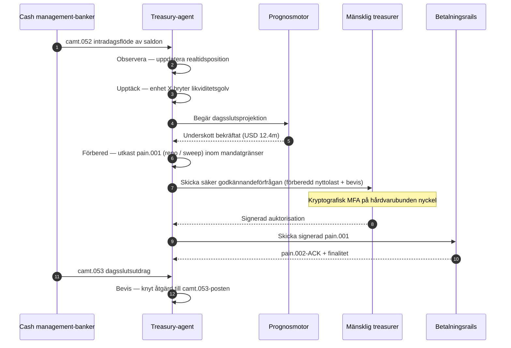

# Autonomous Treasury Index 2026: agentisk treasury, programmerbar likviditet och tokeniserade insättningar

<!-- lead-start -->
<aside class="post-lead" aria-label="Sammanfattning av artikeln">

<strong>Sammanfattning.</strong> Ett index för autonom treasury 2026 — som mäter agentiska arbetsflöden, täckning av programmerbar likviditet, integration av tokeniserade insättningar, orkestrering av realtidsbetalningar och automatiserad realtidsstyrning av kassa som en sammanhållen operativ modell.

<strong>Viktiga slutsatser</strong>

<ul class="post-lead-takeaways">
  <li><strong>Treasury blir ett operativsystem i realtid.</strong> Statiska likviditetsprognoser och batch-sweepar är inte längre måttenheten; det är agentiska arbetsflöden som körs på realtidsdata.</li>
  <li><strong>Programmerbar likviditet är nu möjlig.</strong> Tokeniserade insättningar + realtidsrails gör likviditetstilldelning per händelse till en primitiv i arbetsflödet, inte ett kvartalsinitiativ.</li>
  <li><strong>Tokeniserade insättningar är treasurerns föredragna digitala pengar.</strong> Bankpengsekonomi, programmerbarhet och intradagssäkerhet — utan stablecoins frågor om emittentrisk och reserver.</li>
  <li><strong>Kontrollskiktet är den nya granskningsytan.</strong> Mandat, gränser, manuell överskrivning och bevis för återföring måste köras som plattformsprimitiver, inte som manuella godkännanden per åtgärd.</li>
  <li><strong>CFO:ns mätkort gäller per beslut, inte per kvartal.</strong> Kostnad för kassa, minskning av intradagslikviditetsbuffert, FX-effektivitet och prognosnoggrannhet mäts i arbetsflödeshastighet.</li>
</ul>

<strong>Relaterad läsning:</strong> <a href="https://sebastienrousseau.com/2026-05-25-programmable-liquidity-ai-tokenised-deposits-real-time-treasury-2026/index.html">Programmerbar likviditet 2026: AI, tokeniserade insättningar och realtidsorkestrering av treasury</a>, <a href="https://sebastienrousseau.com/2026-05-21-tokenised-deposits-banking-services-status-2026/index.html">Tokeniserade insättningar 2026: banktjänster, stablecoin-konkurrens och status för programmerbara affärsbankpengar</a>.

</aside>
<!-- lead-end -->

Autonom treasury är den naturliga mötesplatsen för agentisk AI, grossistbetalningar, tokeniserade insättningar och realtidslikviditet. Under 2026 kommer de bästa treasury-arkitekturerna inte bara att prognostisera kassan; de kommer att rekommendera, förklara och i förlängningen exekvera avgränsade likviditetsåtgärder över konton, valutor, rails och avvecklingstillgångar.

---

> **Executive sammanfattning / viktiga slutsatser**
>
> - **Treasury går från rapportering till kontroll.** Realtidssaldon, prognoser, betalningsstatus och likviditetsflöden blir delar av samma arbetsflöde.
> - **Agentisk AI skapar ett nytt treasury-gränssnitt.** Agenter kan övervaka positioner, lyfta fram avvikelser, förbereda finansieringsåtgärder och eskalera beslut inom definierade mandat.
> - **Programmerbara pengar förändrar kassaledet.** Tokeniserade insättningar och experiment med grossist-CBDC öppnar nya möjligheter för atomisk avveckling, villkorade betalningar och alltid tillgänglig likviditet.
> - **Indexet måste mäta befogenhet.** Frågan är inte om agenten kan föreslå en åtgärd; frågan är om befogenhet, gränser, godkännanden och bevis är tydliga.
> - **Treasury-värde är mätbart.** Sparad likviditet, färre manuella utredningar, undvikna avvecklingsmissar och frigjort rörelsekapital bör definiera framgång.
>
---

## Därför är 2026 året då detta index är viktigt

Stanford AI Index är användbart eftersom det behandlar ett snabbrörligt teknikfält som något mätbart: forskningsproduktion, teknisk prestanda, ansvarsfull implementering, ekonomi, sektorsadoption, policy och allmän opinion förs in i en gemensam ram ([Stanford HAI ⧉](https://hai.stanford.edu/ai-index/2026-ai-index-report "Rapporten The 2026 AI Index")). Banker och finansiella institutioner behöver nu samma disciplin för infrastrukturen. Agentisk AI, kvantsäker säkerhet, molnbaserad resiliens och grossistbetalningar är inte längre separata innovationsspår; de konvergerar till en gemensam operativ modell.

Den praktiska frågan för en bank är inte om varje område är viktigt. Det är om institutionen kan mäta beredskap inom alla samtidigt. En bank kan införa agentisk AI och ändå vara skör om dess kryptografi inte är redo för migrering. Den kan modernisera molnplattformar och ändå misslyckas om betalningsdata förblir ostrukturerad. Den kan köra tokeniseringspiloter och ändå skapa systemrisk om avvecklings-, likviditets-, identitets- och granskningslagren inte är konstruerade tillsammans.

## Indexarkitekturen 2026

| Indexskikt | Riktning 2026 | Beredskapsmått | Risk vid felhantering |
|---|---|---|---|
| **Synlighet** | Förena konto-, betalnings-, likviditets- och exponeringsdata | Täckning av kassapositioner i realtid | Fragmenterad kassasynlighet |
| **Prognoser** | Använd AI för att prognostisera saldon, flöden och finansieringsbehov | Prognosnoggrannhet och avvikelsefrekvens | Falskt förtroende för svag data |
| **Autonomi** | Ge agenter avgränsad befogenhet för rekommendationer och åtgärder | Mandattäckning och godkännandekvalitet | Otillåten eller oförklarad åtgärd |
| **Programmerbarhet** | Använd tokeniserade insättningar och smarta villkor där de tillför värde | Användningsfall för villkorad betalning och atomisk avveckling | Teknikledda treasury-piloter |
| **Kontroller** | Bygg in gränser, sanktioner, FX, likviditet och granskningskontroller | Kontrollbevis per treasury-åtgärd | Manuell styrning efter exekvering |

## Aktuella signaler att följa

| Signal | Vad det betyder för banker | Källa |
|---|---|---|
| **52 % adoption av agentisk AI inom finansiella tjänster** | Treasury kan nu absorbera agentiska arbetsflöden via styrda plattformar | [Cambridge CCAF ⧉](https://www.jbs.cam.ac.uk/faculty-research/centres/alternative-finance/publications/2026-global-ai-in-financial-services-report/ "2026 Global AI in Financial Services Report") |
| **Villkorade betalningar i Project Agorá** | Tokenisering kan möjliggöra villkorade och alltid tillgängliga betalningsfunktioner | [BIS ⧉](https://www.bis.org/about/bisih/topics/fmis/agora.htm "Project Agorá") |
| **Bank of England — Digital Securities Sandbox** | DLT-emitterade obligationer och aktier avvecklas på basis av Leverans mot betalning (DvP) — tillgångsbenet och kassabenet (grossist-CBDC eller tokeniserade affärsbanksinsättningar) avvecklas i samma atomiska transaktion, vilket eliminerar principalmotpartsrisken | [Bank of England ⧉](https://www.bankofengland.co.uk/financial-stability/digital-securities-sandbox "Digital Securities Sandbox") |
| **SWIFT:s deadline för strukturerade adresser** | Treasury-data måste fångas korrekt vid källan | [SWIFT ⧉](https://www.swift.com/news-events/news/iso-20022-milestone-november-2026-unstructured-addresses-be-removed "ISO 20022-milstolpen i november 2026 om strukturerade adresser") |
| **Stora finansinstitut har svårt att mäta värdet av AI** | Treasury-automation behöver hårda ekonomiska mått | [Cambridge CCAF ⧉](https://www.jbs.cam.ac.uk/faculty-research/centres/alternative-finance/publications/2026-global-ai-in-financial-services-report/ "2026 Global AI in Financial Services Report") |

## Treasury-agentens mandat

En treasury-agent bör inte utformas som en allmän assistent. Den behöver ett mandat: observera konton, upptäcka avvikelser, prognostisera finansieringsgap, förbereda åtgärder, begära godkännanden, exekvera inom gränser och producera bevis. Varje steg bör ha en egen befogenhetsmodell.

Kontrollslingan löper Observera → Upptäck → Prognostisera → Förbered → Begär godkännande — och stannar där. Agenten passerar aldrig den kryptografiska auktorisationsgränsen på egen hand. Diagrammet nedan följer en hel cykel: ett mångmiljon-intradagsunderskott i likviditet syns i `camt.052`-telemetri, agenten prognostiserar dagsslutspositionen, förbereder en repo eller koncernintern sweep som ett fullständigt utformat `pain.001` och lämnar över det till den mänskliga treasurern för flerfaktorautentiserad kryptografisk signering på en hårdvarubunden nyckel. Agenten skickar sedan in den signerade nyttolasten; finalitet landar som en `pain.002`-ACK och nästa `camt.053` of record.

Gränsen är hela poängen — varje åtgärd som flyttar riktiga pengar ligger bakom en kryptografisk grind som agenten inte kan passera på egen hand.

## Programmerbar likviditet

Programmerbar likviditet är förmågan att flytta värde under villkor: om ett tröskelvärde överskrids, om säkerhet är godtagbar, om en motpart klarar screening, om avvecklingsfinalitet finns tillgänglig eller om en intradagslikviditetsbuffert är för låg. Tokeniserade insättningar och avvecklingsplattformar på grossistnivå gör dessa mönster mer praktiska.

Programmerbar betyder inte off-standard. Exekveringsvägen är `pain.001` — ISO 20022 Customer Credit Transfer Initiation. Agentens förberedda åtgärd är en fullständigt utformad `pain.001`-nyttolast som routas till banken i samma kanal som ett företags ERP skulle använda, valideras mot samma schema, scoras av samma bedrägeri- och sanktionsmotorer och bekräftas på samma `pain.002`-statusrapporter. Villkorslagret (tröskel, säkerhetsgodtagbarhet, finalitetstillgänglighet, buffertgolv) ligger ovanför meddelandet — det avgör *om* en `pain.001` ska skickas, inte *vilken form* den ska ha. Treasury-plattformar som uppfinner egna nyttolaster för att uttrycka villkor faller ur den bankkonsumerbara vägen och tillbaka i bilateral integration.

## Treasury-kontrollrummet

Den operativa modellen bör se ut som ett kontrollrum: positioner, prognoser, betalningsstatus, gränsanvändning, avvikelser, godkännanden och bevis i ett gränssnitt. Indexet bör straffa treasury-stackar som tvingar team att sy ihop e-post, kalkylblok, bankportaler och bortkopplade dashboards.

Dataplanet bakom det gränssnittet är ISO 20022 cash management. Intradagsposition är `camt.052` — Bank-to-Customer Account Report — som strömmas från varje cash management-bank in i agentens observationslager med den frekvens banken publicerar (minuter för tier-1 GTB-leverantörer, slutet av cykeln för den långa svansen). Dagsslutsavstämning är `camt.053` — Bank-to-Customer Statement — den granskningsbara post som agentens prognos bedöms mot nästa morgon. Treasury-plattformar som läser PDF-utdrag eller skrapar bankportaler kan inte nå Nivå 4 i indexet; intradagstelemetrin måste komma in som strukturerad `camt.052` för att prognosslingan ska kunna stängas i tid för att agera.

## Vad detta innebär per banktyp

### Globalt systemviktiga banker

Globala banker bör behandla detta index som ett enterprise-arkitekturmätkort. Prioriteten är inte ännu en proof-of-concept; det är bevis på att autonoma arbetsflöden, kryptografisk migrering, molnberoende och betalningsmodernisering kan styras som ett gemensamt risk- och värdesystem.

### Transaktionsbanker och företagsbanker

Transaktionsbanker bör fokusera på grossistbetalningar, strukturerad data, likviditet, tokeniserade insättningar och agentiska treasury-tjänster. Det mest värdefulla kunderbjudandet är inte enbart snabbare penningflyttning; det är förklarbar, granskningsbar och programmerbar penningflyttning med färre utredningar och bättre synlighet av rörelsekapital.

### Regionala banker

Regionala banker bör använda indexet för att undvika programspridning. De behöver inte leda varje frontlinje, men de behöver trovärdiga positioner inom AI-styrning, post-kvantinventering, bevis för molnutträde och beredskap för betalningsdata.

### Fintech, PSP:er och infrastrukturleverantörer

Fintechs och infrastrukturleverantörer bör anpassa sina produktroadmaps till mätbar bankberedskap. De bästa erbjudandena minskar integrationsrisk, stärker bevisföring och gör komplex infrastruktur lättare för banker att styra.

## Slutsats

Värdet av en index-rapport är att den omvandlar en fragmenterad teknikagenda till en mätbar operativ modell. Under 2026 blir vinnarna i finansiell infrastruktur inte de institutioner som har flest piloter. Det blir de institutioner som kan bevisa beredskap inom autonomi, säkerhet, resiliens, avveckling, ekonomi och styrning samtidigt.

## Vanliga frågor

**Vad är autonom treasury?**

Autonom treasury är användningen av AI-agenter, realtidsdata och programmerbara betalningar för att övervaka, rekommendera och potentiellt exekvera treasury-åtgärder inom definierade kontroller.

**Bör treasury-agenter få exekvera betalningar?**

Endast inom snäva mandat, starka gränser, uttryckliga godkännanden och full granskningsbarhet. Befogenhet att exekvera bör förtjänas genom mognad.

**Hur hjälper tokeniserade insättningar treasury?**

De kan stödja programmerbar avveckling, atomisk exekvering och potentiellt bättre kontroll över intradagslikviditet samtidigt som relationer till affärsbankpengar bevaras.

**Vad är det första implementeringssteget?**

Bygg synlighet i realtid och datakvalitet innan autonomi beviljas. Agenter kan inte tryggt optimera en kassa som de inte ser korrekt.

## Referenser

- Cambridge Centre for Alternative Finance, (2026). [2026 Global AI in Financial Services Report ⧉](https://www.jbs.cam.ac.uk/faculty-research/centres/alternative-finance/publications/2026-global-ai-in-financial-services-report/ "2026 Global AI in Financial Services Report").
- SWIFT, (2026). [ISO 20022-milstolpen i november 2026 om strukturerade adresser ⧉](https://www.swift.com/news-events/news/iso-20022-milestone-november-2026-unstructured-addresses-be-removed "ISO 20022-milstolpen i november 2026 om strukturerade adresser").
- BIS Innovation Hub, (2026). [Project Agorá ⧉](https://www.bis.org/about/bisih/topics/fmis/agora.htm "Project Agorá").
- Bank of England, (2026). [Att forma Storbritanniens digitala finansiella framtid ⧉](https://www.bankofengland.co.uk/speech/2025/january/sasha-mills-speech-at-the-tokenisation-summit "Att forma Storbritanniens digitala finansiella framtid").

<!-- enrich-start -->
<aside class="author-card" aria-label="Om författaren"><strong class="author-card-name"><a href="/about/index.html">Sebastien Rousseau</a></strong>Senior bankteknikspecialist som skriver om tillämpad AI, betalningsinfrastruktur, tokeniserade pengar, ISO 20022, postkvantsäkerhet, molnbaserade finansiella tjänster och reglerade digitala marknader.20+ år inom HSBC Commercial &amp; Investment Bank, PayPal, Barclays, Shazam, AKQA, Virgin Group. <a href="/about/index.html">Fullständig profil</a> &middot; <a href="https://www.linkedin.com/in/sebastienrousseau/" rel="external noopener">LinkedIn</a> &middot; <a href="https://github.com/sebastienrousseau" rel="external noopener">GitHub</a></aside>

Senast granskad <time datetime="2026-06-07">2026-06-07</time>.

<!-- enrich-end -->
