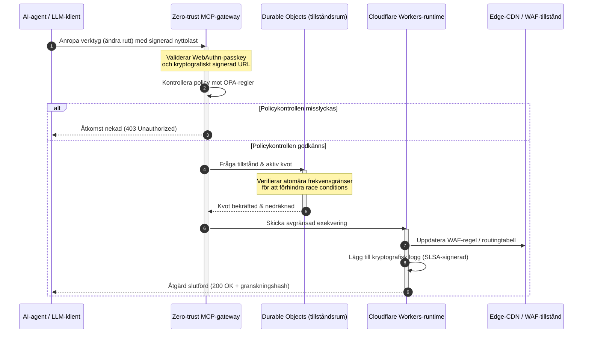

---

# Front Matter (YAML)

author: "contact@sebastienrousseau.com (Sebastien Rousseau)"
banner_alt: "Lysande rackstapel i ett datacenter på natten — symboliserar den inspekterbara, agentstyrda edge med öppen källkod som CloudCDN är byggd på"
banner_height: "1597"
banner_width: "2584"
banner: "https://cloudcdn.pro/stocks/images/alis-po-IdVNRv-5wJo.webp"
cdn: "https://cloudcdn.pro"
charset: "UTF-8"
cname: "sebastienrousseau.com"
copyright: "© Copyright 2025 - 2026 - Sebastien Rousseau. All rights reserved."
date: "June 11, 2026"
description: "CloudCDN gör CDN till ett kryptografiskt säkert, agentstyrbart edge-kontrollplan — zero-trust MCP-gateway, Durable Objects, SLSA Level 3 och DORA-bevis."
format-detection: "telephone=no"
hreflang: "sv"
icon: "https://cloudcdn.pro/clients/sebastienrousseau/v1/logos/sebastienrousseau.svg"
id: "https://sebastienrousseau.com/sv/2026-06-11-cloudcdn-open-source-blueprint-ai-native-edge-2026"
image_alt: "Svartvitt porträtt av Sebastien Rousseau"
image_height: "162"
image_width: "162"
image: "https://cloudcdn.pro/stocks/images/sebastienrousseau.webp"
keywords: "CloudCDN, AI-inbyggd edge, CDN med öppen källkod, MCP-server, Cloudflare Workers, Durable Objects, zero trust, WebAuthn, signerade URL:er, SLSA Level 3, DORA, edge-kontrollplan"
language: "sv"
last_reviewed: "2026-06-11"
layout: "report"
locale: "sv_SE"
logo_alt: "Logotyp för Sebastien Rousseau"
logo_height: "44"
logo_width: "44"
logo: "https://cloudcdn.pro/clients/sebastienrousseau/v1/logos/sebastienrousseau.svg"
menu: ""
measurementID: "G-169G4ET5HQ"
name: "Sebastien Rousseau"
permalink: "https://sebastienrousseau.com/sv/2026-06-11-cloudcdn-open-source-blueprint-ai-native-edge-2026"
rating: "general"
referrer: "no-referrer"
robots: "index, follow"
schema: "FAQPage, Article"
seo_title: "CloudCDN: AI-inbyggd edge-ritning med öppen källkod"
short_name: "sebastienrousseau"
subtitle: "Från statisk innehållscachning till ett kryptografiskt säkert, agentstyrbart edge-kontrollplan för den globala CDN:en."
tags: "CloudCDN, öppen källkod, CDN, edge, AI-agenter, MCP, Cloudflare Workers, Durable Objects, frekvensbegränsning, zero trust, WebAuthn, SLSA, DORA, BCBS 239, Basel III, cloud native banking"
theme-color: "0, 83, 191"
title: "CloudCDN: en ritning med öppen källkod för AI-inbyggd edge 2026"
url: "https://sebastienrousseau.com/sv/2026-06-11-cloudcdn-open-source-blueprint-ai-native-edge-2026"
viewport: "width=device-width, initial-scale=1, shrink-to-fit=no"

# RSS - The RSS feed front matter (YAML).
atom_link: "https://sebastienrousseau.com/2026-06-11-cloudcdn-open-source-blueprint-ai-native-edge-2026/rss.xml"
category: "Technology"
docs: https://validator.w3.org/feed/docs/rss2.html
generator: "Static Site Generator (SSG) (version 0.0.26)"
item_description: "CloudCDN gör CDN till ett kryptografiskt säkert, agentstyrbart edge-kontrollplan — zero-trust MCP-gateway, Durable Objects, SLSA Level 3 och DORA-bevis."
item_guid: "https://sebastienrousseau.com/2026-06-11-cloudcdn-open-source-blueprint-ai-native-edge-2026/rss.xml"
item_link: "https://sebastienrousseau.com/2026-06-11-cloudcdn-open-source-blueprint-ai-native-edge-2026/rss.xml"
item_pub_date: "Thu, 11 Jun 2026 06:06:06 +0000"
item_title: "CloudCDN: en ritning med öppen källkod för AI-inbyggd edge 2026"
last_build_date: "Thu, 11 Jun 2026 06:06:06 +0000"
managing_editor: "contact@sebastienrousseau.com (Sebastien Rousseau)"
pub_date: "Thu, 11 Jun 2026 06:06:06 +0000"
ttl: "60"
type: "article"
webmaster: "contact@sebastienrousseau.com"

# Apple - The Apple front matter (YAML).
apple_mobile_web_app_orientations: "portrait"
apple_touch_icon_sizes: "192x192"
apple-mobile-web-app-capable: "yes"
apple-mobile-web-app-status-bar-inset: "black"
apple-mobile-web-app-status-bar-style: "black-translucent"
apple-mobile-web-app-title: "CloudCDN: AI-inbyggd edge-ritning med öppen källkod"
apple-touch-fullscreen: "yes"

# MS Application - The MS Application front matter (YAML).

msapplication-navbutton-color: "0, 83, 191"

# Twitter Card - The Twitter Card front matter (YAML).

twitter_card: "summary_large_image"
twitter_creator: "@wwdseb"
twitter_description: "CloudCDN gör CDN till ett kryptografiskt säkert, agentstyrbart edge-kontrollplan — zero-trust MCP-gateway, Durable Objects, SLSA Level 3 och DORA-bevis."
twitter_image: "https://cloudcdn.pro/clients/sebastienrousseau/v1/logos/sebastienrousseau.svg"
twitter_image_alt: "Logotyp för Sebastien Rousseau"
twitter_site: "@wwdseb"
twitter_title: "CloudCDN: AI-inbyggd edge-ritning med öppen källkod"
twitter_url: "https://sebastienrousseau.com/2026-06-11-cloudcdn-open-source-blueprint-ai-native-edge-2026"

excerpt: "CloudCDN är en ritning med öppen källkod för AI-inbyggd edge — en zero-trust MCP-gateway med 42 verktyg, atomär frekvensbegränsning via Durable Objects, WebAuthn-passkeys, signerade URL:er, SLSA Level 3-proveniens och 3 185 tester vid 100 % täckning, mappade mot DORA, BCBS 239 och Basel III."

# Humans.txt - The Humans.txt front matter (YAML).
author_website: "https://sebastienrousseau.com"
author_twitter: "@wwdseb"
author_location: "London, UK"
thanks: "Tack för att du läste!"
site_last_updated: "2026-06-11"
site_standards: "HTML5, CSS3, RSS, Atom, JSON, XML, YAML, Markdown, TOML"
site_components: "Kaishi, Kaishi Builder, Kaishi CLI, Kaishi Templates, Kaishi Themes"
site_software: "Static Site Generator, Rust"

---

# CloudCDN: en ritning med öppen källkod för AI-inbyggd edge 2026

<!-- lead-start: manual -->
<aside class="post-lead" aria-label="Sammanfattning av artikeln">

<strong>Sammanfattning.</strong> Företagsteknik 2026 definieras av konvergensen mellan globalt distribuerad serverlös exekvering och agentbaserad AI. Standard-CDN:er — byggda för statisk filcachning och grundläggande trafikstyrning — är strukturellt föråldrade i en era av aktiv dataorkestrering i realtid. CloudCDN är en ritning med öppen källkod som omvandlar edge till ett aktivt kontrollplan: serverlösa runtimes, tillståndsbärande samordning genom Cloudflare Durable Objects och en zero-trust-gateway för Model Context Protocol (MCP) som låter autonoma AI-agenter driva webbinfrastruktur inom avgränsade, kryptografiskt säkrade operativa ramar.

<strong>Viktiga slutsatser</strong>

<ul class="post-lead-takeaways">
  <li><strong>Från statisk cache till avgränsat kontrollplan.</strong> CloudCDN flyttar den operativa gränsen till edge och omvandlar CDN-noder till aktiva policygrindar som exekverar beslut om säkerhet, routing och åtkomstkontroll på under en millisekund.</li>
  <li><strong>Tillståndsbärande edge-samordning.</strong> Cloudflare Durable Objects tillämpar atomär frekvensbegränsning och tillståndssamordning i realtid globalt — inga distribuerade race conditions, inget systemiskt kvotmissbruk mellan edge-regioner.</li>
  <li><strong>Säker agentbaserad infrastrukturhantering via MCP.</strong> En zero-trust-gateway exponerar 42 specialiserade MCP-verktyg och låter AI-agenter inspektera, konfigurera och driva infrastruktur under kryptografiskt signerade ramar.</li>
  <li><strong>Säkerhet i leveranskedjan som en pipeline-leverans.</strong> SLSA Level 3-byggproveniens via Sigstore/Cosign och 3 185 enhetstester vid 100 % täckning i varje release.</li>
  <li><strong>Bevis på styrelsenivå, inte instrumentpaneler.</strong> Edge-telemetri mappas direkt mot styrelseansvar enligt DORA artikel 5, riskrapportering enligt BCBS 239 och Basel III:s kapitalregler för operativ risk.</li>
</ul>

<strong>Vidare läsning:</strong> <a href="/2026-05-16-best-cloud-infrastructure-architecture-2026/">Den bästa molninfrastrukturarkitekturen 2026</a> · <a href="/2026-06-05-cloud-native-banking-index-dora-resilience-platform-engineering-2026/">Cloud Native Banking-index 2026</a> · <a href="/2026-06-03-agentic-ai-index-banks-autonomy-governance-auditability-2026/">Agentic AI-index för banker 2026</a>

</aside>
<!-- lead-end -->

CDN-debatten är över. Edge är inte längre en cache; det är kontrollplanet för AI-inbyggd programvara. När agenter anropar verktyg, flyttar data, rensar cacher, begär signerade URL:er och samordnar arbetsflöden upphör den gamla modellen med ogenomskinliga paneler och proprietära kontrollplan att vara en olägenhet och blir en regulatorisk belastning. CloudCDN argumenterar för en annan modell: en öppen, inspekterbar och agentstyrbar edge-plattform som behandlar säkerhet, tillgänglighet, prestanda och granskningsbarhet som upprätthållbara standardvärden snarare än leverantörslöften.

Den referenspunkt med öppen källkod som ligger till grund för denna artikel är [cloudcdn.pro ⧉](https://github.com/sebastienrousseau/cloudcdn.pro "cloudcdn.pro"). Repot är en multitenant, AI-inbyggd CDN som kan läsas från ända till ända och driftsättas oberoende: TTFB under 100 ms över Cloudflares PoP:er, MCP-styrning, frekvensbegränsning via Durable Objects, WCAG-AA-tillgänglighet, signerade URL:er, passkeys, SLSA Level 3 och 3 185 tester vid 100 % täckning.

---

> **Executive sammanfattning / viktiga slutsatser**
>
> - **Edge blir den operativa gränsen.** CloudCDN omvandlar standard-CDN-noder till aktiva policygrindar som exekverar säkerhet, routing och åtkomstkontroll på under en millisekund.
> - **Durable Objects gör frekvensbegränsningen atomär.** Globalt konsekvent kvottillämpning i realtid stänger det race condition-fönster som eventuellt konsistenta begränsare lämnar öppet för angripare och felfungerande agenter.
> - **Agenter driver infrastruktur genom 42 avgränsade MCP-verktyg.** Varje anrop valideras mot WebAuthn-passkeys, signerade nyttolaster och OPA-policy innan något exekveras.
> - **Leveranskedjan är en del av produkten.** SLSA Level 3-proveniens via Sigstore/Cosign länkar kryptografiskt varje release till dess granskade källkod.
> - **Telemetri är efterlevnadsbevis.** Edge-operationer mappas mot DORA artikel 5, BCBS 239 och Basel III:s kapital för operativ risk — direkt, inte genom rapportering i efterhand.
>
---

## Därför betyder detta projekt med öppen källkod något 2026

Företags-IT 2026 har gått från statisk infrastrukturprovisionering till händelsedriven dataorkestrering i realtid. Två marknadskrafter driver skiftet.

Den första är spridningen av agentbaserad AI. Autonoma modeller och programvaruagenter utför nu komplexa operativa uppgifter — automatiserad hotbekämpning, routingbeslut, reskontrabalansering i realtid. De använder inte instrumentpaneler. De anropar verktyg.

Den andra är den aktiva tillämpningen av [förordningen om digital operativ motståndskraft (DORA) ⧉](https://eur-lex.europa.eu/legal-content/EN/TXT/?uri=CELEX%3A32022R2554 "Förordning (EU) 2022/2554 om digital operativ motståndskraft för finanssektorn"). Bankinstitut kan inte längre förlita sig på ogenomskinliga, proprietära tredjeparts-CDN:er. Tillsynsmyndigheterna kräver fullständig insyn i programvarans leveranskedja, verifierbar exitförmåga och oföränderliga kryptografiska granskningsspår.

Centraliserade serverarkitekturer medför latensstraff som realtidsorkestrering inte kan absorbera. Proprietära CDN:er fungerar som svarta lådor som exponerar institut för kompromettering av leveranskedjan som de varken kan se eller bevisa. CloudCDN stänger det gapet med en transparent zero-trust-ritning med öppen källkod som gör edge till ett aktivt kontrollplan. För teknikchefer flyttar den samtalet från kostnaden för efterlevnad till avkastningen på resiliens — Return on Resilience: kapital som bevaras genom automatiserade, granskningsklara operativa pipelines.

## Arkitekturperspektivet

CloudCDN-arkitekturen är strukturerad i fem lager och ersätter centraliserad middleware med lokaliserade, tillståndsbärande edge-primitiver:

| Lager | Designbeslut | Varför det spelar roll | Risk vid felhantering |
|---|---|---|---|
| **Edge-runtime** | Cloudflare Workers och Pages | Eliminerar latens från centraliserade VM:ar; exekverar policyer på under en millisekund globalt | Prestandavinster utan policydisciplin skapar kaotisk edge-drift |
| **Tillståndssamordning** | Durable Objects | Garanterar atomär realtidskonsistens för frekvensgränser och delat tillstånd mellan regioner | Distribuerade race conditions, missbruk av API-resurser, kringgångna perimeterkvoter |
| **Agentgränssnitt** | Zero-trust MCP-gateway | Exponerar 42 specialiserade MCP-verktyg så att AI-agenter driver infrastruktur under styrda ramar | Obegränsade verktygsanrop och obehöriga konfigurationsändringar |
| **Åtkomstkontroll** | WebAuthn-passkeys och signerade URL:er | Ersätter statiska lösenord med kryptografiska signaturer för granskningsbara operationer | Svagt attribuerade ändringar; stöld av inloggningsuppgifter som leder till perimeterintrång |
| **Kvalitetsgrindar** | SLSA Level 3 och 100 % testtäckning | Verifierar byggkällan matematiskt; blockerar skadlig beroendeinjektion | Skadlig kod införd via programvarans leveranskedja |

## Operativa signaler att följa

Edge-beredskap är mätbar. Detta är de kvantitativa indikatorer som visar exekveringsförmåga snarare än avsikt:

| Signal | Mätvärde / referensnivå | Regulatorisk referens | Plattformsimplementation |
|---|---|---|---|
| **42 MCP-verktyg** | Avgränsat antal verktyg i registret för automatiserad hantering | COBIT 2019 (BAI06) | MCP-gateway som validerar agentsignaturer mot OPA-policyer |
| **Durable Objects** | Läckagefri, atomär kvottillämpning på under en millisekund | DORA artikel 6 | Durable Objects som spårar globalt API-kvottillstånd |
| **Passkeys och signerade URL:er** | 100 % av adminsessioner verifierade via FIDO2 WebAuthn | DORA artikel 30 | Kryptografiska signaturkontroller inbyggda i edge-routern |
| **SLSA Level 3** | Kryptografiskt signerade byggmanifest (Sigstore) | DORA artikel 30 | GitHub Actions-pipelines som genererar signerade byggmetadata |
| **3 185 enhetstester** | 100 % täckning; regressionsgrindar i varje release | NIST CSF 2.0 (PR.DS-01) | CI-pipelines som stoppar driftsättning vid varje testfel |

## CDN blir ett aktivt kontrollplan

Traditionella CDN:er designades kring passiv, statisk innehållsacceleration. CloudCDN omdefinierar modellen. Med Cloudflare Workers och Durable Objects integrerade fungerar edge som en aktiv, tillståndsbärande policygrind.

När en AI-agent eller en automatiserad process begär en ändring av infrastrukturkonfiguration eller en routingjustering pratar den inte med en sårbar, centraliserad databas. Begäran fångas upp vid närmaste edge-nod och förs genom identitets-, policy- och kvotkontroller innan något exekveras:

Varje steg i den sekvensen producerar en attribuerbar, signerad post. Det är skillnaden mellan en CDN som accelererar innehåll och ett kontrollplan som kan styras.

## Därför ändrar öppen källkod förtroendemodellen

För informationssäkerhetschefer utgör ogenomskinliga proprietära CDN:er en ackumulerande risk. Edge-nätverk med sluten källkod är svarta lådor: om leverantören drabbas av en intern kompromettering har banken noll insyn tills intrånget offentliggörs.

CloudCDN ersätter den asymmetrin med en fullt granskningsbar förtroendemodell med öppen källkod, byggd på tre mekanismer:

1. **Matematisk byggproveniens.** Under SLSA Level 3 länkas varje release kryptografiskt till sitt GitHub-repo med öppen källkod. En CISO kan verifiera — matematiskt, inte kontraktuellt — att binären som körs på Cloudflares globala edge-noder innehåller exakt den granskade källkoden.
2. **Kontinuerliga, offentliga säkerhetsgranskningar.** Kodbasen utsätts för automatiserade skanningar, offentlig sårbarhetsrapportering och peer-granskade kodrevisioner. Obskuritet är inte en kontroll; granskning är det.
3. **Ingen leverantörsinlåsning (DORA artikel 28).** DORA kräver att banker kan bevisa en tydlig, testad exitstrategi från kritiska tredjepartsleverantörer. Eftersom CloudCDN är öppen källkod och byggd på serverlösa standardprimitiver kan institut migrera edge-konfigurationer från Cloudflare till andra serverlösa runtimes eller privata Kubernetes-kluster — och bevisa den förmågan för tillsynsmyndigheten.

## Mönstret för bankklassad edge

CloudCDN är konstruerad för att möta den globala finanssektorns efterlevnadsstandarder och mappar tekniska edge-operationer direkt mot de ramverk som tillsynsmyndigheterna faktiskt granskar:

- **Modellriskhantering ([amerikanska Feds SR 11-7 ⧉](https://www.federalreserve.gov/supervisionreg/srletters/sr1107.htm "Tillsynsvägledning om modellriskhantering") / brittiska PRA:s SS1/23).** Autonoma modeller som utför operativa uppgifter omfattas av modellriskstyrning. CloudCDN:s MCP-gateway behandlar agentverktyg som kvantitativa modeller: strikta policyramar, loggning i realtid och obligatoriska human-in-the-loop-ingripanden för åtgärder med hög påverkan.
- **BCBS 239 (aggregering av riskdata).** Genom att fånga, tagga och strukturera transaktionsdata vid edge genereras operativa mätvärden i realtid — i linje med BCBS 239:s krav på dataintegritet, aktualitet och regulatorisk spårbarhet.
- **DORA artikel 5 (styrelseansvar).** Styrelsen bär det yttersta personliga ansvaret för operativ motståndskraft. CloudCDN omvandlar edge-telemetri till kvantifierade, verifierbara bevis som icke-tekniska styrelseledamöter kan ta med sig in i en granskning med personligt ansvar.
- **Basel III:s kapital för operativ risk.** Banker håller regulatoriskt kapital mot operativ risk. Automatiserad DR-failover och SLSA Level 3-proveniens sänker institutets operativa riskprofil — och bevarar kapital på balansräkningen, inte bara tillfredsställer en revision.

## Vad detta innebär per banktyp

### Globalt systemviktiga banker (G-SIB:er)

G-SIB:er hanterar enorma transaktionsvolymer över flera jurisdiktioner. Prioriteten är att ersätta fragmenterade äldre perimeterkontroller med ett enda, enhetligt edge-plan. Genom att driftsätta CloudCDN-mönstret kan en G-SIB standardisera säkerhetspolicyer, API-gateways och agentstyrning globalt — och generera DORA-kompatibla bevispipelines som en biprodukt av driften i stället för en kvartalsvis kraftsamling.

### Transaktions- och företagsbanker

För transaktionsbanker är den kundnära produkten ett paket av exekveringshastighet, säkerhet och datatransparens. CloudCDN-mönstret låter dessa banker exponera säkra API-instrumentpaneler och realtidstjänster för likviditetsspårning för företagens treasurers — en resilient edge-position som försvarar företagsinlåning.

### Regionala och mindre banker

Regionala banker möter samma hotaktörer som G-SIB:er utan deras ingenjörsbudgetar. En bankklassad edge-ritning med öppen källkod ger kontrollerna direkt ur lådan: omedelbar regulatorisk anpassning utan proprietära licenskostnader, och källkoden som bevis.

## Spelboken för styrelserummet

Operativ motståndskraft är inte längre ett osynligt IT-mätvärde i backoffice; det är en styrelseprioritet med personligt ansvar kopplat till sig. De institut som behåller tillsynsmyndigheters, kunders och aktieägares förtroende 2026 behandlar teknik som en verifierbar, observerbar tillgång.

Färdplanen för seniora teknikledare är kort:

1. **Gör bevis till en produkt.** Budgetera för automatiserade, självdokumenterande pipelines vid edge — bevis som genereras av driften, inte sammanställs för revisorn.
2. **Gå över till tillståndsbärande edge-kontroll.** Flytta frekvensbegränsning, WAF och identitetsverifiering från centraliserade servrar till atomära edge-primitiver.
3. **Etablera kryptografiska agentramar.** Tillämpa zero-trust MCP-gateways med passkey- och OPA-validering för varje automatiserat verktygsanrop.
4. **Kräv byggrevisioner med öppen källkod.** Gör SLSA Level 3-byggproveniens till ett villkor för driftsättning, inte en ambition.

## Vanliga frågor

**Är CloudCDN redo för DORA-revisioner?**

Ja. CloudCDN är konstruerad för att producera automatiserade efterlevnadsbevis som mappar direkt mot ITS-mallarna för informationsregistret (RT.01 till RT.15) och avtalsklausulerna i DORA artikel 30.

**Vad är fördelen med Durable Objects för frekvensbegränsning?**

Traditionella distribuerade frekvensbegränsare bygger på eventuell konsistens, vilket lämnar ett latensfönster som angripare eller felfungerande agenter kan utnyttja. Durable Objects garanterar omedelbar, atomär konsistens globalt och stänger race condition-fönstret helt.

**Vad gör CloudCDN AI-inbyggt?**

Dess MCP-styrda operationer och agentmedvetna kontrollmodell. Infrastrukturen drivs genom 42 styrda verktyg med kryptografisk identitet och policyramar — designad för autonoma arbetsflöden, inte enbart mänskliga instrumentpaneler.

**Ökar öppen källkod risken för zero-day-attacker?**

Nej. Proprietära CDN:er med sluten källkod förlitar sig på säkerhet genom obskuritet. CloudCDN:s kodbas utsätts kontinuerligt för automatiserad testning, offentlig peer-granskning och SLSA Level 3-validering — en verifierbart högre förtroendetröskel.

## Referenser

- Europaparlamentet och Europeiska unionens råd, (2022). [Förordning (EU) 2022/2554 om digital operativ motståndskraft för finanssektorn (DORA) ⧉](https://eur-lex.europa.eu/legal-content/EN/TXT/?uri=CELEX%3A32022R2554 "Förordning (EU) 2022/2554 om digital operativ motståndskraft för finanssektorn (DORA)"). Bryssel: Europeiska unionens officiella tidning.
- Baselkommittén för banktillsyn (BCBS), (2013). [Principer för effektiv aggregering av riskdata och riskrapportering (BCBS 239) ⧉](https://www.bis.org/publ/bcbs239.htm "Principer för effektiv aggregering av riskdata och riskrapportering (BCBS 239)"). Basel: Bank for International Settlements.
- Board of Governors of the Federal Reserve System, (2011). [Tillsynsvägledning om modellriskhantering (SR Letter 11-7) ⧉](https://www.federalreserve.gov/supervisionreg/srletters/sr1107.htm "Tillsynsvägledning om modellriskhantering (SR Letter 11-7)"). Washington D.C.: Federal Reserve.
- Cloudflare, (2026). [Dokumentation för Durable Objects: tillståndsbärande edge-samordning ⧉](https://developers.cloudflare.com/durable-objects/ "Dokumentation för Durable Objects"). San Francisco: Cloudflare.
- Cloudflare, (2026). [Att bygga AI-agenter med MCP, autentisering och Durable Objects ⧉](https://blog.cloudflare.com/building-ai-agents-with-mcp-authn-authz-and-durable-objects/ "Att bygga AI-agenter med MCP, autentisering och Durable Objects").
- GitHub, (2026). [cloudcdn.pro-repot ⧉](https://github.com/sebastienrousseau/cloudcdn.pro "cloudcdn.pro-repot").

<!-- enrich-start -->
<aside class="author-card" aria-label="Om författaren"><strong class="author-card-name"><a href="/about/index.html">Sebastien Rousseau</a></strong>Senior bankteknikspecialist som skriver om tillämpad AI, betalningsinfrastruktur, tokeniserade pengar, ISO 20022, postkvantsäkerhet, molnbaserade finansiella tjänster, infrastruktur med öppen källkod och reglerade digitala marknader.20+ år inom HSBC Commercial &amp; Investment Bank, PayPal, Barclays, Shazam, AKQA, Virgin Group. <a href="/about/index.html">Fullständig profil</a> &middot; <a href="https://www.linkedin.com/in/sebastienrousseau/" rel="external noopener">LinkedIn</a> &middot; <a href="https://github.com/sebastienrousseau" rel="external noopener">GitHub</a></aside>

Senast granskad <time datetime="2026-06-11">2026-06-11</time>.

<!-- enrich-end -->
