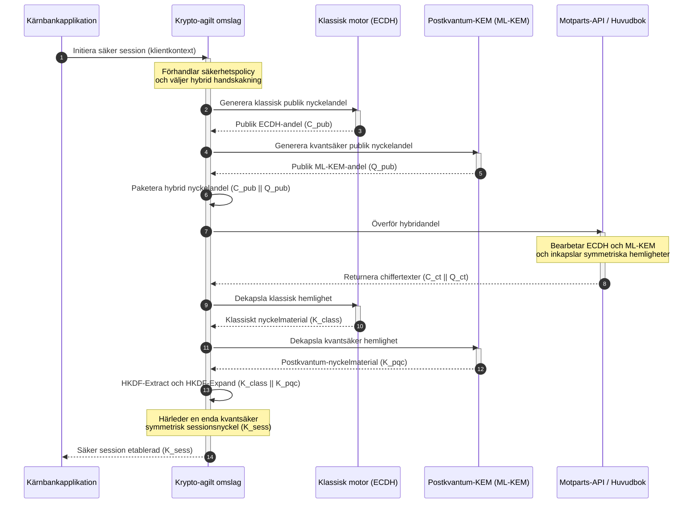

# KyberLib och bankernas postkvantum-migration 2026: från standarder till kod

<!-- lead-start: manual -->
<aside class="post-lead" aria-label="Sammanfattning av artikeln">

<strong>Sammanfattning.</strong> Bankinfrastrukturen står 2026 inför ett systemhot med en känd slutpunkt: beräkningar i kvantskala kommer att knäcka det RSA- och ECC-nyckelutbyte som skyddar dagens transittrafik. Federala standarder och tillsynsdokument har höjt medvetenheten; det tekniska genomförandet förblir uppdelat i silor. <a href="https://github.com/sebastienrousseau/kyberlib">KyberLib</a> är en ingenjörsritning med öppen källkod som flyttar postkvantum-berättelsen in i konkret, minnessäker Rust-kod — med NIST-standardiserad ML-KEM (FIPS 203) bakom krypto-agila abstraktionsgränser, så att institutioner kan uppgradera transportsäkerhet och nyckelinkapsling innan "Store Now, Decrypt Later"-attacker når deras arkiv.

<strong>Viktiga slutsatser</strong>

<ul class="post-lead-takeaways">
  <li><strong>Från policy till inspekterbar kod.</strong> KyberLib flyttar postkvantum-kryptografin från abstrakta strategiska färdplaner till konkreta, högpresterande och granskningsbara Rust-implementationer.</li>
  <li><strong>Standardiserat FIPS 203 ML-KEM-utförande.</strong> Biblioteket implementerar ML-KEM — nyckeletableringsalgoritmen som fastställts i NIST FIPS 203 — och håller konformiteten i linje med globala tillsynsförväntningar.</li>
  <li><strong>Krypto-agilitet i grunddesignen.</strong> Stabila abstraktionsgränser låter bankapplikationer byta kryptografiska primitiver utan dyra och felbenägna omskrivningar av applikationerna.</li>
  <li><strong>Minnessäkerhet driven av Rust.</strong> Ägarskapsregler vid kompilering utrotar de buffertöverskridanden och minnesläckor som plågar äldre C-baserade kryptobibliotek — utan att ge avkall på hastighet, tack vare kostnadsfria abstraktioner.</li>
  <li><strong>Begränsning av styrelsens fiduciariska ansvar.</strong> Observerbara, testbara migrationsbevis ger styrelseledamöter det underlag om "rimliga åtgärder" som granskningar av personligt ansvar enligt DORA artikel 5 kräver.</li>
</ul>

<strong>Relaterad läsning:</strong> <a href="/2026-05-18-quantum-cryptography-standards-developments-2026/">Standarder för kvantkryptografi 2026: PQC, QKD-säkerställning och migrationsarbetet banker inte kan skjuta upp</a>, <a href="/2026-05-28-dora-ai-act-data-sovereignty-banking-compliance-stack-2026/">DORA + AI-förordningens efterlevnadsstack</a>, <a href="/2026-05-20-cloud-native-banking-financial-institutions-2026/">Molnbaserad bankverksamhet</a>.

</aside>
<!-- lead-end -->

Postkvantum-migrationen har upphört att vara en planeringsövning. 2026 är den ett aktivt operativt krav, och gapet mellan regulatorisk avsikt och tekniskt genomförande är där risken nu sitter. [KyberLib ⧉](https://github.com/sebastienrousseau/kyberlib "kyberlib") sluter en del av det gapet: ett produktionsorienterat, minnessäkert Rust-bibliotek som implementerar ML-KEM enligt de fastställda FIPS 203-parametrarna och kapslar in det i de krypto-agila gränser som en banks transaktionsmiljö faktiskt behöver.

---

> **Executive sammanfattning / viktiga slutsatser**
>
> - **Hotet är redan operativt.** Angripare bedriver "Store Now, Decrypt Later"-insamling i dag; datakonfidentialiteten fallerar retroaktivt den dag en kryptografiskt relevant kvantdator anländer.
> - **Standarderna är fastställda.** NIST FIPS 203 (ML-KEM) och FIPS 204 (ML-DSA) ger revisionsutskotten ett tydligt, testbart riktmärke — försvaret "vi väntar på standarder" existerar inte längre.
> - **KyberLib är ingenjörsritningen.** Minnessäker Rust, `no_std`-kompilering för HSM:er och smarta kort, samt hybrida handskakningsmönster som bevarar klassisk interoperabilitet.
> - **Krypto-agilitet är det hållbara målet.** Stabila abstraktionsgränser låter primitiver bytas utan applikationsomskrivningar — lärdomen som överlever varje enskild algoritm.
> - **Styrelserna bär ansvaret.** DORA artikel 5 lägger personligt ansvar på styrelseledamöterna; inspekterbar, observerbar migrationskod är beviset som uppfyller det.
>
---

## Varför detta projekt med öppen källkod betyder något 2026

I takt med att asymmetrisk kryptografi närmar sig obsolescens väntar hotet inte på att en kryptografiskt relevant kvantdator ska byggas. Angripare genomför **"Store Now, Decrypt Later" (SNDL)**-attacker redan nu — de samlar in krypterade transitströmmar med företagsbankstransaktioner, affärshemligheter och institutionell kommunikation i avsikt att dekryptera dem när kvantkapaciteten mognat. För en bank är varje klassisk handskakning på linjen i dag ett konfidentialitetsbrott med fördröjd detonationstidpunkt.

Tillsynsmyndigheterna har svarat med konkreta skyldigheter:

1. **DORA artikel 6 (IKT-riskhantering)** kräver att institutioner kartlägger, identifierar och åtgärdar sårbarheter i hela sin kryptografiska miljö — inklusive det asymmetriska nyckelutbyte som ligger begravt i mellanprogramvara ingen har inventerat.
2. **NIST FIPS 203 och 204** etablerar de officiella postkvantum-standarderna för nyckelinkapsling (ML-KEM) och digitala signaturer (ML-DSA), vilket ger revisionsutskotten ett standardiserat riktmärke mot vilket migrationens framsteg mäts.

Att genomföra denna migration utan att störa den löpande verksamheten kräver att man rör sig bortom policydokument till **inspekterbar kryptografisk infrastruktur med öppen källkod**. [KyberLib ⧉](https://github.com/sebastienrousseau/kyberlib "kyberlib") levererar exakt det: ett minnessäkert Rust-bibliotek som följer FIPS 203 och förvandlar postkvantum-övergången till en mätbar, verifierbar ingenjörskedja — och flyttar samtalet om teknikinvesteringar mot en påtaglig avkastning på motståndskraft.

## Arkitekturlinsen

KyberLib sitter bakom stabila API-gränser och isolerar en banks centrala transaktionsapplikationer från förändringar i lågnivå-kryptografiska primitiver.

| Lager | Designbeslut | Varför det betyder något | Risk vid felhantering |
|---|---|---|---|
| **Primitiv** | Nyckelinkapsling med ML-KEM enligt FIPS 203 | Ersätter klassiskt Diffie-Hellman- och RSA-nyckelutbyte med gitterbaserade strukturer | Bristande konformitet med de fastställda FIPS 203-parametrarna, vilket leder till underkända efterlevnadsrevisioner |
| **Språk** | Minnessäker Rust-implementation | Eliminerar de minneskorruptionssårbarheter (buffertöverskridanden, use-after-free) som är endemiska i C/C++ | Beroendespridning som komprometterar byggkedjans integritet |
| **Abstraktion** | Stabila krypto-agila gränser | Applikationer byter algoritm bakom ett enhetligt gränssnitt i takt med att standarder utvecklas | Hårdkodade primitiver som tvingar fram manuella omskrivningar i varje framtida migration |
| **Distribution** | Hybrida krypteringshandskakningar | Kombinerar postkvantum-KEM:er med klassiska algoritmer i ett dubbelinkapslat kuvert | Förlorad interoperabilitet med äldre system eller tyst konfigurationsdrift |
| **Säkerställning** | SLSA Level 3-proveniens och inspekterbara tester | Garanterar kodens ursprung och proveniens; exempel kan granskas rad för rad | Säkerhetsteater — svartlådebibliotek vars implementationsfel dyker upp i produktion |

## Operativa signaler att följa

Att visa postkvantum-efterlevnad för styrelser och tillsynsmyndigheter innebär att följa specifika, kvantifierbara mätetal:

| Signal | Mätetal | Regulatorisk referens | Plattformsimplementation |
|---|---|---|---|
| **FIPS 203 ML-KEM-konformitet** | 100 % efterlevnad av fastställda parametrar (ML-KEM-512/768/1024) | NIST FIPS 203 | Parameterverifierad gitterkryptografi kompilerad i KyberLib-moduler |
| **Kryptografisk inventering** | Komplett inventering av asymmetrisk nyckelutbytesanvändning i samtliga system | NIST SP 1800-38 | Automatiserade skanningsagenter som loggar aktiva chiffersviter till ett centralt register |
| **Hybrid nyckelutbyte** | Andel handskakningar i transportlagret som körs i ett hybridkuvert | DORA artikel 6 | Nätverksproxyer som kapslar in klassiska TLS 1.3-handskakningar i PQC-inkapsling |
| **`no_std`-kompilering** | Förmåga att kompilera utan Rusts standardbibliotek för begränsade mål | DORA artikel 30 | Villkorad `no_std`-kompilering i KyberLib för hårdvarusäkerhetsmoduler (HSM) |
| **Krypto-agilitetsindex** | Tid i minuter för att byta en kryptografisk primitiv över API-gatewayen | UK PRA SS1/23 | Abstraherade routningsregister som hanterar algoritmallokering via körningstidsvariabler |

## Varför Rust spelar roll för postkvantum-kryptografi

Att implementera postkvantum-algoritmer som ML-KEM kräver komplexa, lågnivåmatematiska operationer på polynomringar. Historiskt innebar produktionshastighet handskriven C/C++ eller assembler — en stor attackyta för minneskorruption, i exakt den kod en bank har minst råd att få fel.

Rust förändrar säkerhetspositionen i kryptografiskt ingenjörsarbete på tre konkreta sätt:

1. **Minnessäkerhet vid kompilering.** Rusts ägarskapsmodell garanterar att buffertöverskridanden, dubbla friställningar och use-after-free-fel förhindras vid kompilering. Det är akut viktigt för postkvantum-bibliotek, där nyckelstorlekar och chiffertexter är avsevärt större än sina klassiska motsvarigheter.
2. **Deterministiska, kostnadsfria abstraktioner.** Rust kompilerar till maskinkod utan skräpsamlare, så exekveringshastighet och minnesavtryck matchar eller överträffar C-baserade bibliotek med bibehållen säkerhet.
3. **`no_std`-kompatibilitet.** KyberLib kompilerar utan Rusts standardbibliotek och kan därmed köras i begränsade bare-metal-miljöer — inklusive hårdvarusäkerhetsmoduler och smarta kort — vilket håller kryptografi av bankklass innanför fysiska säkerhetsgränser.

## Att designa en krypto-agil arkitektur

Det klassiska felmönstret i kryptografiska migrationer är hårdkodning: algoritmspecifika antaganden inbäddade direkt i applikationslogiken, smärtsamt återupptäckta vid varje övergång. Det hållbara målet för 2026 är **krypto-agilitet** — ett abstraktionslager som behandlar algoritmer som utbytbara moduler bakom ett stabilt gränssnitt, så att nästa migration blir en konfigurationsändring i stället för en omskrivning av hela miljön.

Sekvensen nedan visar hur KyberLibs krypto-agila omslag koordinerar en hybrid (klassisk plus postkvantum) nyckelutbyteshandskakning:

Hybridkuvertet är den operativt viktiga detaljen. Tills postkvantum-primitiverna ackumulerat år av produktionsgranskning härleds sessionsnyckeln från både den klassiska och den postkvantum-baserade hemligheten: en angripare måste knäcka ECDH **och** ML-KEM för att komma åt kanalen. Motparter som inte har migrerat fortsätter att fungera; motparter som har migrerat får gitterbaserat skydd omedelbart.

## Spelboken för styrelserummet

Postkvantum-säkerhet är inte en krypteringsfråga för backoffice; det är en styrningsfråga för styrelserummet med personliga insatser. Ledande befattningshavare bör rama in migrationen genom fiduciariskt ansvar:

- **DORA artikel 5 (styrning och organisation)** lägger det personliga ansvaret för IKT-säkerhet på styrelsen. Öppna, observerbara tester är det direkta bevis en granskning av personligt ansvar efterfrågar — "vi valde en inspekterbar FIPS 203-implementation och här är dess konformitetskörningar" är ett försvarbart svar; "vår leverantör försäkrade oss" är det inte.
- **Modellriskhantering (US Fed SR 11-7 / UK PRA SS1/23)** gäller kryptografiska omslagsarkitekturer i lika hög grad som prissättningsmodeller. Abstraktionslager bör genomgå MRM-validering, inklusive prestanda under extrema störningsscenarier.
- **Operativt riskkapital under Basel III** belönar dokumenterad kontrollmognad. Testade hybrida handskakningar sänker institutionens långsiktiga operativa riskprofil, minskar kapitalpremien och frigör balansräkningskapacitet för aktiv treasury-användning.

## Vad detta innebär per banktyp

### Globalt systemviktiga banker (G-SIB)

G-SIB:er driver transaktionsmiljöer tyngda av äldre system, så deras bindande begränsning är upptäckt: att veta var asymmetriskt nyckelutbyte faktiskt sker. Kontinuerliga kryptografiska inventeringar enligt vägledningen i NIST SP 1800-38 kommer först; KyberLib tillhandahåller därefter det standardiserade, minnessäkra biblioteket för att utföra postkvantum-nyckelinkapsling i varje modern nod som inventeringen blottlägger.

### Transaktions- och företagsbanker

Konfidentialitet över betalningsrails är själva affären. Eftersom KyberLib kompilerar till bare-metal-mål med `no_std` kan transaktionsbanker driftsätta postkvantum-handskakningar direkt i hårdvaran för betalningsroutning och likviditetshantering i nätverkskanten — inte bara i applikationsskiktet.

### Regionala och mindre banker

Regionala institutioner möter samma statsunderstödda insamling utan G-SIB:ernas forskningsbudgetar. En inspekterbar Rust-implementation med öppen källkod ger dem en nyckelfärdig väg till NIST FIPS 203-konformitet omedelbart, utan att behöva förhandla om leverantörers svartlådefärdplaner.

## Från färdplaner till kompilerande kod

Postkvantum-övergången är en aktiv ingenjörsuppgift, och de institutioner som behåller förtroendet hos tillsynsmyndigheter, motparter och företagstreasurers genom 2026 är de som rör sig från abstrakta färdplaner till observerbar, kompilerande kod. Det exekutiva mandatet följer direkt: granska de äldre nyckelutbytespunkterna, driftsätt hybrida handskakningar på kanalerna med högst värde och bygg de stabila abstraktionsgränser som gör varje framtida primitivbyte rutinmässigt. KyberLib gör vart och ett av dessa steg till en mätbar operativ förmåga i stället för ett åtagande i presentationsbilder.

## Vanliga frågor

**Följer KyberLib de fastställda NIST-standarderna?**

Ja. KyberLib är designat kring parametrarna för ML-KEM såsom de fastställts i FIPS 203, vilket håller det kompilerade biblioteket i linje med federala och globala tillsynsförväntningar.

**Kräver ett postkvantum-bibliotek specialiserad hårdvara?**

Nej. KyberLibs Rust-implementation kompilerar till standardarkitekturer. Dess `no_std`-förmåga gör dessutom att det kan köras på specialiserade hårdvarusäkerhetsmoduler (HSM) och smarta kort där fysisk nyckelförvaring krävs.

**Hur påverkar "Store Now, Decrypt Later" dagens regelefterlevnad?**

Om transportlagret förlitar sig på klassisk RSA eller ECC kan angripare samla in trafik i dag och dekryptera den när kvantkapaciteten mognat. Hybrid nyckelutbyte som driftsätts nu håller infångad data bakom gitterbaserat skydd.

**Varför hybrida handskakningar i stället för att gå direkt till postkvantum-primitiver?**

Hybridkuvert härleder sessionsnyckeln från både en klassisk och en postkvantum-baserad hemlighet, så säkerheten håller om inte båda knäcks. Det bevarar interoperabiliteten med icke-migrerade motparter medan de nya primitiverna ackumulerar produktionsgranskning.

## Referenser

- National Institute of Standards and Technology, (2024). [FIPS 203: Module-Lattice-Based Key-Encapsulation Mechanism Standard ⧉](https://www.nist.gov/news-events/news/2024/08/nist-releases-first-3-finalized-post-quantum-encryption-standards "NIST:s tillkännagivande av FIPS 203").
- Board of Governors of the Federal Reserve System, (2011). [Supervisory Guidance on Model Risk Management (SR Letter 11-7) ⧉](https://www.federalreserve.gov/supervisionreg/srletters/sr1107.htm "Federal Reserve SR 11-7").
- Europaparlamentet och Europeiska unionens råd, (2022). [Förordning (EU) 2022/2554 om digital operativ motståndskraft för finanssektorn (DORA) ⧉](https://eur-lex.europa.eu/legal-content/EN/TXT/?uri=CELEX%3A32022R2554 "DORA-förordningen").
- NIST National Cybersecurity Center of Excellence, (2025). [Migration to Post-Quantum Cryptography (NIST SP 1800-38) ⧉](https://www.nccoe.nist.gov/projects/migration-post-quantum-cryptography "NIST SP 1800-38").
- GitHub, (2026). [kyberlib-förrådet med öppen källkod ⧉](https://github.com/sebastienrousseau/kyberlib "kyberlib-förrådet").

<!-- enrich-start -->
<aside class="author-card" aria-label="Om författaren"><strong class="author-card-name"><a href="/about/index.html">Sebastien Rousseau</a></strong>Senior bankteknikspecialist som skriver om tillämpad AI, betalningsinfrastruktur, tokeniserade pengar, ISO 20022, postkvantsäkerhet, molnbaserade finansiella tjänster och reglerade digitala marknader.20+ år inom HSBC Commercial &amp; Investment Bank, PayPal, Barclays, Shazam, AKQA, Virgin Group. <a href="/about/index.html">Fullständig profil</a> &middot; <a href="https://www.linkedin.com/in/sebastienrousseau/" rel="external noopener">LinkedIn</a> &middot; <a href="https://github.com/sebastienrousseau" rel="external noopener">GitHub</a></aside>

Senast granskad <time datetime="2026-06-12">2026-06-12</time>.

<!-- enrich-end -->
