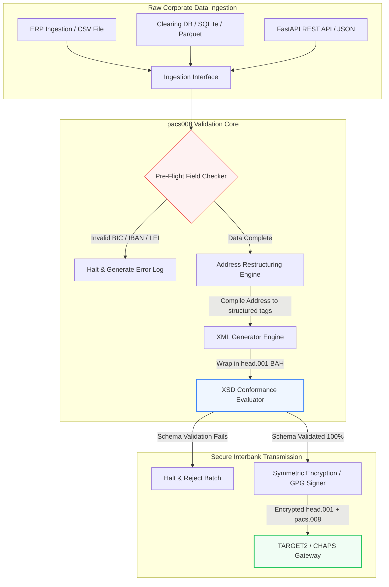

---

# Front Matter (YAML)

author: "contact@sebastienrousseau.com (Sebastien Rousseau)"
banner_alt: "Kontorsmedarbetare med röstassistent och bärbar dator — symboliserar de strukturerade, maskinläsbara interbankbetalningsmeddelanden som pacs.008-automation gör programmerbara"
banner_height: "1597"
banner_width: "2584"
banner: "https://cloudcdn.pro/stocks/images/tyler-prahm-lmV3gJSAgbo.webp"
cdn: "https://cloudcdn.pro"
charset: "UTF-8"
cname: "sebastienrousseau.com"
copyright: "© Copyright 2025 - 2026 - Sebastien Rousseau. All rights reserved."
date: "June 15, 2026"
description: "Pacs008 är ett Python-bibliotek i öppen källkod som automatiserar generering och validering av ISO 20022 pacs.008 FI-to-FI kundbetalningsöverföringar — strukturerade adresser, BAH head.001-inkapsling, BIC/LEI/IBAN-kontrollsiffror och OpenTelemetry UETR-spårning — byggt för SWIFTs övergång i november 2026."
format-detection: "telephone=no"
hreflang: "sv"
icon: "https://cloudcdn.pro/clients/sebastienrousseau/v1/logos/sebastienrousseau.svg"
id: "https://sebastienrousseau.com/2026-06-15-pacs008-automation-iso-20022-interbank-payments-2026"
image_alt: "Svartvitt porträtt av Sebastien Rousseau"
image_height: "162"
image_width: "162"
image: "https://cloudcdn.pro/stocks/images/sebastien-rousseau.png"
keywords: "pacs008, ISO 20022 pacs.008, FI-to-FI kundbetalningsöverföring, strukturerad adress, SWIFT CBPR+, BAH head.001, TARGET2, CHAPS, Fedwire, DORA, BCBS 239, Basel III, UETR, LEI-validering, SEPA VoP"
language: "sv-SE"
last_reviewed: "2026-06-15"
layout: "report"
locale: "sv_SE"
logo_alt: "Logotyp för Sebastien Rousseau"
logo_height: "44"
logo_width: "44"
logo: "https://cloudcdn.pro/clients/sebastienrousseau/v1/logos/sebastienrousseau.svg"
menu: ""
measurementID: "G-169G4ET5HQ"
name: "Sebastien Rousseau"
permalink: "https://sebastienrousseau.com/2026-06-15-pacs008-automation-iso-20022-interbank-payments-2026"
rating: "general"
referrer: "no-referrer"
robots: "index, follow"
schema: "FAQPage, Article"
seo_title: "pacs.008-automation för ISO 20022-eran"
short_name: "sebastienrousseau"
subtitle: "pacs.008-meddelandet är där interbankbetalningsdata, strukturerade adresser, regelefterlevnad, routing och avveckling möts."
tags: "pacs008, ISO 20022, interbankbetalningar, grossistbetalningar, Python"
theme-color: "0, 83, 191"
title: "Bygga pacs.008-automation för ISO 20022-interbankeran 2026"
url: "https://sebastienrousseau.com/2026-06-15-pacs008-automation-iso-20022-interbank-payments-2026"
viewport: "width=device-width, initial-scale=1, shrink-to-fit=no"

# RSS - The RSS feed front matter (YAML).
atom_link: "https://sebastienrousseau.com/2026-06-15-pacs008-automation-iso-20022-interbank-payments-2026/rss.xml"
category: "Finance"
docs: https://validator.w3.org/feed/docs/rss2.html
generator: "Static Site Generator (SSG) (version 0.0.26)"
item_description: "Pacs008 är en Python-grund i öppen källkod för att automatisera ISO 20022 FI-to-FI kundbetalningsöverföringsmeddelanden i interbankbetalningarnas era."
item_guid: "https://sebastienrousseau.com/2026-06-15-pacs008-automation-iso-20022-interbank-payments-2026/rss.xml"
item_link: "https://sebastienrousseau.com/2026-06-15-pacs008-automation-iso-20022-interbank-payments-2026/rss.xml"
item_pub_date: "Mon, 15 Jun 2026 06:06:06 +0000"
item_title: "Bygga pacs.008-automation för ISO 20022-interbankeran 2026"
last_build_date: "Mon, 15 Jun 2026 06:06:06 +0000"
managing_editor: "contact@sebastienrousseau.com (Sebastien Rousseau)"
pub_date: "Mon, 15 Jun 2026 06:06:06 +0000"
ttl: "60"
type: "article"
webmaster: "contact@sebastienrousseau.com"

# Apple - The Apple front matter (YAML).
apple_mobile_web_app_orientations: "portrait"
apple_touch_icon_sizes: "192x192"
apple-mobile-web-app-capable: "yes"
apple-mobile-web-app-status-bar-inset: "black"
apple-mobile-web-app-status-bar-style: "black-translucent"
apple-mobile-web-app-title: "pacs.008-automation för ISO 20022-eran"
apple-touch-fullscreen: "yes"

# MS Application - The MS Application front matter (YAML).

msapplication-navbutton-color: "0, 83, 191"

# Twitter Card - The Twitter Card front matter (YAML).

twitter_card: "summary_large_image"
twitter_creator: "@wwdseb"
twitter_description: "Pacs008 är en Python-grund i öppen källkod för att automatisera ISO 20022 FI-to-FI kundbetalningsöverföringsmeddelanden i interbankbetalningarnas era."
twitter_image: "https://cloudcdn.pro/clients/sebastienrousseau/v1/logos/sebastienrousseau.svg"
twitter_image_alt: "Logotyp för Sebastien Rousseau"
twitter_site: "@wwdseb"
twitter_title: "pacs.008-automation för ISO 20022-eran"
twitter_url: "https://sebastienrousseau.com/2026-06-15-pacs008-automation-iso-20022-interbank-payments-2026"

excerpt: "pacs008 är en Python-verktygslåda i öppen källkod som gör ISO 20022 FI-to-FI kundbetalningsöverföringsmeddelanden programmerbara — strukturerade adresser, validering, routing, krokar för regelefterlevnad och SWIFTs tidsfrist i november 2026 inbyggda som standard."

# Humans.txt - The Humans.txt front matter (YAML).
author_website: "https://sebastienrousseau.com"
author_twitter: "@wwdseb"
author_location: "London, UK"
thanks: "Tack för att du läser!"
site_last_updated: "2026-06-15"
site_standards: "HTML5, CSS3, RSS, Atom, JSON, XML, YAML, Markdown, TOML"
site_components: "Kaishi, Kaishi Builder, Kaishi CLI, Kaishi Templates, Kaishi Themes"
site_software: "Static Site Generator, Rust"

---

# Automatisera ISO 20022 pacs.008-interbankbetalningar med öppen källkods-Python 2026

<!-- lead-start -->
<aside class="post-lead" aria-label="Artikelsammanfattning">

<strong>Sammanfattning.</strong> Enligt SWIFT CBPR+-riktlinjerna avvecklar Strukturerad adress-tröskeln den 14 november 2026 ostrukturerade postadresser i TARGET2, CHAPS, Fedwire, Lynx och SEPA. Pacs008 är ett Python-bibliotek i öppen källkod som automatiserar generering och validering av ISO 20022 FI-to-FI kundbetalningsöverföringsmeddelanden (pacs.008), kapslar in betalningar i Business Application Headers (BAH head.001) och bygger in strukturerad adressefterlevnad i dataflödet innan meddelandet når ett clearingnätverk.

<strong>Viktiga slutsatser</strong>

<ul class="post-lead-takeaways">
  <li><strong>Tidsfristen för strukturerad adress är absolut.</strong> Efter den 14 november 2026 utfasas ostrukturerade adressblock. Pacs008 framtvingar strukturerade postadresselement (<code>&lt;TwnNm&gt;</code>, <code>&lt;Ctry&gt;</code>, <code>&lt;PstCd&gt;</code>) vid datakompilering för att förhindra avvisningar vid nätverksgränsen.</li>
  <li><strong>Enhetlig meddelandeorkestrering.</strong> Kapslar in den centrala pacs.008-betalningspayloaden i en kompatibel Business Application Header (head.001)-konvolut och tillhandahåller en standardiserad bearbetningsmodell tur och retur.</li>
  <li><strong>Algoritmisk integritet.</strong> Inbyggda validerare för BIC och Legal Entity Identifier (LEI) baserade på ISO 7064 Modulo 97-10-kontrollsiffror.</li>
  <li><strong>DORA-klassad spårbarhet.</strong> Fullständig OpenTelemetry-instrumentering kopplad till Unique End-to-End Transaction Reference (UETR) för granskningsloggar i realtid och kryptografiska revisionssignaturer.</li>
  <li><strong>Bevarad ansvarsskyldighet på styrelsenivå.</strong> Knyter ihop noggrannhet i interbankmeddelanden med DORA Artikel 5, BCBS 239-rapportering och kapitalbesparingar för operativ risk under Basel III.</li>
</ul>

<strong>Vidare läsning:</strong> <a href="https://sebastienrousseau.com/2026-05-19-global-wholesale-payments-economics-2026">Globala grossistbetalningar 2026: ISO 20022, RTGS-förnyelse och ekonomin för interoperabilitet</a>, <a href="https://sebastienrousseau.com/2026-05-27-ai-operating-system-payments-fraud-routing-resilience-compliance-2026">AI som betalningarnas operativsystem: bedrägeri, routing, resiliens och regelefterlevnad 2026</a>, <a href="https://sebastienrousseau.com/2026-05-12-iso-20022-pacs008-structured-address-deadline">Tidsfristen i november 2026 för pacs.008 strukturerad adress: en sexmånaders översikt</a>.

</aside>
<!-- lead-end -->

Brygga gapet mellan legacydata och strukturerad interbankmeddelandetrafik genom en granskningsbar, schemavaliderad Python-pipeline.

Referenspunkten i öppen källkod för denna artikel är [pacs008 ⧉](https://github.com/sebastienrousseau/pacs008 "pacs008 — Python-bibliotek i öppen källkod"). Repositoryt är positionerat som ett Python-bibliotek för att automatisera ISO 20022 pacs.008 FI-to-FI XML-meddelanden för kundbetalningsöverföringar.

## Därför är detta projekt i öppen källkod viktigt 2026

Den globala infrastrukturen för interbank clearing genomgår sin djupaste modernisering på nästan ett halvt sekel.

I juni 2026 närmar sig finansbranschen snabbt **SWIFTs Strukturerad adress-tröskel den 14 november 2026**. Från detta datum kommer SWIFT CBPR+-riktlinjerna, tillsammans med TARGET2, CHAPS, Fedwire och kanadensiska Lynx, formellt att avveckla ostrukturerade postadressrader (där enbart `<AdrLine>` används inom `<PstlAdr>`-block). Alla deltagande finansiella institutioner måste sända adresser antingen i hybridformat (strukturerade `<TwnNm>` och `<Ctry>`, med maximalt två `<AdrLine>`-element för återstående detaljer) eller i fullt strukturerat format (enskilda element för gatunamn, husnummer och postnummer). Varje meddelande som inte uppfyller detta kriterium avvisas vid nätverksgränsen.

För finansiella institutioner skapar denna övergång stora operativa begränsningar:

1. **Avvisningsstraffet vid gränsen.** Betalningar som inte uppfyller kriterierna för strukturerad adress drabbas omedelbart av nätverksavvisningar, vilket utlöser transaktionsförseningar, likviditetsblockader och operativa backlogger.
2. **SEPA Verification of Payee (VoP).** Föreskriver att alla betaltjänstleverantörer (PSP) inom SEPA-zonen verifierar matchningen mellan mottagarens namn och IBAN innan kreditöverföringar utförs, och lägger till ytterligare en valideringsgrind vid meddelandeinitiering.

[Pacs008](https://github.com/sebastienrousseau/pacs008) löser detta problem. Det är ett lättviktigt Python-bibliotek i öppen källkod som automatiserar konverteringen av rådata från finansiella system till fullständigt validerade, schemakompatibla ISO 20022 pacs.008 interbanka kundbetalningsöverföringsmeddelanden. Genom att brygga gapet mellan legacy- och strukturerad data levererar pacs008 en hög avkastning på resiliens (RoR), bevarar rörelsekapital och säkrar realtidsexekvering över globala rails.

## Arkitekturlinsen för pacs008 2026

pacs008-biblioteket är strukturerat som en isolerad validerings- och genereringsmotor som säkerställer att rådata systematiskt parsas, berikas och kapslas in i standardkonvolut:

| Lager | Designbeslut | Varför det spelar roll | Risk vid felhantering |
|---|---|---|---|
| **Inmatningslager** | Intag av CSV, JSON, SQLite och Parquet | Möter banktekniska integrationsteam där deras data redan finns och undviker plattformsmigrationer. | Intag av rå, ovaliderad eller skadad data. |
| **Valideringslager** | Pre-flight-validering mot officiella XSD-scheman och egna affärsregler | Stoppar exekvering och flaggar fel innan betalningsfilen sänds till clearingnätverket. | Ogiltiga XML-filer som utlöser omedelbara nätverksavvisningar och clearingförseningar. |
| **BAH-konvolutlager** | Automatisk inkapsling i Business Application Header (head.001) | Standardiserar meddelandedispatch och routing baserat på `<MsgDefIdr>`-taggen. | Att sända råa pacs.008-payloads utan det obligatoriska yttre konvolutet, vilket leder till systemavvisning. |
| **Serialiseringslager** | Stöd för standard-XML och ISO-kompatibel JSON (TS 23029) | Möjliggör direkt översättning mellan XML- och JSON-payloads och stödjer modern REST API och Kafka-strömning. | Fragmenterade datarepresentationer som bryter mot officiella ISO-riktlinjer. |
| **Observabilitetslager** | OpenTelemetry-spårning kopplad till UETR | Fångar detaljerade exekveringsvägar och loggar, och ger granskningsbarhet i realtid. | Spårningsglapp som blockerar operativ insyn och revision. |

## Centrala interbanksignaler och regulatoriska milstolpar

För att demonstrera operativ transaktionsresiliens måste seniora teknik- och riskansvariga följa specifika, mätbara efterlevnadsindikatorer:

| Signal | Mått / operativt riktvärde | G20 / SWIFT / DORA-referens | Implementation i teknisk plattform |
|---|---|---|---|
| **Efterlevnad av strukturerad adress** | Andel pacs.008-meddelanden som använder fullt strukturerade `<PstlAdr>`-fält med utpekade `<TwnNm>` och `<Ctry>`. | SWIFT SR 2026-tidsfrist | Pre-flight-schemakontroller i pacs008 som avvisar ostrukturerade adressrader. |
| **SEPA Verification of Payee** | Matchningsvalidering mellan mottagarens namn och IBAN före meddelandeexekvering. | SEPA VoP-regelverket | Inbyggda VoP-hjälpklasser som kör förvalidering på IBAN/BIC. |
| **BAH head.001-integration** | Andel utgående betalningspayloads som framgångsrikt kapslas in i Business Application Headers. | TARGET2 / CBPR+-riktlinjer | BAH-inkapslingssystem som automatiskt kompilerar det yttre XML-konvolutet. |
| **LEI Modulo-kontrollsiffra** | ISO 7064 Modulo 97-10-kontrollsifferkontroll på debitor- och kreditor-`<LEI>`-block. | Bank of England-mandat | Algoritmisk kontroll som verifierar integriteten hos den 20 tecken långa identifieraren. |
| **Träffsäkerhet i UETR-spårning** | 100 % av genererade betalningar injekterade med en giltig Unique End-to-End Transaction Reference. | SWIFT UETR-specifikationer | Automatiserad generering och spårning av den 36 tecken långa UUIDv4-referenskoden. |

## Därför är Python den idealiska påfartsrampen för interbankautomation

Moderna betalningshubbar och treasuryteam förlitar sig 2026 i hög grad på Python för datatransformation, finansiell modellering och integration mot ERP-databaser.

Genom att använda ett Python-bibliotek i öppen källkod uppnår institutioner betydande fördelar:

1. **Låg kognitiv belastning och hög interoperabilitet.** Python fungerar som en sammanhängande brygga. Det låter utvecklare skriva enkla skript som hämtar råa betalningsinstruktioner från legacydatabaser, validerar dem mot komplexa internationella bankregler och producerar kompatibel XML inom ett enhetligt arbetsflöde.
2. **Avveckling av opaka "black-box"-översättare.** Proprietära bankportaler tar ofta höga licensavgifter för specialbyggda översättare av betalningsfiler. Dessa översättare är proprietära svarta lådor, vilket gör det omöjligt för säkerhetsteam att granska hur data behandlas eller var nycklar lagras. Ett granskningsbart bibliotek i öppen källkod som pacs008 ger fullständig kodtransparens.
3. **Smidig CI/CD-integration.** Pacs008 integreras direkt i pipelines för kontinuerlig integration och leverans, vilket gör att utvecklare kan automatisera testning av betalningsfiler som en del av sin ordinarie mjukvaruleveranscykel.

## Designa en avgränsad interbankpipeline

En central sårbarhet i interbank clearing är "okontrollerad batchgenerering" — generering av filer utan en tydlig, avgränsad verifieringsloop. Pacs008 är designat för att fungera som den centrala valideringsmotorn inuti en strikt kontrollerad transaktionspipeline i flera steg.

Det operativa flödet nedan visar hur rå transaktionsdata passerar genom pacs008-pipelinen för att generera en kryptografiskt säker, schemakompatibel pacs.008-fil inkapslad i ett BAH-konvolut:

## Styrelsehandboken och förtroendeansvar

Automation av interbankbetalningar är en fråga om riskhantering och bolagsstyrning på styrelsenivå. Seniora chefer måste hantera kvaliteten på transaktionsdata genom linsen av förtroendeansvar och reduktion av operativ risk:

- **DORA Artikel 5 (styrelseansvar).** Lägger direkt, personligt ansvar på styrelseledamöter för resiliens och säkerhet i institutionens IKT-verksamhet. Eftersom interbank clearing är en kritisk företagsfunktion måste styrelser visa att de har infört robusta, validerade och automatiserade transaktionskontroller för att förhindra operativa avbrott eller försenade betalningar.
- **BCBS 239 (riskdataaggregering och rapportering).** Kräver att finansiell transaktionsrapportering är korrekt, fullständig och genererad i realtid. Pacs008 hjälper institutioner att uppfylla BCBS 239 genom att säkerställa att betalningsdata är rent strukturerad och validerad vid källan, vilket eliminerar de dataluckor och manuella avstämningsfel som plågar äldre kalkylblad.
- **Mildring av kapitalkrav för operativ risk (Basel III).** Under Basel III-riktlinjerna ökar höga felfrekvenser i betalningar och manuell hantering bankens kapitalkrav för operativ risk, vilket binder kapital som annars kunde användas för utlåning eller investering. Att automatisera betalningspipelinen sänker direkt dessa kapitalpåslag och bevarar balansräkningens värde.

## Vad detta innebär per banktyp

### Globalt systemviktiga banker (G-SIB)

G-SIB hanterar massiva volymer av gränsöverskridande företagstransaktioner. Deras främsta utmaning är åtgärd av ostrukturerade legacydata innan de når clearingnätverket. Genom att integrera pacs008 i sina företagsbankgateways kan G-SIB tillhandahålla automatiserade valideringsverktyg till sina företagskunder, vilket minskar overhead för manuella betalningsreparationer och säkerställer realtidsexekvering i SWIFT-nätverket.

### Transaktions- och företagsbanker

För transaktionsbanker är kvalitet i betalningsdata en konkurrensfördel. Genom att erbjuda ett granskningsbart valideringsverktyg i öppen källkod som pacs008 till företagstreasury-kunder kan dessa banker accelerera onboarding, minimera avvisningar av betalningsfiler och bygga kundförtroende via överlägsen straight-through processing.

### Regional- och mindre banker

Regionalbanker måste upprätthålla efterlevnad av internationella betalningsstandarder utan G-SIB:ernas massiva teknikbudgetar. Pacs008 erbjuder en lättviktig, kostnadseffektiv och fullt kompatibel Python-baserad lösning som gör det möjligt för mindre institutioner att erbjuda moderna, strukturerade kapaciteter för betalningsinitiering utan dyra licenser för proprietär middleware.

## Slutsats: färdplanen för interbank clearing

SWIFTs kommande tidsfrist för strukturerad adress i november 2026 utgör en hård gräns för företagstreasuryverksamheten. Att förlita sig på äldre kalkylblad, manuell datainmatning och ostrukturerade betalningsfiler är en aktiv affärsrisk.

För att säkra transaktionskontinuitet och minimera operativ overhead bör seniora teknik- och finansansvariga genomföra en tydlig clearingfärdplan redan idag:

1. **Framtvinga validering vid källan.** Föreskriv att alla betalningsinstruktioner valideras och formateras enligt officiella ISO 20022 XSD-scheman innan de lämnar företagets ERP-gränser.
2. **Granska datapipelinen.** Lämna manuell kalkylbladshantering och inför automatiserade, granskningsbara Python-baserade arbetsflöden med pacs008.
3. **Inför hybridsäkerhet.** Säkerställ att genererade betalningsfiler signeras kryptografiskt och krypteras före sändning, så att zero-trust-förväntningar i nätet uppfylls.
4. **Anpassa efter förtroendeprioriteringar.** Rapportera formellt mått på betalningsautomation och datakvalitet till styrelsen, och rama in investeringen som ett kritiskt program för reduktion av operativ risk under DORA.

## Vanliga frågor

**Är pacs008 kompatibelt med de kommande SWIFT SR 2026-reglerna för adresser?**

Ja. Pacs008 är designat för att stödja SWIFTs strikta milstolpe för strukturerad adress i november 2026 och framtvingar den obligatoriska separationen av postadresselement (stad, land, postnummer) i särskilda ISO 20022 XML-fält.

**Kan pacs008 kapsla in betalningspayloads i Business Application Headers?**

Ja. Eftersom pacs008 natively stödjer inkapsling i Business Application Header (BAH head.001) kompilerar det automatiskt det yttre konvolut som krävs av TARGET2-, CHAPS- och CBPR+-nätverken.

**Varför är ett bibliotek i öppen källkod att föredra framför proprietära filöversättare?**

Proprietära översättare är opaka svarta lådor, vilket gör säkerhetsgranskningar omöjliga. Ett peer-granskat bibliotek i öppen källkod som pacs008 ger fullständig kodtransparens och låter säkerhetsteam verifiera att ingen känslig betalningsdata exponeras under bearbetning.

**Vilka identifierare validerar pacs008?**

Pacs008 levereras med inbyggda validerare för Bank Identifier Codes (BIC) och Legal Entity Identifiers (LEI) baserade på ISO 7064 Modulo 97-10-kontrollsiffror, plus IBAN-kontrollsiffervalidering och kontroller av UETR-unikhet.

## Referenser

- SWIFT, (2024). *ISO 20022 Strukturerad adress-milstolpe november 2026*. La Hulpe: SWIFT. Tillgänglig på: [SWIFT ISO 20022-milstolpe ⧉](https://www.swift.com/standards/iso-20022/iso-20022-bytes/call-action-november-2026 "SWIFT ISO 20022-milstolpe").
- Basel Committee on Banking Supervision (BCBS), (2013). *Principles for effective risk data aggregation and risk reporting (BCBS 239)*. Basel: Bank for International Settlements. Tillgänglig på: [BCBS 239-principer ⧉](https://www.bis.org/publ/bcbs239.htm "BCBS 239-principer").
- Europaparlamentet och Europeiska unionens råd, (2022). *Förordning (EU) 2022/2554 om digital operativ resiliens för den finansiella sektorn (DORA)*. Bryssel: Europeiska unionens officiella tidning. Tillgänglig på: [DORA-förordningen ⧉](https://eur-lex.europa.eu/legal-content/EN/TXT/?uri=CELEX%3A32022R2554 "DORA-förordningen").
- GitHub, (2026). *pacs008 repository i öppen källkod*. Tillgänglig på: [pacs008-repository ⧉](https://github.com/sebastienrousseau/pacs008 "pacs008-repository").

<!-- enrich-start -->
<aside class="author-card" aria-label="Om författaren"><strong class="author-card-name"><a href="/about/index.html">Sebastien Rousseau</a></strong>Senior bankteknolog som skriver om tillämpad AI, ISO 20022-migration, postkvantkryptografi för finansiella tjänster och den strukturella omvandlingen av grossistbetalningar.20+ år inom HSBC Commercial &amp; Investment Bank, PayPal, Barclays, Shazam, AKQA, Virgin Group. <a href="/about/index.html">Fullständig profil</a> &middot; <a href="https://www.linkedin.com/in/sebastienrousseau/" rel="external noopener">LinkedIn</a> &middot; <a href="https://github.com/sebastienrousseau" rel="external noopener">GitHub</a></aside>

Senast granskad <time datetime="2026-06-15">2026-06-15</time>.

<aside class="related-posts" aria-labelledby="related-heading">
<h2 id="related-heading" class="related-heading">Vidare läsning</h2>

<article class="related-card"><footer class="related-body"><h3><a href="https://sebastienrousseau.com/2026-05-19-global-wholesale-payments-economics-2026">Globala grossistbetalningar 2026: ISO 20022, RTGS-förnyelse och ekonomin för interoperabilitet</a></h3>
<time datetime="2026-05-19">2026-05-19</time>
</footer></article>
<article class="related-card"><footer class="related-body"><h3><a href="https://sebastienrousseau.com/2026-05-27-ai-operating-system-payments-fraud-routing-resilience-compliance-2026">AI som betalningarnas operativsystem: bedrägeri, routing, resiliens och regelefterlevnad 2026</a></h3>
<time datetime="2026-05-27">2026-05-27</time>
</footer></article>
<article class="related-card"><footer class="related-body"><h3><a href="https://sebastienrousseau.com/2026-05-12-iso-20022-pacs008-structured-address-deadline">Tidsfristen i november 2026 för pacs.008 strukturerad adress: en sexmånaders översikt</a></h3>
<time datetime="2026-05-12">2026-05-12</time>
</footer></article>

</aside>
<!-- enrich-end -->
