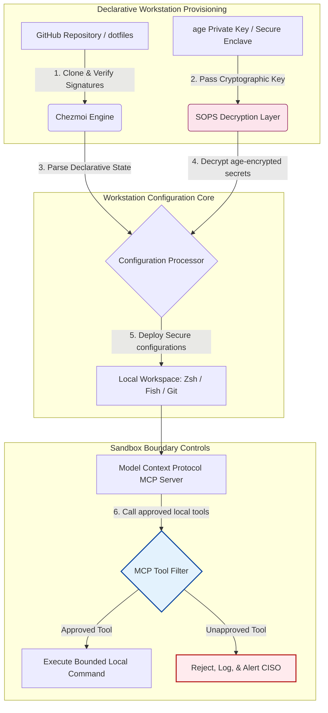

---

# Front Matter (YAML)

author: "contact@sebastienrousseau.com (Sebastien Rousseau)"
banner_alt: "Utvecklararbetsstation i svag belysning — symboliserar AI-medvetna, reproducerbara och säkra dotfiles för MCP-servrar, SLSA-signering, age/SOPS-hemligheter och paritet mellan flera shell"
banner_height: "1597"
banner_width: "2584"
banner: "https://cloudcdn.pro/stocks/images/almas-salakhov-Vq2ap8aFFEs.webp"
cdn: "https://cloudcdn.pro"
charset: "UTF-8"
cname: "sebastienrousseau.com"
copyright: "© Copyright 2025 - 2026 - Sebastien Rousseau. All rights reserved."
date: "June 16, 2026"
description: "AI-medvetna dotfiles är ett säkert, reproducerbart arbetsstationsmönster för MCP-eran — deklarativ konfiguration via Chezmoi, SOPS/age-hemligheter, SLSA Level 3-proveniens, multi-shell-paritet och avgränsade sandlådegränser för lokala AI-agenter."
format-detection: "telephone=no"
hreflang: "sv"
icon: "https://cloudcdn.pro/clients/sebastienrousseau/v1/logos/sebastienrousseau.svg"
id: "https://sebastienrousseau.com/2026-06-16-ai-aware-dotfiles-secure-reproducible-workstation-2026"
image_alt: "Svartvitt porträtt av Sebastien Rousseau"
image_height: "162"
image_width: "162"
image: "https://cloudcdn.pro/stocks/images/sebastien-rousseau.png"
keywords: "dotfiles, Chezmoi, MCP, Model Context Protocol, SLSA, SOPS, age-kryptering, deklarativ konfiguration, utvecklararbetsstation, DORA Artikel 5, NIST CSF 2.0, säker leveranskedja, agentisk AI, multi-shell-paritet, Zsh, Fish, Nushell"
language: "sv-SE"
last_reviewed: "2026-06-16"
layout: "report"
locale: "sv_SE"
logo_alt: "Logotyp för Sebastien Rousseau"
logo_height: "44"
logo_width: "44"
logo: "https://cloudcdn.pro/clients/sebastienrousseau/v1/logos/sebastienrousseau.svg"
menu: ""
measurementID: "G-169G4ET5HQ"
name: "Sebastien Rousseau"
permalink: "https://sebastienrousseau.com/2026-06-16-ai-aware-dotfiles-secure-reproducible-workstation-2026"
rating: "general"
referrer: "no-referrer"
robots: "index, follow"
schema: "FAQPage, Article"
seo_title: "AI-medvetna dotfiles för en säker utvecklararbetsstation"
short_name: "sebastienrousseau"
subtitle: "Utvecklararbetsstationen är nu en del av AI-leveranskedjan; dotfiles kräver säkerhet, reproducerbarhet, hemlighetshygien och MCP-medvetna arbetsflöden."
tags: "dotfiles, utvecklarverktyg, MCP, SLSA, säker arbetsstation, chezmoi, macOS, Linux, WSL"
theme-color: "0, 83, 191"
title: "AI-medvetna dotfiles 2026: en säker, reproducerbar utvecklararbetsstation för MCP, SLSA och multi-shell-paritet"
url: "https://sebastienrousseau.com/2026-06-16-ai-aware-dotfiles-secure-reproducible-workstation-2026"
viewport: "width=device-width, initial-scale=1, shrink-to-fit=no"

# RSS - The RSS feed front matter (YAML).
atom_link: "https://sebastienrousseau.com/2026-06-16-ai-aware-dotfiles-secure-reproducible-workstation-2026/rss.xml"
category: "Technology"
docs: https://validator.w3.org/feed/docs/rss2.html
generator: "Static Site Generator (SSG) (version 0.0.26)"
item_description: "En genomgång av deklarativa dotfiles för säkra, reproducerbara utvecklararbetsstationer på macOS, Linux och WSL, med MCP-medvetenhet, SLSA, age, SOPS och multi-shell-paritet."
item_guid: "https://sebastienrousseau.com/2026-06-16-ai-aware-dotfiles-secure-reproducible-workstation-2026/rss.xml"
item_link: "https://sebastienrousseau.com/2026-06-16-ai-aware-dotfiles-secure-reproducible-workstation-2026/rss.xml"
item_pub_date: "Tue, 16 Jun 2026 06:06:06 +0000"
item_title: "AI-medvetna dotfiles 2026: en säker, reproducerbar utvecklararbetsstation för MCP, SLSA och multi-shell-paritet"
last_build_date: "Tue, 16 Jun 2026 06:06:06 +0000"
managing_editor: "contact@sebastienrousseau.com (Sebastien Rousseau)"
pub_date: "Tue, 16 Jun 2026 06:06:06 +0000"
ttl: "60"
type: "article"
webmaster: "contact@sebastienrousseau.com"

# Apple - The Apple front matter (YAML).
apple_mobile_web_app_orientations: "portrait"
apple_touch_icon_sizes: "192x192"
apple-mobile-web-app-capable: "yes"
apple-mobile-web-app-status-bar-inset: "black"
apple-mobile-web-app-status-bar-style: "black-translucent"
apple-mobile-web-app-title: "AI-medvetna dotfiles för en säker utvecklararbetsstation"
apple-touch-fullscreen: "yes"

# MS Application - The MS Application front matter (YAML).

msapplication-navbutton-color: "0, 83, 191"

# Twitter Card - The Twitter Card front matter (YAML).

twitter_card: "summary_large_image"
twitter_creator: "@wwdseb"
twitter_description: "En genomgång av deklarativa dotfiles för säkra, reproducerbara utvecklararbetsstationer på macOS, Linux och WSL, med MCP-medvetenhet, SLSA, age, SOPS och multi-shell-paritet."
twitter_image: "https://cloudcdn.pro/clients/sebastienrousseau/v1/logos/sebastienrousseau.svg"
twitter_image_alt: "Logotyp för Sebastien Rousseau"
twitter_site: "@wwdseb"
twitter_title: "AI-medvetna dotfiles för en säker utvecklararbetsstation"
twitter_url: "https://sebastienrousseau.com/2026-06-16-ai-aware-dotfiles-secure-reproducible-workstation-2026"

excerpt: "AI-medvetna dotfiles 2026 behandlar utvecklararbetsstationen som leveranskedjeinfrastruktur — deklarativ chezmoi-hanterad konfiguration med MCP-medvetenhet, SLSA-signerade utgåvor, age/SOPS-hemligheter, sekundsnabb uppstart och paritet mellan macOS, Linux och WSL."

# Humans.txt - The Humans.txt front matter (YAML).
author_website: "https://sebastienrousseau.com"
author_twitter: "@wwdseb"
author_location: "London, UK"
thanks: "Tack för att du läste!"
site_last_updated: "2026-06-16"
site_standards: "HTML5, CSS3, RSS, Atom, JSON, XML, YAML, Markdown, TOML"
site_components: "Kaishi, Kaishi Builder, Kaishi CLI, Kaishi Templates, Kaishi Themes"
site_software: "Static Site Generator, Rust"

---

# AI-medvetna dotfiles 2026: en säker, reproducerbar utvecklararbetsstation för MCP, SLSA och multi-shell-paritet

<!-- lead-start -->
<aside class="post-lead" aria-label="Artikelsammanfattning">

<strong>Sammanfattning.</strong> Utvecklararbetsstationen är inte längre bara en slutpunkt; den är en aktiv deltagare i programvarans leveranskedja och ett direkt gränssnitt mot det lokala AI-kontrollplanet. Terminalbaserade AI-assistenter och <a href="https://modelcontextprotocol.io">Model Context Protocol (MCP)</a>-servrar kör lokala shell-kommandon, inspekterar repon och läser känsliga konfigurationsfiler direkt. <a href="https://github.com/sebastienrousseau/dotfiles">Sebastien Rousseaus Dotfiles</a> är ett deklarativt ramverk med öppen källkod som bygger säkra, reproducerbara arbetsstationer på macOS, Linux och Windows Subsystem for Linux (WSL) — och integrerar <a href="https://www.chezmoi.io/">Chezmoi</a>, <a href="https://github.com/getsops/sops">SOPS, age</a> och SLSA Level 3-byggproveniens för minnessäker isolering av hemligheter och avgränsade exekveringsvägar för lokala AI-modeller.

<strong>Viktiga slutsatser</strong>

<ul class="post-lead-takeaways">
  <li><strong>Arbetsstationer är leveranskedjeinfrastruktur.</strong> Konfigurationer av utvecklarmiljöer måste behandlas med samma deklarativa stringens som driftsättning av produktionsservrar, för att eliminera manuell konfigurationsdrift.</li>
  <li><strong>Utmaningen med AI-kontrollplanet.</strong> Terminalbaserade AI-modeller och MCP-verktyg kan komma åt lokala kataloger. Dotfiles måste tvinga fram avgränsade sandlådegränser, strikta listor över verktygsbehörigheter och oföränderliga lokala loggar för att förhindra dataläckage.</li>
  <li><strong>Absolut paritet mellan plattformar.</strong> Identisk, sekundsnabb shell-prestanda och identiska säkerhetsprofiler på macOS, Linux (Zsh, Fish, Nushell) och WSL, vilket kapar onboarding-tiden för utvecklare från veckor till minuter.</li>
  <li><strong>Kryptografiskt säker isolering av hemligheter.</strong> SOPS- och age-filkryptering hindrar hårdkodade inloggningsuppgifter (GitHub-tokens, molnåtkomstnycklar) från att checkas in i Git eller läsas av lokala LLM:er.</li>
  <li><strong>Fiduciärt värde på styrelsenivå.</strong> Översätter efterlevnad av arbetsstationskonfiguration till tydliga styrelseprioriteter, och stöder DORA Artikel 5, NIST CSF 2.0-slutpunktsstandarder och reduktion av operativ risk under Basel III.</li>
</ul>

<strong>Vidare läsning:</strong> <a href="https://sebastienrousseau.com/2026-05-23-agentic-payments-banking-consent-liability-new-payment-ux-2026">Agentiska betalningar i bank: samtycke, ansvar och den nya betal-UX:en 2026</a>, <a href="https://sebastienrousseau.com/2024-03-12-revolutionising-real-time-speech-recognition-on-macos-with-openai-whisper/index.html">Snabb taligenkänning i realtid på macOS: OpenAI Whisper</a>, <a href="https://sebastienrousseau.com/2024-02-26-google-gemma-ai-transforming-open-source-ai-development/index.html">Google Gemma AI: utvecklingen av AI med öppen källkod</a>.

</aside>
<!-- lead-end -->

Broar klyftan mellan deklarativ arbetsstationskonfiguration och säkra leveranskedjor för programvara i en tid av lokala AI-modeller och agentiska utvecklarverktyg.

Den öppna referenspunkten för denna artikel är [dotfiles ⧉](https://github.com/sebastienrousseau/dotfiles "dotfiles — deklarativ arbetsstationskonfiguration"). Repot positioneras som: deklarativa dotfiles för macOS, Linux och WSL, med multi-shell-paritet, sekundsnabb uppstart, SLSA-signerade utgåvor och AI/MCP-medveten konfiguration.

## Varför detta projekt med öppen källkod är viktigt 2026

I juni 2026 är utvecklararbetsstationen den svagaste länken i programvarans leveranskedja och ett högvärdesmål för avancerade statsfinansierade och kriminella cybersyndikat.

Säkerhetsbilden för utvecklingsmiljön har skiftat radikalt med uppkomsten av terminalbaserade AI-kodningsassistenter (som Claude Code) och införandet av Model Context Protocol (MCP). Lokala utvecklarterminaler är nu värd för aktiva, autonoma AI-agenter som kan:

- Läsa och redigera lokala källfiler.
- Anropa lokala CLI-verktyg (`git`, `npm`, `aws`, `kubectl`).
- Inspektera miljövariabler i shell, lokala databaser och konfigurationsinställningar.

Saknar utvecklarens lokala miljö strikta gränser kan dessa autonoma AI-verktyg oavsiktligt läsa känsliga personuppgifter, läcka molninloggningsuppgifter till publika LLM-API:er, eller exekvera skadliga paket under automatiserade byggen.

Under Digital Operational Resilience Act (DORA) och NIST Cybersecurity Framework (CSF) 2.0 är finansinstitut juridiskt skyldiga att verifiera proveniens och säkerhetsintegritet för varje enhet som ges åtkomst till programvarans leveranskedja. "Snöflingelaptops" — manuellt konfigurerade, oreviderade, drivande konfigurationer — uppfyller inte längre globala banknormer.

[Sebastien Rousseaus Dotfiles](https://github.com/sebastienrousseau/dotfiles) löser detta problem. Det är ett öppet, deklarativt ramverk för arbetsstationshantering som etablerar säkra, reproducerbara utvecklararbetsstationer. Genom att tvinga fram en standardiserad, granskningsbar konfigurationsbaslinje levererar projektet hög Return on Resilience (RoR), kapar onboarding-tiden för utvecklare från veckor till timmar och skyddar känsliga finansiella leveranskedjor från slutpunktssårbarheter.

## Arkitekturperspektivet för den AI-medvetna arbetsstationen 2026

Dotfiles-ramverket fungerar som en säker, deklarativ miljöhanterare — där alla lokala shells, verktyg och hemligheter hanteras, granskas och isoleras systematiskt:

| Lager | Designbeslut | Varför det spelar roll | Risk vid felhantering |
|---|---|---|---|
| **Provisioneringslager** | Deklarativ konfigurationshantering via Chezmoi | Bygger fullt reproducerbara arbetsstationer på macOS, Linux och WSL och eliminerar drift. | Snöflingekonfigurationer med oreviderade, sårbara lokala tillstånd. |
| **Shell-lager** | Multi-shell-paritet (Zsh, Fish, Nushell) | Säkerställer identisk, sekundsnabb uppstart och konsekvent aliasbeteende mellan olika miljöer. | Inkonsekvenser i shell-kommandon som orsakar oväntade skriptresultat. |
| **Hemlighetslager** | Filkryptering med SOPS och age | Förhindrar att hårdkodade inloggningsuppgifter och råa nycklar checkas in i Git eller exponeras för lokala LLM:er. | Inloggningsuppgifter läcker till publika repo-historiker eller komprometteras av lokala agenter. |
| **AI/MCP-lager** | Gränskontroller via Model Context Protocol | Begränsar lokala AI-agenter till en specifik lista godkända verktyg och loggar alla lokala exekveringar. | Obegränsade AI-agenter som exekverar löpande eller destruktiva kommandon lokalt. |
| **Leveranskedjelager** | SLSA-signerade utgåvor och Sigstore-verifiering | Bevisar kryptografiskt äktheten hos bootstrap-skript och konfigurationsfiler. | Komprometterade installationsskript som injicerar bakdörrar i utvecklarmiljöer. |

## Centrala säkerhets- och automationssignaler för arbetsstationer

För att upprätthålla absolut säkerhet i utvecklarbeståndet måste Chief Information Security Officers (CISO:er) och teknikchefer följa specifika, kvantifierbara operativa indikatorer:

| Signal | Mått / operativ benchmark | NIST CSF / DORA-referens | Teknisk plattformsimplementation |
|---|---|---|---|
| **Reproducerbarhet hos arbetsstationer** | % av utvecklarlaptops som hanteras fullt deklarativt via dotfile-repon utan konfigurationsdrift. | NIST CSF 2.0 (PR.DS-01) | Chezmoi-driftdetektering som körs automatiskt vid terminalstart. |
| **Hygien för inloggningsuppgifter** | Noll okrypterade hemligheter eller nycklar lagrade i klartext i lokala konfigurationsfiler. | DORA Artikel 6 (IKT-säkerhet) | Pre-commit-hookar i Git och lokala skanningar som avvisar okrypterade filer. |
| **Byggproveniens** | 100% av bootstrap-verktygen för arbetsstationer verifieras med kryptografiskt signerade manifest. | DORA Artikel 30 (leveranskedja) | Sigstore- och SLSA Level 3-verifiering inbäddad i installationspipelines. |
| **Onboarding-tid för utvecklare** | Tid från råvaruleverans av hårdvara till fullt konfigurerad, regelefterlevande utvecklingsmiljö. | Return on Resilience (RoR) | Automatiserade, deklarativa installationsskript som bygger miljön på under 15 minuter. |
| **Avgränsad åtkomst för AI-agenter** | Verifiering att lokala AI-verktyg arbetar inom definierade kataloggränser med skrivskydd som standard. | Model Risk Management | MCP-konfigurationsprofiler som begränsar agentens verktygskatalog till godkända operationer. |

## Varför deklarativ konfiguration är kärnan i arbetsstationssäkerhet

Traditionella sätt att sätta upp utvecklararbetsstationer är mycket manuella och resulterar i "snöflingelaptops" — miljöer där konfigurationer driver över tid när utvecklare installerar egna verktyg, justerar variabler och modifierar lokala skript. Denna drift skapar flera kritiska sårbarheter:

1. **Ospårade skuggkonfigurationer.** Drivande laptops kör ofta föråldrade, sårbara programpaket eller lokala skript som kringgår företagets säkerhetsverktyg.
2. **Hemlighetsläckage.** Utvecklare hårdkodar ofta API-nycklar, GitHub-tokens eller AWS-inloggningsuppgifter direkt i klartextskript eller shell-profiler, vilket gör dem mycket sårbara för stöld.
3. **Ineffektiv onboarding.** Att sätta upp en ny utvecklararbetsstation manuellt kan ta upp till två veckor av ingenjörstid och påverkar teamhastigheten.

Genom att övergå till en deklarativ, modelldriven konfiguration med Chezmoi blir hela utvecklarmiljön ett versionskontrollerat, reproducerbart system of record. Varje ändring, alias, paketberoende och säkerhetsdefault dokumenteras i Git, valideras mot organisationens regelefterlevnadspolicyer och verifieras kryptografiskt innan den appliceras på den fysiska laptopen.

## Att designa en avgränsad utvecklarmiljö för AI

För att förhindra att lokala AI-agenter och MCP-verktyg får obegränsad åtkomst till lokala tillgångar måste arbetsstationen fungera som ett avgränsat exekveringsplan.

Det operativa flödet nedan visar hur dotfiles-ramverket koordinerar Chezmoi, SOPS och age för att dekryptera och driftsätta säkra dotfiles samtidigt som det upprätthåller en isolerad, sandlådebaserad exekveringsgräns för lokala AI-agenter som anropar MCP-verktyg:

## Styrelseboken och fiduciärt ansvar

Säkerhet för utvecklararbetsstationer och integritet i leveranskedjan är kritiska prioriteter för styrelserummet. Seniora chefer måste adressera utvecklarmiljörisk genom linsen av fiduciärt ansvar, regulatorisk efterlevnad och bevarande av affärsvärde:

- **DORA Artikel 5 (styrelseansvar).** Föreskriver att ledningsorganet (styrelsen) bär det yttersta ansvaret för institutionens IKT-riskhantering. Eftersom utvecklararbetsstationer är porten in i programvarans leveranskedja måste styrelseledamöter verifiera att slutpunkter är säkra, fullt granskningsbara och hanterade inom strikta, reproducerbara konfigurationsramverk för att uppfylla tillsynsmyndigheternas revisioner.
- **NIST CSF 2.0-efterlevnad (slutpunktssäkerhet).** Kräver att endast auktoriserade och validerade enheter, som kör standardiserade och säkra konfigurationer, ges åtkomst till företagsnätverk och repon. Deklarativa dotfiles låter säkerhetsteam matematiskt bevisa att alla utvecklarmiljöer följer organisationens säkerhetsbaslinje, och eliminerar risken med oreviderade "snöflinge"-uppsättningar.
- **Bevarande av balansräkningens värde.** Ett enda komprometterat utvecklarinlogg eller leveranskedjeintrång kan kosta en institution miljontals dollar i åtgärder, tillsynsböter och anseendeskada. Övergången till en säker, deklarativ utvecklarmiljö minimerar denna risk direkt, bevarar värdet i balansräkningen och skyddar kundernas förtroende.

## Vad detta innebär per banktyp

### Globalt systemviktiga banker (G-SIB)

G-SIB:er hanterar tusentals utvecklararbetsstationer över flera kontinenter och regulatoriska jurisdiktioner. Deras främsta utmaning är att upprätthålla konfigurationskonsekvens och förhindra läckage av inloggningsuppgifter i massiva ingenjörsteam. Genom att anamma en deklarativ dotfiles-modell med öppen källkod och Chezmoi kan G-SIB:er standardisera slutpunktssäkerhet, automatisera efterlevnadsrevision och kapa onboarding-tider för utvecklare från veckor till minuter i hela den globala organisationen.

### Transaktions- och företagsbanker

Transaktionsbanker driver känsliga betalningsgateways och clearinginfrastruktur för wholesale-marknaden. Att bevisa absolut integritet hos koden som driftsätts i dessa produktionsmiljöer är ett icke-förhandlingsbart regulatoriskt krav. Att standardisera utvecklararbetsstationer under ett säkert, SLSA-kompatibelt dotfiles-ramverk garanterar att programvarans leveranskedja är fullt granskad och skyddad från lokala slutpunktssårbarheter hos utvecklare.

### Regional- och mindre banker

Regionala banker måste upprätthålla höga cybersäkerhetsstandarder utan G-SIB:ernas massiva säkerhetsbudgetar. Detta dotfiles-ramverk med öppen källkod erbjuder en lätt, kostnadseffektiv och mycket säker lösning som passar för Python och Rust, och låter mindre institutioner implementera slutpunktssäkerhet och leveranskedjeskydd i företagsklass utan dyra proprietära programlicenser.

## Slutsats: färdplanen för utvecklararbetsstationen

Utvecklararbetsstationen är inte längre en kringutrustning; den är ett kritiskt kontrollplan i programvarans leveranskedja. Att tillåta manuellt konfigurerade, oreviderade "snöflingelaptops" åtkomst till företagstillgångar är en allvarlig operativ och regulatorisk risk.

För att säkra programvarans leveranskedja och skydda slutpunkter mot lokala AI-agentsårbarheter bör seniora teknik- och säkerhetschefer exekvera en tydlig utvecklingsfärdplan redan idag:

1. **Föreskriv deklarativ provisionering.** Fasa ut manuella, dokumentstyrda installationsprocesser och föreskriv att alla utvecklarmiljöer provisioneras deklarativt med Chezmoi.
2. **Tvinga fram hemlighetshygien.** Tvinga fram strikta pre-commit-hookar och skanningsverktyg som säkerställer att inga råa inloggningsuppgifter, nycklar eller API-tokens lagras i klartext i lokala arbetsstationskonfigurationer.
3. **Etablera AI-sandlådegränser.** Implementera säkra, avgränsade MCP-konfigurationsprofiler som begränsar lokala AI-kodningsassistenter och agenter till godkända, skrivskyddade verktyg och kataloger.
4. **Säkra leveranskedjan.** Säkerställ att alla bootstrap-skript och miljökonfigurationer verifieras kryptografiskt med SLSA Level 3-proveniens innan driftsättning.

## Vanliga frågor

**Vad är Chezmoi och varför används det för dotfiles?**

Chezmoi är en öppen källkods-, säker, deklarativ dotfile-hanterare. Den låter utvecklare hantera sina lokala konfigurationer som ett versionskontrollerat repository och säkerställer absolut konsekvens och reproducerbarhet mellan olika operativsystem (macOS, Linux, WSL).

**Hur skyddar ramverket hemligheter?**

Ramverket använder SOPS (Secrets Operations) och age-filkryptering för att kryptera känsliga inloggningsuppgifter (såsom GitHub-tokens eller molnåtkomstnycklar) direkt i dotfile-repot. Det förhindrar att nycklar checkas in i klartext eller läses av obehöriga lokala AI-agenter.

**Vad är Model Context Protocol (MCP) och hur påverkar det säkerheten?**

MCP är en öppen standard som låter AI-modeller säkert exekvera lokala verktyg och komma åt filer. Dotfiles-ramverket implementerar strikta MCP-konfigurationsfiler som begränsar lokala AI-verktyg och agenter till godkända kataloger och kommandon.

**Vilka shells stöder ramverket?**

Bash, Zsh, Fish, Nushell och PowerShell — med paritet mellan macOS, Linux och WSL så att kommandobeteendet förblir identiskt oavsett vilken terminal utvecklaren öppnar.

## Referenser

- Open Source Security Foundation (OpenSSF), (2024). *Supply-chain Levels for Software Artifacts (SLSA)*. Tillgängligt på: [SLSA Framework ⧉](https://slsa.dev/ "SLSA framework").
- NIST, (2024). *NIST Cybersecurity Framework 2.0*. Gaithersburg: National Institute of Standards and Technology. Tillgängligt på: [NIST CSF 2.0 ⧉](https://www.nist.gov/cyberframework "NIST Cybersecurity Framework 2.0").
- Europaparlamentet och Europeiska unionens råd, (2022). *Förordning (EU) 2022/2554 om digital operativ motståndskraft för finanssektorn (DORA)*. Bryssel: Europeiska unionens officiella tidning. Tillgängligt på: [DORA Regulation ⧉](https://eur-lex.europa.eu/legal-content/EN/TXT/?uri=CELEX%3A32022R2554 "DORA regulation").
- GitHub, (2026). *dotfiles open-source repository*. Tillgängligt på: [dotfiles Repository ⧉](https://github.com/sebastienrousseau/dotfiles "dotfiles repository").

<!-- enrich-start -->
<aside class="author-card" aria-label="Om författaren"><strong class="author-card-name"><a href="/about/index.html">Sebastien Rousseau</a></strong>Senior banktekniker som skriver om tillämpad AI, ISO 20022-migration, postkvantkryptografi för finansiella tjänster och den strukturella omvandlingen av wholesale-betalningar.20+ år hos HSBC Commercial &amp; Investment Bank, PayPal, Barclays, Shazam, AKQA, Virgin Group. <a href="/about/index.html">Fullständig profil</a> &middot; <a href="https://www.linkedin.com/in/sebastienrousseau/" rel="external noopener">LinkedIn</a> &middot; <a href="https://github.com/sebastienrousseau" rel="external noopener">GitHub</a></aside>

Senast granskad <time datetime="2026-06-16">2026-06-16</time>.

<aside class="related-posts" aria-labelledby="related-heading">
<h2 id="related-heading" class="related-heading">Vidare läsning</h2>

<article class="related-card"><footer class="related-body"><h3><a href="https://sebastienrousseau.com/2026-05-23-agentic-payments-banking-consent-liability-new-payment-ux-2026">Agentiska betalningar i bank: samtycke, ansvar och den nya betal-UX:en 2026</a></h3>
<time datetime="2026-05-23">2026-05-23</time>
</footer></article>
<article class="related-card"><footer class="related-body"><h3><a href="https://sebastienrousseau.com/2024-03-12-revolutionising-real-time-speech-recognition-on-macos-with-openai-whisper/index.html">Snabb taligenkänning i realtid på macOS: OpenAI Whisper</a></h3>
<time datetime="2024-03-12">2024-03-12</time>
</footer></article>
<article class="related-card"><footer class="related-body"><h3><a href="https://sebastienrousseau.com/2024-02-26-google-gemma-ai-transforming-open-source-ai-development/index.html">Google Gemma AI: utvecklingen av AI med öppen källkod</a></h3>
<time datetime="2024-02-26">2024-02-26</time>
</footer></article>

</aside>
<!-- enrich-end -->
