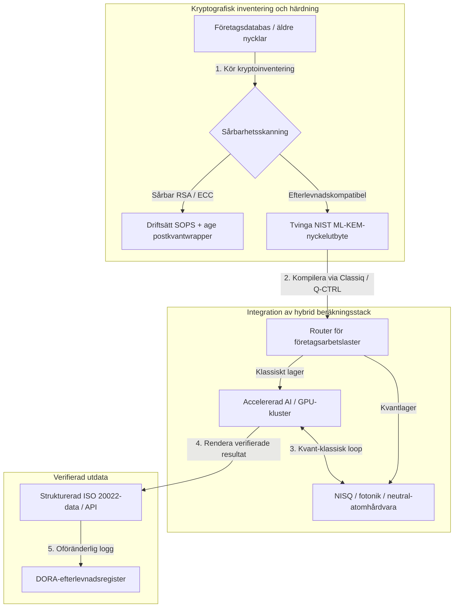

---

# Front Matter (YAML)

author: "contact@sebastienrousseau.com (Sebastien Rousseau)"
banner_alt: "Scenvy från Economist Impacts 5:e årliga Commercialising Quantum Global 2026-toppmöte i London — symboliserar kvantteknikens övergång från fysikforskning till företagsfärdiga arbetsflöden"
banner_height: "1597"
banner_width: "2584"
banner: "https://cloudcdn.pro/stocks/images/sebastien-rousseau-20260617-5th-commercialising-quantum-2.webp"
cdn: "https://cloudcdn.pro"
charset: "UTF-8"
cname: "sebastienrousseau.com"
copyright: "© Copyright 2025 - 2026 - Sebastien Rousseau. All rights reserved."
date: "June 17, 2026"
description: "Slutsatser för styrelserummet från Economist Impacts 5:e årliga Commercialising Quantum Global 2026-toppmöte — 1,3 miljarder dollar i finansieringsboom, hybridstackar utan ånger, omedelbar migration till postkvantkryptografi, kommersialisering av kvantsensing och HSBC:s direktiv att avvaktan är ett självförvållat misstag."
format-detection: "telephone=no"
hreflang: "sv"
icon: "https://cloudcdn.pro/clients/sebastienrousseau/v1/logos/sebastienrousseau.svg"
id: "https://sebastienrousseau.com/2026-06-17-economist-commercialising-quantum-summit-2026"
image_alt: "Svartvitt porträtt av Sebastien Rousseau"
image_height: "162"
image_width: "162"
image: "https://cloudcdn.pro/stocks/images/sebastien-rousseau.png"
keywords: "Commercialising Quantum Global 2026, Economist Impact-toppmöte, postkvantkryptografi, NIST ML-KEM, harvest-now decrypt-later, SNDL, HSBC quantum, Philip Intallura, kvantsensing, GPS-oberoende navigering, NQCC, EU Quantum Act, Quantcore, qBIG-pris, Lord Vallance, hybrid kvant-klassisk, DORA Artikel 6"
language: "sv-SE"
last_reviewed: "2026-06-17"
layout: "report"
locale: "sv_SE"
logo_alt: "Logotyp för Sebastien Rousseau"
logo_height: "44"
logo_width: "44"
logo: "https://cloudcdn.pro/clients/sebastienrousseau/v1/logos/sebastienrousseau.svg"
menu: ""
measurementID: "G-169G4ET5HQ"
name: "Sebastien Rousseau"
permalink: "https://sebastienrousseau.com/2026-06-17-economist-commercialising-quantum-summit-2026"
rating: "general"
referrer: "no-referrer"
robots: "index, follow"
schema: "FAQPage, Article"
seo_title: "Commercialising Quantum 2026: slutsatser för styrelserummet"
short_name: "sebastienrousseau"
subtitle: "Kvant har korsat gränsen från spekulativ laboratorievetenskap till hybrida företagsarbetsflöden; styrelserummet måste svara på 1,3 miljarder dollar i finansiering under 2026, omedelbar postkvantmigration och HSBC:s direktiv att sluta avvakta."
tags: "kvant, postkvantkryptografi, NIST ML-KEM, harvest-now decrypt-later, kvantsensing, HSBC, Economist Impact, hybridberäkning, DORA, EU Quantum Act, NQCC, slutsatser från toppmöte"
theme-color: "0, 83, 191"
title: "Från qubits till vinster: strategiska slutsatser från Economists 5:e årliga Commercialising Quantum Global 2026-toppmöte"
url: "https://sebastienrousseau.com/2026-06-17-economist-commercialising-quantum-summit-2026"
viewport: "width=device-width, initial-scale=1, shrink-to-fit=no"

# RSS - The RSS feed front matter (YAML).
atom_link: "https://sebastienrousseau.com/2026-06-17-economist-commercialising-quantum-summit-2026/rss.xml"
category: "Technology"
docs: https://validator.w3.org/feed/docs/rss2.html
generator: "Static Site Generator (SSG) (version 0.0.26)"
item_description: "Slutsatser för styrelserummet från Economist Impacts 5:e årliga Commercialising Quantum Global 2026-toppmöte — 1,3 miljarder dollar i finansieringsboom, hybridstackar utan ånger, omedelbar migration till postkvantkryptografi, kommersialisering av kvantsensing och HSBC:s direktiv att avvaktan är ett självförvållat misstag."
item_guid: "https://sebastienrousseau.com/2026-06-17-economist-commercialising-quantum-summit-2026/rss.xml"
item_link: "https://sebastienrousseau.com/2026-06-17-economist-commercialising-quantum-summit-2026/rss.xml"
item_pub_date: "Wed, 17 Jun 2026 06:06:06 +0000"
item_title: "Från qubits till vinster: strategiska slutsatser från Economists 5:e årliga Commercialising Quantum Global 2026-toppmöte"
last_build_date: "Wed, 17 Jun 2026 06:06:06 +0000"
managing_editor: "contact@sebastienrousseau.com (Sebastien Rousseau)"
pub_date: "Wed, 17 Jun 2026 06:06:06 +0000"
ttl: "60"
type: "article"
webmaster: "contact@sebastienrousseau.com"

# Apple - The Apple front matter (YAML).
apple_mobile_web_app_orientations: "portrait"
apple_touch_icon_sizes: "192x192"
apple-mobile-web-app-capable: "yes"
apple-mobile-web-app-status-bar-inset: "black"
apple-mobile-web-app-status-bar-style: "black-translucent"
apple-mobile-web-app-title: "Commercialising Quantum 2026: slutsatser för styrelserummet"
apple-touch-fullscreen: "yes"

# MS Application - The MS Application front matter (YAML).

msapplication-navbutton-color: "0, 83, 191"

# Twitter Card - The Twitter Card front matter (YAML).

twitter_card: "summary_large_image"
twitter_creator: "@wwdseb"
twitter_description: "Slutsatser för styrelserummet från Economist Impacts 5:e årliga Commercialising Quantum Global 2026-toppmöte — 1,3 miljarder dollar i finansieringsboom, hybridstackar utan ånger, omedelbar migration till postkvantkryptografi, kommersialisering av kvantsensing och HSBC:s direktiv att avvaktan är ett självförvållat misstag."
twitter_image: "https://cloudcdn.pro/clients/sebastienrousseau/v1/logos/sebastienrousseau.svg"
twitter_image_alt: "Logotyp för Sebastien Rousseau"
twitter_site: "@wwdseb"
twitter_title: "Commercialising Quantum 2026: slutsatser för styrelserummet"
twitter_url: "https://sebastienrousseau.com/2026-06-17-economist-commercialising-quantum-summit-2026"

excerpt: "Economist Impacts 5:e årliga Commercialising Quantum Global 2026-toppmöte bekräftade kvantens svängning mot företagsarbetsflöden: 1,3 miljarder dollar inhämtade på fem månader, postkvantkryptografi är en fiduciär fråga på styrelsenivå under SNDL-skördning, kvantsensing levereras redan idag för GPS-oberoende navigering, och HSBC:s Philip Intallura levererade direktivet att avvaktan på feltolerant hårdvara är ett självförvållat misstag."

# Humans.txt - The Humans.txt front matter (YAML).
author_website: "https://sebastienrousseau.com"
author_twitter: "@wwdseb"
author_location: "London, UK"
thanks: "Tack för att du läste!"
site_last_updated: "2026-06-17"
site_standards: "HTML5, CSS3, RSS, Atom, JSON, XML, YAML, Markdown, TOML"
site_components: "Kaishi, Kaishi Builder, Kaishi CLI, Kaishi Templates, Kaishi Themes"
site_software: "Static Site Generator, Rust"

---

# Från qubits till vinster: strategiska slutsatser från Economists 5:e årliga Commercialising Quantum Global 2026-toppmöte

Företagsmognad, migrationer till postkvantkryptografi, hybrida beräkningsstackar och det framväxande kommersiella landskapet för kvantsensing och kvantnätverk.

**TL;DR.** Den 5:e årliga Commercialising Quantum Global 2026-konferensen, arrangerad av Economist Impact den 16–17 juni 2026 vid Business Design Centre i London, samlade över 1 100 globala ledare inom näringsliv, finans, politik och forskning. Det centrala temat markerade en tydlig strukturell svängning: kvanttekniken har gått från spekulativ laboratorievetenskap till praktiska, hybrida företagsarbetsflöden. Med 1,3 miljarder dollar i riskkapital insamlat enbart under de fem första månaderna av 2026 handlar styrelsediskussionen inte längre om att räkna fysiska qubits, utan om att etablera hybrida beräkningsstackar "utan ånger", säkra digitala tillgångar mot det kryptografiska hotet "harvest-now, decrypt-later" (SNDL), och driftsätta kvantsensingsystem på kort sikt för GPS-oberoende navigering.

## Viktiga slutsatser

- **Företagssvängning mot praktiska arbetsflöden.** Branschledare ([Steve Suarez](https://www.linkedin.com/in/stevesuarez) på HorizonX, [Phil Intallura](https://www.linkedin.com/in/intallura) på HSBC) betonade att kvantintegration inte längre är ett fysikproblem utan ett operativt. Banker och företag driftsätter hybrida kvant-klassiska piloter för att förbereda talang och optimera aktiva arbetslaster.
- **Postkvantkryptografi (PQC) är en styrelseprioritet.** Säkerhets- och juridikexperter (CMS UK, [Joanne Miller](https://www.linkedin.com/in/joanne-miller-nso) på Microsoft, [Craig Farrell](https://www.linkedin.com/in/craig-farrell) på EY) varnade att organisationer inte kan avvakta feltolerant hårdvara innan PQC driftsätts. "Harvest-now, decrypt-later"-skördning sker redan idag, vilket gör migrationen till NIST ML-KEM-standarder till en omedelbar fiduciär angelägenhet.
- **Kvantsensing leder lönsamhet på kort sikt.** Medan feltolerant beräkning fortfarande ligger flera år bort skalar kvantsensing ([Matthew Kinsella](https://www.linkedin.com/in/matthewkinsella) på Infleqtion) snabbt. Kvantklockor och inertiella sensorer driftsätts inom GPS-oberoende navigering, nationell säkerhet och ultrastabila energinät.
- **Suveränitet, kluster och politisk brådska.** Storbritanniens vetenskapsminister [Lord Vallance](https://www.linkedin.com/in/patrick-vallance) och [Lord William Hague](https://www.linkedin.com/in/williamhague) beskrev nationella uppdrag för att omvandla forskning till industriella "superkluster" som samordnas med National Quantum Computing Centre (NQCC). Den kommande EU Quantum Act understryker ytterligare den geopolitiska kapplöpningen om suverän beräkningskapacitet.
- **Quantcore vinner qBIG-priset.** Avknoppningen Quantcore från University of Glasgow säkrade IOP:s qBIG-pris för sitt genombrott med supraledande komponenter baserade på niob, som verkar vid högre temperaturer än traditionella material och avsevärt minskar kostnaderna för kryogen infrastruktur.

**Vidare läsning:** [KyberLib och postkvantmigrationen i bank 2026: från standard till kod](https://sebastienrousseau.com/2026-06-12-kyberlib-post-quantum-banking-migration-standards-code-2026/), [Banking Resilience Index 2026: AI, moln, kvant, betalningar och koncentrationsrisk hos tredje part](https://sebastienrousseau.com/2026-06-08-banking-resilience-index-ai-cloud-quantum-payments-third-party-risk-2026/), [Cloud Native Banking Index 2026: DORA, plattformsteknik, suverän moln och operativ motståndskraft](https://sebastienrousseau.com/2026-06-05-cloud-native-banking-index-dora-resilience-platform-engineering-2026/).

## 01. Varför 2026 års toppmöte är viktigt för styrelserummet

2026 års upplaga av Economists Commercialising Quantum Global-toppmöte markerade en permanent förändring i hur företagsvärlden värderar djup teknik.

Historiskt sett relegerades kvantberäkning till FoU-avdelningar som ett vetenskapligt åtagande över flera decennier. I juni 2026 är detta perspektiv föråldrat. Organisationer måste gå från "fysikcentrerad" nyfikenhet till "affärscentrerad" implementation. Skälet är tudelat:

1. **Konvergensen mellan kvant och AI.** Stackar för HPC (high-performance computing) smälter samman klassiska noder, accelererad AI och NISQ-noder (Noisy Intermediate-Scale Quantum) till ett enhetligt beräkningslager. Organisationer som dröjer med att bygga kvantfärdiga applikationer kommer att upptäcka att fönstret för att fånga strategiska fördelar stängs snabbare än väntat.
2. **Geopolitisk och fiduciär brådska.** Med Storbritanniens uppdragsledda kvantprogram och den kommande EU Quantum Act har kvantkapacitet blivit en fråga om nationell suveränitet och företagskontinuitet.

Postkvantcybersäkerhet är heller inte längre ett framtida efterlevnadskrav. Hotet från fientliga "store now, decrypt later"-attacker (SNDL) innebär att företagsdata som avlyssnas idag kommer att dekrypteras när kommersiella kvantsystem skalas upp, vilket skapar omedelbart ansvar under globala mandat för operativ motståndskraft som Digital Operational Resilience Act (DORA).

## 02. Det strategiska perspektivet för Commercialising Quantum 2026

Ledare inom företagsteknik måste kartlägga kvantmognad över fem distinkta operativa lager och utvärdera tidshorisonter och balansräkningsrisker.

### Tabell 1: Det strategiska perspektivet för Commercialising Quantum 2026

| Lager | Företagsfokus | Tidslinje / horisont | Främsta företagsrisk |
| ---- | ---- | ---- | ---- |
| **Hårdvara och kompilator** | Val mellan konkurrerande angreppssätt (supraledande, jonfällor, neutrala atomer, fotonik) | 3 – 5 år (feltolerans) | Inlåsning i en återvändsarkitektur eller satsning på en enda plattform alltför tidigt. |
| **Kryptografisk härdning** | Inventering av kryptografiska beroenden; migration till NIST ML-KEM | Omedelbar (aktiv migration) | Systemiska dataintrång och bristande efterlevnad under DORA och NIST CSF 2.0. |
| **Kvantsensing** | Driftsättning av GPS-oberoende navigering, ultrastabila klockor och gravimetrar | 1 – 2 år (omedelbar kommersiell) | Operativ störning av logistik, sjöfart och energinät på grund av GPS-störning. |
| **Systemintegration** | Anslutning av kvanthårdvara till befintliga klassiska HPC- och superdatorhallar | 1 – 3 år (hybridfas) | Hög latens, flaskhalsar i dataöverföring och fragmenterade beräkningssilos. |
| **Företagsprogramvara** | Exponering av kvantalgoritmer via högnivåabstraktionslager och API:er (Classiq, Q-CTRL) | Omedelbar (kompetensbyggande) | Isolering av talang och arbetsflöden från det faktiska ingenjörsutförandet. |

## 03. Centrala kvantsignaler och styrelseutlösare

Teknikledare måste övervaka specifika, kvantifierbara marknads- och regelmått för att styra sina kvantinvesteringar.

### Tabell 2: Centrala kvantsignaler och styrelseutlösare

| Signal | Kvantitativt mått | Regelverk / policyreferens | Operativ plattformsprioritet |
| ---- | ---- | ---- | ---- |
| **Boom i kvantfinansiering** | 1,3 miljarder dollar globalt insamlat under de fem första månaderna av 2026 | Return on Resilience (RoR) | Flytta budgetar från spekulativa piloter till hybrida kvant-klassiska arbetslaster "utan ånger". |
| **Exponering för dekryptering** | 100 % av krypterad data som överförs i publika kanaler exponerad för SNDL-skördning | DORA Artikel 6 (IKT-säkerhet) | Implementera verktyg för kryptografisk inventering för att identifiera sårbara RSA/ECC-nycklar i hela beståndet. |
| **Suverän infrastruktur** | 2,5 miljarder pund i UK National Quantum Strategy-anslag | UK Quantum Missions / Lord Vallance | Etablera lokala partnerskap med nationella superkluster som NQCC. |
| **Efterlevnadsdeadlines** | 14 november 2026, övergång till SWIFT strukturerad adress | SWIFT SR 2026-direktivet | Rensa och formatera interbankdatabaser för att uppfylla strukturerade XML-specifikationer. |

## 04. Djupdykning i toppmötets kärnteman

### Kvant når en investeringsbrytpunkt

Finansiering från riskkapital har accelererat avsevärt med **1,3 miljarder dollar** insamlat enbart under de fem första månaderna av 2026. Till skillnad från tidigare års spekulativa hypecykler är den nuvarande kapitalvågen uppbackad av verkliga arbetslaster på kort sikt. Talare från Classiq och IBM Quantum Platform demonstrerade hur abstraktionslager för programvara och automatiserade kompilatorer låter icke-specialiserade utvecklarteam exekvera hybrida kvant-klassiska algoritmer på dagens klassiska infrastruktur. Denna strategi "utan ånger" gör det möjligt för organisationer att omedelbart bygga kvantfärdig talang och arbetsflöden.

### Juridiska och regulatoriska varningar om "harvest now, decrypt later"

Juridiska partners och cybersäkerhetschefer skapade stort engagemang kring den omedelbara karaktären av datarisken. Företrädare från sponsrande advokatbyrån CMS UK och Microsofts CSO [Joanne Miller](https://www.linkedin.com/in/joanne-miller-nso) levererade en skarp varning till företagsledningen: *att avvakta feltolerant hårdvara innan postkvantkryptografi driftsätts är ett kritiskt fiduciärt misslyckande.*

Under paradigmen "store now, decrypt later" (SNDL) skördar fientliga aktörer aktivt krypterad företagsdata idag med avsikten att dekryptera den så snart kryptografiskt relevanta kvantdatorer dyker upp. Organisationer måste omedelbart driftsätta postkvantskydd (såsom NIST ML-KEM) för att skydda långlivade känsliga dataset, immateriella tillgångar och historiska kundregister.

### Omkalibrering av hypen kring "kvantsensing"

Medan feltolerant kvantberäkning fortfarande ligger flera år bort, lyfte toppmötet fram kvantsensing som den första verkligt lönsamma vågen av driftsättning i verkligheten. VD [Matthew Kinsella](https://www.linkedin.com/in/matthewkinsella) på Infleqtion beskrev hur kvantklockor, inertiella sensorer och radiofrekvenssystem skalar snabbt över flera branscher.

Eftersom dessa tekniker mäter fysikaliska konstanter med subatomär precision möjliggör de **GPS-oberoende navigering**, ultrastabila energinät och djuprymdstelekommunikation. Dessa tillämpningar är högrelevanta för luftfart, sjötransport och nationella försvarssystem som möter växande hot från GPS-störning.

### Ekosystem- och klustersamverkan

Det brittiska kvantekosystemet utnyttjade London-toppmötet för att visa upp inhemska innovationssuperkluster. Liveuppdateringar från National Quantum Computing Centre (NQCC) och Digital Catapult beskrev hur djuptekniska avknoppningar i tidigt skede kan överbrygga "teknikklyftan" genom att integrera kvanthårdvara direkt i klassiska superdatorhallar.

[Wridhdhisom Karar](https://www.linkedin.com/in/wridhdhisomkarar), medgrundare av den skotska kvantstartupen Quantcore, mottog det prestigefyllda Institute of Physics (IOP) Quantum Business Innovation and Growth (qBIG)-priset för företagets niobbaserade supraledande komponenter. Dessa komponenter verkar vid högre temperaturer än traditionella material, vilket avsevärt minskar de kryogena infrastrukturkostnaderna som krävs för att skala kvantprocessorer.

### Fallstudie HSBC: varför avvaktan på kvant är ett "självförvållat misstag"

Insikter från [**Philip Intallura, Ph.D.**](https://www.linkedin.com/in/intallura) (Global Head of Quantum Technologies på HSBC, rådgivare åt brittiska regeringen och styrelserådgivare) vid Economists 5:e årliga Commercialising Quantum Event (2026) levererade ett kraftfullt direktiv till styrelserummet: *"Att avvakta feltolerant kvant innan man börjar är ett självförvållat misstag."*

Dr Intallura argumenterade för att den vanliga "wait-and-see"-hållningen bland finansinstitut är ett självmål byggt på tre felaktiga antaganden:

- **ROI på kort sikt är reell.** I empirisk testning har HSBC presterat bättre än modeller som för närvarande körs i produktion, kopplat kvantarbete till andra delar av verksamheten, använt kvant för att fördjupa relationerna med några av sina största kunder och attraherat betydande nya affärer till **HSBC Innovation Banking**.
- **Kvant är en brant antagandekurva.** Att bygga kapacitet, sätta strategi, säkra finansiering och köra experimentcykler inom en hårt reglerad organisation är inget kort åtagande. Processer måste systematiskt testas och anpassas för tekniken.
- **Kvant är ett ekosystem.** Ingen enskild aktör tar sig dit ensam. Varje forskningsartikel, POC och pilot som HSBC har genomfört har skett i nära samarbete med en kvantleverantör — och i vissa fall sträcker sig samarbetet till akademi, tillsynsmyndigheter och regeringar.

**Avslutande styrelsedirektiv:** *"Den kapacitet du kommer att behöva på dag ett av feltolerans är den kapacitet du bygger nu."*

## 05. Pipeline för företagsintegration av kvant och kryptografi

För att säkra digitala tillgångar samtidigt som kvantberedskap byggs måste företaget etablera en tydlig integrationspipeline.

## 06. Styrelsens spelbok: operativa imperativ

För att översätta insikterna från Commercialising Quantum Global 2026-toppmötet till omedelbart affärsvärde bör företagsledningen exekvera följande fyrstegs styrelsespelbok:

1. **Föreskriv kryptografisk inventering.** Ge Chief Information Security Officer (CISO) i uppdrag att katalogisera samtliga kryptografiska tillgångar och kartlägga varje äldre RSA- och ECC-nyckel i hela företaget för att förbereda postkvantmigrationen.
2. **Driftsätt en hybridstrategi "utan ånger".** Avstå från att invänta perfekt hårdvara. Investera i kvantinspirerad programvara och hybrida klassiska-kvantpiloter för att utveckla intern talang och optimera komplex logistik eller riskportföljer redan idag.
3. **Utvärdera kvantsensing för logistik.** Om er organisation är beroende av globala leveranskedjor, sjöfart eller kritisk infrastruktur, utvärdera aktivt kvantsensingsystem (såsom GPS-oberoende navigering) för att mildra geopolitiska störningsrisker.
4. **Anmäl er till Insight Hour den 30 juni.** Säkerställ att era teknikledare anmäler sig till den virtuella **Commercialising Quantum Global Insight Hour** den 30 juni 2026, klockan 15:00 BST (med stöd av IonQ), för att fortsätta följa företagsriskhantering och talangallokeringsstrategier.

## 07. Vanliga frågor

**Vad är "harvest now, decrypt later" (SNDL) och varför är det viktigt redan idag?**
SNDL är praktiken att avlyssna och lagra krypterad data idag, med avsikten att dekryptera den senare när kryptografiskt relevanta kvantdatorer blir tillgängliga. Långlivade känsliga dataset — immateriella tillgångar, kundregister, regeringskommunikation — utsätts redan för riktade angrepp. Migration till NIST ML-KEM är ett fiduciärt beslut som styrelsen inte kan skjuta upp.

**Varför är kvantsensing den första kommersiella vågen i stället för beräkning?**
Kvantsensorer mäter fysikaliska konstanter med subatomär precision och kräver inte den feltoleranta hårdvara som kvantberäkning gör. Kvantklockor, gravimetrar och inertiella sensorer är redan i pilotdriftsättning för GPS-oberoende navigering, ultrastabila energinät och djuprymdskommunikation.

**Är HSBC:s kvantarbete bara FoU eller har det levererat mätbar avkastning?**
Enligt Philip Intallura vid toppmötet har HSBC presterat bättre än modeller som för närvarande körs i produktion, använt kvant för att fördjupa relationerna med sina största kunder och attraherat betydande nya affärer till HSBC Innovation Banking. Arbetet har flyttats från forskning till operativ integration.

## 08. Referenser

- **Economist Impact, (2026).** *5th Annual Commercialising Quantum Global 2026.* Liveprotokoll från konferens, 16–17 juni 2026. London: Business Design Centre. Tillgängligt på: [Economist Impact](https://events.economist.com/commercialising-quantum/).
- **National Institute of Standards and Technology (NIST), (2024).** *First Three Finalized Post-Quantum Encryption Standards (FIPS 203, 204 och 205).* Gaithersburg: U.S. Department of Commerce. Tillgängligt på: [NIST Standards](https://www.nist.gov/news-events/news/2024/08/nist-releases-first-3-finalized-post-quantum-encryption-standards).
- **Europaparlamentet och Europeiska unionens råd, (2022).** *Förordning (EU) 2022/2554 om digital operativ motståndskraft för finanssektorn (DORA).* Bryssel: Europeiska unionens officiella tidning. Tillgängligt på: [DORA Regulation](https://eur-lex.europa.eu/legal-content/EN/TXT/?uri=CELEX%3A32022R2554).
- **SWIFT, (2024).** *ISO 20022 milstolpe för strukturerad adress november 2026.* La Hulpe: SWIFT. Tillgängligt på: [SWIFT ISO 20022 milestone](https://www.swift.com/standards/iso-20022/iso-20022-bytes/call-action-november-2026).
