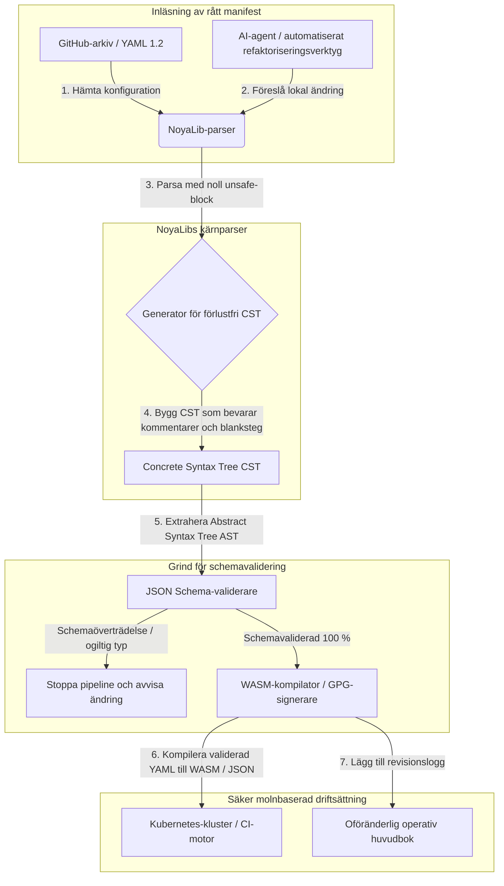

---

# Front Matter (YAML)

author: "contact@sebastienrousseau.com (Sebastien Rousseau)"
banner_alt: "Arkitektonisk geometri under dramatiskt ljus — symboliserar NoyaLibs roll som den bärande, säkra Rust YAML-parsern under CI, Kubernetes, MCP och konfiguration inom finansiella tjänster"
banner_height: "1597"
banner_width: "2584"
banner: "https://cloudcdn.pro/stocks/images/ken-cheung-KonWFWUaAuk.webp"
cdn: "https://cloudcdn.pro"
charset: "UTF-8"
cname: "sebastienrousseau.com"
copyright: "© Copyright 2025 - 2026 - Sebastien Rousseau. All rights reserved."
date: "June 18, 2026"
description: "NoyaLib, en Rust YAML 1.2-parser utan unsafe med 406/406 specefterlevnad, JSON Schema-validering, förlustfri CST och MCP/WASM-bindningar för finansiell infrastruktur."
format-detection: "telephone=no"
hreflang: "sv"
icon: "https://cloudcdn.pro/clients/sebastienrousseau/v1/logos/sebastienrousseau.svg"
id: "https://sebastienrousseau.com/2026-06-18-noyalib-safe-yaml-rust-ai-mcp-financial-infrastructure-2026"
image_alt: "Svartvitt porträtt av Sebastien Rousseau"
image_height: "162"
image_width: "162"
image: "https://cloudcdn.pro/stocks/images/sebastienrousseau.webp"
keywords: "säkrare Rust YAML-parser, NoyaLib, YAML 1.2 specefterlevnad, Rust utan unsafe, JSON Schema-validering, förlustfri Concrete Syntax Tree, CST, MCP, Model Context Protocol, WebAssembly, Kubernetes-manifest, CI/CD-konfiguration, DORA Artikel 5, BCBS 239, Basel III operativ risk, finansiell infrastruktur, konfigurationssäkerhet, programvaruleveranskedja"
language: "sv-SE"
last_reviewed: "2026-06-18"
layout: "report"
locale: "sv_SE"
logo_alt: "Logotyp för Sebastien Rousseau"
logo_height: "44"
logo_width: "44"
logo: "https://cloudcdn.pro/clients/sebastienrousseau/v1/logos/sebastienrousseau.svg"
menu: ""
measurementID: "G-169G4ET5HQ"
name: "Sebastien Rousseau"
permalink: "https://sebastienrousseau.com/2026-06-18-noyalib-safe-yaml-rust-ai-mcp-financial-infrastructure-2026"
rating: "general"
referrer: "no-referrer"
robots: "index, follow"
schema: "FAQPage, Article"
seo_title: "Säkrare Rust YAML-parser för AI, MCP och finans"
short_name: "sebastienrousseau"
subtitle: "En säkrare Rust YAML-stack — NoyaLib — gör YAML 1.2 från bekväm uppmärkning till ett kryptografiskt säkert, specefterlevande styrplan för konfiguration åt AI-agenter, MCP, Kubernetes och finansiell infrastruktur."
tags: "säkrare Rust YAML-parser, NoyaLib, YAML 1.2, Rust utan unsafe, JSON Schema, MCP, WebAssembly, Kubernetes, DORA, BCBS 239, Basel III, finansiell infrastruktur, leveranskedjesäkerhet"
theme-color: "0, 83, 191"
title: "Varför YAML behöver en säkrare Rust-stack för AI, MCP och finansiell infrastruktur 2026"
url: "https://sebastienrousseau.com/2026-06-18-noyalib-safe-yaml-rust-ai-mcp-financial-infrastructure-2026"
viewport: "width=device-width, initial-scale=1, shrink-to-fit=no"

# RSS - The RSS feed front matter (YAML).
atom_link: "https://sebastienrousseau.com/2026-06-18-noyalib-safe-yaml-rust-ai-mcp-financial-infrastructure-2026/rss.xml"
category: "Technology"
docs: https://validator.w3.org/feed/docs/rss2.html
generator: "Static Site Generator (SSG) (version 0.0.26)"
item_description: "NoyaLib, en Rust YAML 1.2-parser utan unsafe med 406/406 specefterlevnad, JSON Schema-validering, förlustfri CST och MCP/WASM-bindningar för finansiell infrastruktur."
item_guid: "https://sebastienrousseau.com/2026-06-18-noyalib-safe-yaml-rust-ai-mcp-financial-infrastructure-2026/rss.xml"
item_link: "https://sebastienrousseau.com/2026-06-18-noyalib-safe-yaml-rust-ai-mcp-financial-infrastructure-2026/rss.xml"
item_pub_date: "Thu, 18 Jun 2026 06:06:06 +0000"
item_title: "Varför YAML behöver en säkrare Rust-stack för AI, MCP och finansiell infrastruktur 2026"
last_build_date: "Thu, 18 Jun 2026 06:06:06 +0000"
managing_editor: "contact@sebastienrousseau.com (Sebastien Rousseau)"
pub_date: "Thu, 18 Jun 2026 06:06:06 +0000"
ttl: "60"
type: "article"
webmaster: "contact@sebastienrousseau.com"

# Apple - The Apple front matter (YAML).
apple_mobile_web_app_orientations: "portrait"
apple_touch_icon_sizes: "192x192"
apple-mobile-web-app-capable: "yes"
apple-mobile-web-app-status-bar-inset: "black"
apple-mobile-web-app-status-bar-style: "black-translucent"
apple-mobile-web-app-title: "Säkrare Rust YAML-parser för AI, MCP och finans"
apple-touch-fullscreen: "yes"

# MS Application - The MS Application front matter (YAML).

msapplication-navbutton-color: "0, 83, 191"

# Twitter Card - The Twitter Card front matter (YAML).

twitter_card: "summary_large_image"
twitter_creator: "@wwdseb"
twitter_description: "NoyaLib, en Rust YAML 1.2-parser utan unsafe med 406/406 specefterlevnad, JSON Schema-validering, förlustfri CST och MCP/WASM-bindningar för finansiell infrastruktur."
twitter_image: "https://cloudcdn.pro/clients/sebastienrousseau/v1/logos/sebastienrousseau.svg"
twitter_image_alt: "Logotyp för Sebastien Rousseau"
twitter_site: "@wwdseb"
twitter_title: "Säkrare Rust YAML-parser för AI, MCP och finans"
twitter_url: "https://sebastienrousseau.com/2026-06-18-noyalib-safe-yaml-rust-ai-mcp-financial-infrastructure-2026"

excerpt: "NoyaLib är en säkrare Rust YAML-stack — noll unsafe-block, 406/406 i specefterlevnad för YAML 1.2, förlustfri Concrete Syntax Tree, JSON Schema-validering (Draft 2020-12) och MCP/WASM-bindningar — konstruerad för AI-agenter, Kubernetes, CI/CD och det styrplan för konfiguration som ligger bakom finansiell infrastruktur."

# Humans.txt - The Humans.txt front matter (YAML).
author_website: "https://sebastienrousseau.com"
author_twitter: "@wwdseb"
author_location: "London, UK"
thanks: "Tack för att du läste!"
site_last_updated: "2026-06-18"
site_standards: "HTML5, CSS3, RSS, Atom, JSON, XML, YAML, Markdown, TOML"
site_components: "Kaishi, Kaishi Builder, Kaishi CLI, Kaishi Templates, Kaishi Themes"
site_software: "Static Site Generator, Rust"

---

# Varför YAML behöver en säkrare Rust-stack för AI, MCP och finansiell infrastruktur 2026

En säkrare Rust YAML-stack spelar roll eftersom YAML idag bär CI/CD-pipelines, Kubernetes-manifest, regler för [Open Policy Agent](https://www.openpolicyagent.org/) och tregistrer för Model Context Protocol (MCP) — och en enda tvetydig parsning kan slå ut ett clearingsystem, felkonfigurera en säkerhetsgrupp eller ge en lokal AI-agent fel behörigheter. [NoyaLib](https://github.com/sebastienrousseau/noyalib) är ett ekosystem för parsning och validering av [YAML 1.2](https://yaml.org/spec/1.2.2/), helt skrivet i Rust och utan unsafe, konstruerat för att göra den infrastrukturen säker som standard.

## Snabbt svar

**Vad är NoyaLib i en mening?** NoyaLib är ett öppen källkods-ekosystem för parsning och validering av YAML 1.2, helt skrivet i Rust med noll `unsafe`-kod, 100 % specefterlevnad över den officiella YAML-sviten med 406 tester, en förlustfri Concrete Syntax Tree och realtidsvalidering mot [JSON Schema](https://json-schema.org/) — konstruerat för att göra konfiguration för AI-agenter, MCP, Kubernetes och finansiell infrastruktur säker som standard.

## Sammanfattning för ledningen

YAML ser oansenligt ut tills en tvetydig parsning eller schemaöverträdelse slår ut ett produktionsclearingsystem värt flera miljarder dollar. Under 2026 är YAML de facto-standarden för [CI/CD](https://docs.github.com/en/actions/learn-github-actions/workflow-syntax-for-github-actions)-pipelines, [Kubernetes](https://kubernetes.io/docs/concepts/configuration/overview/)-manifest, regler för [Open Policy Agent](https://www.openpolicyagent.org/) och tregistrer för Model Context Protocol (MCP). Opaka äldre parsare — med minnessårbarheter och destruktiv parsning — utgör en oacceptabel säkerhetsrisk. NoyaLib är ett ekosystem för YAML 1.2 i ren Rust utan unsafe: 100 % specefterlevnad över alla 406 officiella sviteprov, en förlustfri Concrete Syntax Tree (CST) som bevarar kommentarer och blanksteg, samt inbyggd JSON Schema-validering. Resultatet är att YAML omformas till ett granskningsbart, säkert och agentåtkomligt styrplan för konfiguration.

## Viktiga slutsatser

- **Konfiguration är produktionskod.** En enda felaktig YAML-fil kan felkonfigurera molnbaserade säkerhetsgrupper eller behörigheter för AI-agenter. NoyaLib behandlar YAML som kritisk infrastruktur.
- **Design utan unsafe.** Helt byggt i säker Rust med noll `unsafe`-block eliminerar NoyaLib minnessäkerhetssårbarheter — buffertöverskridningar, fjärrkörning av kod — i kärnparsningens lager.
- **Absolut 406/406 specefterlevnad.** Validerar konfigurationsstrukturer matematiskt och eliminerar parsningsavvikelser och strukturell drift mellan staging- och produktionsmiljöer.
- **Förlustfri Concrete Syntax Tree.** Till skillnad från äldre parsare som kastar kommentarer och formatering bevarar NoyaLib blanksteg och annoteringar och möjliggör säker, automatiserad refaktorisering tur och retur av AI-agenter.
- **Fiduciärt värde på styrelsenivå.** Kopplar konfigurationsintegritet till [DORA Artikel 5](https://eur-lex.europa.eu/legal-content/EN/TXT/?uri=CELEX%3A32022R2554) och kapitalmått för operativ risk under [Basel III](https://www.bis.org/bcbs/publ/d424.htm), och skyddar därmed seniora chefer direkt från personligt ansvar.

**Vidare läsning:** [KyberLib och postkvantmigrationen i bank 2026: från standard till kod](https://sebastienrousseau.com/2026-06-12-kyberlib-post-quantum-banking-migration-standards-code-2026/), [Cloud Native Banking Index 2026: DORA, plattformsteknik, suverän moln och operativ motståndskraft](https://sebastienrousseau.com/2026-06-05-cloud-native-banking-index-dora-resilience-platform-engineering-2026/), [AI-medvetna dotfiles 2026: bygga en säker, reproducerbar utvecklararbetsstation för MCP, SLSA och flerskalsparitet](https://sebastienrousseau.com/2026-06-16-ai-aware-dotfiles-secure-reproducible-workstation-2026/).

## 01. Varför en säkrare Rust YAML-stack spelar roll 2026

I juni 2026 är företagens IT-infrastrukturer starkt distribuerade och alltmer automatiserade.

YAML har tyst blivit det bärande konfigurationsspråket för hela mjukvaruutvecklingsstacken. Det bär de arbetsflöden för kontinuerlig integration (CI) som kompilerar produktionsartefakter, de [Kubernetes](https://kubernetes.io/docs/concepts/overview/)-manifest som orkestrerar globala molnbaserade kluster, och de scheman för [Model Context Protocol](https://modelcontextprotocol.io/) (MCP)-servrar som ger lokala AI-agenter behörighet att exekvera lokala operationer.

Äldre YAML-parsare — [PyYAML](https://pyyaml.org/), [yaml-cpp](https://github.com/jbeder/yaml-cpp), [libyaml](https://github.com/yaml/libyaml) — bär två strukturella risker:

1. **Typkonverteringssårbarheter ("Norge-problemet").** Äldre parsare omvandlar ofta ociterade strängar (landskoden `NO` till boolean `false`, `yes`/`no` likaså) — se [YAML 1.1 mot 1.2 boolean-tagg](https://yaml.org/type/bool.html) — vilket orsakar kritiska systemavbrott eller tysta säkerhetsfelkonfigurationer.
2. **Sårbarheter i minnessäkerhet.** Opaka parsare skrivna i C/C++ lider av minnesläckor och buffertöverskridningar som kan leda till fjärrkörning av kod (RCE) på centrala byggservrar.

[NoyaLib](https://github.com/sebastienrousseau/noyalib) löser dessa utmaningar. Det är ett ekosystem för parsning och validering av YAML 1.2, helt skrivet i Rust och utan unsafe. Genom att uppnå absolut 406/406 specefterlevnad och tillämpa strikt JSON Schema-validering direkt vid parsning levererar NoyaLib hög **Return on Resilience (RoR)** — förhindrar konfigurationsinducerad driftstörning och säkrar programvaruleveranskedjor av finansiell klass.

## 02. NoyaLib 2026-arkitekturperspektivet

NoyaLib-ekosystemet fungerar som en säker, förlustfri konfigurationsparser. Varje lokalt och molnbaserat manifest valideras strukturellt och skyddas i det lägsta exekveringslagret.

### Tabell 1: NoyaLibs arkitekturlager och riskbegränsning

| Lager | Designbeslut | Varför det spelar roll | Risk vid felhantering |
| ---- | ---- | ---- | ---- |
| **Parserlager** | YAML 1.2-kompatibel parser i ren Rust med noll `unsafe`-block | Eliminerar minnessäkerhetssårbarheter och buffertöverskridningar i det lägsta exekveringslagret. | Fjärrkörning av kod (RCE) på centrala byggservrar. |
| **Konformanslager** | 100 % efterlevnad över 406/406 officiella YAML 1.2-svitprov | Eliminerar parsningsavvikelser och typkonverteringsdrift mellan staging och produktion. | "Norge-problemet" — typkonverteringsfel som inaktiverar säkerhetsgrupper. |
| **Syntaxträdlager** | Förlustfri Concrete Syntax Tree (CST) | Bevarar kommentarer, blanksteg och ordning vid parsning tur och retur samt programmatisk refaktorisering. | Automatiserad AI-refaktorisering som förstör utvecklarnas annoteringar. |
| **Valideringslager** | Validering mot [JSON Schema (Draft 2020-12)](https://json-schema.org/draft/2020-12/release-notes) under parsning | Tvingar strikta datamodeller på konfigurationsfiler innan de når produktionskluster. | Felaktiga konfigurationsfiler som utlöser kraschar i molnbaserade kluster. |
| **Gränssnittslager** | WebAssembly (WASM)- och MCP-bindningar | Tillåter att konfigurationsvalidering körs direkt i webbläsare, edge-noder och lokala verktygskit för agenter. | Verktygssilor där validering inte kan exekvera på edge-enheter. |

## 03. Viktiga säkerhetssignaler för arbetsstation och konfiguration

För att upprätthålla absolut säkerhet i utvecklings- och driftsbeståndet måste Chief Information Security Officers (CISO) övervaka specifika, kvantifierbara mått.

### Tabell 2: Säkerhetssignaler för arbetsstation och konfiguration

| Signal | Mått / operativ riktpunkt | NIST CSF / DORA-referens | Teknisk plattformsimplementation |
| ---- | ---- | ---- | ---- |
| **Parserkonformans** | 100 % godkänt över den officiella YAML 1.2-testsviten (406/406 tester). | [DORA Artikel 6](https://eur-lex.europa.eu/legal-content/EN/TXT/?uri=CELEX%3A32022R2554) (IKT-säkerhet) | NoyaLibs parserkärna validerar alla manifest före CI-körning. |
| **Minnessäkerhetsprofil** | Noll `unsafe` Rust-block i parserns och serialiserarens beroenden. | DORA Artikel 30 (leveranskedja) | Automatiserade kompilatorkontroller ([`forbid(unsafe_code)`](https://doc.rust-lang.org/reference/attributes/diagnostics.html#the-forbid-attribute)) i cargo-bygget. |
| **Schemavalidering** | 100 % av parsade konfigurationsfiler verifieras mot giltiga [JSON Schema](https://json-schema.org/)-modeller. | [NIST CSF 2.0](https://www.nist.gov/cyberframework) (PR.DS-01) | Realtidsgrind för validering som stoppar bygg-pipelines vid schemaöverträdelser. |
| **Konfigurationsdrift** | Realtidsdetektion och återställning av lokala konfigurationsfiler till git-versionerat tillstånd. | Return on Resilience (RoR) | Kontinuerlig telemetri som loggar alla lokala filändringar. |
| **Behörighetskontroll för agenter** | Avgränsade behörigheter med endast läsåtkomst för lokala AI-verktyg som verkar via MCP-konfigurationer. | Modellriskhantering ([SR 11-7](https://web.archive.org/web/20260414150921/https://www.federalreserve.gov/supervisionreg/srletters/sr1107.htm)) | MCP-servergränser begränsar agentoperationer till godkända kataloger. |

## 04. Felslutet med opak konfigurationsparsning

En central sårbarhet i molnbaserade operationer är *opak parsning* — användning av parsare som kastar strukturella metadata (kommentarer, blanksteg, dokumentordning) eller tyst konverterar typer vid kompilering. Beteendet introducerar två allvarliga säkerhetsrisker:

1. **Destruktiv refaktorisering.** När en AI-kodningsassistent eller ett automatiserat refaktoriseringsverktyg uppdaterar ett driftsättningsmanifest kastar traditionella parsare utvecklarnas kommentarer och formatering, vilket förstör den kontext som krävs för mänsklig granskning och post mortem-forensik.
2. **Parsningsavvikelser.** Om en staging-miljö använder en Python-baserad parser och produktion kör en C-baserad parser kan små skillnader i YAML 1.2-specefterlevnad få ett giltigt staging-manifest att misslyckas eller bete sig annorlunda i produktion, vilket skapar dolda säkerhetsbrister.

NoyaLibs **förlustfria Concrete Syntax Tree (CST)** löser detta. Den bevarar varje blanksteg, kommentar och dokumentrad under parsnings- och serialiseringscykeln. Automatiserade AI-assistenter kan redigera, refaktorisera och committa konfigurationsfiler samtidigt som de bevarar 100 % av människoskrivna annoteringar — ett absolut spår för granskning.

## 05. Att utforma en avgränsad konfigurationspipeline för AI

För att förhindra att skadliga konfigurationsändringar når produktionsmiljöer måste organisationen implementera en strikt avgränsad, schemavaliderad konfigurationspipeline.

Det operativa flödet nedan visar hur NoyaLib parsar rå YAML, konstruerar en förlustfri CST, validerar AST mot en JSON Schema-modell och kompilerar WebAssembly-bindningar för webbläsar- eller edge-miljöer.

## 06. Styrelsespelboken och fiduciärt ansvar

Konfigurationssäkerhet och integritet i programvaruleveranskedjan är kritiska prioriteringar för styrelserummet. Seniora chefer måste närma sig konfigurationshantering genom fiduciär plikt och operativ motståndskraft.

- **DORA Artikel 5 (styrelseansvar).** Föreskriver att styrelsen bär det yttersta, icke-delegerbara ansvaret för att hantera institutionens IKT-risk. Eftersom konfigurationsfiler styr kritiska molnbaserade säkerhetsgrupper och betalningsdirigering måste styrelser verifiera att de system som parsar dessa manifest är minnessäkra och fullt specefterlevande för att klara regulatoriska granskningar. ([Förordning (EU) 2022/2554](https://eur-lex.europa.eu/legal-content/EN/TXT/?uri=CELEX%3A32022R2554))
- **BCBS 239 (riskdataaggregering och rapportering).** Kräver att riskrapportering och infrastrukturmått är korrekta, fullständiga och framställda under strikta datakvalitetskontroller. NoyaLib stöder BCBS 239 genom att parsa och validera konfigurationsfiler mot strikta scheman vid källan, vilket förhindrar tysta dataläckage eller felkonfigurationsorsakade avbrott. ([BCBS 239-standarden](https://www.bis.org/publ/bcbs239.htm))
- **Begränsning av kapitalkrav för operativ risk (Basel III).** Konfigurationsinducerade avbrott blåser direkt upp kapitalkraven för operativ risk under Basel III och binder kapital i balansräkningen. Att standardisera företagets konfigurationsstack på en säker parser i ren Rust som NoyaLib minimerar denna risk, bevarar kapital och skyddar kundernas förtroende. ([Basel III-standarder](https://www.bis.org/bcbs/publ/d424.htm))

## 07. Vad detta innebär per banktyp

### Globalt systemviktiga banker (G-SIB)

G-SIB hanterar tusentals mikrotjänster och driftsättnings-pipelines över flera jurisdiktioner. Deras primära utmaning är att upprätthålla konfigurationskonsekvens och förhindra säkerhetsdrift över massiva molnbaserade bestånd. Att standardisera på en säkrare Rust YAML-stack som NoyaLib garanterar att alla Kubernetes-manifest, CI/CD-pipelines och säkerhetspolicyer parsas och valideras under ett enhetligt, minnessäkert ramverk — vilket eliminerar risken för ogranskade "snöflingekonfigurationer".

### Transaktions- och företagsbanker

Transaktionsbanker driver känsliga betalningsgateways och clearinginfrastrukturer för partihandel. Att bevisa absolut säkerhet hos den kod och konfiguration som driftsätts i dessa produktionsmiljöer är ett icke förhandlingsbart regulatoriskt krav. Att integrera NoyaLib garanterar att programvaruleveranskedjan är fullt granskad, förlustfri och skyddad från parsningssårbarheter — en kontroll som mappar rent mot DORA Artikel 6 och avsnitt 6 i [PCI DSS v4.0](https://www.pcisecuritystandards.org/document_library/).

### Regionala och mindre banker

Regionala banker måste upprätthålla höga cybersäkerhetsstandarder utan teknikbudgetar i G-SIB-skala. Det öppna källkods-ramverket NoyaLib levererar en lätt, kostnadseffektiv och starkt säker Rust-vänlig lösning, vilket gör det möjligt för mindre institut att implementera konfigurationssäkerhet och leveranskedjeskydd i företagsklass utan proprietära licensavgifter.

## 08. Slutsats: färdplan för konfigurationssäkerhet

Utvecklararbetsstationen och molnbaserade infrastrukturkonfigurationer är kritiska styrplan i programvaruleveranskedjan. Att tillåta ogranskade, tvetydiga eller osäkra konfigurationsfiler att nå företagstillgångar är en oacceptabel operativ och regulatorisk risk.

För att säkra programvaruleveranskedjan och skydda ändpunkter från konfigurationssårbarheter bör seniora teknik- och säkerhetschefer exekvera en tydlig utvecklingsfärdplan redan idag:

1. **Föreskriv deklarativ konfiguration.** Fasa ut manuella, ogranskade konfigurationsjusteringar och föreskriv att alla manifest hanteras som ett versionskontrollerat, deklarativt referenssystem.
2. **Tvinga schemavalidering.** Tvinga strikta pre-commit-hooks och skanningsverktyg för att säkerställa att alla konfigurationsfiler valideras mot giltiga JSON Schema-modeller före driftsättning.
3. **Implementera förlustfri tur och retur-parsning.** Säkerställ att alla automatiserade AI-kodningsassistenter och refaktoriseringsverktyg använder förlustfri parsning för att bevara kommentarer, blanksteg och utvecklarkontext.
4. **Säkra leveranskedjan.** Säkerställ att alla konfigurationsuppställningar och parsningsverktyg är kryptografiskt verifierade med rena Rust-bibliotek utan unsafe, som NoyaLib, före exekvering. ([SLSA-ramverket](https://slsa.dev/))

## 09. Vanliga frågor

**Vad är NoyaLib och varför används det för YAML-parsning?**
NoyaLib är en öppen källkods-YAML 1.2-parser i ren Rust utan unsafe. Den uppnår 100 % specefterlevnad över den officiella sviten med 406 tester, tvingar strikt validering mot [JSON Schema](https://json-schema.org/) under parsning och exponerar WASM- och [MCP](https://modelcontextprotocol.io/)-bindningar — vilket gör den till en säkrare Rust YAML-stack för AI-agenter, Kubernetes och finansiell infrastruktur.

**Varför är design utan unsafe viktig för konfigurationsparsning?**
Minnessäkerhetssårbarheter — buffertöverskridningar, use-after-free — i äldre parsare skrivna i C/C++ kan leda till fjärrkörning av kod på centrala byggservrar. NoyaLibs design i ren Rust med [`#![forbid(unsafe_code)]`](https://doc.rust-lang.org/reference/attributes/diagnostics.html#the-forbid-attribute) eliminerar matematiskt dessa sårbarheter vid kompileringstid.

**Vad är en förlustfri Concrete Syntax Tree (CST) och varför spelar den roll?**
Traditionella parsare kastar kommentarer och formatering, vilket gör automatiska redigeringar från AI-agenter destruktiva. NoyaLibs förlustfria Concrete Syntax Tree bevarar varje kommentar, blanksteg och dokumentrad — så att AI-assistenter säkert kan redigera och refaktorisera konfigurationsfiler samtidigt som utvecklarkontexten, post mortem-forensiken och granskningsspåret hålls intakta.

**Hur mappar NoyaLib mot DORA, BCBS 239 och Basel III?**
DORA Artikel 5 lägger ansvaret för IKT-risk på styrelsen; BCBS 239 kräver datakvalitetskontroller på riskrapportering; Basel III beskattar kapital för operativ risk. NoyaLib levererar det schemavaliderade, minnessäkra parsningslager som dessa regelverk kräver för konfiguration som kod — vilket gör den regulatoriska mappningen enkel och kapitalkravet för operativ risk lägre.

## 10. Referenser

- **YAML, (2026).** *YAML 1.2-specifikationen*. Tillgängligt på: [YAML 1.2 spec](https://yaml.org/spec/1.2.2/).
- **JSON Schema, (2026).** *JSON Schema Draft 2020-12 releasenoter*. Tillgängligt på: [JSON Schema Draft 2020-12](https://json-schema.org/draft/2020-12/release-notes).
- **Europaparlamentet och Europeiska unionens råd, (2022).** *Förordning (EU) 2022/2554 om digital operativ motståndskraft för finanssektorn (DORA)*. Bryssel: Europeiska unionens officiella tidning. Tillgängligt på: [DORA-förordningen](https://eur-lex.europa.eu/legal-content/EN/TXT/?uri=CELEX%3A32022R2554).
- **Baselkommittén för banktillsyn, (2013).** *Principer för effektiv riskdataaggregering och riskrapportering (BCBS 239)*. Basel: Bank for International Settlements. Tillgängligt på: [BCBS 239-standarden](https://www.bis.org/publ/bcbs239.htm).
- **Baselkommittén för banktillsyn, (2017).** *Basel III: slutförande av reformer efter krisen*. Basel: Bank for International Settlements. Tillgängligt på: [Basel III-standarder](https://www.bis.org/bcbs/publ/d424.htm).
- **Anthropic, (2025).** *Specifikation för Model Context Protocol (MCP)*. Tillgängligt på: [Model Context Protocol](https://modelcontextprotocol.io/).
- **GitHub, (2026).** *noyalib öppna källkodsarkiv*. Tillgängligt på: [NoyaLib-arkivet](https://github.com/sebastienrousseau/noyalib).
