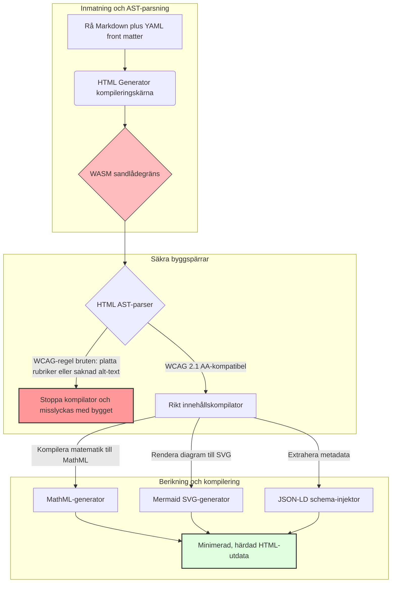

---

# Front Matter (YAML)

author: "contact@sebastienrousseau.com (Sebastien Rousseau)"
banner_alt: "Arkitektonisk geometri under strukturerat ljus — symboliserar HTML Generators roll som en kompilatorstängd Markdown-till-HTML-pipeline för tillgänglig, SEO-optimerad och sandlådeisolerad publiceringsinfrastruktur"
banner_height: "1597"
banner_width: "2584"
banner: "https://cloudcdn.pro/api/transform?url=/stocks/images/markus-winkler-IrRbSND5EUc-unsplash.webp&w=1200&format=webp&q=80"
cdn: "https://cloudcdn.pro"
charset: "UTF-8"
cname: "sebastienrousseau.com"
copyright: "© Copyright 2025 - 2026 - Sebastien Rousseau. All rights reserved."
date: "June 20, 2026"
description: "HTML Generator är ett Rust-bibliotek som omvandlar Markdown till WCAG-konform, SEO-optimerad och JSON-LD-berikad HTML — tillgänglighet som kod, stöd för MathML och Mermaid, samt WebAssembly-sandlåda för säker företagspublicering."
format-detection: "telephone=no"
hreflang: "sv"
icon: "https://cloudcdn.pro/clients/sebastienrousseau/v1/logos/sebastienrousseau.svg"
id: "https://sebastienrousseau.com/2026-06-20-html-generator-accessible-seo-structured-markdown-rust-2026"
image_alt: "Svartvitt porträtt av Sebastien Rousseau"
image_height: "162"
image_width: "162"
image: "https://cloudcdn.pro/stocks/images/sebastien-rousseau.png"
keywords: "html-generator, Rust Markdown till HTML, tillgänglighet som kod, WCAG 2.1 AA, SEO-optimerad HTML, JSON-LD, MathML, Mermaid, WebAssembly, EAA, DORA, ADA Title III, tillgänglig publicering, sandlådad parsning, öppen källkod"
language: "sv-SE"
last_reviewed: "2026-06-20"
layout: "report"
locale: "sv_SE"
logo_alt: "Logotyp för Sebastien Rousseau"
logo_height: "44"
logo_width: "44"
logo: "https://cloudcdn.pro/clients/sebastienrousseau/v1/logos/sebastienrousseau.svg"
menu: ""
measurementID: "G-169G4ET5HQ"
name: "Sebastien Rousseau"
permalink: "https://sebastienrousseau.com/2026-06-20-html-generator-accessible-seo-structured-markdown-rust-2026"
rating: "general"
referrer: "no-referrer"
robots: "index, follow"
schema: "FAQPage, Article"
seo_title: "Tillgänglighet som kod: Markdown till AAA HTML med Rust 2026"
short_name: "sebastienrousseau"
subtitle: "Omvandlar företagets webbpublicering, produktdokumentation och kundportaler från otillgängliga textfiler till välstrukturerade, regelenliga och sandlådeisolerade digitala tillgångar."
tags: "html-generator, Rust, Markdown, tillgänglighet, WCAG, SEO, JSON-LD, MathML, Mermaid, WebAssembly, EAA, DORA, ADA, AI-discovery, RAG, öppen källkod, bankinfrastruktur"
theme-color: "0, 83, 191"
title: "Omvandla Markdown till tillgänglig, SEO-optimerad och strukturerad HTML med Rust 2026"
url: "https://sebastienrousseau.com/2026-06-20-html-generator-accessible-seo-structured-markdown-rust-2026"
viewport: "width=device-width, initial-scale=1, shrink-to-fit=no"

# RSS - The RSS feed front matter (YAML).
atom_link: "https://sebastienrousseau.com/2026-06-20-html-generator-accessible-seo-structured-markdown-rust-2026/rss.xml"
category: "Technology"
docs: https://validator.w3.org/feed/docs/rss2.html
generator: "Static Site Generator (SSG) (version 0.0.40)"
item_description: "HTML Generator är ett Rust-bibliotek som omvandlar Markdown till WCAG-konform, SEO-optimerad och JSON-LD-berikad HTML — tillgänglighet som kod, stöd för MathML och Mermaid, samt WebAssembly-sandlåda för säker företagspublicering."
item_guid: "https://sebastienrousseau.com/2026-06-20-html-generator-accessible-seo-structured-markdown-rust-2026/rss.xml"
item_link: "https://sebastienrousseau.com/2026-06-20-html-generator-accessible-seo-structured-markdown-rust-2026/rss.xml"
item_pub_date: "Sat, 20 Jun 2026 06:06:06 +0000"
item_title: "Omvandla Markdown till tillgänglig, SEO-optimerad och strukturerad HTML med Rust 2026"
last_build_date: "Sat, 20 Jun 2026 06:06:06 +0000"
managing_editor: "contact@sebastienrousseau.com (Sebastien Rousseau)"
pub_date: "Sat, 20 Jun 2026 06:06:06 +0000"
ttl: "60"
type: "article"
webmaster: "contact@sebastienrousseau.com"

# Apple - The Apple front matter (YAML).
apple_mobile_web_app_orientations: "portrait"
apple_touch_icon_sizes: "192x192"
apple-mobile-web-app-capable: "yes"
apple-mobile-web-app-status-bar-inset: "black"
apple-mobile-web-app-status-bar-style: "black-translucent"
apple-mobile-web-app-title: "Markdown till AAA HTML med Rust"
apple-touch-fullscreen: "yes"

# MS Application - The MS Application front matter (YAML).

msapplication-navbutton-color: "0, 83, 191"

# Twitter Card - The Twitter Card front matter (YAML).

twitter_card: "summary_large_image"
twitter_creator: "@wwdseb"
twitter_description: "HTML Generator är ett Rust-bibliotek som omvandlar Markdown till WCAG-konform, SEO-optimerad och JSON-LD-berikad HTML — tillgänglighet som kod, stöd för MathML och Mermaid, samt WebAssembly-sandlåda för säker företagspublicering."
twitter_image: "https://cloudcdn.pro/clients/sebastienrousseau/v1/logos/sebastienrousseau.svg"
twitter_image_alt: "Logotyp för Sebastien Rousseau"
twitter_site: "@wwdseb"
twitter_title: "Tillgänglighet som kod: Markdown till AAA HTML med Rust"
twitter_url: "https://sebastienrousseau.com/2026-06-20-html-generator-accessible-seo-structured-markdown-rust-2026"

# Humans.txt - The Humans.txt front matter (YAML).
author_website: "https://sebastienrousseau.com"
author_twitter: "@wwdseb"
author_location: "London, UK"
thanks: "Tack för att du läste!"
site_last_updated: "2026-06-20"
site_standards: "HTML5, CSS3, RSS, Atom, JSON, XML, YAML, Markdown, TOML"
site_components: "Kaishi, Kaishi Builder, Kaishi CLI, Kaishi Templates, Kaishi Themes"
site_software: "Static Site Generator, Rust"

---

# Omvandla Markdown till tillgänglig, SEO-optimerad och strukturerad HTML med Rust 2026

<!-- lead-start -->
<aside class="post-lead" aria-label="Artikelsammanfattning">

<strong>Kortfattat.</strong> HTML Generator är en renodlad Rust-kompilator för Markdown-till-HTML som tillämpar WCAG 2.1 AA vid byggtid, injicerar schemakompatiblad JSON-LD, renderar MathML och Mermaid SVG inbyggt och isolerar parsning inuti en WebAssembly-sandlåda — vilket omvandlar publicering till ett kompilatorstängd kontrollplan för tillgänglighet, SEO och ICT-säkerhet.

<strong>Viktiga slutsatser</strong>

<ul class="post-lead-takeaways">
  <li><strong>Kortfattat svar.</strong> Vad är HTML Generator i en mening?</li>
  <li><strong>Sammanfattning för ledningen.</strong> Markdown-rendering verkar trivialt; att producera HTML av publiceringsklass är ett efterlevnadsproblem.</li>
  <li><strong>01. Varför en tillgänglighetsfokuserad HTML-kompilator är viktig 2026.</strong> EAA och ADA Title III har förflyttat tillgänglighet från teknisk hygien till ett ansvar på styrelseniå.</li>
  <li><strong>02. HTML Generators arkitekturperspektiv 2026.</strong> En flerstegs, kompilatorstängd pipeline från rå Markdown till härdad HTML-utdata.</li>
</ul>

<strong>Relaterad läsning:</strong> <a href="https://sebastienrousseau.com/2026-06-18-noyalib-safe-yaml-rust-ai-mcp-financial-infrastructure-2026">Varför YAML behöver ett säkrare Rust-ramverk för AI, MCP och finansiell infrastruktur 2026</a>, <a href="https://sebastienrousseau.com/2026-06-17-static-site-generator-secure-default-ai-era-publishing-2026">En säker Static Site Generator med säkra standardinställningar för AI-erans publicering 2026</a>, <a href="https://sebastienrousseau.com/2026-06-11-cloudcdn-open-source-blueprint-ai-native-edge-2026">CloudCDN: En öppen källkodsritning för den AI-nativa edge-miljön 2026</a>.

</aside>
<!-- lead-end -->

Under 2026 konsumeras webbinnehåll lika mycket av AI-sökcrawlers, LLM-drivna sökmotorer och Retrieval-Augmented Generation (RAG)-pipelines som av mänskliga läsare. Platt eller felformaterad HTML försvårar maskiners läsbarhet, och att misslyckas med att uppfylla stränga globala regler som [European Accessibility Act (EAA)](https://www.accessibility-act.eu/) och [US ADA Title III](https://www.ada.gov/topics/title-iii/) är nu ett otvetydigt civilrättsligt ansvar. [HTML Generator](https://github.com/sebastienrousseau/html-generator) är ett högpresterande Rust-bibliotek konstruerat för att täppa till dessa luckor — i kompilatorn, inte i lappar efter driftsättning.

## Kortfattat svar

**Vad är HTML Generator i en mening?** HTML Generator är en öppen källkods-Rust-kompilator för Markdown-till-HTML som tillämpar [WCAG 2.1 AA](https://www.w3.org/TR/WCAG21/) vid byggtid, genererar semantiska landmärken och ARIA-attribut automatiskt, injicerar schemakompatiblad [JSON-LD](https://json-ld.org/)-metadata från YAML front matter, renderar Mermaid-diagram och matematik till tillgänglig SVG och MathML, och körs inuti en [WebAssembly](https://webassembly.org/)-sandlåda — vilket omvandlar företagspublicering till ett kompilatorstängd kontrollplan av förtroendegrad.

## Sammanfattning för ledningen

Markdown-rendering verkar trivialt. HTML av publiceringsklass är ett efterlevnadsproblem. I juni 2026 parsas varje företagets kontaktpunkt — portaler för investerarrelationer, regulatoriska inlagor, kunddokumentation, API-referenser och marknadsföringssajter — av både människor och maskiner. Två tryckkrafter kolliderar på varje sida: [EAA](https://www.accessibility-act.eu/) och [ADA Title III](https://www.ada.gov/topics/title-iii/) gör tillgänglighet till en juridisk exponering på styrelseniå, medan AI-inmatning och RAG-pipelines belönar strukturerad, maskinläsbar utdata. Standardbibliotek för Markdown producerar platt HTML som misslyckas vid båda kontrollpunkterna. HTML Generator behandlar dokumentgenerering som en kompilatorstängd pipeline: WCAG-validering är ett byggfel, JSON-LD härrör från YAML front matter utan manuell stämpling, MathML och Mermaid renderas tillgängligt, och hela motorn levereras som ett WebAssembly-mål så att parsning av opålitliga dokument förblir sandlådeisolerad från värdsystemet.

## Viktiga slutsatser

- **Tillgänglighet som kod är den nya baslinjen.** EAA ålägger tillgänglighet för konsumentinriktade digitala tjänster. HTML Generator utvärderar dokumentträdet vid byggtid och genererar semantiska landmärken och ARIA-attribut automatiskt — färre korrigeringar efter driftsättning, lägre saneringskostnader, ingen saknad alt-text som når produktion.
- **Strukturerade data för AI-discovery.** Modern sökning och RAG är beroende av maskinläsbar metadata. Kompilatorn parsar YAML front matter och injicerar [Schema.org-kompatibel JSON-LD](https://schema.org/) direkt i dokumenthuvudet, vilket gör innehållet fullt tolkbart av [Google Rich Results](https://developers.google.com/search/docs/appearance/structured-data/intro-structured-data), [Bing Webmaster](https://www.bing.com/webmasters) och LLM-drivna crawlers.
- **Teknisk innehållsexcellens.** Teknisk publicering är inte platt text. HTML Generator kompilerar rå Markdown-matematiktillägg till tillgänglig [MathML](https://www.w3.org/Math/), och renderar [Mermaid.js](https://mermaid.js.org/)-diagram till responsiv SVG — båda med bevarad WCAG-kompatibel struktur snarare än att reduceras till ogenomskinliga bilder.
- **WebAssembly-sandlåda.** Att parsa opålitlig Markdown utgör en säkerhetsrisk. Genom att rikta in sig på [WASM](https://webassembly.org/) körs HTML Generator inuti en isolerad sandlåda som förhindrar godtycklig kodkörning och skyddar värdsystemet — vilket direkt uppfyller [DORA Article 6](https://eur-lex.europa.eu/legal-content/EN/TXT/?uri=CELEX%3A32022R2554) ICT-säkerhetsskyldigheter.
- **Styrelseskydd mot rättsliga ansvarsrisker.** Teknisk regelöverträdelse har nu nått styrelserummet. Att standardisera på en kompilatorstängd HTML-motor skyddar styrelseledamöter och ledande befattningshavare från personligt civil- och regulatoriansvar enligt DORA, EAA och ADA Title III.

**Relaterad läsning:** [Varför YAML behöver ett säkrare Rust-ramverk för AI, MCP och finansiell infrastruktur 2026](https://sebastienrousseau.com/2026-06-18-noyalib-safe-yaml-rust-ai-mcp-financial-infrastructure-2026/), [En säker Static Site Generator med säkra standardinställningar för AI-erans publicering 2026](https://sebastienrousseau.com/2026-06-17-static-site-generator-secure-default-ai-era-publishing-2026/), [CloudCDN: En öppen källkodsritning för den AI-nativa edge-miljön 2026](https://sebastienrousseau.com/2026-06-11-cloudcdn-open-source-blueprint-ai-native-edge-2026/).

## 01. Varför en tillgänglighetsfokuserad HTML-kompilator är viktig 2026

Företags offentliga webbmiljöer, dokumentationsbibliotek och produkthjälpcenter är kritiska digitala kontaktpunkter. De är nu utsatta för två intensiva, korsande tryckkrafter.

Den första är **AI-inmatning och sökbarhet**. Innehåll bearbetas i allt högre grad av stora språkmodeller och Retrieval-Augmented Generation-pipelines. Platt eller felformaterad HTML försvårar crawlers parsning och gör företagets forskning och dokumentation osynlig för moderna sökparadigm — inklusive [Google Search Generative Experience](https://blog.google/products/search/generative-ai-search/), [ChatGPT](https://chat.openai.com/)-surfning och företags-RAG-agenter.

Den andra är **sträng global tillgänglighetslagstiftning**. Enligt [European Accessibility Act](https://www.accessibility-act.eu/) (fullt tillämplig från juni 2025) och [US ADA Title III](https://www.ada.gov/topics/title-iii/) måste företags publiceringsplattformar garantera fullständig digital tillgänglighet. Att inte uppfylla [WCAG 2.1 AA](https://www.w3.org/TR/WCAG21/) är inte längre ett tekniskt förbiseende; det är ett civil- och regulatoriansvar som har lett till förlikningar på flera miljoner dollar.

[HTML Generator](https://github.com/sebastienrousseau/html-generator) adresserar båda tryckkrafterna direkt. Det är ett trådsäkert Rust-bibliotek utformat för att omvandla Markdown till tillgänglig, SEO-optimerad och strukturerad HTML. Genom att behandla dokumentgenerering som en kompilatorstängd pipeline levererar motorn en hög **Return on Resilience (RoR)** — vilket skyddar balansräkningar från tillgänglighetstvister och maximerar maskinläsbarhet för AI-discovery.

## 02. HTML Generators arkitekturperspektiv 2026

Ramverket är utformat som en säker, flerstegs kompileringspipeline som konverterar rå Markdown-text till kryptografiskt verifierade, starkt tillgängliga statiska tillgångar.

### Tabell 1: HTML Generators arkitekturlager och riskhantering

| Lager | Designbeslut | Varför det är viktigt | Risk vid felhantering |
| ---- | ---- | ---- | ---- |
| **Inmatningslager** | Markdown plus YAML front matter-parser | Möter skribenter där de är; separerar prosa från strukturell metadata. | Inkonsekvent metadata, trasiga webbplatskartor, indexeringsluckor. |
| **Strukturlager** | Automatiserad innehållsförteckning och semantiska landmärken med ARIA-taggar | Producerar navigerbara, tillgängliga dokumentträd per konstruktion. | Platt HTML som bryter skärmläsare och bryter mot WCAG. |
| **Rikt innehållslager** | Inbyggd MathML- och Mermaid.js SVG-rendering | Kompilerar formler och diagram till tillgänglig SVG och MathML. | Renderingsfördröjning med klientsidig JS och trasig utdata för hjälpmedel. |
| **SEO- och datalager** | Integrerad JSON-LD och generering av strukturerad metadata | Injicerar [Schema.org](https://schema.org/)-kompatibel JSON-LD direkt i sidhuvudet. | Sökmotorer och AI-crawlers misstolkar upphovsman, kontext och licens. |
| **Körtidslager** | Inbyggd Rust-kompilator med WebAssembly-mål | Möjliggör säker, sandlådeisolerad körning på servrar, edge-noder och webbläsare. | Godtycklig kodkörning vid parsning av opålitlig Markdown. |

## 03. Viktiga webb-säkerhets- och tillgänglighetssignaler

För att verifiera att offentliga digitala tillgångar uppfyller moderna regulatoriska och säkerhetsrevisioner måste ledande teknikchefer övervaka specifika, kvantifierbara mätvärden.

### Tabell 2: Webb-säkerhets- och tillgänglighetssignaler

| Signal | Mätvärde / operationellt riktmärke | EAA / DORA / W3C-referens | Teknisk implementering |
| ---- | ---- | ---- | ---- |
| **Tillgänglighetsöverensstämmelse** | 100 % av kompilerade sidor validerade mot WCAG 2.1 AA-regler. | [EAA](https://www.accessibility-act.eu/) och [ADA Title III](https://www.ada.gov/topics/title-iii/) | HTML-parser vid byggtid som utvärderar bilders alt-taggar och semantiska landmärken. |
| **WASM-körningssandlåda** | 100 % av opålitliga Markdown-indata kompilerade i en isolerad WebAssembly-körtid. | [DORA Article 6](https://eur-lex.europa.eu/legal-content/EN/TXT/?uri=CELEX%3A32022R2554) (ICT-säkerhet) | Isolering av parsingsmiljön från värdservern. |
| **Täckning av strukturerad metadata** | 100 % av publicerade artiklar injicerade med giltiga, schemakompatiblad JSON-LD-rubriker. | [Schema.org](https://schema.org/)-specifikationer | Automatisk front matter-parsning och konvertering till JSON-LD-objekt. |
| **Kompilatordataflöde** | Sidor-per-sekund-mål över 10 000 på standardhårdvara. | Return on Resilience (RoR) | Högt parallelliserad Rust AST-kompilator. |
| **Rich snippet-verifiering** | Noll parsningsfel i [Google Rich Results](https://search.google.com/test/rich-results) och [Schema validator](https://validator.schema.org/)-körningar. | Googles riktlinjer för sökning | Strukturell validering av genererad JSON-LD under byggpipelinen. |

## 04. Myten om enkel Markdown-rendering

En vanlig missuppfattning bland teknikchefer är att konvertera Markdown till HTML är en enkel textersättningsövning. Många standardbibliotek översätter Markdown-formatering till platt, ostrukturerad HTML. Utdata renderas för en seende läsare i en webbläsare, men representerar en efterlevnadsfälla.

Platt HTML saknar vanligtvis tre saker.

1. **Korrekta rubrikhierarkier.** Standard-Markdown tillämpar inte rubrikordning. Att hoppa från ett `<h1>` till ett `<h4>` bryter mot WCAG 2.1 AA och störar dokumentnavigering för skärmläsare.
2. **Explicita tabellsemantik.** Standard-Markdown-tabeller renderas sällan med korrekta `<th>`-scope- och `<tbody>`-attribut som krävs för tillgänglig parsning.
3. **Maskinläsbar metadata.** Standard-HTML saknar JSON-LD-kopplingar som moderna AI-sökplattformar och RAG-inmatningssystem är beroende av.

HTML Generator löser detta genom att parsa Markdown till ett **Abstract Syntax Tree (AST)**. Motorn utvärderar dokumentstrukturen innan HTML emitteras, validerar rubriknästning, injicerar lämpliga ARIA-attribut och kontrollerar att varje medietillgång har alternativ text — vilket omvandlar tillgänglighet från en manuell revision till en garanterad kompileringstidsinvariant.

## 05. Utforma en pipeline för tillgänglighet som kod vid byggtid

För att förhindra att otillgängliga eller icke-indexerade tillgångar når offentlig driftsättning måste tillgänglighet vara en strikt kompilatorspärr. Följande pipeline visar hur HTML Generator utvärderar Markdown, kör WebAssembly-isolerad validering och emitterar härdad, strukturerad HTML.

## 06. Styrelserummets handlingsplan och förtroendeansvar

Modern tillgänglighets- och webbsäkerhetsefterlevnad är oundvikliga styrelserumsfrågor. Ledande befattningshavare måste angripa publiceringsinfrastruktur genom linsen av juridisk risk, finansiell bevarning och regulatorisk exponering.

- **European Accessibility Act (EAA).** Ålägger direkta, juridiskt bindande efterlevnadskrav på offentliga och privata digitala portaler. Bristande efterlevnad kan leda till allvarliga ekonomiska påföljder, civilrättsliga tvister och omedelbart tillbakadragande av tillgången från EU-marknaden. Genom att integrera tillgänglighet som kod kan styrelser certifiera att icke-kompatibel kod inte kan skeppas — vilket omvandlar reaktiv sanering till ett strukturellt juridiskt skydd.
- **DORA Article 6 (Säkra ICT-miljöer).** Fastställer strikta regler för ICT-miljösäkerhet. Genom att isolera Markdown-kompileringen inuti en WebAssembly-sandlåda säkerställer organisationer att parsning av kundinladdad dokumentation eller partnerdataflöden inte kan exponera värdservrar för godtycklig kodkörning, vilket skyddar kritiska bankportaler.
- **Kostnadsminskning vid efterlevnadsrevisioner.** Traditionell tillgänglighetsefterlevnad förlitar sig på dyra, retrospektiva revisioner efter driftsättning — tiotusentals dollar årligen per sajt. Att implementera WCAG-validering som ett kompileringstidsblock eliminerar dessa retrospektiva kostnader och förflyttar efterlevnadsbudgeten från försvar till innovation.

## 07. Vad detta innebär per bank- och företagstyp

### Globalt systemviktiga banker (G-SIB)

G-SIB driver massiva, flerspråkiga offentliga miljöer som publicerar tusentals forskningsrapporter, regulatoriska inlagor och investerarrelationsdokument över flera jurisdiktioner. Deras utmaning är skala och flerspråkig paritet. HTML Generators WebAssembly-mål och Rust-motor med högt dataflöde låter storskaliga, lokaliserade forskningsbibliotek uppdateras, kompileras och driftsättas globalt inom sekunder — utan renderingsfördröjning eller tillgänglighetsregression.

### Transaktions- och företagsbanker

För transaktionsbanker är kundportaler, dokumentationshubbar och API-guider för utvecklare kritiska digitala kontaktpunkter. Att kompilera dessa tillgångar genom HTML Generator innebär att kundvända kanaler saknar XSS-exponering, inga beroendekapnings-vektorer och inga tillgänglighetsbrister — vilket bevarar institutionellt förtroende och minskar tvisteytan.

### Regionala banker och fintechs

Regionala banker och agila fintechs konkurrerar om digital upplevelse utan G-SIB:s ingenjörsbudgetar. HTML Generator ger dessa team en företagsklassad publiceringspipeline direkt ur lådan, vilket låter mindre miljöer leverera tillgängliga, SEO-optimerade och sandlådeisolerade tillgångar som tål granskning från både tillsynsmyndigheter och potentiella företagskunder.

## 08. Färdplanen för publiceringsinfrastruktur

Företags offentliga webbmiljöer är en kärnkomponent i operationell motståndskraft. Att förlita sig på långsamma, dynamiskt sårbara, databasdrivna webbmotorer — eller osignerade statiska tillgångar — är en oacceptabel affärsrisk.

För att säkra offentliga digitala kontaktpunkter och skydda balansräkningar från tillgänglighetstvister bör ledande teknik- och säkerhetschefer genomföra en tydlig färdplan.

1. **Övergång till statiska arkitekturer.** Fasa ut äldre dynamiska CMS-plattformar för forsknings-, marknadsförings- och dokumentationsmiljöer. Flytta innehåll till kompilatorstängda pipelines som HTML Generator.
2. **Tillämpa tillgänglighet vid byggtid.** Implementera tillgänglighet som kod. Misslyckas kompileringspipelines automatiskt vid varje WCAG 2.1 AA-överträdelse.
3. **Isolera parsning i WebAssembly.** Sandlåda all dokument- och innehållsparsning inuti en WASM-körtid så att opålitliga indata aldrig rör värdssystem.
4. **Injicera rik JSON-LD-metadata.** Säkerställ att varje publicerad tillgång bär schemakompatiblad JSON-LD-rubriker för att maximera AI-sökbarhet.

## 09. Vanliga frågor

**Hur tillämpar HTML Generator tillgänglighet?**

Det parsar det genererade HTML Abstract Syntax Tree vid byggtid och utvärderar dokumentet mot [WCAG 2.1 AA](https://www.w3.org/TR/WCAG21/)-regler. Om en regel bryts — ett saknat alt-attribut, ett rubrikhopp, en omärkt formulärkontroll — stoppar kompilatorn bygget och behandlar tillgänglighet som en kompileringstidsinvariant snarare än en revisionsuppgift efter driftsättning.

**Varför är WebAssembly-isolering viktig?**

[WebAssembly](https://webassembly.org/) låter Markdown-parsningsmotorn köra inuti en isolerad sandlåda, avskild från värdservern. Även när en antagonistisk aktör laddar upp ett hantvärkat Markdown-dokument konstruerat för att utnyttja parsers sårbarheter är körningen fångad — vilket skyddar värdsystem och uppfyller DORA Article 6 ICT-säkerhetsskyldigheter.

**Hur gynnar JSON-LD söksökbarhet 2026?**

[JSON-LD](https://json-ld.org/) tillhandahåller strukturerad, maskinläsbar metadata i dokumenthuvudet. [Google Rich Results](https://developers.google.com/search/docs/appearance/structured-data/intro-structured-data), Bing-crawlers och LLM-drivna sökklienter identifierar omedelbart upphovsman, licens, publiceringsdatum och semantisk kontext — vilket kringgår tvetydigheten i standard-HTML och ökar exponeringsytan i AI-driven discovery.

**Vem är målgruppen för HTML Generator?**

Statiska sajt-byggare, dokumentationsteam, tekniska skribenter, Rust-utvecklare och plattformsingenjörer som levererar tillgänglighetskritiska eller regulatoriskt riktade miljöer. Det är också ett lämpligt innehållsbearbetningslager inuti större säkra publiceringspipelines som [Static Site Generator (SSG)](https://github.com/sebastienrousseau/static-site-generator).

## 10. Referenser

- World Wide Web Consortium (W3C), 2024. [Web Content Accessibility Guidelines (WCAG) 2.1 ⧉](https://www.w3.org/TR/WCAG21/ "Web Content Accessibility Guidelines 2.1").
- Schema.org, 2026. [Schema.org-specifikationer för strukturerade data ⧉](https://schema.org/ "Schema.org structured-data specifications").
- Europaparlamentet och Europeiska unionens råd, 2022. [Förordning (EU) 2022/2554 om digital operativ motståndskraft för finanssektorn (DORA) ⧉](https://eur-lex.europa.eu/legal-content/EN/TXT/?uri=CELEX%3A32022R2554 "DORA Regulation").
- Europeiska kommissionen, 2025. [European Accessibility Act ⧉](https://www.accessibility-act.eu/ "European Accessibility Act").
- US Department of Justice, 2024. [ADA Title III ⧉](https://www.ada.gov/topics/title-iii/ "ADA Title III").
- WebAssembly Community Group, 2026. [WebAssembly-specifikation ⧉](https://webassembly.org/ "WebAssembly").
- GitHub, 2026. [HTML Generator-repository ⧉](https://github.com/sebastienrousseau/html-generator "HTML Generator open-source repository").

<!-- enrich-start -->
<aside class="author-card" aria-label="Om författaren"><strong class="author-card-name"><a href="/about/index.html">Sebastien Rousseau</a></strong>Senior bankteknikspecialist med fokus på tillämpad AI, betalningsinfrastruktur, tokeniserade pengar, ISO 20022, post-kvantumsäkerhet, cloud-native finansiella tjänster, öppen källkodsinfrastruktur och reglerade digitala marknader.20+ år inom HSBC Commercial &amp; Investment Bank, PayPal, Barclays, Shazam, AKQA, Virgin Group. <a href="/about/index.html">Fullständig profil</a> &middot; <a href="https://www.linkedin.com/in/sebastienrousseau/" rel="external noopener">LinkedIn</a> &middot; <a href="https://github.com/sebastienrousseau" rel="external noopener">GitHub</a></aside>

Senast granskad <time datetime="2026-06-20">2026-06-20</time>.

<!-- enrich-end -->
