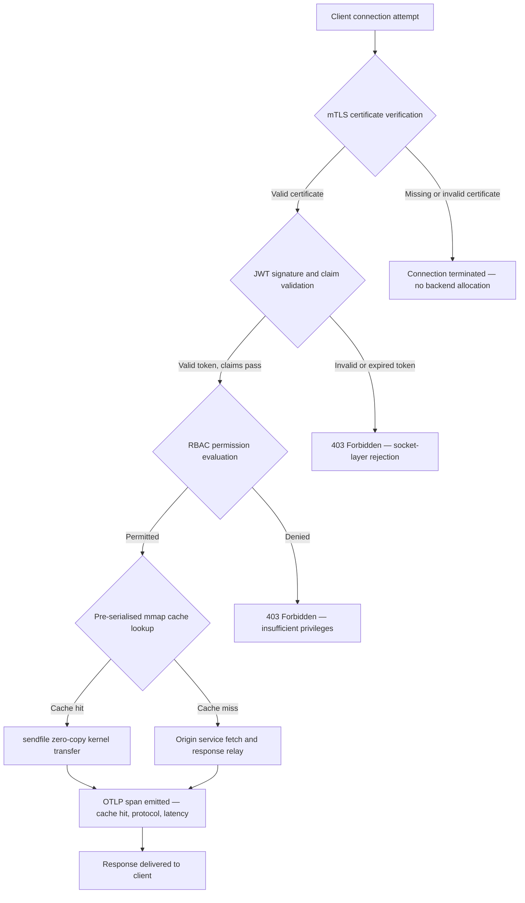

---

# Front Matter (YAML)

author: "contact@sebastienrousseau.com (Sebastien Rousseau)"
banner_alt: "Abstrakt nattlig stadsvy på ett kretskort — visualiserar bankens edge där zero-copy-överföringar på kärnnivå, mTLS-handskakningar och JWT-validering sammanstrålar i ett enda statiskt länkat binärt program"
banner_height: "1597"
banner_width: "2584"
banner: "https://cloudcdn.pro/stocks/images/bit-cloud-GlqbGLCPnQ4.webp"
cdn: "https://cloudcdn.pro"
charset: "UTF-8"
cname: "sebastienrousseau.com"
copyright: "© Copyright 2025 - 2026 - Sebastien Rousseau. All rights reserved."
date: "June 20, 2026"
description: "http-handle är ett statiskt länkat Rust-binärprogram som levererar 180 000 förfrågningar per sekund vid bankens edge med noll körtidsberoenden, integrerad mTLS- och JWT-validering, ALPN-förhandlad HTTP/2 och HTTP/3 samt OTLP-observabilitet — och stänger de säkerhets- och motståndskraftsluckor som Nginx och Envoy lämnar öppna."
format-detection: "telephone=no"
hreflang: "sv"
icon: "https://cloudcdn.pro/clients/sebastienrousseau/v1/logos/sebastienrousseau.svg"
id: "https://sebastienrousseau.com/2026-06-20-http-handle-zero-dependency-edge-ingress-banking-rust-2026"
image_alt: "Svartvitt porträtt av Sebastien Rousseau"
image_height: "162"
image_width: "162"
image: "https://cloudcdn.pro/stocks/images/sebastienrousseau.webp"
keywords: "http-handle, Rust edge-ingress, beroenderfri proxy, bankinfrastruktur, mTLS JWT, sendfile zero-copy, ALPN HTTP3, DORA-efterlevnad, Basel III, OTLP-observabilitet, statiskt binärprogram, ARM64 banking, zero trust banking, lätt ingress, Rust-banksäkerhet"
language: "sv-SE"
last_reviewed: "2026-06-20"
layout: "report"
locale: "sv_SE"
logo_alt: "Logotyp för Sebastien Rousseau"
logo_height: "44"
logo_width: "44"
logo: "https://cloudcdn.pro/clients/sebastienrousseau/v1/logos/sebastienrousseau.svg"
menu: ""
measurementID: "G-169G4ET5HQ"
name: "Sebastien Rousseau"
permalink: "https://sebastienrousseau.com/2026-06-20-http-handle-zero-dependency-edge-ingress-banking-rust-2026"
rating: "general"
referrer: "no-referrer"
robots: "index, follow"
schema: "FAQPage, Article"
seo_title: "http-handle: Beroenderfri Rust-ingress för banking vid 180k förfr./s"
short_name: "sebastienrousseau"
subtitle: "Hur ett enda statiskt länkat Rust-binärprogram levererar 180 000 förfrågningar per sekund med mTLS, JWT och ALPN vid bankens edge — och vad det innebär för DORA- och Basel III-efterlevnad."
tags: "http-handle, Rust, banking, edge-ingress, mTLS, JWT, ALPN, HTTP3, DORA, Basel-III, zero-copy, sendfile, ARM64, zero-trust, OTLP, observability, open-source, infrastructure"
theme-color: "0, 83, 191"
title: "http-handle: Högpresterande, Beroenderfri Edge-ingress för Banking 2026"
url: "https://sebastienrousseau.com/2026-06-20-http-handle-zero-dependency-edge-ingress-banking-rust-2026"
viewport: "width=device-width, initial-scale=1, shrink-to-fit=no"

# RSS - The RSS feed front matter (YAML).
atom_link: "https://sebastienrousseau.com/2026-06-20-http-handle-zero-dependency-edge-ingress-banking-rust-2026/rss.xml"
category: "Technology"
docs: https://validator.w3.org/feed/docs/rss2.html
generator: "Static Site Generator (SSG) (version 0.0.40)"
item_description: "http-handle är ett statiskt länkat Rust-binärprogram som levererar 180 000 förfrågningar per sekund vid bankens edge med noll körtidsberoenden, integrerad mTLS- och JWT-validering, ALPN-förhandlad HTTP/2 och HTTP/3 samt OTLP-observabilitet — och stänger de säkerhets- och motståndskraftsluckor som Nginx och Envoy lämnar öppna."
item_guid: "https://sebastienrousseau.com/2026-06-20-http-handle-zero-dependency-edge-ingress-banking-rust-2026/rss.xml"
item_link: "https://sebastienrousseau.com/2026-06-20-http-handle-zero-dependency-edge-ingress-banking-rust-2026/rss.xml"
item_pub_date: "Sat, 20 Jun 2026 07:07:07 +0000"
item_title: "http-handle: Högpresterande, Beroenderfri Edge-ingress för Banking 2026"
last_build_date: "Sat, 20 Jun 2026 07:07:07 +0000"
managing_editor: "contact@sebastienrousseau.com (Sebastien Rousseau)"
pub_date: "Sat, 20 Jun 2026 07:07:07 +0000"
ttl: "60"
type: "article"
webmaster: "contact@sebastienrousseau.com"

# Apple - The Apple front matter (YAML).
apple_mobile_web_app_orientations: "portrait"
apple_touch_icon_sizes: "192x192"
apple-mobile-web-app-capable: "yes"
apple-mobile-web-app-status-bar-inset: "black"
apple-mobile-web-app-status-bar-style: "black-translucent"
apple-mobile-web-app-title: "Beroenderfri Bankedge"
apple-touch-fullscreen: "yes"

# MS Application - The MS Application front matter (YAML).

msapplication-navbutton-color: "0, 83, 191"

# Twitter Card - The Twitter Card front matter (YAML).

twitter_card: "summary_large_image"
twitter_creator: "@wwdseb"
twitter_description: "http-handle är ett statiskt länkat Rust-binärprogram som levererar 180 000 förfrågningar per sekund vid bankens edge med noll körtidsberoenden, mTLS, JWT och OTLP-observabilitet."
twitter_image: "https://cloudcdn.pro/clients/sebastienrousseau/v1/logos/sebastienrousseau.svg"
twitter_image_alt: "Logo of Sebastien Rousseau"
twitter_site: "@wwdseb"
twitter_title: "http-handle: Beroenderfri Rust-ingress för banking vid 180k förfr./s"
twitter_url: "https://sebastienrousseau.com/2026-06-20-http-handle-zero-dependency-edge-ingress-banking-rust-2026"

# Humans.txt - The Humans.txt front matter (YAML).
author_website: "https://sebastienrousseau.com"
author_twitter: "@wwdseb"
author_location: "London, UK"
thanks: "Thanks for reading!"
site_last_updated: "2026-06-20"
site_standards: "HTML5, CSS3, RSS, Atom, JSON, XML, YAML, Markdown, TOML"
site_components: "Kaishi, Kaishi Builder, Kaishi CLI, Kaishi Templates, Kaishi Themes"
site_software: "Static Site Generator, Rust"

---

# http-handle: Högpresterande, Beroenderfri Edge-ingress för Banking 2026

<!-- lead-start -->
<aside class="post-lead" aria-label="Artikelsammanfattning">

<strong>TL;DR.</strong> http-handle är ett öppen källkod, statiskt länkat Rust-binärprogram som ersätter Nginx och Envoy vid bankens edge. Det levererar 180 000 förfrågningar per sekund på ARM64-noder via Linux <code>sendfile(2)</code> zero-copy-överföringar, tillämpar mTLS och JWT-validering på nätverkssocketlagret innan någon applikationskod körs, förhandlar automatiskt HTTP/2 och HTTP/3 via ALPN och emitterar OpenTelemetry-mätvärden inbyggt — allt med noll körtidsberoenden utöver <code>libc</code>.

<strong>Viktiga slutsatser</strong>

<ul class="post-lead-takeaways">
  <li><strong>Problemet med tunga proxies.</strong> Nginx och Envoy bär beroendeträd som utvidgar CVE-ytan och komplicerar DORA ICT-riskremedieringscykler.</li>
  <li><strong>Zero-copy-prestanda i stor skala.</strong> Förserializerade mmap-cacheblock och <code>sendfile(2)</code> kärnöverföringar upprätthåller 180 000 förfr./s på ARM64 med under en millisekunds proxy-overhead.</li>
  <li><strong>Säkerhet på socketen, inte applikationen.</strong> mTLS-klientcertifikatverifiering, JWT-validering och RBAC-utvärdering slutförs innan någon backend-resurs tilldelas förfrågan.</li>
  <li><strong>Inbyggd regelverksanpassning.</strong> Den reducerade attackytan och den revisionsbara distributionen med ett enda binärprogram adresserar direkt DORA artiklarna 5 och 6, Basel III operationell risk och SM&CR-ansvarsskedjor.</li>
</ul>

<strong>Relaterad läsning:</strong> <a href="https://sebastienrousseau.com/2026-06-18-noyalib-safe-yaml-rust-ai-mcp-financial-infrastructure-2026">Varför YAML Behöver en Säkrare Rust-stack för AI, MCP och Finansiell Infrastruktur 2026</a>, <a href="https://sebastienrousseau.com/2026-06-11-cloudcdn-open-source-blueprint-ai-native-edge-2026">CloudCDN: En Open-Source Blueprint för den AI-Nativa Edgen 2026</a>, <a href="https://sebastienrousseau.com/2026-05-16-best-cloud-infrastructure-architecture-2026">Bästa Molninfrastrukturarkitektur för Banker och Finansiella Institutioner 2026</a>.

</aside>
<!-- lead-end -->

Bankens edge har ett beroendeproblem. Varje Nginx- eller Envoy-instans som dirigerar trafik mellan en klient och en kärnbankstjänst bär ett beroendeträd: OpenSSL-byggen, Lua-moduler, gRPC-bibliotek och containerlager — vart och ett ett potentiellt CVE, vart och ett som kräver en dedikerad patchningscykel, vart och ett som lägger till latensvariation som komplicerar SLA-mätning. Under [Digital Operational Resilience Act (DORA)](https://eur-lex.europa.eu/eli/reg/2022/2554/oj) är den komplexiteten nu en regulatorisk skyldighet lika mycket som en operationell.

[http-handle](https://github.com/sebastienrousseau/http-handle) tar ett annat tillvägagångssätt. Det är ett enda, statiskt länkat Rust-binärprogram med noll körtidsberoenden utöver `libc`. Det levererar 180 000 förfrågningar per sekund på ARM64-noder, tillämpar ömsesidig TLS och JWT-autentisering på nätverkssocketlagret och förhandlar automatiskt HTTP/2 och HTTP/3 — allt inom en distributionsfotavtryck under 20 MB RAM.

## Snabbt svar

**Vad är http-handle i en mening?** http-handle är ett öppen källkod, statiskt länkat Rust-binärprogram som ersätter tunga proxycontainrar vid bankens edge, levererar 180 000 förfr./s på ARM64 via Linux `sendfile(2)` zero-copy-kärnöverföringar, tillämpar mTLS, JWT och RBAC på socketlagret innan någon backend-resurs berörs och emitterar inbyggda [OpenTelemetry](https://opentelemetry.io/)-mätvärden — med noll körtidsbiblioteksberoenden utöver `libc`.

## Sammanfattning för ledningen

Banker har använt Nginx och Envoy vid sin edge i ett decennium. Båda är kompetenta; ingen av dem designades för det regulatoriska miljön 2026. Beroendebemängda containerbilder genererar CVE-köer som efterlevnadsteam inte kan rensa tillräckligt snabbt, och varje biblioteksversionsuppgradering bär regressionsrisk. DORA artiklarna 5 och 6 kräver att ICT-risk hanteras genom design, inte korrigeras efter upptäckt. Basel III operationella riskramverk straffar arkitekturer där felningspunkter multipliceras med systemkomplexitet.

http-handle eliminerar beroendeproblemet vid källan. Binärprogrammet kompileras en gång, statiskt, utan externa bibliotekskrav vid körtid. Attackytan krymper till Rust-standardbiblioteket plus `libc`. Säkerhetstillämpning — mTLS-certifikatverifiering, JWT-anspråksvalidering och rollbaserad åtkomstkontroll — körs på nätverkssocketen innan någon backend-tilldelning, kollapsande Zero Trust-perimetern till dess minsta möjliga uttryck. Prestanda följer av arkitekturen: förserializerade minnesmappade cacheblock kombinerade med `sendfile(2)` kärnöverföringar tar bort data från CPU-till-minne-kopia-sökvägen helt, och upprätthåller 180 000 förfr./s på ARM64-hårdvara. Resultatet är ett ingresslager som uppfyller DORA-motståndskraftskrav, stöder Basel III operationella riskreduceringsargument och ger seniora IT-ledare under SM&CR en verifierbar, en-komponents ansvarsskedja för edge-infrastruktur.

## Viktiga slutsatser

- **Mindre binärprogram, mindre CVE-köer.** Ett enda statiskt länkat binärprogram har ett paket att korrigera, en release att validera och ett artefakt att revidera. Nginx med en standardmoduluppsättning levereras med mer än 30 delade biblioteksberoenden; vart och ett bär sin egen sårbarhetscykel.
- **Zero-copy är inte en optimering — det är en designbegränsning.** Vid 180 000 förfr./s introducerar all datakopiering i användarutrymmet mätbar latensvariation. `sendfile(2)` överför filbeskrivningsinnehåll till nätverkssocketen helt i kärnutrymmet. Kombinerat med mmap-förankrade svarscacheblock berör CPU:n aldrig datasökvägen för cachade svar.
- **Säkerhetsperimetern tillhör socketen.** Att validera JWT:er och mTLS-certifikat i applikationsmjukvaran innebär att backend redan har tilldelat trådar och minne innan förfrågan avvisas. Socketlagervalidering säkerställer att oautentiserade förfrågningar inte förbrukar några backend-resurser alls.
- **OTLP eliminerar observabilitetsgapet.** Inbyggd OpenTelemetry-integration innebär att varje förfrågan, varje autentiseringsbeslut och varje protokollförhandling producerar strukturerad telemetri utan en sidecar-agent. Befintliga bankdashboards tar emot OTLP-spår direkt.

**Relaterad läsning:** [Varför YAML Behöver en Säkrare Rust-stack för AI, MCP och Finansiell Infrastruktur 2026](https://sebastienrousseau.com/2026-06-18-noyalib-safe-yaml-rust-ai-mcp-financial-infrastructure-2026/), [CloudCDN: En Open-Source Blueprint för den AI-Nativa Edgen 2026](https://sebastienrousseau.com/2026-06-11-cloudcdn-open-source-blueprint-ai-native-edge-2026/), [Bästa Molninfrastrukturarkitektur för Banker och Finansiella Institutioner 2026](https://sebastienrousseau.com/2026-05-16-best-cloud-infrastructure-architecture-2026/).

## 01. Problemet med Tunga Proxies i Banking

Nginx och Envoy byggde den moderna internets edge. De är konfigurerbara, stridstestad och stödda av stora gemenskaper. De är också arkitektoniska val som gjordes innan DORA existerade, innan Basel III operationella riskramverk krävde kvantifierbar komplexitetsminskning och innan ARM64-molnnoder förändrade ekonomin för högkapacitetsberäkning.

Den praktiska konsekvensen är ett gap mellan vad banker behöver och vad tunga proxycontainrar levererar.

**Beroendeyta.** En standard Envoy-distribution drar in OpenSSL, Abseil, Protobuf, gRPC, Lua och dussintals sekundära bibliotek. Vart och ett bär en oberoende CVE-livscykel. När National Vulnerability Database publicerar ett kritiskt OpenSSL-råd blir varje Envoy-instans i egendomen ett efterlevnadsklocka: bedöm, korrigera, testa, omdistribuera och omcertifiera — i varje miljö där binärprogrammet körs. Under DORA Artikel 6 måste banker demonstrera att ICT-riskhanteringsprocesser är proportionella, dokumenterade och verifierbara. Ett flerbiblioteksberoenderträd gör den demonstrationen dyr att underhålla.

**Minnesoverhead.** En minimalt konfigurerad Nginx-arbetsprocess förbrukar 40–80 MB residentminne under måttlig belastning. I stor skala — hundratals ingressnoder över handelssystem, betalnings-API:er och kundvända portaler — ackumuleras den overhead till en mätbar infrastrukturkostnad utan motsvarande prestandafördelar gentemot ett välkonstruerat enbinäralternativ.

**Korrigeringshastighet.** Containerimage-leveranskedjor introducerar flerdigars fördröjning mellan en CVE-publikation och en validerad korrigering som når produktion. Basbilden måste återbyggas, applikationslagret re-lagers, hela testmatrisen re-köras och distributionspipeline re-exekveras. För kritiska banksystem som verkar under DORA-incidentrapporteringsfönster är denna cykel en strukturell risk.

http-handle adresserar alla tre. Ett binärprogram. En CVE-yta. Ett artefakt att korrigera. Under 20 MB RAM för en produktionsingressnod.

## 02. http-handle 2026 Arkitekturlinsen

Binärprogrammet är strukturerat som fem ömsesidigt beroende lager, vart och ett utformat för att eliminera en specifik riskkategori som traditionella proxyarkitekturer ackumulerar.

### Tabell 1: http-handle arkitektlager och riskminskning

| Lager | Designbeslut | Varför det spelar roll | Risk vid felhantering |
| ---- | ---- | ---- | ---- |
| **Serverkärna** | Enskilt Rust-binärprogram, statiskt länkat, noll beroenden utöver `libc` | Ett artefakt att korrigera; eliminerar biblioteks-CVE-spridning över egendomen | Dependency confusion-attacker; bibliotekssårbarhetsackumulering |
| **Accelerationsmotor** | Förserializerade mmap-cacheblock och `sendfile(2)` zero-copy-kärnöverföringar | 180 000 förfr./s på ARM64 med under en millisekunds proxy-overhead; ingen data träder in i användarutrymmet för cachade svar | Minnesmappningsläckor; kärnutrymmesbottlenecks vid cacheinvalidering |
| **Kryptografisk säkerhet** | Inbyggd mTLS med hot-reload-certifikatstöd och ALPN-förhandling | Garanterar dataintegritet och protokollkompatibilitet; certifikatrotation utan tappade anslutningar | Certifikatutgång som orsakar serviceavbrott; svaga chiffersvitsstandarder |
| **Åtkomstpolicyplan** | Socket-lager JWT-validering och RBAC-anspråksutvärdering | Oautentiserade förfrågningar förbrukar inga backend-resurser; Zero Trust tillämpas vid kärnans gräns | JWT-algoritmförvirningsattacker; RBAC-felkonfiguration som ger för vid åtkomst |
| **Observabilitet** | Inbyggd [OpenTelemetry (OTLP)](https://opentelemetry.io/docs/specs/otlp/) integration | Strukturerad telemetri utan sidecar-agenter; direktinmatning i befintliga bankövervakningsegendom | Blinda fläckar under avbrott; ofullständiga revisionsspår för DORA-incidentrapportering |

## 03. Viktiga Prestanda- och Säkerhetssignaler

Banker som driver http-handle vid edgen måste instrumentera fem kvantifierbara signaler för att uppfylla DORA operationella rapporteringskrav och intern SLA-styrning.

### Tabell 2: Operationella riktmärken och regulatoriska referenser

| Signal | Riktmärke | Regulatorisk referens | Teknisk implementering |
| ---- | ---- | ---- | ---- |
| **Genomströmning** | ≥ 180 000 förfr./s på ARM64-noder vid P99 ≤ 1 ms proxy-overhead | Basel III operationell risk — systemkomplexitetsminskning | `sendfile(2)` + förserializerade mmap-cacheblock; ingen användarutrymmes-datakopia för cacheträffar |
| **Attackyta** | Noll körtidsbiblioteksberoenden; ett binärt artefakt per release | [DORA Artikel 6](https://eur-lex.europa.eu/eli/reg/2022/2554/oj) — ICT-riskhantering genom design | Statisk kompilering med `cargo build --release --target aarch64-unknown-linux-musl` |
| **Autentiseringsfördröjning** | mTLS-handskakning + JWT-validering slutförd innan första byte av backend-svar | [DORA Artikel 5](https://eur-lex.europa.eu/eli/reg/2022/2554/oj) — ICT-säkerhetsskydd | Socketlageravlyssning; JWT-anspråksutvärdering i kärnnära Rust innan backend-dirigering |
| **Certifikattillgänglighet** | Hot-reload av mTLS-certifikat med noll tappade anslutningar under rotation | SM&CR senior management-ansvar för edge-tillgänglighet | inotify-driven certifikatbevakare; atomär filbeskrivningsbytt under reload |
| **Observabilitetstäckning** | 100% av förfrågningar som producerar OTLP-spänner med autentiseringsresultat, protokollversion och cachestatus | DORA Artikel 17 — incidentdetektering och -rapportering | Inbyggd OTLP-exportör; ingen sidecar krävs; gRPC eller HTTP/Protobuf-transport konfigurerbar |

## 04. Zero-Copy-motorn: mmap och sendfile(2)

Nätverksprestanda inom högfrekvent banking — realtidsbetalningar, marknadsdataAPI:er, autentiseringstokentjänster — begränsas av en begränsning mer än någon annan: kostnaden för att flytta bytes från lagring till nätverkssocketen.

Konventionella HTTP-servrar läser filinnehåll till en användarutrymmebuffer och skriver sedan den bufferten till socketen. Den sekvensen kräver två minneskopiningar och två kontextbyten mellan användarutrymme och kärnutrymme för varje svar. Vid 180 000 förfrågningar per sekund är den ackumulerade overhead substantiell.

http-handle eliminerar båda kopiorna.

**Minnesmappade cacheblock.** När tjänsten startar serialiserar den statiskt svarsinnehåll till minnesmappade regioner med `mmap(2)`. Dessa regioner är förankrade i kärnans sidcache. När en förfrågan anländer för en cachad resurs är svaret redan mappat i kärnminne — ingen diskläsning, ingen bufferallokering.

**`sendfile(2)` kärnöverföring.** Linux-systemanropet `sendfile(2)` överför data direkt från en filbeskrivning — eller en minnesmappad region — till en nätverkssocket-filbeskrivning, helt inom kärnan. Ingen byte träder in i användarutrymmet. CPU:ns roll reduceras till att utfärda systemanropet och hantera slutförelsehändelsen. På ARM64-noder med denna arkitektur upprätthåller http-handle 180 000 förfr./s vid under en millisekunds proxy-overhead under ihållande belastning.

För banker som kör månadsslutsbatchavstämning, inträdesdagslikviditetsrapportering eller realtidsbedrägeriscorings-API-trafik är den tekniska konsekvensen direkt: färre ARM64-noder per trafiklager, lägre infrastrukturkostnader och mindre DORA-motståndskraftsrisk från kapacitetsbrist.

## 05. mTLS och JWT Åtkomstpolicysplanet

Inom banking är autentisering vid edgen inte en funktion — det är ett regulatoriskt krav. DORA kräver att ICT-säkerhetskontroller är proportionella, dokumenterade och verifierbara. SM&CR lägger personligt ansvar för infrastruktursäkerhetsbeslut på namngivna seniora chefer. Frågan är inte om man ska autentisera vid edgen, utan på vilket lager.

http-handle tillämpar en trestegad Zero Trust-policy innan någon backend-resurs allokeras.

**Steg 1: mTLS-klientcertifikatverifiering.** Under TLS-handskakningenrequests och validerar http-handle klientcertifikatet mot ett konfigurerbart förtroendelager. Anslutningar utan ett giltigt certifikat avslutas vid handskakningen. Ingen applikationstråd skapas, ingen minnespol allokeras. Backend ser aldrig förfrågan.

**Steg 2: JWT-anspråksvalidering.** För anslutningar som passerar mTLS extraherar och validerar http-handle JSON Web Token från `Authorization`-headern på socketlagret. Signaturverifiering, utgångsdatumkontroller och utfärdarvalidering sker innan förfrågan når dirigeringslagret. Algoritmförvirningsattacker — där en server accepterar en symmetrisk algoritm när en asymmetrisk nyckel förväntas — blockeras av explicit algoritm-tillståndslistning i konfigurationen.

**Steg 3: RBAC-anspråksutvärdering.** Validerade JWT-anspråk mappas till en minnesintern rolltabell. Förfrågningar med otillräckliga behörigheter får ett 403-svar på åtkomstpolicysplanet. Backend-tjänsten anropas aldrig för obehörig trafik.

Denna sekvensering spelar operationell roll. Under den traditionella modellen — där autentisering körs i applikationsmjukvara — kan en angripare tömma backend-trådpooler med oautentiserade förfrågningar innan ett enda avslag utfärdas. Socket-lagerauthentisering kollapserar den attackvektorn helt.

## 06. ALPN-dirigering och HTTP/3-fallbackkedjan

Banktrafik anländer under diverse nätverksförhållanden: företagsfiber för handelskontoren, 5G för mobilbankklienter, satellitkonnektivitet för fjärroperationer och TLS-inspektionsproxies i reglerade miljöer. En enda-protokoll ingress skapar en lägsta gemensamma nämnare-begränsning.

http-handle använder [Application-Layer Protocol Negotiation (ALPN)](https://www.rfc-editor.org/rfc/rfc7301) för att automatiskt välja det optimala protokollet för varje anslutning.

**HTTP/2** är standard för webbläsar- och API-trafik över TCP. Multiplexade strömmar över en enda anslutning eliminerar head-of-line-blockeringen som HTTP/1.1 introducerar under samtida förfrågemönster.

**HTTP/3 (QUIC)** aktiveras när nätverket stöder UDP och klienten annonserar `h3` i sin ALPN-extension. QUICs oberoende strömmultiplexering och anslutningsmigrering gör det materiellt bättre för mobilbankklienter på trängda mobilnätverk där TCP-anslutningar tappar och återansluter ofta.

**Graciös fallback.** Om ALPN-förhandling misslyckas — för att ett mellanliggande ombud tar bort extensionen eller en äldre klient utelämnar det — faller http-handle tillbaka till HTTP/1.1 medan alla säkerhetsheaders, mTLS-tillämpning och JWT-validering upprätthålls. Ingen säkerhetsegenskap försämras under protokollfallback.

## 07. Zero-Copy Förfrågelivscykeln

Följande diagram visar den fullständiga förfrågesökvägen från klientanslutning till svarleverans, inklusive autentiseringsgrindarna och observabilitetsutsändningspunkterna.

Den kritiska sökvägen för cacheträffssvar passerar tre säkerhetsgrinder och ett systemanrop. Ingen användarutrymmesbuffer allokeras för svarskroppen. OTLP-spännet fångar autentiseringsresultatet, den ALPN-förhandlade protokollversionen, cachestatusen och end-to-end-fördröjningen i en enda strukturerad post.

## 08. Regelverksanpassning: DORA, Basel III och SM&CR

### DORA Artiklarna 5 och 6 — ICT-riskhantering och skydd

[DORA Artikel 5](https://eur-lex.europa.eu/eli/reg/2022/2554/oj) kräver att finansiella enheter upprätthåller ICT-riskhanteringsramar. Artikel 6 kräver att de implementerar skydds- och förebyggandeåtgärder proportionella till riskprofilen för deras ICT-system.

Ett enda statiskt länkat binärprogram uppfyller båda kraven mer effektivt än en flerbibliotekscontainerstack. Attackytan är kvantifierbar — ett artefakt, ett beroende (`libc`), en CVE-yta — och skyddsåtgärderna är strukturella snarare än procedurella: mTLS och JWT-tillämpning kan inte kringgås av felkonfiguration eftersom de körs på socketlagret innan någon konfigurerbar applikationslogik körs.

### Basel III — Kapitalkrav för operationell risk

[Basel III:s operationella riskramverk](https://www.bis.org/bcbs/basel3.htm) knyter regulatoriska kapitalkrav till demonstrerbar riskminskning. Banker som kan dokumentera en mätbar minskning av systemkomplexitet och ICT-felningspunktantal har ett kvantifierbart argument för minskad operationell riskkapitalallokering. Att ersätta ett flercontainer-proxyegendom med enbinäringressnoder är exakt den typ av komplexitetsminskning som stödjer detta argument — förutsatt att teknikteamet kan producera attesteringsdokumentationen.

http-handles revisionsbara releaseartefakter — reproducerbara byggen, SBOM-kompatibla beroendemanifest och OTLP-baserade operationsloggar — stödjer dokumentationskedjan som Basel III-kapitaldiskussioner kräver.

### SM&CR — Senior manager-ansvar

[Senior Managers and Certification Regime (SM&CR)](https://www.fca.org.uk/firms/senior-managers-certification-regime) lägger personligt ansvar på namngivna seniora chefer för ICT-säkerhetsläget hos system under deras ansvar. En enbinäringressnod som hot-laddar om certifikat utan serviceavbrott, producerar strukturerade revisionsloggar via OTLP och har ett versionspinnat artefakt per distribution ger den namngivna seniora chefen en verifierbar, dokumenterbar säkerhetskedja. En flerbibliotekscontainerstack gör det inte.

## 09. Vad Detta Innebär per Roll

### Styrelse och verkställande direktörer

Regulatorisk kapitaloptimering under Basel III operationella riskramverk beror på demonstrerbar komplexitetsminskning. Att ersätta Nginx eller Envoy med ett enda statiskt länkat binärprogram minskar ICT-felningspunktantalet på ett sätt som är reviderbart och presentabelt för tillsynsmyndigheter. Reducerad CVE-yta stöder också omförhandling av cyberförsäkringspremier — försäkringsgivare prissätter baserat på demonstrerbara attackytemetriker, och ett enberoende-ingressbinärprogram är en konkret datapunkt.

### Chief Information Security Officers och Chief Risk Officers

DORA-efterlevnad kräver att ICT-skyddsåtgärder är proportionella och verifierbara. Socket-lager mTLS och JWT-tillämpning ger en verifierbar, icke-kringgångbar autentiseringsgrind vid edgen. Hot-reload-certifikatrotation eliminerar tjänstfönsterrisken som traditionella certifikatuppdateringar bär. Nollberoendecompileringmodellen innebär att när ett kritiskt `libc`-råd publiceras kan hela egendomen återbyggas, testas och omdistribueras från ett enda Rust-källartefakt på timmar snarare än dagar.

### Teknik och IT-ledning

180 000 förfr./s på en standard ARM64-nod förändrar infrastrukturstorlekskonversationen för betalnings-API:er och autentiseringstjänster. Inbyggd OTLP-integration tar bort behovet av Prometheus-exportörer, sidecar-agenter eller anpassade loggavsändare. Kubernetes-distributionsmodellen är en standard-pod — under 20 MB RAM, inga privilegierade containerbehörigheter, ingen värdnätverksåtkomst. Certifikat hot-reload fungerar utan Kubernetes rullande omstarts-overhead.

## FAQ

**Hur hanterar http-handle certifikatrotation under belastning?**
Binärprogrammet övervakar certifikatfilsökvägar med en inotify-bevakare. När nya certifikat- och nyckelfiler detekteras utför det en atomär byte av den aktiva TLS-kontexten — befintliga anslutningar slutförs med det tidigare certifikatet medan nya anslutningar omedelbart använder det roterade. Ingen anslutning tappas. Inget tjänstfönster krävs.

**Kan http-handle köras inuti ett Kubernetes-kluster som en ingresskontroller?**
Ja. Binärprogrammet körs som en fristående pod med en standard ingresstjänstannotering. Resurskraven är under 20 MB RAM vid full genomströmning, utan privilegierade containerbehörigheter och utan krav på värdnätverksåtkomst. Det kan också köras som en sidecar i tjänstemesh där mTLS-tillämpning på sidecar-lagret föredras framför centraliserad gateway-autentisering.

**Vad är det mätbara svarstidsbidraget från själva proxyn?**
För cacheträffssvar är proxy-overhead — från socketacceptans till `sendfile(2)`-slutförande — under en millisekund på ARM64-hårdvara. För cachemisssvar som kräver upstream-hämtning är overhead samma under-en-millisekunds-siffra plus ursprungssvartiden. Proxyn själv lägger inte till köfördröjning eftersom autentisering sker synkront på socketlagret utan trådpoolallokering innan autentiseringsvalidering slutförs.

**Hur passar http-handle in i en Zero Trust-arkitektur bredvid en befintlig API-gateway?**
http-handle verkar vid OSI-lager 4/7-gränsen: det tillämpar transport-lager mTLS och validerar applikationslager-JWT:er innan dirigering till uppströmstjänster. Det kan sitta framför en full API-gateway — absorbera oautentiserad trafik innan den når gatewayens dyrare bearbetningslager — eller ersätta gatewayen helt för tjänster vars åtkomstpolicy är helt uttryckbar i JWT-anspråk.

**Är det binära resultatet reproducerbart för leveranskedjegranskningsändamål?**
Ja. Bygget är reproducerbart med en fastnålad Rust-verktygkedjversion och låst `Cargo.lock`. SBOM-generering via `cargo cyclonedx` producerar en CycloneDX-kompatibel materiallista för varje release. Båda artefakterna kan publiceras till bankens interna programvarusammansättningsanalysverktygskedja och uppfyller DORA leveranskedjeriskdokumentationskrav.

## Slutsats

Bankens edge behöver inte fler funktioner — det behöver färre komponenter, var och en gör mindre och gör det verifierbart. http-handle reducerar ingresslagret till dess irreducerbara minimum: ett enda Rust-binärprogram som tillämpar autentisering vid socketen, överför data utan att kopiera den och rapporterar allt det gör i strukturerad telemetri. För banker som navigerar DORA-efterlevnadstidslinjer, Basel III-kapitaloptimeringsgranskheter och SM&CR-ansvarskrav är den enkelheten inte en teknisk preferens — det är ett regulatoriskt argument.

[http-handle-källkoden](https://github.com/sebastienrousseau/http-handle) är tillgänglig under MIT och Apache 2.0-dubbellicens.

---

*Referenser*

Basel Committee on Banking Supervision (2011). *Basel III: A global regulatory framework for more resilient banks and banking systems*. Bank for International Settlements. Available at: [https://www.bis.org/publ/bcbs189.htm](https://www.bis.org/publ/bcbs189.htm)

European Parliament and Council (2022). Regulation (EU) 2022/2554 on digital operational resilience for the financial sector (DORA). Available at: [https://eur-lex.europa.eu/legal-content/EN/TXT/?uri=CELEX:32022R2554](https://eur-lex.europa.eu/legal-content/EN/TXT/?uri=CELEX:32022R2554)

Financial Conduct Authority (2015). *Senior Managers and Certification Regime (SM&CR)*. Available at: [https://www.fca.org.uk/firms/senior-managers-certification-regime](https://www.fca.org.uk/firms/senior-managers-certification-regime)

Internet Engineering Task Force (2014). *RFC 7301: Transport Layer Security (TLS) Application-Layer Protocol Negotiation Extension*. Available at: [https://www.rfc-editor.org/rfc/rfc7301](https://www.rfc-editor.org/rfc/rfc7301)

OpenTelemetry Authors (2024). *OpenTelemetry Protocol Specification (OTLP)*. Available at: [https://opentelemetry.io/docs/specs/otlp/](https://opentelemetry.io/docs/specs/otlp/)
