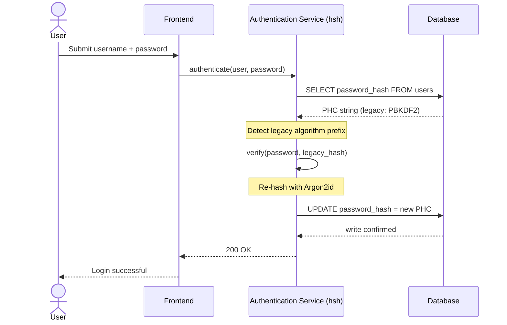
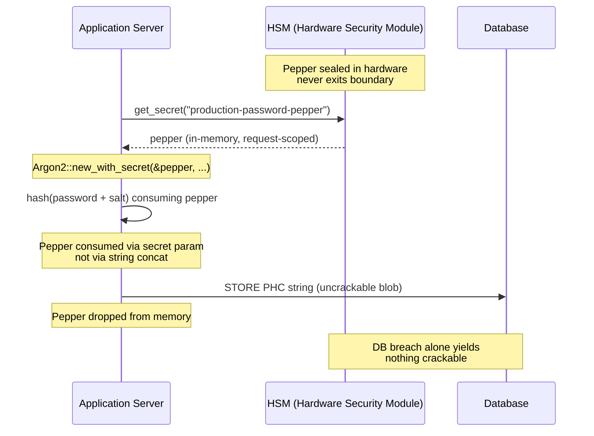

---
# Front Matter (YAML)
author: "contact@sebastienrousseau.com (Sebastien Rousseau)"
banner_alt: "Närbild på en utvecklarterminal som rullar Rust-kompilatorns utdata — den synliga disciplinen i ett minnessäkert, granskningsbart kryptografiskt substrat under ett företagsbankens autentiseringsbestånd"
banner_height: "1597"
banner_width: "2584"
banner: "https://cloudcdn.pro/stocks/images/rustlogs.webp"
cdn: "https://cloudcdn.pro"
charset: "UTF-8"
cname: "sebastienrousseau.com"
copyright: "© Copyright 2025 - 2026 - Sebastien Rousseau. All rights reserved."
date: "June 22, 2026"
description: "hsh är ett kryptografiskt ramverk i ren Rust som låter Tier 1-banker migrera äldre lösenordshashar till Argon2id utan driftstopp, med HSM-peppring och utan C-baserade FFI-minnessårbarheter — för att uppfylla DORA."
format-detection: "telephone=no"
hreflang: "sv"
icon: "https://cloudcdn.pro/clients/sebastienrousseau/v1/logos/sebastienrousseau.svg"
id: "https://sebastienrousseau.com/2026-06-22-hsh-zero-downtime-cryptographic-stewardship-rust-banking-2026"
image_alt: "Svartvitt porträtt av Sebastien Rousseau"
image_height: "162"
image_width: "162"
image: "https://cloudcdn.pro/stocks/images/sebastienrousseau.webp"
keywords: "hsh, Rust-kryptografi, lösenordshashning, Argon2id, banksäkerhet, HSM-interlock, DORA-efterlevnad, Basel III, migration utan driftstopp, minnessäkerhet, PBKDF2, scrypt, cyberåterställning"
language: "sv-SE"
last_reviewed: "2026-06-22"
layout: "report"
locale: "sv_SE"
logo_alt: "Logotyp för Sebastien Rousseau"
logo_height: "44"
logo_width: "44"
logo: "https://cloudcdn.pro/clients/sebastienrousseau/v1/logos/sebastienrousseau.svg"
measurementID: "G-169G4ET5HQ"
name: "Sebastien Rousseau"
permalink: "https://sebastienrousseau.com/2026-06-22-hsh-zero-downtime-cryptographic-stewardship-rust-banking-2026"
rating: "general"
referrer: "no-referrer"
robots: "index, follow"
schema: "FAQPage, Article"
seo_title: "hsh: kryptografisk förvaltning i Rust utan driftstopp för bank"
short_name: "sebastienrousseau"
subtitle: "Hur ett kryptografiskt ramverk i ren Rust gör att banker sömlöst kan uppgradera äldre lösenord till Argon2id med HSM-interlock — och vad det betyder för DORA- och Basel III-efterlevnad."
tags: "hsh, Rust, bank, kryptografi, Argon2id, HSM, DORA, Basel-III, säkerhet, öppen källkod, operativ motståndskraft"
theme-color: "0, 83, 191"
title: "Säkra lösenordshantering i företagsbank: multialgoritmhashning och uppgraderingar med hsh"
url: "https://sebastienrousseau.com/2026-06-22-hsh-zero-downtime-cryptographic-stewardship-rust-banking-2026"
viewport: "width=device-width, initial-scale=1, shrink-to-fit=no"

# RSS
atom_link: "https://sebastienrousseau.com/2026-06-22-hsh-zero-downtime-cryptographic-stewardship-rust-banking-2026/rss.xml"
category: "Technology"
generator: "Static Site Generator (SSG) (version 0.0.40)"
item_description: "hsh är ett kryptografiskt ramverk i ren Rust som låter Tier 1-banker migrera äldre lösenordshashar till Argon2id utan driftstopp, med HSM-peppring och utan C-baserade FFI-minnessårbarheter — för att uppfylla DORA."
item_pub_date: "Mon, 22 Jun 2026 07:07:07 +0000"
item_title: "Säkra lösenordshantering i företagsbank: multialgoritmhashning och uppgraderingar med hsh"
pub_date: "Mon, 22 Jun 2026 07:07:07 +0000"
type: "article"

# Twitter Card
twitter_card: "summary_large_image"
twitter_creator: "@wwdseb"
twitter_description: "hsh låter Tier 1-banker migrera äldre lösenordshashar till Argon2id utan driftstopp, med HSM-interlock och minnessäker Rust."
twitter_image: "https://cloudcdn.pro/clients/sebastienrousseau/v1/logos/sebastienrousseau.svg"
twitter_title: "hsh: kryptografisk förvaltning i Rust utan driftstopp"
twitter_url: "https://sebastienrousseau.com/2026-06-22-hsh-zero-downtime-cryptographic-stewardship-rust-banking-2026"

excerpt: "I en tid av GPU-accelererad dekryptering och DORA-mandat är kryptografisk röta en systemrisk. Varje äldre PBKDF2- eller scrypt-hash som vilar i en bankdatabas är en nedräkning mot kompromiss. hsh skiftar arbetssättet med minnessäkra uppgraderingar utan driftstopp..."

# Added by fix_hsh_frontmatter.py (template completeness)
apple_mobile_web_app_orientations: "portrait"
apple_touch_icon_sizes: "192x192"
apple-mobile-web-app-capable: "yes"
apple-mobile-web-app-status-bar-inset: "black"
apple-mobile-web-app-status-bar-style: "black-translucent"
apple-touch-fullscreen: "yes"
author_location: "London, United Kingdom"
author_twitter: "@wwdseb"
author_website: "https://sebastienrousseau.com"
docs: https://validator.w3.org/feed/docs/rss2.html
item_guid: "https://sebastienrousseau.com/2026-06-22-hsh-zero-downtime-cryptographic-stewardship-rust-banking-2026/rss.xml"
item_link: "https://sebastienrousseau.com/2026-06-22-hsh-zero-downtime-cryptographic-stewardship-rust-banking-2026/rss.xml"
last_build_date: "Mon, 22 Jun 2026 06:06:06 +0000"
managing_editor: "contact@sebastienrousseau.com (Sebastien Rousseau)"
menu: "active"
msapplication-navbutton-color: "0, 83, 191"
site_components: "Kaishi, Kaishi Builder, Kaishi CLI, Kaishi Templates, Kaishi Themes"
site_last_updated: "2023-07-05"
site_software: "Static Site Generator, Rust"
site_standards: "HTML5, CSS3, RSS, Atom, JSON, XML, YAML, Markdown, TOML"
ttl: "60"
twitter_site: "@wwdseb"
webmaster: "contact@sebastienrousseau.com"
apple-mobile-web-app-title: "hsh: Rust password hashing"
thanks: "Tack för att du läste!"
twitter_image_alt: "Svartvitt porträtt av Sebastien Rousseau"
---

# Säkra lösenordshantering i företagsbank: multialgoritmhashning och uppgraderingar med hsh

<!-- lead-start: manual -->
<aside class="post-lead" aria-label="Artikelsammanfattning">
<p class="post-lead-tldr"><strong>TL;DR.</strong> <a href="https://github.com/sebastienrousseau/hsh">hsh</a> är ett kryptografiskt ramverk i ren Rust och öppen källkod som låter Tier 1-banker migrera äldre lösenordshashar till moderna standarder som Argon2id utan ett enda avbrott i tjänsten. Genom HSM-baserad peppring och strikt minnessäkerhet utan C-baserade FFI-omslag stänger ramverket den kryptografiska röta som direkt hotar DORA- och Basel III-efterlevnaden.</p>
<p class="post-lead-heading"><strong>Viktiga slutsatser</strong></p>
<ul class="post-lead-takeaways">
  <li><strong>Problemet med kryptografisk röta.</strong> Äldre algoritmer som PBKDF2 försvagas exponentiellt när hårdvaran accelererar, vilket vidgar angreppsytan för credential stuffing och offline-brute force.</li>
  <li><strong>Migration utan driftstopp.</strong> Mönstret <code>verify_and_upgrade</code> hashar om användaruppgifter transparent vid vanliga inloggningar och eliminerar den operativa risken med massmigrationer i databasen.</li>
  <li><strong>Hårdvaru-interlock och peppring.</strong> Hashar omsluts via Hardware Security Modules (HSM) eller moln-KMS-arkitekturer, så att enbart ett databasintrång inte ger några knäckbara kandidatlösenord.</li>
  <li><strong>Minnessäkerhet som regulatorisk basnivå.</strong> Helt omskrivet i säker Rust och upprätthållet via strikt beroendehygien — hsh eliminerar buffertöverskridningar och leveranskedjerisker som finns i äldre C-baserade kryptobibliotek.</li>
</ul>
<p class="post-lead-related"><strong>Vidare läsning:</strong> <a href="https://sebastienrousseau.com/2026-06-20-http-handle-zero-dependency-edge-ingress-banking-rust-2026">http-handle: högpresterande edge-ingress utan beroenden för bank 2026</a>, <a href="https://sebastienrousseau.com/2026-06-07-autonomous-treasury-index-programmable-liquidity-tokenised-deposits-2026/index.html">Det autonoma treasury-indexet 2026</a>.</p>
</aside>
<!-- lead-end -->

> **Sammanfattning för ledningen.** Bankautentisering byggd mot en hotbild från 2018 är inte längre ändamålsenlig under 2026 års regulatoriska regim. GPU-accelererad knäckning, ASIC-täthet och den annalkande postkvanthorisonten har raserat säkerhetsmarginalen för PBKDF2 och tidiga scrypt-parametrar; DORA artikel 5 har förvandlat det förfallet till en ansvarsskuld inför styrelsen. hsh, ett ramverk i ren Rust med öppen källkod, åtgärdar problemet i tre lager parallellt: en `verify_and_upgrade`-dispatcher som hashar om en lagrad uppgift till aktuella Argon2id-parametrar vid varje lyckad inloggning utan underhållsfönster; ett HSM- eller KMS-interlockat peppringslager som gör att enbart ett databasintrång inte ger något knäckbart; och en minnessäker leveranskedja som eliminerar den FFI-angreppsyta som följer med C-baserade kryptobibliotek. Resultatet är ett substrat som uppfyller DORA, Basel III:s operativa riskdisciplin, SM&CR:s ansvar för seniora chefer och NIST IR 8547:s postkvantmigrationshorisont — utan den massåterställningskampanj som historiskt krävts för att uppgradera ett autentiseringsbestånd.

Merparten av autentiseringen i företagsbank vilar fortfarande på ett lösenordslager härdat mot en hotbild från 2018. Hårdvaran som bryter det har gått vidare. När GPU-farmar skalar och kryptografiskt relevanta kvantdatorer (CRQC) närmar sig, vittrar äldre hashning — PBKDF2, tidig scrypt — för varje timme av beräkning som angripare lägger i offline-knäckkön. Förfallet är tyst: ingenting i produktionsdatabasen säger att den hash som var stark i går inte längre är det.

Under [Digital Operational Resilience Act (DORA)](https://eur-lex.europa.eu/eli/reg/2022/2554/oj "Förordning (EU) 2022/2554 — Digital Operational Resilience Act") är det inte längre teknisk skuld att låta icke-roterade, äldre kryptografiska tillgångar ligga kvar i produktion. Det är namngiven regulatorisk ansvarsskuld.

[hsh](https://github.com/sebastienrousseau/hsh "hsh — ramverk för lösenordshashning i ren Rust") stänger gapet. Ramverket i ren Rust hanterar flera hashformat sida vid sida och uppgraderar svaga uppgifter under aktiva inloggningssessioner. Autentiseringsinfrastrukturen riktas in mot 2026 års motståndskraftsmandat utan underhållsfönster, utan tvångsåterställning och utan en enda sekunds driftstopp.

## 01. Problemet med kryptografisk röta i bank

För att förstå nödvändigheten av ett ramverk som hsh måste man förstå livscykeln för en lösenordshash. Algoritmer åldras inte med värdighet; de förfaller i takt med den hårdvara som finns tillgänglig för att bryta dem.

**ASIC/GPU-accelerationsgapet.** Algoritmer som PBKDF2 designades för att vara beräkningsdyra för CPU:er. I dag använder angripare massivt parallelliserade GPU:er för att exekvera offline-ordboksattacker. En äldre hash genererad 2018 är drastiskt mycket svagare mot en motståndare 2026.

**Risken med big bang-migration.** När en CISO bestämmer sig för att uppgradera från PBKDF2 till en minnesintensiv algoritm som Argon2id går det inte att vända hasharna för att kryptera om dem. Traditionella lösningar — att tvinga fram lösenordsåterställningar för flera miljoner användare — orsakar massiv kundfriktion och operativ risk.

**C-bibliotekens leveranskedja.** Historiskt har bankmellanvara förlitat sig på bibliotek som `argonautica` eller råa C-bindningar för hashning. Dessa bibliotek bär en dold leveranskedjerisk: en enda buffertöverskridning i autentiseringsmodulen kan leda till fjärrkörning av kod (RCE) i det mest privilegierade lagret i bankstacken.

### Algoritmjämförelse — hårdvarumotstånd och inställningsyta

De tre algoritmer en bank realistiskt möter i en migrationskorpus skiljer sig mindre i valet av kryptografisk primitiv och mer i hur de åldras under hårdvarutrycket. Tabellen nedan sammanfattar den praktiska hållningen.

| Algorithm | Memory-hard | GPU / ASIC resistance | Tuning surface | 2026 status |
| ---- | ---- | ---- | ---- | ---- |
| **PBKDF2** | Nej | Lågt — vektoriseras på GPU; under en millisekund per gissning på standardhårdvara. | Endast iterationsantal. | Äldre. Acceptabel enbart som reserv på verifieringssidan under migration. |
| **scrypt** | Ja (måttlig) | Medel — minneskostnaden besegrar enkla GPU-farmar; ASIC-amortiserbar i stor skala. | `N` (CPU/minne), `r` (blockstorlek), `p` (parallellism). | Avrådes för greenfield. Aktiv i migrationskorpora. |
| **Argon2id** | Ja (hög) | Högt — minnes- och tidshård; motstår sidokanaler och TMTO-attacker. | Minneskostnad (`m`), tidskostnad (`t`), parallellism (`p`), hemlighet (pepper). | Rekommenderad standard. OWASP, NIST SP 800-63B-4-utkast, FedRAMP. |

Slutsatsen för migrationsplanen är smal: PBKDF2 är ett *verifieringssidans* tillstånd, inte en *skrivsidans* destination. Varje lyckad inloggning mot en PBKDF2-post bör producera en Argon2id-post på vägen ut.

## 02. Arkitekturperspektivet hsh 2026

Ramverket är strukturerat över fem kärnlager, vart och ett konstruerat för att mildra en specifik kategori av operativ risk.

### Tabell 1: hsh:s arkitekturlager och riskbegränsning

| Lager | Designbeslut | Varför det spelar roll | Risk vid felhantering |
| ---- | ---- | ---- | ---- |
| **Kryptografiska primitiver** | Enhetligt PHC-strängformat som stöder Argon2id, scrypt och PBKDF2 | Ger förstklassigt motstånd mot GPU-attacker samtidigt som bakåtkompatibilitet bevaras. | Datasilon; svaga algoritmer som tillåter 100 miljarder+ gissningar/sekund offline. |
| **Policymotor** | Dispatch via `verify_and_upgrade` | Automatiserar övergången från äldre till moderna policyer dynamiskt vid inloggning. | Säkerhetsröta; aktiva användare som förblir på lätt knäckta äldre hashtyper. |
| **Hårdvaru-interlock** | HSM- och moln-KMS-kapacitet för peppring | Säkerställer att enbart ett databasintrång inte exponerar kandidatlösenord. | Offline-brute force som lyckas efter ett SQL-injektionsintrång. |
| **Säkerhetshygien** | Tillämpning av `deny.toml` och ren Rust | Blockerar osäker FFI och otillförlitliga externa C-beroenden helt. | Katastrofala leveranskedjeattacker och CVE:er kring minneskorruption. |

## 03. Rehash-flödet utan driftstopp

Mönstret `verify_and_upgrade` löser datamigration via ett intelligent, tillståndsmedvetet dispatchersystem som kräver noll driftstopp i databasen.

När en användare skickar in sina uppgifter läser hsh den lagrade PHC-strängen (Password Hashing Competition). Innehåller den en äldre hash (t.ex. en föråldrad PBKDF2-konfiguration) exekverar systemet följande flöde:

1. **Identifiering:** Tolkar den äldre algoritmen och dess specifika parametrar.
2. **Verifiering:** Validerar kandidatlösenordet mot den äldre hashen.
3. **Realtidsuppgradering:** Vid lyckad matchning tar systemet kandidatlösenordet i klartext i minnet och beräknar omedelbart en ny hash enligt den hårt säkrade Argon2id-policyn.
4. **Persistering:** Den nya PHC-strängen returneras till bankapplikationen, som skriver över den äldre posten i databasen.

Processen är helt transparent för slutanvändaren. Den migrerar effektivt de mest aktiva kontona till högsta säkerhetsnivå dag ett och minskar bankens angreppsyta organiskt och drastiskt över tid.

Sekvensen nedan visar vad som händer vid en enskild inloggningshändelse när den lagrade posten ligger på en äldre algoritm. Användaren ser ingen förändring; bankens autentiseringsbestånd förstärks med en post.



### Implementationsmönster — `verify_and_upgrade`-dispatch

Integrationsytan inne i en autentiseringstjänst är liten. Den äldre kodvägen ligger kvar som reserv; den nya kodvägen är dispatchern.

```rust
use hsh::{Hasher, UpgradeResult};

struct UserRecord {
    username: String,
    password_hash: String, // PHC string
}

async fn authenticate(user: UserRecord, password_attempt: &str) -> Result<bool, AuthError> {
    let hasher = Hasher::new();
    match hasher.verify_and_upgrade(password_attempt, &user.password_hash) {
        Ok(UpgradeResult::Verified(is_valid)) => Ok(is_valid),
        Ok(UpgradeResult::Upgraded(new_hash)) => {
            db::update_user_hash(&user.username, new_hash).await?;
            Ok(true)
        }
        Err(_) => Err(AuthError::InvalidCredentials),
    }
}
```

Tre egenskaper spelar roll:

- **Tillståndsmedvetenhet.** `verify_and_upgrade` inspekterar prefixet i PHC-strängen. Om algoritmmarkören är äldre triggar ramverket automatiskt en omhashning mot den konfigurerade Argon2id-policyn. Ingen grening i den anropande koden.
- **Atomicitet.** Omhashningen sker först efter att den äldre verifieringen lyckas, inom samma autentiseringshändelse. Inget separat batchjobb, inget schemalagt migrationsfönster och ingen destruktiv massmigration att rulla tillbaka.
- **Persistering.** Varianten `UpgradeResult::Upgraded` bär den nya PHC-strängen. Applikationen persisterar den genom samma dataväg som redan finns för den äldre posten — ingen parallell skrivyta, inget tvåfas-skrivprotokoll.

**Felfall.** Om databasskrivningen misslyckas eller KMS kortvarigt är onåbart under uppgraderingsskrivningen lyckas sessionen ändå mot den äldre hashen och posten ligger kvar på den gamla algoritmen. Nästa lyckade inloggning gör ett nytt försök till uppgradering. Det finns inget halvmigrerat tillstånd och inget användarsynligt fel — migrationen är monoton över inloggningshändelser, och per post-kostnaden för en misslyckad uppgradering är exakt ett extra försök vid nästa inloggning.

## 04. Peppade hashar via HSM/KMS-interlock

Standardhashning av lösenord skyddar mot direkta databasläckor, men om en angripare får tag på både databasen (hashar och salts) kan offline-knäckning exekveras.

hsh introducerar ett robust lager av "peppad" säkerhet. Genom integration med Hardware Security Modules (HSM) eller moln-KMS (Key Management Services) omsluts den slutliga Argon2id-utdatan kryptografiskt med en högentropi-nyckel som aldrig lämnar den säkra hårdvarugränsen. Om användardatabasen exfiltreras har angriparen endast krypterade datablock. Lösenordsknäckning kan inte påbörjas utan att också bryta sig in i bankens fysiskt isolerade HSM-infrastruktur.

Arkitekturdiagrammet nedan spårar hemlighetens väg. Peppern landar aldrig i databasen; databasen håller aldrig något som är adresserbart på egen hand. De två lagren kan fela oberoende av varandra — systemet förlorar konfidentialitet endast om båda fallerar samtidigt.



### Implementationsmönster — HSM-stödd peppad Argon2id

Peppern hämtas från HSM:en vid begärantillfället, inte från en konfigurationsfil. `Argon2::new_with_secret` konsumerar den via algoritmens hemlighetsparameter, inte via strängkonkatenering.

```rust
use argon2::{
    Argon2, Algorithm, Version, Params,
    PasswordHasher, PasswordVerifier,
    password_hash::{PasswordHash, SaltString, rand_core::OsRng},
};

async fn authenticate_with_hsm(
    user: UserRecord,
    password_attempt: &str,
) -> Result<bool, AuthError> {
    let pepper = hsm::client::get_secret("production-password-pepper").await?;
    let hasher = Argon2::new_with_secret(
        &pepper,
        Algorithm::Argon2id,
        Version::V0x13,
        Params::default(),
    )
    .map_err(|_| AuthError::Internal)?;

    let parsed = PasswordHash::new(&user.password_hash)
        .map_err(|_| AuthError::InvalidCredentials)?;
    if hasher.verify_password(password_attempt.as_bytes(), &parsed).is_ok() {
        if is_legacy_hash(&user.password_hash) {
            let new_hash = hasher
                .hash_password(
                    password_attempt.as_bytes(),
                    &SaltString::generate(&mut OsRng),
                )
                .map_err(|_| AuthError::Internal)?
                .to_string();
            db::update_user_hash(&user.username, new_hash).await?;
        }
        return Ok(true);
    }
    Err(AuthError::InvalidCredentials)
}
```

Tre DORA-anpassade konsekvenser faller ut av denna form:

- **Nyckelrotation som ett nyckelhanteringsproblem.** Peppern lever bakom HSM/KMS-gränsen, inte i databasen. Rotation blir en nyckelhanteringsändring, inte en omhashningskampanj över hela användarbeståndet. Nya hashar binds till den aktuella pepper-versionen; gamla hashar verifieras under sin bundna version tills de uppgraderas naturligt.
- **Åtskillnad av arbetsuppgifter.** Tjänstidentiteten som läser peppern måste vara auditerbar och minimalt privilegierad. En full databasexfiltration utan motsvarande HSM-tilldelning ger inget knäckbart. En kompromettering av HSM-tilldelning utan databasen ger inget adresserbart. Skadeområdet för båda enstaka felfall är begränsat.
- **Undvik length extension- och konkat-buggar.** Att använda Argon2:s hemlighetsparameter snarare än strängkonkatenering tar bort en hel klass av kryptografiska fallgropar — length extension, felaktigt typad UTF-8-konkatenering, ordningsbuggar för salt/pepper — från implementationsytan.

## 05. Regulatorisk inriktning: DORA, Basel III och SM&CR

- **DORA artiklarna 5 och 6:** Kräver att finansiella enheter upprätthåller ramverk för IKT-riskhantering. En strategi som vilar på icke-roterade lösenordshashar från ett decennium tillbaka strider mot dessa principer. hsh tillhandahåller en dokumenterad, automatiserad mekanism för att kontinuerligt höja det kryptografiska skyddet.
- **Basel III:** Kopplar tillsynskapitalet till sannolikhet och allvar i förlusthändelser. Genom att implementera Argon2id med HSM-interlock minskas allvaret i ett databasintrång drastiskt, vilket stöder kvantifierbara argument för lägre kapitalallokering för operativ risk.
- **SM&CR-ansvar:** Att godkänna en arkitektur som aktivt åtgärdar kryptografisk röta ger namngivna seniora chefer en verifierbar, dokumenterbar kedja av riskreduktion.

## Vanliga frågor

**Är hsh produktionsklar för en autentiseringsväg i en Tier 1-bank?**
Biblioteket är öppen källkod, dokumenterat och kör Argon2id via samma `argon2`-crate som ligger under RustCryptos ekosystem för lösenordshashning. Tier 1-adoption följer bankens egen due diligence: oberoende kodgranskning, attestering av reproducerbara byggen, beroendeträd som pinnas, integrationstester med HSM-leverantörer och godkännande från Operational Risk. hsh tillhandahåller substratet; banken certifierar driftsättningen.

**Hur undviker `verify_and_upgrade` risken med massmigration?**
Verifieraren inspekterar PHC-strängen vid parsning, kör den äldre algoritmen för att validera lösenordet och — om den lagrade algoritmen eller parameteruppsättningen ligger under det aktuella golvet — hashar om klartexten under Argon2id med den bundna HSM-peppern och skriver tillbaka den nya PHC-strängen atomiskt. Användaren upplever en vanlig inloggning. Beståndet förstärks med en post per lyckad autentisering. Ingen återställningskampanj, inget underhållsfönster, ingen operativ riskhändelse.

**Vad händer med vilande konton som aldrig loggar in?**
Poster som aldrig autentiserar hashas aldrig om. Banker hanterar detta med två kompletterande policyer: ett dokumenterat tröskelvärde för vilande konton (ofta 18–24 månader) varefter kontot administrativt roteras genom en kontrollerad återställningskampanj, och en syntetisk omhashning under schemalagt underhåll för konton i definierade kohorter (högt värde, höga privilegier, reglerade). Båda är policyer, inte biblioteksbeteenden; hsh registrerar dispatch-beslutet i revisionstelemetrin så att operativ ägare kan bevisa täckning.

**Inför HSM-peppern en enskild felpunkt i autentiseringsvägen?**
Samma HSM som signerar betalningsmeddelanden och roterar KMS-bundna nycklar ligger redan på vägen. Risken är identisk med bankens befintliga ställning; hsh ärver den i stället för att introducera den. Mildringarna är standard: HA HSM-par, varma reservregioner för KMS, request-skoppad pepperhämtning med circuit breaker-fall-back till skrivskyddat läge, och en explicit operativ runbook för HSM-otillgänglighet. Peppern är `argon2`:s hemlighetsparameter, konsumeras i processen och släpps från minnet efter användning.

**Var står hsh i förhållande till postkvantmigrationen?**
hsh är ett ramverk för hashning av lösenord och hemligheter, inte en primitiv för nyckelinkapsling eller signaturer. PQC-övergången som dokumenteras i [NIST IR 8547](https://csrc.nist.gov/pubs/ir/8547/ipd "Transition to Post-Quantum Cryptography Standards") riktar in sig på nyckeletablering (ML-KEM, FIPS 203) och signaturer (ML-DSA, FIPS 204; SLH-DSA, FIPS 205). Hashningslagret som hsh täcker är i stort sett ortogonalt mot den migrationen. De två konvergerar på substratnivå — båda vill ha en minnessäker, granskningsbar, reproducerbart byggbar kryptografisk leveranskedja — vilket är precis den ställning som hsh möjliggör i dag.

## Slutsats

Deploy-and-forget-hashning är över. DORA har flyttat kryptografisk passivitet från teknisk skuld till namngiven regulatorisk ansvarsskuld, och hårdvarukurvan blir brantare för varje år. hsh:s bidrag är inte en starkare algoritm — Argon2id har funnits tillgängligt i flera år. Bidraget är den operativa maskinen för att migrera dit utan att schemalägga driftstopp, utan att tvinga fram användaråterställningar och utan att lita på C-baserade FFI-omslag på bankens autentiseringsväg.

[hsh:s källkod](https://github.com/sebastienrousseau/hsh "hsh — ramverk för lösenordshashning i ren Rust, MIT- och Apache 2.0-dubbellicens") är tillgänglig under den dubbla licensen MIT och Apache 2.0.

## Referenser

Basel Committee on Banking Supervision (2011). *Basel III: A global regulatory framework for more resilient banks and banking systems*. Bank for International Settlements. Tillgänglig på: [https://www.bis.org/publ/bcbs189.pdf](https://www.bis.org/publ/bcbs189.pdf "Basel III: A global regulatory framework for more resilient banks and banking systems")

Biryukov, A., Dinu, D., Khovratovich, D. och Josefsson, S. (2021). *RFC 9106: Argon2 Memory-Hard Function for Password Hashing and Proof-of-Work Applications*. Internet Engineering Task Force. Tillgänglig på: [https://datatracker.ietf.org/doc/html/rfc9106](https://datatracker.ietf.org/doc/html/rfc9106 "RFC 9106 — Argon2 Memory-Hard Function for Password Hashing")

Europaparlamentet och rådet (2022). *Förordning (EU) 2022/2554 om digital operativ motståndskraft för den finansiella sektorn (DORA)*. Tillgänglig på: [https://eur-lex.europa.eu/eli/reg/2022/2554/oj](https://eur-lex.europa.eu/eli/reg/2022/2554/oj "Förordning (EU) 2022/2554 — DORA")

Financial Conduct Authority (2015). *Senior Managers and Certification Regime (SM&CR)*. Tillgänglig på: [https://www.fca.org.uk/firms/senior-managers-certification-regime](https://www.fca.org.uk/firms/senior-managers-certification-regime "Senior Managers and Certification Regime")

National Institute of Standards and Technology (2024). *Initial Public Draft — Transition to Post-Quantum Cryptography Standards (NIST IR 8547)*. Tillgänglig på: [https://csrc.nist.gov/pubs/ir/8547/ipd](https://csrc.nist.gov/pubs/ir/8547/ipd "NIST IR 8547 — Transition to Post-Quantum Cryptography Standards")

OWASP Foundation (2024). *Password Storage Cheat Sheet*. Tillgänglig på: [https://cheatsheetseries.owasp.org/cheatsheets/Password_Storage_Cheat_Sheet.html](https://cheatsheetseries.owasp.org/cheatsheets/Password_Storage_Cheat_Sheet.html "OWASP Password Storage Cheat Sheet")

<!-- enrich-start -->
<aside class="author-card" aria-label="Om författaren"><span class="author-card-body"><strong class="author-card-name"><a href="/about/index.html">Sebastien Rousseau</a></strong><span class="author-card-bio">Senior banktechnolog som skriver om tillämpad AI, ISO 20022-migration, postkvantkryptografi för finansiella tjänster och den strukturella omvandlingen av wholesale payments.</span><span class="author-credentials">20+ år över HSBC Commercial &amp; Investment Bank, PayPal, Barclays, Shazam, AKQA, Virgin Group. <a href="/about/index.html">Fullständig profil</a> &middot; <a href="https://www.linkedin.com/in/sebastienrousseau/" rel="external noopener">LinkedIn</a> &middot; <a href="https://github.com/sebastienrousseau" rel="external noopener">GitHub</a></span></span></aside>
<p class="post-reviewed">Senast granskad <time datetime="2026-06-22">2026-06-22</time>.</p>
<!-- enrich-end -->
