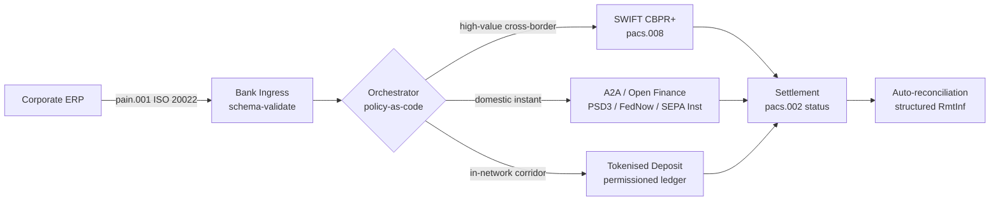

---

# Front Matter (YAML)

author: "contact@sebastienrousseau.com (Sebastien Rousseau)"
banner_alt: "Containerfartyg i en djuphavshamn i gryningen — symboliserar den multispåriga, gränsöverskridande rörelsen av företagsvärde över ISO 20022, open finance och nätverk för avveckling med tokeniserade depositioner 2026"
banner_height: "1597"
banner_width: "2584"
banner: "https://cloudcdn.pro/stocks/images/viktor-forgacs-KxVRDiFdTVo.webp"
cdn: "https://cloudcdn.pro"
charset: "UTF-8"
cname: "sebastienrousseau.com"
copyright: "© Copyright 2025 - 2026 - Sebastien Rousseau. All rights reserved."
date: "June 24, 2026"
description: "Hur ISO 20022, A2A, open finance under PSD3/FiDA och tokeniserade depositioner omformar gränsöverskridande företagstreasury vid sidan av SWIFT 2026."
format-detection: "telephone=no"
hreflang: "sv"
icon: "https://cloudcdn.pro/clients/sebastienrousseau/v1/logos/sebastienrousseau.svg"
id: "https://sebastienrousseau.com/2026-06-24-cross-border-iso-20022-open-finance-tokenised-deposits-treasury-2026"
image_alt: "Svartvitt porträtt av Sebastien Rousseau"
image_height: "162"
image_width: "162"
image: "https://cloudcdn.pro/stocks/images/sebastienrousseau.webp"
keywords: "gränsöverskridande betalningar, ISO 20022, open finance, PSD3, FiDA, tokeniserade depositioner, stablecoins, A2A, treasury, CIB, Nexi, Mastercard, multispårig, pacs.008, pain.001, SWIFT, FedNow, SEPA Instant, RTP, CBPR+"
language: "sv-SE"
last_reviewed: "2026-06-24"
layout: "report"
locale: "sv_SE"
logo_alt: "Logotyp för Sebastien Rousseau"
logo_height: "44"
logo_width: "44"
logo: "https://cloudcdn.pro/clients/sebastienrousseau/v1/logos/sebastienrousseau.svg"
menu: ""
measurementID: "G-169G4ET5HQ"
name: "Sebastien Rousseau"
permalink: "https://sebastienrousseau.com/2026-06-24-cross-border-iso-20022-open-finance-tokenised-deposits-treasury-2026"
rating: "general"
referrer: "no-referrer"
robots: "index, follow"
schema: "FAQPage, Article"
seo_title: "Gränsöverskridande 2026: ISO 20022, open finance, tokenspår"
short_name: "sebastienrousseau"
subtitle: "Gränsöverskridande företagstreasury 2026 körs på multispårig mekanik — ISO 20022 som den gemensamma grammatiken, A2A och open finance som det kundvända spåret, tokeniserade depositioner som det partihandelsmässiga avvecklingsbenet, med SWIFT som fortfarande förankrar den långa svansen."
tags: "gränsöverskridande betalningar, ISO 20022, open finance, PSD3, FiDA, tokeniserade depositioner, A2A, treasury, CIB, multispårig, pacs.008, pain.001, SWIFT, FedNow, SEPA Instant, RTP, CBPR+"
theme-color: "0, 83, 191"
title: "Gränsöverskridande 2026: ISO 20022, open finance och tokeniserade depositioner i företagstreasury"
url: "https://sebastienrousseau.com/2026-06-24-cross-border-iso-20022-open-finance-tokenised-deposits-treasury-2026"
viewport: "width=device-width, initial-scale=1, shrink-to-fit=no"

# RSS - The RSS feed front matter (YAML).
atom_link: "https://sebastienrousseau.com/2026-06-24-cross-border-iso-20022-open-finance-tokenised-deposits-treasury-2026/rss.xml"
category: "Technology"
docs: https://validator.w3.org/feed/docs/rss2.html
generator: "Static Site Generator (SSG) (version 0.0.26)"
item_description: "Hur ISO 20022, A2A, open finance under PSD3/FiDA och tokeniserade depositioner omformar gränsöverskridande företagstreasury vid sidan av SWIFT 2026."
item_guid: "https://sebastienrousseau.com/2026-06-24-cross-border-iso-20022-open-finance-tokenised-deposits-treasury-2026/rss.xml"
item_link: "https://sebastienrousseau.com/2026-06-24-cross-border-iso-20022-open-finance-tokenised-deposits-treasury-2026/rss.xml"
item_pub_date: "Wed, 24 Jun 2026 07:07:07 +0000"
item_title: "Gränsöverskridande 2026: ISO 20022, open finance och tokeniserade depositioner i företagstreasury"
last_build_date: "Wed, 24 Jun 2026 06:06:06 +0000"
managing_editor: "contact@sebastienrousseau.com (Sebastien Rousseau)"
pub_date: "Wed, 24 Jun 2026 07:07:07 +0000"
ttl: "60"
type: "article"
webmaster: "contact@sebastienrousseau.com"

# Apple - The Apple front matter (YAML).
apple_mobile_web_app_orientations: "portrait"
apple_touch_icon_sizes: "192x192"
apple-mobile-web-app-capable: "yes"
apple-mobile-web-app-status-bar-inset: "black"
apple-mobile-web-app-status-bar-style: "black-translucent"
apple-mobile-web-app-title: "Gränsöverskridande 2026: ISO 20022, open finance, tokenspår"
apple-touch-fullscreen: "yes"

# MS Application - The MS Application front matter (YAML).

msapplication-navbutton-color: "0, 83, 191"

# Twitter Card - The Twitter Card front matter (YAML).

twitter_card: "summary_large_image"
twitter_creator: "@wwdseb"
twitter_description: "Hur ISO 20022, A2A, open finance under PSD3/FiDA och tokeniserade depositioner omformar gränsöverskridande företagstreasury vid sidan av SWIFT 2026."
twitter_image: "https://cloudcdn.pro/clients/sebastienrousseau/v1/logos/sebastienrousseau.svg"
twitter_image_alt: "Logotyp för Sebastien Rousseau"
twitter_site: "@wwdseb"
twitter_title: "Gränsöverskridande 2026: ISO 20022, open finance, tokenspår"
twitter_url: "https://sebastienrousseau.com/2026-06-24-cross-border-iso-20022-open-finance-tokenised-deposits-treasury-2026"

excerpt: "Gränsöverskridande företagstreasury 2026 är ett multispårigt tekniskt problem. ISO 20022 är den gemensamma grammatiken, A2A och open finance under PSD3/FiDA är det kundvända spåret, tokeniserade depositioner hanterar det partihandelsmässiga avvecklingsbenet, och SWIFT förankrar fortfarande den långa svansen. Det intressanta arbetet sker i orkestreringslagret, inte i modellen."

# Humans.txt - The Humans.txt front matter (YAML).
author_website: "https://sebastienrousseau.com"
author_twitter: "@wwdseb"
author_location: "London, UK"
thanks: "Tack för att du läste!"
site_last_updated: "2026-06-24"
site_standards: "HTML5, CSS3, RSS, Atom, JSON, XML, YAML, Markdown, TOML"
site_components: "Kaishi, Kaishi Builder, Kaishi CLI, Kaishi Templates, Kaishi Themes"
site_software: "Static Site Generator, Rust"

---

# Gränsöverskridande 2026: ISO 20022, open finance och tokeniserade depositioner i företagstreasury

<!-- lead-start -->
<aside class="post-lead" aria-label="Artikelsammanfattning">

<strong>TL;DR.</strong> Gränsöverskridande företagstreasury 2026 körs på fyra spår parallellt — SWIFT CBPR+, omedelbar A2A under PSD3/FiDA, tokeniserade depositioner och stablecoin-spår — sammansydda av ISO 20022 som den gemensamma grammatiken. Arbetet för CIB- och företagstreasury-team är orkestrering, inte spårval.

<strong>Viktiga slutsatser</strong>

<ul class="post-lead-takeaways">
  <li><strong>Multispårig är standard.</strong> Inget enskilt spår clearar varje korridor, varje biljettstorlek, varje cut-off. Treasury väljer spår per betalning, inte per bank.</li>
  <li><strong>ISO 20022 är lingua franca.</strong> pacs.008, pacs.009 och pain.001 bär nu remitteringsdata över RTGS-, omedelbara, A2A- och tokeniserade depositionsspår — vilket gör dirigeringsbeslut datadrivna snarare än spårlåsta.</li>
  <li><strong>Open finance vidgar perimetern.</strong> PSD3 och FiDA driver ut open banking-modellen i pensioner, försäkring och treasury-data; Nexi och Mastercard bygger det orkestreringslager som företag konsumerar.</li>
  <li><strong>Tokeniserade depositioner är partihandelsbenet.</strong> Bankutgivna tokeniserade depositioner och integrerade stablecoin-spår sitter under det kundvända omedelbara spåret och avvecklar partihandelsbenet i nära T+0.</li>
</ul>

<strong>Vidare läsning:</strong> <a href="https://sebastienrousseau.com/2026-06-07-autonomous-treasury-index-programmable-liquidity-tokenised-deposits-2026">Autonomous Treasury Index 2026: programmerbar likviditet och tokeniserade depositioner</a>, <a href="https://sebastienrousseau.com/2026-06-15-pacs008-automation-iso-20022-interbank-payments-2026">pacs.008-automation: ISO 20022 interbankbetalningar 2026</a>.

</aside>
<!-- lead-end -->

> **Sammanfattning för ledningen.** Gränsöverskridande företagstreasury 2026 är ett multispårigt tekniskt problem innan det är ett relationshanteringsproblem. PSD3 och förordningen om åtkomst till finansiella data (FiDA) vidgar open banking-perimetern in i företagets treasury-data; SWIFT:s MT/MX-omkoppling i november 2026 gör CBPR+-konform pacs.008 till det enda gångbara gränsöverskridande interbankformatet; tokeniserade depositioner och reglerade stablecoin-spår hanterar det partihandelsmässiga avvecklingsbenet i nära T+0 inom behörighetsbaserade nätverk. Den CIB som vinner i denna cykel är inte den som väljer ett enskilt spår; det är den som konstruerar det orkestreringslager som binder dem samman. Denna artikel går igenom fyrspårsarkitekturen (A2A under PSD3, SWIFT CBPR+, bankutgivna tokeniserade depositioner, reglerade stablecoins) — vad varje spår gör bra, var gränserna för kreditexponering går, och vad policy-som-kod-orkestreringslagret ovanför dem måste upprätthålla så att företaget ser en betalning och tillsynsmyndigheten ser ett granskningsbart spår.

Ett europeiskt industriföretag betalar en brasiliansk leverantör 4,2 miljoner EUR en onsdag morgon. Treasury-arbetsstationen väljer inte en bank. Den väljer ett spår — en sekvens av spår. Den kundvända instruktionen landar på ett A2A pain.001-meddelande som dirigeras genom en open finance-leverantör under PSD3. Banken benar det över två korrespondentjurisdiktioner på tokeniserade depositioner inuti ett privat CIB-nätverk. Den långa svansen — en USD 80 000-fakturarensning till en underleverantör utan tokeniserad depositionsrelation — rider fortfarande på SWIFT CBPR+ som en pacs.008. Kunden ser en betalning. Arkitekturen ser fyra spår. ISO 20022 är den enda anledningen till att det håller ihop.

Detta är driftsmodellen som Mastercard beskriver när de talar om [utvecklingen från open banking till open finance](https://www.mastercard.com/us/en/news-and-trends/Insights/2026/open-banking-to-open-finance-the-evolution-of-financial-data.html "Mastercard: open banking till open finance, finansiella datas utveckling") — data och betalningar sammansmälta till ett orkestreringslager, där spåret väljs av systemet, inte av kunden. Den intressanta frågan för seniora banktekniker är inte vilket spår som vinner. Den är hur orkestreringslagret konstrueras, styrs och avstäms.

## 01. Från kort till A2A — open finance-skiftet

Kortspåren försvinner inte. De omformuleras.

Genom 2025 och in i 2026 utvidgade [PSD3 och förordningen om åtkomst till finansiella data (FiDA)](https://www.consultancy.uk/news/42202/orchestrating-open-banking-for-platform-growth-2026-outlook "Consultancy.uk: orkestrering av open banking för plattformstillväxt, 2026-utsikter") open banking-skyldigheten bortom betalkonton till pensioner, bolån, sparande, försäkring och företagstreasury-data. Implikationen för företagstreasury är direkt: en CIB-relationsansvarig kan nu konsumera ett företags fullständiga likviditetsbild över flera banker via ett enda API-kontrakt, på företagets instruktion.

Två operatörer bygger synligt det orkestreringslager som företag kommer att konsumera. Nexi har utvidgat sin acquiring-fotavtryck till A2A-initiering över SEPA Instant och paneuropeiska RTGS-korridorer, ISO 20022-nativ från ände till ände. Mastercards open finance-plattform — förankrad i förvärvet av Aiia och Finicity — tillhandahåller dataaggregations- och samtyckeslagret under, med betalningsinitiering som dyker upp genom samma API-bestånd som tidigare betjänade kortauktoriseringar.

Skiftet spelar roll av tre skäl:

1. **Enhetsekonomi.** A2A initierad under PSD3 avlägsnar interchange från betalningen. För B2B-flöden med högt biljettvärde är besparingen materiell; för konsumentflöden med lågt biljettvärde kollapsar handlarens kostnadsstack.
2. **Datakvalitet.** A2A under ISO 20022 bär strukturerade remitteringsdata som kort aldrig kunde. Auto-avstämningsgrader över 95 % är nu en miniminivå.
3. **Riskmodell.** A2A är en kreditöverföring, inte en kortauktorisering. Bedrägeriytan, chargeback-modellen och tvistemodellen är alla annorlunda. Företagstreasury-team behöver förstå att kundskyddslagret byggs om, inte ärvs.

Den CIB som säljer ett multispårigt erbjudande 2026 säljer orkestrering — inte åtkomst. Åtkomst är nu reglerad.

## 02. ISO 20022 som lingua franca över spåren

Anledningen till att multispårig fungerar överhuvudtaget är att meddelandeformatet nu är konsekvent över spåren.

BIS Committee on Payments and Market Infrastructures (CPMI) gjorde det arkitektoniska argumentet tydligt i sina [harmoniseringskrav för ISO 20022 för förbättring av gränsöverskridande betalningar](https://www.bis.org/cpmi/publ/d230.pdf "BIS CPMI: harmoniseringskrav för ISO 20022 för förbättring av gränsöverskridande betalningar"). Omkopplingen i november 2025 till CBPR+ stängde MT103/MT202-eran för gränsöverskridande interbankmeddelanden. Från och med den tidpunkten talar varje större spår — SWIFT, FedNow, SEPA Instant, RTP och de större omedelbara betalningssystemen i Asien och Latinamerika — samma pacs.008/pacs.009/pain.001-grammatik.

Den praktiska konsekvensen för företagstreasury:

- **Dirigering är datadriven.** Treasury-arbetsstationen kan läsa en pain.001 en gång och bestämma spår per betalning baserat på korridor, biljettstorlek, cut-off och motpartsrelation — utan att omkarta meddelandet.
- **Remitteringsdata överlever hoppet.** Strukturerade remitteringsfält (`<RmtInf><Strd>`) bärs genom korrespondentben utan trunkering. Auto-avstämningsgraden stiger eftersom data inte längre går förlorad vid spårgränsen.
- **Sanktionsscreening blir granskningsbar.** Strukturerade `<Dbtr>`/`<Cdtr>`/`<DbtrAgt>`/`<CdtrAgt>`-fält med LEI-referenser ersätter screening av fritextnamn. Träffgraden faller. Utredningsköerna krymper.

Diagrammet nedan följer en enskild pain.001 genom bankens ingress, in i policy-as-code-orkestratorn, och ut till det spår som korridoren och biljettstorleken kräver — ett meddelande, många spår, ingen omkartning.

Kostnaden för denna konsekvens är teknisk disciplin. ISO 20022 är tillåtande. Två banker kan vara fullt CBPR+-efterlevande och fortfarande producera pacs.008-meddelanden som skiljer sig i fältanvändning, teckenuppsättning och remitteringsdatastruktur. Den CIB som vinner på gränsöverskridande 2026 tvingar fram en striktare meddelandeprofil än standarden kräver — och avvisar vid parsning, inte vid avveckling.

## 03. Tokeniserade depositioner och stabila spår

Det partihandelsmässiga avvecklingsbenet är där spårhistorien blir intressant.

2026-bilden, väl fångad i [Trade Treasury Payments analys av automation, beredskapsspår, ISO 20022 och stablecoins](https://tradetreasurypayments.com/articles/automation-contingency-rails-iso-20022-and-stablecoins-the-2026-trends-reshaping-corporate-finance-and-b2b-payments "Trade Treasury Payments: automation, beredskapsspår, ISO 20022 och stablecoins, trenderna 2026 som omformar företagsfinans och B2B-betalningar"), delar det partihandelsmässiga avvecklingslagret i två strukturellt olika modeller.

**Bankutgivna tokeniserade depositioner.** En affärsbank emitterar en tokeniserad skuld på en behörighetsbaserad ledger — JPM Coin, HSBC:s Orion-länkade depositionstoken, de större europeiska CIB-ekvivalenterna. Token är en direkt fordran på den emitterande banken. Avveckling är nära T+0 inom nätverket. Efterlevnad är den emitterande bankens ansvar. Spåret är fullt reglerat, fullt spårbart och begränsat till deltagare som emittenten har on-boardat.

**Integrerade stablecoin-spår.** En reglerad stablecoin — fullt reserverad, granskad och i drift under MiCA eller motsvarande regional regim — avvecklar en korridor där bankutgivna tokeniserade depositioner ännu inte når. Token är en fordran på reserven, inte på en bankbalansräkning. Efterlevnad är delad mellan emittenten, on-ramp och off-ramp.

De två modellerna konkurrerar inte. De är staplade. En gränsöverskridande CIB-produkt 2026 använder vanligtvis bankutgivna tokeniserade depositioner för det interna benet och en reglerad stablecoin för korridoren där det interna spåret terminerar. Företaget ser en ISO 20022-betalning. Avvecklingshistorien under är multi-token.

Frågan på styrelsenivå är densamma som operativa riskkommittéer har ställt sedan de första piloterna för programmerbar likviditet: vem bär kreditexponeringen på token, och under hur lång tid? Tokeniserade depositioner ger ett rent svar — den emitterande banken, fram till burn. Integrerade stablecoin-spår ger ett mer nyanserat svar — reserven, med förbehåll för granskningscykeln och inlösengarantin. Ett treasury-team som inte dokumenterar svaret per spår per korridor bär omätt kreditrisk på sin balansräkning.

## 04. Den autonoma treasury-stacken

Ovanför spårlagret sitter orkestreringslagret. Ovanför orkestreringslagret sitter agentlagret.

Jag har redovisat arkitekturen i detalj i [Autonomous Treasury Index 2026: programmerbar likviditet och tokeniserade depositioner](https://sebastienrousseau.com/2026-06-07-autonomous-treasury-index-programmable-liquidity-tokenised-deposits-2026 "Sebastien Rousseau: Autonomous Treasury Index 2026"). Kortversionen: agentisk treasury 2026 är orkestreringslagret, uttryckt som policy-som-kod, med avgränsade agenter som exekverar inom det.

Stacken är:

1. **Spårlager.** SWIFT CBPR+, omedelbar A2A, tokeniserade depositioner, reglerade stablecoins. Varje spår har en publicerad profil, cut-off-tabell, kostnadskurva och modell för avvecklingsfinalitet.
2. **Orkestreringslager.** ISO 20022 in, ISO 20022 ut. Spårbeslut per betalning baserat på korridor, biljett, cut-off, motpartsrelation och policy. Policy är versionerad, signerad och granskningsbar.
3. **Agentlager.** Avgränsade treasury-agenter exekverar orkestreringspolicyn med gränser för verktygsanrop, granskningsloggar och kill switch-funktioner. Agenten väljer inte spåret. Policyn väljer spåret. Agenten kör policyn.
4. **Avstämningslager.** ISO 20022 pacs.008/pacs.002/camt.054-meddelanden stäms av mot den ursprungliga pain.001-instruktionen, med strukturerade remitteringsdata som sluter cirkeln utan manuell intervention.

Den CIB som säljer denna stack 2026 säljer fyra saker samtidigt — och prissätter dem separat. Företaget som köper det köper valfrihet över spår, med en meddelandestandard, ett policylager, ett avstämningsflöde. Det är det arkitektoniska skiftet. Allt annat är implementationsdetalj.

## Vanliga frågor

**Är "open finance" bara omdöpt open banking?**
Nej. Open banking under PSD2 täckte betalkonton. PSD3 och förordningen om åtkomst till finansiella data (FiDA) utvidgar dataskyldigheten till pensioner, bolån, sparande, försäkring och företagstreasury-data. Implikationen för företagstreasury är direkt: en CIB-relationsansvarig kan nu konsumera ett företags fullständiga likviditetsbild över flera banker via ett enda API-kontrakt, på företagets instruktion, inte bara dess betalkontohistorik.

**Varför är orkestreringslagret det arkitektoniska fokuset, inte spåret?**
För att spåren nu kommodifieras. SWIFT CBPR+ pacs.008, A2A under PSD3, tokeniserade depositioner och reglerade stablecoins bär alla samma ISO 20022-grammatik på meddelandenivå. Det som särskiljer en CIB 2026 är den policy-som-kod-motor som väljer spår per betalning baserat på korridor, biljettstorlek, krav på avvecklingsfinalitet och motpartsrelation — och som registrerar valet i granskningstelemetri som tillsynsmyndigheten kommer att efterfråga. Utan den motorn är multispårighet bara valfrihet utan styrning.

**Var går gränsen för kreditexponering på ett tokeniserat depositionsben?**
Bankutgivna tokeniserade depositioner på en behörighetsbaserad ledger är en direkt fordran på den emitterande banken — kreditexponeringen upphör vid burn. Reglerade stablecoin-spår (MiCA-övervakade i EU, Bank of Englands diskussionspappersregim i Storbritannien, motsvarigheter i andra jurisdiktioner) är en fordran på reserven, med exponeringsfönstret beroende av granskningscykeln och villkoren för inlösengarantin. Ett treasury-team som inte dokumenterar svaret per spår per korridor bär omätt kreditrisk på sin balansräkning.

**Vad händer med SWIFT i denna arkitektur?**
SWIFT försvinner inte — det förankrar den långa svansen. Korridorer där bankutgivna tokeniserade depositioner ännu inte når (de flesta underleverantörsrelationer på tillväxtmarknader, de flesta lågfrekventa/låg-biljett gränsöverskridande flöden), och korridorer där företaget eller banken kräver CBPR+-korrespondentbanksgranskningsspår, fortsätter på SWIFT pacs.008. 2026-arkitekturen är "SWIFT + nya spår", inte "nya spår istället för SWIFT".

**Vad köper företaget när det köper denna stack?**
Valfrihet över spår, med en meddelandestandard (ISO 20022), ett policylager (orkestreringsmotorn) och ett avstämningsflöde (pacs.002-status + camt.054-bekräftelse + strukturerade camt.053-utdrag). Företaget betalar inte för fyra separata spårkopplingar. Det betalar för det orkestreringslager som får fyra spår att operativt bete sig som ett — och det granskningsspår som låter det besvara "vilket spår red den där betalningen på 4,2 miljoner EUR, och varför?" morgonen efter nästa tillsynsförfrågan.

## Slutsats

Gränsöverskridande företagstreasury 2026 är ett multispårigt tekniskt problem. ISO 20022 är den grammatik som gör multispårig hanterbar. PSD3 och FiDA vidgar dataperimetern och tvingar in open finance i företagstreasury-arbetsflödet. Tokeniserade depositioner och reglerade stablecoins hanterar det partihandelsmässiga avvecklingsbenet. SWIFT förankrar fortfarande den långa svansen.

Den CIB som vinner är den som bygger orkestreringslagret — inte den som väljer ett enskilt spår och satsar franchisen på det. Det företagstreasury-team som vinner är det som dokumenterar kreditexponeringen per spår per korridor, tvingar fram en striktare ISO 20022-profil än vad tillsynsmyndigheten kräver, och behandlar spårbeslutet som policy, inte som ett bedömningsanrop per betalning.

Det intressanta arbetet sker i orkestreringslagret. Bygg det noggrant.

## Referenser

Bank for International Settlements, Committee on Payments and Market Infrastructures (2023). *Harmonised ISO 20022 data requirements for enhancing cross-border payments* (CPMI Papers No. 230). Tillgänglig på: [https://www.bis.org/cpmi/publ/d230.htm](https://www.bis.org/cpmi/publ/d230.htm "BIS CPMI 230 — Harmoniserade ISO 20022-datakrav")

Bank for International Settlements (2024). *Project Agorá: cross-border payments with tokenised commercial bank deposits and central bank money*. BIS Innovation Hub. Tillgänglig på: [https://www.bis.org/about/bisih/topics/fmis/agora.htm](https://www.bis.org/about/bisih/topics/fmis/agora.htm "BIS Project Agorá")

Bank of England (2023). *Regulatory regime for systemic payment systems using stablecoins and related service providers — Discussion Paper*. Tillgänglig på: [https://www.bankofengland.co.uk/paper/2023/dp/regulatory-regime-for-systemic-payment-systems-using-stablecoins-and-related-service-providers](https://www.bankofengland.co.uk/paper/2023/dp/regulatory-regime-for-systemic-payment-systems-using-stablecoins-and-related-service-providers "Bank of England — Diskussionspapper om regelverk för stablecoins")

Europeiska kommissionen (2023). *Förslag till direktiv om betaltjänster och e-pengatjänster (PSD3)*. Tillgänglig på: [https://finance.ec.europa.eu/regulation-and-supervision/financial-services-legislation/implementing-and-delegated-acts/payment-services-directive_en](https://finance.ec.europa.eu/regulation-and-supervision/financial-services-legislation/implementing-and-delegated-acts/payment-services-directive_en "Europeiska kommissionen — Förslag till betaltjänstdirektiv")

Europaparlamentet och rådet (2023). *Förordning (EU) 2023/1114 om marknader för kryptotillgångar (MiCA)*. Tillgänglig på: [https://eur-lex.europa.eu/eli/reg/2023/1114/oj](https://eur-lex.europa.eu/eli/reg/2023/1114/oj "Förordning (EU) 2023/1114 — Marknader för kryptotillgångar (MiCA)")

Financial Action Task Force (2023). *International standards on combating money laundering and the financing of terrorism — Recommendation 16 on wire transfers*. Tillgänglig på: [https://www.fatf-gafi.org/en/publications/Fatfrecommendations/Fatf-recommendations.html](https://www.fatf-gafi.org/en/publications/Fatfrecommendations/Fatf-recommendations.html "FATF Recommendations")

International Organization for Standardization (2020). *ISO 17442 Financial services — Legal entity identifier (LEI)*. Tillgänglig på: [https://www.gleif.org/en/about-lei/iso-17442-the-lei-code-structure](https://www.gleif.org/en/about-lei/iso-17442-the-lei-code-structure "ISO 17442 — Legal Entity Identifier")

SWIFT (2024). *Cross-Border Payments and Reporting Plus (CBPR+) usage guidelines*. Tillgänglig på: [https://www.swift.com/standards/iso-20022/iso-20022-programme](https://www.swift.com/standards/iso-20022/iso-20022-programme "SWIFT CBPR+ användningsriktlinjer")

<!-- enrich-start -->
<aside class="author-card" aria-label="Om författaren"><strong class="author-card-name"><a href="/about/index.html">Sebastien Rousseau</a></strong>Senior banktekniker som skriver om tillämpad AI, ISO 20022-migration, postkvantkryptografi för finansiella tjänster och den strukturella omvandlingen av partihandelsbetalningar.20+ år över HSBC Commercial &amp; Investment Bank, PayPal, Barclays, Shazam, AKQA, Virgin Group. <a href="/about/index.html">Fullständig profil</a> &middot; <a href="https://www.linkedin.com/in/sebastienrousseau/" rel="external noopener">LinkedIn</a> &middot; <a href="https://github.com/sebastienrousseau" rel="external noopener">GitHub</a></aside>

Senast granskad <time datetime="2026-06-24">2026-06-24</time>.

<!-- enrich-end -->
