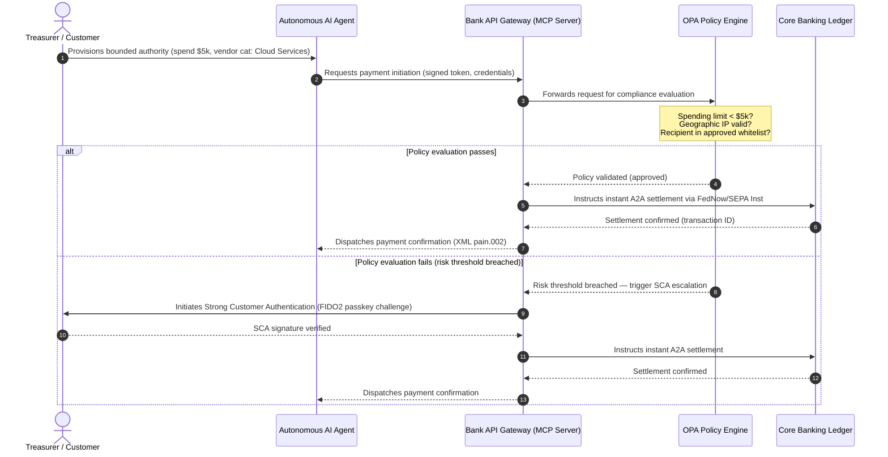

# Global betalningsutsikt 2026: driftmodell, risk och intäkter i en agentbaserad, osynlig värld i realtid

Den globala betalningscykeln 2026 definieras av tre konvergerande krafter — agentbaserad handel, osynliga inbäddade betalningar och realtidsutförande — som vilar på en tokeniserad enhetlig huvudbok under Project Agorá och en hård SWIFT-övergång till strukturerad adress i november 2026.

<!-- lead-start -->
<aside class="post-lead" aria-label="Artikelsammanfattning">

<strong>TL;DR.</strong> Betalningslandskapet 2026 har gått från meddelandemigrering till en flerdimensionell driftmodell där risk och intäkter dikteras av realtidsutförande. Texten syntetiserar utsikterna för 2026 från J.P. Morgan, Global Payments, HSBC och Payments Association till en G-SIB-driftplan med fyra pelare, som täcker modellinitierad agentbaserad handel, ständigt aktiva treasury-API:er, tokeniserade enhetliga huvudböcker under BIS Project Agorá och SWIFT-deadlinen för strukturerad adress den 14 november 2026.

<strong>Viktiga slutsatser</strong>

<ul class="post-lead-takeaways">
  <li><strong>Agentbaserad handel öppnar en gräns för delegerat ansvar.</strong> Autonoma AI-agenter förväntas förmedla 3-5 biljoner USD i årlig handel senast 2030. Bankerna måste definiera MCP-grindvakteri, SCA-delegering enligt PSD3/PSR och ägarskapet för KYC/AML inom betalningskedjor med flera agenter.</li>
  <li><strong>Ständigt tillgänglig likviditet är nu en operativ och regulatorisk grundnivå.</strong> Treasury-API:er och virtuella konton dygnet runt minimerar fastlåst kassa och höjer motståndskraftskraven. Enligt DORA måste likviditetsprodukter i realtid stödjas av geo-redundant, aktiv-aktiv infrastruktur som upprätthåller 99,999 % tillgänglighet.</li>
  <li><strong>Tokeniseringen har avancerat till reglerade enhetliga huvudböcker.</strong> Project Agorá är det största offentlig-privata ramverket för tokeniserade insättningar hos affärsbanker och centralbanksreserver. Bankerna behöver en tokeniseringsresa i fem steg, med explicit prudentiell behandling.</li>
  <li><strong>Övergången till strukturerad adress den 14 november 2026 är hårt daterad.</strong> Ostrukturerade postadressfält i CBPR+- och SEPA-meddelanden utlöser omedelbara avvisanden. Ren datastyrning över produkt-, teknik- och regelefterlevnadsteam krävs.</li>
</ul>

<strong>Relaterad läsning:</strong> <a href="https://sebastienrousseau.com/2026-06-23-iso-20022-pain001-programmable-liquidity-autonomic-treasury-2026">From Pain.001 to Programmable Liquidity: ISO 20022 as the Autonomic Nervous System of Treasury in 2026</a>, <a href="https://sebastienrousseau.com/2026-06-24-cross-border-iso-20022-open-finance-tokenised-deposits-treasury-2026">Cross-Border 2026: ISO 20022, Open Finance and Tokenised Deposits in Corporate Treasury</a>, <a href="https://sebastienrousseau.com/2026-06-25-quantum-dawn-cib-kyberlib-quantum-resilient-payments-stack-2026">Quantum Dawn for CIB: From KyberLib to a Quantum-Resilient Payments Stack</a>.

</aside>
<!-- lead-end -->

För globala transaktionsbanker är cykeln 2026-2028 ett strukturellt fönster. Modern betalningsinfrastruktur är inte längre en administrativ tjänsteapparat — den utgör kärnan i en bankkvalitativ teknikstrategi. Inom G-SIB-banker och stora regionala institutioner har teknik, reglering och kundförväntningar konvergerat till ett enda driftsplan.

Tre krafter definierar cykeln, och var och en pekar direkt mot en angelägenhet i ledningsrummet.

- **Agentbaserad handel** — kanaldistribution, produktdesign, ansvarsfördelning och Model Risk Management under tillsynsgranskning.
- **Osynliga betalningar** — kundupplevelse, med disintermediationsrisk där bankerna inte lyckas bädda in sin huvudbok i företags- och handlargränssnitt.
- **Realtidsutförande** — kapitalets hastighet, med åtföljande förändring av likviditetshantering, kreditrisk, operativ motståndskraft och bedrägeriförsvar.

De finansiella insatserna är väsentliga. Bedrägerier skalar i hastighet och sofistikering, regulatoriska deadlines är hårda, och de banker som proaktivt moderniserar sina kärnsystem frigör betydande avgiftsintäkter. Kostnaden för passivitet är motsatsen: omedelbara transaktionsavvisanden, operativa flaskhalsar, regulatoriska sanktioner och snabb erosion av marknadsandelar.

## Globala betalningsauktoriteters konvergens

Rapporten syntetiserar utsikterna för betalningar och handel 2026 från fyra auktoritativa branschröster — [J.P. Morgan Payments](https://www.jpmorgan.com/payments/newsroom/payments-outlook-2026-trends-report-released "J.P. Morgan Payments — Outlook 2026"), [Global Payments](https://investors.globalpayments.com/news-events/press-releases/detail/497/global-payments-releases-its-2026-commerce-and-payment "Global Payments — 2026 Commerce and Payment Trends Report"), HSBC och The Payments Association — och triangulerar dem mot [G20 Roadmap for Enhancing Cross-Border Payments](https://www.fsb.org/2026/03/fsb-kicks-off-new-implementation-phase-to-enhance-cross-border-payments-through-public-private-partnership/ "FSB — cross-border payments implementation phase, March 2026").

Varje organisation närmar sig ekosystemet från en egen marknadsvinkel, men slutsatserna konvergerar mot tre invarianter.

1. **Direkta, API-drivna rails är grundnivån.** Äldre batchbearbetningsmodeller marginaliseras för gränsöverskridande flöden och flöden med höga värden, och transaktionshastigheten i de segmenten dikteras av ständigt aktiv realtidsmeddelandehantering.
2. **AI är både hot och försvar.** Generativa verktyg och deepfakes skalar transaktionsbedrägerier, vilket kräver flerlagriga motåtgärder med maskininlärning i realtid.
3. **Tokeniseringen är produktionsklar infrastruktur.** Huvudböcker enhetliggörs för att hysa tokeniserade kommersiella skulder och centralbankers digitala valutor för partihandel.

| Rapport | Primär målgrupp | Fokus | Nyckelpelare | Bankimplikation |
| --- | --- | --- | --- | --- |
| **J.P. Morgan Payments** | Företagstreasurers, G-SIB | Likviditet i realtid, bedrägeri | API:er, AI-biometri | Bygg om likviditets-, FX- och risksystem för kontinuerlig avveckling 365 dagar om året. |
| **Global Payments** | Handlare, e-handel | POS-utveckling, omnikanal | Agentbaserad handel, friktionsfri kassa | Bygg säkra, API-styrda betalningskorridorer för handlare och autonoma AI-agenter. |
| **HSBC Insights** | Multinationella företag | ERP-integrationer (SAP/Oracle), kassa i realtid | Treasury-as-a-Service, kassasynlighet | Monetisera transaktions-API-svit och bädda in rapportering av kassahuvudbok i realtid vid källan. |
| **The Payments Association** | Fintech, betalningsinstitut | Stablecoins, tokenisering, global reglering | Reglerade digitala tillgångar, policyefterlevnad | Förbered balansräkningen för tokeniserade insättningar och navigera PSD3/PSR-ansvarsstrukturer. |

De fyra utsikterna definierar i praktiken den privata sektorns driftsstack som löper ovanpå den offentliga sektorns G20-policyinfrastruktur, och översätter policyintentionen till konkreta beslut om likviditet, tokenisering, data och bedrägerikontroll inom bankerna.

## Pelare 1 — Agentbaserad handel och osynliga betalningar

Agentbaserad handel är övergången från människostyrd klick-och-köp-kassa till autonom, modellstyrd transaktionsinitiering. Branschprognoser konvergerar mot 3-5 biljoner USD i årlig handel förmedlad av autonoma agenter senast 2030 — en låg ensiffrig andel av den globala betalningsvolymen som utförs utan att en människa klickar "köp".

Detalj- och handelsekosystemet har en motsvarande lucka. En tydlig majoritet av konsumenterna förväntar sig nu nästan friktionsfria betalningar, men färre än hälften av handlarna har prioriterat ettklickskassa eller API-tillgängliga produktkataloger. AI-agenter kan inte navigera äldre kassasidor med många steg utformade för mänskliga ögon, de behöver strukturerade, maskin-till-maskin-API-handskakningar.

### Bankprioriteringar och operativ påverkan

- **KYC- och AML-ägarskap.** Bankerna måste definiera vem som bär regelefterlevnadsåtagandet inom en agentbaserad transaktionskedja. Om en konsuments personliga AI-agent initierar en transaktion via en handlares agentbaserade kassa, måste banken verifiera att den ursprungliga delegerade befogenheten är kryptografiskt knuten till den primära kontoinnehavaren.
- **Omdesign av ansvar och återföring.** Kortscheman och A2A-rails utformades kring mänsklig auktorisering. När en AI-agent gör ett felaktigt inköp — exempelvis upphandling av fel industrilager på grund av ett dataanalyseringsfel — måste bankerna allokera ansvaret tydligt mellan konsument, agentleverantör och handlare.
- **Riskklassificering av agentbaserade flöden.** Betalningsdirigeringsmotorer måste riskklassificera agentbaserade betalningar dynamiskt och tillämpa högre reservkrav eller interchange-avgifter på icke-mänskligt initierade transaktioner tills en stabil avvecklingshistorik finns.

### Begränsad handling och begränsad befogenhet

För att begränsa "obegränsad handling" — en företagsupphandlingsagent som kör en oändlig rekursiv köpsekvens på grund av ett mjukvarufel — måste bankerna implementera **API-grindar med begränsad befogenhet**. Grindarna upprätthåller policynivågränser i tre dimensioner.

1. **Stegvisa finansiella gränser** — agentutgifter begränsade av transaktionsstorlek, daglig kumulativ summa och handlarkategori.
2. **Kontextmedvetna skyddsåtgärder** — sekundära signaler (tid på dygnet, IP-geolokalisering, transaktionsfrekvens) utvärderas innan huvudboken frigör medel.
3. **Eskalering med människan i loopen** — obligatorisk mänsklig auktorisering utlöses via Strong Customer Authentication (SCA) under PSD3/PSR närhelst en transaktion överskrider risktrösklar.

Mermaid-sekvensen nedan visar målarkitekturen som många banker kommer att känna igen som det agentbaserade betalningsflödet med begränsad befogenhet.

### Model Context Protocol (MCP)

För att koppla lokaliserade AI-modeller till bankstyrda exekveringslager standardiserar branschen kring [Model Context Protocol (MCP)](https://modelcontextprotocol.io "Model Context Protocol — open standard for LLM tool integration") — ett öppet protokoll som låter LLM-modeller anropa tydligt avgränsade, granskningsbara verktyg och API:er utan rå åtkomst till kärnsystem.

Att kapsla in bank-API:er (betalningsinitiering, saldoförfrågan, partsverifiering) inuti en MCP-server håller LLM-modeller borta från databastabeller och systemrot­kontroller. Modellen interagerar med huvudboken endast via strukturerade, granskade, frekvensbegränsade endpoints — säkerheten upprätthålls vid gränsen för agentbaserad verktygsexekvering snarare än begravd inuti modellen.

## Pelare 2 — Treasury-omvandling och omdefinierad likviditet

Hastigheten i transaktionsbankverksamheten 2026 sätts av skiftet från batchbearbetning vid dagens slut till ständigt aktiv treasury-drift i realtid. Multinationella företag tolererar inte längre fastlåst kassa — likviditet som ligger overksam på lokala konton under helger eller lov för att avvecklingssystemen är stängda.

### Det ekonomiska argumentet för likviditet i realtid

J.P. Morgan och HSBC rapporterar båda att företag med avancerade kassa- och datakapaciteter i realtid med betydande sannolikhet överträffar branschkollegor i intäktstillväxt och kapitaleffektivitet, främst genom att reducera fastlåst likviditet och optimera rörelsekapitalcykler.

För att fånga det värdet levererar bankerna **Treasury-as-a-Service (TaaS) API-produkter** som låter företagens ERP-system (SAP, Oracle) koppla direkt till bankens huvudbok.

- **Saldo-API:er i realtid** med `camt.052`-schemat — ersätter filöverföringsprotokoll med direkt, händelsedriven rapportering av kassapositioner.
- **API:er för bulkbetalningsinitiering** med `pain.001` — direkt, straight-through-utförande av leverantörsbetalningsbatchar från ERP-huvudboken.
- **Kontinuerliga FX-API:er** — treasury-motorer låser realtidsbaserade, algoritmiska valutakurser för gränsöverskridande avveckling och eliminerar marknadsgap-risken över natten.
- **Virtuella konto-API:er** — företag startar och avvecklar dynamiskt tusentals underkonton för automatiserad matchning av kundfordringar och separation av huvudböcker.

### Operativ motståndskraft och DORA

Att erbjuda ständigt aktiv likviditet förändrar bankens riskprofil. Plattformen måste upprätthålla **99,999 % operativ tillgänglighet** under kontinuerlig realtidsbelastning.

Enligt [Digital Operational Resilience Act (DORA)](https://eur-lex.europa.eu/legal-content/EN/TXT/?uri=CELEX%3A32022R2554 "Regulation (EU) 2022/2554 — Digital Operational Resilience Act") är det inte en IT-KPI — det är ett strikt regulatoriskt krav. Tillsynsmyndigheter förväntar sig att bankerna bevisar att treasury-API-ytan i realtid och huvudboksdatabasen kan absorbera allvarliga-men-troliga cyberattacker, nätverksavbrott och hyperscaler-störningar utan att avbryta kritiska betalningar eller äventyra systemisk likviditet. Det kräver geo-redundanta, aktiv-aktiv multimoln-databasarkitekturer, hotdetekteringslager i realtid och automatiserad failover — synligt i förändringskostnadsraden, inte enbart i revisionsdokumentationen.

### Kontinuerlig FX och gränsöverskridande innovation

Treasury i realtid kan inte leva inom en valutas gräns. G-SIB-bankerna driftsätter kontinuerlig FX-infrastruktur — J.P. Morgans plattform [Wire 365](https://www.jpmorgan.com/insights/payments/fx-cross-border/wire-365-global-clearing "J.P. Morgan — Wire 365 global clearing reinvented") bearbetar gränsöverskridande betalningar och FX-konverteringar vilken dag som helst på året, bortom traditionella centralbanks-RTGS-tider. Det lagret griper direkt in i de tokeniserade insättnings- och enhetliga huvudbokssystem som diskuteras i Pelare 3.

## Pelare 3 — Tokeniserade insättningar och den enhetliga huvudboken

Tokeniseringen har avancerat från isolerade proof-of-concept-piloter till skalad, bankkvalitativ monetär infrastruktur. Fokus har flyttats från privata stablecoins och spekulativa kryptotillgångar till **tokeniserade insättningar hos affärsbanker** och **wholesale central bank digital currencies (wCBDC:er)** som körs på programmerbara enhetliga huvudböcker.

Referensramverket är [Project Agorá](https://www.bis.org/about/bisih/topics/fmis/agora.htm "BIS Project Agorá — tokenisation of wholesale cross-border payments") — ett stort offentlig-privat samarbete sammankallat av BIS och IIF, med sju centralbanker och över 40 privata finansinstitut. Projektet undersöker hur tokeniserade insättningar hos affärsbanker integreras med tokeniserade wholesale-CBDC:er på en delad programmerbar huvudbok för att eliminera friktion i gränsöverskridande avveckling, koordinera regelefterlevnadskontroller och möjliggöra atomär finalitet dygnet runt.

### Tokeniseringsresan i fem steg

För G-SIB-banker och stora regionala banker är tokeniseringen en stegvis resa från intern optimering till öppen marknadsinteroperabilitet.

1. **Intern treasury-likviditet** — tokenisering av interna företagskassasaldon (t.ex. JPM Coin eller motsvarande privata bankhuvudböcker) för att möjliggöra direkt, dygnetrunt gränsöverskridande överföring och nettning över bankens egna filialer.
2. **Begränsade flerbankskorridorer** — slutna, reglerade konsortier (Project Agorá-sandlådan) för att testa interbankavveckling och delat huvudbokstillstånd över skilda institut.
3. **Kontinuerlig programmerbar FX** — smarta kontrakt på den enhetliga huvudboken utför direkt Payment-versus-Payment (PvP) FX och eliminerar avvecklingsrisk över tidszoner.
4. **Tokeniserade realvärldstillgångar (RWA)** — den tokeniserade kontantsidan integreras med tokeniserade värdepapper, skulder eller handelshuvudböcker för direkt Delivery-versus-Payment (DvP)-finalitet, vilket minskar kapitalbindningen från dagar till millisekunder.
5. **Reglerad publik/hybrid-interoperabilitet** — säkra gateway-omslag låter institutionell likviditet interagera säkert med öppna publika nätverk.

### Prudentiella och balansräkningsmässiga implikationer

Tokeniserad kassa måste navigeras genom prudentiella ramverk noggrant. Tillsynsmyndigheter betonar att en tokeniserad insättning måste vara ekonomiskt likvärdig med en traditionell insättning hos en affärsbank — vilket innebär en oprioriterad skuld på bankens balansräkning med samma insättningsförsäkringsskydd.

Operativt introducerar tokeniserade insättningar risker som klassiska likviditetsstressmodeller inte byggdes för att simulera. Smarta kontrakt utför programmerbara uttag i hastigheter och volymer som äldre antaganden inte fångar. Enligt Basel III måste bankerna säkerställa att riskmotorn kan modellera programmerbara kassa-utflöden och att den tokeniserade huvudboken interopererar rent med äldre RTGS-system genom den dagliga likviditetscykeln.

### Stablecoins kontra tokeniserade insättningar — en nyanserad position

Privata fullt reserverade stablecoins (USDC m.fl.) fortsätter att ta marknadsandelar inom gränsöverskridande remittering till privatkunder och decentraliserad handel, men saknar kreditskapande kapacitet och avvecklingsfinalitet i det kommersiella banksystemet.

Snarare än att konkurrera på detaljhandels-rails etablerar transaktionsbankerna förvaring, utfärdar egna reglerade tokeniserade skuldinstrument och bygger säkra on-/off-ramp-gateways. Företagskunder får programmeringsflexibilitet samtidigt som kapitalet stannar inom den reglerade perimetern.

### Frågor en styrelse bör ställa om tokeniserade pengar

- **Deltagande i enhetlig huvudbok.** Vad är vår aktiva strategiska färdplan för att delta i wholesale offentlig-privata enhetliga huvudboksinitiativ som Project Agorá?
- **Balansräkning och riskmodellering.** Har våra riskmotorer och kapitaltäckningsramverk uppdaterat stresstestningen för att beakta hastigheten på token-utflöden utlösta av smarta kontrakt?
- **Tidiga kundsegment.** Vilka av våra företagstreasury- och affärsbankskundsegment skulle gynnas omedelbart av programmerbar, tokeniserad DvP/PvP-avveckling?

## Pelare 4 — Strukturerad data och bedrägeriförsvar

Infrastrukturefterlevnad 2026 domineras av **övergången till strukturerad adress den 14 november 2026** som etablerats under [SWIFT Standards Release (SR) 2026](https://www.swift.com/standards/iso-20022/removal-unstructured-address "SWIFT — Removal of unstructured address, November 2026"). Från det datumet slutar CBPR+- och SEPA-betalningsnätverken att acceptera helt ostrukturerade postadressblock i fri text (`<AdrLine>`) i betalningsmeddelanden. Alla gränsöverskridande eller inhemska meddelanden som bär en ostrukturerad adress där strukturerade element förväntas kommer att fördröjas eller avvisas av nätverket.

De flesta institut känner till datumet. Många behandlar det som en ytlig mappningsövning vid gränssnittslagret. Verkligheten är en djupare utmaning kring datakvalitet och datastyrning. För att undvika katastrofala avvisningsfrekvenser behöver betalningsverksamheten en tydlig tvärfunktionell styrningsram.

- **Produkt och drift.** Datafångst vid källan. Kundvända digitala portaler, onboarding-gränssnitt och fält för indata i företags-ERP måste tvinga fram strukturerade adressfält (`<StrtNm>`, `<PstCd>`, `<TwnNm>`, `<Ctry>`) vid betalningsinitiering.
- **Teknik.** Parsning, mappning, schemavalidering. Valideringsmotorer blockerar äldre filer innan de träffar SWIFT-gränssnittet. Lokalt driftsatta maskininlärningsmodeller parsar äldre ostrukturerade adressblock till XML-kompatibla taggar under `<PstlAdr>`.
- **Regelefterlevnad och risk.** Sanktionsscreening, transaktionsövervakning och AML-logik uppdateras för att intaga de strukturerade XML-fälten — vilket sänker andelen falska positiva och manuella utredningar.

### Affärscaset för strukturerad data

Behandlat som en regelefterlevnadskostnad är det strukturerade dataprogrammet dyrt. Behandlat som en intäktsdrivare betalar det sig självt.

1. **Avancerat kreditbeslutsstöd.** Strukturerade faktura-, remitterings- och slutgäldenärsdata låter bankerna bygga automatiserade, precisa rörelsekapitalfinansierings- och leverantörskedjefakturafaktoringprogram för företagskunder.
2. **Automatiserad matchning av kundfordringar.** Att exponera strukturerade parts- och fakturaidentifierare stöder premium kassaavstämnings- och virtuella kontopoolningsprodukter och genererar nya transaktionsavgiftsintäkter.
3. **Monetariserbar transaktionsanalys.** Bankerna paketerar och säljer detaljerade analysdashboards för likviditet och inköpsmönster i realtid till företags-CFO:er och treasurers.

### Ett lagerindelat AI-bedrägeriförsvar

När transaktionshastigheterna accelererar till realtid har bedrägeritekniker skalat. Aktuell forskning indikerar att deepfakes står för cirka 40 % av biometriska bedrägeriförsök, där syntetisk media i ökande grad används för att besegra röst- och ansiktsigenkänningskontroller i onboarding- och betalningsflöden.

Försvaret är en **AI-bedrägerimodell i tre lager**.

1. **Identitetslager.** Biometriskt verifierade [FIDO2](https://fidoalliance.org/fido2/ "FIDO Alliance — FIDO2 specification")-passkeys, kryptografiskt signerad hårdvarukoppling och decentraliserade digitala ID-plånböcker för att säkra betalningsåtkomst.
2. **Beteendelager.** Kontinuerlig beteendebiometri — sessionsnavigeringstakt, skrivkadens, enhetsorientering — för att upptäcka automatiserad bot-exekvering eller sessionskapningsförsök.
3. **Transaktionslager.** ISO 20022:s strukturerade fält matar in realtidsbaserade maskininlärningsriskmotorer som korsreferenserar transaktionsmetadata mot delad konsortiumsintelligens på nätverksnivå för att identifiera misstänkta transaktioner inom millisekunder från initieringen.

För att tillfredsställa tillsynsmyndigheter bygger AI-modellerna på transaktionslagret in strikta **förklarbarhetsparametrar** och drivs under ett dedikerat Model Risk Management (MRM)-program. Tillsynsmyndigheter förväntar sig att bankerna förklarar de specifika datapunkter och den algoritmiska logik som utlöst en automatiserad blockering eller bedrägerivarning, i linje med [US Federal Reserve SR 11-7](https://www.federalreserve.gov/frrs/guidance/supervisory-guidance-on-model-risk-management.htm "US Federal Reserve — Supervisory Guidance on Model Risk Management, SR 11-7") och Bank of Englands [PRA SS1/23](https://www.bankofengland.co.uk/prudential-regulation/publication/2023/may/model-risk-management-principles-for-banks-ss "Bank of England PRA SS1/23 — Model Risk Management principles for banks").

## Styrelseagenda 2026-2028

För att exekvera över de fyra pelarna bör G-SIB- och regionalbanksledningar organisera operativa och tekniska investeringar längs en tydlig färdplan med tre horisonter.

### Horisont 1 — Omedelbar regelefterlevnad och kärnhärdning (0-12 månader)

- **Fokus.** Standardisera ISO 20022-datakvalitet och säkra grundläggande transaktionsvägar i realtid.
- **Framgångsindikator (KPI).** Noll avvisanden av ostrukturerad adress på SWIFT och SEPA efter övergången den 14 november 2026.
- **Exekutiv ägare.** Chief Operating Officer / Head of Payment Operations.
- **Leverabeltyp.** No-regrets-åtgärd. Uppdateringar av databasschemat i kärnan och valideringsmotorn för SWIFT SR 2026.

### Horisont 2 — Automatisering och agentbaserade skyddsåtgärder (12-24 månader)

- **Fokus.** API-grindar med begränsad agentbaserad befogenhet och kontinuerlig bedrägeriförsvarsarkitektur.
- **Framgångsindikator (KPI).** 100 % av maskin-till-maskin- och AI-initierade API-transaktioner validerade via FIDO2-hårdvarukoppling och policy-motorer med begränsad befogenhet.
- **Exekutiv ägare.** Chief Information Officer / Chief Risk Officer.
- **Leverabeltyp.** No-regrets-åtgärd (bedrägeriförsvar) plus strategiskt optionsval (agentbaserad handel). MCP-utrullning och AI-bedrägerimodell i tre lager.

### Horisont 3 — Plattformstokenisering och enhetliga huvudböcker (24-36 månader)

- **Fokus.** Övergå treasury-tillgångar till tokeniserade insättningar och delta i delade gränsöverskridande huvudböcker.
- **Framgångsindikator (KPI).** Minst 15 % av högvärdig företagstreasury-avvecklingsvolym hanterad nativt via tokeniserade insättningsinstrument eller enhetliga huvudboksarrangemang (t.ex. Project Agorá-korridorer).
- **Exekutiv ägare.** Group Treasurer / Head of Transaction Banking.
- **Leverabeltyp.** Strategiskt optionsval. Programmerbar huvudboksinfrastruktur, likviditetsregler i smarta kontrakt, DvP/PvP-avvecklingsadaptrar.

## FAQ

**Kommer agentbaserad handel verkligen att nå 3-5 biljoner USD senast 2030?**
McKinseys baslinje pekar på 5 biljoner USD i agentbaserad handelsförsäljning senast 2030, med ett intervall av oberoende prognoser som klustras mellan 3 och 5 biljoner USD. Variansen återspeglar hur aggressivt handlare levererar maskinläsbara kassa-API:er och hur snabbt bankerna låter agenter transaktera under SCA-delegering — flaskhalsen ligger på bank- och handlarsidan, inte på agentkapacitetssidan.

**Gäller SWIFT-övergången den 14 november 2026 även inhemska SEPA-flöden?**
Ja. Kravet på strukturerad adress gäller CBPR+-gränsöverskridande och SEPA-betalningsmeddelanden. Banker som driver båda rails behöver ett enda kanoniskt adressschema uppströms SWIFT-gränssnittet, inte två parallella mappningar.

**Är en tokeniserad insättning samma sak som en stablecoin?**
Nej. En tokeniserad insättning är en oprioriterad skuld på en reglerad banks balansräkning, med samma insättningsförsäkringsskydd som en traditionell insättning. En stablecoin är typiskt ett fullt reserverat instrument utfärdat av ett icke-bankinstitut, utan kreditskapande kapacitet. Project Agorás design förutsätter att tokeniserade insättningar samexisterar med wholesale-CBDC:er på en delad programmerbar huvudbok, stablecoins ingår inte i wholesale-avvecklingsbenet.

**Hur förhåller sig Project Agorá till befintliga wCBDC-piloter?**
Agorá är den integrerande ramen. Nationella wCBDC-experiment täcker centralbankspengabenet, Agorá tar in tokeniserade affärsbanksinsättningar på samma programmerbara huvudbok så att gränsöverskridande avveckling är atomär över båda pengatyperna. De sju deltagande centralbankerna och 40+ privata instituten gör det till den största offentlig-privata designarenan för wholesale-arkitekturen för tokeniserade pengar.

**Vad är den minsta DORA-efterlevnadshållningen för ett TaaS-API?**
Geo-redundant aktiv-aktiv driftsättning, dokumenterade allvarliga-men-troliga cyberscenarier med utpekade ägare under SM&CR (UK), och en testad failover som inte avbryter kritiska betalningar. Utan det är TaaS-produkten en regulatorisk skuld innan den är en intäktsrad.

## Referenser

- Bank for International Settlements (BIS) Innovation Hub. (2026). *Project Agorá: exploring tokenisation of wholesale cross-border payments*. [BIS Project Agorá](https://www.bis.org/about/bisih/topics/fmis/agora.htm).
- Deutsche Bank. (2026). *Digital Money: a perspective on stablecoins, tokenised deposits and CBDCs*. [Deutsche Bank Flow](https://flow.db.com/publications/flow-white-papers-and-guides/digital-money-a-perspective-on-stablecoins-tokenised-deposits-and-cbdcs).
- European Parliament and Council. (2022). *Regulation (EU) 2022/2554 on Digital Operational Resilience (DORA)*. [DORA Regulation](https://eur-lex.europa.eu/legal-content/EN/TXT/?uri=CELEX%3A32022R2554).
- Financial Stability Board. (2026). *FSB kicks off new implementation phase to enhance cross-border payments*. [FSB statement](https://www.fsb.org/2026/03/fsb-kicks-off-new-implementation-phase-to-enhance-cross-border-payments-through-public-private-partnership/).
- Global Payments. (2025). *2026 Commerce and Payment Trends Report — press release*. [Global Payments press release](https://investors.globalpayments.com/news-events/press-releases/detail/497/global-payments-releases-its-2026-commerce-and-payment).
- J.P. Morgan Payments. (2026). *Payments Outlook 2026 Trends Report Released*. [J.P. Morgan Newsroom](https://www.jpmorgan.com/payments/newsroom/payments-outlook-2026-trends-report-released).
- J.P. Morgan Insights. (2026). *5 Payment Trends to Watch for in 2026*. [J.P. Morgan Trends](https://www.jpmorgan.com/insights/payments/trends-innovation/five-payment-trends-in-2026).
- J.P. Morgan FX & Cross-Border. (2026). *Wire 365: Global Clearing Reinvented*. [J.P. Morgan FX Wire 365](https://www.jpmorgan.com/insights/payments/fx-cross-border/wire-365-global-clearing).
- SWIFT. (2026). *ISO 20022 milestone for November 2026: unstructured addresses to be removed*. [SWIFT ISO 20022 Milestone](https://www.swift.com/news-events/news/iso-20022-milestone-november-2026-unstructured-addresses-be-removed).
- SWIFT Standards. (2026). *Removal of unstructured address*. [SWIFT Standards](https://www.swift.com/standards/iso-20022/removal-unstructured-address).
- Bank of England. (2023). *Supervisory Statement (SS1/23) — Model Risk Management principles for banks*. [Bank of England PRA SS1/23](https://www.bankofengland.co.uk/prudential-regulation/publication/2023/may/model-risk-management-principles-for-banks-ss).
- US Federal Reserve. (2011). *Supervisory Guidance on Model Risk Management (SR 11-7)*. [SR 11-7](https://www.federalreserve.gov/frrs/guidance/supervisory-guidance-on-model-risk-management.htm).
- McKinsey & Company. (2025). *McKinsey forecast: $5 trillion in agentic commerce sales by 2030* (via Digital Commerce 360). [McKinsey agentic forecast](https://www.digitalcommerce360.com/2025/10/20/mckinsey-forecast-5-trillion-agentic-commerce-sales-2030/).
- HSBC Business. (2026). *HSBC Business Insights*. [HSBC Insights](https://www.business.hsbc.com/en-gb/insights).
- Bright Defense. (2026). *Deepfake Statistics: A Growing Security Concern*. [Deepfake fraud statistics](https://www.brightdefense.com/resources/deepfake-statistics/).
- European Banking Authority. (2019). *Guidelines on outsourcing arrangements (EBA/GL/2019/02)*. [EBA Outsourcing Guidelines](https://www.eba.europa.eu/regulation-and-policy/internal-governance/guidelines-on-outsourcing-arrangements).

<!-- enrich-start -->
<aside class="author-card" aria-label="Om författaren"><strong class="author-card-name"><a href="/about/index.html">Sebastien Rousseau</a></strong>Senior banktekniker som skriver om tillämpad AI, ISO 20022-migrering, post-kvant-kryptografi för finansiella tjänster och den strukturella omvandlingen av wholesale-betalningar.20+ år hos HSBC Commercial &amp; Investment Bank, PayPal, Barclays, Shazam, AKQA, Virgin Group. <a href="/about/index.html">Fullständig profil</a> &middot; <a href="https://www.linkedin.com/in/sebastienrousseau/" rel="external noopener">LinkedIn</a> &middot; <a href="https://github.com/sebastienrousseau" rel="external noopener">GitHub</a></aside>

Senast granskad <time datetime="2026-06-25">2026-06-25</time>.

<!-- enrich-end -->
