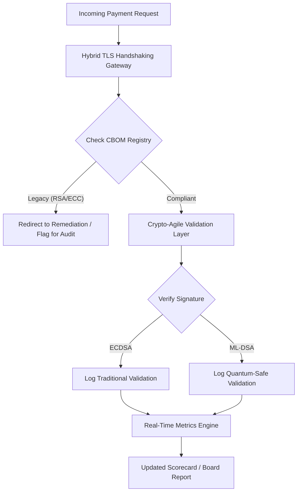

# Postkvanta säkerhetsscorecard 2026: ett mätramverk för styrelsen om fiduciär kryptoagilitet

<aside class="post-lead" aria-label="Artikelsammanfattning">

<strong>Sammanfattning.</strong> I juni 2026 har postkvantkryptografi (PQC) gått från experimentell teknisk fråga till primär fiduciär förpliktelse. Styrelser måste nu övervaka den systematiska migrationen av äldre kryptering till NIST FIPS 203 och 204 för att minska systemisk finansiell och operativ risk enligt DORA.

<strong>Huvudpunkter</strong>

<ul class="post-lead-takeaways">
  <li><strong>G20-samordning och hårda tidsfrister.</strong> Internationella tillsynsmyndigheter har satt slutet av 2020-talet som hård tidsfrist för kvantsäkra övergångar, vilket kräver att instituten visar kvantifierbara migrationsframsteg.</li>
  <li><strong>Cryptographic Bill of Materials (CBOM).</strong> Analogt med en software BOM är CBOM ett levande, automatiserat inventarium över samtliga kryptografiska tillgångar — nödvändigt för att säkerställa insyn i hela leveranskedjan.</li>
  <li><strong>Harvest-Now-Decrypt-Later (HNDL)-exponering.</strong> Motståndare avlyssnar och lagrar redan idag krypterad högvärdig wholesale-betalningsdata; att mildra detta kräver omedelbar utrullning av hybrida PQC-arkitekturer.</li>
  <li><strong>Fiduciär styrning via kryptoagilitet.</strong> Kryptoagilitet är ett mätbart styrningsmått. Förmågan att byta kryptografiska primitiver utan att bygga om kärnsystemen (med bibliotek som KyberLib) är nu ett styrelseansvar under SM&CR.</li>
</ul>

<strong>Vidare läsning:</strong> <a href="https://sebastienrousseau.com/2026-06-12-kyberlib-post-quantum-banking-migration-standards-code-2026">KyberLib och postkvantmigrationen i bank 2026</a>, <a href="https://sebastienrousseau.com/2023-11-19-crystals-kyber-the-safeguarding-algorithm-in-a-quantum-age/index.html">CRYSTALS-Kyber: skyddsalgoritmen i kvantåldern</a>.

</aside>
Postkvantsäkerhet är inte längre ett forskningsprojekt. "Tillsynsklockan" tickar mot de hårda tidsfristerna i slutet av 2020-talet. Färdigställandet av [NIST FIPS 203 (ML-KEM)](https://csrc.nist.gov/pubs/fips/203/final) och [NIST FIPS 204 (ML-DSA)](https://csrc.nist.gov/pubs/fips/204/final) har kodifierat standarderna för nyckelinkapsling och digitala signaturer.

Tillsynsorganen förväntar sig nu att Tier-1-banker går bortom pilotprogram. Under 2026 har fokus flyttats till industrialiseringen av dessa standarder. Att inte kunna visa en tydlig migrationsväg medför betydande regulatoriska sanktioner enligt [Digital Operational Resilience Act (DORA)](https://eur-lex.europa.eu/eli/reg/2022/2554/oj) och potentiellt personligt ansvar för styrelseledamöter som ignorerar det förutsebara hotet om kvantmöjliggjord dekryptering.

## 01. Kvantscorecardet på styrelsenivå

Följande nyckeltal ger ett standardiserat ramverk för att styrelser ska kunna utvärdera kvantberedskap och kryptografisk hälsa i Commercial and Investment Banking-bestånden (CIB).

### Tabell 1: PQC-scorecardets mått och toleranser

| Mått | Matematisk formel | Styrelsegodkänd tolerans | Risk om utanför tolerans |
| ---- | ---- | ---- | ---- |
| **Inventory Completeness Percentage (ICP)** | (Identifierade kryptotillgångar / Totalt skattade tillgångar) × 100 | > 98 % | Skuggkryptering och blinda fläckar i högvärdiga clearing-dataflöden. |
| **HNDL Exposure Rate (HER)** | (Långlivad data på äldre krypto / Total långlivad data) × 100 | < 5 % | Permanent kompromettering av affärshemligheter, statsskuldsregister och wholesale-betalningsuppgifter. |
| **NIST Migration Progress Rate (MPR)** | (System som kör FIPS 203/204 / Totala kritiska system) × 100 | > 60 % (vid YE 2026) | Regulatorisk bristande efterlevnad och uteslutning från G20-samordnade motparter. |
| **Crypto-Agility Readiness Index (CARI)** | (Appar med abstraherade kryptolager / Totala kärnappar) × 100 | > 85 % | Svår teknisk skuld och oförmåga att hantera framtida algoritmavvecklingar. |

## 02. Cryptographic Bill of Materials (CBOM)

ICP-måttet etableras genom en omfattande **CBOM-upptäcktsfas**. Detta är en automatiserad process som identifierar varje kryptografisk slutpunkt i hela verksamheten.

- **Slutpunktsupptäckt:** Skanning av interna och molnbaserade nätverk efter aktiva TLS-sessioner för att identifiera användning av äldre RSA eller ECC.
- **Nyckelinventarium:** Mappning av publika/privata nyckelpar till respektive ägare och exakta utgångsdatum.
- **Beroendekartläggning:** Identifiering av tredjepartsbibliotek och API:er som vilar på avvecklade algoritmer.

Denna upptäcktsfas skapar en enda sanningskälla och låter CISO rapportera kryptografisk hälsa med samma granularitet som finansiella resultat.

## 03. Eliminera HNDL-exponering i wholesale-betalningar

Motståndare riktar idag aktivt in sig på wholesale-betalningar och långlivade företagsdatabaser. Dessa "Harvest-Now-Decrypt-Later"-attacker (HNDL) innebär avlyssning och arkivering av dagens krypterade trafik.

Även om en kryptografiskt relevant kvantdator (CRQC) inte finns idag kommer den data som avlyssnas nu att vara sårbar i framtiden. Att mildra detta kräver högprioriterad migration av långlivad data (t.ex. identitetsuppgifter, 30-åriga obligationsavtal och juridiska arkiv), vilket direkt sänker HER-måttet. Uppgradering av betalningskanaler till hybrid PQC-traditionell kryptering (med ML-KEM tillsammans med X25519) ger omedelbart försvar mot arkivhot.

## 04. Operationalisera kryptoagilitet via välutformade gränssnitt

Kryptoagilitet realiseras genom tekniska abstraktioner. Moderna bibliotek som [KyberLib](https://sebastienrousseau.com/2026-06-12-kyberlib-post-quantum-banking-migration-standards-code-2026) visar hur utvecklare kan implementera kvantsäkra moduler utan att skriva om hela applikationsstacken.

- **Abstraherade omslag:** Applikationer anropar en generisk `encrypt()`- eller `sign()`-funktion i stället för algoritmspecifika rutiner.
- **Bytbarhet i drift:** Den underliggande modulen kan bytas från ECDSA till ML-DSA via konfigurationsändringar i stället för komplexa koddistributioner.

Denna arkitektur säkerställer att om en specifik PQC-algoritm komprometteras i framtiden kan organisationen ställa om på timmar i stället för år.

## 05. Valideringsflödet för kvantsäker ingress

Följande diagram illustrerar livscykeln för data som passerar säkerhetsperimetern i en kvantagil bankmiljö.

## Slutsats

Det kryptografiska beståndet i en Tier-1-bank är inte längre en CISO-fråga. Det är fiduciär infrastruktur. NIST FIPS 203 och 204 sätter algoritmerna; DORA artikel 5 sätter ansvarsytan; SM&CR fäster den vid en namngiven Senior Manager. Scorecardet ovan — Inventory Completeness, HNDL Exposure, Migration Progress, Crypto-Agility — ger styrelsen de fyra tal den behöver för att styra beståndet utan att läsa den kryptografiska koden.

Det tal som betyder mest är HNDL Exposure. Varje äldre krypterad post som idag ligger i ett wholesale-betalningsarkiv blir läsbar den dag den första kryptografiskt relevanta kvantdatorn levereras. Nedräkningen är tyst och asymmetrisk: försvarare kan bara agera på den data de håller, motståndare kan agera på data de redan exfiltrerade för flera år sedan. Ett 30-årigt företagsobligationsavtal krypterat med RSA-2048 år 2024 är ett avtal som förlorar sin konfidentialitetsgaranti den dag en CRQC går i drift.

[KyberLib](https://sebastienrousseau.com/2026-06-12-kyberlib-post-quantum-banking-migration-standards-code-2026) och dess motsvarigheter förvandlar detta från en flerårig plattformsomskrivning till en konfigurationsändring. Styrelsens uppgift är inte att skriva koden. Styrelsens uppgift är att kräva att Crypto-Agility Readiness Index — andelen kärnapplikationer bakom ett abstraherat kryptografiskt gränssnitt — passerar 85 % inom tolv månader, och att läsa det kvartalsvisa scorecardet.

<aside class="author-card" aria-label="Om författaren"><strong class="author-card-name"><a href="/about/index.html">Sebastien Rousseau</a></strong>Senior banktekniker som skriver om tillämpad AI, ISO 20022-migration, postkvantkryptografi för finansiella tjänster och den strukturella omvandlingen av wholesale-betalningar.20+ års erfarenhet från HSBC Commercial & Investment Bank, PayPal, Barclays och Shazam. <a href="https://www.linkedin.com/in/sebastienrousseau/" rel="external noopener">LinkedIn</a> &middot; <a href="https://github.com/sebastienrousseau" rel="external noopener">GitHub</a></aside>

Senast granskad <time datetime="2026-06-29">2026-06-29</time>.

