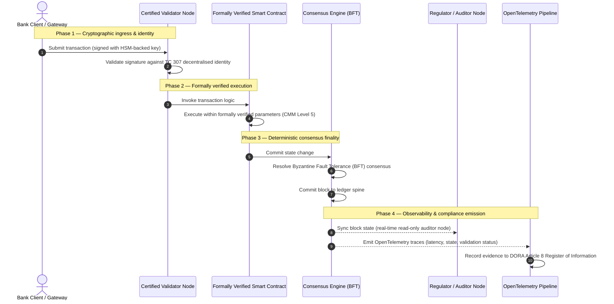

# Från bevis till sanning: varför certifierade blockkedjor kommer att definiera bankförtroendets nästa era

## Strategisk sammanfattning (det väsentliga)

Bankverksamheten på grossistmarknaden och de globala transaktionerna befinner sig 2026 vid en historisk brytpunkt. När finansiella tjänster övergår till inbyggt digitala clearingnätverk i realtid, och artificiell intelligens inför en probabilistisk icke-determinism, uppfyller de traditionella analoga, retrospektiva assuransmodellerna (såsom statiska, entitetsbaserade revisioner) inte längre de moderna kraven på riskhantering och fiduciärt ansvar.

Den tekniska kommittén ISO/IEC TC 307 har fastställt en standardiserad grund för teknik för distribuerade liggare. Verklig institutionell tillämpning kräver dock ett skifte från beskrivande vägledning till föreskrivande, oberoende certifierbar blockkedjeassurans. Genom att poängsätta liggarens styrning, konsensusintegritet, säkerheten i smarta kontrakt och kryptografisk smidighet mot en strikt femnivåers mognadsmodell (CMM) kan banker gå från fragmenterade, leverantörsspecifika antaganden till en certifierbar, styrelserevisionsbar finansiell sanning.

## Viktiga slutsatser

* **Det fiduciära friktionsgapet**: vi kan i dag certifiera banken (Basel III), molnet (ISO 27001) och AI-styrningssystemen (ISO 42001), men vi kan ännu inte certifiera den distribuerade liggare som allt mer avgör vad som är sant. Denna asymmetri är en betydande operativ sårbarhet.  
* **DORA framtvingar direkt fiduciärt ansvar**: enligt DORA artikel 5 bär bankernas styrelser direkt, icke-delegerbart personligt ansvar för den operativa motståndskraften i alla tredjeparts- och liggarutrullningar, med stränga personliga sanktioner enligt SM&CR-regimen vid brister.  
* **AI-revisionsryggraden**: där maskininlärning ger icke-reproducerbara, probabilistiska utfall levererar en certifierad blockkedja en deterministisk tillståndsfångst. Att registrera modellversioner, indata och valideringsbeslut on-chain uppfyller ISO 42001 och standarderna för modellriskhantering.  
* **Indexet över certifierade blockkedjor**: detta index formaliserar styrning, konsensus, smarta kontrakt och observerbarhet till ett verifierbart, revisionsklart styrkort på en CMM-skala från 0 till 5, och översätter tekniska mått till styrelsegodkända riskaptitförklaringar.

## 01. Det fiduciära friktionsgapet i digital bankverksamhet

I klassisk bankverksamhet är förtroende relationellt, institutionellt och retrospektivt. Det vilar på oberoende tredjepartsrevisorer som granskar det finansiella tillståndet vid fasta tidpunkter och stämmer av avvikelser mellan bilaterala liggarsilos. På de realtidsdrivna, API-styrda marknaderna 2026 inför denna modell prohibitiva latenser och strukturella risker.

När transaktioner avvecklas omedelbart, likviditetspooler under dagen hanteras dynamiskt av API-gateways och tillgångsägande tokeniseras över delade liggare, blir retrospektiva revisioner forensiska övningar snarare än förebyggande kontroller. Fiduciarier kan inte längre nöja sig med att certifiera den juridiska enheten. De måste certifiera själva det digitala substratet.

För närvarande verkar banker under en uppenbar arkitektonisk asymmetri:

1. **Certifierad molninfrastruktur**: hårdvarunoder, virtualiserade containrar och fysiska datacenter valideras mot ISO/IEC 27001 och SOC 2 Type II.  
2. **Certifierade förvaltningsprocesser**: policyer för operativ risk, kontinuitetsplaner och algoritmiska utrullningar styrs av strikta riskramverk.  
3. **Icke-certifierade liggarmotorer**: de distribuerade konsensusmekanismerna, valideringsnodernas leveranskedjor, de smarta kontraktens gränser och nätverkets styrningsmodeller lämnas åt icke-certifierade, skräddarsydda eller konsortiespecifika antaganden.

Denna asymmetri är en kritisk felpunkt. En bank kan köra en validerad applikation i en säker, ISO 27001-certifierad molncontainer, men om den containern skriver till en distribuerad liggare med centraliserad valideringskontroll, sårbara konsensusparametrar eller oreviderade smarta kontrakt, är transaktionsintegriteten komprometterad. För att överbrygga detta gap måste själva liggarmotorn bli ett certifierbart assuransobjekt.

## 02. Standardiseringsgrunden ISO/IEC TC 307

Det grundläggande arbetet för att standardisera distribuerade liggare utförs av den tekniska kommittén ISO/IEC TC 307 (Blockkedje- och distribuerad liggarteknik). I stället för att behandla blockkedjan som ett isolerat tekniskt protokoll behandlar TC 307 den som en institutionell förtroendeinfrastruktur och organiserar sitt arbete kring fem kärnpelare:

1. **Taxonomi och vokabulär (ISO 22739)**: fastställer en gemensam nomenklatur och säkerställer konsekventa juridiska och operativa definitioner mellan jurisdiktioner, finansiella system och institutioner.  
2. **Referensarkitektur (ISO/TR 23245)**: definierar gränserna, lagren, dataflödena och de funktionella komponenterna i ett regelefterlevande system för distribuerad liggare.  
3. **Säkerhet, integritet och smarta kontrakt (ISO/TR 23244 / ISO 23613)**: fastställer grundläggande säkerhetsriktlinjer för digitala tillgångssystem och beskriver bästa praxis för att mildra sårbarheter i smarta kontrakt och styra deras livscykel.  
4. **Interoperabilitetsramverk**: behandlar mekanismerna för data- och tillgångsutbyte mellan heterogena liggarnätverk och förhindrar att isolerade tokeniserade silos bildas.  
5. **Decentraliserad identitet och förtroendeankare**: integrerar liggarbaserade kryptografiska identifierare med formella infrastrukturer för publika nycklar (PKI) och statligt auktoriserade register.

Sammantaget signalerar TC 307 DLT:s övergång från ett skräddarsytt ingenjörsval till en standardiserad arkitektonisk disciplin. TC 307 förblir dock huvudsakligen beskrivande. Det definierar hur excellens ser ut (vägledning) men tillhandahåller inte det föreskrivande verifieringsprotokoll (assurans) som riskansvariga och tillsynsmyndigheter behöver för att godkänna produktionsutrullningar av kritiska eller viktiga funktioner (CIF).

## 03. Vägledning kontra assurans: den fiduciära distinktionen

Deltagare på finansmarknaderna inför inte teknik för att den är innovativ eller elegant; de inför den när den kan styras, revideras, försvaras och stämmas av mot kapitalkraven. Därför löses standardisering inom bankväsendet naturligt upp i två lager:

* **Vägledning (ramverket)**: skisserar bästa praxis, referensmål och arkitektoniska riktlinjer (t.ex. ISO/IEC TC 307, NIST-ramverk).  
* **Assurans (beviset)**: tillhandahåller oberoende, kontinuerliga och tredjepartsverifierbara bevis på att ramverket är implementerat och fungerar som avsett (t.ex. ISO 27001-certifiering, SOC 2-revisioner, tillsynsgranskningar).

Att förlita sig på icke-certifierad liggarkonsensus samtidigt som molninfrastrukturen certifieras är en kritisk regulatorisk lucka. En "oföränderlig" blockkedja är inte nödvändigtvis "institutionellt betrodd". Oföränderlighet garanterar endast att de inmatade uppgifterna förblir oförändrade; den verifierar inte om valideringsnoderna är säkra, om konsensusprotokollet är motståndskraftigt mot samverkan, om logiken i de smarta kontrakten är matematiskt korrekt eller om den kryptografiska nyckelhanteringen uppfyller de postkvantmandaten.

För att sluta detta gap formaliserar Indexet över certifierade blockkedjor 2026 dessa krav i en kvantifierbar mognadsmodell (CMM), mappad mot de globala bankregleringarna.

## 04. Indexet över certifierade blockkedjor 2026

För att göra det möjligt för högsta ledningen att utvärdera och certifiera sina liggarplattformar strukturerar detta index infrastrukturen för distribuerade liggare i fem reviderbara operativa lager, poängsatta på en CMM-skala från 0 till 5.

## Tabell 1: arkitekturen för Indexet över certifierade blockkedjor

| Indexlager | Mognadsnivå (CMM) | Tekniskt och operativt mått | Regulatorisk / fiduciär kontrollreferens |
| :---- | :---- | :---- | :---- |
| **Liggarstyrning** | **Nivå 0**: ad hoc-konsortium**Nivå 3**: automatiserad validatorkontroll och -rotation**Nivå 5**: decentraliserad kryptografisk identitetsförankring med flera parter | % valideringsnoder som drivs av granskade finansiella enheter; genomsnittlig tid att lösa validatortvister; noders geografiska spridning | **DORA artikel 5** (Styrning och organisation); **CPMI-IOSCO PFMI Princip 2** (Styrning) och **Princip 3** (Ramverk för övergripande riskhantering) |
| **Konsensusintegritet** | **Nivå 0**: enskild nod eller ogenomskinlig PoW**Nivå 3**: reviderad BFT med deterministisk finalitet**Nivå 5**: multijurisdiktionell, formellt verifierad konsensus med kontinuerlig latensövervakning | maximalt tolererbar konsensuslatens; tröskel för samverkansmotstånd; tillgänglighets-SLA vid simulerad nodpartition | **DORA artikel 6** (Ramverk för IKT-riskhantering); **CPMI-IOSCO PFMI Princip 8** (Avvecklingsfinalitet) |
| **Identitet och kryptografi** | **Nivå 0**: svaga RSA-/ECDSA-nycklar**Nivå 3**: multisignatur med HSM-baserad nyckelhantering**Nivå 5**: kvantsäkra hybridnycklar (FIPS 203 ML-KEM) och nollkunskapsgrindar för integritet | % liggartransaktioner signerade med HSM-baserade nycklar; beredskapspoäng för PQC-migrering; latens för ZK-bevis | **NIST FIPS 203 / 204**; **ISO/IEC 27001** (Ledningssystem för informationssäkerhet) |
| **Assurans av smarta kontrakt** | **Nivå 0**: oreviderade Solidity-skript**Nivå 3**: automatiserad kompilatorvalidering och extern revision**Nivå 5**: formellt verifierade, oföränderliga smarta kontrakt med brytaruppgraderingar | % smarta kontrakt med matematisk formell verifiering; antal kompilatorvarningar; täckning av sårbarhetsskanningar | **EBA:s riktlinjer för utkontraktering** (punkterna 81, 113-117); **DORA artikel 30** (Minimikrav för avtalsklausuler) |
| **Revision och observerbarhet** | **Nivå 0**: manuell logginsamling**Nivå 3**: strukturerade OTel-spårningar och skrivskyddade revisornoder**Nivå 5**: automatiserad, kontinuerlig avstämning mot registret enligt artikel 8 | % transaktioner täckta av OpenTelemetry-spårningar; latens från blockbekräftelse till revisornodsynkronisering | **BCBS 239** (Aggregering av riskdata); **DORA artikel 8** (Informationsregister / ITS-scheman) |

## Tabell 2: viktiga förtroendesignaler mappade mot globala bankstandarder

| Signal / riktmärke | Mått | Påverkan på bankplattformar | Regulatorisk källa |
| :---- | :---- | :---- | :---- |
| **Framsteg för ISO/IEC TC 307** | Övergång från ISO/TR tekniska rapporter till formella certifieringssystem | Etablerar det första standardiserade ramverket för att certifiera motorer för distribuerade liggare | **ISO/IEC JTC 1 / SC 44** (Teknik för distribuerade liggare) |
| **Prototypfas för Projekt Agorá** | Fler än 40 deltagande affärsbanker; test av en enhetlig liggare för tokeniserade insättningar | Flyttar gränsöverskridande clearing från meddelanden (SWIFT) till atomär tokeniserad avveckling | **Bank for International Settlements (BIS) Innovation Hub** |
| **Tredjepartsrevision enligt DORA artikel 30** | 100 % av nodleverantörer och infrastrukturvärdar reviderade enligt säkerhetskriterier | Eliminerar "skuggvalideringsnoder"; kräver full transparens i leveranskedjan | **Europeiska tillsynsmyndigheterna (ESA)** |
| **ISO/IEC 42001 (AI-styrning)** | AI-modell- och träningsloggar gjorda kryptografiskt oföränderliga on-chain | Använder blockkedjan som det oföränderliga bevisregistret ("revisionsryggrad") för maskininlärning | **ISO/IEC 42001:2023** (Informationsteknik — Artificiell intelligens) |
| **Kapitaltäckning enligt Basel III** | Minskning av kapitalbuffertar för operativ risk baserat på dokumenterad komplexitetsminskning | Standardiserade ramverk för operativ risk krediterar direkt den verifierade liggarmotståndskraften | **Baselkommittén för banktillsyn (BCBS)** |

## 05. AI:s "revisionsryggrad": probabilistisk intelligens på deterministisk infrastruktur

En av de mest kraftfulla strategiska rollerna för en certifierad blockkedja 2026 är att fungera som en **"revisionsryggrad"** för utrullningar av artificiell intelligens. Moderna finansiella system blir allt mer probabilistiska. Kreditbedömning, bedrägeridetektering i realtid, algoritmisk handel och autonoma kundinteraktioner drivs av maskininlärningsmodeller som utvecklas, driver och anpassar sig över tid. Dessa modeller är icke-deterministiska: givet samma indata vid två olika tidpunkter kan de ge olika utdata på grund av dynamiska vikter och kontinuerlig träning.

Denna icke-determinism medför en djupgående styrningsutmaning enligt **ISO/IEC 42001 (AI-styrning)** och standarderna för modellriskhantering (MRM) (såsom **SR 11-7 från USA:s Federal Reserve** och **SS1/23 från brittiska PRA**): *hur reviderar, förklarar och försvarar man beslut som inte är strikt reproducerbara?*

En certifierad distribuerad liggare tillhandahåller den deterministiska motvikten. Där AI-modeller verkar probabilistiskt registrerar den certifierade blockkedjan deras parametrar deterministiskt och etablerar en oföränderlig bevisryggrad:

* **Modellversionering och viktförankring**: varje utrullad modellversion, dess tillhörande vikter och kontrollsummorna för dess träningsdata hashas och skrivs till liggaren vid byggtillfället, vilket uppfyller kraven på leveranskedja enligt **SLSA Level 3**.  
* **Kontextuell indataloggning**: när en AI-modell fattar ett kritiskt beslut (t.ex. godkänner ett lån eller flaggar en transaktion) skrivs de exakta kontextuella indata och modellhashvärdena till liggaren, vilket skapar en manipuleringssäker historik.  
* **Reviderbarhet utan kodåtkomst**: om en tillsynsmyndighet frågar "varför avslog er modell denna kreditansökan den 3 juni?" behöver banken varken exponera sin proprietära kod eller försöka återskapa modellens exakta tillstånd. Den lägger fram det kryptografiskt signerade on-chain-registret över indata, vikter och valideringstillstånd.

Genom att förankra maskininlärningsmodellernas probabilistiska beslut i en certifierad blockkedjas deterministiska konsensus skapar institutionen en försvarbar, rekonstruerbar och oberoende verifierbar tidslinje över automatiserade åtgärder.

## 06. Att visualisera den certifierade pipelinen från konsensus till revision

Följande sekvensdiagram illustrerar livscykeln för en transaktion som passerar en certifierad blockkedjeplattform och visar hur valideringsgrindar, konsensusintegritet, exekvering av smarta kontrakt och telemetriutsändning griper in i varandra för att producera styrelseklara regulatoriska bevis:

Den kritiska vägen för denna transaktionssekvens kräver att varje validerings-, exekverings- och konsensussteg är kryptografiskt signerat, vilket säkerställer proveniens från början till slut. Tillsynsmyndighetens revisornod synkroniserar blocktillståndet i realtid och eliminerar behovet av retrospektiv, manuell finansiell avstämning.

## 07. Styrelsehandboken för höga chefer

För att framgångsrikt navigera övergången från organisatoriskt till infrastrukturellt förtroende bör bankernas chefer och höga ledning omedelbart genomföra fyra centrala direktiv:

1. **Gör liggarrevisioner obligatoriska i företagsriskhantering (ERM)**: tillämpa en policy som innebär att ingen plattform för distribuerad liggare — privat, publik eller konsortiebaserad — får rullas ut för kritiska eller viktiga funktioner (CIF) utan att ha reviderats mot den femlagrade **arkitekturen för Indexet över certifierade blockkedjor** (minst CMM Nivå 3).  
2. **Integrera blockkedjor som ISO 42001-bevisryggrad för AI**: instruera Chief Risk Officer och den ledande AI-arkitekten att integrera alla maskininlärningsmodeller med hög påverkan med en certifierad blockkedja och skapa ett manipuleringssäkert revisionsregister över modellversioner, vikter, indata och beslut.  
3. **Revidera valideringsnodernas leveranskedja (DORA artikel 30)**: kräv att inköpsavdelningen reviderar alla tredjepartsenheter som är värdar för valideringsnoder eller hanterar molnhosting för DLT-nätverk, med samma cybersäkerhets- och operativa motståndskraftsstandarder som tillämpas på bankens interna molnnoder.  
4. **Anpassa liggararkitekturer till CPMI-IOSCO och BCBS 239**: instruera plattformsingenjörsteamet att anpassa liggarens utdatatelemetri direkt till datarapporteringskraven i **BCBS 239** och säkerställa att konsensus- och avvecklingsfinalitetsparametrarna strikt uppfyller **CPMI-IOSCO Princip 8 och 9**.

## 08. Vanliga frågor

**Är ISO/IEC TC 307 en certifieringsstandard?**  
Nej. ISO/IEC TC 307 är en teknisk kommitté som fastställer vokabulär, referensarkitekturer och säkerhetsriktlinjer. Även om den definierar "hur excellens ser ut" (vägledning) måste branschen operationalisera dessa dokument till formella, reviderbara certifieringssystem (assurans) för att tillfredsställa banktillsynsmyndigheterna.

**Hur stöder en certifierad blockkedja efterlevnaden av DORA?**  
Enligt DORA artikel 5 bär bankstyrelser direkt personligt ansvar för teknisk motståndskraft. En certifierad blockkedja tillhandahåller verifierbara kryptografiska bevis på konsensusintegritet, kontroll över validatorernas leveranskedja och säkerhet i smarta kontrakt, vilket ger styrelseledamöterna de dokumenterbara "rimliga åtgärder" som behövs för att försvara sig mot anspråk på personligt ansvar enligt SM&CR.

Vad är skillnaden mellan en traditionell liggarrevision och en revision av en certifierad blockkedja?  
En traditionell revision är retrospektiv: den verifierar manuella poster och statiska filer efter att transaktioner har avvecklats. En revision av en certifierad blockkedja är kontinuerlig och sker i realtid; valideringsnoderna, BFT-konsensusmotorn och de formellt verifierade smarta kontrakten är certifierade att exekvera transaktioner deterministiskt och sänder ut strukturerad telemetri (OpenTelemetry) som kontinuerligt validerar systemets hälsa.

Kan publika blockkedjor certifieras för bankbruk?  
I de flesta jurisdiktioner uppfyller rent tillståndslösa publika blockkedjor inte bankregleringarna på grund av avsaknad av validatoridentitetsverifiering, oförutsägbara transaktionskostnader och icke-deterministisk finalitet (t.ex. probabilistiska proof-of-work-/stake-förgreningar). Certifierade blockkedjor inom bankväsendet använder vanligtvis tillståndsbaserade företagsarkitekturer eller hårt reglerade publik-hybridarkitekturer, där operatörerna av valideringsnoder är identifierade och reviderade finansiella enheter.

## 09. Referenser

* Baselkommittén för banktillsyn (BCBS), 2013. *Principles for effective risk data aggregation and reporting (BCBS 239)*. Basel: Bank for International Settlements. Tillgänglig på: [https://www.bis.org/publ/bcbs239.pdf](https://www.bis.org/publ/bcbs239.pdf).  
* Committee on Payments and Market Infrastructures och Technical Committee of the International Organization of Securities Commissions (CPMI-IOSCO), 2012. *Principles for financial market infrastructures*. Basel: Bank for International Settlements. Tillgänglig på: [https://www.bis.org/cpmi/publ/d101a.pdf](https://www.bis.org/cpmi/publ/d101a.pdf).  
* Europeiska bankmyndigheten (EBA), 2019. *EBA/GL/2019/02 — Guidelines on outsourcing arrangements*. Paris: EBA. Tillgänglig på: [https://www.eba.europa.eu/regulation-and-policy/internal-governance/guidelines-on-outsourcing-arrangements](https://www.eba.europa.eu/regulation-and-policy/internal-governance/guidelines-on-outsourcing-arrangements).  
* Europaparlamentet och Europeiska unionens råd, 2022. *Förordning (EU) 2022/2554 om digital operativ motståndskraft för finanssektorn (DORA)*. Bryssel: Europeiska unionens officiella tidning. Tillgänglig på: [https://eur-lex.europa.eu/legal-content/SV/TXT/?uri=CELEX%3A32022R2554](https://eur-lex.europa.eu/legal-content/SV/TXT/?uri=CELEX%3A32022R2554).  
* ISO/IEC JTC 1/SC 42, 2023. *ISO/IEC 42001:2023 — Information technology — Artificial intelligence — Management system*. Genève: Internationella standardiseringsorganisationen. Tillgänglig på: [https://www.iso.org/standard/81230.html](https://www.iso.org/standard/81230.html).  
* Tekniska kommittén ISO/IEC 307, 2020. *ISO/IEC 22739:2020 — Blockchain and distributed ledger technologies — Vocabulary*. Genève: Internationella standardiseringsorganisationen. Tillgänglig på: [https://www.iso.org/standard/73771.html](https://www.iso.org/standard/73771.html).  
* National Institute of Standards and Technology (NIST), 2026. *First Three Finalized Post-Quantum Encryption Standards (FIPS 203, 204, and 205)*. Gaithersburg: U.S. Department of Commerce. Tillgänglig på: [https://www.nist.gov/news-events/news/2024/08/nist-releases-first-3-finalized-post-quantum-encryption-standards](https://www.nist.gov/news-events/news/2024/08/nist-releases-first-3-finalized-post-quantum-encryption-standards).
