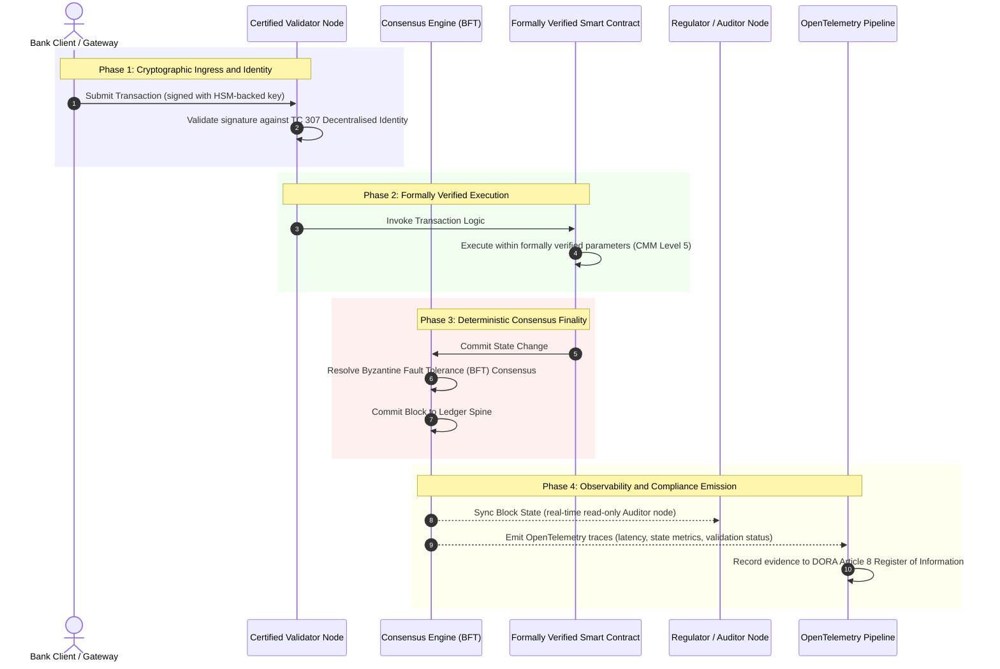

# Från bevis till sanning: varför certifierade blockkedjor kommer att definiera nästa era av bankförtroende

**Oföränderligt är inte detsamma som betrott.** När wholesale-banken går över till avveckling i realtid och probabilistisk AI har liggaren som avgör vad som är sant blivit det enda lager som bankerna fortfarande inte kan certifiera. De certifierar enheten enligt Basel III, molnet enligt ISO 27001 och sin AI enligt ISO 42001, men den distribuerade liggaren, dess styrning, konsensus, kryptografi och smarta kontrakt, lämnas åt leverantörsspecifika antaganden. Den här rapporten hävdar att stängningen av det förtroendegapet kräver ett steg från vägledning enligt ISO/IEC TC 307 till föreskrivande assurans: att poängsätta liggaren mot ett femnivåindex för certifierad blockkedja som förvandlar tekniska mätvärden till styrelserevisbar, DORA-försvarbar sanning.

<!-- lead-start -->
<aside class="post-lead" aria-label="Artikelsammanfattning">

<strong>TL;DR.</strong> Banker certifierar enheten, molnet och sin AI, men inte liggaren som allt oftare avgör vad som är sant. ISO/IEC TC 307 ger vägledning, inte assurans. Ett femnivåindex för certifierad blockkedja poängsätter liggarens styrning, konsensusintegritet, identitet och kryptografi, assurans för smarta kontrakt och observerbarhet mot en mognadsmodell, stänger förtroendegapet och ger probabilistisk AI en deterministisk revisionsryggrad.

<strong>Viktiga slutsatser</strong>

<ul class="post-lead-takeaways">
  <li><strong>Det förtroendemässiga friktionsgapet.</strong> Banken (Basel III), molnet (ISO 27001) och AI-styrningssystemet (ISO 42001) kan certifieras; den distribuerade liggaren som avgör vad som är sant kan ännu inte det. Den asymmetrin är en aktiv operativ sårbarhet.</li>
  <li><strong>DORA gör det personligt.</strong> Enligt DORA Article 5 bär bankstyrelser ett direkt ansvar som inte kan delegeras för motståndskraften i tredjeparts- och liggardriftsättningar, med personliga SM&amp;CR-sanktioner vid brister.</li>
  <li><strong>AI-revisionsryggraden.</strong> Maskininlärning är icke-reproducerbar; en certifierad blockkedja fångar modellversioner, indata och valideringsbeslut deterministiskt på kedjan och uppfyller ISO 42001 och standarder för modellriskhantering.</li>
  <li><strong>Indexet för certifierad blockkedja.</strong> Styrning, konsensus, kryptografi, smarta kontrakt och observerbarhet blir ett CMM-styrkort från 0 till 5 som översätter tekniska mätvärden till styrelsegodkända riskaptitförklaringar (Risk Appetite Statements).</li>
</ul>

<strong>Relaterad läsning:</strong> <a href="https://sebastienrousseau.com/2026-07-02-certified-blockchains-banking-trust-tc307-assurance-2026">Certifierade blockkedjor och bankförtroende: TC 307-assurans</a>, <a href="https://sebastienrousseau.com/2026-07-24-global-payments-outlook-operating-model-risk-revenue">Den globala betalningsutsikten för 2026</a>.

</aside>
<!-- lead-end -->

> **Sammanfattning för ledningen**
>
> - **Wholesale-banken står vid en vändpunkt.** Clearing i realtid och probabilistisk AI bryter den analoga, retrospektiva assuransmodellen: statiska, enhetsbaserade revisioner uppfyller inte längre moderna krav på riskhantering eller förtroende.
> - **TC 307 är en utgångspunkt, inte ett certifikat.** ISO/IEC TC 307 har standardiserat vokabulär, referensarkitektur och säkerhetsvägledning för distribuerade liggare, men det är beskrivande. Det definierar hur god praxis ser ut; det ger inte den föreskrivande verifiering som riskansvariga och tillsynsmyndigheter behöver för att godkänna produktionssättning.
> - **Assurans innebär att poängsätta liggaren.** Styrning, konsensusintegritet, säkerhet i smarta kontrakt och kryptografisk smidighet, poängsatt mot en strikt mognadsmodell i fem nivåer, flyttar bankerna från lappverk av leverantörsspecifika antaganden till certifierbar, styrelserevisbar finansiell sanning.
> - **Liggaren är revisionsryggraden för AI.** Att förankra modellversioner, indata och valideringsbeslut i deterministisk konsensus ger icke-reproducerbar maskininlärning en försvarbar, rekonstruerbar bevisföring enligt ISO 42001, SR 11-7 och PRA SS1/23.

## Det förtroendemässiga friktionsgapet i digital bankverksamhet

I klassisk bankverksamhet är förtroendet relationellt, institutionellt och retrospektivt. Det bygger på oberoende tredjepartsrevisorer som granskar det finansiella läget vid statiska tidpunkter och stämmer av avvikelser mellan bilaterala liggarsilon. På de realtidsstyrda, API-drivna marknaderna 2026 medför den modellen oacceptabla fördröjningar och strukturella risker.

När transaktioner avvecklas omedelbart, likviditetspooler under dagen hanteras dynamiskt av API-gateways och tillgångsägande tokeniseras över delade liggare blir retrospektiva revisioner forensiska övningar snarare än förebyggande kontroller. Förvaltare kan inte längre enbart förlita sig på att certifiera den juridiska enheten. De måste certifiera själva den digitala grunden.

I dag verkar bankerna under en påtaglig arkitektonisk asymmetri:

1. **Certifierad molninfrastruktur**: Hårdvarunoder, virtualiserade containrar och fysiska datacenter valideras mot ISO/IEC 27001 och SOC 2 Type II-kontroller.  
2. **Certifierade förvaltningsprocesser**: Policyer för operativ risk, kontinuitetsplaner och algoritmiska driftsättningar styrs enligt strikta ramverk för risk.  
3. **Ocertifierade liggarmotorer**: De centrala distribuerade konsensusmekanismerna, leveranskedjor för valideringsnoder, gränser för smarta kontrakt och modeller för nätverksstyrning lämnas åt ocertifierade, egenutvecklade eller konsortiespecifika antaganden.

Den här asymmetrin är en allvarlig felkälla. En bank kan köra en validerad applikation i en säker, ISO 27001-certifierad molncontainer, men om containern skriver till en distribuerad liggare med centraliserad valideringskontroll, sårbara konsensusparametrar eller oreviderade smarta kontrakt är transaktionsintegriteten komprometterad. För att överbrygga gapet måste själva liggarmotorn bli ett certifierbart assuransobjekt.

## Standardiseringsgrunden ISO/IEC TC 307

Det grundläggande arbetet med att standardisera distribuerade liggare etableras av ISO/IEC:s tekniska kommitté 307 (TC 307\) (blockkedja och teknik för distribuerad liggare). I stället för att behandla blockkedja som ett isolerat tekniskt protokoll hanterar TC 307 den som en institutionell förtroendeinfrastruktur och organiserar sitt arbete i fem centrala pelare:

1. **Taxonomi och vokabulär (ISO 22739\)**: Fastställer en gemensam nomenklatur och säkerställer konsekventa juridiska och operativa definitioner över olika jurisdiktioner, finansiella system och institutioner.  
2. **Referensarkitektur (ISO/TR 23245\)**: Definierar gränserna, lagren, dataflödena och de funktionella komponenterna i ett efterlevnadsdugligt system för distribuerad liggare.  
3. **Säkerhet, integritet och smarta kontrakt (ISO/TR 23244 / ISO 23613\)**: Fastställer grundläggande säkerhetsriktlinjer för system för digitala tillgångar och beskriver bästa praxis för att åtgärda sårbarheter i smarta kontrakt och för styrning av deras livscykel.  
4. **Ramverk för interoperabilitet**: Hanterar mekanismerna för data- och tillgångsutbyte mellan heterogena liggarnätverk och förhindrar att isolerade tokeniserade silon uppstår.  
5. **Decentraliserad identitet och förtroendeankare**: Integrerar liggarbaserade kryptografiska identifierare med formella infrastrukturer för publika nycklar (PKI) och statligt godkända register.

Sammantaget signalerar TC 307 övergången för DLT från ett egenutvecklat tekniskt val till en standardiserad arkitektonisk disciplin. TC 307 förblir dock i huvudsak beskrivande. Det definierar hur god praxis ser ut (vägledning), men det tillhandahåller inte det föreskrivande verifieringsprotokoll (assurans) som riskansvariga och tillsynsmyndigheter kräver för att godkänna produktionssättning av kritiska eller viktiga funktioner (CIFs).

## Vägledning kontra assurans: den förtroendemässiga skillnaden

Aktörerna på finansmarknaden driftsätter inte teknik för att den är innovativ eller elegant; de driftsätter den när den kan styras, revideras, försvaras och stämmas av mot krav på kapitalreserver. Därför delar standardisering inom bank naturligt upp sig i två lager:

* **Vägledning (ramverket)**: Beskriver bästa praxis, referensmål och arkitektoniska riktlinjer (t.ex. ISO/IEC TC 307, NIST-ramverk).  
* **Assurans (beviset)**: Tillhandahåller oberoende, kontinuerliga och tredjepartsverifierbara belägg för att ramverket är implementerat och fungerar som avsett (t.ex. ISO 27001-certifiering, SOC 2-revisioner, tillsynsgranskningar).

Att förlita sig på ocertifierad liggarkonsensus samtidigt som molninfrastrukturen certifieras är ett kritiskt regulatoriskt gap. En blockkedja som är ”oföränderlig” är inte nödvändigtvis ”institutionellt betrodd”. Oföränderlighet garanterar bara att inmatade data är oförändrade; den verifierar inte att valideringsnoderna är säkra, att konsensusprotokollet är motståndskraftigt mot samverkan, att logiken i de smarta kontrakten är matematiskt korrekt eller att den kryptografiska nyckelhanteringen uppfyller postkvantkraven.

För att stänga gapet formaliserar 2026 års index för certifierad blockkedja dessa krav i en kvantifierbar mognadsmodell (CMM) som är kopplad till globala bankregler.

## 2026 års index för certifierad blockkedja

För att göra det möjligt för ledningen att utvärdera och certifiera sina liggarplattformar strukturerar det här indexet infrastrukturen för distribuerad liggare i fem reviderbara operativa lager, poängsatta på en CMM-skala från 0 till 5.

### Tabell 1: Arkitekturen för indexet för certifierad blockkedja

| Indexlager | Mognadsnivå (CMM) | Tekniskt och operativt mätvärde | Regulatorisk/förtroendemässig kontrollreferens |
| ---- | ---- | ---- | ---- |
| **Liggarstyrning** | **Nivå 0**: Ad hoc-konsortium**Nivå 3**: Automatiserad kontroll och rotation av valideringsnoder**Nivå 5**: Decentraliserad kryptografisk identitetsförankring med flera parter | Andel valideringsnoder som drivs av granskade finansiella enheter; genomsnittlig tid för att lösa valideringstvister; geografisk fördelning av noder | **DORA Article 5** (styrning och organisation); **CPMI-IOSCO PFMI Principle 2** (styrning) och **Principle 3** (ramverk för samlad riskhantering) |
| **Konsensusintegritet** | **Nivå 0**: Ensam nod eller ogenomskinlig POW**Nivå 3**: Reviderad BFT med deterministisk slutgiltighet**Nivå 5**: Formellt verifierad konsensus över flera jurisdiktioner med kontinuerlig latensövervakning | Högsta tolerabla konsensuslatens; tröskel för samverkansmotstånd; drifttids-SLA vid simulerad nodpartitionering | **DORA Article 6** (ramverk för IKT-riskhantering); **CPMI-IOSCO PFMI Principle 8** (avvecklingens slutgiltighet) |
| **Identitet och kryptografi** | **Nivå 0**: Svaga RSA-/ECDSA-nycklar**Nivå 3**: Multisignatur med HSM-baserad nyckelhantering**Nivå 5**: Kvantsäkra hybridnycklar (FIPS 203 ML-KEM) och integritetsgrindar med nollkunskapsbevis | Andel liggartransaktioner signerade med HSM-baserade nycklar; beredskapspoäng för PQC-migrering; latens för ZK-bevis | **NIST FIPS 203 / 204**; **ISO/IEC 27001** (informationssäkerhetshantering) |
| **Assurans för smarta kontrakt** | **Nivå 0**: Oreviderade Solidity-skript**Nivå 3**: Automatiserad kompilatorvalidering och extern revision**Nivå 5**: Formellt verifierade, oföränderliga smarta kontrakt med uppgraderingar via kretsbrytare | Andel smarta kontrakt med matematisk formell verifiering; antal kompilatorvarningar; täckning för sårbarhetsskanning | **EBA Guidelines on Outsourcing Arrangements** (punkterna 81, 113-117); **DORA Article 30** (minimikrav på avtalsklausuler) |
| **Revision och observerbarhet** | **Nivå 0**: Manuell logginsamling**Nivå 3**: Strukturerade OTel-spår och skrivskyddade revisorsnoder**Nivå 5**: Automatiserad, kontinuerlig avstämning mot Article 8-registret | Andel transaktioner som täcks av OpenTelemetry-spår; latens från block-commit i liggaren till synkronisering av revisorsnod | **BCBS 239** (aggregering av riskdata); **DORA Article 8** (informationsregister / ITS-scheman) |

### Tabell 2: Viktiga förtroendesignaler kopplade till globala bankstandarder

| Signal/riktmärke | Mätvärde | Påverkan på bankplattformar | Regulatorisk källa |
| ---- | ---- | ---- | ---- |
| **Framsteg för ISO/IEC TC 307** | Övergång från tekniska rapporter enligt ISO/TR till formella certifieringssystem | Etablerar det första standardiserade ramverket för att certifiera motorer för distribuerad liggare | **ISO/IEC JTC 1 / SC 44** (teknik för distribuerad liggare) |
| **Prototypfasen för Project Agorá** | Fler än 40 deltagande affärsbanker; test av tokeniserade insättningar på en enhetlig liggare | Flyttar gränsöverskridande clearing från meddelanden (SWIFT) till atomär tokeniserad avveckling | **Bank for International Settlements (BIS) Innovation Hub** |
| **Tredjepartsrevision enligt DORA Article 30** | 100 % av nodleverantörer och infrastrukturvärdar revideras mot säkerhetskriterier | Eliminerar ”skuggvalideringsnoder”; kräver fullständig transparens i leveranskedjan | **European Supervisory Authorities (ESA)** |
| **ISO/IEC 42001 (AI-styrning)** | Kryptografiskt oföränderliggjorda AI-modell- och träningsloggar på kedjan | Använder blockkedjan som den oföränderliga bevisliggaren (”revisionsryggrad”) för maskininlärning | **ISO/IEC 42001:2023** (informationsteknik, artificiell intelligens) |
| **Basel III-kapitaltäckning** | Minskning av kapitalbuffertar för operativ risk baserat på dokumenterad komplexitetsminskning | Standardiserade ramverk för operativ risk tillgodoräknar direkt verifierad liggarmotståndskraft | **Basel Committee on Banking Supervision (BCBS)** |

## AI-”revisionsryggraden”: probabilistisk intelligens på deterministisk infrastruktur

En av de mest kraftfulla strategiska rollerna för en certifierad blockkedja 2026 är att fungera som en **”revisionsryggrad”** för driftsättningar av artificiell intelligens. Moderna finansiella system blir alltmer probabilistiska. Kreditbedömning, bedrägeriupptäckt i realtid, algoritmisk handel och autonoma kundinteraktioner drivs av maskininlärningsmodeller som utvecklas, driver och anpassas över tid. Dessa modeller är icke-deterministiska: med samma indata vid två olika tillfällen kan de ge olika utdata på grund av dynamiska vikter och kontinuerlig träning.

Denna icke-determinism medför en djupgående styrningsutmaning enligt **ISO/IEC 42001 (AI-styrning)** och standarder för **modellriskhantering (MRM)** (såsom **US Federal Reserve SR 11-7** och **UK PRA SS1/23**): *Hur reviderar, förklarar och försvarar man beslut som inte är strikt reproducerbara?*

En certifierad distribuerad liggare utgör den deterministiska motvikten. Medan AI-modeller arbetar probabilistiskt registrerar den certifierade blockkedjan deras parametrar deterministiskt och etablerar en oföränderlig bevisryggrad:

* **Modellversionering och viktförankring**: Varje driftsatt modellversion, dess tillhörande vikter och kontrollsummor för träningsdata hashas och skrivs till liggaren vid byggtillfället och uppfyller kraven i leveranskedjan enligt **SLSA Level 3**.  
* **Kontextuell indataloggning**: När en AI-modell fattar ett kritiskt beslut (t.ex. beviljar ett lån eller flaggar en transaktion) skrivs de exakta kontextuella indata och modellhasharna till liggaren, vilket skapar en manipuleringssäker historik.  
* **Reviderbarhet utan kodåtkomst**: Om en tillsynsmyndighet frågar ”Varför avslog er modell den här kreditansökan den 3 juni?” behöver banken inte exponera proprietär kod eller försöka återskapa det exakta modelltillståndet. Den lägger fram den kryptografiskt signerade liggarposten på kedjan över indata, vikter och valideringstillstånd.

Genom att förankra maskininlärningsmodellernas probabilistiska beslut i en certifierad blockkedjas deterministiska konsensus skapar institutionen en försvarbar, rekonstruerbar och oberoende verifierbar tidslinje över automatiserade åtgärder.

## Visualisering av pipelinen från certifierad konsensus till revision

Följande sekvensdiagram illustrerar livscykeln för en transaktion som passerar genom en certifierad blockkedjeplattform och visar hur valideringsgrindar, konsensusintegritet, exekvering av smarta kontrakt och telemetriutsändning samverkar för att producera styrelseklara regulatoriska belägg:

Den kritiska vägen för denna transaktionssekvens kräver att varje validerings-, exekverings- och konsensussteg är kryptografiskt signerat, vilket säkerställer proveniens från början till slut. Tillsynsmyndighetens revisorsnod synkroniserar blocktillståndet i realtid, vilket eliminerar behovet av retrospektiv, manuell finansiell avstämning.

## Styrelserummets spelbok för ledande befattningshavare

För att framgångsrikt hantera övergången från organisatoriskt förtroende till infrastrukturellt förtroende bör bankledningar och ledande befattningshavare omedelbart genomföra fyra centrala direktiv:

1. **Kräv liggarrevisioner i verksamhetens riskhantering (ERM)**: Inför en policy om att ingen plattform för distribuerad liggare, vare sig privat, publik eller konsortiebaserad, får driftsättas för kritiska eller viktiga funktioner (CIFs) om den inte har reviderats mot den femlagriga **arkitekturen för indexet för certifierad blockkedja** (minst CMM-nivå 3).  
2. **Integrera blockkedjor som ISO 42001-bevisryggraden för AI**: Ge riskchefen (CRO) och den ledande AI-arkitekten i uppdrag att integrera alla maskininlärningsmodeller med stor påverkan med en certifierad blockkedja och skapa en manipuleringssäker revisionsliggare över modellversioner, vikter, indata och beslut.  
3. **Revidera leveranskedjan för valideringsnoder (DORA Article 30\)**: Kräv att inköpsavdelningen reviderar alla tredjepartsenheter som är värdar för valideringsnoder eller hanterar molnhosting för DLT-nätverk, och kräv efterlevnad av samma standarder för cybersäkerhet och operativ motståndskraft som tillämpas på bankens interna molnnoder.  
4. **Anpassa liggararkitekturer till CPMI-IOSCO och BCBS 239**: Instruera plattformsteknikteamet att anpassa liggarens utdatatelemetri direkt till rapporteringskraven i **BCBS 239** och säkerställ att parametrarna för konsensus och avvecklingens slutgiltighet strikt uppfyller **CPMI-IOSCO Principles 8 and 9**.

## Vanliga frågor

**Är ISO/IEC TC 307 en certifieringsstandard?**  
Nej. ISO/IEC TC 307 är en teknisk kommitté som fastställer vokabulär, referensarkitekturer och säkerhetsriktlinjer. Även om den definierar ”hur god praxis ser ut” (vägledning) måste branschen omsätta dessa dokument i formella, reviderbara certifieringssystem (assurans) för att tillfredsställa banktillsynsmyndigheterna.

**Hur stöder en certifierad blockkedja efterlevnad av DORA?**  
Enligt DORA Article 5 bär bankstyrelser direkt, personligt ansvar för teknikens motståndskraft. En certifierad blockkedja tillhandahåller verifierbara, kryptografiska belägg för konsensusintegritet, kontroll över valideringsnodernas leveranskedja och säkerhet i smarta kontrakt, vilket ger styrelseledamöterna de dokumenterbara ”rimliga åtgärder” som behövs för att försvara sig mot personliga ansvarskrav enligt SM\&CR.

**Vad är skillnaden mellan en traditionell liggarrevision och en certifierad blockkedjerevision?**  
En traditionell revision är retrospektiv och verifierar manuella poster och statiska filer efter att transaktioner har clearats. En certifierad blockkedjerevision är kontinuerlig och sker i realtid; valideringsnoderna, BFT-konsensusmotorn och de formellt verifierade smarta kontrakten är certifierade att exekvera transaktioner deterministiskt och sänder strukturerad telemetri (OpenTelemetry) som fortlöpande validerar systemets hälsa.

**Kan publika blockkedjor certifieras för bankbruk?**  
I de flesta jurisdiktioner uppfyller rent tillståndslösa publika blockkedjor inte bankregleringarna på grund av avsaknaden av identitetsverifiering av validerare, oförutsägbara gas-/transaktionskostnader och icke-deterministisk slutgiltighet (t.ex. probabilistiska forkar i proof-of-work/stake). Certifierade blockkedjor inom bank använder vanligtvis tillståndsbaserade företagsarkitekturer eller starkt reglerade publik-hybrida arkitekturer där operatörerna av valideringsnoder är identifierade och reviderade finansiella enheter.

## Referenser

* Basel Committee on Banking Supervision (BCBS), 2013\. *Principles for effective risk data aggregation and reporting (BCBS 239\)*. Basel: Bank for International Settlements. Tillgänglig på: [Basel Committee on Banking Supervision (BCBS), 2013\.](https://www.bis.org/publ/bcbs239.pdf "Basel Committee on Banking Supervision (BCBS), 2013\.").  
* Committee on Payments and Market Infrastructures and Technical Committee of the International Organisation of Securities Commissions (CPMI-IOSCO), 2012\. *Principles for financial market infrastructures*. Basel: Bank for International Settlements. Tillgänglig på: [Committee on Payments and Market Infrastructures and Technical Committee of the International Organisation of Securities Commissions (CPMI-IOSCO), 2012\.](https://www.bis.org/cpmi/publ/d101a.pdf "Committee on Payments and Market Infrastructures and Technical Committee of the International Organisation of Securities Commissions (CPMI-IOSCO), 2012\.").  
* European Banking Authority (EBA), 2019\. *EBA/GL/2019/02, Guidelines on outsourcing arrangements*. Paris: EBA. Tillgänglig på: [European Banking Authority (EBA), 2019\.](https://www.eba.europa.eu/regulation-and-policy/internal-governance/guidelines-on-outsourcing-arrangements "European Banking Authority (EBA), 2019\.").  
* European Parliament and Council of the European Union, 2022\. *Regulation (EU) 2022/2554 on digital operational resilience for the financial sector (DORA)*. Brussels: Official Journal of the European Union. Tillgänglig på: [European Parliament and Council of the European Union, 2022\.](https://eur-lex.europa.eu/legal-content/EN/TXT/?uri=CELEX%3A32022R2554 "European Parliament and Council of the European Union, 2022\.").  
* ISO/IEC JTC 1/SC 42, 2023\. *ISO/IEC 42001:2023, Information technology, Artificial intelligence, Management system*. Geneva: International Organisation for Standardisation. Tillgänglig på: [ISO/IEC JTC 1/SC 42, 2023\.](https://www.iso.org/standard/81230.html "ISO/IEC JTC 1/SC 42, 2023\.").  
* ISO/IEC Technical Committee 307, 2020\. *ISO/IEC 22739:2020, Blockchain and distributed ledger technologies, Vocabulary*. Geneva: International Organisation for Standardisation. Tillgänglig på: [ISO/IEC Technical Committee 307, 2020\.](https://www.iso.org/standard/73771.html "ISO/IEC Technical Committee 307, 2020\.").  
* National Institute of Standards and Technology (NIST), 2026\. *First Three Finalised Post-Quantum Encryption Standards (FIPS 203, 204, and 205\)*. Gaithersburg: U.S. Department of Commerce. Tillgänglig på: [National Institute of Standards and Technology (NIST), 2026\.](https://www.nist.gov/news-events/news/2024/08/nist-releases-first-3-finalised-post-quantum-encryption-standards "National Institute of Standards and Technology (NIST), 2026\.").
