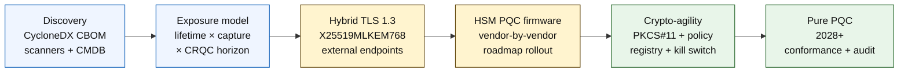

## 2026 ஆம் ஆண்டில் குவாண்டம்-பாதுகாப்பு வங்கிக் குறியீடு: பிந்தைய-குவாண்டம் மறையாக்கம், QKD, மறையாக்க-நெகிழ்வுத்தன்மை, மற்றும் இப்போது-அறுவடை-செய்-பின்னர்-மறைவிலக்கு இடர்

2026 ஆம் ஆண்டில் குவாண்டம்-பாதுகாப்பு வங்கியியல் என்பது ஊகம் அல்ல, செயல்பாட்டு இடம்பெயர்வு பற்றியது. NIST முதல் மூன்று பிந்தைய-குவாண்டம் மறையாக்க தரநிலைகளை இறுதி செய்துவிட்டது, இப்போது வங்கிகள் எந்த அமைப்புகள் RSA, ECC, TLS, கையொப்பங்கள், HSMs, சான்றிதழ்கள், கட்டண வழிகள், காப்பகங்கள், மற்றும் நீண்டகால இரகசியத் தரவை சார்ந்திருக்கின்றன என்பதைப் புரிந்துகொள்ள வேண்டும். குறியீட்டு கேள்வி எளிமையானது: அச்சுறுத்தல் செயல்பாட்டுக்கு வரும்முன் நிறுவனத்தால் மறையாக்கத்தை மாற்ற முடியுமா?

---

> **நிர்வாகச் சுருக்கம் / முக்கியக் கருத்துக்கள்**
>
> - **NIST தரநிலைகள் இப்போது உறுதியானவை.** FIPS 203 விசை உள்ளடக்கத்திற்கு ML-KEM ஐ வரையறுக்கிறது, FIPS 204 கையொப்பங்களுக்கு ML-DSA ஐ வரையறுக்கிறது, மற்றும் FIPS 205 SLH-DSA ஐ நிலையற்ற ஹாஷ்-அடிப்படையிலான கையொப்பத் தரநிலையாக வரையறுக்கிறது.
> - **சரக்குப்பட்டியல்தான் முதல் முதிர்ச்சி நுழைவாயில்.** ஒரு வங்கியால் தான் கண்டுபிடிக்க முடியாததை இடம்பெயர்க்க முடியாது: சான்றிதழ்கள், விசைகள், நெறிமுறைகள், பயன்பாடுகள், விற்பனையாளர்கள், HSMs, APIs, காப்பகங்கள், மற்றும் உட்பொதிக்கப்பட்ட அமைப்புகள் வரைபடமாக்கப்பட வேண்டும்.
> - **மறையாக்க-நெகிழ்வுத்தன்மையே நீடித்த குறிக்கோள்.** இலக்கு ஒரு-முறை வழிமுறை மாற்றல் அல்ல; அது முழு பயன்பாடுகளையும் மறுவடிவமைக்காமல் மறையாக்க முதன்மைக்கூறுகளை மாற்றும் திறன்.
> - **நீண்டகால தரவு அவசரத்தை மாற்றுகிறது.** இப்போது-அறுவடை-செய்-பின்னர்-மறைவிலக்கு இடர் என்பது, இன்று கைப்பற்றப்பட்ட தரவு போதுமான நீண்ட காலம் மதிப்புமிக்கதாக இருந்தால் பின்னர் படிக்கக்கூடியதாக மாறக்கூடும் என்பதைக் குறிக்கிறது.
> - **[QKD](/2023-12-11-quantum-key-distribution-revolutionising-security-in-banking/index.html) என்பது ஒரு சிறப்புத் துணை.** குவாண்டம் விசை விநியோகம் மிக அதிக-மதிப்புள்ள வழிகளுக்கு தொடர்புடையதாக இருக்கலாம், ஆனால் அது நிறுவனம்-முழுமையான PQC இடம்பெயர்வை மாற்றியமைக்காது.
>
---

## இந்தக் குறியீடு முக்கியத்துவம் பெறும் ஆண்டு ஏன் 2026

2024-2025 இல் ஏற்பட்ட மூன்று மாற்றங்கள் குவாண்டம்-பாதுகாப்பை ஒரு ஆராய்ச்சி கண்காணிப்பு புள்ளியாக அல்லாமல் அளவிடக்கூடிய வங்கித் திட்டமாக மாற்றின. முதலாவதாக, NIST 13 ஆகஸ்ட் 2024 அன்று முதன்மை பிந்தைய-குவாண்டம் தரநிலைகளை இறுதி செய்தது: [FIPS 203 (ML-KEM) ⧉](https://nvlpubs.nist.gov/nistpubs/FIPS/NIST.FIPS.203.pdf "FIPS 203 — Module-Lattice-Based Key-Encapsulation Mechanism"), [FIPS 204 (ML-DSA) ⧉](https://nvlpubs.nist.gov/nistpubs/FIPS/NIST.FIPS.204.pdf "FIPS 204 — Module-Lattice-Based Digital Signature Standard"), [FIPS 205 (SLH-DSA) ⧉](https://nvlpubs.nist.gov/nistpubs/FIPS/NIST.FIPS.205.pdf "FIPS 205 — Stateless Hash-Based Digital Signature Standard"). வழிமுறை-தேர்வு விவாதம் அந்தத் தேதியில் முடிவடைந்தது; 2026 இல் இன்னும் "எந்தத் திட்டம் வெல்லும்" என்ற உள்நாட்டு பணிநீரோட்டங்களை நடத்திக்கொண்டிருக்கும் வங்கிகள் 18 மாதங்கள் காலாவதியாகிவிட்டன.

இரண்டாவதாக, [NSA இன் CNSA 2.0 ⧉](https://media.defense.gov/2022/Sep/07/2003071834/-1/-1/0/CSA_CNSA_2.0_ALGORITHMS_.PDF "Commercial National Security Algorithm Suite 2.0") அமெரிக்க கூட்டாட்சி இறுதி-நிலையை 2033 எனக் குறித்தது, மென்பொருள் மற்றும் நிலைநிரல் கையொப்பமிடலுக்கு 2027 இல் தொடங்கும் இடைநிலை வெட்டுப்புள்ளிகளுடன், உலாவிகள் மற்றும் இயங்குதளங்களுக்கு 2030 இல். அமெரிக்க கூட்டாட்சி எதிர்-தரப்பு வெளிப்பாடு கொண்ட எந்த வங்கியும் — FedNow, கருவூல செயல்பாடுகள், கூட்டாட்சி வாடிக்கையாளர் கணக்குகள் — கூட்டாட்சி தரவைத் தொடும் அமைப்புகளுக்கு அந்தச் சுற்றளவுக்குள் அமர்ந்திருக்கிறது. கடிகாரம் இனி பொருளல்ல.

மூன்றாவதாக, [இப்போது-அறுவடை-செய்-பின்னர்-மறைவிலக்கு (HNDL) ⧉](https://csrc.nist.gov/Projects/post-quantum-cryptography "NIST Post-Quantum Cryptography programme") என்பது அவசரத்திற்கான சுமை-தாங்கும் இடர் வாதம். நுட்பமான எதிரிகள் ஏற்கனவே பெரிய நிதி மையங்களில் TLS-பாதுகாக்கப்பட்ட கட்டணச் செய்திகள், SWIFT உறைகள், KYC ஆவணங்கள், மற்றும் நீண்டகால காப்பக மறையாக்கவுரையைக் கைப்பற்றிக்கொண்டிருக்கிறார்கள். 2026 இல் கைப்பற்றப்பட்ட தரவு மறைவிலக்கு தருணத்தில் இரகசியத்தன்மை-உணர்வுள்ளதாக மட்டுமே இருந்தால் போதும் — 30-ஆண்டு அடமானங்கள், ஆயுள்-காப்பீட்டு எழுத்துறுதி, MiFID II / GDPR பரிவர்த்தனைப் பதிவுகள், மற்றும் M&A தக்கவைப்பு காப்பகங்களுக்கு, அந்த சாளரம் ஒரு மறையாக்கத்தொடர்பான குவாண்டம் கணினிக்கான (CRQC) ஒவ்வொரு நம்பகமான மதிப்பீட்டையும் தாண்டி நன்கு நீட்டிக்கிறது. எதிரிக்கு இன்று ஒரு குவாண்டம் கணினி தேவையில்லை. தரவு முக்கியத்துவம் இழக்கும் முன் அவர்களுக்கு ஒன்று தேவை.

குவாண்டம்-பாதுகாப்பு வங்கிக் குறியீடு, அந்த சந்திப்பு வருவதற்குள் உங்கள் நிறுவனத்தால் இடம்பெயர்வை வழங்க முடியுமா என்பதை அளவிடுகிறது. இந்தப் பணி இனி இடம்பெயரலாமா என்பது பற்றியதல்ல; இடம்பெயர்வு ஒரு தற்காக்கத்தக்க கால அட்டவணையில் முடிவடைகிறதா என்பதுதான்.

## 2026 குறியீட்டு கட்டமைப்பு

| குறியீட்டு அடுக்கு | 2026 திசை | தயார்நிலை அளவீடு | தவறாகக் கையாளப்பட்டால் இடர் |
|---|---|---|---|
| **சரக்குப்பட்டியல்** | மறையாக்கச் சொத்துக்கள், நெறிமுறைகள், சான்றிதழ்கள், விற்பனையாளர்கள், மற்றும் தரவு வகுப்புகளை வரைபடமாக்குதல் | சரக்குப்பட்டியலிடப்பட்ட எஸ்டேட்டின் சதவீதம் | அறியப்படாத குவாண்டம்-பாதிக்கத்தக்க சார்புகள் |
| **வெளிப்பாடு** | இரகசியத்தன்மை ஆயுட்காலம் மற்றும் பரிவர்த்தனை முக்கியத்துவத்தால் அமைப்புகளை வகைப்படுத்துதல் | மதிப்பு மற்றும் ஆயுட்காலத்தால் அதிக-இடர் சொத்துக்கள் | தவறாக முன்னுரிமையளிக்கப்பட்ட இடம்பெயர்வு |
| **இடம்பெயர்வு** | NIST தரநிலைகளுக்கு இணைந்த கலப்பின மற்றும் PQC-தயார் வடிவங்களை ஏற்றுக்கொள்ளுதல் | ML-KEM மற்றும் ML-DSA தயார்நிலை | காலக்கெடுவின் கீழ் அவசர மறு-தளமாக்கம் |
| **மறையாக்க-நெகிழ்வுத்தன்மை** | பயன்பாட்டு தர்க்கத்தை மறையாக்க முதன்மைக்கூறுகளிலிருந்து பிரித்தல் | கொள்கை-கட்டுப்பாட்டு மறையாக்க பரப்பளவு | எஸ்டேட் முழுவதும் நேரடியாகக் குறியீட்டப்பட்ட வழிமுறைகள் |
| **உறுதிப்படுத்தல்** | இடைச்செயல்பாடு, செயல்திறன், HSM ஆதரவு, சான்றிதழ்கள், மற்றும் விற்பனையாளர் தயார்நிலையைச் சோதித்தல் | சோதனை தேர்ச்சி விகிதம் மற்றும் விதிவிலக்கு நிலுவை | உடைந்த வழிகள் அல்லது பலவீனமான பின்னடைவுக் கட்டுப்பாடுகள் |

### வாரிய-நிலை குவாண்டம் மதிப்பீட்டு அட்டவணை

ஒரு நம்பகமான குவாண்டம் தயார்நிலை மதிப்பீட்டு அட்டவணைக்கு வெறும் திட்ட நிலைகள் மட்டுமல்ல, துல்லியமான சதவீதங்களைக் கண்காணிப்பது தேவைப்படுகிறது:

1. **சரக்குப்பட்டியல் முழுமை:** முழுமையாக வரைபடமாக்கப்பட்ட மறையாக்கச் சரக்குப்பட்டியலுடன் (CBOM) தரம்-1 பயன்பாடுகளின் சதவீதம்.
2. **HNDL வெளிப்பாடு:** கலப்பின குவாண்டம்-பாதுகாப்பு விசை உள்ளடக்கம் இல்லாமல் வலைப்பின்னல்கள் வழியாக அனுப்பப்படும் நீண்டகால இரகசியத் தரவின் (எ.கா., PII, வர்த்தக ரகசியங்கள்) அளவு.
3. **NIST இடம்பெயர்வு முன்னேற்றம்:** FIPS 203 (ML-KEM) மற்றும் FIPS 204 (ML-DSA) தரநிலைகளுக்கு இடம்பெயர்க்கப்பட்ட சமச்சீரற்ற மறையாக்க விசைகள் மற்றும் இலக்கமுறை கையொப்பங்களின் சதவீதம்.
4. **மறையாக்க-நெகிழ்வுத்தன்மை தயார்நிலை:** குறியீட்டு மறுதொகுப்பு தேவைப்படாமல் மையப்படுத்தப்பட்ட கொள்கை வழியாக மறையாக்க வழிமுறைகளைச் சுழற்றக்கூடிய முக்கிய அமைப்புகளின் சதவீதம்.

## கண்காணிக்க வேண்டிய தற்போதைய சமிக்ஞைகள்

| சமிக்ஞை | வங்கிகளுக்கு அதன் அர்த்தம் | ஆதாரம் |
|---|---|---|
| **FIPS 203 ML-KEM** | பொது மறையாக்க விசை நிறுவலுக்கான முதன்மை NIST தரநிலை | [NIST ⧉](https://www.nist.gov/news-events/news/2024/08/nist-releases-first-3-finalized-post-quantum-encryption-standards "First three finalized post-quantum encryption standards") |
| **FIPS 204 ML-DSA** | இலக்கமுறை கையொப்பங்களுக்கான முதன்மை NIST தரநிலை | [NIST ⧉](https://www.nist.gov/news-events/news/2024/08/nist-releases-first-3-finalized-post-quantum-encryption-standards "First three finalized post-quantum encryption standards") |
| **FIPS 205 SLH-DSA** | ஹாஷ்-அடிப்படையிலான கையொப்ப மாற்று மற்றும் காப்பு வடிவமைப்பு | [NIST ⧉](https://www.nist.gov/news-events/news/2024/08/nist-releases-first-3-finalized-post-quantum-encryption-standards "First three finalized post-quantum encryption standards") |
| **உடனடி ஒருங்கிணைப்பு ஊக்குவிக்கப்படுகிறது** | முழு ஒருங்கிணைப்புக்கு நேரம் எடுக்கும் என்பதால் நிர்வாகிகள் தரநிலைகளை ஒருங்கிணைக்கத் தொடங்குமாறு NIST வெளிப்படையாகக் கூறுகிறது | [NIST ⧉](https://www.nist.gov/news-events/news/2024/08/nist-releases-first-3-finalized-post-quantum-encryption-standards "First three finalized post-quantum encryption standards") |
| **வங்கி குவாண்டம் திட்டங்கள் விரிவடைகின்றன** | பெரிய வங்கிகள் PQC மாற்றங்களைத் தயாரிக்கும் அதே வேளையில் குவாண்டம் தொழில்நுட்பங்களை ஆராய்ந்துகொண்டிருக்கின்றன | [Quantum Insider ⧉](https://thequantuminsider.com/2026/03/27/15-plus-global-banks-probing-the-wonderful-world-of-quantum-technologies/ "Overview of global banks exploring quantum technologies") |

## இடம்பெயர்வு மறையாக்கத்தின் பேரேட்டுடன் தொடங்குகிறது

இந்தக் கட்டத்தில் இடம்பெயர்வு வரிசை நன்கு புரிந்துகொள்ளப்பட்டுள்ளது. ஒவ்வொரு நுழைவாயிலும் அடுத்ததை இயக்கும் சான்றை உருவாக்குகிறது; ஒரு நுழைவாயிலைத் தவிர்ப்பது அல்லது சுருக்குவது, குறியீட்டு கட்டமைப்பு தோல்வி பத்தியில் தோன்றும் அவசர மறு-தளமாக்க இடரை உருவாக்குகிறது.

முதல் வழங்கல் ஒரு புதிய வழிமுறை அல்ல; அது ஒரு மறையாக்கச் சரக்குப்பட்டியல் (CBOM). வணிக சேவைகளை வழிமுறைகள், நூலகங்கள், சான்றிதழ்கள், விசை நீளங்கள், HSMs, தரவு ஆயுட்காலங்கள், விற்பனையாளர்கள், மற்றும் செயல்பாட்டு உரிமையாளர்களுடன் இணைக்கும் ஒரு உயிருள்ள சரக்குப்பட்டியல் வங்கிகளுக்குத் தேவை. அந்தப் பேரேடு இல்லாமல், குவாண்டம்-பாதுகாப்பு இடம்பெயர்வு ஊகமாகிவிடுகிறது.

ஒவ்வொரு மறையாக்க முதன்மைக்கூறுக்கும், CBOM பதிவுத் தொகுப்பு கீழ்க்கண்டவற்றைப் பிடிக்க வேண்டும்: நெறிமுறை அல்லது இடைமுகம் (TLS 1.3, IPsec, SSH, தனிப்பயன் கட்டண-செய்தி வடிவம்), வழிமுறை மற்றும் அளபுருத் தொகுப்பு (RSA-2048, ECDH P-256, ML-KEM-768, ML-DSA-65), நூலகம் மற்றும் பதிப்பு (OpenSSL 3.4, BoringSSL commit hash, விற்பனையாளர் SDK build), வன்பொருள் எல்லை (HSM பகிர்வு, TPM, பாதுகாப்பு பொதிவறை, அல்லது எதுவும் இல்லை), பொருந்தினால் சான்றிதழ் அடையாளம், பயன்பாட்டு உரிமையாளர், மற்றும் தரவு-வகைப்பாடு ஆயுட்காலம். 2025-2026 இல் தயாரிப்புக்கு வரும் கருவிகள் — IBM Quantum Safe Inventory, திறந்த-மூல [CycloneDX CBOM விவரக்குறிப்பு ⧉](https://cyclonedx.org/capabilities/cbom/ "CycloneDX Cryptography Bill of Materials"), CryptoNext / Sandbox / PQShield ஆகியவற்றின் நிறுவன ஸ்கேனர்கள் — ஏற்கனவே உள்ள CMDB குழாய்வழிகளுடன் ஒருங்கிணைக்கின்றன. அவற்றில் எதுவும் தனித்தானதாக முழுமையானதல்ல; விற்பனையாளர் கருவிகள் மற்றும் அர்ப்பணிக்கப்பட்ட பணியாட்கள் இருந்தாலும் 12-18 மாத CBOM கட்டமைப்பு சுழற்சியை எதிர்பாருங்கள்.

கண்காணிக்க வேண்டிய அளவீடு பரப்பளவு அல்ல, புத்தம்புதுமை. இரண்டு மாதங்கள் காலாவதியான ஒரு CBOM, எந்த CBOM உம் இல்லாததை விட மோசமானது, ஏனெனில் அது எது இடம்பெயர்க்கப்பட்டது என்பது குறித்து பாதுகாப்புக் குழுவிற்குத் தவறான நம்பிக்கையை அளிக்கிறது.

## முதலில் கலப்பினம், எப்போதும் நெகிழ்வானது

பெரும்பாலான வங்கிகள் அனைத்தையும் ஒரே நேரத்தில் மாற்றாது. யதார்த்தமான வடிவம் கலப்பின பயன்படுத்தல் ஆகும், அங்கு விற்பனையாளர்கள், நெறிமுறைகள், சான்றிதழ்கள், மற்றும் செயல்பாட்டுக் கருவிகள் முதிர்ச்சியடையும்போது செம்மையான மற்றும் பிந்தைய-குவாண்டம் வழிமுறைகள் ஒன்றாக இயங்குகின்றன. நீண்டகால இலக்கு மறையாக்க-நெகிழ்வுத்தன்மை: வணிக பயன்பாட்டை மீண்டும் கட்டமைக்காமல் மாற்றக்கூடிய கொள்கை-கட்டுப்பாட்டு மறையாக்கத் தேர்வுகள்.

[Insert Interactive Component: Harvest-Now-Decrypt-Later (HNDL) Risk Calculator — A slider-based tool where executives input data shelf-life vs. estimated quantum timeline to see their exposure window.]

> **முக்கிய நுண்ணறிவு:** உங்கள் தரவு 10 ஆண்டுகள் இரகசியமாக இருக்க வேண்டும் என்றால், மற்றும் ஒரு மறையாக்கத்தொடர்பான குவாண்டம் கணினி (CRQC) 7 ஆண்டுகள் தூரத்தில் இருந்தால், உங்கள் இடம்பெயர்வு காலக்கெடு 7 ஆண்டுகளில் அல்ல — அது 3 ஆண்டுகளுக்கு முன்பே இருந்தது.

நடைமுறையில் இதன் அர்த்தம், வெளிப்புறமாக-எதிர்கொள்ளும் இறுதிப்புள்ளிகளுக்கு கலப்பின `X25519MLKEM768` விசைப் பகிர்வுடன் TLS 1.3 (Chrome / Firefox / Cloudflare / Akamai அனைத்தும் இதை இன்று ஆதரிக்கின்றன), HSM மற்றும் CA உள்கட்டமைப்பு பிடிக்கும் வரை செம்மையான கையொப்பச் சங்கிலிகள், மற்றும் வணிக பயன்பாடுகளை மீண்டும் தொகுக்காமல் கொள்கைப் பதிவேடு வழிமுறைகளைச் சுழற்ற அனுமதிக்கும் ஒரு PKCS#11 சுருக்கமாக்க அடுக்கு. அடுத்த வழிமுறை மாற்றம் (எப்போது, இல்லாவிட்டால் அல்ல) ஆறு-வார சுழற்சியா அல்லது மற்றொரு ஏழு-ஆண்டு திட்டமா என்பதைத் தீர்மானிப்பது மறையாக்க-நெகிழ்வுத்தன்மைதான்.

## QKD எங்கு பொருந்துகிறது

குவாண்டம் விசை விநியோகம் ஒரு அதிக-உணர்திறன் வழி விருப்பமாக குறியீட்டில் இடம்பெறுகிறது, குறிப்பாக நிதி-சந்தை உள்கட்டமைப்பு, மத்திய-வங்கி இணைப்புத்தன்மை, மற்றும் மிக உணர்திறன் வாய்ந்த நிறுவன ஓட்டங்களுக்கு. இது PQC க்கு ஒரு துணையாகக் கருதப்பட வேண்டும், நிறுவன இடம்பெயர்வைத் தாமதப்படுத்த ஒரு சாக்காக அல்ல.

## வங்கி வகைப்படி இதன் அர்த்தம்

### உலகளாவிய அமைப்புரீதியில் முக்கியமான வங்கிகள்

கடினமான பிரச்சினை அளவு: பல்லாயிரக்கணக்கான TLS இறுதிப்புள்ளிகள், நூற்றுக்கணக்கான HSM பகிர்வுகள், டஜன் கணக்கான உள் சான்றிதழ் அதிகாரங்கள், உட்பொதிக்கப்பட்ட மறையாக்க முதன்மைக்கூறுகள் கொண்ட நூற்றுக்கணக்கான வணிக பயன்பாடுகள், மற்றும் வங்கியால் மாற்ற முடியாத விற்பனையாளர் SDKs. முதலீடு மற்றொரு பைலட் அல்ல; அது CBOM கருவிகள், ஒவ்வொரு புதிய கட்டமைப்பிலும் இணைக்கப்பட்ட PKCS#11 சுருக்கமாக்க அடுக்கு, PQC நிலைநிரலில் முன்னணி வகிக்க ஒரு விற்பனையாளரைத் தேர்ந்தெடுத்து மற்றவர்களுக்கு பல-ஆண்டு வால் ஏற்றுக்கொள்ளும் HSM ஒருங்கிணைப்புத் திட்டம், மற்றும் FIPS 203 / 204 / 205 இடம்பெயர்வு முடிந்த நீண்ட காலத்திற்குப் பிறகும் நீடித்த மறையாக்க-நெகிழ்வுத்தன்மை மேற்பரப்பாக மாறும் கொள்கைப் பதிவேடு.

### பரிவர்த்தனை மற்றும் பெருநிறுவன வங்கிகள்

இடம்பெயர்வு நோக்கம் G-SIB தரத்தை விட குறுகியது ஆனால் HNDL வெளிப்பாடு தீவிரமானது: SWIFT எல்லைகடந்த செய்தியனுப்பல், பெருநிறுவன-எதிர்தரப்பு PII ஐ எடுத்துச்செல்லும் கட்டமைக்கப்பட்ட கட்டணத் தரவு, வர்த்தக-நிதி ஆவணங்களை வைத்திருக்கும் ஆவண-பரிமாற்ற தளங்கள், மற்றும் நீண்ட-தக்கவைப்பு அறிக்கை காப்பகங்கள். ஒவ்வொரு வாடிக்கையாளர்-எதிர்கொள்ளும் இறுதிப்புள்ளியிலும் கலப்பின TLS க்கும் தக்கவைப்பு காப்பகங்களுக்கான ஓய்வில் PQC க்கும் முன்னுரிமையளியுங்கள். HSM-விற்பனையாளர் பொறுப்புக்கூறலைத் தள்ளுங்கள் — மொத்த தொழில்நுட்பக் குழுவிற்கு பெரும்பாலும் இல்லாத நேரடிக் கொள்முதல் அந்நியத்திறன் பெருநிறுவன-வங்கித் தளக் குழுவிற்கு உள்ளது.

### பிராந்திய வங்கிகள்

ஏற்கனவே மறையாக்க-நெகிழ்வுத்தன்மை முதன்மைக்கூறுகளைக் கொண்ட விற்பனையாளர் அடுக்கை வாங்குங்கள். CBOM ஐ வெளியிட்டு ML-KEM / ML-DSA ஆதரவு கால அட்டவணைகளுக்கு உறுதியளிக்கும் விற்பனையாளர் கொண்ட ஒரு முக்கிய வங்கித் தளத்தைத் தேர்ந்தெடுங்கள். விற்பனையாளரின் HSM வழித்திட்டம் வங்கியின் இடம்பெயர்வு காலக்கெடுவுடன் இணைவதைச் சரிபார்க்கவும். மறையாக்க-நெகிழ்வுத்தன்மையை புதிதாகக் கட்டமைக்கத் தேவையான பொறியியல் திறன் பல-ஆண்டு; விற்பனையாளர் அந்தச் செலவைப் பல வாடிக்கையாளர்களிடையே செலுத்துகிறார், வங்கி பயனை மரபுரிமையாகப் பெறுகிறது. சரிபார்ப்புப் பணி — நிறுவனத்தின் MRM செயல்முறையை விற்பனையாளரின் கூற்றுகள் தாங்குகின்றனவா என்பதைச் சரிபார்ப்பது — முறையான உள்நோக்கம்.

### நிதிநுட்பங்கள், PSPs, மற்றும் உள்கட்டமைப்பு வழங்குநர்கள்

2026 இல் வங்கிகளுக்கு விற்கும் விற்பனையாளர்களுக்கான போட்டிக் கேள்வி "நீங்கள் PQC ஐ ஆதரிக்கிறீர்களா" அல்ல. அது "உங்கள் தளத்திற்கு ஒரு CycloneDX CBOM, ஒரு HSM-விற்பனையாளர் ஆதரவு அணி, மற்றும் எழுத்துபூர்வமான வழிமுறை-சுழற்சி SLA ஐ உங்களால் உருவாக்க முடியுமா." ஆம் என்று பதிலளிக்கும் விற்பனையாளர்கள் 2026-2027 இல் தரம்-1 கொள்முதல் நுழைவாயில்களைத் தாண்டுவார்கள். முடியாத விற்பனையாளர்கள் புதுப்பித்தல் சுழற்சியை முடியக்கூடிய போட்டியாளருக்கு இழப்பார்கள்.

## முடிவுரை

2026 இல் குவாண்டம்-பாதுகாப்பு வங்கியியல் ஒரு ஆராய்ச்சி கண்காணிப்பு புள்ளி அல்ல; அது இரண்டு வளைவுகளின் சந்திப்பால் நிர்ணயிக்கப்பட்ட காலக்கெடுவைக் கொண்ட ஒரு வழங்கல் திட்டம் — நிறுவனம் இன்று வைத்திருக்கும் தரவின் இரகசியத்தன்மை ஆயுட்காலம், மற்றும் ஒரு மறையாக்கத்தொடர்பான குவாண்டம் கணினியின் வருகை எல்லை. 2030 இல் ஒழுங்குமுறையாளர்களுக்கும் எதிர்தரப்புகளுக்கும் நம்பகமானதாகத் தோன்றும் நிறுவனங்கள், 2024 இல் CBOM கட்டமைப்பைத் தொடங்கியவை, 2026 இறுதிக்குள் ஒவ்வொரு வெளிப்புற இறுதிப்புள்ளியிலும் கலப்பின TLS ஐ பயன்படுத்தியவை, மற்றும் முதல் நாளிலிருந்தே ஒவ்வொரு புதிய கட்டமைப்பிலும் மறையாக்க-நெகிழ்வுத்தன்மையைப் பொறியியல் செய்தவை. அவ்வாறு செய்யாத நிறுவனங்கள், இன்று தங்கள் எதிரி அறுவடை செய்யும் தரவுக்கு தங்கள் இடம்பெயர்வு சாளரம் ஏற்கனவே மூடிவிட்டதா என்பதைக் கண்டறிவார்கள்.

எந்தச் செயல்பாட்டுத் திட்டத்தையும் நீங்கள் அளவிடும் விதத்தில் இடம்பெயர்வை அளவிடுங்கள்: நோக்கம் அறியப்பட்டது, வரிசைப்படுத்தல் முன்னுரிமையளிக்கப்பட்டது, காலக்கெடுக்கள் உறுதியளிக்கப்பட்டன, விதிவிலக்குப் பதிவேடுகள் நேர்மையானவை. உங்கள் சொந்த எஸ்டேட்டை எவ்வளவு கடினமாகப் பார்க்கிறீர்களோ, அவ்வளவு சிறியதாக இடம்பெயர்வு சாளரம் தெரிகிறது.

## அடிக்கடி கேட்கப்படும் கேள்விகள்

**ஒரு வங்கி முதலில் எதைச் சரக்குப்பட்டியலிட வேண்டும்?**

வெளிப்புறமாக வெளிப்படும் TLS, கட்டண வழிகள், வாடிக்கையாளர் அங்கீகாரம், வங்கிகளுக்கிடையிலான இணைப்புத்தன்மை, HSM-ஆதரவு சேவைகள், நீண்டகால காப்பகங்கள், மற்றும் நீண்ட பயனுள்ள வாழ்நாள் கொண்ட இரகசியத் தரவைக் கையாளும் அமைப்புகள் ஆகியவற்றுடன் தொடங்குங்கள்.

**PQC என்பது இணையப் பாதுகாப்புப் பிரச்சினை மட்டுமா?**

இல்லை. இது கட்டணங்கள், அடையாளம், சட்ட சான்றுகள், பரிவர்த்தனை கையொப்பமிடல், வாடிக்கையாளர் நம்பிக்கை, தரவு தக்கவைப்பு, விற்பனையாளர் மேலாண்மை, மற்றும் செயல்பாட்டு மீள்திறன் ஆகியவற்றைப் பாதிக்கிறது.

**மறையாக்க-நெகிழ்வுத்தன்மை என்றால் என்ன?**

மறையாக்க-நெகிழ்வுத்தன்மை என்பது, நேரடியாகக் குறியீட்டப்பட்ட பயன்பாட்டு மாற்றங்களுக்குப் பதிலாக கொள்கை மற்றும் தளக் கட்டுப்பாடுகள் வழியாக மறையாக்க முதன்மைக்கூறுகளை மாற்றும் திறன்.

**வங்கிகள் மேலும் தரநிலைகளுக்காகக் காத்திருக்க வேண்டுமா?**

இல்லை. முழு ஒருங்கிணைப்புக்கு நேரம் எடுக்கும் என்பதால் முதல் இறுதித் தரநிலைகளை ஒருங்கிணைக்கத் தொடங்குமாறு NIST நிர்வாகிகளை ஊக்குவித்துள்ளது.

## குறிப்புகள்

- NIST, (2026). [First three finalized post-quantum encryption standards ⧉](https://www.nist.gov/news-events/news/2024/08/nist-releases-first-3-finalized-post-quantum-encryption-standards "First three finalized post-quantum encryption standards").
