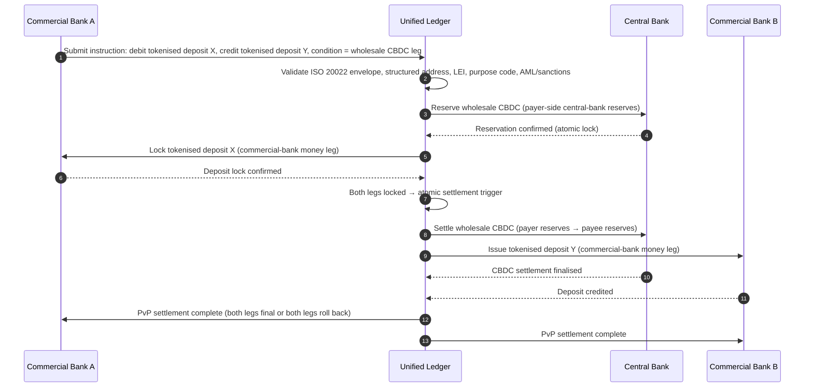

## 2026-ல் மொத்த கட்டணங்கள் குறியீடு: ISO 20022, டோக்கனாக்கப்பட்ட வைப்புகள், நிகழ்நேர ரயில்கள் மற்றும் எல்லை தாண்டிய தீர்வாக்கம்

2026-ல் மொத்த கட்டணங்கள் இரண்டு ஒரே நேரத்தில் நிகழும் மாற்றங்களால் மறுவடிவமைக்கப்படுகின்றன: கட்டமைக்கப்பட்ட கட்டணத் தரவு மற்றும் நிரல்படுத்தக்கூடிய தீர்வாக்கம். SWIFT-இன் நவம்பர் 2026 கட்டமைக்கப்பட்ட-முகவரி மைல்கல் தரவுத் தரத்தை செயல்பாட்டு மாதிரிக்குள் கட்டாயப்படுத்துகிறது, அதே வேளையில் BIS Project Agorá மற்றும் டோக்கனாக்கப்பட்ட வைப்புகள் எல்லை தாண்டிய தீர்வாக்கம் மேலும் அணு, வெளிப்படையான, எப்போதும்-இயங்கும் நிலையாக மாற முடியுமா என்பதைச் சோதிக்கின்றன.

---

> **நிர்வாகச் சுருக்கம் / முக்கிய கருத்துக்கள்**
>
> - **நவம்பர் 2026 ஒரு கடினமான தரவு மைல்கல்.** SR 2026 மாற்றத்திற்குப் பிறகு கட்டமைக்கப்படாத முகவரிகளைக் கொண்ட கட்டணங்கள் இனி ஆதரிக்கப்படமாட்டாது என்று SWIFT கூறுகிறது.
> - **கட்டமைக்கப்பட்ட தரவு தயாரிப்பு உள்கட்டமைப்பாகிறது.** ஊரும் நாடும் குறைந்தபட்சம் நியமிக்கப்பட்ட புலங்களில் இருக்க வேண்டும், இது கட்டணத்-தரவுத் தரத்தை ஒரு வாடிக்கையாளர், செயல்பாடு மற்றும் இணக்கச் சிக்கலாக மாற்றுகிறது.
> - **டோக்கனாக்கப்பட்ட வைப்புகள் ஒரு மொத்த வடிவமைப்புத் தேர்வு.** Project Agorá டோக்கனாக்கப்பட்ட வணிக வங்கி வைப்புகளையும் டோக்கனாக்கப்பட்ட மத்திய வங்கி இருப்புகளையும் ஒரு ஒருங்கிணைந்த பேரேடு மாதிரியில் ஆராய்கிறது.
> - **குறியீடு வேகத்தை மட்டுமல்ல, தீர்வாக்கத் தரத்தை அளவிட வேண்டும்.** இறுதித்தன்மை, வெளிப்படைத்தன்மை, பழுதுபார்ப்பு விகிதங்கள், நிதிநிலைப் பயன்பாடு, இணக்கத் தரவு மற்றும் வாடிக்கையாளர் தெரிவுநிலை உடனடி செயல்படுத்தலைப் போலவே முக்கியம்.
> - **எல்லை தாண்டிய கட்டணங்கள் ஒரு பொது-தனியார் நிகழ்ச்சி நிரலாகவே இருக்கின்றன.** FSB பொது மற்றும் தனியார்-துறை ஒருங்கிணைப்புடன், செயலாக்கம் வழியாக G20 வரைபடத்தை தொடர்ந்து இயக்குகிறது.
>
---

## இந்தக் குறியீடு 2026-ல் ஏன் முக்கியம்

Stanford AI Index பயனுள்ளது ஏனெனில் அது வேகமாக நகரும் தொழில்நுட்பத் துறையை அளவிடத்தக்க ஒன்றாகக் கருதுகிறது: ஆராய்ச்சி வெளியீடு, தொழில்நுட்பச் செயல்திறன், பொறுப்பான வரிசைப்படுத்தல், பொருளாதாரம், துறை ஏற்பு, கொள்கை மற்றும் பொது உணர்வு ஆகியவை ஒரே கட்டமைப்பிற்குள் கொண்டுவரப்படுகின்றன ([Stanford HAI ⧉](https://hai.stanford.edu/ai-index/2026-ai-index-report "The 2026 AI Index Report")). வங்கிகளுக்கும் நிதி நிறுவனங்களுக்கும் இப்போது உள்கட்டமைப்பிற்கு அதே ஒழுக்கம் தேவை. முகவர்த்தன AI, குவாண்டம்-பாதுகாப்பு பாதுகாப்பு, கிளவுட் நேட்டிவ் மீள்திறன் மற்றும் மொத்த கட்டணங்கள் இனி தனித்தனி புதுமைப் பாதைகள் அல்ல; அவை ஒரே செயல்பாட்டு மாதிரியாக ஒன்றிணைகின்றன.

ஒரு வங்கிக்கான நடைமுறைக் கேள்வி ஒவ்வொரு களமும் முக்கியமா என்பதல்ல. அந்நிறுவனம் அவை அனைத்திலும் தயார்நிலையை ஒரே நேரத்தில் அளவிட முடியுமா என்பதே. ஒரு வங்கி முகவர்த்தன AI-ஐ வரிசைப்படுத்தலாம், ஆனால் அதன் குறியாக்கவியல் இடம்பெயர்வுக்குத் தயாராக இல்லாவிட்டால் இன்னும் நொறுங்கக்கூடியதாகவே இருக்கும். அது கிளவுட் தளங்களை நவீனமயமாக்கலாம், ஆனால் கட்டணத் தரவு கட்டமைக்கப்படாமல் இருந்தால் இன்னும் தோல்வியடையலாம். அது டோக்கனாக்கல் முன்னோட்டங்களை இயக்கலாம், ஆனால் தீர்வாக்கம், நிதிநிலை, அடையாளம் மற்றும் தணிக்கை அடுக்குகள் ஒன்றாக வடிவமைக்கப்படாவிட்டால் இன்னும் அமைப்புசார் அபாயத்தை உருவாக்கலாம்.

## 2026 குறியீட்டு கட்டமைப்பு

| குறியீட்டு அடுக்கு | 2026 திசை | தயார்நிலை அளவீடு | தவறாகக் கையாண்டால் ஏற்படும் அபாயம் |
|---|---|---|---|
| **ISO 20022 தரவு** | கட்டமைக்கப்படாத உரையிலிருந்து நிர்வகிக்கப்பட்ட கட்டமைக்கப்பட்ட புலங்களுக்கு நகர்தல் | கட்டமைக்கப்பட்ட-முகவரி தயார்நிலை மற்றும் நிராகரிப்பு விகிதம் | கட்டண நிராகரிப்புகள் மற்றும் கைமுறை பழுதுபார்ப்பு |
| **ரயில் இசைவாக்கம்** | RTGS, உடனடி, தொடர்பாளர், ஸ்டேபிள்காயின் மற்றும் டோக்கனாக்கப்பட்ட ரயில்கள் வழியாக வழிநடத்தல் | செலவு, வேகம், இறுதித்தன்மை மற்றும் அதிகார-எல்லை-விழிப்புணர்வு வழிநடத்தல் | பிரதிபலிக்கப்பட்ட கட்டுப்பாடுகளுடன் துண்டாக்கப்பட்ட ரயில்கள் |
| **டோக்கனாக்கப்பட்ட தீர்வாக்கம்** | உராய்வைக் குறைக்கும் இடங்களில் டோக்கனாக்கப்பட்ட வைப்புகளையும் மத்திய வங்கிப் பணத்தையும் பயன்படுத்துதல் | DvP, PvP, அணுத் தீர்வாக்க ஆவரணம் | வணிகப் பணிப்பாய்வு மதிப்பு இல்லாத முன்னோட்டச் சொத்துக்கள் |
| **நிதிநிலை** | நாள்-உள் நிதிநிலை, சிக்கிய பணம் மற்றும் தீர்வாக்கச் சாளரங்களை உகந்தமயமாக்குதல் | சேமிக்கப்பட்ட நிதிநிலை மற்றும் தீர்வாக்க-தோல்விக் குறைப்பு | நிதிநிலை மீது வேகமான வெளியேற்றங்கள் |
| **இணக்கம்** | AML, தடைகள், FATF மற்றும் தணிக்கைத் தேவைகளை கட்டணத் தரவுக்குள் உட்பொதித்தல் | நேரடி இணக்கம் மற்றும் விளக்கத்தன்மை | வலிமையான கட்டுப்பாடுகள் இல்லாத செழுமையான தரவு |

## முக்கிய மொத்த-கட்டண சமிக்ஞைகள் உலகளாவிய முன்னுரிமைகளுடன் இணைக்கப்பட்டன

2026 சமிக்ஞைத் தொகுப்பு ஒரு ஆராய்ச்சி நிகழ்ச்சி நிரல் அல்ல. அது ஒரு வங்கியின் தலைமைக் கட்டண அதிகாரி ஏற்கனவே அளவிடப்பட்டுவரும் ஒரு வழங்கல் சரிபார்ப்புப் பட்டியல். சரிசெய்தல் பணி மூன்று இடங்களில் தோன்றுகிறது: செய்தி உறை, ரயில் இசைவாக்க அடுக்கு மற்றும் தீர்வாக்கப் பேரேடு.

| சமிக்ஞை | G20 / SWIFT / BIS மேற்கோள் | தொழில்நுட்ப தள செயல்படுத்தல் |
|---|---|---|
| **65% கட்டணச் செய்திகள் இன்னும் கட்டமைக்கப்படாத முகவரிகளைக் கொண்டுள்ளன** | [SWIFT SR 2026 — கட்டமைக்கப்பட்ட-முகவரி மைல்கல், நவ 2026 ⧉](https://www.swift.com/news-events/news/iso-20022-milestone-november-2026-unstructured-addresses-be-removed "ISO 20022 November 2026 structured address milestone") | செய்தி SWIFTNet அடாப்டரை அடைவதற்கு முன் கட்டண இடைநிலைமென்பொருளில் திட்ட சரிபார்ப்பு; பெருநிறுவன-வழித்தட + தொடர்பாளர்-வங்கி நுழைவில் தானியங்கி முகவரி பாகுபடுத்தல். |
| **FSB G20 இலக்கு: 2027-க்குள் எல்லை தாண்டிய கட்டணங்களில் 75% 1 மணிநேரத்திற்குள் நிறைவு** | [FSB எல்லை தாண்டிய கட்டணங்கள் வரைபடம், 2026 செயலாக்கக் கட்டம் ⧉](https://www.fsb.org/2026/03/fsb-kicks-off-new-implementation-phase-to-enhance-cross-border-payments-through-public-private-partnership/ "FSB cross-border payments implementation phase") | முன்-ஒப்புக்கொள்ளப்பட்ட நிதிநிலைச் சாளரங்களுடன் நிகழ்நேர FX-மாற்று நுழைவாயில்கள்; வாடிக்கையாளர் போர்ட்டலுக்குள் T+0 உறுதிப்படுத்தல் இணைப்புகள்; 1 மணிநேர உறையைப் பூர்த்தி செய்ய முடியாத எந்த வழித்தடத்தையும் விலக்கும் ரயில்-வழிநடத்தல் இயந்திரம். |
| **FSB G20 இலக்கு: சராசரி எல்லை தாண்டிய பரிவர்த்தனைச் செலவு 1%-க்குக் கீழ், சில்லறை 3%-க்குக் கீழ்** | [FSB G20 அளவீட்டு இலக்குகள் ⧉](https://www.fsb.org/2026/03/fsb-kicks-off-new-implementation-phase-to-enhance-cross-border-payments-through-public-private-partnership/ "FSB cross-border payments implementation phase") | ஒவ்வொரு வழித்தடத்திலும் செலவு-பங்கீட்டு தொலைமானம் (FX பரவல், தொடர்பாளர் கட்டணம், தூக்கல் செலவு); மேற்கோளுக்கு முன் இணக்கமற்ற விலையிடலை வெளிப்படுத்தும் விளிம்பு கொள்கைப் பதிவேடு. |
| **BIS Project Agorá ஏழு மத்திய வங்கிகள் + 41 வணிக வங்கிகள் முழுவதும் முன்மாதிரிக் கட்டத்தில் நுழைகிறது** | [BIS Project Agorá ⧉](https://www.bis.org/about/bisih/topics/fmis/agora.htm "Project Agorá") | ஒருங்கிணைந்த-பேரேடு ஒருங்கிணைப்பு விவரக்குறிப்பு: டோக்கனாக்கப்பட்ட-வைப்பு பேரேடு கணு + மொத்த-CBDC தீர்வாக்கத் தளம் + KYC/AML இணைப்புகள்; வங்கியின் வழித்தடப் பங்குக்கு அளவுக்கேற்ப சங்கிலியில் நிதிநிலைத் தொகுப்புகள். |
| **Deutsche Bank "டிஜிட்டல் பணம்" கட்டமைப்பு வாடிக்கையாளர் கட்டமைப்பில் படிகமாகிறது** | [Deutsche Bank — Digital Money: stablecoins, tokenised deposits and CBDCs ⧉](https://flow.db.com/publications/flow-white-papers-and-guides/digital-money-a-perspective-on-stablecoins-tokenised-deposits-and-cbdcs "Digital Money: stablecoins, tokenised deposits and CBDCs") | ஒவ்வொரு கட்டணத்திற்கும் ஸ்டேபிள்காயின் / டோக்கனாக்கப்பட்ட-வைப்பு / CBDC தேர்வை சுருக்கமாக்கும் பணப்பை-நடுநிலை தீர்வாக்க API; வாடிக்கையாளரின் அல்ல, வங்கியின் கொள்கைப் பதிவேட்டிற்கு எதிராக மதிப்பீடு செய்யப்படும் நிரல்படுத்தக்கூடிய நிபந்தனைகள். |

## கட்டணத் தரவு திருப்புமுனை

ISO 20022 ஒரு செய்தி-வடிவமைப்புத் திட்டத்திலிருந்து ஒரு தரவு-தர செயல்பாட்டு மாதிரிக்கு நகர்ந்துவிட்டது. பயனாளர், கடனாளர், வரவாளர், முகவர், ஊர், நாடு, நோக்கம் மற்றும் கட்சித் தரவு பலவீனமாக இருந்தால், வங்கி நிராகரிப்புகள், பழுதுபார்ப்புகள், தடைகள் உராய்வு, வாடிக்கையாளர் விரக்தி மற்றும் பலவீனமான பகுப்பாய்வுகளை அனுபவிக்கும்.

**SR 2026 இதை ஒரு ஆலோசனை அல்ல, ஒரு கடினமான ஒப்பந்தமாக ஆக்குகிறது.** SWIFT Standards Release 2026 (நவம்பர் 2026) கட்டமைக்கப்பட்ட-முகவரி விதியை நெட்வொர்க் அடுக்கில் அமல்படுத்துகிறது — `<PstlAdr>` உறுப்பு `<TwnNm>` மற்றும் `<Ctry>` ஆகியவற்றைக் கொண்டிராத செய்திகள் SWIFTNet சரிபார்ப்பு அடுக்கால் பெறப்படும்போது நிராகரிக்கப்படும், பழுதுபார்ப்புக்குக் குறியிடப்படாது. பழுதுபார்ப்பு வரிசை ஒரு பின்-அலுவலகச் செலவுக் கோடாக இருப்பதை நிறுத்திவிட்டு, வாடிக்கையாளருக்குத் தெரியும் தாமதத்துடன் ஒரு தீர்வாக்க-தோல்வி நிகழ்வாகிறது. SR 2026-ஐ "இறுக்கமான வழிகாட்டுதலாக" கருதிவரும் செயல்பாட்டுக் குழுக்கள் தவறான இயங்கல்-கையேட்டிலிருந்து வேலை செய்கின்றன.

### ISO 20022-இன் கீழ் கட்டமைக்கப்பட்ட கட்டணத் தரவு இணக்கம்

சரிசெய்தல் மேற்பரப்பு குறுகியதாகவும் நன்கு-வரையறுக்கப்பட்டதாகவும் உள்ளது. கீழேயுள்ள XML உறுப்புகளே நவம்பர் 2026 SWIFTNet சரிபார்ப்பு அடுக்கு உண்மையில் செய்திகளைத் தோல்வியடையச் செய்யும் இடங்கள்; மற்ற அனைத்தும் கீழ்நோக்கிய விளைவு.

| தரவு உறுப்பு | ISO 20022 XML குறிச்சொல் | நவம்பர் 2026 SWIFT தேவை | தொழில்நுட்ப சரிசெய்தல் உத்தி |
|---|---|---|---|
| **கட்டமைக்கப்பட்ட முகவரி** | `<TwnNm>` + `<Ctry>` கொண்ட `<PstlAdr>` | கட்டாயம். கட்டமைக்கப்படாத `<AdrLine>` உரை பெறும் SWIFTNet அடாப்டரில் நெட்வொர்க் நிராகரிப்பைத் தூண்டுகிறது. | கட்டணத் தொடக்கத்தில் தானியங்கி முகவரி பாகுபடுத்தல்; பெருநிறுவன-வழித்தட படிவ மறுஎழுத்துக்கள்; அடுத்த பற்றுக்கு முன் ஒவ்வொரு எதிர்-கட்சியிலும் பின்-புத்தகச் சுத்திகரிப்பு. |
| **சட்ட நிறுவன அடையாளங்காட்டி (LEI)** | `<OrgId>`-இன் கீழ் `<Id>` | தனிநபர் அல்லாத நிதி எதிர்-கட்சி சரிபார்ப்புக்கு மிகவும் பரிந்துரைக்கப்படுகிறது; பல CBPR+ வழித்தடங்களில் கட்டாயம். | பெருநிறுவன இணைப்பில் LEI தேடல் + GLEIF குறுக்குச் சரிபார்ப்பு; மேற்கோள்-தரவு சேவைகள் வழியாக பின்-புத்தக எதிர்-கட்சிகளுக்கு தானியங்கி செழுமையாக்கம். |
| **கட்டண நோக்கக் குறியீடுகள்** | `<Cd>` கொண்ட `<Purp>` | தானியங்கி AML / தடைகள் திரையிடலுக்கு பல பிராந்திய நிகழ்நேர வழித்தடங்களில் (CBPR+, SEPA Inst, TIPS) கட்டாயம். | பழைய வங்கி-உள்நிலை பரிவர்த்தனைக் குறியீடுகளை நிலையான ISO 20022 ExternalPurposeCode பட்டியலுடன் இணைத்தல்; பெருநிறுவன-வழித்தட UI-ல் நோக்கத் தேர்வை வெளிப்படுத்துதல்; தெரியாத குறியீடுகளில் இயல்பு-மறுப்பு. |
| **இறுதிக் கட்சிகள்** | `<UltmtDbtr>` / `<UltmtCdtr>` | G20 FATF பயண-விதி + தடை அளவுருக்களைப் பூர்த்தி செய்ய இறுதிப் பயனாளர் சூழலை வெளிப்படுத்துதல்; பல கட்டண-வகைக் குறியீடுகளுக்கு கட்டாயம். | பேரேடு துணைக்-கணக்குகளிலிருந்து முனை-முதல்-முனை கட்சிப் பெயர்களைப் பிரித்தெடுத்தல்; KYC வரைபடத்திற்கு எதிராகச் சரிசெய்தல்; ஒவ்வொரு உறுதிப்படுத்தலிலும் இறுதிக் கட்சியை வெளிப்படுத்துதல். |
| **பணப்பரிமாற்றத் தகவல் (கட்டமைக்கப்பட்டது)** | `<RfrdDocInf>` கொண்ட `<RmtInf><Strd>` | CBPR+ கட்டம் 2-இன் கீழ் ஒப்புரவுசெய்யத்தக்க விலைப்பட்டியல்-இணைந்த பெருநிறுவனக் கட்டணங்களுக்குத் தேவை. | பெருநிறுவன போர்ட்டலில் மேற்கோள்-நேரத்தில் கட்டமைக்கப்பட்ட பணப்பரிமாற்றத்தைப் பிடித்தல்; உயர்-மதிப்பு ஓட்டங்களுக்கு தன்னிச்சை-உரை மாற்றீட்டை நிராகரித்தல். |

## டோக்கனாக்கப்பட்ட வைப்புகள் மற்றும் மொத்த CBDC

டோக்கனாக்கப்பட்ட வைப்புகள் நிரல்படுத்தத்தன்மையைச் சேர்க்கும் அதே வேளையில் வணிக-வங்கிப் பண மாதிரியைப் பாதுகாக்கின்றன. மொத்த மத்திய வங்கிப் பணம் தீர்வாக்க இறுதித்தன்மையைப் பாதுகாக்கிறது. சுவாரஸ்யமான வடிவமைப்பு முறை இந்த சேர்க்கை: வாடிக்கையாளர் உறவுகள் மற்றும் கடன் இடைத்தரகுக்கு வணிக வங்கிப் பணம், இறுதித் தீர்வாக்கம் மற்றும் அமைப்புசார் நம்பிக்கைக்கு மத்திய வங்கிப் பணம்.

Project Agorá இந்த சேர்க்கையை உறுதியானதாக்குகிறது. கீழேயுள்ள கட்டமைப்பு, வணிக-வங்கி வைப்புப் பேரேடு மற்றும் மொத்த-CBDC தீர்வாக்கத் தளம் ஆகிய இரண்டையும் பயன்படுத்தி, ஒரு ஒருங்கிணைந்த பேரேடு வழியாக ஒருங்கிணைக்கப்பட்ட, அணு, கட்டணத்திற்கு-எதிரான-கட்டண (PvP) எல்லை தாண்டிய தீர்வாக்கத்திற்கான BIS மேற்கோள் முறை.

இந்தத் தீர்வாக்கம் அமைப்பால் அணுத்தன்மையானது: இரு கால்களும் உறுதியாகின்றன அல்லது இரண்டும் மீள்திரும்புகின்றன. மொத்த-CBDC காலில் தீர்வாக்க இறுதித்தன்மை, வணிக-வங்கி டோக்கனாக்கப்பட்ட-வைப்பு மாற்றத்தை தொடர்பாளர் அபாயம் இல்லாமல் செயல்திறனுள்ளதாக்குகிறது. ஒருங்கிணைந்த பேரேடு என்பது ஒருங்கிணைப்புத் தளம், தானாக ஒரு கட்டண அமைப்பு அல்ல — மத்திய வங்கி இன்னும் தீர்வாக்க சொத்தை வழங்குகிறது, வணிக வங்கி இன்னும் வைப்புப் பொறுப்பைப் பதிவு செய்கிறது.

## புதிய மொத்த கட்டணத் தயாரிப்பு

தயாரிப்பு இனி வெறுமனே ஒரு கட்டணம் அல்ல. அது செயல்படுத்தல், தரவு, நிதிநிலை, இணக்கம், தடங்காணல் மற்றும் விதிவிலக்கு மேலாண்மையின் ஒரு தொகுப்பு. அந்தத் திறன்களை API-கள் மற்றும் வாடிக்கையாளர் டாஷ்போர்டுகள் வழியாக வெளிப்படுத்தக்கூடிய வங்கிகள் உள்கட்டமைப்பு இணக்கத்தை வாடிக்கையாளர் மதிப்பாக மாற்றும்.

## இது வங்கி வகைவாரியாக என்ன அர்த்தம்

### உலகளாவிய அமைப்புசார் முக்கியத்துவ வாய்ந்த வங்கிகள்

உலகளாவிய வங்கிகள் இந்தக் குறியீட்டை ஒரு நிறுவனக் கட்டமைப்பு மதிப்பெண் அட்டையாகக் கருத வேண்டும். முன்னுரிமை மற்றொரு கருத்து-நிரூபணம் அல்ல; தன்னாட்சிப் பணிப்பாய்வுகள், குறியாக்கவியல் இடம்பெயர்வு, கிளவுட் சார்பு மற்றும் கட்டண நவீனமயமாக்கல் ஆகியவை ஒரே அபாய மற்றும் மதிப்பு அமைப்பாக நிர்வகிக்கப்பட முடியும் என்ற சான்றே.

### பரிவர்த்தனை வங்கிகள் மற்றும் பெருநிறுவன வங்கிகள்

பரிவர்த்தனை வங்கிகள் மொத்த கட்டணங்கள், கட்டமைக்கப்பட்ட தரவு, நிதிநிலை, டோக்கனாக்கப்பட்ட வைப்புகள் மற்றும் முகவர்த்தன கருவூல சேவைகளில் கவனம் செலுத்த வேண்டும். மிகவும் மதிப்புமிக்க வாடிக்கையாளர் முன்மொழிவு வேகமான பண இயக்கம் மட்டுமல்ல; அது குறைவான விசாரணைகள் மற்றும் சிறந்த செயல்பாட்டு-மூலதன தெரிவுநிலையுடன் விளக்கத்தக்க, தணிக்கைசெய்யத்தக்க, நிரல்படுத்தக்கூடிய பண இயக்கம்.

### பிராந்திய வங்கிகள்

பிராந்திய வங்கிகள் திட்டப் பரவலைத் தவிர்க்க இந்தக் குறியீட்டைப் பயன்படுத்த வேண்டும். அவை ஒவ்வொரு எல்லையிலும் முன்னணி வகிக்க வேண்டியதில்லை, ஆனால் AI நிர்வாகம், பிந்தைய-குவாண்டம் சரக்கு, கிளவுட் வெளியேற்றச் சான்று மற்றும் கட்டணத் தரவுத் தயார்நிலை ஆகியவற்றில் நம்பகமான நிலைப்பாடுகள் தேவை.

### ஃபின்டெக்குகள், PSP-கள் மற்றும் உள்கட்டமைப்பு வழங்குநர்கள்

ஃபின்டெக்குகள் மற்றும் உள்கட்டமைப்பு வழங்குநர்கள் தங்கள் தயாரிப்பு வரைபடங்களை அளவிடத்தக்க வங்கித் தயார்நிலைக்கு இணைக்க வேண்டும். சிறந்த முன்மொழிவுகள் ஒருங்கிணைப்பு அபாயத்தைக் குறைத்து, சான்றை வலுப்படுத்தி, சிக்கலான உள்கட்டமைப்பை வங்கிகள் நிர்வகிப்பதை எளிதாக்கும்.

## முடிவுரை

ஒரு குறியீட்டு-பாணி அறிக்கையின் மதிப்பு, ஒரு துண்டாக்கப்பட்ட தொழில்நுட்ப நிகழ்ச்சி நிரலை அளவிடத்தக்க செயல்பாட்டு மாதிரியாக மாற்றுகிறது என்பதே. 2026-ல், நிதி உள்கட்டமைப்பில் வெற்றியாளர்கள் அதிக முன்னோட்டங்களைக் கொண்ட நிறுவனங்கள் அல்ல. அவர்கள் தன்னாட்சி, பாதுகாப்பு, மீள்திறன், தீர்வாக்கம், பொருளாதாரம் மற்றும் நிர்வாகம் ஆகியவற்றில் தயார்நிலையை ஒரே நேரத்தில் நிரூபிக்கக்கூடிய நிறுவனங்களே.

## அடிக்கடி கேட்கப்படும் கேள்விகள்

**ISO 20022 ஏன் இன்னும் 2026 சிக்கலாக உள்ளது?**

ஏனெனில் கட்டணத் தரவு கட்டமைக்கப்பட்டு, நிர்வகிக்கப்பட்டு, மூலத்தில் பிடிக்கப்பட்டு, சேனல்கள், வாடிக்கையாளர்கள் மற்றும் சந்தை உள்கட்டமைப்புகள் முழுவதும் பயன்படுத்தத்தக்கதாகும் வரை இடம்பெயர்வு நிறைவடையாது.

**டோக்கனாக்கப்பட்ட வைப்பு என்றால் என்ன?**

டோக்கனாக்கப்பட்ட வைப்பு என்பது வணிக வங்கிப் பணத்தின் ஒரு டிஜிட்டல் பிரதிநிதித்துவம், இது வங்கி-வைப்பாளர் உறவைப் பாதுகாக்கும் அதே வேளையில் நிரல்படுத்தக்கூடிய தீர்வாக்கத்தை இயலச்செய்யும்படி வடிவமைக்கப்பட்டுள்ளது.

**டோக்கனாக்கப்பட்ட வைப்புகள் ஸ்டேபிள்காயின்களை மாற்றுகின்றனவா?**

எல்லா இடங்களிலும் அல்ல. ஸ்டேபிள்காயின்கள் சில டிஜிட்டல்-சொத்து மற்றும் எல்லை தாண்டிய சூழல்களில் பயனுள்ளதாகத் தொடரலாம், அதே வேளையில் டோக்கனாக்கப்பட்ட வைப்புகள் ஒழுங்குபடுத்தப்பட்ட மொத்த வங்கியியலுக்கு கட்டமைப்பு ரீதியாக ஈர்க்கக்கூடியவை.

**வங்கிகள் எதை அளவிட வேண்டும்?**

கட்டமைக்கப்பட்ட-தரவுத் தயார்நிலை, கட்டண நிராகரிப்புகள், பழுதுபார்ப்புச் செலவு, தீர்வாக்க நேரம், நிதிநிலைப் பயன்பாடு, ரயில் வழிநடத்தல் விளைவுகள் மற்றும் வாடிக்கையாளர் தெரிவுநிலையை அளவிடுங்கள்.

## குறிப்புதவிகள்

- SWIFT, (2026). [ISO 20022 November 2026 structured address milestone ⧉](https://www.swift.com/news-events/news/iso-20022-milestone-november-2026-unstructured-addresses-be-removed "ISO 20022 November 2026 structured address milestone").
- BIS Innovation Hub, (2026). [Project Agorá ⧉](https://www.bis.org/about/bisih/topics/fmis/agora.htm "Project Agorá").
- FSB, (2026). [Cross-border payments implementation phase ⧉](https://www.fsb.org/2026/03/fsb-kicks-off-new-implementation-phase-to-enhance-cross-border-payments-through-public-private-partnership/ "Cross-border payments implementation phase").
- Deutsche Bank, (2026). [Digital Money: stablecoins, tokenised deposits and CBDCs ⧉](https://flow.db.com/publications/flow-white-papers-and-guides/digital-money-a-perspective-on-stablecoins-tokenised-deposits-and-cbdcs "Digital Money: stablecoins, tokenised deposits and CBDCs").
