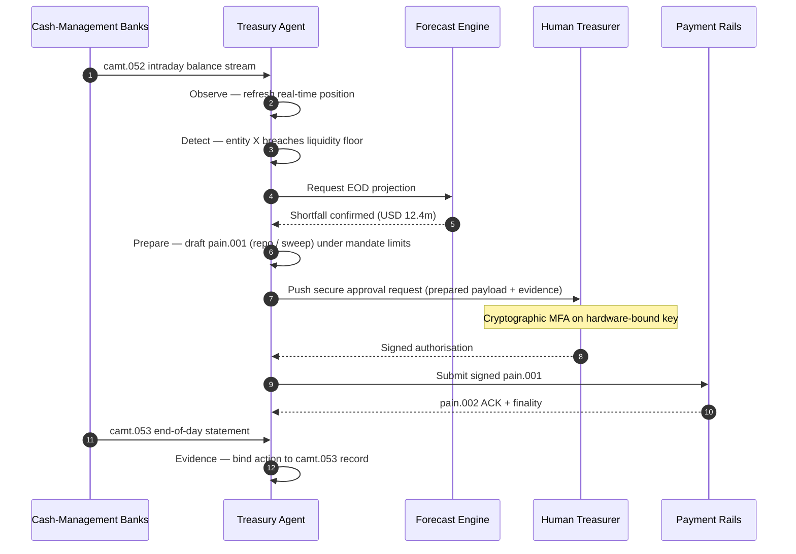

## 2026-இல் தன்னாட்சி கருவூல குறியீடு: முகவர்-சார் கருவூலம், நிரலாக்கக்கூடிய பணப்புழக்கம், டோக்கனாக்கப்பட்ட வைப்புத்தொகைகள் மற்றும் நிகழ்நேர பணக் கட்டுப்பாடு

தன்னாட்சி கருவூலம் என்பது முகவர்-சார் AI, மொத்த கட்டணங்கள், டோக்கனாக்கப்பட்ட வைப்புத்தொகைகள் மற்றும் நிகழ்நேர பணப்புழக்கம் ஆகியவை இயல்பாகச் சந்திக்கும் புள்ளியாகும். 2026-இல், சிறந்த கருவூல கட்டமைப்புகள் பணப்புழக்கத்தை வெறுமனே முன்னறிவிக்காது; அவை கணக்குகள், நாணயங்கள், தடங்கள் மற்றும் தீர்வுச் சொத்துகள் முழுவதும் வரம்பிடப்பட்ட பணப்புழக்க நடவடிக்கைகளை பரிந்துரைக்கும், விளக்கும், இறுதியில் செயல்படுத்தும்.

---

> **நிர்வாகச் சுருக்கம் / முக்கிய கருத்துகள்**
>
> - **கருவூலம் அறிக்கையிடலில் இருந்து கட்டுப்பாட்டுக்கு மாறி வருகிறது.** நிகழ்நேர இருப்புகள், முன்னறிவிப்புகள், கட்டண நிலை மற்றும் பணப்புழக்க நகர்வு ஆகியவை ஒரே பணிப்பாய்வின் ஒரு பகுதியாக மாறி வருகின்றன.
> - **முகவர்-சார் AI ஒரு புதிய கருவூல இடைமுகத்தை உருவாக்குகிறது.** முகவர்கள் நிலைகளைக் கண்காணிக்கலாம், முரண்பாடுகளை வெளிக்கொணரலாம், நிதியளிப்பு நடவடிக்கைகளைத் தயார் செய்யலாம், மற்றும் வரையறுக்கப்பட்ட ஆணைகளுக்குள் முடிவுகளை மேலெழுப்பலாம்.
> - **நிரலாக்கக்கூடிய பணம் பணப் பகுதியை மாற்றுகிறது.** டோக்கனாக்கப்பட்ட வைப்புத்தொகைகள் மற்றும் மொத்த CBDC பரிசோதனைகள் அணு-அளவு தீர்வு, நிபந்தனைக் கட்டணங்கள் மற்றும் எப்போதும்-இயங்கும் பணப்புழக்கத்திற்கான புதிய சாத்தியங்களை உருவாக்குகின்றன.
> - **குறியீடு அதிகாரத்தை அளவிட வேண்டும்.** கேள்வி என்பது முகவர் ஒரு நடவடிக்கையைப் பரிந்துரைக்க முடியுமா என்பதல்ல; அதிகாரம், வரம்புகள், ஒப்புதல்கள் மற்றும் சான்றுகள் தெளிவாக உள்ளனவா என்பதே.
> - **கருவூல மதிப்பு அளவிடக்கூடியது.** சேமிக்கப்பட்ட பணப்புழக்கம், குறைக்கப்பட்ட கைமுறை விசாரணைகள், தவிர்க்கப்பட்ட தீர்வுத் தோல்விகள் மற்றும் விடுவிக்கப்பட்ட செயல்பாட்டு மூலதனம் ஆகியவை வெற்றியை வரையறுக்க வேண்டும்.
>
---

## ஏன் 2026 இந்தக் குறியீடு முக்கியத்துவம் பெறும் ஆண்டு

வேகமாக மாறிவரும் தொழில்நுட்பத் துறையை அளவிடக்கூடிய ஒன்றாக ஸ்டான்ஃபோர்ட் AI குறியீடு கருதுவதால் அது பயனுள்ளதாக உள்ளது: ஆராய்ச்சி வெளியீடு, தொழில்நுட்பச் செயல்திறன், பொறுப்பான வரிசைப்படுத்தல், பொருளாதாரம், துறை ஏற்பு, கொள்கை மற்றும் பொது உணர்வு ஆகியவை ஒரே சட்டகத்திற்குள் கொண்டுவரப்படுகின்றன ([Stanford HAI ⧉](https://hai.stanford.edu/ai-index/2026-ai-index-report "The 2026 AI Index Report")). வங்கிகளுக்கும் நிதி நிறுவனங்களுக்கும் இப்போது உள்கட்டமைப்புக்கு அதே ஒழுக்கம் தேவைப்படுகிறது. முகவர்-சார் AI, குவாண்டம்-பாதுகாப்பு பாதுகாப்பு, கிளவுட் நேட்டிவ் மீள்திறன் மற்றும் மொத்த கட்டணங்கள் இனி தனித்தனி புதுமைத் தடங்கள் அல்ல; அவை ஒரே இயக்க மாதிரிக்குள் ஒன்றிணைந்து வருகின்றன.

ஒரு வங்கிக்கான நடைமுறைக் கேள்வி ஒவ்வொரு துறையும் முக்கியமா என்பதல்ல. அந்த நிறுவனம் அவை அனைத்திலும் ஒரே நேரத்தில் தயார்நிலையை அளவிட முடியுமா என்பதே. ஒரு வங்கி முகவர்-சார் AI-ஐ வரிசைப்படுத்தி இருந்தாலும், அதன் குறியாக்கவியல் இடம்பெயர்வுக்குத் தயாராக இல்லாவிட்டால் அது இன்னும் நலிவடையக்கூடியதாக இருக்கும். அது கிளவுட் தளங்களை நவீனப்படுத்தினாலும், கட்டண தரவு கட்டமைக்கப்படாமல் இருந்தால் தோல்வியடையலாம். அது டோக்கனாக்கப் பைலட்டுகளை இயக்கினாலும், தீர்வு, பணப்புழக்கம், அடையாளம் மற்றும் தணிக்கை அடுக்குகள் ஒன்றாக வடிவமைக்கப்படாவிட்டால் அமைப்புசார் அபாயத்தை உருவாக்கலாம்.

## 2026 குறியீட்டு கட்டமைப்பு

| குறியீட்டு அடுக்கு | 2026 திசை | தயார்நிலை அளவீடு | தவறாகக் கையாண்டால் ஏற்படும் அபாயம் |
|---|---|---|---|
| **தெரிவுநிலை** | கணக்கு, கட்டணம், பணப்புழக்கம் மற்றும் வெளிப்பாடு தரவை ஒருங்கிணைத்தல் | நிகழ்நேர பண நிலைகளின் பரப்பு | துண்டிக்கப்பட்ட பண தெரிவுநிலை |
| **முன்னறிவிப்பு** | இருப்புகள், ஓட்டங்கள் மற்றும் நிதி தேவைகளை முன்னறிவிக்க AI-ஐப் பயன்படுத்துதல் | முன்னறிவிப்பு துல்லியம் மற்றும் விதிவிலக்கு விகிதம் | பலவீனமான தரவில் தவறான நம்பிக்கை |
| **தன்னாட்சி** | பரிந்துரைகள் மற்றும் நடவடிக்கைகளுக்கு முகவர்களுக்கு வரம்பிடப்பட்ட அதிகாரம் வழங்குதல் | ஆணைப் பரப்பு மற்றும் ஒப்புதல் தரம் | அங்கீகரிக்கப்படாத அல்லது விளக்கப்படாத நடவடிக்கை |
| **நிரலாக்கத்தன்மை** | மதிப்பு சேர்க்கும் இடங்களில் டோக்கனாக்கப்பட்ட வைப்புத்தொகைகள் மற்றும் நுண்ணறிவு நிபந்தனைகளைப் பயன்படுத்துதல் | நிபந்தனைக் கட்டணம் மற்றும் அணு-அளவு தீர்வு பயன்பாட்டு வழக்குகள் | தொழில்நுட்பம்-தலைமையிலான கருவூல பைலட்டுகள் |
| **கட்டுப்பாடுகள்** | வரம்புகள், தடைகள், FX, பணப்புழக்கம் மற்றும் தணிக்கைக் கட்டுப்பாடுகளை உட்பொதித்தல் | ஒவ்வொரு கருவூல நடவடிக்கைக்கும் கட்டுப்பாட்டுச் சான்று | செயல்படுத்திய பின் கைமுறை ஆளுகை |

## கண்காணிக்க வேண்டிய தற்போதைய சமிக்ஞைகள்

| சமிக்ஞை | வங்கிகளுக்கு அதன் அர்த்தம் என்ன | ஆதாரம் |
|---|---|---|
| **நிதிச் சேவைகளில் 52% முகவர்-சார் AI ஏற்பு** | கருவூலம் இப்போது ஆளப்பட்ட தளங்கள் வழியாக முகவர்-சார் பணிப்பாய்வுகளை உள்வாங்க முடியும் | [Cambridge CCAF ⧉](https://www.jbs.cam.ac.uk/faculty-research/centres/alternative-finance/publications/2026-global-ai-in-financial-services-report/ "2026 Global AI in Financial Services Report") |
| **Project Agorá நிபந்தனைக் கட்டணங்கள்** | டோக்கனாக்கம் நிபந்தனை மற்றும் எப்போதும்-இயங்கும் கட்டணத் திறன்களை செயல்படுத்தக்கூடும் | [BIS ⧉](https://www.bis.org/about/bisih/topics/fmis/agora.htm "Project Agorá") |
| **Bank of England டிஜிட்டல் பத்திரங்கள் சாண்ட்பாக்ஸ்** | DLT-வெளியிடப்பட்ட பத்திரங்களும் பங்குகளும் Delivery-versus-Payment (DvP) அடிப்படையில் தீர்க்கப்படுகின்றன — சொத்துப் பகுதியும் பணப் பகுதியும் (மொத்த CBDC அல்லது டோக்கனாக்கப்பட்ட வணிக-வங்கி வைப்புத்தொகைகள்) ஒரே அணு-அளவு பரிவர்த்தனையில் தீர்க்கப்பட்டு, முதன்மை எதிர்தரப்பு அபாயத்தை நீக்குகின்றன | [Bank of England ⧉](https://www.bankofengland.co.uk/financial-stability/digital-securities-sandbox "Digital Securities Sandbox") |
| **SWIFT கட்டமைக்கப்பட்ட முகவரி காலக்கெடு** | கருவூல தரவு மூலத்திலேயே சரியாகப் பிடிக்கப்பட வேண்டும் | [SWIFT ⧉](https://www.swift.com/news-events/news/iso-20022-milestone-november-2026-unstructured-addresses-be-removed "ISO 20022 November 2026 structured address milestone") |
| **பெரிய நிதி நிறுவனங்கள் AI மதிப்பை அளவிட சிரமப்படுகின்றன** | கருவூல தானியக்கத்திற்கு உறுதியான பொருளாதார அளவீடுகள் தேவை | [Cambridge CCAF ⧉](https://www.jbs.cam.ac.uk/faculty-research/centres/alternative-finance/publications/2026-global-ai-in-financial-services-report/ "2026 Global AI in Financial Services Report") |

## கருவூல முகவரின் ஆணை

ஒரு கருவூல முகவர் பொது-நோக்க உதவியாளராக வடிவமைக்கப்படக் கூடாது. அதற்கு ஒரு ஆணை தேவை: கணக்குகளைக் கவனித்தல், விதிவிலக்குகளைக் கண்டறிதல், நிதி இடைவெளிகளை முன்னறிவித்தல், நடவடிக்கைகளைத் தயார் செய்தல், ஒப்புதல்களைக் கோருதல், வரம்புகளுக்குள் செயல்படுத்துதல் மற்றும் சான்றுகளை உருவாக்குதல். ஒவ்வொரு படிநிலைக்கும் வெவ்வேறு அதிகார மாதிரி இருக்க வேண்டும்.

கட்டுப்பாட்டு வளையம் கவனித்தல் → கண்டறிதல் → முன்னறிவித்தல் → தயார் செய்தல் → ஒப்புதல் கோருதல் — என இயங்கி நிற்கிறது. முகவர் தனியாக குறியாக்க அங்கீகார எல்லையை ஒருபோதும் கடப்பதில்லை. கீழுள்ள வரைபடம் ஒரு முழுச் சுழற்சியைக் கண்டறிகிறது: `camt.052` தொலைமைத் தரவில் பல-மில்லியன் டாலர் நாள்-உள் பணப்புழக்கப் பற்றாக்குறை வெளிப்படுகிறது, முகவர் நாள்-இறுதி நிலையை முன்னறிவிக்கிறது, ஒரு repo அல்லது நிறுவனங்களுக்கிடையேயான ஸ்வீப்பை முழுமையாக-உருவாக்கப்பட்ட `pain.001` ஆகத் தயார் செய்கிறது, மேலும் அதை வன்பொருள்-பிணைக்கப்பட்ட விசையில் பல-காரணி குறியாக்க கையொப்பத்திற்காக மனித கருவூல அதிகாரிக்கு ஒப்படைக்கிறது. முகவர் பின்னர் கையொப்பமிடப்பட்ட சுமையைச் சமர்ப்பிக்கிறது; இறுதித்தன்மை `pain.002` ACK ஆகவும் அடுத்த பதிவேட்டு `camt.053` ஆகவும் நிலைபெறுகிறது.

எல்லையே முக்கியம் — உண்மையான பணத்தை நகர்த்தும் ஒவ்வொரு நடவடிக்கையும் முகவர் தானாக நிறைவேற்ற முடியாத ஒரு குறியாக்க வாயிலுக்குப் பின்னால் அமர்ந்திருக்கிறது.

## நிரலாக்கக்கூடிய பணப்புழக்கம்

நிரலாக்கக்கூடிய பணப்புழக்கம் என்பது நிபந்தனைகளின் கீழ் மதிப்பை நகர்த்தும் திறன்: ஒரு வரம்பு மீறப்பட்டால், பிணையம் தகுதியுடையதாக இருந்தால், ஒரு எதிர்தரப்பினர் திரையிடலில் தேறினால், தீர்வு இறுதித்தன்மை கிடைத்தால், அல்லது ஒரு நாள்-உள் பணப்புழக்க தாங்கல் மிகக் குறைவாக இருந்தால். டோக்கனாக்கப்பட்ட வைப்புத்தொகைகளும் மொத்த தீர்வு தளங்களும் இந்த வடிவங்களை மேலும் நடைமுறைச் சாத்தியமாக்குகின்றன.

நிரலாக்கக்கூடியது என்பது தரநிலைக்கு வெளியே என்று அர்த்தமல்ல. செயல்படுத்தல் பாதை `pain.001` — [ISO 20022](/2023-09-29-automating-iso-20022-compliant-payment-file-creation-with-pain001/index.html) வாடிக்கையாளர் கடன் பரிமாற்றத் துவக்கம். முகவரின் தயார் செய்யப்பட்ட நடவடிக்கை என்பது ஒரு நிறுவன ERP பயன்படுத்தும் அதே சேனலில் வங்கிக்கு வழிநடத்தப்பட்ட, அதே வரைபடத்திற்கு எதிராகச் சரிபார்க்கப்பட்ட, அதே மோசடி மற்றும் தடை இயந்திரங்களால் மதிப்பிடப்பட்ட, மற்றும் அதே `pain.002` நிலை அறிக்கைகளில் ஒப்புக்கொள்ளப்பட்ட முழுமையாக-உருவாக்கப்பட்ட `pain.001` சுமையாகும். நிபந்தனை அடுக்கு (வரம்பு, பிணைய தகுதி, இறுதித்தன்மை கிடைப்பு, தாங்கல் தளம்) செய்தியின் மேலே வாழ்கிறது — அது ஒரு `pain.001` *அனுப்பப்படுமா* என்பதைக் கட்டுப்படுத்துகிறது, அது *என்ன வடிவம் எடுக்கிறது* என்பதை அல்ல. நிபந்தனைகளை வெளிப்படுத்த தனிப்பயன் சுமைகளைக் கண்டுபிடிக்கும் கருவூல தளங்கள் வங்கி-நுகர்வுக்குரிய பாதையிலிருந்து விழுந்து இருதரப்பு ஒருங்கிணைப்புக்குள் திரும்பிவிடும்.

## கருவூல கட்டுப்பாட்டு அறை

இயக்க மாதிரி ஒரு கட்டுப்பாட்டு அறையைப் போல் இருக்க வேண்டும்: நிலைகள், முன்னறிவிப்புகள், கட்டண நிலைகள், வரம்பு பயன்பாடு, விதிவிலக்குகள், ஒப்புதல்கள் மற்றும் சான்றுகள் ஒரே இடைமுகத்தில். மின்னஞ்சல்கள், விரிதாள்கள், வங்கி போர்ட்டல்கள் மற்றும் துண்டிக்கப்பட்ட டாஷ்போர்டுகளை குழுக்கள் ஒன்றாகத் தைக்க வேண்டிய கருவூல அடுக்குகளை இந்தக் குறியீடு தண்டிக்க வேண்டும்.

அந்த இடைமுகத்தின் பின்னால் உள்ள தரவுத் தளம் ISO 20022 பண மேலாண்மை ஆகும். நாள்-உள் நிலை `camt.052` — வங்கியிலிருந்து-வாடிக்கையாளர் கணக்கு அறிக்கை — ஒவ்வொரு பண-மேலாண்மை வங்கியிலிருந்தும் வங்கி வெளியிடும் அதிர்வெண்ணில் (அடுக்கு-1 GTB வழங்குநர்களுக்கு நிமிடங்கள், நீண்ட வால்பகுதிக்கு சுழற்சி-இறுதி) முகவரின் கவனிப்பு அடுக்கிற்குள் ஸ்ட்ரீம் செய்யப்படுகிறது. நாள்-இறுதி சரிசெய்தல் `camt.053` — வங்கியிலிருந்து-வாடிக்கையாளர் அறிக்கை — அடுத்த காலையில் முகவரின் முன்னறிவிப்பு மதிப்பிடப்படும் தணிக்கைசெய்யக்கூடிய பதிவு. PDF அறிக்கைகளைப் படிக்கும் அல்லது வங்கி போர்ட்டல்களை திரை-கீறல் செய்யும் கருவூல தளங்கள் குறியீட்டின் நிலை 4-ஐ அடைய முடியாது; முன்னறிவிப்பு வளையம் செயல்படும் நேரத்தில் மூடுவதற்கு நாள்-உள் தொலைமைத் தரவு கட்டமைக்கப்பட்ட `camt.052` ஆக வந்து சேர வேண்டும்.

## வங்கி வகைவாரியாக இதன் அர்த்தம்

### உலகளாவிய அமைப்புசார் முக்கியத்துவம் வாய்ந்த வங்கிகள்

உலகளாவிய வங்கிகள் இந்தக் குறியீட்டை ஒரு நிறுவன கட்டமைப்பு மதிப்பெண் அட்டையாகக் கருத வேண்டும். முன்னுரிமை மற்றொரு கருத்தாக்க மெய்ப்பிப்பு அல்ல; தன்னாட்சி பணிப்பாய்வுகள், குறியாக்க இடம்பெயர்வு, கிளவுட் சார்பு மற்றும் கட்டண நவீனமயமாக்கல் ஆகியவை ஒரே அபாய மற்றும் மதிப்பு அமைப்பாக ஆளப்பட முடியும் என்பதற்கான சான்றே.

### பரிவர்த்தனை வங்கிகள் மற்றும் நிறுவன வங்கிகள்

பரிவர்த்தனை வங்கிகள் மொத்த கட்டணங்கள், கட்டமைக்கப்பட்ட தரவு, பணப்புழக்கம், டோக்கனாக்கப்பட்ட வைப்புத்தொகைகள் மற்றும் முகவர்-சார் கருவூல சேவைகளில் கவனம் செலுத்த வேண்டும். மிகவும் மதிப்புமிக்க வாடிக்கையாளர் முன்மொழிவு வேகமான பண நகர்வு மட்டுமல்ல; அது குறைவான விசாரணைகள் மற்றும் சிறந்த செயல்பாட்டு-மூலதன தெரிவுநிலையுடன் விளக்கக்கூடிய, தணிக்கைசெய்யக்கூடிய, நிரலாக்கக்கூடிய பண நகர்வாகும்.

### பிராந்திய வங்கிகள்

பிராந்திய வங்கிகள் திட்டப் பரவலைத் தவிர்க்க இந்தக் குறியீட்டைப் பயன்படுத்த வேண்டும். அவை ஒவ்வொரு எல்லைப்புறத்திலும் முன்னணியில் இருக்க வேண்டியதில்லை, ஆனால் AI ஆளுகை, குவாண்டம்-பிந்தைய சரக்கு, கிளவுட் வெளியேற்றச் சான்று மற்றும் கட்டண தரவு தயார்நிலை ஆகியவற்றில் நம்பகமான நிலைப்பாடுகள் தேவை.

### ஃபின்டெக்குகள், PSP-கள் மற்றும் உள்கட்டமைப்பு வழங்குநர்கள்

ஃபின்டெக்குகளும் உள்கட்டமைப்பு வழங்குநர்களும் தங்கள் தயாரிப்பு வழித்திட்டங்களை அளவிடக்கூடிய வங்கி தயார்நிலைக்கு இணைக்க வேண்டும். சிறந்த முன்மொழிவுகள் ஒருங்கிணைப்பு அபாயத்தைக் குறைக்கும், சான்றை வலுப்படுத்தும், மற்றும் சிக்கலான உள்கட்டமைப்பை வங்கிகள் ஆளுவதை எளிதாக்கும்.

## முடிவுரை

குறியீட்டு-பாணி அறிக்கையின் மதிப்பு என்னவென்றால், அது துண்டிக்கப்பட்ட தொழில்நுட்ப நிகழ்ச்சி நிரலை அளவிடக்கூடிய இயக்க மாதிரியாக மாற்றுகிறது. 2026-இல், நிதி உள்கட்டமைப்பில் வெற்றியாளர்கள் அதிக பைலட்டுகளைக் கொண்ட நிறுவனங்கள் அல்ல. அவர்கள் தன்னாட்சி, பாதுகாப்பு, மீள்திறன், தீர்வு, பொருளாதாரம் மற்றும் ஆளுகை ஆகியவற்றில் ஒரே நேரத்தில் தயார்நிலையை நிரூபிக்கக்கூடிய நிறுவனங்களாக இருப்பார்கள்.

## அடிக்கடி கேட்கப்படும் கேள்விகள்

**தன்னாட்சி கருவூலம் என்றால் என்ன?**

தன்னாட்சி கருவூலம் என்பது வரையறுக்கப்பட்ட கட்டுப்பாடுகளுக்குள் கருவூல நடவடிக்கைகளைக் கண்காணிக்க, பரிந்துரைக்க மற்றும் சாத்தியமாகச் செயல்படுத்த AI முகவர்கள், நிகழ்நேர தரவு மற்றும் நிரலாக்கக்கூடிய கட்டணங்களைப் பயன்படுத்துவதாகும்.

**கருவூல முகவர்கள் கட்டணங்களைச் செயல்படுத்த அனுமதிக்கப்பட வேண்டுமா?**

குறுகிய ஆணைகள், வலுவான வரம்புகள், வெளிப்படையான ஒப்புதல்கள் மற்றும் முழு தணிக்கைத்திறனுக்குள் மட்டுமே. செயல்படுத்தும் அதிகாரம் முதிர்ச்சியின் மூலம் ஈட்டப்பட வேண்டும்.

**டோக்கனாக்கப்பட்ட வைப்புத்தொகைகள் கருவூலத்திற்கு எவ்வாறு உதவுகின்றன?**

அவை வணிக-வங்கி பண உறவுகளைப் பாதுகாத்து, நிரலாக்கக்கூடிய தீர்வு, அணு-அளவு செயல்படுத்தல் மற்றும் சாத்தியமாகச் சிறந்த நாள்-உள் பணப்புழக்கக் கட்டுப்பாட்டை ஆதரிக்கலாம்.

**முதல் செயலாக்கப் படி என்ன?**

தன்னாட்சியை வழங்குவதற்கு முன் நிகழ்நேர தெரிவுநிலையையும் தரவுத் தரத்தையும் உருவாக்குங்கள். முகவர்கள் தாங்கள் துல்லியமாகப் பார்க்க முடியாத பணத்தைப் பாதுகாப்பாக மேம்படுத்த முடியாது.

## குறிப்புகள்

- Cambridge Centre for Alternative Finance, (2026). [2026 Global AI in Financial Services Report ⧉](https://www.jbs.cam.ac.uk/faculty-research/centres/alternative-finance/publications/2026-global-ai-in-financial-services-report/ "2026 Global AI in Financial Services Report").
- SWIFT, (2026). [ISO 20022 November 2026 structured address milestone ⧉](https://www.swift.com/news-events/news/iso-20022-milestone-november-2026-unstructured-addresses-be-removed "ISO 20022 November 2026 structured address milestone").
- BIS Innovation Hub, (2026). [Project Agorá ⧉](https://www.bis.org/about/bisih/topics/fmis/agora.htm "Project Agorá").
- Bank of England, (2026). [Shaping the UK's digital financial future ⧉](https://www.bankofengland.co.uk/speech/2025/january/sasha-mills-speech-at-the-tokenisation-summit "Shaping the UK's digital financial future").
