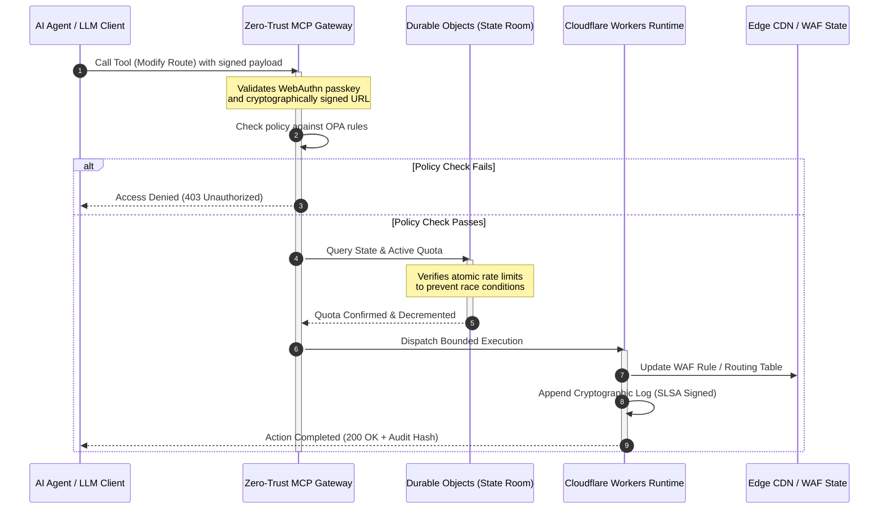

## CloudCDN: 2026-ல் AI-நேட்டிவ் எட்ஜுக்கான ஒரு திறந்த-மூல வரைவு

CDN விவாதம் முடிந்துவிட்டது. எட்ஜ் இனி ஒரு கேச் அல்ல; அது AI-நேட்டிவ் மென்பொருளுக்கான கட்டுப்பாட்டுத் தளம். ஏஜென்ட்கள் கருவிகளை அழைத்து, தரவை நகர்த்தி, கேச்களை நீக்கி, கையொப்பமிட்ட URL-களைக் கோரி, பணிப்பாய்வுகளை ஒருங்கிணைக்கும்போது, ஒளிபுகா டாஷ்போர்டுகள் மற்றும் தனியுரிம கட்டுப்பாட்டுத் தளங்களின் பழைய மாதிரி ஒரு சிரமமாக இருப்பதை நிறுத்தி ஒரு ஒழுங்குமுறை பொறுப்பாக மாறுகிறது. CloudCDN ஒரு வேறுபட்ட மாதிரிக்காக வாதிடுகிறது: பாதுகாப்பு, அணுகல்தன்மை, செயல்திறன், மற்றும் தணிக்கைத்தன்மையை விற்பனையாளர் வாக்குறுதிகளாக அல்லாமல் அமல்படுத்தக்கூடிய இயல்புநிலைகளாக கருதும் ஒரு திறந்த, ஆய்வு செய்யக்கூடிய, ஏஜென்ட்-கட்டுப்படுத்தக்கூடிய எட்ஜ் தளம்.

இந்தக் கட்டுரையின் திறந்த-மூல குறிப்புப் புள்ளி [cloudcdn.pro ⧉](https://github.com/sebastienrousseau/cloudcdn.pro "cloudcdn.pro"). இந்த களஞ்சியம் ஒரு மல்டி-டெனன்ட், AI-நேட்டிவ் CDN ஆகும், அதை முழுவதுமாக முடிவிலிருந்து முடிவு வரை படிக்கலாம் மற்றும் சுயாதீனமாக பயன்படுத்தலாம்: Cloudflare PoP-களில் 100ms-க்குக் குறைவான TTFB, MCP கட்டுப்பாடு, Durable Objects விகித வரம்பிடல், WCAG-AA அணுகல்தன்மை, கையொப்பமிட்ட URL-கள், பாஸ்கீகள், SLSA Level 3, மற்றும் 100% கவரேஜில் 3,185 சோதனைகள்.

---

> **நிர்வாகச் சுருக்கம் / முக்கிய கருத்துக்கள்**
>
> - **எட்ஜ் செயல்பாட்டு எல்லையாக மாறுகிறது.** CloudCDN வழக்கமான CDN முனைகளை மில்லிநொடிக்குக் குறைவான பாதுகாப்பு, வழிநடத்தல், மற்றும் அணுகல் கட்டுப்பாட்டை இயக்கும் செயலூக்கமான கொள்கை வாயில்களாக மாற்றுகிறது.
> - **Durable Objects விகித வரம்பிடலை அணுவாக்குகிறது.** நிகழ்நேர, உலகளவில் நிலையான ஒதுக்கீட்டு அமலாக்கம், இறுதியில் நிலையான வரம்பிடிகள் தாக்குதலாளர்களுக்கும் செயலிழந்த ஏஜென்ட்களுக்கும் திறந்து வைக்கும் இனப்-நிலைமை சாளரத்தை மூடுகிறது.
> - **ஏஜென்ட்கள் 42 வரம்பிடப்பட்ட MCP கருவிகள் மூலம் உள்கட்டமைப்பை இயக்குகின்றன.** எதுவும் இயங்குவதற்கு முன்பு ஒவ்வொரு அழைப்பும் WebAuthn பாஸ்கீகள், கையொப்பமிட்ட பேலோடுகள், மற்றும் OPA கொள்கைக்கு எதிராக சரிபார்க்கப்படுகிறது.
> - **விநியோகச் சங்கிலி தயாரிப்பின் ஒரு பகுதி.** Sigstore/Cosign வழியாக SLSA Level 3 மூல-ஆதாரம் ஒவ்வொரு வெளியீட்டையும் அதன் தணிக்கை செய்யப்பட்ட மூலத்துடன் கிரிப்டோகிராஃபிக் முறையில் இணைக்கிறது.
> - **டெலிமெட்ரி என்பது இணக்க ஆதாரம்.** எட்ஜ் செயல்பாடுகள் DORA பிரிவு 5, BCBS 239, மற்றும் Basel III செயல்பாட்டு-அபாய மூலதனத்துடன் இணைக்கின்றன — பின்-நிகழ்வு அறிக்கையிடல் மூலம் அல்லாமல், நேரடியாக.
>
---

## இந்த திறந்த-மூல திட்டம் 2026-ல் ஏன் முக்கியம்

2026-ல் நிறுவன IT, நிலையான உள்கட்டமைப்பு வழங்கலிலிருந்து நிகழ்நேர, நிகழ்வு-உந்துதல் தரவு ஒழுங்கமைப்புக்கு நகர்ந்துள்ளது. இரண்டு சந்தை சக்திகள் இந்த மாற்றத்தை உந்துகின்றன.

முதலாவது ஏஜென்டிக் AI-யின் பெருக்கம். தன்னாட்சி மாதிரிகள் மற்றும் மென்பொருள் ஏஜென்ட்கள் இப்போது சிக்கலான செயல்பாட்டுப் பணிகளை நிறைவேற்றுகின்றன — தானியங்கு அச்சுறுத்தல் தணிப்பு, வழிநடத்தல் முடிவுகள், நிகழ்நேர லெட்ஜர் சமநிலைப்படுத்தல். அவை டாஷ்போர்டுகளைப் பயன்படுத்துவதில்லை. அவை கருவிகளை அழைக்கின்றன.

இரண்டாவது [டிஜிட்டல் செயல்பாட்டு மீள்திறன் சட்டம் (DORA) ⧉](https://eur-lex.europa.eu/legal-content/EN/TXT/?uri=CELEX%3A32022R2554 "Regulation (EU) 2022/2554 on digital operational resilience for the financial sector")-ன் செயலூக்கமான அமலாக்கம். வங்கி நிறுவனங்கள் இனி ஒளிபுகா, தனியுரிம மூன்றாம் தரப்பு CDN-களை நம்ப முடியாது. ஒழுங்குமுறையாளர்கள் மென்பொருள் விநியோகச் சங்கிலியில் முழுமையான தெரிவுநிலை, சரிபார்க்கக்கூடிய வெளியேறும் திறன், மற்றும் மாற்ற முடியாத கிரிப்டோகிராஃபிக் தணிக்கை தடங்களைக் கோருகின்றனர்.

மையப்படுத்தப்பட்ட சர்வர் கட்டமைப்புகள், நிகழ்நேர ஒழுங்கமைப்பால் ஈர்க்க முடியாத தாமத அபராதங்களை விதிக்கின்றன. தனியுரிம CDN-கள் கருப்புப் பெட்டிகளாக செயல்படுகின்றன, அவை நிறுவனங்களை அவர்கள் காண முடியாத — ஆதாரப்படுத்துவது ஒருபுறமிருக்க — விநியோகச் சங்கிலி சமரசத்திற்கு வெளிப்படுத்துகின்றன. CloudCDN, எட்ஜை ஒரு செயலூக்கமான கட்டுப்பாட்டுத் தளமாக மாற்றும் ஒரு வெளிப்படையான, சூன்ய-நம்பிக்கை, திறந்த-மூல வரைவுடன் அந்த இடைவெளியை மூடுகிறது. தொழில்நுட்ப நிர்வாகிகளுக்கு, இது உரையாடலை இணக்கத்தின் செலவிலிருந்து மீள்திறனின் வருவாய்க்கு மாற்றுகிறது: தானியங்கு, தணிக்கைக்கு தயாரான செயல்பாட்டுப் பைப்லைன்களால் பாதுகாக்கப்படும் மூலதனம்.

## கட்டமைப்பு நோக்கு

CloudCDN கட்டமைப்பு ஐந்து அடுக்குகளாக அமைக்கப்பட்டுள்ளது, மையப்படுத்தப்பட்ட மிடில்வேரை உள்ளூர்மயமாக்கப்பட்ட, நிலை-கொண்ட எட்ஜ் அடிப்படைகளால் மாற்றுகிறது:

| அடுக்கு | வடிவமைப்பு முடிவு | இது ஏன் முக்கியம் | தவறாக கையாண்டால் அபாயம் |
|---|---|---|---|
| **எட்ஜ் இயக்க-நேரம்** | Cloudflare Workers மற்றும் Pages | மையப்படுத்தப்பட்ட VM தாமதத்தை நீக்குகிறது; உலகளவில் மில்லிநொடிக்குக் குறைவான கொள்கைகளை இயக்குகிறது | கொள்கை ஒழுங்கு இல்லாத செயல்திறன் ஆதாயங்கள் குழப்பமான எட்ஜ் சறுக்கலை உருவாக்குகின்றன |
| **நிலை ஒருங்கிணைப்பு** | Durable Objects | பகுதிகளுக்கிடையே விகித வரம்புகள் மற்றும் பகிரப்பட்ட நிலைக்கு அணு, நிகழ்நேர நிலைத்தன்மையை உறுதி செய்கிறது | பரவலாக்கப்பட்ட இனப்-நிலைமைகள், API வள துஷ்பிரயோகம், தவிர்க்கப்பட்ட எல்லை ஒதுக்கீடுகள் |
| **ஏஜென்ட் இடைமுகம்** | சூன்ய-நம்பிக்கை MCP நுழைவாயில் | 42 சிறப்பு MCP கருவிகளை வெளிப்படுத்துகிறது, அதனால் AI ஏஜென்ட்கள் ஆளப்பட்ட எல்லைகளுக்குள் உள்கட்டமைப்பை இயக்குகின்றன | வரம்பற்ற கருவி அழைப்பு மற்றும் அங்கீகரிக்கப்படாத கட்டமைப்பு மாற்றங்கள் |
| **அணுகல் கட்டுப்பாடு** | WebAuthn பாஸ்கீகள் மற்றும் கையொப்பமிட்ட URL-கள் | நிலையான கடவுச்சொற்களை தணிக்கை செய்யக்கூடிய செயல்பாடுகளுக்கான கிரிப்டோகிராஃபிக் கையொப்பங்களால் மாற்றுகிறது | பலவீனமாக ஒதுக்கப்பட்ட மாற்றங்கள்; எல்லை மீறலுக்கு வழிவகுக்கும் சான்று திருட்டு |
| **தர வாயில்கள்** | SLSA Level 3 மற்றும் 100% சோதனை கவரேஜ் | build மூலத்தை கணித ரீதியாக சரிபார்க்கிறது; தீங்கிழைக்கும் சார்பு ஊடுருவலைத் தடுக்கிறது | மென்பொருள் விநியோகச் சங்கிலி மூலம் தீங்கிழைக்கும் குறியீடு செருகப்படுதல் |

## கண்காணிக்க வேண்டிய செயல்பாட்டு சமிக்ஞைகள்

எட்ஜ் தயார்நிலையை அளவிட முடியும். இவை நோக்கத்தை அல்லாமல் செயல்படுத்தும் திறனை நிரூபிக்கும் அளவு குறிகாட்டிகள்:

| சமிக்ஞை | அளவீடு / அளவுகோல் | ஒழுங்குமுறை குறிப்பு | தள செயலாக்கம் |
|---|---|---|---|
| **42 MCP கருவிகள்** | தானியங்கு மேலாண்மைக்கான வரம்பிடப்பட்ட கருவி-பதிவேட்டு எண்ணிக்கை | COBIT 2019 (BAI06) | OPA கொள்கைகளுக்கு எதிராக ஏஜென்ட் கையொப்பங்களை சரிபார்க்கும் MCP நுழைவாயில் |
| **Durable Objects** | சோர்வு-இல்லாத, மில்லிநொடிக்குக் குறைவான அணு ஒதுக்கீட்டு அமலாக்கம் | DORA பிரிவு 6 | உலகளாவிய API ஒதுக்கீட்டு நிலையைக் கண்காணிக்கும் Durable Objects |
| **பாஸ்கீகள் மற்றும் கையொப்பமிட்ட URL-கள்** | FIDO2 WebAuthn வழியாக 100% நிர்வாக அமர்வுகள் சரிபார்க்கப்பட்டன | DORA பிரிவு 30 | எட்ஜ் ரூட்டரில் உட்பொதிக்கப்பட்ட கிரிப்டோகிராஃபிக் கையொப்பச் சோதனைகள் |
| **SLSA Level 3** | கிரிப்டோகிராஃபிக் முறையில் கையொப்பமிட்ட build மேனிஃபெஸ்ட்கள் (Sigstore) | DORA பிரிவு 30 | கையொப்பமிட்ட build மெட்டாடேட்டாவை உருவாக்கும் GitHub Actions பைப்லைன்கள் |
| **3,185 unit சோதனைகள்** | 100% கவரேஜ்; ஒவ்வொரு வெளியீட்டிலும் பின்னடைவு வாயில்கள் | NIST CSF 2.0 (PR.DS-01) | எந்த சோதனை தோல்வியிலும் வரிசைப்படுத்தலை நிறுத்தும் CI பைப்லைன்கள் |

## CDN ஒரு செயலூக்கமான கட்டுப்பாட்டுத் தளமாக மாறுகிறது

பாரம்பரிய CDN-கள் செயலற்ற, நிலையான உள்ளடக்க முடுக்கத்தைச் சுற்றி வடிவமைக்கப்பட்டன. CloudCDN மாதிரியை மறுவரையறை செய்கிறது. Cloudflare Workers மற்றும் Durable Objects ஒருங்கிணைக்கப்பட்டதன் மூலம், எட்ஜ் ஒரு செயலூக்கமான, நிலை-கொண்ட கொள்கை வாயிலாக செயல்படுகிறது.

ஒரு AI ஏஜென்ட் அல்லது தானியங்கு செயல்முறை உள்கட்டமைப்பு கட்டமைப்பு மாற்றம் அல்லது வழிநடத்தல் சரிசெய்தலைக் கோரும்போது, அது பாதிக்கப்படக்கூடிய, மையப்படுத்தப்பட்ட தரவுத்தளத்துடன் பேசாது. கோரிக்கை அருகிலுள்ள எட்ஜ் முனையில் இடைமறிக்கப்பட்டு, எதுவும் இயங்குவதற்கு முன்பு அடையாளம், கொள்கை, மற்றும் ஒதுக்கீட்டு சோதனைகள் வழியாக நடத்தப்படுகிறது:

அந்த வரிசையின் ஒவ்வொரு படியும் ஒரு ஒதுக்கக்கூடிய, கையொப்பமிட்ட பதிவை உருவாக்குகிறது. உள்ளடக்கத்தை முடுக்கும் ஒரு CDN-க்கும் ஆளப்படக்கூடிய ஒரு கட்டுப்பாட்டுத் தளத்திற்கும் இடையிலான வேறுபாடு அதுவே.

## திறந்த மூலம் ஏன் நம்பிக்கை மாதிரியை மாற்றுகிறது

தலைமை தகவல் பாதுகாப்பு அதிகாரிகளுக்கு, ஒளிபுகா தனியுரிம CDN-கள் ஒரு கூட்டு அபாயத்தை முன்வைக்கின்றன. மூடிய-மூல எட்ஜ் நெட்வொர்க்குகள் கருப்புப் பெட்டிகள்: விற்பனையாளர் ஒரு உள் சமரசத்தால் பாதிக்கப்பட்டால், மீறல் பகிரங்கமாக வெளிப்படுத்தப்படும் வரை வங்கிக்கு எந்த தெரிவுநிலையும் இல்லை.

CloudCDN அந்த சமச்சீரின்மையை மூன்று வழிமுறைகளின் மீது கட்டமைக்கப்பட்ட முழுமையாக தணிக்கை செய்யக்கூடிய, திறந்த-மூல நம்பிக்கை மாதிரியால் மாற்றுகிறது:

1. **கணித build மூல-ஆதாரம்.** SLSA Level 3-ன் கீழ், ஒவ்வொரு வெளியீடும் அதன் திறந்த-மூல GitHub களஞ்சியத்துடன் கிரிப்டோகிராஃபிக் முறையில் இணைக்கப்படுகிறது. Cloudflare-ன் உலகளாவிய எட்ஜ் முனைகளில் இயங்கும் பைனரி சரியாக தணிக்கை செய்யப்பட்ட மூலக் குறியீட்டைக் கொண்டுள்ளது என்பதை ஒரு CISO — ஒப்பந்த ரீதியாக அல்லாமல், கணித ரீதியாக — சரிபார்க்க முடியும்.
2. **தொடர்ச்சியான, பொது பாதுகாப்பு தணிக்கைகள்.** குறியீட்டுத்தளம் தானியங்கு ஸ்கேன்கள், பொது பாதிப்பு வெளிப்பாடு, மற்றும் சக-மதிப்பாய்வு செய்யப்பட்ட குறியீடு தணிக்கைகளுக்கு உட்படுத்தப்படுகிறது. மறைமுகம் ஒரு கட்டுப்பாடு அல்ல; மதிப்பாய்வே கட்டுப்பாடு.
3. **விற்பனையாளர் பூட்டு இல்லை (DORA பிரிவு 28).** முக்கியமான மூன்றாம் தரப்பு வழங்குநர்களிடமிருந்து தெளிவான, சோதிக்கப்பட்ட வெளியேறும் உத்தியை நிரூபிக்க வங்கிகளை DORA கோருகிறது. CloudCDN திறந்த மூலம் மற்றும் நிலையான சர்வர்லெஸ் அடிப்படைகளின் மீது கட்டமைக்கப்பட்டதால், நிறுவனங்கள் எட்ஜ் கட்டமைப்புகளை Cloudflare-லிருந்து பிற சர்வர்லெஸ் இயக்க-நேரங்களுக்கு அல்லது தனிப்பட்ட Kubernetes கிளஸ்டர்களுக்கு இடம்பெயர்க்கலாம் — மேலும் அந்தத் திறனை ஒழுங்குமுறையாளருக்கு ஆதாரப்படுத்தலாம்.

## வங்கி-தர எட்ஜ் வடிவம்

CloudCDN உலகளாவிய நிதித் துறையின் இணக்கத் தரங்களைப் பூர்த்தி செய்ய பொறியியல் செய்யப்பட்டுள்ளது, தொழில்நுட்ப எட்ஜ் செயல்பாடுகளை மேற்பார்வையாளர்கள் உண்மையில் ஆய்வு செய்யும் கட்டமைப்புகளுடன் நேரடியாக இணைக்கிறது:

- **மாதிரி அபாய மேலாண்மை ([US Fed SR 11-7 ⧉](https://web.archive.org/web/20260414150921/https://www.federalreserve.gov/supervisionreg/srletters/sr1107.htm "Supervisory Guidance on Model Risk Management") / UK PRA SS1/23).** செயல்பாட்டுப் பணிகளை நிறைவேற்றும் தன்னாட்சி மாதிரிகள் மாதிரி-அபாய ஆளுகையின் கீழ் வருகின்றன. CloudCDN-ன் MCP நுழைவாயில் ஏஜென்டிக் கருவிகளை அளவு மாதிரிகளாகக் கருதுகிறது: கடுமையான கொள்கை எல்லைகள், நிகழ்நேர பதிவு, மற்றும் அதிக-தாக்க செயல்களுக்கு கட்டாய மனிதன்-சுழற்சியில்-உள்ள மேலெழுதல்கள்.
- **BCBS 239 (அபாய தரவு திரட்டல்).** எட்ஜில் பரிவர்த்தனை தரவைப் பிடித்து, குறிச்சொல்லிட்டு, கட்டமைப்பதன் மூலம், செயல்பாட்டு அளவீடுகள் நிகழ்நேரத்தில் உருவாக்கப்படுகின்றன — தரவு ஒருமைப்பாடு, நேரமையம், மற்றும் ஒழுங்குமுறை தடம் காணுதலுக்கான BCBS 239 தேவைகளுடன் பொருந்துகிறது.
- **DORA பிரிவு 5 (வாரிய பொறுப்புக்கூறல்).** செயல்பாட்டு மீள்திறனுக்கு வாரியம் இறுதி தனிப்பட்ட பொறுப்பை ஏற்கிறது. CloudCDN எட்ஜ் டெலிமெட்ரியை, தொழில்நுட்பம் அல்லாத இயக்குநர்கள் ஒரு தனிப்பட்ட-பொறுப்பு தணிக்கைக்கு எடுத்துச் செல்லக்கூடிய அளவிடப்பட்ட, சரிபார்க்கக்கூடிய ஆதாரமாக மொழிபெயர்க்கிறது.
- **Basel III செயல்பாட்டு-அபாய மூலதனம்.** வங்கிகள் செயல்பாட்டு அபாயத்திற்கு எதிராக ஒழுங்குமுறை மூலதனத்தை வைத்திருக்கின்றன. தானியங்கு DR failover மற்றும் SLSA Level 3 மூல-ஆதாரம் நிறுவனத்தின் செயல்பாட்டு அபாய சுயவிவரத்தைக் குறைக்கின்றன — ஒரு தணிக்கையை திருப்திப்படுத்துவது மட்டுமல்லாமல், நிலைக்குறிப்பேட்டில் மூலதனத்தைப் பாதுகாக்கின்றன.

## வங்கி வகைவாரியாக இது என்ன அர்த்தம்

### உலகளவில் அமைப்பு-ரீதியாக முக்கியமான வங்கிகள் (G-SIB-கள்)

G-SIB-கள் பல அதிகார வரம்புகளில் மகத்தான பரிவர்த்தனை அளவுகளை இயக்குகின்றன. முன்னுரிமை என்பது துண்டு துண்டான பாரம்பரிய எல்லை கட்டுப்பாடுகளை ஒற்றை, ஒருங்கிணைந்த எட்ஜ் தளத்துடன் மாற்றுவது. CloudCDN வடிவத்தைப் பயன்படுத்துவது ஒரு G-SIB-ஐ உலகளவில் பாதுகாப்பு கொள்கைகள், API நுழைவாயில்கள், மற்றும் ஏஜென்டிக் ஆளுகையை தரப்படுத்த அனுமதிக்கிறது — மேலும் ஒரு காலாண்டு பதற்றமாக அல்லாமல், செயல்பாட்டின் ஒரு துணைவிளைவாக DORA-இணக்கமான ஆதாரப் பைப்லைன்களை உருவாக்குகிறது.

### பரிவர்த்தனை மற்றும் கார்ப்பரேட் வங்கிகள்

பரிவர்த்தனை வங்கிகளுக்கு, வாடிக்கையாளர்-நோக்கிய தயாரிப்பு என்பது இயக்க வேகம், பாதுகாப்பு, மற்றும் தரவு வெளிப்படைத்தன்மையின் ஒரு தொகுப்பாகும். CloudCDN வடிவம் இந்த வங்கிகள் கார்ப்பரேட் கருவூலர்களுக்கு பாதுகாப்பான API டாஷ்போர்டுகள் மற்றும் நிகழ்நேர பணப்-பாய்வு-கண்காணிப்பு சேவைகளை வெளிப்படுத்த அனுமதிக்கிறது — நிறுவன வைப்புகளைப் பாதுகாக்கும் ஒரு மீள்திறன் எட்ஜ் நிலைப்பாடு.

### பிராந்திய மற்றும் சிறிய வங்கிகள்

பிராந்திய வங்கிகள் G-SIB-களை போலவே அதே அச்சுறுத்தல் நடிகர்களை பொறியியல் பட்ஜெட்டுகள் இல்லாமல் எதிர்கொள்கின்றன. ஒரு திறந்த-மூல, வங்கி-தர எட்ஜ் வரைவு கட்டுப்பாடுகளை பெட்டியிலிருந்து வெளியே வழங்குகிறது: தனியுரிம உரிமச் செலவுகள் இல்லாமல் உடனடி ஒழுங்குமுறை சீரமைப்பு, மற்றும் அதை நிரூபிக்க மூலக் குறியீடு.

## அறையக விளையாட்டுப் புத்தகம்

செயல்பாட்டு மீள்திறன் இனி ஒரு கண்ணுக்குத் தெரியாத பின்-அலுவலக IT அளவீடு அல்ல; அது தனிப்பட்ட பொறுப்பு இணைக்கப்பட்ட ஒரு அறையக முன்னுரிமை. 2026-ல் ஒழுங்குமுறையாளர்கள், வாடிக்கையாளர்கள், மற்றும் பங்குதாரர்களின் நம்பிக்கையை வைத்திருக்கும் நிறுவனங்கள் தொழில்நுட்பத்தை ஒரு சரிபார்க்கக்கூடிய, கண்காணிக்கக்கூடிய சொத்தாக கருதுகின்றன.

மூத்த தொழில்நுட்பத் தலைவர்களுக்கான வழிகாட்டி சுருக்கமானது:

1. **ஆதாரத்தை ஒரு தயாரிப்பாக கட்டளையிடு.** எட்ஜில் தானியங்கு, சுய-ஆவணப்படுத்தும் பைப்லைன்களுக்கு பட்ஜெட் ஒதுக்கு — தணிக்கையாளருக்காக அசெம்பிள் செய்யப்பட்டது அல்லாமல், செயல்பாட்டால் உருவாக்கப்படும் ஆதாரம்.
2. **நிலை-கொண்ட எட்ஜ் கட்டுப்பாட்டுக்கு நகர்.** விகித வரம்பிடல், WAF, மற்றும் அடையாள சரிபார்ப்பை மையப்படுத்தப்பட்ட சர்வர்களிலிருந்து அணு எட்ஜ் அடிப்படைகளுக்கு எடு.
3. **கிரிப்டோகிராஃபிக் ஏஜென்டிக் எல்லைகளை நிறுவு.** ஒவ்வொரு தானியங்கு கருவி அழைப்புக்கும் பாஸ்கீ மற்றும் OPA சரிபார்ப்புடன் சூன்ய-நம்பிக்கை MCP நுழைவாயில்களை அமல்படுத்து.
4. **திறந்த-மூல build தணிக்கைகளைக் கோரு.** SLSA Level 3 build மூல-ஆதாரத்தை ஒரு அபிலாஷையாக அல்லாமல், வரிசைப்படுத்தலின் ஒரு நிபந்தனையாக ஆக்கு.

## அடிக்கடி கேட்கப்படும் கேள்விகள்

**CloudCDN DORA தணிக்கைகளுக்கு தயாரா?**

ஆம். CloudCDN, தகவல் பதிவேட்டில் உள்ள ITS டெம்ப்ளேட்களுடன் (RT.01 முதல் RT.15 வரை) மற்றும் DORA பிரிவு 30 ஒப்பந்த விதிமுறைகளுடன் நேரடியாக இணைக்கும் தானியங்கு இணக்க ஆதாரத்தை உருவாக்க பொறியியல் செய்யப்பட்டுள்ளது.

**விகித வரம்பிடலுக்கு Durable Objects-ஐப் பயன்படுத்துவதன் நன்மை என்ன?**

பாரம்பரிய பரவலாக்கப்பட்ட விகித வரம்பிடிகள் இறுதி நிலைத்தன்மையை நம்பியுள்ளன, இது தாக்குதலாளர்கள் அல்லது செயலிழந்த ஏஜென்ட்கள் சுரண்டக்கூடிய ஒரு தாமத சாளரத்தை விட்டுவைக்கிறது. Durable Objects உலகளவில் உடனடி, அணு நிலைத்தன்மையை உறுதி செய்கின்றன, இனப்-நிலைமை சாளரத்தை முழுவதுமாக மூடுகின்றன.

**CloudCDN-ஐ AI-நேட்டிவ் ஆக்குவது எது?**

அதன் MCP-கட்டுப்படுத்தப்பட்ட செயல்பாடுகள் மற்றும் ஏஜென்ட்-அறிந்த கட்டுப்பாட்டு மாதிரி. உள்கட்டமைப்பு கிரிப்டோகிராஃபிக் அடையாளம் மற்றும் கொள்கை எல்லைகளுடன் 42 ஆளப்பட்ட கருவிகள் மூலம் இயக்கப்படுகிறது — மனித டாஷ்போர்டுகளுக்கு மட்டுமல்ல, தன்னாட்சி பணிப்பாய்வுகளுக்காக வடிவமைக்கப்பட்டது.

**திறந்த-மூல குறியீடு zero-day சுரண்டல்களின் அபாயத்தை அதிகரிக்கிறதா?**

இல்லை. தனியுரிம, மூடிய-மூல CDN-கள் மறைமுகம் மூலம் பாதுகாப்பை நம்பியுள்ளன. CloudCDN-ன் குறியீட்டுத்தளம் தொடர்ச்சியாக தானியங்கு சோதனை, பொது சக மதிப்பாய்வு, மற்றும் SLSA Level 3 சரிபார்ப்புக்கு உட்படுத்தப்படுகிறது — சரிபார்க்கக்கூடிய அளவில் உயர்ந்த நம்பிக்கை வரம்பு.

## குறிப்புகள்

- ஐரோப்பிய நாடாளுமன்றம் மற்றும் ஐரோப்பிய ஒன்றியத்தின் கவுன்சில், (2022). [Regulation (EU) 2022/2554 on digital operational resilience for the financial sector (DORA) ⧉](https://eur-lex.europa.eu/legal-content/EN/TXT/?uri=CELEX%3A32022R2554 "Regulation (EU) 2022/2554 on digital operational resilience for the financial sector (DORA)"). Brussels: Official Journal of the European Union.
- வங்கி மேற்பார்வைக்கான பாஸல் குழு (BCBS), (2013). [Principles for effective risk data aggregation and risk reporting (BCBS 239) ⧉](https://www.bis.org/publ/bcbs239.htm "Principles for effective risk data aggregation and risk reporting (BCBS 239)"). Basel: Bank for International Settlements.
- ஃபெடரல் ரிசர்வ் அமைப்பின் ஆளுநர்கள் வாரியம், (2011). [Supervisory Guidance on Model Risk Management (SR Letter 11-7) ⧉](https://web.archive.org/web/20260414150921/https://www.federalreserve.gov/supervisionreg/srletters/sr1107.htm "Supervisory Guidance on Model Risk Management (SR Letter 11-7)"). Washington D.C.: Federal Reserve.
- Cloudflare, (2026). [Durable Objects documentation: stateful edge coordination ⧉](https://developers.cloudflare.com/durable-objects/ "Durable Objects documentation"). San Francisco: Cloudflare.
- Cloudflare, (2026). [Building AI agents with MCP, authentication and Durable Objects ⧉](https://blog.cloudflare.com/building-ai-agents-with-mcp-authn-authz-and-durable-objects/ "Building AI agents with MCP, authentication and Durable Objects").
- GitHub, (2026). [cloudcdn.pro repository ⧉](https://github.com/sebastienrousseau/cloudcdn.pro "cloudcdn.pro repository").
