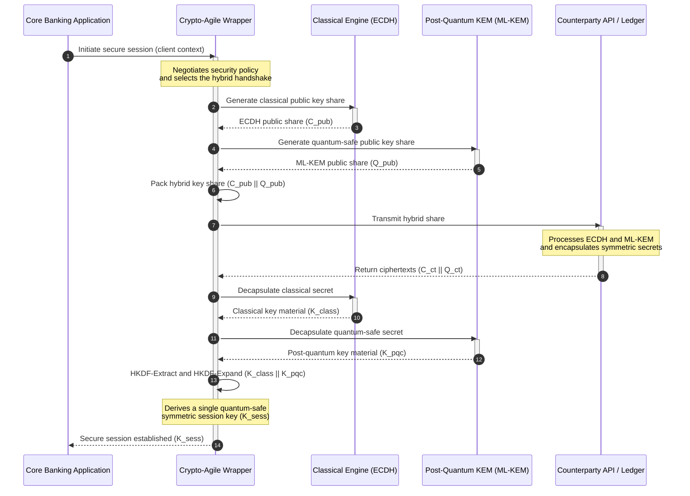

## KyberLib மற்றும் 2026 இல் பிந்தைய-குவாண்டம் வங்கி இடப்பெயர்வு: தரநிலைகளிலிருந்து குறியீட்டிற்கு

பிந்தைய-குவாண்டம் இடப்பெயர்வு ஒரு திட்டமிடல் பயிற்சியாக இருப்பதை நிறுத்திவிட்டது. 2026 இல் அது ஒரு தீவிரமான செயல்பாட்டுத் தேவை ஆகும், மேலும் ஒழுங்குமுறை நோக்கத்திற்கும் பொறியியல் செயல்பாட்டிற்கும் இடையிலான இடைவெளியிலேயே இப்போது இடர் அமர்ந்திருக்கிறது. [KyberLib ⧉](https://github.com/sebastienrousseau/kyberlib "kyberlib") அந்த இடைவெளியின் ஒரு பகுதியை மூடுகிறது: ML-KEM ஐ இறுதிசெய்யப்பட்ட FIPS 203 அளவுருக்களுக்குச் செயல்படுத்தி, ஒரு வங்கியின் பரிவர்த்தனை நிலப்பரப்பிற்கு உண்மையில் தேவைப்படும் கிரிப்டோ-சுறுசுறுப்பான எல்லைகளுக்குள் அதைப் பொதியும், உற்பத்தி-நோக்கிய, நினைவக-பாதுகாப்பான Rust நூலகம்.

---

> **நிர்வாகச் சுருக்கம் / முக்கியக் குறிப்புகள்**
>
> - **அச்சுறுத்தல் ஏற்கனவே செயல்பாட்டில் உள்ளது.** எதிரிகள் இன்று "இப்போது சேமித்து, பின்னர் மறைகுறியாக்கம் நீக்கு" சேகரிப்பை நடத்துகிறார்கள்; கிரிப்டோகிராஃபிக் ரீதியில் பொருத்தமான குவாண்டம் கணினி வரும் நாளில் தரவு இரகசியத்தன்மை பின்னோக்கியாக தோல்வியடைகிறது.
> - **தரநிலைகள் இறுதிசெய்யப்பட்டுவிட்டன.** NIST FIPS 203 (ML-KEM) மற்றும் FIPS 204 (ML-DSA) தணிக்கைக் குழுக்களுக்கு தெளிவான, சோதிக்கத்தக்க அளவுகோலை வழங்குகின்றன — இனி "தரநிலைகளுக்குக் காத்திருத்தல்" என்ற தற்காப்பு இல்லை.
> - **KyberLib என்பது பொறியியல் வரைவோலை.** நினைவக-பாதுகாப்பான Rust, HSM கள் மற்றும் ஸ்மார்ட் அட்டைகளுக்கான `no_std` தொகுப்பு, மற்றும் பாரம்பரிய இடைச்செயல்பாட்டைப் பாதுகாக்கும் கலப்பின கைகுலுக்கல் வடிவங்கள்.
> - **கிரிப்டோ-சுறுசுறுப்பே நிலையான நோக்கம்.** நிலையான சுருக்க எல்லைகள், பயன்பாட்டு மறுஎழுத்தல்கள் இல்லாமல் அடிப்படைகள் மாற அனுமதிக்கின்றன — எந்த ஒரு வழிமுறையையும் விட நீடித்திருக்கும் பாடம்.
> - **வாரியங்களே பொறுப்பைச் சுமக்கின்றன.** DORA பிரிவு 5 இயக்குநர்கள் மீது தனிநபர் பொறுப்பை வைக்கிறது; ஆய்வுக்குட்படுத்தக்கூடிய, கண்காணிக்கத்தக்க இடப்பெயர்வுக் குறியீடே அதைத் திருப்திப்படுத்தும் ஆதாரம்.
>
---

## 2026 இல் இந்த திறந்த-மூல திட்டம் ஏன் முக்கியம்

சமச்சீரற்ற கிரிப்டோகிராஃபி வழக்கொழிதலை நெருங்கும்போது, அச்சுறுத்தல் கிரிப்டோகிராஃபிக் ரீதியில் பொருத்தமான குவாண்டம் கணினி கட்டப்படுவதற்குக் காத்திருக்காது. எதிரிகள் இப்போது **"இப்போது சேமித்து, பின்னர் மறைகுறியாக்கம் நீக்கு" (SNDL)** தாக்குதல்களைச் செயல்படுத்துகிறார்கள் — பெருநிறுவன வங்கிப் பரிவர்த்தனைகள், வர்த்தக ரகசியங்கள், மற்றும் நிறுவனத் தொடர்புகளின் மறைகுறியாக்கப்பட்ட போக்குவரத்து நீரோட்டங்களைச் சேகரித்து, குவாண்டம் திறன்கள் முதிர்ச்சியடைந்ததும் அவற்றை மறைகுறியாக்கம் நீக்கும் நோக்கத்துடன். ஒரு வங்கியைப் பொறுத்தவரை, இன்று கம்பியில் உள்ள ஒவ்வொரு பாரம்பரியக் கைகுலுக்கலும் தாமதப்படுத்தப்பட்ட வெடிப்புத் தேதியைக் கொண்ட இரகசியத்தன்மை மீறல் ஆகும்.

ஒழுங்குமுறையாளர்கள் உறுதியான கடமைகளுடன் பதிலளித்துள்ளனர்:

1. **DORA பிரிவு 6 (ICT இடர் மேலாண்மை)** நிறுவனங்கள் தங்கள் கிரிப்டோகிராஃபிக் நிலப்பரப்பு முழுவதும் பாதிப்புகளை வரைபடமாக்கவும், அடையாளம் காணவும், தணிக்கவும் தேவைப்படுகிறது — யாரும் பட்டியலிடாத மிடில்வேரில் புதைந்திருக்கும் சமச்சீரற்ற விசை பரிமாற்றம் உட்பட.
2. **NIST FIPS 203 மற்றும் 204** விசை உறையிடல் (ML-KEM) மற்றும் டிஜிட்டல் கையொப்பங்களுக்கான (ML-DSA) அதிகாரப்பூர்வ பிந்தைய-குவாண்டம் தரநிலைகளை நிறுவுகின்றன, இடப்பெயர்வு முன்னேற்றம் அளவிடப்படும் தரப்படுத்தப்பட்ட அளவுகோலை தணிக்கைக் குழுக்களுக்கு வழங்குகின்றன.

நேரடி செயல்பாடுகளைச் சீர்குலைக்காமல் இந்த இடப்பெயர்வைச் செயல்படுத்த, கொள்கை ஆவணங்களைத் தாண்டி **ஆய்வுக்குட்படுத்தக்கூடிய, திறந்த-மூல கிரிப்டோகிராஃபிக் உள்கட்டமைப்பிற்கு** நகர வேண்டும். [KyberLib ⧉](https://github.com/sebastienrousseau/kyberlib "kyberlib") சரியாக அதையே வழங்குகிறது: FIPS 203 உடன் இணங்கும் நினைவக-பாதுகாப்பான Rust நூலகம், பிந்தைய-குவாண்டம் மாற்றத்தை அளவிடக்கூடிய, சரிபார்க்கக்கூடிய பொறியியல் குழாய்வழியாக மாற்றுகிறது — மேலும் தொழில்நுட்ப முதலீட்டு உரையாடலை உறுதியான Return on Resilience நோக்கி மாற்றுகிறது.

## கட்டமைப்பு நோக்கம்

KyberLib நிலையான API எல்லைகளுக்குப் பின்னால் அமர்ந்து, குறைந்த-நிலை கிரிப்டோகிராஃபிக் அடிப்படைகளில் ஏற்படும் மாற்றங்களிலிருந்து ஒரு வங்கியின் முக்கிய பரிவர்த்தனை பயன்பாடுகளைக் காப்பிடுகிறது.

| அடுக்கு | வடிவமைப்பு முடிவு | ஏன் இது முக்கியம் | தவறாகக் கையாளப்பட்டால் இடர் |
|---|---|---|---|
| **அடிப்படை** | FIPS 203 ML-KEM விசை உறையிடல் | பாரம்பரிய Diffie-Hellman மற்றும் RSA விசை பரிமாற்றத்தை லேட்டிஸ்-அடிப்படையிலான கட்டமைப்புகளால் மாற்றுகிறது | இறுதிசெய்யப்பட்ட FIPS 203 அளவுருக்களுடன் இணக்கமின்மை, தோல்வியுற்ற இணக்கத் தணிக்கைகளுக்கு வழிவகுக்கிறது |
| **மொழி** | நினைவக-பாதுகாப்பான Rust செயலாக்கம் | C/C++ க்கு பொதுவான நினைவக-சிதைவு பாதிப்புகளை (இடையகச் செறிவுகள், use-after-free) ஒழிக்கிறது | உருவாக்க-சங்கிலி ஒருமைப்பாட்டைச் சமரசம் செய்யும் சார்பு பரவல் |
| **சுருக்கம்** | நிலையான கிரிப்டோ-சுறுசுறுப்பான எல்லைகள் | தரநிலைகள் வளர்ச்சியடையும்போது பயன்பாடுகள் ஒருங்கிணைந்த இடைமுகத்திற்குப் பின்னால் வழிமுறைகளை மாற்றுகின்றன | ஒவ்வொரு எதிர்கால இடப்பெயர்விலும் கைமுறை மறுஎழுத்தல்களை வலியுறுத்தும் கடின-குறியிடப்பட்ட அடிப்படைகள் |
| **வரிசைப்படுத்தல்** | கலப்பின மறைகுறியாக்க கைகுலுக்கல்கள் | இரட்டை-உறையிட்ட உறையில் பிந்தைய-குவாண்டம் KEM களை பாரம்பரிய வழிமுறைகளுடன் இணைக்கிறது | மரபு இடைச்செயல்பாட்டின் இழப்பு அல்லது அமைதியான கட்டமைப்பு சறுக்கல் |
| **உறுதிப்பாடு** | SLSA நிலை 3 மூலவாதம் மற்றும் ஆய்வுக்குட்படுத்தக்கூடிய சோதனைகள் | குறியீட்டு மூலம் மற்றும் மூலவாதத்தை உறுதி செய்கிறது; எடுத்துக்காட்டுகளை வரிக்கு வரி தணிக்கை செய்யலாம் | பாதுகாப்பு நாடகம் — உற்பத்தியில் செயலாக்கப் பிழைகள் வெளிப்படும் கருப்பு-பெட்டி நூலகங்கள் |

## கண்காணிக்க வேண்டிய செயல்பாட்டு சமிக்ஞைகள்

மேற்பார்வை வாரியங்கள் மற்றும் ஒழுங்குமுறையாளர்களுக்கு பிந்தைய-குவாண்டம் இணக்கத்தை நிரூபிப்பது என்பது குறிப்பிட்ட, அளவிடக்கூடிய அளவீடுகளைக் கண்காணிப்பதைக் குறிக்கிறது:

| சமிக்ஞை | அளவீடு | ஒழுங்குமுறை குறிப்பு | தளச் செயலாக்கம் |
|---|---|---|---|
| **FIPS 203 ML-KEM இணக்கம்** | இறுதிசெய்யப்பட்ட அளவுருக்களுடன் 100% இணக்கம் (ML-KEM-512/768/1024) | NIST FIPS 203 | KyberLib தொகுதிகளுக்குள் தொகுக்கப்பட்ட அளவுரு-சரிபார்க்கப்பட்ட லேட்டிஸ் கிரிப்டோகிராஃபி |
| **கிரிப்டோகிராஃபிக் சரக்கு** | அனைத்து அமைப்புகளிலும் சமச்சீரற்ற விசை-பரிமாற்ற பயன்பாட்டின் முழுமையான சரக்கு | NIST SP 1800-38 | செயலில் உள்ள சைஃபர் தொகுப்புகளை மைய பதிவேட்டில் பதிவுசெய்யும் தானியங்கு ஸ்கேனிங் ஏஜென்ட்கள் |
| **கலப்பின விசை பரிமாற்றம்** | கலப்பின உறையில் செயல்படுத்தப்படும் போக்குவரத்து-அடுக்கு கைகுலுக்கல்களின் சதவீதம் | DORA பிரிவு 6 | பாரம்பரிய TLS 1.3 கைகுலுக்கல்களை PQC உறையிடலில் பொதியும் நெட்வொர்க் ப்ராக்ஸிகள் |
| **`no_std` தொகுப்பு** | கட்டுப்படுத்தப்பட்ட இலக்குகளுக்கு Rust இன் நிலையான நூலகம் இல்லாமல் தொகுக்கும் திறன் | DORA பிரிவு 30 | Hardware Security Modules களுக்கு KyberLib இல் நிபந்தனை `no_std` தொகுப்பு |
| **கிரிப்டோ-சுறுசுறுப்பு குறியீட்டெண்** | API நுழைவாயில் முழுவதும் ஒரு கிரிப்டோகிராஃபிக் அடிப்படையை மாற்ற நிமிடங்களில் ஆகும் நேரம் | UK PRA SS1/23 | இயக்க-நேர மாறிகள் வழியாக வழிமுறை ஒதுக்கீட்டை நிர்வகிக்கும் சுருக்கப்பட்ட வழிமாற்று பதிவேடுகள் |

## பிந்தைய-குவாண்டம் கிரிப்டோகிராஃபிக்கு Rust ஏன் முக்கியம்

ML-KEM போன்ற பிந்தைய-குவாண்டம் வழிமுறைகளைச் செயல்படுத்துவதற்கு பல்லுறுப்புக்கோவை வளையங்களில் சிக்கலான, குறைந்த-நிலை கணித செயல்பாடுகள் தேவை. வரலாற்று ரீதியாக, அந்த செயல்பாடுகளை உற்பத்தி வேகத்தில் இயக்குவது என்பது கையால் எழுதப்பட்ட C/C++ அல்லது அசெம்பிளியைக் குறித்தது — நினைவக சிதைவுக்கான ஒரு பெரிய தாக்குதல் மேற்பரப்பு, ஒரு வங்கி மிகக் குறைவாகவே தவறாகச் செய்ய முடியாத துல்லியமான குறியீட்டில்.

Rust மூன்று உறுதியான வழிகளில் கிரிப்டோகிராஃபிக் பொறியியலின் பாதுகாப்பு நிலைப்பாட்டை மாற்றுகிறது:

1. **தொகுப்பு-நேர நினைவகப் பாதுகாப்பு.** Rust இன் உரிமை மாதிரி, இடையகச் செறிவுகள், இரட்டை விடுவிப்புகள், மற்றும் use-after-free பிழைகள் தொகுப்பு நேரத்தில் தடுக்கப்படுவதை உறுதி செய்கிறது. விசை அளவுகள் மற்றும் சைஃபர்உரைகள் அவற்றின் பாரம்பரிய இணைகளை விட கணிசமாகப் பெரியதாக இருக்கும் பிந்தைய-குவாண்டம் நூலகங்களுக்கு அது கூர்மையாக முக்கியம்.
2. **தீர்மானகரமான, பூஜ்ஜிய-செலவு சுருக்கங்கள்.** Rust குப்பை சேகரிப்பான் இல்லாமல் நேட்டிவ் இயந்திரக் குறியீட்டிற்குத் தொகுக்கிறது, எனவே செயலாக்க வேகமும் நினைவக அடிச்சுவடும் பாதுகாப்பைப் பாதுகாத்துக்கொண்டே C-அடிப்படையிலான நூலகங்களுக்கு நிகராகவோ அல்லது அதற்கு மேலாகவோ இருக்கின்றன.
3. **`no_std` இணக்கத்தன்மை.** KyberLib Rust இன் நிலையான நூலகம் இல்லாமல் தொகுக்கிறது, எனவே அது கட்டுப்படுத்தப்பட்ட, வெறும்-உலோக சூழல்களில் — Hardware Security Modules மற்றும் ஸ்மார்ட் அட்டைகள் உட்பட — இயங்குகிறது, வங்கி-தர கிரிப்டோகிராஃபியை உடல் பாதுகாப்பு எல்லைகளுக்குள் வைத்திருக்கிறது.

## கிரிப்டோ-சுறுசுறுப்பான கட்டமைப்பை வடிவமைத்தல்

கிரிப்டோகிராஃபிக் இடப்பெயர்வுகளில் உள்ள கிளாசிக் தோல்வி முறை கடின-குறியிடல்: பயன்பாட்டு தர்க்கத்தில் நேரடியாகப் பதிக்கப்பட்ட வழிமுறை-குறிப்பிட்ட அனுமானங்கள், ஒவ்வொரு மாற்றத்திலும் வேதனையுடன் மீண்டும் கண்டறியப்படுகின்றன. 2026 க்கான நிலையான நோக்கம் **கிரிப்டோ-சுறுசுறுப்பு** — வழிமுறைகளை ஒரு நிலையான இடைமுகத்திற்குப் பின்னால் மாற்றக்கூடிய தொகுதிகளாகக் கருதும் ஒரு சுருக்க அடுக்கு, இதனால் அடுத்த இடப்பெயர்வு நிலப்பரப்பு-அளவிலான மறுஎழுத்தலை விட ஒரு கட்டமைப்பு மாற்றமாக இருக்கும்.

KyberLib இன் கிரிப்டோ-சுறுசுறுப்பான உறை ஒரு கலப்பின (பாரம்பரியம் மற்றும் பிந்தைய-குவாண்டம்) விசை-பரிமாற்ற கைகுலுக்கலை எவ்வாறு ஒருங்கிணைக்கிறது என்பதை கீழே உள்ள வரிசை காட்டுகிறது:

கலப்பின உறையே செயல்பாட்டு ரீதியாக முக்கியமான விவரம். பிந்தைய-குவாண்டம் அடிப்படைகள் பல ஆண்டுகள் உற்பத்தி ஆய்வைச் சேகரிக்கும் வரை, அமர்வு விசை பாரம்பரிய மற்றும் பிந்தைய-குவாண்டம் ரகசியம் ஆகிய இரண்டிலிருந்தும் பெறப்படுகிறது: ஒரு தாக்குபவர் சேனலை மீட்டெடுக்க ECDH **மற்றும்** ML-KEM ஆகிய இரண்டையும் உடைக்க வேண்டும். இடம்பெயராத எதிர்தரப்பினர் தொடர்ந்து செயல்படுகிறார்கள்; இடம்பெயர்ந்தவர்கள் உடனடியாக லேட்டிஸ்-அடிப்படையிலான பாதுகாப்பைப் பெறுகிறார்கள்.

## வாரியறை நாடகப் புத்தகம்

பிந்தைய-குவாண்டம் பாதுகாப்பு என்பது பின்-அலுவலக மறைகுறியாக்கக் கவலை அல்ல; அது தனிநபர் பங்குகளுடன் கூடிய வாரியறை நிர்வாகப் பிரச்சினை. மூத்த மேலாளர்கள் இடப்பெயர்வை நம்பிக்கைப் பொறுப்பின் மூலம் வடிவமைக்க வேண்டும்:

- **DORA பிரிவு 5 (நிர்வாகம் மற்றும் அமைப்பு)** ICT பாதுகாப்பிற்கான தனிநபர் பொறுப்பை இயக்குநர்கள் வாரியத்தின் மீது வைக்கிறது. திறந்த-மூல, கண்காணிக்கத்தக்க சோதனைகளே ஒரு தனிநபர்-பொறுப்பு தணிக்கை கேட்கும் நேரடி ஆதாரம் — "நாங்கள் ஒரு ஆய்வுக்குட்படுத்தக்கூடிய FIPS 203 செயலாக்கத்தைத் தேர்ந்தெடுத்தோம், இதோ அதன் இணக்க இயக்கங்கள்" என்பது தற்காக்கத்தக்க பதில்; "எங்கள் விற்பனையாளர் எங்களுக்கு உறுதியளித்தார்" என்பது அல்ல.
- **மாதிரி இடர் மேலாண்மை (US Fed SR 11-7 / UK PRA SS1/23)** விலை நிர்ணய மாதிரிகளுக்குப் பொருந்துவது போலவே கிரிப்டோகிராஃபிக் உறை கட்டமைப்புகளுக்கும் பொருந்துகிறது. சுருக்க அடுக்குகள், தீவிர சீர்குலைவு காட்சிகளின் கீழ் செயல்திறன் உட்பட, MRM சரிபார்ப்பின் வழியாகச் செல்ல வேண்டும்.
- **Basel III செயல்பாட்டு-இடர் மூலதனம்** நிரூபிக்கப்பட்ட கட்டுப்பாட்டு முதிர்ச்சிக்கு வெகுமதி அளிக்கிறது. சோதிக்கப்பட்ட கலப்பின கைகுலுக்கல்கள் நிறுவனத்தின் நீண்டகால செயல்பாட்டு இடர் விவரக்குறிப்பைக் குறைக்கின்றன, மூலதன பிரீமியத்தைக் குறைத்து, செயலில் உள்ள கருவூல வரிசைப்படுத்தலுக்கான இருப்புநிலைத் திறனை விடுவிக்கின்றன.

## வங்கி வகைப்படி இதன் அர்த்தம் என்ன

### உலகளாவிய முறையான முக்கியத்துவம் வாய்ந்த வங்கிகள் (G-SIBs)

G-SIB கள் மரபு-நிறைந்த பரிவர்த்தனை நிலப்பரப்புகளை இயக்குகின்றன, எனவே அவற்றின் கட்டுப்படுத்தும் தடை கண்டுபிடிப்பு: சமச்சீரற்ற விசை பரிமாற்றம் உண்மையில் எங்கு நிகழ்கிறது என்பதை அறிதல். NIST SP 1800-38 வழிகாட்டுதலின் கீழ் தொடர்ச்சியான கிரிப்டோகிராஃபிக் சரக்குகள் முதலில் வருகின்றன; பின்னர் KyberLib, சரக்கு வெளிப்படுத்தும் ஒவ்வொரு நவீன கணுவிலும் பிந்தைய-குவாண்டம் விசை உறையிடலைச் செயல்படுத்துவதற்கான தரப்படுத்தப்பட்ட, நினைவக-பாதுகாப்பான நூலகத்தை வழங்குகிறது.

### பரிவர்த்தனை மற்றும் பெருநிறுவன வங்கிகள்

கட்டண தண்டவாளங்கள் முழுவதும் இரகசியத்தன்மையே உரிமையாகும். KyberLib வெறும்-உலோக `no_std` இலக்குகளுக்குத் தொகுப்பதால், பரிவர்த்தனை வங்கிகள் பிந்தைய-குவாண்டம் கைகுலுக்கல்களை நேரடியாக விளிம்பு கட்டண-வழிமாற்று மற்றும் பணப்புழக்க-மேலாண்மை வன்பொருளுக்குள் — வெறும் பயன்பாட்டு அடுக்கில் மட்டுமல்ல — வரிசைப்படுத்த முடியும்.

### பிராந்திய மற்றும் சிறிய வங்கிகள்

பிராந்திய நிறுவனங்கள் G-SIB ஆராய்ச்சி பட்ஜெட்டுகள் இல்லாமல் அதே அரசு-ஆதரவு சேகரிப்பை எதிர்கொள்கின்றன. ஒரு ஆய்வுக்குட்படுத்தக்கூடிய, திறந்த-மூல Rust செயலாக்கம், கருப்பு-பெட்டி விற்பனையாளர் வரைபடங்களைப் பேச்சுவார்த்தை நடத்தாமல், NIST FIPS 203 இணக்கத்திற்கு உடனடியாக ஒரு திறவுகோல்-தயார் பாதையை அவர்களுக்கு வழங்குகிறது.

## வரைபடங்களிலிருந்து தொகுக்கப்படும் குறியீட்டிற்கு

பிந்தைய-குவாண்டம் மாற்றம் ஒரு தீவிரமான பொறியியல் பணி ஆகும், மேலும் 2026 வரை மேற்பார்வையாளர்கள், எதிர்தரப்பினர், மற்றும் பெருநிறுவன கருவூலப் பொறுப்பாளர்களின் நம்பிக்கையைத் தக்கவைத்துக்கொள்ளும் நிறுவனங்கள், சுருக்கமான வரைபடங்களிலிருந்து கண்காணிக்கத்தக்க, தொகுக்கப்படும் குறியீட்டிற்கு நகர்பவையே. நிர்வாக ஆணை நேரடியாகப் பின்தொடர்கிறது: மரபு விசை-பரிமாற்றப் புள்ளிகளைத் தணிக்கை செய்யுங்கள், மிக-உயர்-மதிப்புச் சேனல்களில் கலப்பின கைகுலுக்கல்களை வரிசைப்படுத்துங்கள், மற்றும் ஒவ்வொரு எதிர்கால அடிப்படை மாற்றத்தையும் வழக்கமாக்கும் நிலையான சுருக்க எல்லைகளை உருவாக்குங்கள். KyberLib அந்த ஒவ்வொரு படியையும் ஸ்லைடுவேர் உறுதிமொழியை விட அளவிடக்கூடிய செயல்பாட்டுத் திறனாக மாற்றுகிறது.

## அடிக்கடி கேட்கப்படும் கேள்விகள்

**KyberLib இறுதிசெய்யப்பட்ட NIST தரநிலைகளுடன் இணக்கமானதா?**

ஆம். KyberLib, FIPS 203 இல் இறுதிசெய்யப்பட்ட ML-KEM இன் அளவுருக்களைச் சுற்றி வடிவமைக்கப்பட்டுள்ளது, தொகுக்கப்பட்ட நூலகத்தை கூட்டாட்சி மற்றும் உலகளாவிய ஒழுங்குமுறை எதிர்பார்ப்புகளுடன் ஒத்திசைத்து வைக்கிறது.

**பிந்தைய-குவாண்டம் நூலகத்திற்கு சிறப்பு வன்பொருள் தேவையா?**

இல்லை. KyberLib இன் Rust செயலாக்கம் நிலையான கணினி கட்டமைப்புகளுக்குத் தொகுக்கிறது. அதன் `no_std` திறன், உடல் விசை காவலில் வைத்தல் தேவைப்படும் சிறப்பு Hardware Security Modules மற்றும் ஸ்மார்ட் அட்டைகளிலும் அதை இயங்க அனுமதிக்கிறது.

**"இப்போது சேமித்து, பின்னர் மறைகுறியாக்கம் நீக்கு" தற்போதைய இணக்கத்தை எவ்வாறு பாதிக்கிறது?**

போக்குவரத்து அடுக்கு பாரம்பரிய RSA அல்லது ECC ஐ நம்பியிருந்தால், எதிரிகள் இன்று போக்குவரத்தைச் சேகரித்து, குவாண்டம் திறன் முதிர்ச்சியடைந்ததும் அதை மறைகுறியாக்கம் நீக்க முடியும். இப்போது வரிசைப்படுத்தப்பட்ட கலப்பின விசை பரிமாற்றம், கைப்பற்றப்பட்ட தரவை லேட்டிஸ்-அடிப்படையிலான பாதுகாப்பிற்குப் பின்னால் வைத்திருக்கிறது.

**பிந்தைய-குவாண்டம் அடிப்படைகளுக்கு நேரடியாக நகர்வதற்குப் பதிலாக ஏன் கலப்பின கைகுலுக்கல்கள்?**

கலப்பின உறைகள் அமர்வு விசையை ஒரு பாரம்பரிய மற்றும் ஒரு பிந்தைய-குவாண்டம் ரகசியம் ஆகிய இரண்டிலிருந்தும் பெறுகின்றன, எனவே இரண்டும் உடைக்கப்படாதவரை பாதுகாப்பு நிலைத்திருக்கிறது. அது புதிய அடிப்படைகள் உற்பத்தி ஆய்வைச் சேகரிக்கும்போது, இடம்பெயராத எதிர்தரப்பினருடன் இடைச்செயல்பாட்டைப் பாதுகாக்கிறது.

## குறிப்புகள்

- National Institute of Standards and Technology, (2024). [FIPS 203: Module-Lattice-Based Key-Encapsulation Mechanism Standard ⧉](https://www.nist.gov/news-events/news/2024/08/nist-releases-first-3-finalized-post-quantum-encryption-standards "NIST FIPS 203 announcement").
- Board of Governors of the Federal Reserve System, (2011). [Supervisory Guidance on Model Risk Management (SR Letter 11-7) ⧉](https://web.archive.org/web/20260414150921/https://www.federalreserve.gov/supervisionreg/srletters/sr1107.htm "Federal Reserve SR 11-7").
- European Parliament and Council of the European Union, (2022). [Regulation (EU) 2022/2554 on digital operational resilience for the financial sector (DORA) ⧉](https://eur-lex.europa.eu/legal-content/EN/TXT/?uri=CELEX%3A32022R2554 "DORA Regulation").
- NIST National Cybersecurity Center of Excellence, (2025). [Migration to Post-Quantum Cryptography (NIST SP 1800-38) ⧉](https://www.nccoe.nist.gov/projects/migration-post-quantum-cryptography "NIST SP 1800-38").
- GitHub, (2026). [kyberlib open-source repository ⧉](https://github.com/sebastienrousseau/kyberlib "kyberlib repository").
