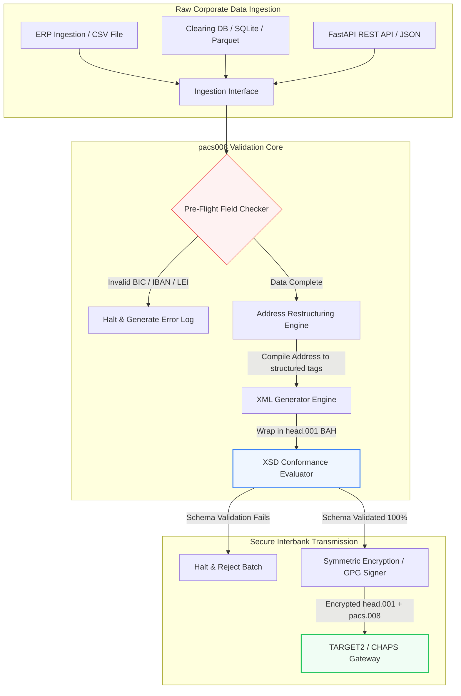

## 2026-இல் திறந்த மூல Python மூலம் ISO 20022 pacs.008 வங்கிகளுக்கிடையேயான கட்டணங்களைத் தானியக்கமாக்குதல்

பாரம்பரிய நிதித் தரவுக்கும் கட்டமைக்கப்பட்ட வங்கிகளுக்கிடையேயான செய்தியிடலுக்கும் இடையிலான இடைவெளியை, தணிக்கை செய்யக்கூடிய, திட்டவரைவு-சரிபார்க்கப்பட்ட Python குழாய்வழியின் மூலம் இணைத்தல்.

இந்தக் கட்டுரையின் திறந்த மூல மேற்கோள் புள்ளி [pacs008 ⧉](https://github.com/sebastienrousseau/pacs008 "pacs008 — open-source Python library") ஆகும். இந்தக் களஞ்சியம் [ISO 20022](/2023-09-29-automating-iso-20022-compliant-payment-file-creation-with-pain001/index.html) pacs.008 FI-to-FI வாடிக்கையாளர் கடன் பரிமாற்ற XML செய்திகளைத் தானியக்கமாக்குவதற்கான Python நூலகமாக நிலைநிறுத்தப்பட்டுள்ளது.

## 2026-இல் இந்தத் திறந்த மூலத் திட்டம் ஏன் முக்கியமானது

உலகளாவிய வங்கிகளுக்கிடையேயான கட்டண அறவீட்டு உள்கட்டமைப்பு கிட்டத்தட்ட அரை நூற்றாண்டில் தனது மிக ஆழமான நவீனமயமாக்கலைக் கடந்து வருகிறது.

ஜூன் 2026-இல், நிதிச் சேவைத் துறை **நவம்பர் 14, 2026 SWIFT கட்டமைக்கப்பட்ட முகவரி எல்லையை** வேகமாக நெருங்கி வருகிறது. இந்தத் தேதியிலிருந்து, SWIFT CBPR+ வழிகாட்டுதல்கள், TARGET2, CHAPS, Fedwire மற்றும் Canadian Lynx ஆகியவற்றுடன், கட்டமைக்கப்படாத அஞ்சல் முகவரி வரிகளை (`<PstlAdr>` தொகுதிகளுக்குள் `<AdrLine>` மட்டுமே பயன்படுத்துதல்) அதிகாரப்பூர்வமாக நிறுத்தும். பங்கேற்கும் அனைத்து நிதி நிறுவனங்களும் முகவரிகளை கலப்பினத் தோற்றத்தில் (கட்டமைக்கப்பட்ட `<TwnNm>` மற்றும் `<Ctry>`, மீதமுள்ள விவரங்களுக்கு அதிகபட்சம் இரண்டு `<AdrLine>` உறுப்புகளுடன்) அல்லது முழுமையாகக் கட்டமைக்கப்பட்ட தோற்றத்தில் (தெருப் பெயர், கட்டிட எண் மற்றும் அஞ்சல் குறியீட்டிற்கான தனிப்பட்ட உறுப்புகள்) அனுப்ப வேண்டும். இந்த அளவுகோலைப் பூர்த்தி செய்யத் தவறும் எந்தச் செய்தியும் நெட்வொர்க் எல்லையில் நிராகரிக்கப்படும்.

நிதி நிறுவனங்களுக்கு, இந்த மாற்றம் பெரிய செயல்பாட்டுக் கட்டுப்பாடுகளை உருவாக்குகிறது:

1. **எல்லை-நிராகரிப்பு அபராதம்.** கட்டமைக்கப்பட்ட முகவரி அளவுகோல்களைப் பூர்த்தி செய்யத் தவறும் கட்டணங்கள் உடனடி நெட்வொர்க் நிராகரிப்புகளை எதிர்கொள்ளும், இது பரிவர்த்தனைத் தாமதங்கள், பணப்புழக்கத் தடைகள் மற்றும் செயல்பாட்டுப் பின்னடைவுகளைத் தூண்டும்.
2. **SEPA பயனாளர் சரிபார்ப்பு (VoP).** SEPA மண்டலத்திற்குள் உள்ள அனைத்து கட்டணச் சேவை வழங்குநர்களும் (PSPs) கடன் பரிமாற்றங்களைச் செயல்படுத்துவதற்கு முன்பு பயனாளரின் பெயருக்கும் IBAN-க்கும் இடையிலான பொருத்தத்தைச் சரிபார்க்க வேண்டும் என்பதைக் கட்டாயமாக்குகிறது, இது செய்தித் தொடக்கத்திற்கு மற்றொரு சரிபார்ப்பு வாயிலைச் சேர்க்கிறது.

[Pacs008](https://github.com/sebastienrousseau/pacs008) இந்தச் சிக்கலைத் தீர்க்கிறது. இது மூல நிதித் தரவை முழுமையாகச் சரிபார்க்கப்பட்ட, திட்டவரைவு-இணக்கமான ISO 20022 pacs.008 வங்கிகளுக்கிடையேயான வாடிக்கையாளர் கடன் பரிமாற்ற செய்திகளாக மாற்றுவதைத் தானியக்கமாக்கும் ஒரு திறந்த மூல, இலகுரக Python நூலகம். பாரம்பரிய-முதல்-கட்டமைக்கப்பட்ட தரவு இடைவெளியை இணைப்பதன் மூலம், pacs008 உயர் மீள்திறன் மீதான வருவாயை (RoR) வழங்குகிறது, செயல்பாட்டு மூலதனத்தைப் பாதுகாக்கிறது மற்றும் உலகளாவிய பாதைகளில் நிகழ்நேரச் செயல்பாட்டைப் பாதுகாக்கிறது.

## pacs008 2026 கட்டமைப்புக் கண்ணோட்டம்

pacs008 நூலகம் ஒரு தனிமைப்படுத்தப்பட்ட சரிபார்ப்பு மற்றும் உருவாக்க இயந்திரமாகக் கட்டமைக்கப்பட்டுள்ளது, மூல உள்ளீடுகள் முறையாகப் பாகுபடுத்தப்பட்டு, செழுமைப்படுத்தப்பட்டு, நிலையான உறைகளில் சுற்றப்படுவதை உறுதி செய்கிறது:

| அடுக்கு | வடிவமைப்பு முடிவு | இது ஏன் முக்கியமானது | தவறாகக் கையாளப்பட்டால் ஆபத்து |
|---|---|---|---|
| **உள்ளீட்டு அடுக்கு** | CSV, JSON, SQLite மற்றும் Parquet உட்கிரகிப்பு | வங்கி ஒருங்கிணைப்புக் குழுக்களின் தரவு ஏற்கனவே இருக்கும் இடத்தில் அவர்களைச் சந்திக்கிறது, தளப் புலப்பெயர்வுகளைத் தடுக்கிறது. | மூல, சரிபார்க்கப்படாத, அல்லது சிதைந்த தரவுச் சுமைகளை உட்கிரகித்தல். |
| **சரிபார்ப்பு அடுக்கு** | அதிகாரப்பூர்வ XSD திட்டவரைவுகள் மற்றும் தனிப்பயன் வணிக விதிகளுக்கு எதிரான முன்-பறப்புச் சரிபார்ப்பு | கட்டண கோப்பு அறவீட்டு நெட்வொர்க்கிற்கு அனுப்பப்படுவதற்கு முன்பே செயலாக்கத்தை நிறுத்தி, பிழைகளைக் கொடியிடுகிறது. | உடனடி நெட்வொர்க் நிராகரிப்புகளையும் அறவீட்டுத் தாமதங்களையும் தூண்டும் தவறான XML கோப்புகள். |
| **BAH உறை அடுக்கு** | தானியங்கி வணிகப் பயன்பாட்டுத் தலைப்பு (head.001) சுற்றிடல் | `<MsgDefIdr>` குறிச்சொல்லின் அடிப்படையில் செய்தி அனுப்புதல் மற்றும் வழிசெலுத்தலைத் தரப்படுத்துகிறது. | தேவையான வெளிப்புற உறை இல்லாமல் மூல pacs.008 சுமைகளை அனுப்புதல், அமைப்பு நிராகரிப்பை ஏற்படுத்துதல். |
| **தொடராக்க அடுக்கு** | நிலையான XML மற்றும் ISO-இணக்கமான JSON (TS 23029) ஆதரவு | XML மற்றும் JSON சுமைகளுக்கு இடையே நேரடி மொழிபெயர்ப்பை இயலச் செய்கிறது, நவீன REST API மற்றும் Kafka ஸ்ட்ரீமிங்கை ஆதரிக்கிறது. | அதிகாரப்பூர்வ ISO வழிகாட்டுதல்களை மீறும் துண்டுபட்ட தரவு பிரதிநிதித்துவங்கள். |
| **கண்காணிப்பு அடுக்கு** | UETR-இல் விசைப்படுத்தப்பட்ட OpenTelemetry தடமறிதல் | விரிவான செயலாக்கப் பாதைகள் மற்றும் பதிவுகளைப் பிடிக்கிறது, நிகழ்நேரத் தணிக்கைத் திறனை வழங்குகிறது. | செயல்பாட்டுத் தெரிவுநிலை மற்றும் தணிக்கையைத் தடுக்கும் தடமறிதல் இடைவெளிகள். |

## முக்கிய வங்கிகளுக்கிடையேயான சமிக்ஞைகள் மற்றும் ஒழுங்குமுறை மைல்கற்கள்

பரிவர்த்தனை செயல்பாட்டு மீள்திறனை நிரூபிக்க, மூத்த தொழில்நுட்ப மற்றும் ஆபத்து மேலாளர்கள் குறிப்பிட்ட, அளவிடக்கூடிய இணக்கக் குறிகாட்டிகளைக் கண்காணிக்க வேண்டும்:

| சமிக்ஞை | அளவீடு / செயல்பாட்டு அளவுகோல் | G20 / SWIFT / DORA குறிப்பு | தொழில்நுட்பத் தளச் செயலாக்கம் |
|---|---|---|---|
| **கட்டமைக்கப்பட்ட முகவரி இணக்கம்** | குறிப்பிடப்பட்ட `<TwnNm>` மற்றும் `<Ctry>` கொண்ட முழுமையாகக் கட்டமைக்கப்பட்ட `<PstlAdr>` புலங்களைப் பயன்படுத்தும் pacs.008 செய்திகளின் %. | SWIFT SR 2026 காலக்கெடு | கட்டமைக்கப்படாத முகவரி வரிகளை நிராகரிக்கும் pacs008-இல் முன்-பறப்பு திட்டவரைவுச் சரிபார்ப்புகள். |
| **SEPA பயனாளர் சரிபார்ப்பு** | செய்திச் செயலாக்கத்திற்கு முன்பு பயனாளரின் பெயருக்கும் IBAN-க்கும் இடையிலான பொருத்தச் சரிபார்ப்பு. | SEPA VoP ஒழுங்குமுறை | IBAN/BIC-இல் முன்-சரிபார்ப்பு வினவல்களைச் செயல்படுத்தும் உள்ளமைந்த VoP உதவி வகுப்புகள். |
| **BAH head.001 ஒருங்கிணைப்பு** | வணிகப் பயன்பாட்டுத் தலைப்புகளில் வெற்றிகரமாகச் சுற்றப்பட்ட வெளிச்செல்லும் கட்டணச் சுமைகளின் சதவீதம். | TARGET2 / CBPR+ வழிகாட்டுதல்கள் | வெளிப்புற XML உறையைத் தானாகவே தொகுக்கும் BAH சுற்றிடல் துணை அமைப்பு. |
| **LEI மாடுலோ சரிபார்ப்புத் தொகை** | கடனாளி மற்றும் கடன்தாரர் `<LEI>` தொகுதிகளில் ISO 7064 மாடுலோ 97-10 சரிபார்ப்பு-இலக்கச் சரிபார்ப்பு. | Bank of England ஆணை | 20-எழுத்து அடையாளங்காட்டியின் ஒருமைப்பாட்டைச் சரிபார்க்கும் அல்காரிதம் சரிபார்ப்பாளர். |
| **UETR கண்காணிப்புத் துல்லியம்** | உருவாக்கப்பட்ட கட்டணங்களில் 100% செல்லுபடியாகும் தனித்துவமான முனை-முதல்-முனை பரிவர்த்தனைக் குறிப்புடன் செலுத்தப்படுகின்றன. | SWIFT UETR விவரக்குறிப்புகள் | 36-எழுத்து UUIDv4 குறிப்புக் குறியீட்டின் தானியங்கி உருவாக்கம் மற்றும் தடமறிதல். |

## வங்கிகளுக்கிடையேயான தானியக்கமாக்கலுக்கு Python ஏன் சிறந்த நுழைவுப் பாதை

2026-இல் நவீன கட்டண மையங்கள் மற்றும் கருவூலச் செயல்பாட்டுக் குழுக்கள் தரவு மாற்றம், நிதி மாதிரியாக்கம் மற்றும் ERP தரவுத்தள ஒருங்கிணைப்புக்கு Python-ஐப் பெருமளவில் நம்பியிருக்கின்றன.

ஒரு திறந்த மூல Python நூலகத்தைப் பயன்படுத்துவதன் மூலம், நிறுவனங்கள் குறிப்பிடத்தக்க நன்மைகளை அடைகின்றன:

1. **குறைந்த அறிவாற்றல் சுமை மற்றும் உயர் இடைச்செயல்திறன்.** Python ஒரு ஒருங்கிணைந்த பாலமாகச் செயல்படுகிறது. இது பாரம்பரிய தரவுத்தளங்களிலிருந்து மூல கட்டண அறிவுறுத்தல்களை இழுத்து, சிக்கலான சர்வதேச வங்கி விதிகளுக்கு எதிராகச் சரிபார்த்து, ஒரே ஒருங்கிணைந்த பணிப்பாய்வுக்குள் இணக்கமான XML-ஐ வெளியிடும் எளிய ஸ்கிரிப்ட்களை எழுத டெவலப்பர்களுக்கு அனுமதிக்கிறது.
2. **"கருப்புப் பெட்டி" ஒளிபுகா மொழிபெயர்ப்பாளர்களை நீக்குதல்.** தனியுரிம வங்கி போர்ட்டல்கள் பெரும்பாலும் தனிப்பயன் கட்டண கோப்பு மொழிபெயர்ப்பாளர்களுக்கு உயர் உரிமக் கட்டணங்களை வசூலிக்கின்றன. இந்த மொழிபெயர்ப்பாளர்கள் தனியுரிமக் கருப்புப் பெட்டிகள், தரவு எவ்வாறு செயலாக்கப்படுகிறது அல்லது விசைகள் எங்கு சேமிக்கப்படுகின்றன என்பதைத் தணிக்கை செய்வது பாதுகாப்புக் குழுக்களுக்கு சாத்தியமற்றதாக்குகிறது. pacs008 போன்ற ஒரு திறந்த மூல, ஆய்வுசெய்யக்கூடிய நூலகம் முழுமையான குறியீட்டு வெளிப்படைத்தன்மையை உறுதி செய்கிறது.
3. **தடையற்ற CI/CD ஒருங்கிணைப்பு.** Pacs008 தொடர்ச்சியான ஒருங்கிணைப்பு மற்றும் வரிசைப்படுத்தல் குழாய்வழிகளில் நேரடியாக ஒருங்கிணைகிறது, டெவலப்பர்கள் தங்கள் நிலையான மென்பொருள் விநியோக வாழ்க்கைச் சுழற்சியின் ஒரு பகுதியாக கட்டண கோப்புச் சோதனையைத் தானியக்கமாக்க அனுமதிக்கிறது.

## எல்லைப்படுத்தப்பட்ட வங்கிகளுக்கிடையேயான குழாய்வழியை வடிவமைத்தல்

வங்கிகளுக்கிடையேயான அறவீட்டில் ஒரு பெரிய பாதிப்பு "கட்டுப்பாடற்ற தொகுப்பு உருவாக்கம்" — தெளிவான, எல்லைப்படுத்தப்பட்ட சரிபார்ப்புச் சுழற்சி இல்லாமல் கோப்புகளை உருவாக்குதல் — ஆகும். Pacs008 கண்டிப்பாகக் கட்டுப்படுத்தப்பட்ட, பல-நிலைப் பரிவர்த்தனைக் குழாய்வழிக்குள் மைய சரிபார்ப்பு இயந்திரமாகச் செயல்பட வடிவமைக்கப்பட்டுள்ளது.

BAH உறையில் சுற்றப்பட்ட, குறியாக்கவியல் ரீதியாகப் பாதுகாப்பான, திட்டவரைவு-இணக்கமான pacs.008 கோப்பை உருவாக்க மூல பரிவர்த்தனைத் தரவு pacs008 குழாய்வழி வழியாக எவ்வாறு செல்கிறது என்பதைக் கீழேயுள்ள செயல்பாட்டு ஓட்டம் காட்டுகிறது:

## வாரியக் கூட்ட நடைமுறை ஏடு மற்றும் நம்பிக்கைப் பொறுப்பு

வங்கிகளுக்கிடையேயான கட்டணத் தானியக்கமாக்கல் என்பது வாரிய நிலை ஆபத்து-மேலாண்மை மற்றும் நிறுவன ஆளுகை பிரச்சினை. மூத்த மேலாளர்கள் நம்பிக்கைப் பொறுப்பு மற்றும் செயல்பாட்டு ஆபத்துக் குறைப்பின் கண்ணோட்டத்தில் பரிவர்த்தனைத் தரவுத் தரத்தைக் கையாள வேண்டும்:

- **DORA பிரிவு 5 (வாரியப் பொறுப்புக்கூறல்).** நிறுவனத்தின் ICT செயல்பாடுகளின் மீள்திறன் மற்றும் பாதுகாப்பிற்காக வாரிய உறுப்பினர்கள் மீது நேரடி, தனிப்பட்ட பொறுப்பை வைக்கிறது. வங்கிகளுக்கிடையேயான அறவீடு ஒரு முக்கியமான நிறுவனச் செயல்பாடு என்பதால், செயல்பாட்டு இடையூறுகள் அல்லது தாமதமான கட்டணங்களைத் தடுக்க வலுவான, சரிபார்க்கப்பட்ட மற்றும் தானியங்கி பரிவர்த்தனைக் கட்டுப்பாடுகளைச் செயல்படுத்தியுள்ளதை வாரியங்கள் நிரூபிக்க வேண்டும்.
- **BCBS 239 (ஆபத்துத் தரவுத் திரட்டல் மற்றும் அறிக்கையிடல்).** நிதிப் பரிவர்த்தனை அறிக்கையிடல் துல்லியமாகவும், முழுமையாகவும், நிகழ்நேரத்தில் உருவாக்கப்பட வேண்டும் என்று கோருகிறது. கட்டணத் தரவு சுத்தமாகக் கட்டமைக்கப்பட்டு மூலத்திலேயே சரிபார்க்கப்படுவதை உறுதி செய்வதன் மூலம், பாரம்பரிய விரிதாள்களைப் பாதிக்கும் தரவு இடைவெளிகள் மற்றும் கைமுறை ஒப்புரவு பிழைகளை நீக்குவதன் மூலம், BCBS 239 இணக்கத்தை அடைய Pacs008 நிறுவனங்களுக்கு உதவுகிறது.
- **செயல்பாட்டு ஆபத்து மூலதனக் கட்டணங்களைத் தணித்தல் (Basel III).** Basel III வழிகாட்டுதல்களின் கீழ், உயர் கட்டணப் பிழை விகிதங்கள் மற்றும் கைமுறை தலையீட்டு மேற்செலவு வங்கியின் செயல்பாட்டு ஆபத்து மூலதனத் தேவைகளை அதிகரிக்கின்றன, இது கடன் வழங்குதல் அல்லது முதலீட்டிற்குப் பயன்படுத்தக்கூடிய மூலதனத்தைக் கட்டிப்போடுகிறது. கட்டணக் குழாய்வழியைத் தானியக்கமாக்குவது இந்த மூலதனக் காப்பீடுகளை நேரடியாகக் குறைத்து, நிலைமைப்பட்டியல் மதிப்பைப் பாதுகாக்கிறது.

## வங்கி வகைவாரியாக இதன் அர்த்தம்

### உலகளாவிய முறையியல் ரீதியாக முக்கியமான வங்கிகள் (G-SIBs)

G-SIBs பாரிய, எல்லை கடந்த நிறுவனப் பரிவர்த்தனை அளவுகளை நிர்வகிக்கின்றன. அவற்றின் முதன்மைச் சவால் கட்டமைக்கப்படாத பாரம்பரியத் தரவை அறவீட்டு நெட்வொர்க்கை அடைவதற்கு முன்பு சரிசெய்தல் ஆகும். pacs008-ஐ தங்கள் நிறுவன வங்கி நுழைவாயில்களில் ஒருங்கிணைப்பதன் மூலம், G-SIBs தங்கள் நிறுவன வாடிக்கையாளர்களுக்கு தானியங்கி சரிபார்ப்பு பயன்பாடுகளை வழங்க முடியும், கைமுறை கட்டணப் பழுதுபார்ப்புகளின் மேற்செலவைக் குறைத்து, SWIFT நெட்வொர்க் முழுவதும் நிகழ்நேரச் செயல்பாட்டைப் பாதுகாக்கும்.

### பரிவர்த்தனை மற்றும் நிறுவன வங்கிகள்

பரிவர்த்தனை வங்கிகளுக்கு, கட்டணத் தரவுத் தரம் ஒரு போட்டி வேறுபடுத்தி. pacs008 போன்ற ஒரு திறந்த மூல, ஆய்வுசெய்யக்கூடிய சரிபார்ப்புக் கருவியை நிறுவனக் கருவூல வாடிக்கையாளர்களுக்கு வழங்குவதன் மூலம், இந்த வங்கிகள் இணைப்பை விரைவுபடுத்தலாம், கட்டண கோப்பு நிராகரிப்புகளைக் குறைக்கலாம், மேலும் மேம்பட்ட நேரடி-வழி-செயலாக்க விகிதங்கள் மூலம் வாடிக்கையாளர் நம்பிக்கையை உருவாக்கலாம்.

### பிராந்திய மற்றும் சிறிய வங்கிகள்

பிராந்திய வங்கிகள் G-SIBs-இன் பாரிய தொழில்நுட்ப வரவுசெலவுத் திட்டங்கள் இல்லாமல் சர்வதேசக் கட்டண தரநிலைகளுடன் இணக்கத்தைப் பராமரிக்க வேண்டும். Pacs008 ஒரு இலகுரக, செலவு-திறனான, முழுமையாக இணக்கமான Python-அடிப்படையிலான தீர்வை வழங்குகிறது, விலையுயர்ந்த தனியுரிம இடைநிலை மென்பொருள் உரிமங்கள் இல்லாமல் நவீன, கட்டமைக்கப்பட்ட கட்டணத் தொடக்க திறன்களை வழங்க சிறிய நிறுவனங்களை இயலச் செய்கிறது.

## முடிவுரை: வங்கிகளுக்கிடையேயான அறவீட்டு வழித்திட்டம்

வரவிருக்கும் SWIFT நவம்பர் 2026 கட்டமைக்கப்பட்ட-முகவரி காலக்கெடு நிறுவனக் கருவூலச் செயல்பாடுகளுக்கு ஒரு கடினமான எல்லையைக் குறிக்கிறது. பாரம்பரிய விரிதாள்கள், கைமுறை தரவு உள்ளீடு மற்றும் கட்டமைக்கப்படாத கட்டண கோப்புகளை நம்பியிருப்பது ஒரு செயலூக்கமான வணிக ஆபத்து.

பரிவர்த்தனைத் தொடர்ச்சியைப் பாதுகாக்கவும் செயல்பாட்டு மேற்செலவைக் குறைக்கவும், மூத்த தொழில்நுட்ப மற்றும் நிதி மேலாளர்கள் இன்றே ஒரு தெளிவான அறவீட்டு வழித்திட்டத்தைச் செயல்படுத்த வேண்டும்:

1. **மூலத்திலேயே சரிபார்ப்பை அமல்படுத்துங்கள்.** அனைத்து கட்டண அறிவுறுத்தல்களும் நிறுவன ERP எல்லைகளை விட்டு வெளியேறுவதற்கு முன்பு அதிகாரப்பூர்வ ISO 20022 XSD திட்டவரைவுகளின்படி சரிபார்க்கப்பட்டு வடிவமைக்கப்படுவதைக் கட்டாயமாக்குங்கள்.
2. **தரவுக் குழாய்வழியைத் தணிக்கை செய்யுங்கள்.** கைமுறை விரிதாள் செயலாக்கத்திலிருந்து விலகி, pacs008-ஐப் பயன்படுத்தி தானியங்கி, ஆய்வுசெய்யக்கூடிய Python-அடிப்படையிலான பணிப்பாய்வுகளைச் செயல்படுத்துங்கள்.
3. **கலப்பினப் பாதுகாப்பைச் செயல்படுத்துங்கள்.** உருவாக்கப்பட்ட கட்டண கோப்புகள் அனுப்புவதற்கு முன்பு குறியாக்கவியல் ரீதியாகக் கையொப்பமிடப்பட்டு குறியாக்கம் செய்யப்படுவதை உறுதி செய்யுங்கள், பூஜ்ஜிய-நம்பிக்கை நெட்வொர்க் எதிர்பார்ப்புகளைப் பூர்த்தி செய்யுங்கள்.
4. **நம்பிக்கை முன்னுரிமைகளுடன் இணைந்து செயல்படுங்கள்.** கட்டணத் தானியக்கமாக்கல் மற்றும் தரவுத் தர அளவீடுகளை முறையாக வாரியத்திற்கு அறிக்கை செய்யுங்கள், முதலீட்டை DORA-வின் கீழ் ஒரு முக்கியமான செயல்பாட்டு ஆபத்துக் குறைப்புத் திட்டமாகக் கட்டமையுங்கள்.

## அடிக்கடி கேட்கப்படும் கேள்விகள்

**வரவிருக்கும் SWIFT SR 2026 முகவரி விதிகளுடன் pacs008 இணக்கமானதா?**

ஆம். SWIFT நவம்பர் 2026 கட்டமைக்கப்பட்ட முகவரி மைல்கல்லை ஆதரிக்க pacs008 வடிவமைக்கப்பட்டுள்ளது, அஞ்சல் முகவரி உறுப்புகளை (நகரம், நாடு, அஞ்சல் குறியீடு) நியமிக்கப்பட்ட ISO 20022 XML புலங்களாகக் கட்டாயமாகப் பிரிப்பதை அமல்படுத்துகிறது.

**pacs008 கட்டணச் சுமைகளை வணிகப் பயன்பாட்டுத் தலைப்புகளில் சுற்ற முடியுமா?**

ஆம். pacs008 வணிகப் பயன்பாட்டுத் தலைப்பு (BAH head.001) சுற்றிடலை உள்நாட்டிலேயே ஆதரிப்பதால், TARGET2, CHAPS மற்றும் CBPR+ நெட்வொர்க்குகளுக்குத் தேவையான வெளிப்புற உறையை அது தானாகவே தொகுக்கிறது.

**தனியுரிம கோப்பு மொழிபெயர்ப்பாளர்களை விட ஒரு திறந்த மூல நூலகம் ஏன் விரும்பப்படுகிறது?**

தனியுரிம மொழிபெயர்ப்பாளர்கள் ஒளிபுகா கருப்புப் பெட்டிகள், பாதுகாப்புத் தணிக்கைகளைச் சாத்தியமற்றதாக்குகின்றன. pacs008 போன்ற ஒரு திறந்த மூல, சக-மதிப்பாய்வு செய்யப்பட்ட நூலகம் முழுமையான குறியீட்டு வெளிப்படைத்தன்மையை வழங்குகிறது, செயலாக்கத்தின் போது எந்த முக்கியமான கட்டணத் தரவும் வெளிப்படுத்தப்படவில்லை என்பதைச் சரிபார்க்க பாதுகாப்புக் குழுக்களை அனுமதிக்கிறது.

**pacs008 எந்த அடையாளங்காட்டிகளைச் சரிபார்க்கிறது?**

Pacs008 ISO 7064 மாடுலோ 97-10 சரிபார்ப்புத் தொகைக் கணக்கீடுகளைப் பயன்படுத்தி வங்கி அடையாளக் குறியீடுகள் (BICs) மற்றும் சட்ட நிறுவன அடையாளங்காட்டிகள் (LEIs) ஆகியவற்றுக்கான உள்ளமைந்த சரிபார்ப்பாளர்களுடன், IBAN சரிபார்ப்பு-இலக்கச் சரிபார்ப்பு மற்றும் UETR தனித்துவச் சரிபார்ப்புகளுடன் வழங்கப்படுகிறது.

## குறிப்புகள்

- SWIFT, (2024). *ISO 20022 November 2026 Structured Address Milestone*. La Hulpe: SWIFT. கிடைக்குமிடம்: [SWIFT ISO 20022 Milestone ⧉](https://www.swift.com/standards/iso-20022/iso-20022-bytes/call-action-november-2026 "SWIFT ISO 20022 milestone").
- Basel Committee on Banking Supervision (BCBS), (2013). *Principles for effective risk data aggregation and risk reporting (BCBS 239)*. Basel: Bank for International Settlements. கிடைக்குமிடம்: [BCBS 239 Principles ⧉](https://www.bis.org/publ/bcbs239.htm "BCBS 239 principles").
- European Parliament and Council of the European Union, (2022). *Regulation (EU) 2022/2554 on digital operational resilience for the financial sector (DORA)*. Brussels: Official Journal of the European Union. கிடைக்குமிடம்: [DORA Regulation ⧉](https://eur-lex.europa.eu/legal-content/EN/TXT/?uri=CELEX%3A32022R2554 "DORA regulation").
- GitHub, (2026). *pacs008 open-source repository*. கிடைக்குமிடம்: [pacs008 Repository ⧉](https://github.com/sebastienrousseau/pacs008 "pacs008 repository").
