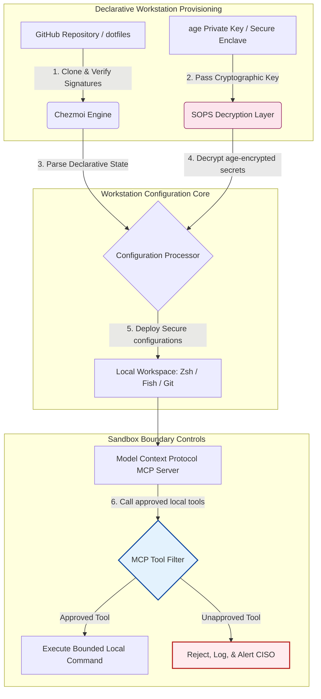

## 2026-இல் AI-அறிந்த Dotfiles: MCP, SLSA, மற்றும் பல-ஷெல் சமநிலைக்கான பாதுகாப்பான, மறுஉருவாக்கக்கூடிய டெவலப்பர் பணிநிலையத்தை உருவாக்குதல்

உள்ளூர் AI மாதிரிகள் மற்றும் முகவர் டெவலப்பர் கருவிகளின் யுகத்தில் அறிவிப்பு பணிநிலைய அமைப்பிற்கும் பாதுகாப்பான மென்பொருள் விநியோகச் சங்கிலிகளுக்கும் இடையிலான இடைவெளியைக் குறைத்தல்.

இந்தக் கட்டுரையின் திறந்த-மூல குறிப்பு புள்ளி [dotfiles ⧉](https://github.com/sebastienrousseau/dotfiles "dotfiles — declarative workstation configuration") ஆகும். இந்த களஞ்சியம் பின்வருமாறு நிலைநிறுத்தப்பட்டுள்ளது: macOS, Linux, மற்றும் WSL-க்கான அறிவிப்பு dotfiles, பல-ஷெல் சமநிலை, நொடிக்கு-கீழ் தொடக்கம், SLSA-கையொப்பமிடப்பட்ட வெளியீடுகள், மற்றும் AI/MCP-அறிந்த அமைப்பை வழங்குகிறது.

## இந்த திறந்த-மூல திட்டம் 2026-இல் ஏன் முக்கியமானது

ஜூன் 2026-இல், டெவலப்பர் பணிநிலையம் மென்பொருள் விநியோகச் சங்கிலியில் மிகவும் பலவீனமான இணைப்பாகவும், அதிநவீன அரசு-ஆதரவு மற்றும் குற்றவியல் இணைய கூட்டமைப்புகளுக்கு உயர்-மதிப்பு இலக்காகவும் உள்ளது.

முனையம்-அடிப்படையிலான AI குறியீட்டு உதவியாளர்களின் (Claude Code போன்றவை) எழுச்சி மற்றும் Model Context Protocol (MCP) ஏற்பு ஆகியவற்றுடன் மேம்பாட்டுச் சூழலின் பாதுகாப்பு நிலப்பரப்பு தீவிரமாக மாறியுள்ளது. உள்ளூர் டெவலப்பர் முனையங்கள் இப்போது பின்வருவனவற்றைச் செய்யக்கூடிய செயலில் உள்ள, தன்னாட்சி AI முகவர்களை புரவலம் செய்கின்றன:

- உள்ளூர் மூலக் கோப்புகளைப் படித்தல் மற்றும் திருத்துதல்.
- உள்ளூர் CLI கருவிகளை அழைத்தல் (`git`, `npm`, `aws`, `kubectl`).
- ஷெல் சூழல் மாறிகள், உள்ளூர் தரவுத்தளங்கள், மற்றும் அமைப்பு அமைப்புகளை ஆய்வு செய்தல்.

டெவலப்பரின் உள்ளூர் சூழல் கடுமையான எல்லைகளைக் கொண்டிருக்கவில்லை என்றால், இந்த தன்னாட்சி AI கருவிகள் தற்செயலாக முக்கியமான தனிப்பட்ட தரவைப் படிக்கலாம், மேக மேக நற்சான்றுகளை பொது LLM API-க்களுக்கு கசியவிடலாம், அல்லது தானியங்கி உருவாக்கங்களின் போது தீங்கிழைக்கும் தொகுப்புகளை இயக்கலாம்.

Digital Operational Resilience Act (DORA) மற்றும் NIST Cybersecurity Framework (CSF) 2.0 இன் கீழ், மென்பொருள் விநியோகச் சங்கிலியை அணுகும் ஒவ்வொரு சாதனத்தின் மூலவழி மற்றும் பாதுகாப்பு ஒருமைப்பாட்டைச் சரிபார்க்க நிதி நிறுவனங்கள் சட்டப்படி கடமைப்பட்டுள்ளன. "பனித்துளி மடிக்கணினிகள்" — கைமுறையாக அமைக்கப்பட்ட, தணிக்கை செய்யப்படாத, விலகிச் செல்லும் அமைப்புகள் — இனி உலகளாவிய வங்கி தரநிலைகளுடன் இணக்கமாக இல்லை.

[செபாஸ்டியன் ரூஸ்ஸோவின் Dotfiles](https://github.com/sebastienrousseau/dotfiles) இந்தச் சிக்கலைத் தீர்க்கிறது. இது பாதுகாப்பான, மறுஉருவாக்கக்கூடிய டெவலப்பர் பணிநிலையங்களை நிறுவும் ஒரு திறந்த-மூல, அறிவிப்பு பணிநிலைய மேலாண்மை கட்டமைப்பாகும். தரப்படுத்தப்பட்ட, தணிக்கை செய்யக்கூடிய அமைப்பு அடிப்படையை நடைமுறைப்படுத்துவதன் மூலம், இந்தத் திட்டம் உயர் மீட்பு-மேல்-வருமானத்தை (RoR) வழங்குகிறது, டெவலப்பர் ஆன்போர்டிங் நேரத்தை வாரங்களிலிருந்து மணிநேரங்களாகக் குறைக்கிறது, மற்றும் இறுதிப்புள்ளி பாதிப்புகளிலிருந்து முக்கியமான நிதி விநியோகச் சங்கிலிகளைப் பாதுகாக்கிறது.

## AI-அறிந்த பணிநிலையம் 2026 கட்டமைப்பு பார்வை

dotfiles கட்டமைப்பு ஒரு பாதுகாப்பான, அறிவிப்பு சூழல் மேலாளராக செயல்படுகிறது — அனைத்து உள்ளூர் ஷெல்கள், கருவிகள், மற்றும் ரகசியங்கள் முறையாக நிர்வகிக்கப்பட்டு, தணிக்கை செய்யப்பட்டு, தனிமைப்படுத்தப்படுகின்றன:

| அடுக்கு | வடிவமைப்பு முடிவு | ஏன் முக்கியம் | தவறாக கையாளப்பட்டால் ஆபத்து |
|---|---|---|---|
| **வழங்கல் அடுக்கு** | Chezmoi வழியாக அறிவிப்பு அமைப்பு மேலாண்மை | macOS, Linux, மற்றும் WSL முழுவதும் முழுமையாக மறுஉருவாக்கக்கூடிய பணிநிலையங்களை உருவாக்கி, விலகலை நீக்குகிறது. | தணிக்கை செய்யப்படாத, பாதிக்கப்படக்கூடிய உள்ளூர் நிலைகளுடன் கூடிய பனித்துளி அமைப்புகள். |
| **ஷெல் அடுக்கு** | பல-ஷெல் சமநிலை (Zsh, Fish, Nushell) | வெவ்வேறு சூழல்களில் ஒரே மாதிரியான, நொடிக்கு-கீழ் தொடக்கம் மற்றும் நிலையான மாற்றுப்பெயர் நடத்தைகளை உறுதி செய்கிறது. | எதிர்பாராத ஸ்கிரிப்ட் விளைவுகளை ஏற்படுத்தும் ஷெல் கட்டளை முரண்பாடுகள். |
| **ரகசிய அடுக்கு** | SOPS மற்றும் age பயன்படுத்தி கோப்பு குறியாக்கம் | கடினமாக-குறியிடப்பட்ட நற்சான்றுகள் மற்றும் மூல விசைகள் Git-இல் சமர்ப்பிக்கப்படுவதையோ உள்ளூர் LLM-களுக்கு வெளிப்படுவதையோ தடுக்கிறது. | பொது களஞ்சிய வரலாறுகளில் கசிந்த அல்லது உள்ளூர் முகவர்களால் சமரசம் செய்யப்பட்ட நற்சான்றுகள். |
| **AI/MCP அடுக்கு** | Model Context Protocol எல்லை கட்டுப்பாடுகள் | உள்ளூர் AI முகவர்களை அங்கீகரிக்கப்பட்ட கருவிகளின் குறிப்பிட்ட பட்டியலுக்குக் கட்டுப்படுத்தி, அனைத்து உள்ளூர் செயலாக்கங்களையும் பதிவு செய்கிறது. | உள்ளூரில் தப்பியோடும் அல்லது அழிவுகரமான கட்டளைகளை இயக்கும் வரம்பற்ற AI முகவர்கள். |
| **விநியோகச் சங்கிலி அடுக்கு** | SLSA-கையொப்பமிடப்பட்ட வெளியீடுகள் மற்றும் Sigstore சரிபார்ப்பு | பூட்ஸ்ட்ராப் ஸ்கிரிப்ட்கள் மற்றும் அமைப்புக் கோப்புகளின் நம்பகத்தன்மையை குறியாக்கவியல் ரீதியாக நிரூபிக்கிறது. | டெவலப்பர் சூழல்களில் தீங்கிழைக்கும் பின்கதவுகளை உட்செலுத்தும் சமரசம் செய்யப்பட்ட அமைப்பு ஸ்கிரிப்ட்கள். |

## முக்கிய பணிநிலைய பாதுகாப்பு மற்றும் தன்னியக்க சமிக்ஞைகள்

மேம்பாட்டு நிலப்பரப்பு முழுவதும் முழுமையான பாதுகாப்பைப் பராமரிக்க, தலைமை தகவல் பாதுகாப்பு அதிகாரிகள் (CISOs) மற்றும் தொழில்நுட்ப மேலாளர்கள் குறிப்பிட்ட, அளவிடக்கூடிய செயல்பாட்டு குறிகாட்டிகளைக் கண்காணிக்க வேண்டும்:

| சமிக்ஞை | அளவீடு / செயல்பாட்டு அளவுகோல் | NIST CSF / DORA குறிப்பு | தொழில்நுட்ப தளம் செயல்படுத்தல் |
|---|---|---|---|
| **பணிநிலைய மறுஉருவாக்கம்** | அமைப்பு விலகல் இல்லாமல் அறிவிப்பு dotfile களஞ்சியங்கள் வழியாக முழுமையாக நிர்வகிக்கப்படும் டெவலப்பர் மடிக்கணினிகளின் %. | NIST CSF 2.0 (PR.DS-01) | முனையத் தொடக்கத்தில் தானாக இயக்கப்படும் Chezmoi விலகல் கண்டறிதல் தணிக்கைகள். |
| **நற்சான்று சுகாதாரம்** | உள்ளூர் அமைப்புக் கோப்புகள் முழுவதும் சாதாரண உரையில் சேமிக்கப்பட்ட குறியாக்கம் செய்யப்படாத ரகசியங்கள் அல்லது விசைகள் பூஜ்ஜியம். | DORA பிரிவு 6 (ICT பாதுகாப்பு) | குறியாக்கம் செய்யப்படாத கோப்புகளை நிராகரிக்கும் Git முன்-சமர்ப்பிப்பு ஹூக்குகள் மற்றும் உள்ளூர் ஸ்கேன்கள். |
| **உருவாக்க மூலவழி** | குறியாக்கவியல் ரீதியாக கையொப்பமிடப்பட்ட மேனிஃபெஸ்ட்களைப் பயன்படுத்தி சரிபார்க்கப்பட்ட பணிநிலைய பூட்ஸ்ட்ராப் பயன்பாடுகளில் 100%. | DORA பிரிவு 30 (விநியோகச் சங்கிலி) | அமைப்பு பைப்லைன்களில் உட்பொதிக்கப்பட்ட Sigstore மற்றும் SLSA நிலை 3 சரிபார்ப்பு. |
| **டெவலப்பர் ஆன்போர்டிங் நேரம்** | மூல வன்பொருள் வழங்கலிலிருந்து முழுமையாக அமைக்கப்பட்ட, இணக்கமான மேம்பாட்டு பணியிடம் வரையிலான கடந்த நேரம். | மீட்பு-மேல்-வருமானம் (RoR) | சூழலை 15 நிமிடங்களுக்குள் தொகுக்கும் தானியங்கி, அறிவிப்பு அமைப்பு ஸ்கிரிப்ட்கள். |
| **AI முகவர் வரம்பிட்ட அணுகல்** | உள்ளூர் AI கருவிகள் வரையறுக்கப்பட்ட கோப்பகக் கட்டுப்பாடுகளுக்குள் படிக்க-மட்டும் இயல்புநிலைகளுடன் செயல்படுகின்றன என்பதற்கான சரிபார்ப்பு. | மாதிரி இடர் மேலாண்மை | முகவர் கருவி பட்டியல்களை அங்கீகரிக்கப்பட்ட செயல்பாடுகளுக்குக் கட்டுப்படுத்தும் MCP அமைப்பு சுயவிவரங்கள். |

## அறிவிப்பு அமைப்பு ஏன் பணிநிலைய பாதுகாப்பின் மையமாகும்

டெவலப்பர் பணிநிலைய அமைப்பிற்கான பாரம்பரிய அணுகுமுறைகள் மிகவும் கைமுறையானவை, இதன் விளைவாக "பனித்துளி மடிக்கணினிகள்" உருவாகின்றன — டெவலப்பர்கள் தனிப்பயன் கருவிகளை நிறுவி, மாறிகளை சரிசெய்து, உள்ளூர் ஸ்கிரிப்ட்களை மாற்றியமைக்கும்போது காலப்போக்கில் அமைப்புகள் விலகிச் செல்லும் சூழல்கள். இந்த விலகல் பல முக்கியமான பாதிப்புகளை உருவாக்குகிறது:

1. **கண்காணிக்கப்படாத நிழல் அமைப்புகள்.** விலகும் மடிக்கணினிகள் பெரும்பாலும் காலாவதியான, பாதிக்கப்படக்கூடிய மென்பொருள் தொகுப்புகளை அல்லது கார்ப்பரேட் பாதுகாப்பு கருவிகளைத் தவிர்க்கும் உள்ளூர் ஸ்கிரிப்ட்களை இயக்குகின்றன.
2. **ரகசிய கசிவு.** டெவலப்பர்கள் அடிக்கடி API விசைகள், GitHub டோக்கன்கள், அல்லது AWS நற்சான்றுகளை நேரடியாக சாதாரண-உரை ஸ்கிரிப்ட்கள் அல்லது ஷெல் சுயவிவரங்களில் கடினமாக-குறியிடுகிறார்கள், இது அவற்றை திருட்டுக்கு மிகவும் பாதிக்கப்படக்கூடியதாக ஆக்குகிறது.
3. **திறமையற்ற ஆன்போர்டிங்.** ஒரு புதிய டெவலப்பர் பணிநிலையத்தை கைமுறையாக அமைப்பதற்கு இரண்டு வாரங்கள் வரை பொறியியல் நேரம் எடுக்கலாம், இது குழு வேகத்தை பாதிக்கிறது.

Chezmoi பயன்படுத்தி ஒரு அறிவிப்பு, மாதிரி-இயக்கப்படும் அமைப்பிற்கு மாறுவதன் மூலம், முழு டெவலப்பர் பணியிடமும் பதிப்பு-கட்டுப்படுத்தப்பட்ட, மறுஉருவாக்கக்கூடிய பதிவேட்டு அமைப்பாக மாறுகிறது. ஒவ்வொரு மாற்றம், மாற்றுப்பெயர், தொகுப்பு சார்பு, மற்றும் பாதுகாப்பு இயல்புநிலையும் Git-இல் ஆவணப்படுத்தப்பட்டு, நிறுவன இணக்க கொள்கைகளுக்கு எதிராக சரிபார்க்கப்பட்டு, இயற்பியல் மடிக்கணினியில் பயன்படுத்தப்படுவதற்கு முன் குறியாக்கவியல் ரீதியாக சரிபார்க்கப்படுகிறது.

## வரம்பிட்ட AI டெவலப்பர் சூழலை வடிவமைத்தல்

உள்ளூர் AI முகவர்கள் மற்றும் MCP கருவிகள் உள்ளூர் சொத்துக்களுக்கு வரம்பற்ற அணுகலைப் பெறுவதைத் தடுக்க, பணிநிலையம் ஒரு வரம்பிட்ட செயலாக்க தளமாக செயல்பட வேண்டும்.

MCP கருவிகளை அழைக்கும் உள்ளூர் AI முகவர்களுக்கு தனிமைப்படுத்தப்பட்ட, சாண்ட்பாக்ஸ் செயலாக்க எல்லையைப் பராமரிக்கும் அதே வேளையில், பாதுகாப்பான dotfiles-ஐ மறைநீக்கம் செய்து பயன்படுத்த dotfiles கட்டமைப்பு Chezmoi, SOPS, மற்றும் age ஆகியவற்றை எவ்வாறு ஒருங்கிணைக்கிறது என்பதை கீழேயுள்ள செயல்பாட்டு ஓட்டம் காட்டுகிறது:

## குழுமச் சபை நடைமுறை மற்றும் நம்பிக்கை பொறுப்பு

டெவலப்பர் பணிநிலைய பாதுகாப்பு மற்றும் விநியோகச் சங்கிலி ஒருமைப்பாடு முக்கியமான குழுமச் சபை முன்னுரிமைகளாகும். மூத்த மேலாளர்கள் நம்பிக்கை பொறுப்பு, ஒழுங்குமுறை இணக்கம், மற்றும் வணிக-மதிப்பு பாதுகாப்பு ஆகியவற்றின் பார்வையில் டெவலப்பர் சூழல் இடரை நிவர்த்தி செய்ய வேண்டும்:

- **DORA பிரிவு 5 (சபை பொறுப்புக்கூறல்).** நிறுவனத்தின் ICT இடர் மேலாண்மைக்கு மேலாண்மை அமைப்பு (சபை) இறுதிப் பொறுப்பை ஏற்கிறது என்பதைக் கட்டாயப்படுத்துகிறது. டெவலப்பர் பணிநிலையங்கள் மென்பொருள் விநியோகச் சங்கிலிக்கான நுழைவாயில் என்பதால், ஒழுங்குமுறை தணிக்கைகளைப் பூர்த்தி செய்ய இறுதிப்புள்ளிகள் பாதுகாப்பானவை, முழுமையாக தணிக்கை செய்யக்கூடியவை, மற்றும் கடுமையான, மறுஉருவாக்கக்கூடிய அமைப்பு கட்டமைப்புகளின் கீழ் நிர்வகிக்கப்படுகின்றன என்பதை சபை இயக்குநர்கள் சரிபார்க்க வேண்டும்.
- **NIST CSF 2.0 இணக்கம் (இறுதிப்புள்ளி பாதுகாப்பு).** தரப்படுத்தப்பட்ட, பாதுகாப்பான அமைப்புகளை இயக்கும் அங்கீகரிக்கப்பட்ட மற்றும் சரிபார்க்கப்பட்ட சாதனங்கள் மட்டுமே கார்ப்பரேட் நெட்வொர்க்குகள் மற்றும் களஞ்சியங்களை அணுக முடியும் என்று கோருகிறது. அறிவிப்பு dotfiles பாதுகாப்பு குழுக்களை அனைத்து டெவலப்பர் சூழல்களும் நிறுவனத்தின் பாதுகாப்பு அடிப்படையுடன் இணக்கமாக உள்ளன என்பதை கணிதரீதியாக நிரூபிக்க அனுமதிக்கிறது, தணிக்கை செய்யப்படாத "பனித்துளி" அமைப்புகளின் இடரை நீக்குகிறது.
- **இருப்புநிலை-தாள் மதிப்பின் பாதுகாப்பு.** ஒரு சமரசம் செய்யப்பட்ட டெவலப்பர் நற்சான்று அல்லது விநியோகச் சங்கிலி மீறல் ஒரு நிறுவனத்திற்கு தீர்வு, ஒழுங்குமுறை அபராதங்கள், மற்றும் நற்பெயர் சேதத்தில் மில்லியன் கணக்கான டாலர்களை செலவழிக்கலாம். பாதுகாப்பான, அறிவிப்பு டெவலப்பர் சூழலுக்கு மாறுவது இந்த இடரை நேரடியாகக் குறைக்கிறது, இருப்புநிலை-தாள் மதிப்பைப் பாதுகாக்கிறது, மற்றும் வாடிக்கையாளர் நம்பிக்கையைப் பாதுகாக்கிறது.

## வங்கி வகைப்படி இதன் அர்த்தம் என்ன

### உலகளாவிய முறைமையான முக்கியத்துவம் வாய்ந்த வங்கிகள் (G-SIBs)

G-SIBs பல கண்டங்கள் மற்றும் ஒழுங்குமுறை அதிகார வரம்புகள் முழுவதும் ஆயிரக்கணக்கான டெவலப்பர் பணிநிலையங்களை நிர்வகிக்கின்றன. அவற்றின் முதன்மை சவால் பரந்த பொறியியல் குழுக்கள் முழுவதும் அமைப்பு நிலைத்தன்மையைப் பராமரிப்பது மற்றும் நற்சான்று கசிவைத் தடுப்பது ஆகும். Chezmoi பயன்படுத்தி ஒரு அறிவிப்பு, திறந்த-மூல dotfiles மாதிரியை ஏற்றுக்கொள்வதன் மூலம், G-SIBs இறுதிப்புள்ளி பாதுகாப்பை தரப்படுத்தலாம், இணக்க தணிக்கையை தானியக்கமாக்கலாம், மற்றும் உலகளாவிய நிறுவனம் முழுவதும் டெவலப்பர் ஆன்போர்டிங் நேரங்களை வாரங்களிலிருந்து நிமிடங்களாகக் குறைக்கலாம்.

### பரிவர்த்தனை மற்றும் கார்ப்பரேட் வங்கிகள்

பரிவர்த்தனை வங்கிகள் முக்கியமான கட்டண நுழைவாயில்கள் மற்றும் மொத்த அனுமதிப்பு உள்கட்டமைப்புகளை இயக்குகின்றன. இந்த உற்பத்திச் சூழல்களுக்கு பயன்படுத்தப்படும் குறியீட்டின் முழுமையான ஒருமைப்பாட்டை நிரூபிப்பது ஒரு பேச்சுவார்த்தைக்கு-அப்பாற்பட்ட ஒழுங்குமுறை கோரிக்கையாகும். ஒரு பாதுகாப்பான, SLSA-இணக்கமான dotfiles கட்டமைப்பின் கீழ் டெவலப்பர் பணிநிலையங்களை தரப்படுத்துவது மென்பொருள் விநியோகச் சங்கிலி முழுமையாக தணிக்கை செய்யப்பட்டு, உள்ளூர் டெவலப்பர் இறுதிப்புள்ளி பாதிப்புகளிலிருந்து பாதுகாக்கப்படுவதை உறுதி செய்கிறது.

### பிராந்திய மற்றும் சிறிய வங்கிகள்

பிராந்திய வங்கிகள் G-SIBs-இன் பாரிய பாதுகாப்பு பட்ஜெட்கள் இல்லாமல் உயர் இணைய பாதுகாப்பு தரநிலைகளைப் பராமரிக்க வேண்டும். இந்த திறந்த-மூல dotfiles கட்டமைப்பு ஒரு இலகுவான, செலவு-குறைந்த, மற்றும் மிகவும் பாதுகாப்பான Python மற்றும் Rust-நட்பு தீர்வை வழங்குகிறது, இது சிறிய நிறுவனங்களை விலையுயர்ந்த தனியுரிம மென்பொருள் உரிமங்கள் இல்லாமல் நிறுவன-தர இறுதிப்புள்ளி பாதுகாப்பு மற்றும் விநியோகச் சங்கிலி பாதுகாப்பை செயல்படுத்த உதவுகிறது.

## முடிவுரை: டெவலப்பர் பணிநிலைய வழிமுறை

டெவலப்பர் பணிநிலையம் இனி ஒரு புற சாதனம் அல்ல; இது மென்பொருள் விநியோகச் சங்கிலியில் ஒரு முக்கியமான கட்டுப்பாட்டு தளமாகும். கைமுறையாக அமைக்கப்பட்ட, தணிக்கை செய்யப்படாத "பனித்துளி மடிக்கணினிகள்" கார்ப்பரேட் சொத்துக்களை அணுக அனுமதிப்பது ஒரு கடுமையான செயல்பாட்டு மற்றும் ஒழுங்குமுறை இடராகும்.

மென்பொருள் விநியோகச் சங்கிலியைப் பாதுகாக்கவும், உள்ளூர் AI-முகவர் பாதிப்புகளிலிருந்து இறுதிப்புள்ளிகளைப் பாதுகாக்கவும், மூத்த தொழில்நுட்ப மற்றும் பாதுகாப்பு மேலாளர்கள் இன்று ஒரு தெளிவான மேம்பாட்டு வழிமுறையை செயல்படுத்த வேண்டும்:

1. **அறிவிப்பு வழங்கலைக் கட்டாயப்படுத்துங்கள்.** கைமுறை, ஆவண-வழிநடத்தப்பட்ட அமைப்பு செயல்முறைகளை படிப்படியாக நீக்கி, அனைத்து டெவலப்பர் சூழல்களும் Chezmoi பயன்படுத்தி அறிவிப்பு முறையில் வழங்கப்பட வேண்டும் என்று கட்டாயப்படுத்துங்கள்.
2. **ரகசிய சுகாதாரத்தை நடைமுறைப்படுத்துங்கள்.** உள்ளூர் பணிநிலைய அமைப்புகள் முழுவதும் சாதாரண உரையில் எந்த மூல நற்சான்றுகள், விசைகள், அல்லது API டோக்கன்களும் சேமிக்கப்படாமல் இருப்பதை உறுதி செய்ய கடுமையான முன்-சமர்ப்பிப்பு ஹூக்குகள் மற்றும் ஸ்கேனிங் பயன்பாடுகளை நடைமுறைப்படுத்துங்கள்.
3. **AI சாண்ட்பாக்ஸ் எல்லைகளை நிறுவுங்கள்.** உள்ளூர் AI குறியீட்டு உதவியாளர்கள் மற்றும் முகவர்களை அங்கீகரிக்கப்பட்ட, படிக்க-மட்டும் கருவிகள் மற்றும் கோப்பகங்களுக்குக் கட்டுப்படுத்த பாதுகாப்பான, வரம்பிட்ட MCP அமைப்பு சுயவிவரங்களை செயல்படுத்துங்கள்.
4. **விநியோகச் சங்கிலியைப் பாதுகாக்கவும்.** அனைத்து பூட்ஸ்ட்ராப் ஸ்கிரிப்ட்கள் மற்றும் சூழல் அமைப்புகளும் பயன்படுத்தப்படுவதற்கு முன் SLSA நிலை 3 மூலவழியைப் பயன்படுத்தி குறியாக்கவியல் ரீதியாக சரிபார்க்கப்படுவதை உறுதி செய்யுங்கள்.

## அடிக்கடி கேட்கப்படும் கேள்விகள்

**Chezmoi என்றால் என்ன மற்றும் அது ஏன் dotfiles-க்கு பயன்படுத்தப்படுகிறது?**

Chezmoi என்பது ஒரு திறந்த-மூல, பாதுகாப்பான, அறிவிப்பு dotfile மேலாளர். இது டெவலப்பர்களை தங்கள் உள்ளூர் அமைப்புகளை பதிப்பு-கட்டுப்படுத்தப்பட்ட களஞ்சியமாக நிர்வகிக்க அனுமதிக்கிறது, வெவ்வேறு இயக்க முறைமைகள் (macOS, Linux, WSL) முழுவதும் முழுமையான நிலைத்தன்மை மற்றும் மறுஉருவாக்கத்தை உறுதி செய்கிறது.

**கட்டமைப்பு ரகசியங்களை எவ்வாறு பாதுகாக்கிறது?**

இந்த கட்டமைப்பு முக்கியமான நற்சான்றுகளை (GitHub டோக்கன்கள் அல்லது மேக அணுகல் விசைகள் போன்றவை) dotfile களஞ்சியத்திற்குள் நேரடியாக குறியாக்கம் செய்ய SOPS (Secrets Operations) மற்றும் age கோப்பு குறியாக்கத்தைப் பயன்படுத்துகிறது. இது விசைகள் சாதாரண உரையில் சமர்ப்பிக்கப்படுவதையோ அல்லது அங்கீகரிக்கப்படாத உள்ளூர் AI முகவர்களால் படிக்கப்படுவதையோ தடுக்கிறது.

**Model Context Protocol (MCP) என்றால் என்ன மற்றும் அது பாதுகாப்பை எவ்வாறு பாதிக்கிறது?**

MCP என்பது AI மாதிரிகள் உள்ளூர் கருவிகளை பாதுகாப்பாக இயக்கவும் கோப்புகளை அணுகவும் அனுமதிக்கும் ஒரு திறந்த தரநிலையாகும். dotfiles கட்டமைப்பு உள்ளூர் AI கருவிகள் மற்றும் முகவர்களை அங்கீகரிக்கப்பட்ட கோப்பகங்கள் மற்றும் கட்டளைகளுக்குக் கட்டுப்படுத்த கடுமையான MCP அமைப்புக் கோப்புகளை செயல்படுத்துகிறது.

**கட்டமைப்பு எந்த ஷெல்களை ஆதரிக்கிறது?**

Bash, Zsh, Fish, Nushell, மற்றும் PowerShell — macOS, Linux, மற்றும் WSL முழுவதும் சமநிலையுடன், ஒரு டெவலப்பர் எந்த முனையத்தைத் திறந்தாலும் கட்டளை நடத்தை ஒரே மாதிரியாக இருக்கும்.

## குறிப்புகள்

- Open Source Security Foundation (OpenSSF), (2024). *Supply-chain Levels for Software Artifacts (SLSA)*. இங்கு கிடைக்கிறது: [SLSA Framework ⧉](https://slsa.dev/ "SLSA framework").
- NIST, (2024). *NIST Cybersecurity Framework 2.0*. Gaithersburg: National Institute of Standards and Technology. இங்கு கிடைக்கிறது: [NIST CSF 2.0 ⧉](https://www.nist.gov/cyberframework "NIST Cybersecurity Framework 2.0").
- European Parliament and Council of the European Union, (2022). *Regulation (EU) 2022/2554 on digital operational resilience for the financial sector (DORA)*. Brussels: Official Journal of the European Union. இங்கு கிடைக்கிறது: [DORA Regulation ⧉](https://eur-lex.europa.eu/legal-content/EN/TXT/?uri=CELEX%3A32022R2554 "DORA regulation").
- GitHub, (2026). *dotfiles open-source repository*. இங்கு கிடைக்கிறது: [dotfiles Repository ⧉](https://github.com/sebastienrousseau/dotfiles "dotfiles repository").
