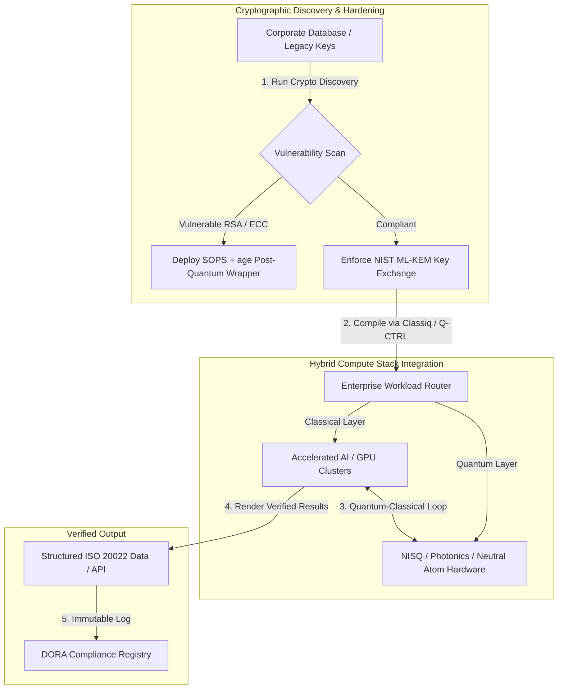

## க்யூபிட்களிலிருந்து லாபங்களுக்கு: Economist-இன் 5வது ஆண்டு Commercialising Quantum Global 2026 உச்சிமாநாட்டின் மூலோபாய அறிவுரைகள்

நிறுவனத் தயார்நிலை, போஸ்ட்-குவாண்டம் குறியாக்க இடமாற்றங்கள், கலப்பு கணிப்பு அடுக்குகள், மற்றும் குவாண்டம் உணரி ஆயும் பிணையமாக்கத்தின் வளர்ந்துவரும் வணிக நிலப்பரப்பு.

**சுருக்கம்.** Economist Impact-ஆல் 2026 ஜூன் 16–17 அன்று லண்டனில் உள்ள Business Design Centre-இல் நடத்தப்பட்ட 5வது ஆண்டு Commercialising Quantum Global 2026 மாநாடு, நிறுவனம், நிதி, கொள்கை மற்றும் ஆராய்ச்சி ஆகியவற்றில் 1,100-க்கும் மேற்பட்ட உலகத் தலைவர்களை ஒன்றுகூட்டியது. மைய கருப்பொருள் ஒரு தெளிவான கட்டமைப்பு மாற்றத்தைக் குறித்தது: குவாண்டம் தொழில்நுட்பம் ஊகப் பரிசோதனை அறிவியலிலிருந்து நடைமுறை, கலப்பு நிறுவன பணிச்சூழலுக்கு மாறிவிட்டது. 2026-இன் முதல் ஐந்து மாதங்களில் மட்டுமே திரட்டப்பட்ட $1.3 பில்லியன் துணிகர மூலதனத்தின் ஆதரவுடன், அறங்குழு விவாதம் இனி இயற்பியல் க்யூபிட்களை எண்ணுவதில் அல்ல, மாறாக 'இழப்பில்லா' கலப்பு கணிப்பு அடுக்குகளை நிறுவுவது, 'இப்போது சேகரி-பின்னர் மறைநீக்கு' (SNDL) குறியாக்க அச்சுறுத்தலுக்கு எதிராக டிஜிட்டல் சொத்துக்களைப் பாதுகாப்பது, மற்றும் GPS-சாராத வழிசெலுத்தலுக்காக அண்மைக்கால குவாண்டம் உணரி அமைப்புகளைப் பயன்படுத்துவது ஆகியவற்றில் கவனம் செலுத்துகிறது.

## முக்கிய அறிவுரைகள்

- **நடைமுறை பணிச்சூழலுக்கு நிறுவன மாற்றம்.** தொழில்துறைத் தலைவர்கள் (HorizonX-இன் [Steve Suarez](https://www.linkedin.com/in/stevesuarez), HSBC-யின் [Phil Intallura](https://www.linkedin.com/in/intallura)) குவாண்டம் ஒருங்கிணைப்பு இனி ஒரு இயற்பியல் பிரச்சினை அல்ல, ஒரு செயல்பாட்டுப் பிரச்சினை என்பதை வலியுறுத்தினர். வங்கிகளும் நிறுவனங்களும் திறமையைத் தயார்செய்யவும், செயலில் உள்ள பணிச்சுமைகளை உகந்ததாக்கவும் கலப்பு குவாண்டம்-கிளாசிக்கல் முன்னோட்டங்களைப் பயன்படுத்துகின்றன.
- **போஸ்ட்-குவாண்டம் குறியாக்கம் (PQC) அறங்குழு முன்னுரிமையாகும்.** பாதுகாப்பு மற்றும் சட்ட நிபுணர்கள் (CMS UK, Microsoft-இன் [Joanne Miller](https://www.linkedin.com/in/joanne-miller-nso), EY-இன் [Craig Farrell](https://www.linkedin.com/in/craig-farrell)) PQC-யைப் பயன்படுத்த நிறுவனங்கள் தவறு-தாங்கு வன்பொருளுக்காகக் காத்திருக்க முடியாது என்று எச்சரித்தனர். 'இப்போது சேகரி-பின்னர் மறைநீக்கு' சேகரிப்பு இன்று நடந்துகொண்டிருக்கிறது, இது NIST ML-KEM தரநிலைகளுக்கான இடமாற்றத்தை உடனடி நம்பிக்கைப் பொறுப்புக் கவலையாக்குகிறது.
- **குவாண்டம் உணரி அண்மைக்கால லாபத்தில் முன்னணியில்.** தவறு-தாங்கு கணிப்பு இன்னும் பல ஆண்டுகள் தொலைவில் இருந்தாலும், குவாண்டம் உணரி (Infleqtion-இன் [Matthew Kinsella](https://www.linkedin.com/in/matthewkinsella)) வேகமாக அளவிடுகிறது. குவாண்டம் கடிகாரங்களும் நிலைமப்பு உணரிகளும் GPS-சாராத வழிசெலுத்தல், தேசியப் பாதுகாப்பு, மற்றும் மீ-நிலையான ஆற்றல் கட்டங்களில் பயன்படுத்தப்படுகின்றன.
- **இறையாண்மை, கொத்துக்கள் மற்றும் கொள்கை அவசரம்.** UK அறிவியல் அமைச்சர் [Lord Vallance](https://www.linkedin.com/in/patrick-vallance) மற்றும் [Lord William Hague](https://www.linkedin.com/in/williamhague) ஆராய்ச்சியைத் தொழில்துறை அளவிலான 'சூப்பர்கிளஸ்டர்களாக' மாற்றி, தேசிய குவாண்டம் கணிப்பு மையத்துடன் (NQCC) ஒருங்கிணைக்கும் தேசிய பணிகளை வரையறுத்தனர். வரவிருக்கும் EU Quantum Act, இறையாண்மைக் கணிப்புத் திறனுக்கான புவிசார்-அரசியல் விரைவை மேலும் அடிக்கோடிட்டுக் காட்டுகிறது.
- **qBIG பரிசை Quantcore வென்றது.** University of Glasgow-இன் விளைபொருள் நிறுவனமான Quantcore, பாரம்பரியப் பொருட்களைவிட அதிக வெப்பநிலைகளில் இயங்கும், குளிர்-உறை உள்கட்டமைப்புச் செலவுகளைக் கணிசமாகக் குறைக்கும் அதன் நியோபியம்-அடிப்படையிலான மீக்கடத்தும் கூறுகளுக்காக IOP qBIG பரிசைப் பெற்றது.

**தொடர்புடைய படிப்பு:** [KyberLib மற்றும் 2026-இல் போஸ்ட்-குவாண்டம் வங்கி இடமாற்றம்: தரநிலைகளிலிருந்து குறியீட்டுக்கு](https://sebastienrousseau.com/2026-06-12-kyberlib-post-quantum-banking-migration-standards-code-2026/), [2026-இல் வங்கிக் கட்டுறுதிச் சுட்டெண்: AI, கிளவுட், குவாண்டம், கொடுப்பனவுகள், மற்றும் மூன்றாம் தரப்புச் செறிவு அபாயம்](https://sebastienrousseau.com/2026-06-08-banking-resilience-index-ai-cloud-quantum-payments-third-party-risk-2026/), [2026-இல் கிளவுட் நேட்டிவ் வங்கிச் சுட்டெண்: DORA, தளப் பொறியியல், இறையாண்மைக் கிளவுட், மற்றும் செயல்பாட்டுக் கட்டுறுதி](https://sebastienrousseau.com/2026-06-05-cloud-native-banking-index-dora-resilience-platform-engineering-2026/).

## 01. 2026 உச்சிமாநாடு ஏன் அறங்குழுவுக்கு முக்கியம்

Economist-இன் Commercialising Quantum Global உச்சிமாநாட்டின் 2026 பதிப்பு, ஆழ்-தொழில்நுட்பத்தை நிறுவன உலகம் மதிப்பிடும் விதத்தில் நிரந்தர மாற்றத்தைக் குறித்தது.

வரலாற்று ரீதியாக, குவாண்டம் கணிப்பு பல-தசாப்த அறிவியல் முயற்சியாக R&D துறைகளுக்கு ஒதுக்கப்பட்டிருந்தது. 2026 ஜூனில், இந்தக் கண்ணோட்டம் காலாவதியானது. நிறுவனங்கள் 'இயற்பியல்-மைய' ஆர்வத்திலிருந்து 'வணிக-மைய' செயலாக்கத்திற்கு மாற வேண்டும். இதற்குக் காரணம் இரண்டு:

1. **குவாண்டம்-AI ஒருங்கிணைப்பு.** உயர்-செயல்திறன் கணிப்பு (HPC) அடுக்குகள், கிளாசிக்கல், முடுக்கப்பட்ட AI, மற்றும் NISQ (இரைச்சல் இடைநிலை-அளவு குவாண்டம்) கணுக்களை ஒற்றை, ஒருங்கிணைந்த கணிப்பு அடுக்காக இணைத்துவருகின்றன. குவாண்டம்-தயார் பயன்பாடுகளை உருவாக்குவதைத் தாமதப்படுத்தும் நிறுவனங்கள், மூலோபாய நன்மையைப் பிடிக்கும் சாளரம் எதிர்பார்த்ததைவிட வேகமாக மூடிக்கொண்டிருப்பதைக் கண்டறியும்.
2. **புவிசார்-அரசியல் மற்றும் நம்பிக்கைப் பொறுப்பு அவசரம்.** UK-யின் பணி-தலைமையிலான குவாண்டம் திட்டம் மற்றும் வரவிருக்கும் EU Quantum Act-உடன், குவாண்டம் திறன் தேசிய இறையாண்மை மற்றும் நிறுவன தொடர்ச்சியின் விஷயமாகிவிட்டது.

மேலும், போஸ்ட்-குவாண்டம் இணையப் பாதுகாப்பு இனி எதிர்கால இணக்கத் தேவை அல்ல. விரோதமான 'இப்போது சேமி-பின்னர் மறைநீக்கு' (SNDL) தாக்குதல்களின் அச்சுறுத்தல் என்பது, இன்று இடைமறிக்கப்பட்ட நிறுவனத் தரவு வணிக குவாண்டம் அமைப்புகள் அளவிடும்போது மறைநீக்கப்படும் என்பதைக் குறிக்கிறது, இது Digital Operational Resilience Act (DORA) போன்ற உலகளாவிய செயல்பாட்டுக் கட்டுறுதி ஆணைகளின் கீழ் உடனடிப் பொறுப்பை உருவாக்குகிறது.

## 02. Commercialising Quantum 2026 மூலோபாய நோக்கு

நிறுவன தொழில்நுட்பத் தலைவர்கள் ஐந்து தனித்துவமான செயல்பாட்டு அடுக்குகளில் குவாண்டம் முதிர்ச்சியை வரைபடமிட்டு, கால எல்லைகள் மற்றும் இருப்புநிலை அபாயங்களை மதிப்பிட வேண்டும்.

### அட்டவணை 1: Commercialising Quantum 2026 மூலோபாய நோக்கு

| அடுக்கு | நிறுவன கவனம் | காலவரிசை / எல்லை | முக்கிய நிறுவன அபாயம் |
| ---- | ---- | ---- | ---- |
| **வன்பொருள் & தொகுப்பி** | போட்டியிடும் அணுகுமுறைகளுக்கு இடையே தேர்வு (மீக்கடத்தும், சிக்கிய அயனிகள், நடுநிலை அணுக்கள், ஒளியனியல்) | 3 – 5 ஆண்டுகள் (தவறு-தாங்கு) | முட்டுச்சந்து கட்டமைப்பில் பூட்டிக்கொள்வது அல்லது ஒற்றைத் தளத்தை மிக விரைவில் ஆதரிப்பது. |
| **குறியாக்க வலுவாக்கம்** | குறியாக்கச் சார்புகளின் கண்டறிதல் மற்றும் சரக்கு; NIST ML-KEM-க்கு இடமாற்றம் | உடனடி (செயலில் உள்ள இடமாற்றம்) | DORA மற்றும் NIST CSF 2.0-வின் கீழ் அமைப்பு ரீதியான தரவு மீறல்கள் மற்றும் இணக்கத் தோல்விகள். |
| **குவாண்டம் உணரி** | GPS-சாராத வழிசெலுத்தல், மீ-நிலையான கடிகாரங்கள், மற்றும் ஈர்ப்பளவிகளின் பயன்பாடு | 1 – 2 ஆண்டுகள் (உடனடி வணிக) | GPS தடையால் தளவாடம், கப்பல் போக்குவரத்து, மற்றும் ஆற்றல் கட்டங்களின் செயல்பாட்டுச் சீர்குலைவு. |
| **அமைப்பு ஒருங்கிணைப்பு** | குவாண்டம் வன்பொருளை ஏற்கனவே உள்ள கிளாசிக்கல் HPC மற்றும் மீக்கணிப்பு தரவு மையங்களுடன் இணைத்தல் | 1 – 3 ஆண்டுகள் (கலப்புக் கட்டம்) | உயர் தாமதம், தரவு-பரிமாற்ற இடர்பாடுகள், மற்றும் துண்டிக்கப்பட்ட கணிப்பு அறைகள். |
| **நிறுவன மென்பொருள்** | உயர்-நிலை பிரிபடுத்தல் அடுக்குகள் மற்றும் API-கள் மூலம் குவாண்டம் அல்காரிதம்களை வெளிப்படுத்தல் (Classiq, Q-CTRL) | உடனடி (திறன் உருவாக்கம்) | உண்மையான பொறியியல் செயலாக்கத்திலிருந்து திறமை மற்றும் பணிச்சூழல் தனிமைப்படுத்தல். |

## 03. முக்கிய குவாண்டம் சமிக்ஞைகள் மற்றும் அறங்குழு தூண்டிகள்

தொழில்நுட்பத் தலைவர்கள் தங்கள் குவாண்டம் முதலீடுகளுக்கு வழிகாட்ட, குறிப்பிட்ட, அளவிடத்தக்க சந்தை மற்றும் ஒழுங்குமுறை அளவீடுகளைக் கண்காணிக்க வேண்டும்.

### அட்டவணை 2: முக்கிய குவாண்டம் சமிக்ஞைகள் மற்றும் அறங்குழு தூண்டிகள்

| சமிக்ஞை | அளவீட்டு அளவை | ஒழுங்குமுறை / கொள்கை குறிப்பு | செயல்படுத்தத்தக்க தள முன்னுரிமை |
| ---- | ---- | ---- | ---- |
| **குவாண்டம் நிதி எழுச்சி** | 2026-இன் முதல் ஐந்து மாதங்களில் உலகளவில் $1.3 பில்லியன் திரட்டப்பட்டது | கட்டுறுதியில் வருவாய் (RoR) | ஊக முன்னோட்டங்களிலிருந்து 'இழப்பில்லா' கலப்பு குவாண்டம்-கிளாசிக்கல் பணிச்சுமைகளுக்கு நிதிநிலைகளை மாற்றவும். |
| **தரவு மறைநீக்க வெளிப்பாடு** | பொது வழிகளில் அனுப்பப்பட்ட குறியாக்கப்பட்ட தரவின் 100% SNDL சேகரிப்புக்கு வெளிப்பட்டுள்ளது | DORA பிரிவு 6 (ICT பாதுகாப்பு) | தளம் முழுவதும் பாதிக்கக்கூடிய RSA/ECC விசைகளை அடையாளம் காண குறியாக்கக் கண்டறிதல் கருவிகளைப் பயன்படுத்தவும். |
| **இறையாண்மை உள்கட்டமைப்பு** | £2.5 பில்லியன் UK National Quantum Strategy ஒதுக்கீடு | UK Quantum Missions / Lord Vallance | NQCC போன்ற தேசிய சூப்பர்கிளஸ்டர்களுடன் உள்ளூர் கூட்டாண்மைகளை நிறுவவும். |
| **இணக்கக் காலக்கெடுக்கள்** | நவம்பர் 14, 2026 SWIFT கட்டமைக்கப்பட்ட-முகவரி மாற்றம் | SWIFT SR 2026 ஆணை | கட்டமைக்கப்பட்ட XML விவரக்குறிப்புகளைப் பூர்த்தி செய்ய வங்கியிடை தரவுத்தளங்களைச் சுத்தம்செய்து வடிவமைக்கவும். |

## 04. முக்கிய உச்சிமாநாட்டுக் கருப்பொருள்களில் ஆழ்ந்த ஆய்வு

### குவாண்டம் ஒரு முதலீட்டு திருப்புமுனையை எட்டுகிறது

துணிகர மூலதன நிதியுதவி குறிப்பிடத்தக்க முடுக்கத்தை அனுபவித்துள்ளது, 2026-இன் முதல் ஐந்து மாதங்களில் மட்டுமே **$1.3 பில்லியன்** திரட்டியுள்ளது. முந்தைய ஆண்டுகளின் ஊக பரபரப்புச் சுழற்சிகளைப் போலல்லாமல், தற்போதைய மூலதன அலை நிஜ-உலக, அண்மைக்காலப் பணிச்சுமைகளால் ஆதரிக்கப்படுகிறது. Classiq மற்றும் IBM Quantum Platform-இன் பேச்சாளர்கள், மென்பொருள் பிரிபடுத்தல் அடுக்குகளும் தானியங்கி தொகுப்பிகளும் நிபுணரல்லாத உருவாக்குநர் குழுக்களை இன்றைய கிளாசிக்கல் உள்கட்டமைப்பில் கலப்பு குவாண்டம்-கிளாசிக்கல் அல்காரிதம்களைச் செயல்படுத்த எவ்வாறு அனுமதிக்கின்றன என்பதை நிரூபித்தனர். இந்த 'இழப்பில்லா' மூலோபாயம், நிறுவனங்களை உடனடியாக குவாண்டம்-தயார் திறமையையும் பணிச்சூழலையும் உருவாக்க அனுமதிக்கிறது.

### 'இப்போது சேகரி-பின்னர் மறைநீக்கு' குறித்த சட்ட மற்றும் ஒழுங்குமுறை எச்சரிக்கைகள்

தரவு அபாயத்தின் உடனடித்தன்மையைச் சுற்றி சட்டக் கூட்டாளிகளும் இணையப் பாதுகாப்பு நிர்வாகிகளும் பெரும் ஈடுபாட்டைத் தூண்டினர். ஆதரவாளர் சட்ட நிறுவனமான CMS UK-யின் பிரதிநிதிகளும் Microsoft CSO [Joanne Miller](https://www.linkedin.com/in/joanne-miller-nso)-ம் மூத்த நிர்வாகத்திற்கு ஒரு கடுமையான எச்சரிக்கையை வழங்கினர்: *போஸ்ட்-குவாண்டம் குறியாக்கத்தைப் பயன்படுத்துவதற்கு முன், தவறு-தாங்கு வன்பொருள் வருவதற்குக் காத்திருப்பது ஒரு முக்கியமான நம்பிக்கைப் பொறுப்புத் தோல்வியாகும்.*

'இப்போது சேமி-பின்னர் மறைநீக்கு' (SNDL) கருதுகோளின் கீழ், விரோதிகள் இன்று குறியாக்கப்பட்ட நிறுவனத் தரவைச் சுறுசுறுப்பாகச் சேகரித்து, குறியாக்க ரீதியில் தொடர்புடைய குவாண்டம் கணினிகள் தோன்றியவுடன் அதை மறைநீக்கும் நோக்கம் கொண்டுள்ளனர். நீண்ட-ஆயுள் உணர்திறன் தரவுத்தொகுப்புகள், அறிவுசார் சொத்து, மற்றும் வரலாற்று வாடிக்கையாளர் பதிவுகளைப் பாதுகாக்க, நிறுவனங்கள் போஸ்ட்-குவாண்டம் பாதுகாப்புகளை (NIST ML-KEM போன்றவை) உடனடியாகப் பயன்படுத்த வேண்டும்.

### 'குவாண்டம் உணரி' பரபரப்பு மறுசீரமைப்பு

தவறு-தாங்கு குவாண்டம் கணிப்பு இன்னும் பல ஆண்டுகள் தொலைவில் இருந்தாலும், உண்மையிலேயே லாபகரமான நிஜ-உலகப் பயன்பாட்டின் முதல் அலையாக குவாண்டம் உணரியை உச்சிமாநாடு முன்னிலைப்படுத்தியது. Infleqtion-இன் தலைமை நிர்வாகி [Matthew Kinsella](https://www.linkedin.com/in/matthewkinsella), குவாண்டம் கடிகாரங்கள், நிலைமப்பு உணரிகள், மற்றும் வானொலி-அதிர்வெண் அமைப்புகள் பல தொழில்துறைகளில் எவ்வாறு வேகமாக அளவிடுகின்றன என்பதை விவரித்தார்.

இந்த தொழில்நுட்பங்கள் இயற்பியல் மாறிலிகளை உப-அணு துல்லியத்துடன் அளவிடுவதால், அவை **GPS-சாராத வழிசெலுத்தல்**, மீ-நிலையான ஆற்றல் கட்டங்கள், மற்றும் ஆழ்-விண்வெளித் தொலைத்தொடர்பை இயலச்செய்கின்றன. வளர்ந்துவரும் GPS-தடை அச்சுறுத்தல்களை எதிர்கொள்ளும் விமானப் போக்குவரத்து, கடல்சார் போக்குவரத்து, மற்றும் தேசிய-பாதுகாப்பு அமைப்புகளுக்கு இந்தப் பயன்பாடுகள் மிகவும் பொருத்தமானவை.

### சூழலமைப்பு மற்றும் கொத்து ஒத்துழைப்பு

உள்நாட்டு புத்தாக்க சூப்பர்கிளஸ்டர்களைக் காட்சிப்படுத்த UK குவாண்டம் சூழலமைப்பு லண்டன் உச்சிமாநாட்டைப் பயன்படுத்தியது. தேசிய குவாண்டம் கணிப்பு மையம் (NQCC) மற்றும் Digital Catapult-இன் நேரடி புதுப்பிப்புகள், ஆரம்ப-நிலை ஆழ்-தொழில்நுட்ப விளைபொருள் நிறுவனங்கள், குவாண்டம் வன்பொருளை நேரடியாக கிளாசிக்கல் மீக்கணிப்பு தரவு மையங்களுடன் ஒருங்கிணைத்து 'தொழில்நுட்பப் பிளவை' எவ்வாறு களைய முடியும் என்பதை விவரித்தன.

ஸ்காட்லாந்து குவாண்டம் தொடக்க நிறுவனமான Quantcore-இன் இணை-நிறுவனர் [Wridhdhisom Karar](https://www.linkedin.com/in/wridhdhisomkarar), நிறுவனத்தின் நியோபியம்-அடிப்படையிலான மீக்கடத்தும் கூறுகளுக்காக மதிப்புமிக்க Institute of Physics (IOP) Quantum Business Innovation and Growth (qBIG) பரிசை ஏற்றுக்கொண்டார். இந்தக் கூறுகள் பாரம்பரியப் பொருட்களைவிட அதிக வெப்பநிலைகளில் இயங்குகின்றன, குவாண்டம் செயலிகளை அளவிடத் தேவையான குளிர்-உறை உள்கட்டமைப்புச் செலவை கணிசமாகக் குறைக்கின்றன.

### HSBC வழக்காய்வு: குவாண்டத்திற்காகக் காத்திருப்பது ஏன் ஒரு 'வலிந்த தவறு'

Economist-இன் 5வது ஆண்டு Commercialising Quantum நிகழ்வில் (2026) [**Philip Intallura, Ph.D.**](https://www.linkedin.com/in/intallura) (HSBC-யின் குவாண்டம் தொழில்நுட்பங்களின் உலகத் தலைவர், UK அரசு ஆலோசகர், மற்றும் அறங்குழு ஆலோசகர்) அளித்த நுண்ணறிவுகள், ஒரு சக்திவாய்ந்த அறங்குழு ஆணையை வழங்கின: *"நீங்கள் தொடங்குவதற்கு முன் தவறு-தாங்கு குவாண்டத்திற்காகக் காத்திருப்பது ஒரு வலிந்த தவறு."*

நிதி நிறுவனங்களிடையே பொதுவான 'காத்திருந்து-பார்' அணுகுமுறை, மூன்று தவறான அனுமானங்களின் மீது கட்டமைக்கப்பட்ட ஒரு தற்கோல் என Dr Intallura வாதிட்டார்:

- **அண்மைக்கால ROI உண்மையானது.** அனுபவ ரீதியான சோதனையில், தற்போது உற்பத்தியில் இயங்கும் மாதிரிகளைவிட HSBC மேம்பட்ட செயல்திறன் காட்டியுள்ளது, குவாண்டம் பணியை வணிகத்தின் பிற பகுதிகளுடன் இணைத்துள்ளது, அதன் மிகப்பெரிய வாடிக்கையாளர்கள் சிலருடன் உறவுகளை ஆழப்படுத்த குவாண்டத்தைப் பயன்படுத்தியுள்ளது, மேலும் **HSBC Innovation Banking**-க்குள் கணிசமான புதிய வணிகத்தை ஈர்த்துள்ளது.
- **குவாண்டம் என்பது ஒரு செங்குத்தான ஏற்பு வளைவு.** கடுமையாக ஒழுங்குபடுத்தப்பட்ட ஒரு நிறுவனத்திற்குள் திறனை உருவாக்குவது, மூலோபாயத்தை அமைப்பது, நிதியைப் பாதுகாப்பது, மற்றும் பரிசோதனைச் சுழற்சிகளை இயக்குவது ஒரு சிறிய முயற்சி அல்ல. செயல்முறைகள் முறையாகச் சோதிக்கப்பட்டு, தொழில்நுட்பத்திற்குத் தகுந்தபடி மாற்றப்பட வேண்டும்.
- **குவாண்டம் என்பது ஒரு சூழலமைப்பு.** எந்த ஒரு பங்குதாரரும் தனியாக அங்கு சென்றடைய முடியாது. HSBC செயல்படுத்திய ஒவ்வொரு ஆய்வுக் கட்டுரையும், POC-யும், முன்னோட்டமும் ஒரு குவாண்டம் வழங்குநருடன் நெருங்கிய ஒத்துழைப்பில் நடந்துள்ளது — சில சந்தர்ப்பங்களில், ஒத்துழைப்பு கல்வித்துறை, ஒழுங்குமுறையாளர்கள், மற்றும் அரசாங்கம் வரை நீள்கிறது.

**இறுதி அறங்குழு ஆணை:** *"தவறு-தாங்குதலின் முதல் நாளில் உங்களுக்குத் தேவைப்படும் திறன், நீங்கள் இப்போது உருவாக்கும் திறனே."*

## 05. நிறுவன குவாண்டம் ஒருங்கிணைப்பு மற்றும் குறியாக்கக் குழாய்த்தொடர்

குவாண்டம் தயார்நிலையை உருவாக்கும்போது டிஜிட்டல் சொத்துக்களைப் பாதுகாக்க, நிறுவனம் ஒரு தெளிவான ஒருங்கிணைப்புக் குழாய்த்தொடரை நிறுவ வேண்டும்.

## 06. அறங்குழு நடைமுறை நூல்: செயல்படுத்தத்தக்க கட்டாயங்கள்

Commercialising Quantum Global 2026 உச்சிமாநாட்டின் நுண்ணறிவுகளை உடனடி வணிக மதிப்பாக மொழிபெயர்க்க, மூத்த நிர்வாகம் பின்வரும் நான்கு-படி அறங்குழு நடைமுறை நூலைச் செயல்படுத்த வேண்டும்:

1. **குறியாக்கக் கண்டறிதலை ஆணையிடுங்கள்.** போஸ்ட்-குவாண்டம் இடமாற்றத்திற்குத் தயார்செய்ய, நிறுவனம் முழுவதும் உள்ள ஒவ்வொரு பாரம்பரிய RSA மற்றும் ECC விசையையும் வரைபடமிட்டு, அனைத்து குறியாக்கச் சொத்துக்களையும் பட்டியலிடுமாறு தலைமை தகவல் பாதுகாப்பு அதிகாரிக்கு (CISO) அறிவுறுத்துங்கள்.
2. **'இழப்பில்லா' கலப்பு மூலோபாயத்தைப் பயன்படுத்துங்கள்.** சரியான வன்பொருளுக்காகக் காத்திருப்பதைத் தவிர்க்கவும். உள்-நிறுவனத் திறமையை உருவாக்கவும், சிக்கலான தளவாடம் அல்லது அபாயப் போர்ட்ஃபோலியோக்களை இன்றே உகந்ததாக்கவும் குவாண்டம்-உந்துதல் மென்பொருள் மற்றும் கலப்பு கிளாசிக்கல்-குவாண்டம் முன்னோட்டங்களில் முதலீடு செய்யுங்கள்.
3. **தளவாடத்திற்கான குவாண்டம் உணரியை மதிப்பிடுங்கள்.** உங்கள் நிறுவனம் உலகளாவிய விநியோகச் சங்கிலிகள், கப்பல் போக்குவரத்து, அல்லது முக்கியமான உள்கட்டமைப்பைச் சார்ந்திருந்தால், புவிசார்-அரசியல் சீர்குலைவு அபாயங்களைத் தணிக்க குவாண்டம் உணரி அமைப்புகளை (GPS-சாராத வழிசெலுத்தல் போன்றவை) சுறுசுறுப்பாக மதிப்பிடுங்கள்.
4. **ஜூன் 30 Insight Hour-க்குப் பதிவுசெய்யுங்கள்.** நிறுவன அபாய மேலாண்மை மற்றும் திறமை ஒதுக்கீடு மூலோபாயங்களைத் தொடர்ந்து கண்காணிக்க, உங்கள் தொழில்நுட்பத் தலைவர்கள் 2026 ஜூன் 30 அன்று பிற்பகல் 3:00 மணிக்கு BST (IonQ ஆதரவுடன்) நடைபெறும் மெய்நிகர் **Commercialising Quantum Global Insight Hour**-க்குப் பதிவுசெய்வதை உறுதிசெய்யுங்கள்.

## 07. அடிக்கடி கேட்கப்படும் கேள்விகள்

**'இப்போது சேகரி-பின்னர் மறைநீக்கு' (SNDL) என்றால் என்ன, அது ஏன் இன்று முக்கியம்?**
SNDL என்பது, குறியாக்க ரீதியில் தொடர்புடைய குவாண்டம் கணினிகள் கிடைத்தவுடன் பின்னர் மறைநீக்கும் நோக்கத்துடன், இன்று குறியாக்கப்பட்ட தரவை இடைமறித்துச் சேமிக்கும் நடைமுறை. நீண்ட-ஆயுள் உணர்திறன் தரவுத்தொகுப்புகள் — அறிவுசார் சொத்து, வாடிக்கையாளர் பதிவுகள், அரசாங்கத் தொடர்பாடல்கள் — ஏற்கனவே இலக்கு வைக்கப்படுகின்றன. NIST ML-KEM-க்கு இடமாற்றம் என்பது அறங்குழு தள்ளிப்போட முடியாத ஒரு நம்பிக்கைப் பொறுப்பு முடிவு.

**குவாண்டம் உணரி கணிப்புக்குப் பதிலாக ஏன் முதல் வணிக அலையாக உள்ளது?**
குவாண்டம் உணரிகள் இயற்பியல் மாறிலிகளை உப-அணு துல்லியத்துடன் அளவிடுகின்றன, மேலும் குவாண்டம் கணிப்புக்குத் தேவைப்படும் தவறு-தாங்கு வன்பொருள் அவற்றுக்குத் தேவையில்லை. குவாண்டம் கடிகாரங்கள், ஈர்ப்பளவிகள், மற்றும் நிலைமப்பு உணரிகள் ஏற்கனவே GPS-சாராத வழிசெலுத்தல், மீ-நிலையான ஆற்றல் கட்டங்கள், மற்றும் ஆழ்-விண்வெளித் தொடர்பாடல்களுக்கான முன்னோட்டப் பயன்பாட்டில் உள்ளன.

**HSBC-யின் குவாண்டம் பணி வெறும் R&D-யா அல்லது அளவிடத்தக்க வருவாயை வழங்கியுள்ளதா?**
உச்சிமாநாட்டில் Philip Intallura-வின் கூற்றுப்படி, தற்போது உற்பத்தியில் இயங்கும் மாதிரிகளைவிட HSBC மேம்பட்ட செயல்திறன் காட்டியுள்ளது, அதன் மிகப்பெரிய வாடிக்கையாளர்களுடன் உறவுகளை ஆழப்படுத்த குவாண்டத்தைப் பயன்படுத்தியுள்ளது, மேலும் HSBC Innovation Banking-க்குள் கணிசமான புதிய வணிகத்தை ஈர்த்துள்ளது. இந்தப் பணி ஆராய்ச்சியிலிருந்து செயல்பாட்டு ஒருங்கிணைப்புக்கு நகர்ந்துவிட்டது.

## 08. குறிப்புகள்

- **Economist Impact, (2026).** *5th Annual Commercialising Quantum Global 2026.* நேரடி மாநாட்டு நடவடிக்கைகள், ஜூன் 16–17, 2026. லண்டன்: Business Design Centre. இங்குக் கிடைக்கிறது: [Economist Impact](https://events.economist.com/commercialising-quantum/).
- **National Institute of Standards and Technology (NIST), (2024).** *First Three Finalized Post-Quantum Encryption Standards (FIPS 203, 204, and 205).* Gaithersburg: U.S. Department of Commerce. இங்குக் கிடைக்கிறது: [NIST Standards](https://www.nist.gov/news-events/news/2024/08/nist-releases-first-3-finalized-post-quantum-encryption-standards).
- **European Parliament and Council of the European Union, (2022).** *Regulation (EU) 2022/2554 on digital operational resilience for the financial sector (DORA).* Brussels: Official Journal of the European Union. இங்குக் கிடைக்கிறது: [DORA Regulation](https://eur-lex.europa.eu/legal-content/EN/TXT/?uri=CELEX%3A32022R2554).
- **SWIFT, (2024).** *[ISO 20022](/2023-09-29-automating-iso-20022-compliant-payment-file-creation-with-pain001/index.html) November 2026 Structured Address Milestone.* La Hulpe: SWIFT. இங்குக் கிடைக்கிறது: [SWIFT ISO 20022 milestone](https://www.swift.com/standards/iso-20022/iso-20022-bytes/call-action-november-2026).
