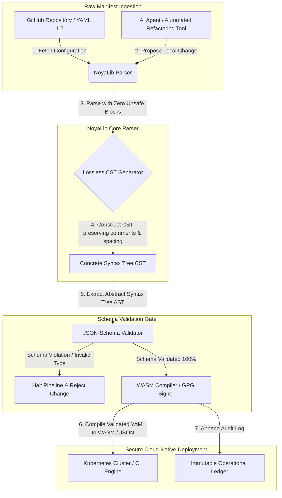

## 2026-இல் AI, MCP மற்றும் நிதிக் கட்டமைப்புக்கு YAML ஏன் பாதுகாப்பான Rust அடுக்கு தேவை

பாதுகாப்பான Rust YAML அடுக்கு முக்கியமானது, ஏனெனில் YAML இப்போது CI/CD பைப்லைன்கள், Kubernetes manifests, [Open Policy Agent](https://www.openpolicyagent.org/) விதிகள் மற்றும் Model Context Protocol (MCP) கருவி பதிவேடுகளைச் சுமக்கிறது — ஒரு தனித் தெளிவற்ற பாகுபடுத்தல் ஒரு தீர்வு அமைப்பை முறியடிக்கலாம், ஒரு பாதுகாப்புக் குழுவைத் தவறாக அமைக்கலாம், அல்லது உள்ளூர் AI முகவருக்குத் தவறான அனுமதிகளைக் கையளிக்கலாம். [NoyaLib](https://github.com/sebastienrousseau/noyalib) என்பது தூய-Rust, பூஜ்ஜிய-unsafe [YAML 1.2](https://yaml.org/spec/1.2.2/) பாகுபடுத்தல் மற்றும் சரிபார்ப்பு சூழல் அமைப்பாகும், அந்தக் கட்டமைப்பை இயல்பாகவே பாதுகாப்பாக்குவதற்காக வடிவமைக்கப்பட்டது.

## விரைவான பதில்

**NoyaLib என்றால் என்ன, ஒரே வாக்கியத்தில்?** NoyaLib என்பது திறந்த-மூல, தூய-Rust YAML 1.2 பாகுபடுத்தி மற்றும் சரிபார்ப்பு சூழல் அமைப்பாகும், பூஜ்ஜிய `unsafe` குறியீடு, அதிகாரப்பூர்வ 406-சோதனை YAML தொகுப்பில் 100 % விவரக்குறிப்பு இணக்கம், இழப்பற்ற Concrete Syntax Tree மற்றும் நிகழ்நேர [JSON Schema](https://json-schema.org/) சரிபார்ப்புடன் — AI-முகவர், MCP, Kubernetes மற்றும் நிதிக்-கட்டமைப்பு கட்டமைப்பை இயல்பாகவே பாதுகாப்பாக்குவதற்காக வடிவமைக்கப்பட்டது.

## நிர்வாகச் சுருக்கம்

ஒரு தெளிவற்ற பாகுபடுத்தல் அல்லது ஸ்கீமா மீறல் பல பில்லியன் டாலர் மதிப்புள்ள உற்பத்தி தீர்வு அமைப்பை முறியடிக்கும் வரை YAML அடக்கமாகவே தோன்றுகிறது. 2026-இல், [CI/CD](https://docs.github.com/en/actions/learn-github-actions/workflow-syntax-for-github-actions) பைப்லைன்கள், [Kubernetes](https://kubernetes.io/docs/concepts/configuration/overview/) manifests, [Open Policy Agent](https://www.openpolicyagent.org/) விதிகள் மற்றும் Model Context Protocol (MCP) கருவி பதிவேடுகளுக்கு YAML நடைமுறை தரநிலையாக உள்ளது. நினைவக பாதிப்புகள் மற்றும் அழிவுகரமான பாகுபடுத்தலுடன் கூடிய ஒளிபுகா பாரம்பரிய பாகுபடுத்திகள் ஏற்றுக்கொள்ள முடியாத பாதுகாப்பு ஆபத்தாகும். NoyaLib என்பது தூய-Rust, பூஜ்ஜிய-unsafe YAML 1.2 சூழல் அமைப்பாகும்: அனைத்து 406 அதிகாரப்பூர்வ தொகுப்பு சோதனைகளிலும் 100 % விவரக்குறிப்பு இணக்கம், கருத்துரைகள் மற்றும் இடைவெளியைப் பாதுகாக்கும் இழப்பற்ற Concrete Syntax Tree (CST) மற்றும் உள்ளமைந்த JSON-Schema சரிபார்ப்பு. இதன் விளைவாக YAML ஒரு தணிக்கை செய்யக்கூடிய, பாதுகாப்பான மற்றும் முகவர்-அணுகக்கூடிய கட்டமைப்புக் கட்டுப்பாட்டுத் தளமாக மறுவடிவமைக்கப்படுகிறது.

## முக்கிய கருத்துக்கள்

- **கட்டமைப்பு என்பது உற்பத்தி குறியீடு.** ஒரு தனித் தவறான YAML கோப்பு கிளவுட்-நேட்டிவ் பாதுகாப்புக் குழுக்களை அல்லது AI-முகவர் அனுமதிகளைத் தவறாக அமைக்கலாம். NoyaLib YAML-ஐ முக்கியமான கட்டமைப்பாகக் கருதுகிறது.
- **பூஜ்ஜிய-unsafe வடிவமைப்பு.** முழுவதுமாக பாதுகாப்பான Rust-இல், பூஜ்ஜிய `unsafe` தொகுதிகளுடன் கட்டமைக்கப்பட்ட NoyaLib, முக்கிய பாகுபடுத்தல் அடுக்குகளில் நினைவக-பாதுகாப்பு பாதிப்புகளை — பஃபர் ஓவர்ஃப்ளோக்கள், தொலைநிலை குறியீடு செயலாக்கம் — நீக்குகிறது.
- **முழுமையான 406/406 விவரக்குறிப்பு இணக்கம்.** கட்டமைப்பு அமைப்புகளை கணிதரீதியாக சரிபார்க்கிறது, ஸ்டேஜிங் மற்றும் உற்பத்தி சூழல்களுக்கு இடையேயான பாகுபடுத்தல் முரண்பாடுகளையும் கட்டமைப்பு விலகல்களையும் நீக்குகிறது.
- **இழப்பற்ற Concrete Syntax Tree.** கருத்துரைகளையும் வடிவமைப்பையும் நிராகரிக்கும் பாரம்பரிய பாகுபடுத்திகளைப் போலல்லாமல், NoyaLib இடைவெளியையும் குறிப்புகளையும் பாதுகாக்கிறது, AI முகவர்களால் பாதுகாப்பான, சுற்று-பயண தானியங்கி மறுவடிவமைப்பை செயல்படுத்துகிறது.
- **வாரிய-அளவிலான நம்பிக்கைப் பொறுப்பு மதிப்பு.** கட்டமைப்பு நேர்மையை [DORA Article 5](https://eur-lex.europa.eu/legal-content/EN/TXT/?uri=CELEX%3A32022R2554) மற்றும் [Basel III](https://www.bis.org/bcbs/publ/d424.htm) செயல்பாட்டு-ஆபத்து மூலதன அளவீடுகளுடன் இணைக்கிறது, மூத்த நிர்வாகத்தை தனிப்பட்ட பொறுப்பிலிருந்து நேரடியாகப் பாதுகாக்கிறது.

**தொடர்புடைய வாசிப்பு:** [KyberLib மற்றும் 2026-இல் பிந்தைய-குவாண்டம் வங்கி இடம்பெயர்வு: தரநிலைகளிலிருந்து குறியீடு வரை](https://sebastienrousseau.com/2026-06-12-kyberlib-post-quantum-banking-migration-standards-code-2026/), [2026-இல் கிளவுட் நேட்டிவ் வங்கிக் குறியீடு: DORA, தள பொறியியல், இறையாண்மை கிளவுட் மற்றும் செயல்பாட்டு பின்னடைவு](https://sebastienrousseau.com/2026-06-05-cloud-native-banking-index-dora-resilience-platform-engineering-2026/), [2026-இல் AI-அறிந்த Dotfiles: MCP, SLSA மற்றும் பல-ஷெல் சமத்துவத்திற்கான பாதுகாப்பான, மீள்உருவாக்கக்கூடிய டெவலப்பர் பணிநிலையம் கட்டமைத்தல்](https://sebastienrousseau.com/2026-06-16-ai-aware-dotfiles-secure-reproducible-workstation-2026/).

## 01. 2026-இல் பாதுகாப்பான Rust YAML அடுக்கு ஏன் முக்கியம்

ஜூன் 2026-இல், நிறுவன IT கட்டமைப்புகள் மிகவும் விநியோகிக்கப்பட்டதாகவும், அதிகரித்து வரும் அளவில் தானியங்கியாகவும் உள்ளன.

YAML அமைதியாக முழு மென்பொருள்-பொறியியல் அடுக்கிற்கும் சுமை-தாங்கும் கட்டமைப்பு மொழியாக மாறிவிட்டது. உற்பத்தி கலைப்பொருட்களைத் தொகுக்கும் தொடர்-ஒருங்கிணைப்பு (CI) பணிப்பாய்வுகளையும், உலகளாவிய கிளவுட்-நேட்டிவ் கிளஸ்டர்களை ஒழுங்கமைக்கும் [Kubernetes](https://kubernetes.io/docs/concepts/overview/) manifests-ஐயும், உள்ளூர் AI முகவர்களுக்கு உள்ளூர் செயல்பாடுகளைச் செயல்படுத்த அனுமதி வழங்கும் [Model Context Protocol](https://modelcontextprotocol.io/) (MCP) சர்வர் ஸ்கீமாக்களையும் இது சுமக்கிறது.

பாரம்பரிய YAML பாகுபடுத்திகள் — [PyYAML](https://pyyaml.org/), [yaml-cpp](https://github.com/jbeder/yaml-cpp), [libyaml](https://github.com/yaml/libyaml) — இரண்டு கட்டமைப்பு ஆபத்துகளைக் கொண்டுள்ளன:

1. **வகை-கட்டாய பாதிப்புகள் ("நார்வே பிரச்சனை").** பாரம்பரிய பாகுபடுத்திகள் அடிக்கடி மேற்கோள் இல்லாத சரங்களை கட்டாயப்படுத்துகின்றன (நாட்டுக் குறியீடு `NO`-ஐ பூலியன் `false` ஆகவும், `yes`/`no`-ஐயும் அவ்வாறே) — [YAML 1.1 vs 1.2 boolean tag](https://yaml.org/type/bool.html)-ஐப் பார்க்கவும் — இது முக்கியமான அமைப்பு தோல்விகளை அல்லது அமைதியான பாதுகாப்பு தவறமைப்புகளை ஏற்படுத்துகிறது.
2. **நினைவக-பாதுகாப்பு சுரண்டல்கள்.** C/C++-இல் எழுதப்பட்ட ஒளிபுகா பாகுபடுத்திகள் நினைவக-கசிவு மற்றும் பஃபர்-ஓவர்ஃப்ளோ சுரண்டல்களால் பாதிக்கப்படுகின்றன, இது முக்கிய பில்ட் சர்வர்களில் தொலைநிலை குறியீடு செயலாக்கத்திற்கு (RCE) வழிவகுக்கும்.

[NoyaLib](https://github.com/sebastienrousseau/noyalib) இந்த சவால்களைத் தீர்க்கிறது. இது தூய-Rust, பூஜ்ஜிய-unsafe YAML 1.2 பாகுபடுத்தல் மற்றும் சரிபார்ப்பு சூழல் அமைப்பாகும். முழுமையான 406/406 விவரக்குறிப்பு இணக்கத்தை அடைந்து, பாகுபடுத்தலின் போது நேரடியாக கடுமையான JSON-Schema சரிபார்ப்பை அமல்படுத்துவதன் மூலம், NoyaLib உயர் **பின்னடைவு மீதான வருவாய் (Return on Resilience, RoR)**-ஐ வழங்குகிறது — கட்டமைப்பு-தூண்டப்பட்ட செயலிழப்பைத் தடுத்து, நிதி-தர மென்பொருள் விநியோகச் சங்கிலிகளைப் பாதுகாக்கிறது.

## 02. NoyaLib 2026 கட்டிடக்கலை நோக்கு

NoyaLib சூழல் அமைப்பு பாதுகாப்பான, இழப்பற்ற கட்டமைப்பு பாகுபடுத்தியாகச் செயல்படுகிறது. ஒவ்வொரு உள்ளூர் மற்றும் கிளவுட் manifest-ம் கட்டமைப்பு ரீதியாக சரிபார்க்கப்பட்டு, மிகக் குறைந்த செயலாக்க அடுக்கில் பாதுகாக்கப்படுகிறது.

### அட்டவணை 1: NoyaLib கட்டிடக்கலை அடுக்குகள் மற்றும் ஆபத்து குறைப்பு

| அடுக்கு | வடிவமைப்பு முடிவு | ஏன் முக்கியம் | தவறாகக் கையாளப்பட்டால் ஆபத்து |
| ---- | ---- | ---- | ---- |
| **பாகுபடுத்தி அடுக்கு** | YAML 1.2 இணக்கமான, பூஜ்ஜிய `unsafe` தொகுதிகள் கொண்ட தூய-Rust பாகுபடுத்தி | மிகக் குறைந்த செயலாக்க அடுக்கில் நினைவக-பாதுகாப்பு பாதிப்புகளையும் பஃபர் ஓவர்ஃப்ளோக்களையும் நீக்குகிறது. | முக்கிய பில்ட் சர்வர்களில் தொலைநிலை குறியீடு செயலாக்கம் (RCE). |
| **இணக்க அடுக்கு** | 406/406 அதிகாரப்பூர்வ YAML 1.2 தொகுப்பு சோதனைகளில் 100 % இணக்கம் | ஸ்டேஜிங் மற்றும் உற்பத்திக்கு இடையேயான பாகுபடுத்தல் முரண்பாடுகளையும் வகை-கட்டாய விலகலையும் நீக்குகிறது. | பாதுகாப்புக் குழுக்களை முடக்கும் "நார்வே பிரச்சனை" வகை-கட்டாய பிழைகள். |
| **தொடரியல்-மர அடுக்கு** | இழப்பற்ற Concrete Syntax Tree (CST) | சுற்று-பயண பாகுபடுத்தல் மற்றும் நிரல்ரீதியான மறுவடிவமைப்பின் போது கருத்துரைகள், இடைவெளி மற்றும் வரிசையைப் பாதுகாக்கிறது. | தானியங்கி AI மறுவடிவமைப்பு டெவலப்பர் குறிப்புகளை அழித்தல். |
| **சரிபார்ப்பு அடுக்கு** | பாகுபடுத்தலின் போது [JSON Schema (Draft 2020-12)](https://json-schema.org/draft/2020-12/release-notes) சரிபார்ப்பு | உற்பத்தி கிளஸ்டர்களை அடையும் முன் கட்டமைப்புக் கோப்புகளில் கடுமையான தரவு மாதிரிகளை அமல்படுத்துகிறது. | தவறான கட்டமைப்புக் கோப்புகள் கிளவுட்-நேட்டிவ் கிளஸ்டர் செயலிழப்புகளைத் தூண்டுதல். |
| **இடைமுக அடுக்கு** | WebAssembly (WASM) மற்றும் MCP பிணைப்புகள் | உலாவிகள், எட்ஜ் முனைகள் மற்றும் உள்ளூர் முகவர் கருவித்தொகுப்புகளுக்குள் நேரடியாக கட்டமைப்பு சரிபார்ப்பை இயக்க அனுமதிக்கிறது. | எட்ஜ் சாதனங்களில் சரிபார்ப்பை இயக்க முடியாத கருவி மையங்கள். |

## 03. முக்கிய பணிநிலையம் மற்றும் கட்டமைப்பு பாதுகாப்பு சமிக்ஞைகள்

மேம்பாடு மற்றும் செயல்பாட்டு எஸ்டேட் முழுவதிலும் முழுமையான பாதுகாப்பைப் பராமரிக்க, தலைமை தகவல் பாதுகாப்பு அதிகாரிகள் (CISOs) குறிப்பிட்ட, அளவிடக்கூடிய அளவீடுகளைக் கண்காணிக்க வேண்டும்.

### அட்டவணை 2: பணிநிலையம் மற்றும் கட்டமைப்பு பாதுகாப்பு சமிக்ஞைகள்

| சமிக்ஞை | அளவீடு / செயல்பாட்டு தரநிலை | NIST CSF / DORA குறிப்பு | தொழில்நுட்பத் தள செயலாக்கம் |
| ---- | ---- | ---- | ---- |
| **பாகுபடுத்தி இணக்கம்** | அதிகாரப்பூர்வ YAML 1.2 சோதனைத் தொகுப்பில் 100 % தேர்ச்சி விகிதம் (406/406 சோதனைகள்). | [DORA Article 6](https://eur-lex.europa.eu/legal-content/EN/TXT/?uri=CELEX%3A32022R2554) (ICT பாதுகாப்பு) | CI செயலாக்கத்திற்கு முன் அனைத்து manifests-ஐயும் சரிபார்க்கும் NoyaLib பாகுபடுத்தி மையம். |
| **நினைவக பாதுகாப்பு விவரம்** | பாகுபடுத்தி மற்றும் சீரியலைசர் சார்புகளுக்குள் பூஜ்ஜிய `unsafe` Rust தொகுதிகள். | DORA Article 30 (விநியோகச் சங்கிலி) | cargo பில்டுகளில் தானியங்கி கம்பைலர் சோதனைகள் ([`forbid(unsafe_code)`](https://doc.rust-lang.org/reference/attributes/diagnostics.html#the-forbid-attribute)). |
| **ஸ்கீமா சரிபார்ப்பு** | பாகுபடுத்தப்பட்ட கட்டமைப்புக் கோப்புகளில் 100 % செல்லுபடியாகும் [JSON Schema](https://json-schema.org/) மாதிரிகளுக்கு எதிராகச் சரிபார்க்கப்பட்டது. | [NIST CSF 2.0](https://www.nist.gov/cyberframework) (PR.DS-01) | ஸ்கீமா மீறல்களில் பில்ட் பைப்லைன்களை நிறுத்தும் நிகழ்நேர சரிபார்ப்பு வாயில். |
| **கட்டமைப்பு விலகல்** | உள்ளூர் கட்டமைப்புக் கோப்புகளை git-பதிப்பு நிலைக்கு நிகழ்நேர கண்டறிதல் மற்றும் மீட்பு. | பின்னடைவு மீதான வருவாய் (RoR) | அனைத்து உள்ளூர் கோப்பு மாற்றங்களையும் பதிவு செய்யும் தொடர்ச்சியான டெலிமெட்ரி. |
| **முகவர் அணுகல் கட்டுப்பாடு** | MCP கட்டமைப்புகள் மூலம் செயல்படும் உள்ளூர் AI கருவிகளுக்கு வரம்பிடப்பட்ட, படிக்க-மட்டும் அனுமதிகள். | மாதிரி ஆபத்து மேலாண்மை ([SR 11-7](https://web.archive.org/web/20260414150921/https://www.federalreserve.gov/supervisionreg/srletters/sr1107.htm)) | முகவர் செயல்பாடுகளை அங்கீகரிக்கப்பட்ட கோப்பகங்களுக்குக் கட்டுப்படுத்தும் MCP சர்வர் எல்லைகள். |

## 04. ஒளிபுகா கட்டமைப்பு பாகுபடுத்தலின் தவறான கோட்பாடு

கிளவுட்-நேட்டிவ் செயல்பாடுகளில் ஒரு பெரிய பாதிப்பு *ஒளிபுகா பாகுபடுத்தல்* ஆகும் — கட்டமைப்பு மேனாதரவை (கருத்துரைகள், வெள்ளிடம், ஆவண வரிசை) நிராகரிக்கும் அல்லது தொகுப்பின் போது அமைதியாக வகைகளைக் கட்டாயப்படுத்தும் பாகுபடுத்திகளைப் பயன்படுத்துதல். இந்த நடத்தை இரண்டு கடுமையான பாதுகாப்பு ஆபத்துகளை அறிமுகப்படுத்துகிறது:

1. **அழிவுகரமான மறுவடிவமைப்பு.** ஒரு AI குறியீட்டு உதவியாளர் அல்லது தானியங்கி மறுவடிவமைப்பு கருவி ஒரு வரிசைப்படுத்தல் manifest-ஐ புதுப்பிக்கும்போது, பாரம்பரிய பாகுபடுத்திகள் டெவலப்பர் கருத்துரைகளையும் வடிவமைப்பையும் நிராகரிக்கின்றன, மனித மதிப்பாய்வுகள் மற்றும் சம்பவத்திற்குப் பிந்தைய தடயவியலுக்குத் தேவையான சூழலை அழிக்கின்றன.
2. **பாகுபடுத்தல் முரண்பாடுகள்.** ஒரு ஸ்டேஜிங் சூழல் Python-அடிப்படையிலான பாகுபடுத்தியைப் பயன்படுத்தி, உற்பத்தி C-அடிப்படையிலான பாகுபடுத்தியை இயக்கினால், YAML 1.2 விவரக்குறிப்பு இணக்கத்தில் சிறிய வேறுபாடுகள் செல்லுபடியாகும் ஸ்டேஜிங் manifest-ஐ உற்பத்தியில் தோல்வியடையச் செய்யலாம் அல்லது வேறுவிதமாக நடந்துகொள்ளச் செய்யலாம், மறைந்த பாதுகாப்பு பாதிப்புகளை உருவாக்கலாம்.

NoyaLib-இன் **இழப்பற்ற Concrete Syntax Tree (CST)** இதைத் தீர்க்கிறது. இது பாகுபடுத்தி-மற்றும்-சீரியலைஸ் சுழற்சியின் போது ஒவ்வொரு இடைவெளி, கருத்துரை மற்றும் ஆவண வரியையும் பாதுகாக்கிறது. தானியங்கி AI உதவியாளர்கள் மனிதனால் எழுதப்பட்ட குறிப்புகளில் 100 %-ஐப் பாதுகாத்தபடி கட்டமைப்புக் கோப்புகளைத் திருத்தலாம், மறுவடிவமைக்கலாம் மற்றும் கமிட் செய்யலாம் — ஒரு முழுமையான தணிக்கைத் தடம்.

## 05. வரம்பிடப்பட்ட AI கட்டமைப்பு பைப்லைனை வடிவமைத்தல்

தீங்கிழைக்கும் கட்டமைப்பு மாற்றங்கள் உற்பத்தி சூழல்களை அடைவதைத் தடுக்க, நிறுவனம் கடுமையாக வரம்பிடப்பட்ட, ஸ்கீமா-சரிபார்க்கப்பட்ட கட்டமைப்பு பைப்லைனை செயல்படுத்த வேண்டும்.

கீழேயுள்ள செயல்பாட்டு ஓட்டம், NoyaLib மூல YAML-ஐ எவ்வாறு பாகுபடுத்துகிறது, இழப்பற்ற CST-ஐ உருவாக்குகிறது, AST-ஐ JSON-Schema மாதிரிக்கு எதிராகச் சரிபார்க்கிறது, மற்றும் உலாவி அல்லது எட்ஜ் சூழல்களுக்கு WebAssembly பிணைப்புகளைத் தொகுக்கிறது என்பதைக் காட்டுகிறது.

## 06. வாரியக் கூட நடைமுறை மற்றும் நம்பிக்கைப் பொறுப்பு

கட்டமைப்பு பாதுகாப்பு மற்றும் மென்பொருள்-விநியோகச்-சங்கிலி நேர்மை என்பவை முக்கியமான வாரியக் கூட முன்னுரிமைகளாகும். மூத்த மேலாளர்கள் நம்பிக்கைப் பொறுப்பு மற்றும் செயல்பாட்டு பின்னடைவின் நோக்கிலிருந்து கட்டமைப்பு மேலாண்மையை அணுக வேண்டும்.

- **DORA Article 5 (வாரிய பொறுப்புக்கூறல்).** நிறுவனத்தின் ICT ஆபத்தை நிர்வகிப்பதற்கான இறுதி, ஒப்படைக்க முடியாத பொறுப்பை வாரியம் தாங்குகிறது என்று வரையறுக்கிறது. கட்டமைப்புக் கோப்புகள் முக்கியமான கிளவுட்-நேட்டிவ் பாதுகாப்புக் குழுக்களையும் கட்டண-வழிநடத்தல் பாதைகளையும் கட்டுப்படுத்துவதால், ஒழுங்குமுறை தணிக்கைகளை பூர்த்தி செய்ய, இந்த manifests-ஐப் பாகுபடுத்தும் அமைப்புகள் நினைவக-பாதுகாப்பானவை மற்றும் முழுமையாக விவரக்குறிப்பு-இணக்கமானவை என்பதை வாரியங்கள் சரிபார்க்க வேண்டும். ([Regulation (EU) 2022/2554](https://eur-lex.europa.eu/legal-content/EN/TXT/?uri=CELEX%3A32022R2554))
- **BCBS 239 (ஆபத்து தரவு திரட்டல் மற்றும் அறிக்கையிடல்).** ஆபத்து அறிக்கையிடல் மற்றும் கட்டமைப்பு அளவீடுகள் துல்லியமாகவும், முழுமையாகவும், கடுமையான தரவு-தர கட்டுப்பாடுகளின் கீழ் உருவாக்கப்பட வேண்டும் என்று கோருகிறது. NoyaLib கட்டமைப்புக் கோப்புகளை மூலத்திலேயே கடுமையான ஸ்கீமாக்களுக்கு எதிராகப் பாகுபடுத்தி சரிபார்ப்பதன் மூலம் BCBS 239-ஐ ஆதரிக்கிறது, அமைதியான தரவு கசிவு அல்லது தவறமைப்பு-தூண்டப்பட்ட செயலிழப்புகளைத் தடுக்கிறது. ([BCBS 239 standard](https://www.bis.org/publ/bcbs239.htm))
- **செயல்பாட்டு-ஆபத்து மூலதனச் சுமைகளின் குறைப்பு (Basel III).** கட்டமைப்பு-தூண்டப்பட்ட செயலிழப்புகள் Basel III-இன் கீழ் செயல்பாட்டு-ஆபத்து மூலதனச் சுமைகளை நேரடியாக உயர்த்துகின்றன, இருப்புநிலைக் குறிப்பு மூலதனத்தைப் பிணைக்கின்றன. NoyaLib போன்ற பாதுகாப்பான, தூய-Rust பாகுபடுத்தியில் நிறுவன கட்டமைப்பு அடுக்கைத் தரப்படுத்துவது இந்த ஆபத்தைக் குறைக்கிறது, மூலதனத்தைப் பாதுகாத்து வாடிக்கையாளர் நம்பிக்கையைக் காக்கிறது. ([Basel III standards](https://www.bis.org/bcbs/publ/d424.htm))

## 07. இது வங்கி வகைப்படி என்ன அர்த்தம்

### உலகளாவிய அமைப்பு ரீதியாக முக்கியமான வங்கிகள் (G-SIBs)

G-SIBs பல அதிகார வரம்புகளில் ஆயிரக்கணக்கான மைக்ரோ சர்வீஸ்கள் மற்றும் வரிசைப்படுத்தல் பைப்லைன்களை நிர்வகிக்கின்றன. அவற்றின் முதன்மை சவால் பரந்த கிளவுட்-நேட்டிவ் எஸ்டேட்கள் முழுவதும் கட்டமைப்பு நிலைத்தன்மையைப் பராமரித்தல் மற்றும் பாதுகாப்பு விலகலைத் தடுத்தல் ஆகும். NoyaLib போன்ற பாதுகாப்பான Rust YAML அடுக்கில் தரப்படுத்துவது, அனைத்து Kubernetes manifests, CI/CD பைப்லைன்கள் மற்றும் பாதுகாப்புக் கொள்கைகள் ஒரு சீரான, நினைவக-பாதுகாப்பான கட்டமைப்பின் கீழ் பாகுபடுத்தப்பட்டு சரிபார்க்கப்படுவதை உறுதி செய்கிறது — தணிக்கை செய்யப்படாத "பனிக்கட்டி" கட்டமைப்புகளின் ஆபத்தை நீக்குகிறது.

### பரிவர்த்தனை மற்றும் கார்ப்பரேட் வங்கிகள்

பரிவர்த்தனை வங்கிகள் உணர்திறன் மிக்க கட்டண நுழைவாயில்கள் மற்றும் மொத்த தீர்வுக் கட்டமைப்புகளை இயக்குகின்றன. இந்த உற்பத்தி சூழல்களுக்கு வரிசைப்படுத்தப்பட்ட குறியீடு மற்றும் கட்டமைப்பின் முழுமையான பாதுகாப்பை நிரூபிப்பது பேச்சுவார்த்தைக்கு அப்பாற்பட்ட ஒழுங்குமுறைக் கோரிக்கையாகும். NoyaLib-ஐ ஒருங்கிணைப்பது மென்பொருள் விநியோகச் சங்கிலி முழுமையாக தணிக்கை செய்யப்பட்டதாகவும், இழப்பற்றதாகவும், பாகுபடுத்தல் பாதிப்புகளிலிருந்து பாதுகாக்கப்பட்டதாகவும் இருப்பதை உறுதி செய்கிறது — DORA Article 6 மற்றும் [PCI DSS v4.0](https://www.pcisecuritystandards.org/document_library/) பிரிவு 6-க்கு தூய்மையாக வரைபடமாகும் ஒரு கட்டுப்பாடு.

### பிராந்திய மற்றும் சிறிய வங்கிகள்

பிராந்திய வங்கிகள் G-SIB-அளவிலான தொழில்நுட்ப பட்ஜெட்கள் இல்லாமலேயே உயர் இணைய பாதுகாப்பு தரநிலைகளைப் பராமரிக்க வேண்டும். திறந்த-மூல NoyaLib கட்டமைப்பு இலகுவான, செலவு-குறைந்த மற்றும் அதிக பாதுகாப்பான Rust-நட்பு தீர்வை வழங்குகிறது, தனியுரிம உரிமக் கட்டணங்கள் இல்லாமல் நிறுவன-தர கட்டமைப்பு பாதுகாப்பு மற்றும் விநியோகச்-சங்கிலி பாதுகாப்பை செயல்படுத்த சிறிய நிறுவனங்களுக்கு உதவுகிறது.

## 08. முடிவுரை: கட்டமைப்பு பாதுகாப்பு வரைபடம்

டெவலப்பர் பணிநிலையம் மற்றும் கிளவுட்-நேட்டிவ் கட்டமைப்பு கட்டமைப்புகள் மென்பொருள் விநியோகச் சங்கிலியில் முக்கியமான கட்டுப்பாட்டுத் தளங்களாகும். தணிக்கை செய்யப்படாத, தெளிவற்ற அல்லது பாதுகாப்பற்ற கட்டமைப்புக் கோப்புகள் நிறுவன சொத்துக்களை அடைய அனுமதிப்பது ஏற்றுக்கொள்ள முடியாத செயல்பாட்டு மற்றும் ஒழுங்குமுறை ஆபத்தாகும்.

மென்பொருள் விநியோகச் சங்கிலியைப் பாதுகாக்கவும், கட்டமைப்பு பாதிப்புகளிலிருந்து முனைப்புள்ளிகளைப் பாதுகாக்கவும், மூத்த தொழில்நுட்ப மற்றும் பாதுகாப்பு மேலாளர்கள் இன்றே தெளிவான மேம்பாட்டு வரைபடத்தை செயல்படுத்த வேண்டும்:

1. **அறிவிப்பு கட்டமைப்பைக் கட்டாயப்படுத்துங்கள்.** கைமுறை, தணிக்கை செய்யப்படாத கட்டமைப்பு சரிசெய்தல்களை படிப்படியாக நீக்கி, அனைத்து manifests-ஐயும் பதிப்பு-கட்டுப்படுத்தப்பட்ட, அறிவிப்பு பதிவு அமைப்பாக நிர்வகிக்க வேண்டும் என்று கட்டாயப்படுத்துங்கள்.
2. **ஸ்கீமா சரிபார்ப்பை அமல்படுத்துங்கள்.** வரிசைப்படுத்தலுக்கு முன் அனைத்து கட்டமைப்புக் கோப்புகளும் செல்லுபடியாகும் JSON-Schema மாதிரிகளுக்கு எதிராகச் சரிபார்க்கப்படுவதை உறுதிசெய்ய கடுமையான முன்-கமிட் ஹூக்குகளையும் ஸ்கேனிங் பயன்பாடுகளையும் அமல்படுத்துங்கள்.
3. **இழப்பற்ற சுற்று-பயணத்தை செயல்படுத்துங்கள்.** அனைத்து தானியங்கி AI குறியீட்டு உதவியாளர்களும் மறுவடிவமைப்பு கருவிகளும் கருத்துரைகள், இடைவெளி மற்றும் டெவலப்பர் சூழலைப் பாதுகாக்க இழப்பற்ற பாகுபடுத்தலைப் பயன்படுத்துவதை உறுதிசெய்யுங்கள்.
4. **விநியோகச் சங்கிலியைப் பாதுகாக்குங்கள்.** செயலாக்கத்திற்கு முன் NoyaLib போன்ற தூய-Rust, பூஜ்ஜிய-unsafe நூலகங்களைப் பயன்படுத்தி அனைத்து கட்டமைப்பு அமைப்புகளும் பாகுபடுத்தல் பயன்பாடுகளும் குறியியல் ரீதியாக சரிபார்க்கப்படுவதை உறுதிசெய்யுங்கள். ([SLSA framework](https://slsa.dev/))

## 09. அடிக்கடி கேட்கப்படும் கேள்விகள்

**NoyaLib என்றால் என்ன, YAML பாகுபடுத்தலுக்கு அது ஏன் பயன்படுத்தப்படுகிறது?**
NoyaLib என்பது திறந்த-மூல, தூய-Rust, பூஜ்ஜிய-unsafe YAML 1.2 பாகுபடுத்தி. இது அதிகாரப்பூர்வ 406-சோதனைத் தொகுப்பில் 100 % விவரக்குறிப்பு இணக்கத்தை அடைகிறது, பாகுபடுத்தலின் போது கடுமையான [JSON Schema](https://json-schema.org/) சரிபார்ப்பை அமல்படுத்துகிறது, மற்றும் WASM மற்றும் [MCP](https://modelcontextprotocol.io/) பிணைப்புகளை வெளிப்படுத்துகிறது — AI முகவர்கள், Kubernetes மற்றும் நிதிக் கட்டமைப்புக்கு இதை பாதுகாப்பான Rust YAML அடுக்காக்குகிறது.

**கட்டமைப்பு பாகுபடுத்தலுக்கு பூஜ்ஜிய-unsafe வடிவமைப்பு ஏன் முக்கியம்?**
C/C++-இல் எழுதப்பட்ட பாரம்பரிய பாகுபடுத்திகளுக்குள் உள்ள நினைவக-பாதுகாப்பு பாதிப்புகள் — பஃபர் ஓவர்ஃப்ளோக்கள், use-after-free — முக்கிய பில்ட் சர்வர்களில் தொலைநிலை குறியீடு செயலாக்கத்திற்கு வழிவகுக்கும். [`#![forbid(unsafe_code)]`](https://doc.rust-lang.org/reference/attributes/diagnostics.html#the-forbid-attribute) கொண்ட NoyaLib-இன் தூய-Rust வடிவமைப்பு இந்தப் பாதிப்புகளை தொகுப்பு நேரத்தில் கணிதரீதியாக நீக்குகிறது.

**இழப்பற்ற Concrete Syntax Tree (CST) என்றால் என்ன, அது ஏன் முக்கியம்?**
பாரம்பரிய பாகுபடுத்திகள் கருத்துரைகளையும் வடிவமைப்பையும் நிராகரிக்கின்றன, AI முகவர்களால் தானியங்கி திருத்தங்களை அழிவுகரமாக்குகின்றன. NoyaLib-இன் இழப்பற்ற Concrete Syntax Tree ஒவ்வொரு கருத்துரை, இடைவெளி மற்றும் ஆவண வரியையும் பாதுகாக்கிறது — எனவே AI உதவியாளர்கள் டெவலப்பர் சூழல், சம்பவத்திற்குப் பிந்தைய தடயவியல் மற்றும் தணிக்கைத் தடத்தை அப்படியே வைத்துக்கொண்டு கட்டமைப்புக் கோப்புகளைப் பாதுகாப்பாகத் திருத்தலாம் மற்றும் மறுவடிவமைக்கலாம்.

**NoyaLib DORA, BCBS 239 மற்றும் Basel III-க்கு எவ்வாறு வரைபடமாகிறது?**
DORA Article 5 ICT-ஆபத்து பொறுப்புக்கூறலை வாரியத்தின் மீது வைக்கிறது; BCBS 239 ஆபத்து அறிக்கையிடலில் தரவு-தர கட்டுப்பாடுகளைக் கோருகிறது; Basel III செயல்பாட்டு-ஆபத்து மூலதனத்திற்கு வரி விதிக்கிறது. குறியீடாகக் கட்டமைப்புக்கு அந்த ஒழுங்குமுறைகள் தேவைப்படும் ஸ்கீமா-சரிபார்க்கப்பட்ட, நினைவக-பாதுகாப்பான பாகுபடுத்தல் அடுக்கை NoyaLib வழங்குகிறது — ஒழுங்குமுறை வரைபடத்தை நேரடியானதாகவும், செயல்பாட்டு-ஆபத்து மூலதனச் சுமையை சிறியதாகவும் ஆக்குகிறது.

## 10. குறிப்புகள்

- **YAML, (2026).** *YAML 1.2 specification*. இங்கு கிடைக்கிறது: [YAML 1.2 spec](https://yaml.org/spec/1.2.2/).
- **JSON Schema, (2026).** *JSON Schema Draft 2020-12 release notes*. இங்கு கிடைக்கிறது: [JSON Schema Draft 2020-12](https://json-schema.org/draft/2020-12/release-notes).
- **European Parliament and Council of the European Union, (2022).** *Regulation (EU) 2022/2554 on digital operational resilience for the financial sector (DORA)*. Brussels: Official Journal of the European Union. இங்கு கிடைக்கிறது: [DORA regulation](https://eur-lex.europa.eu/legal-content/EN/TXT/?uri=CELEX%3A32022R2554).
- **Basel Committee on Banking Supervision, (2013).** *Principles for effective risk data aggregation and risk reporting (BCBS 239)*. Basel: Bank for International Settlements. இங்கு கிடைக்கிறது: [BCBS 239 standard](https://www.bis.org/publ/bcbs239.htm).
- **Basel Committee on Banking Supervision, (2017).** *Basel III: finalising post-crisis reforms*. Basel: Bank for International Settlements. இங்கு கிடைக்கிறது: [Basel III standards](https://www.bis.org/bcbs/publ/d424.htm).
- **Anthropic, (2025).** *Model Context Protocol (MCP) specification*. இங்கு கிடைக்கிறது: [Model Context Protocol](https://modelcontextprotocol.io/).
- **GitHub, (2026).** *noyalib open-source repository*. இங்கு கிடைக்கிறது: [NoyaLib repository](https://github.com/sebastienrousseau/noyalib).
