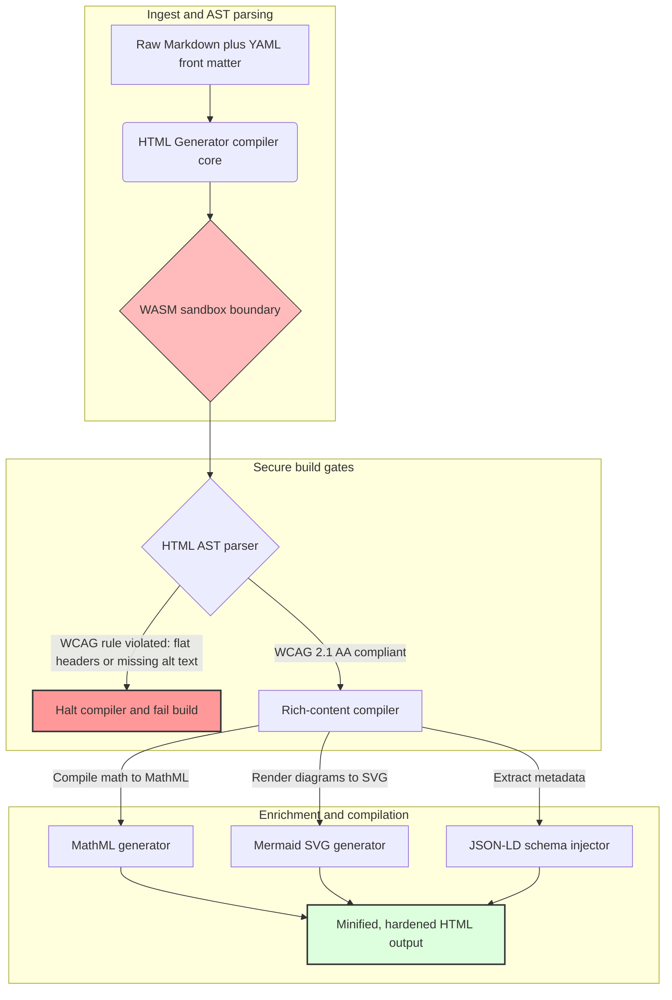

## 2026 இல் Rust மூலம் Markdown ஐ அணுகக்கூடிய, SEO தயார், கட்டமைப்பு HTML ஆக மாற்றுதல்

2026 இல், வலை உள்ளடக்கம் மனித வாசகர்களால் நுகரப்படுவதைப் போலவே AI தேடல் க்ராலர்கள், LLM-ஆதரவு தேடுபொறிகள் மற்றும் Retrieval-Augmented Generation (RAG) பைப்லைன்களாலும் நுகரப்படுகிறது. தட்டையான அல்லது தவறான வடிவமைப்பு கொண்ட HTML இயந்திர கண்டுபிடிப்புத்தன்மையை சமரசம் செய்கிறது, அதே நேரத்தில் [European Accessibility Act (EAA)](https://www.accessibility-act.eu/) மற்றும் [US ADA Title III](https://www.ada.gov/topics/title-iii/) போன்ற கடுமையான உலகளாவிய ஒழுங்குமுறைகளை இணங்கத் தவறுவது இப்போது தெளிவற்ற சிவில் பொறுப்பாகும். [HTML Generator](https://github.com/sebastienrousseau/html-generator) என்பது அந்த இடைவெளிகளை மூட வடிவமைக்கப்பட்ட ஒரு உயர்-செயல்திறன் Rust நூலகம் — வரிசைப்படுத்தலுக்குப் பிந்தைய திருத்தங்களில் அல்ல, தொகுப்பானில்.

## விரைவான பதில்

**ஒரே வாக்கியத்தில் HTML Generator என்றால் என்ன?** HTML Generator என்பது ஒரு திறந்த-மூல, தூய-Rust Markdown-லிருந்து-HTML தொகுப்பான் ஆகும், இது கட்டமைப்பு நேரத்தில் [WCAG 2.1 AA](https://www.w3.org/TR/WCAG21/) ஐ செயல்படுத்துகிறது, சொற்பொருள் லேண்ட்மார்க்குகள் மற்றும் ARIA பண்புகளை தானாகவே உருவாக்குகிறது, YAML முன் விஷயத்திலிருந்து ஸ்கீமா-இணக்கமான [JSON-LD](https://json-ld.org/) மெட்டாடேட்டாவை உட்செலுத்துகிறது, Mermaid வரைபடங்கள் மற்றும் கணிதத்தை அணுகக்கூடிய SVG மற்றும் MathML ஆக ரெண்டர் செய்கிறது, மேலும் ஒரு [WebAssembly](https://webassembly.org/) சாண்ட்பாக்ஸுக்குள் இயங்குகிறது — நிறுவன வெளியீட்டை தொகுப்பு-வாயில் கொண்ட, நம்பிக்கைப் பொறுப்பு-தர கட்டுப்பாட்டு தளமாக மாற்றுகிறது.

## நிர்வாகச் சுருக்கம்

Markdown ரெண்டரிங் அற்பமானதாகத் தோன்றுகிறது. வெளியீட்டு-தர HTML என்பது ஒரு இணக்கச் சிக்கல். ஜூன் 2026 இல், ஒவ்வொரு நிறுவன தொடர்புப் புள்ளியும் — முதலீட்டாளர் உறவுப் போர்ட்டல்கள், ஒழுங்குமுறை தாக்கல்கள், வாடிக்கையாளர் ஆவணப்படுத்தல், API குறிப்புகள், சந்தைப்படுத்தல் தளங்கள் — மனிதர்கள் மற்றும் இயந்திரங்கள் இரண்டாலும் பாகுபடுத்தப்படுகிறது. ஒவ்வொரு பக்கத்திலும் இரண்டு அழுத்தங்கள் மோதுகின்றன: [EAA](https://www.accessibility-act.eu/) மற்றும் [ADA Title III](https://www.ada.gov/topics/title-iii/) அணுகல்தன்மையை வாரிய-நிலை சட்டப் பாதிப்பாக மாற்றுகின்றன, அதே நேரத்தில் AI உட்செலுத்துதல் மற்றும் RAG பைப்லைன்கள் கட்டமைக்கப்பட்ட, இயந்திரம்-படிக்கக்கூடிய வெளியீட்டிற்கு வெகுமதி அளிக்கின்றன. நிலையான Markdown நூலகங்கள் இரண்டு வாயில்களிலும் தோல்வியடையும் தட்டையான HTML ஐ உருவாக்குகின்றன. HTML Generator ஆவண உருவாக்கத்தை தொகுப்பு-வாயில் கொண்ட பைப்லைனாகக் கருதுகிறது: WCAG சரிபார்ப்பு ஒரு கட்டமைப்புப் பிழையாகும், JSON-LD கைமுறை முத்திரையிடல் இல்லாமல் YAML முன் விஷயத்திலிருந்து வருகிறது, MathML மற்றும் Mermaid அணுகக்கூடிய வகையில் ரெண்டர் செய்யப்படுகின்றன, மேலும் முழு இயந்திரமும் ஒரு WebAssembly இலக்காக அனுப்பப்படுகிறது, இதனால் நம்பப்படாத ஆவணங்களின் பாகுபடுத்தல் ஹோஸ்டிலிருந்து சாண்ட்பாக்ஸ் செய்யப்பட்டு இருக்கிறது.

## முக்கிய கருத்துக்கள்

- **அணுகல்-ஒரு-குறியீடாக என்பது புதிய அடிப்படை.** EAA நுகர்வோர் டிஜிட்டல் சேவைகளுக்கு அணுகல்தன்மையை கட்டாயமாக்குகிறது. HTML Generator தொகுப்பு நேரத்தில் ஆவண மரத்தை மதிப்பிடுகிறது, சொற்பொருள் லேண்ட்மார்க்குகள் மற்றும் ARIA பண்புகளை தானாகவே உருவாக்குகிறது — குறைவான வரிசைப்படுத்தலுக்குப் பிந்தைய திருத்தங்கள், குறைவான தீர்வு பட்ஜெட்டுகள், உற்பத்திக்கு அனுப்பப்படும் விடுபட்ட alt-text இல்லை.
- **AI கண்டுபிடிப்புக்கான கட்டமைக்கப்பட்ட தரவு.** நவீன தேடல் மற்றும் RAG இயந்திரம்-படிக்கக்கூடிய மெட்டாடேட்டாவை சார்ந்துள்ளன. தொகுப்பான் YAML முன் விஷயத்தை பாகுபடுத்தி, [Schema.org-இணக்கமான JSON-LD](https://schema.org/) ஐ நேரடியாக ஆவணத் தலைப்பில் உட்செலுத்துகிறது, உள்ளடக்கத்தை [Google Rich Results](https://developers.google.com/search/docs/appearance/structured-data/intro-structured-data), [Bing Webmaster](https://www.bing.com/webmasters) மற்றும் LLM-ஆதரவு க்ராலர்களால் முழுமையாக விளக்கக்கூடியதாக்குகிறது.
- **தொழில்நுட்ப உள்ளடக்க சிறப்பு.** தொழில்நுட்ப வெளியீடு தட்டையான உரை அல்ல. HTML Generator மூல Markdown கணித நீட்டிப்புகளை அணுகக்கூடிய [MathML](https://www.w3.org/Math/) ஆக தொகுக்கிறது, மேலும் [Mermaid.js](https://mermaid.js.org/) வரைபடங்களை பதிலளிக்கும் SVG ஆக ரெண்டர் செய்கிறது — இரண்டும் தெளிவற்ற படங்களுக்குக் குறையாமல் WCAG-இணக்கமான கட்டமைப்பைப் பாதுகாக்கின்றன.
- **WebAssembly சாண்ட்பாக்ஸிங்.** நம்பப்படாத Markdown ஐ பாகுபடுத்துவது ஒரு பாதுகாப்பு அபாயம். [WASM](https://webassembly.org/) ஐ இலக்காகக் கொள்வதன் மூலம், HTML Generator தன்னிச்சையான குறியீடு செயலாக்கத்தைத் தடுக்கும் மற்றும் ஹோஸ்ட் அமைப்பைப் பாதுகாக்கும் ஒரு தனிமைப்படுத்தப்பட்ட சாண்ட்பாக்ஸுக்குள் இயங்குகிறது — [DORA Article 6](https://eur-lex.europa.eu/legal-content/EN/TXT/?uri=CELEX%3A32022R2554) ICT-பாதுகாப்பு கடமைகளை நேரடியாக நிறைவேற்றுகிறது.
- **வாரியங்களுக்கான நம்பிக்கைப் பாதுகாப்பு.** தொழில்நுட்ப இணக்கமின்மை வாரிய அறைக்குள் நகர்ந்துள்ளது. தொகுப்பான்-வாயில் கொண்ட HTML இயந்திரத்தில் தரப்படுத்துவது இயக்குநர்கள் மற்றும் மூத்த நிர்வாகத்தை DORA, EAA மற்றும் ADA Title III இன் கீழ் தனிப்பட்ட சிவில் மற்றும் ஒழுங்குமுறை பாதிப்பிலிருந்து பாதுகாக்கிறது.

**தொடர்புடைய வாசிப்பு:** [2026 இல் AI, MCP மற்றும் நிதி உள்கட்டமைப்புக்கு YAML ஏன் பாதுகாப்பான Rust ஸ்டேக் தேவை](https://sebastienrousseau.com/2026-06-18-noyalib-safe-yaml-rust-ai-mcp-financial-infrastructure-2026/), 2026 இல் AI-சகாப்த வெளியீட்டிற்கான இயல்பாக-பாதுகாப்பான நிலையான தள உருவாக்கி, [CloudCDN: 2026 இல் AI-நேட்டிவ் விளிம்புக்கான ஒரு திறந்த-மூல வரைபடம்](https://sebastienrousseau.com/2026-06-11-cloudcdn-open-source-blueprint-ai-native-edge-2026/).

## 01. 2026 இல் அணுகல்-முதல் HTML தொகுப்பான் ஏன் முக்கியம்

நிறுவன வலைத் தளங்கள், ஆவண நூலகங்கள் மற்றும் தயாரிப்பு உதவி மையங்கள் முக்கியமான டிஜிட்டல் தொடர்பு புள்ளிகளாகும். அவை இப்போது இரண்டு தீவிரமான, ஒன்றையொன்று வெட்டும் அழுத்தங்களுக்கு உட்பட்டவை.

முதலாவது **AI உட்செலுத்துதல் மற்றும் கண்டுபிடிப்புத்தன்மை**. உள்ளடக்கம் பெருகிய முறையில் பெரிய மொழி மாதிரிகள் மற்றும் Retrieval-Augmented Generation பைப்லைன்களால் செயலாக்கப்படுகிறது. தட்டையான அல்லது தவறான வடிவமைப்பு கொண்ட HTML க்ராலர் பாகுபடுத்தலை குழப்புகிறது, நிறுவன ஆராய்ச்சி மற்றும் ஆவணப்படுத்தலை நவீன தேடல் முன்னுதாரணங்களுக்கு — [Google Search Generative Experience](https://blog.google/products/search/generative-ai-search/), [ChatGPT](https://chat.openai.com/) உலாவல் மற்றும் நிறுவன RAG ஏஜென்டுகள் உட்பட — கண்ணுக்குத் தெரியாததாக விட்டுவிடுகிறது.

இரண்டாவது **கடுமையான உலகளாவிய அணுகல்தன்மை சட்டம்**. [European Accessibility Act](https://www.accessibility-act.eu/) (ஜூன் 2025 முதல் முழுமையாக பொருந்தும்) மற்றும் [US ADA Title III](https://www.ada.gov/topics/title-iii/) இன் கீழ், நிறுவன வெளியீட்டு தளங்கள் முழுமையான டிஜிட்டல் அணுகல்தன்மையை உத்தரவாதம் செய்ய வேண்டும். [WCAG 2.1 AA](https://www.w3.org/TR/WCAG21/) ஐ பூர்த்தி செய்யத் தவறுவது இனி ஒரு பொறியியல் மேற்பார்வை அல்ல; இது பல மில்லியன் டாலர் தீர்வுகளை உருவாக்கிய ஒரு சிவில் மற்றும் ஒழுங்குமுறை பொறுப்பாகும்.

[HTML Generator](https://github.com/sebastienrousseau/html-generator) இரண்டு அழுத்தங்களையும் நேரடியாக எதிர்கொள்கிறது. இது Markdown ஐ அணுகக்கூடிய, SEO தயார், கட்டமைப்பு HTML ஆக மாற்ற வடிவமைக்கப்பட்ட ஒரு த்ரெட்-பாதுகாப்பான Rust நூலகம் ஆகும். ஆவண உருவாக்கத்தை தொகுப்பான்-வாயில் கொண்ட பைப்லைனாகக் கருதுவதன் மூலம், இந்த இயந்திரம் ஒரு உயர் **மீள்திறன் மீதான வருவாய் (Return on Resilience, RoR)** ஐ வழங்குகிறது — அணுகல்தன்மை வழக்குகளிலிருந்து இருப்புநிலைத் தாள்களைப் பாதுகாக்கிறது, அதே நேரத்தில் AI கண்டுபிடிப்புக்கான இயந்திரம்-படிக்கக்கூடியத்தன்மையை அதிகரிக்கிறது.

## 02. HTML Generator 2026 கட்டமைப்பு லென்ஸ்

இந்த கட்டமைப்பு, மூல Markdown உரையை குறியாக்கவியல் ரீதியாக சரிபார்க்கப்பட்ட, மிகவும் அணுகக்கூடிய நிலையான சொத்துக்களாக மாற்றும் பாதுகாப்பான, பல-நிலை தொகுப்பு பைப்லைனாக வடிவமைக்கப்பட்டுள்ளது.

### அட்டவணை 1: HTML Generator கட்டமைப்பு அடுக்குகள் மற்றும் அபாய குறைப்பு

| அடுக்கு | வடிவமைப்பு முடிவு | ஏன் இது முக்கியம் | தவறாகக் கையாளப்பட்டால் ஏற்படும் அபாயம் |
| ---- | ---- | ---- | ---- |
| **உள்ளீட்டு அடுக்கு** | Markdown மற்றும் YAML முன் விஷய பாகுபடுத்தி | எழுத்தாளர்கள் இருக்கும் இடத்திலேயே அவர்களை சந்திக்கிறது; உரையை கட்டமைப்பு மெட்டாடேட்டாவிலிருந்து பிரிக்கிறது. | சீரற்ற மெட்டாடேட்டா, உடைந்த சைட்மேப்கள், அட்டவணைப்படுத்தல் இடைவெளிகள். |
| **கட்டமைப்பு அடுக்கு** | ARIA டேக்குகளுடன் தானியங்கி உள்ளடக்க அட்டவணை மற்றும் சொற்பொருள் லேண்ட்மார்க்குகள் | கட்டுமானத்தால் வழிசெலுத்தக்கூடிய, அணுகக்கூடிய ஆவண மரங்களை உருவாக்குகிறது. | ஸ்கிரீன் ரீடர்களை உடைக்கும் மற்றும் WCAG ஐ மீறும் தட்டையான HTML. |
| **வளமான-உள்ளடக்க அடுக்கு** | நேட்டிவ் MathML மற்றும் Mermaid.js SVG ரெண்டரிங் | சூத்திரங்கள் மற்றும் வரைபடங்களை அணுகக்கூடிய SVG மற்றும் MathML ஆக தொகுக்கிறது. | கிளையண்ட்-பக்க JS ரெண்டரிங் தாமதம் மற்றும் உடைந்த உதவித் தொழில்நுட்ப வெளியீடு. |
| **SEO மற்றும் தரவு அடுக்கு** | ஒருங்கிணைந்த JSON-LD மற்றும் கட்டமைக்கப்பட்ட-மெட்டாடேட்டா உருவாக்கம் | [Schema.org](https://schema.org/) இணக்கமான JSON-LD ஐ நேரடியாக தலைப்பில் உட்செலுத்துகிறது. | தேடுபொறிகள் மற்றும் AI க்ராலர்கள் ஆசிரியர், சூழல், உரிமத்தை தவறாகப் படிப்பது. |
| **ரன்டைம் அடுக்கு** | WebAssembly இலக்குடன் நேட்டிவ் Rust தொகுப்பான் | சர்வர்கள், விளிம்பு முனைகள் மற்றும் உலாவிகளில் பாதுகாப்பான, சாண்ட்பாக்ஸ் செய்யப்பட்ட செயலாக்கத்தை செயல்படுத்துகிறது. | நம்பப்படாத Markdown ஐ பாகுபடுத்தும் போது தன்னிச்சையான குறியீடு செயலாக்கம். |

## 03. முக்கிய வலை பாதுகாப்பு மற்றும் அணுகல்தன்மை சமிக்ஞைகள்

பொது-நோக்கிய வெளியீட்டு சொத்துக்கள் நவீன ஒழுங்குமுறை மற்றும் பாதுகாப்பு தணிக்கைகளை பூர்த்தி செய்கின்றன என்பதைச் சரிபார்க்க, மூத்த தொழில்நுட்ப அதிகாரிகள் குறிப்பிட்ட, அளவிடக்கூடிய அளவீடுகளைக் கண்காணிக்க வேண்டும்.

### அட்டவணை 2: வலை பாதுகாப்பு மற்றும் அணுகல்தன்மை சமிக்ஞைகள்

| சமிக்ஞை | அளவீடு / செயல்பாட்டு அளவுகோல் | EAA / DORA / W3C குறிப்பு | தொழில்நுட்ப செயல்படுத்தல் |
| ---- | ---- | ---- | ---- |
| **அணுகல்தன்மை இணக்கம்** | தொகுக்கப்பட்ட பக்கங்களில் 100% WCAG 2.1 AA விதிகளுக்கு எதிராக சரிபார்க்கப்பட்டது. | [EAA](https://www.accessibility-act.eu/) மற்றும் [ADA Title III](https://www.ada.gov/topics/title-iii/) | பட angular alt டேக்குகள் மற்றும் சொற்பொருள் லேண்ட்மார்க்குகளை மதிப்பிடும் கட்டமைப்பு-நேர HTML பாகுபடுத்தி. |
| **WASM செயலாக்க சாண்ட்பாக்ஸ்** | நம்பப்படாத Markdown உள்ளீடுகளில் 100% ஒரு தனிமைப்படுத்தப்பட்ட WebAssembly ரன்டைமில் தொகுக்கப்பட்டது. | [DORA Article 6](https://eur-lex.europa.eu/legal-content/EN/TXT/?uri=CELEX%3A32022R2554) (ICT பாதுகாப்பு) | பாகுபடுத்தல் சூழலை ஹோஸ்ட் சர்வரிலிருந்து தனிமைப்படுத்துதல். |
| **கட்டமைக்கப்பட்ட-மெட்டாடேட்டா கவரேஜ்** | வெளியிடப்பட்ட கட்டுரைகளில் 100% செல்லுபடியாகும், ஸ்கீமா-இணக்கமான JSON-LD தலைப்புகளுடன் உட்செலுத்தப்பட்டது. | [Schema.org](https://schema.org/) விவரக்குறிப்புகள் | தானியங்கி முன்-விஷய பாகுபடுத்தல் மற்றும் JSON-LD பொருள்களாக மாற்றுதல். |
| **தொகுப்பு செயல்திறன்** | பொதுவான வன்பொருளில் நொடிக்கு 10,000 க்கு மேல் பக்கங்கள் இலக்கு. | மீள்திறன் மீதான வருவாய் (RoR) | மிகவும் இணையாக்கப்பட்ட Rust AST தொகுப்பான். |
| **வளமான-துணுக்கு சரிபார்ப்பு** | [Google Rich Results](https://search.google.com/test/rich-results) மற்றும் [Schema validator](https://validator.schema.org/) இயக்கங்களில் பூஜ்ஜியம் பாகுபடுத்தல் பிழைகள். | Google Search வழிகாட்டுதல்கள் | கட்டமைப்பு பைப்லைனின் போது உருவாக்கப்பட்ட JSON-LD இன் கட்டமைப்பு சரிபார்ப்பு. |

## 04. எளிய Markdown ரெண்டரிங் என்ற கட்டுக்கதை

தொழில்நுட்ப மேலாளர்களிடையே ஒரு பொதுவான தவறான கருத்து என்னவென்றால், Markdown ஐ HTML ஆக மாற்றுவது ஒரு எளிய உரை-மாற்றுப் பயிற்சி என்பது. பல நிலையான நூலகங்கள் Markdown வடிவமைப்பை தட்டையான, கட்டமைப்பற்ற HTML ஆக மொழிபெயர்க்கின்றன. வெளியீடு ஒரு உலாவியில் பார்வையுள்ள வாசகருக்கு ரெண்டர் செய்யப்படுகிறது, ஆனால் அது ஒரு இணக்கப் பொறியைக் குறிக்கிறது.

தட்டையான HTML பொதுவாக மூன்று விஷயங்களைக் கொண்டிருக்கவில்லை.

1. **சரியான தலைப்பு படிநிலைகள்.** நிலையான Markdown தலைப்பு வரிசையை செயல்படுத்தாது. ஒரு `<h1>` இலிருந்து `<h4>` க்கு தாவுவது WCAG 2.1 AA ஐ மீறுகிறது மற்றும் ஸ்கிரீன் ரீடர்களுக்கான ஆவண வழிசெலுத்தலை உடைக்கிறது.
2. **வெளிப்படையான அட்டவணை சொற்பொருள்.** நிலையான Markdown அட்டவணைகள் அணுகக்கூடிய பாகுபடுத்தலுக்குத் தேவையான சரியான `<th>` scope மற்றும் `<tbody>` பண்புகளுடன் அரிதாகவே ரெண்டர் செய்யப்படுகின்றன.
3. **இயந்திரம்-படிக்கக்கூடிய மெட்டாடேட்டா.** நிலையான HTML இல் நவீன AI தேடல் தளங்கள் மற்றும் RAG உட்செலுத்தும் அமைப்புகள் சார்ந்திருக்கும் JSON-LD ஹூக்குகள் இல்லை.

HTML Generator Markdown ஐ ஒரு **அமுக்க வாக்கிய மரமாக (Abstract Syntax Tree, AST)** பாகுபடுத்துவதன் மூலம் இதைத் தீர்க்கிறது. இயந்திரம் HTML ஐ வெளியிடுவதற்கு முன் ஆவண கட்டமைப்பை மதிப்பிடுகிறது, தலைப்பு உள்ளடக்கத்தை சரிபார்க்கிறது, பொருத்தமான ARIA பண்புகளை உட்செலுத்துகிறது, மேலும் ஒவ்வொரு ஊடக சொத்தும் மாற்று உரையைக் கொண்டிருப்பதை உறுதிப்படுத்துகிறது — அணுகல்தன்மையை கைமுறை தணிக்கையிலிருந்து உத்தரவாதமான தொகுப்பு-நேர மாறாத்தன்மையாக மாற்றுகிறது.

## 05. அணுகல்-ஒரு-குறியீடாக கட்டமைப்பு பைப்லைனை வடிவமைத்தல்

அணுக முடியாத அல்லது அட்டவணைப்படுத்தப்படாத சொத்துக்கள் பொது வரிசைப்படுத்தலை எப்போதும் அடையாமல் தடுக்க, அணுகல்தன்மை ஒரு கடுமையான தொகுப்பான் வாயிலாக இருக்க வேண்டும். பின்வரும் பைப்லைன், HTML Generator எவ்வாறு Markdown ஐ மதிப்பிடுகிறது, WebAssembly-தனிமைப்படுத்தப்பட்ட சரிபார்ப்பை இயக்குகிறது, மற்றும் கடினமாக்கப்பட்ட, கட்டமைக்கப்பட்ட HTML ஐ வெளியிடுகிறது என்பதைக் காட்டுகிறது.

## 06. வாரிய அறை நடைமுறை மற்றும் நம்பிக்கைப் பொறுப்பு

நவீன அணுகல்தன்மை மற்றும் வலை-பாதுகாப்பு இணக்கம் பேச்சுவார்த்தைக்கு உட்படாத வாரிய அறை பிரச்சினைகளாகும். மூத்த நிர்வாகம் சட்ட அபாயம், நிதிப் பாதுகாப்பு மற்றும் ஒழுங்குமுறை பாதிப்பு என்ற லென்ஸ் மூலம் வெளியீட்டு உள்கட்டமைப்பை அணுக வேண்டும்.

- **European Accessibility Act (EAA).** பொது மற்றும் தனியார் டிஜிட்டல் போர்ட்டல்களில் நேரடி, சட்டப்பூர்வமாக பிணைக்கும் இணக்க கட்டளைகளை விதிக்கிறது. இணக்கமின்மை கடுமையான நிதி அபராதங்கள், சிவில் வழக்குகள் மற்றும் EU சந்தையிலிருந்து சொத்தை உடனடியாக திரும்பப் பெறுதலை உருவாக்கக்கூடும். அணுகல்-ஒரு-குறியீடாக ஒருங்கிணைப்பதன் மூலம், வாரியங்கள் இணக்கமற்ற குறியீட்டை அனுப்ப முடியாது என்பதை சான்றளிக்க முடியும் — எதிர்வினை தீர்வை ஒரு கட்டமைப்பு சட்ட கவசமாக மாற்றுகிறது.
- **DORA Article 6 (பாதுகாப்பான ICT சூழல்கள்).** ICT-சூழல் பாதுகாப்பிற்கான கடுமையான விதிகளை நிறுவுகிறது. Markdown தொகுப்பை ஒரு WebAssembly சாண்ட்பாக்ஸுக்குள் தனிமைப்படுத்துவதன் மூலம், நிறுவனங்கள் வாடிக்கையாளர்-பதிவேற்றிய ஆவணப்படுத்தல் அல்லது கூட்டாளர் ஊட்டங்களை பாகுபடுத்துவது ஹோஸ்ட் சர்வர்களை தன்னிச்சையான குறியீடு செயலாக்கத்திற்கு வெளிப்படுத்த முடியாது என்பதை உறுதி செய்கின்றன, முக்கியமான வங்கி போர்ட்டல்களைப் பாதுகாக்கின்றன.
- **இணக்க தணிக்கைகளில் செலவு குறைப்பு.** பாரம்பரிய அணுகல்தன்மை இணக்கம் விலையுயர்ந்த, பின்னோக்கிய வரிசைப்படுத்தலுக்குப் பிந்தைய தணிக்கைகளை சார்ந்துள்ளது — ஒரு தளத்திற்கு ஆண்டுக்கு பல்லாயிரக்கணக்கான டாலர்கள். WCAG சரிபார்ப்பை ஒரு தொகுப்பு-நேர தடையாக செயல்படுத்துவது அந்த பின்னோக்கிய செலவுகளை நீக்குகிறது, இணக்க பட்ஜெட்டை பாதுகாப்பிலிருந்து புதுமைக்கு மாற்றுகிறது.

## 07. வங்கி / நிறுவன வகைப்படி இதன் அர்த்தம் என்ன

### உலகளாவிய முறையாக முக்கியமான வங்கிகள் (G-SIBs)

G-SIBகள் பல அதிகார வரம்புகளில் ஆயிரக்கணக்கான ஆராய்ச்சிக் கட்டுரைகள், ஒழுங்குமுறை வெளிப்பாடுகள் மற்றும் முதலீட்டாளர்-உறவு ஆவணங்களை வெளியிடும் பாரிய, பன்மொழி பொது தளங்களை இயக்குகின்றன. அவர்களின் சவால் அளவு மற்றும் பல-மொழி சமநிலை. HTML Generator இன் WebAssembly இலக்கு மற்றும் உயர்-செயல்திறன் Rust இயந்திரம், பெரிய அளவிலான, உள்ளூர்மயமாக்கப்பட்ட ஆராய்ச்சி நூலகங்களை உலகளவில் நொடிகளுக்குள் புதுப்பிக்க, தொகுக்க மற்றும் வரிசைப்படுத்த அனுமதிக்கிறது — ரெண்டரிங் தாமதம் அல்லது அணுகல்தன்மை பின்னடைவு இல்லாமல்.

### பரிவர்த்தனை மற்றும் நிறுவன வங்கிகள்

பரிவர்த்தனை வங்கிகளுக்கு, வாடிக்கையாளர் போர்ட்டல்கள், ஆவண மையங்கள் மற்றும் டெவலப்பர் API வழிகாட்டிகள் முக்கியமான டிஜிட்டல் தொடர்பு புள்ளிகளாகும். அந்த சொத்துக்களை HTML Generator மூலம் தொகுப்பது என்பது வாடிக்கையாளர்-நோக்கிய சேனல்கள் XSS வெளிப்பாடு இல்லாமல், சார்பு-கடத்தல் திசையன்கள் இல்லாமல், மற்றும் அணுகல்தன்மை குறைபாடுகள் இல்லாமல் இருப்பதைக் குறிக்கிறது — நிறுவன நம்பிக்கையைப் பாதுகாத்து, வழக்கு மேற்பரப்பைக் குறைக்கிறது.

### பிராந்திய வங்கிகள் மற்றும் ஃபின்டெக்குகள்

பிராந்திய வங்கிகள் மற்றும் சுறுசுறுப்பான ஃபின்டெக்குகள் G-SIB பொறியியல் பட்ஜெட்டுகள் இல்லாமல் டிஜிட்டல் அனுபவத்தில் போட்டியிடுகின்றன. HTML Generator அந்த குழுக்களுக்கு ஒரு நிறுவன-தர வெளியீட்டு பைப்லைனை பெட்டியிலிருந்து வெளியேயே வழங்குகிறது, சிறிய தளங்கள் ஒழுங்குமுறை அதிகாரிகள் மற்றும் வருங்கால நிறுவன வாடிக்கையாளர்கள் இருவரின் ஆய்வையும் தாங்கும் அணுகக்கூடிய, SEO தயார், சாண்ட்பாக்ஸ் செய்யப்பட்ட சொத்துக்களை அனுப்ப அனுமதிக்கிறது.

## 08. வெளியீட்டு உள்கட்டமைப்பு வழித்தடம்

நிறுவன பொது-நோக்கிய வலைத் தளங்கள் செயல்பாட்டு மீள்திறனின் ஒரு முக்கிய அங்கமாகும். மெதுவான, மாறும்படி பாதிக்கப்படக்கூடிய, தரவுத்தள-ஆதரவு வலை இயந்திரங்களை — அல்லது கையொப்பமிடப்படாத நிலையான சொத்துக்களை — சார்ந்திருப்பது ஏற்றுக்கொள்ள முடியாத வணிக அபாயம் ஆகும்.

பொது டிஜிட்டல் தொடர்பு புள்ளிகளைப் பாதுகாக்கவும், அணுகல்தன்மை வழக்குகளிலிருந்து இருப்புநிலைத் தாள்களைப் பாதுகாக்கவும், மூத்த தொழில்நுட்ப மற்றும் பாதுகாப்பு மேலாளர்கள் ஒரு தெளிவான வழித்தடத்தை செயல்படுத்த வேண்டும்.

1. **நிலையான கட்டமைப்புகளுக்கு மாறுதல்.** ஆராய்ச்சி, சந்தைப்படுத்தல் மற்றும் ஆவணப்படுத்தல் தளங்களுக்கான பாரம்பரிய மாறும் CMS தளங்களை படிப்படியாக நீக்குங்கள். உள்ளடக்கத்தை HTML Generator போன்ற தொகுப்பான்-வாயில் கொண்ட பைப்லைன்களுக்குள் நகர்த்துங்கள்.
2. **கட்டமைப்பு நேரத்தில் அணுகல்தன்மையைச் செயல்படுத்துங்கள்.** அணுகல்-ஒரு-குறியீடாக செயல்படுத்துங்கள். எந்தவொரு WCAG 2.1 AA மீறலிலும் தொகுப்பு பைப்லைன்களை தானாகவே தோல்வியடையச் செய்யுங்கள்.
3. **WebAssembly இல் பாகுபடுத்தலைத் தனிமைப்படுத்துங்கள்.** நம்பப்படாத உள்ளீடு ஹோஸ்ட் அமைப்புகளை ஒருபோதும் தொடாதபடி, அனைத்து ஆவணம் மற்றும் உள்ளடக்க பாகுபடுத்தலையும் ஒரு WASM ரன்டைமுக்குள் சாண்ட்பாக்ஸ் செய்யுங்கள்.
4. **வளமான JSON-LD மெட்டாடேட்டாவை உட்செலுத்துங்கள்.** AI கண்டுபிடிப்புத்தன்மையை அதிகரிக்க ஒவ்வொரு வெளியிடப்பட்ட சொத்தும் ஸ்கீமா-இணக்கமான JSON-LD தலைப்புகளைக் கொண்டிருப்பதை உறுதி செய்யுங்கள்.

## 09. அடிக்கடி கேட்கப்படும் கேள்விகள்

**HTML Generator அணுகல்தன்மையை எவ்வாறு செயல்படுத்துகிறது?**

இது கட்டமைப்பு நேரத்தில் உருவாக்கப்பட்ட HTML அமுக்க வாக்கிய மரத்தை பாகுபடுத்துகிறது, ஆவணத்தை [WCAG 2.1 AA](https://www.w3.org/TR/WCAG21/) விதிகளுக்கு எதிராக மதிப்பிடுகிறது. ஒரு விதி மீறப்பட்டால் — விடுபட்ட alt பண்பு, தலைப்பு தாவல், லேபிளிடப்படாத படிவக் கட்டுப்பாடு — தொகுப்பான் கட்டமைப்பை நிறுத்துகிறது, அணுகல்தன்மையை வரிசைப்படுத்தலுக்குப் பிந்தைய தணிக்கைப் பணியை விட ஒரு தொகுப்பு-நேர மாறாத்தன்மையாகக் கருதுகிறது.

**WebAssembly தனிமைப்படுத்தல் ஏன் முக்கியம்?**

[WebAssembly](https://webassembly.org/) Markdown பாகுபடுத்தல் இயந்திரத்தை ஹோஸ்ட் சர்வரிலிருந்து பிரிக்கப்பட்ட ஒரு தனிமைப்படுத்தப்பட்ட சாண்ட்பாக்ஸுக்குள் இயங்க அனுமதிக்கிறது. ஒரு விரோதி பாகுபடுத்தி பாதிப்புகளைச் சுரண்ட வடிவமைக்கப்பட்ட ஒரு உருவாக்கப்பட்ட Markdown ஆவணத்தைப் பதிவேற்றினாலும், செயலாக்கம் சிக்கிக்கொள்கிறது — ஹோஸ்ட் அமைப்புகளைப் பாதுகாத்து, DORA Article 6 ICT-பாதுகாப்பு கடமைகளை நிறைவேற்றுகிறது.

**2026 இல் JSON-LD தேடல் கண்டுபிடிப்புத்தன்மைக்கு எவ்வாறு பயனளிக்கிறது?**

[JSON-LD](https://json-ld.org/) ஆவணத் தலைப்பில் கட்டமைக்கப்பட்ட, இயந்திரம்-படிக்கக்கூடிய மெட்டாடேட்டாவை வழங்குகிறது. [Google Rich Results](https://developers.google.com/search/docs/appearance/structured-data/intro-structured-data), Bing க்ராலர்கள் மற்றும் LLM-ஆதரவு தேடல் ஏஜென்டுகள் ஆசிரியர், உரிமம், வெளியீட்டு தேதி மற்றும் சொற்பொருள் சூழலை உடனடியாக அடையாளம் காண்கின்றன — நிலையான HTML இன் தெளிவின்மையைத் தவிர்த்து, AI-இயக்கப்படும் கண்டுபிடிப்பில் மேற்பரப்பை அதிகரிக்கிறது.

**HTML Generator இன் பார்வையாளர்கள் யார்?**

நிலையான-தள கட்டமைப்பாளர்கள், ஆவணப்படுத்தல் குழுக்கள், தொழில்நுட்ப எழுத்தாளர்கள், Rust டெவலப்பர்கள், மற்றும் அணுகல்தன்மை-முக்கியமான அல்லது ஒழுங்குமுறை-நோக்கிய தளங்களை அனுப்பும் பிளாட்பார்ம் பொறியாளர்கள். இது [Static Site Generator (SSG)](https://github.com/sebastienrousseau/static-site-generator) போன்ற பெரிய பாதுகாப்பான-வெளியீட்டு பைப்லைன்களுக்குள் ஒரு சாத்தியமான உள்ளடக்க-செயலாக்க அடுக்காகவும் உள்ளது.

## 10. குறிப்புகள்

- World Wide Web Consortium (W3C), 2024. [Web Content Accessibility Guidelines (WCAG) 2.1 ⧉](https://www.w3.org/TR/WCAG21/ "Web Content Accessibility Guidelines 2.1").
- Schema.org, 2026. [Schema.org கட்டமைக்கப்பட்ட-தரவு விவரக்குறிப்புகள் ⧉](https://schema.org/ "Schema.org structured-data specifications").
- European Parliament and Council of the European Union, 2022. [Regulation (EU) 2022/2554 on digital operational resilience for the financial sector (DORA) ⧉](https://eur-lex.europa.eu/legal-content/EN/TXT/?uri=CELEX%3A32022R2554 "DORA Regulation").
- European Commission, 2025. [European Accessibility Act ⧉](https://www.accessibility-act.eu/ "European Accessibility Act").
- US Department of Justice, 2024. [ADA Title III ⧉](https://www.ada.gov/topics/title-iii/ "ADA Title III").
- WebAssembly Community Group, 2026. [WebAssembly specification ⧉](https://webassembly.org/ "WebAssembly").
- GitHub, 2026. [HTML Generator repository ⧉](https://github.com/sebastienrousseau/html-generator "HTML Generator open-source repository").
