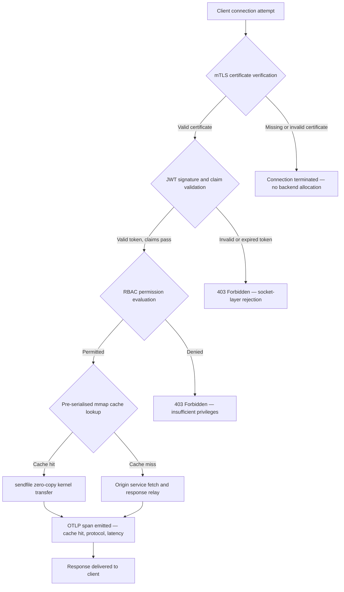

## http-handle: 2026-இல் வங்கிக்கான உயர்-செயல்திறன், பூஜ்ஜிய-சார்பு விளிம்பு இன்கிரஸ்

வங்கி விளிம்புக்கு ஒரு சார்பு பிரச்சினை உள்ளது. ஒரு வாடிக்கையாளருக்கும் மைய வங்கிச் சேவைக்கும் இடையே போக்குவரத்தை வழிநடத்தும் ஒவ்வொரு Nginx அல்லது Envoy நிகழ்வும் ஒரு சார்பு மரத்தைச் சுமக்கிறது: OpenSSL பில்டுகள், Lua தொகுதிகள், gRPC நூலகங்கள், மற்றும் கண்டெய்னர் அடுக்குகள் — ஒவ்வொன்றும் ஒரு சாத்தியமான CVE, ஒவ்வொன்றும் ஒரு தனிப்பட்ட பேட்ச்சிங் சுழற்சி தேவைப்படுகிறது, ஒவ்வொன்றும் SLA அளவீட்டைச் சிக்கலாக்கும் தாமத மாறுபாட்டைச் சேர்க்கிறது. [டிஜிட்டல் இயக்க மீள்திறன் சட்டம் (DORA)](https://eur-lex.europa.eu/eli/reg/2022/2554/oj)-இன் கீழ், அந்தச் சிக்கல் இப்போது ஒரு இயக்கப் பொறுப்பாக இருப்பதைப் போலவே ஒரு ஒழுங்குமுறைப் பொறுப்பாகவும் மாறியுள்ளது.

[http-handle](https://github.com/sebastienrousseau/http-handle) வேறு ஒரு அணுகுமுறையை எடுக்கிறது. இது `libc`-ஐத் தாண்டி பூஜ்ஜிய இயக்க-நேர சார்புகளைக் கொண்ட ஒரே, நிலையாக இணைக்கப்பட்ட Rust பைனரி ஆகும். இது ARM64 கணுக்களில் வினாடிக்கு 180,000 கோரிக்கைகளை வழங்குகிறது, பரஸ்பர TLS மற்றும் JWT அங்கீகாரத்தை நெட்வொர்க் சாக்கெட் அடுக்கில் அமல்படுத்துகிறது, மேலும் HTTP/2 மற்றும் HTTP/3-ஐ தானாகவே பேச்சுவார்த்தை செய்கிறது — இவை அனைத்தும் 20 MB RAM-க்கும் குறைவான வரிசைப்படுத்தல் தடத்திற்குள்.

## விரைவான பதில்

**http-handle என்பது ஒரே வாக்கியத்தில் என்ன?** http-handle என்பது ஒரு திறந்த-மூல, நிலையாக இணைக்கப்பட்ட Rust பைனரி ஆகும். இது வங்கி விளிம்பில் கனமான ப்ராக்ஸி கண்டெய்னர்களை மாற்றுகிறது, Linux `sendfile(2)` பூஜ்ஜிய-நகல் கர்னல் இடமாற்றங்கள் மூலம் ARM64-இல் வினாடிக்கு 180,000 கோரிக்கைகளை வழங்குகிறது, எந்த பின்தள வளமும் தொடப்படுவதற்கு முன்பே சாக்கெட் அடுக்கில் mTLS, JWT, மற்றும் RBAC-ஐ அமல்படுத்துகிறது, மேலும் சொந்த [OpenTelemetry](https://opentelemetry.io/) அளவீடுகளை வெளியிடுகிறது — `libc`-ஐத் தாண்டி பூஜ்ஜிய இயக்க-நேர நூலக சார்புகளுடன்.

## நிர்வாகச் சுருக்கம்

வங்கிகள் ஒரு தசாப்தமாக தங்கள் விளிம்பில் Nginx மற்றும் Envoy-ஐ இயக்கி வருகின்றன. இரண்டும் திறமையானவை; ஆனால் எதுவும் 2026-இன் ஒழுங்குமுறைச் சூழலுக்காக வடிவமைக்கப்படவில்லை. சார்பு-நிறைந்த கண்டெய்னர் படங்கள் இணக்கக் குழுக்களால் போதுமான வேகத்தில் நீக்க முடியாத CVE வரிசைகளை உருவாக்குகின்றன, மேலும் ஒவ்வொரு நூலக பதிப்பு உயர்வும் பின்னடைவு அபாயத்தைச் சுமக்கிறது. DORA பிரிவுகள் 5 மற்றும் 6 ICT அபாயம் கண்டுபிடிப்புக்குப் பிறகு பேட்ச் செய்யப்படுவதைவிட வடிவமைப்பால் நிர்வகிக்கப்பட வேண்டும் என்று கோருகின்றன. Basel III இயக்க அபாய கட்டமைப்புகள் அமைப்புச் சிக்கலுடன் தோல்வி புள்ளிகள் பெருகும் கட்டமைப்புகளை தண்டிக்கின்றன.

http-handle சார்பு பிரச்சினையை மூலத்திலேயே நீக்குகிறது. இந்தப் பைனரி இயக்க நேரத்தில் எந்த வெளிப்புற நூலகத் தேவைகளும் இல்லாமல் ஒருமுறை, நிலையாகத் தொகுக்கப்படுகிறது. தாக்குதல் மேற்பரப்பு Rust தரநிலை நூலகம் மற்றும் `libc`-ஆகச் சுருங்குகிறது. பாதுகாப்பு அமலாக்கம் — mTLS சான்றிதழ் சரிபார்ப்பு, JWT உரிமைகோரல் சரிபார்ப்பு, மற்றும் பங்கு-அடிப்படையிலான அணுகல் கட்டுப்பாடு — எந்த பின்தள ஒதுக்கீட்டிற்கும் முன்பே நெட்வொர்க் சாக்கெட்டில் இயங்குகிறது, பூஜ்ஜிய நம்பிக்கை எல்லையை அதன் மிகச்சிறிய வெளிப்பாட்டிற்குச் சுருக்குகிறது. செயல்திறன் கட்டமைப்பிலிருந்து பின்தொடர்கிறது: முன்-தொடராக்கம் செய்யப்பட்ட நினைவக-வரைபடமாக்கப்பட்ட கேச் தொகுதிகள் `sendfile(2)` கர்னல் இடமாற்றங்களுடன் இணைந்து தரவை CPU-லிருந்து-நினைவகத்திற்கான நகல் பாதையிலிருந்து முழுவதுமாக அகற்றி, ARM64 வன்பொருளில் வினாடிக்கு 180,000 கோரிக்கைகளைத் தாங்குகின்றன. விளைவு என்பது DORA மீள்திறன் தேவைகளை நிறைவேற்றும், Basel III இயக்க அபாயக் குறைப்பு வாதங்களை ஆதரிக்கும், மேலும் SM&CR-இன் கீழ் மூத்த IT தலைவர்களுக்கு விளிம்பு உள்கட்டமைப்புக்கான சரிபார்க்கக்கூடிய, ஒற்றை-கூறு பொறுப்புச் சங்கிலியை வழங்கும் ஒரு இன்கிரஸ் அடுக்கு ஆகும்.

## முக்கிய கருத்துகள்

- **சிறிய பைனரிகள், சிறிய CVE வரிசைகள்.** நிலையாக இணைக்கப்பட்ட ஒற்றை பைனரிக்கு பேட்ச் செய்ய ஒரு தொகுப்பு, சரிபார்க்க ஒரு வெளியீடு, தணிக்கை செய்ய ஒரு கலைப்பொருள் மட்டுமே உள்ளது. நிலையான தொகுதித் தொகுப்புடன் கூடிய Nginx 30-க்கும் மேற்பட்ட பகிரப்பட்ட நூலக சார்புகளுடன் வழங்கப்படுகிறது; ஒவ்வொன்றும் அதன் சொந்த பாதிப்பு வாழ்க்கைச் சுழற்சியைச் சுமக்கிறது.
- **பூஜ்ஜிய-நகல் என்பது ஒரு தேர்வுமுறை அல்ல — அது ஒரு வடிவமைப்புக் கட்டுப்பாடு.** வினாடிக்கு 180,000 கோரிக்கைகளில், எந்தப் பயனர்-இடத் தரவு நகலும் அளவிடக்கூடிய தாம மாறுபாட்டை அறிமுகப்படுத்துகிறது. `sendfile(2)` கோப்பு விவரிப்பான் உள்ளடக்கங்களை முழுவதுமாக கர்னல் இடத்தில் நெட்வொர்க் சாக்கெட்டுக்கு இடமாற்றுகிறது. mmap-பொருத்தப்பட்ட பதில் கேச் தொகுதிகளுடன் இணைந்து, கேச் செய்யப்பட்ட பதில்களுக்கு CPU தரவுப் பாதையைத் தொடுவதே இல்லை.
- **பாதுகாப்பு எல்லை சாக்கெட்டுக்குச் சொந்தமானது.** JWT-கள் மற்றும் mTLS சான்றிதழ்களை பயன்பாட்டு மிடில்வேரில் சரிபார்ப்பது என்றால், கோரிக்கை நிராகரிக்கப்படுவதற்கு முன்பே பின்தளம் ஏற்கனவே த்ரெட்களையும் நினைவகத்தையும் ஒதுக்கியுள்ளது. சாக்கெட்-அடுக்கு சரிபார்ப்பு, அங்கீகரிக்கப்படாத கோரிக்கைகள் எந்த பின்தள வளங்களையும் அறவே பயன்படுத்தாமல் இருப்பதை உறுதிசெய்கிறது.
- **OTLP கண்காணிப்புத்தன்மை இடைவெளியை நீக்குகிறது.** சொந்த OpenTelemetry ஒருங்கிணைப்பு என்றால், ஒவ்வொரு கோரிக்கையும், ஒவ்வொரு அங்கீகார முடிவும், ஒவ்வொரு நெறிமுறை பேச்சுவார்த்தையும் ஒரு சைட்கார் ஏஜென்ட் இல்லாமல் கட்டமைக்கப்பட்ட டெலிமெட்ரியை உருவாக்குகின்றன. ஏற்கனவே உள்ள வங்கி டாஷ்போர்டுகள் OTLP தடங்களை நேரடியாக உட்கொள்கின்றன.

**தொடர்புடைய வாசிப்பு:** [Why YAML Needs a Safer Rust Stack for AI, MCP, and Financial Infrastructure in 2026](https://sebastienrousseau.com/2026-06-18-noyalib-safe-yaml-rust-ai-mcp-financial-infrastructure-2026/), [CloudCDN: An Open-Source Blueprint for the AI-Native Edge in 2026](https://sebastienrousseau.com/2026-06-11-cloudcdn-open-source-blueprint-ai-native-edge-2026/), [Best Cloud Infrastructure Architecture for Banks and Financial Institutions in 2026](https://sebastienrousseau.com/2026-05-16-best-cloud-infrastructure-architecture-2026/).

## 01. வங்கியில் கனமான ப்ராக்ஸி பிரச்சினை

Nginx மற்றும் Envoy நவீன இணையத்தின் விளிம்பைக் கட்டமைத்தன. அவை உள்ளமைக்கக்கூடியவை, போரில் சோதிக்கப்பட்டவை, மேலும் பெரிய சமூகங்களால் ஆதரிக்கப்படுபவை. அவை DORA இருப்பதற்கு முன்பு, Basel III இயக்க அபாய கட்டமைப்புகள் அளவிடக்கூடிய சிக்கல் குறைப்பைக் கோருவதற்கு முன்பு, மேலும் ARM64 கிளவுட் கணுக்கள் உயர்-த்ருபுட் கணக்கீட்டின் பொருளாதாரத்தை மாற்றுவதற்கு முன்பு எடுக்கப்பட்ட கட்டமைப்புத் தேர்வுகளும் ஆகும்.

நடைமுறை விளைவு என்பது வங்கிகளுக்குத் தேவைப்படுவதற்கும் கனமான ப்ராக்ஸி கண்டெய்னர்கள் வழங்குவதற்கும் இடையேயான இடைவெளியாகும்.

**சார்பு மேற்பரப்பு.** ஒரு நிலையான Envoy வரிசைப்படுத்தல் OpenSSL, Abseil, Protobuf, gRPC, Lua, மற்றும் டஜன் கணக்கான இரண்டாம் நிலை நூலகங்களை உள்ளிழுக்கிறது. ஒவ்வொன்றும் ஒரு சுதந்திரமான CVE வாழ்க்கைச் சுழற்சியைச் சுமக்கிறது. தேசிய பாதிப்புத் தரவுத்தளம் ஒரு முக்கியமான OpenSSL ஆலோசனையை வெளியிடும்போது, எஸ்டேட்டில் உள்ள ஒவ்வொரு Envoy நிகழ்வும் ஒரு இணக்கக் கடிகாரமாகிறது: மதிப்பீடு செய், பேட்ச் செய், சோதனை செய், மீண்டும் வரிசைப்படுத்து, மீண்டும் சான்றளி — பைனரி இயங்கும் ஒவ்வொரு சூழலிலும். DORA பிரிவு 6-இன் கீழ், வங்கிகள் ICT அபாய மேலாண்மைச் செயல்முறைகள் விகிதாசாரமானவை, ஆவணப்படுத்தப்பட்டவை, மற்றும் சரிபார்க்கக்கூடியவை என்பதை நிரூபிக்க வேண்டும். பல-நூலக சார்பு மரம் அந்த நிரூபணத்தைப் பராமரிப்பதை விலையுயர்வாக்குகிறது.

**நினைவக மேலெழுத்து.** குறைந்தபட்சமாக உள்ளமைக்கப்பட்ட Nginx பணியாளர் செயல்முறை மிதமான சுமையில் 40–80 MB குடியிருப்பு நினைவகத்தை உட்கொள்கிறது. அளவில் — வர்த்தக அமைப்புகள், கட்டண API-கள், மற்றும் வாடிக்கையாளர்-நோக்கிய போர்ட்டல்களில் நூற்றுக்கணக்கான இன்கிரஸ் கணுக்கள் — அந்த மேலெழுத்து, நன்கு வடிவமைக்கப்பட்ட ஒற்றை-பைனரி மாற்றீட்டைவிட எந்த ஒத்த செயல்திறன் நன்மையும் இல்லாத அளவிடக்கூடிய உள்கட்டமைப்பு செலவாகக் கூடுகிறது.

**பேட்ச்சிங் வேகம்.** கண்டெய்னர்-படம் விநியோகச் சங்கிலிகள் ஒரு CVE வெளியீட்டிற்கும் சரிபார்க்கப்பட்ட பேட்ச் உற்பத்தியை அடைவதற்கும் இடையே பல-நாள் தாமதத்தை அறிமுகப்படுத்துகின்றன. அடிப்படைப் படம் மீண்டும் கட்டமைக்கப்பட வேண்டும், பயன்பாட்டு அடுக்கு மீண்டும் அடுக்கப்பட வேண்டும், முழு சோதனை அணி மீண்டும் இயக்கப்பட வேண்டும், மேலும் வரிசைப்படுத்தல் பைப்லைன் மீண்டும் இயக்கப்பட வேண்டும். DORA சம்பவ அறிக்கை சாளரங்களின் கீழ் இயங்கும் முக்கியமான வங்கி அமைப்புகளுக்கு, இந்தச் சுழற்சி ஒரு அமைப்புசார் அபாயமாகும்.

http-handle இந்த மூன்றையும் நிவர்த்தி செய்கிறது. ஒரு பைனரி. ஒரு CVE மேற்பரப்பு. பேட்ச் செய்ய ஒரு கலைப்பொருள். உற்பத்தி இன்கிரஸ் கணுவுக்கு 20 MB RAM-க்கும் குறைவு.

## 02. http-handle 2026 கட்டமைப்பு நோக்கு

இந்தப் பைனரி ஐந்து ஒன்றுக்கொன்று சார்ந்த அடுக்குகளாகக் கட்டமைக்கப்பட்டுள்ளது, ஒவ்வொன்றும் பாரம்பரிய ப்ராக்ஸி கட்டமைப்புகள் திரட்டும் ஒரு குறிப்பிட்ட வகை அபாயத்தை நீக்க வடிவமைக்கப்பட்டுள்ளது.

### அட்டவணை 1: http-handle கட்டமைப்பு அடுக்குகள் மற்றும் அபாய தணிப்பு

| அடுக்கு | வடிவமைப்பு முடிவு | ஏன் இது முக்கியம் | தவறாகக் கையாண்டால் அபாயம் |
| ---- | ---- | ---- | ---- |
| **சர்வர் மையம்** | ஒற்றை Rust பைனரி, நிலையாக இணைக்கப்பட்டது, `libc`-ஐத் தாண்டி பூஜ்ஜிய சார்புகள் | பேட்ச் செய்ய ஒரு கலைப்பொருள்; எஸ்டேட் முழுவதும் நூலக CVE பரவலை நீக்குகிறது | சார்பு குழப்பத் தாக்குதல்கள்; நூலக பாதிப்பு திரட்சி |
| **முடுக்க இயந்திரம்** | முன்-தொடராக்கம் செய்யப்பட்ட mmap கேச் தொகுதிகள் மற்றும் `sendfile(2)` பூஜ்ஜிய-நகல் கர்னல் இடமாற்றங்கள் | ARM64-இல் துணை-மில்லிவினாடி ப்ராக்ஸி மேலெழுத்துடன் வினாடிக்கு 180,000 கோரிக்கைகள்; கேச் செய்யப்பட்ட பதில்களுக்கு எந்தத் தரவும் பயனர் இடத்தில் நுழையாது | நினைவக-வரைபடமாக்கல் கசிவுகள்; கேச் செல்லுபடியாக்கத்தின் கீழ் கர்னல்-இடத் தடைப்புகள் |
| **கிரிப்டோகிராஃபிக் பாதுகாப்பு** | ஹாட்-ரீலோட் சான்றிதழ் ஆதரவு மற்றும் ALPN பேச்சுவார்த்தையுடன் கூடிய சொந்த mTLS | தரவு ஒருமைப்பாடு மற்றும் நெறிமுறை இணக்கத்ததை உறுதிசெய்கிறது; இணைப்பு துண்டிப்புகள் இல்லாமல் சான்றிதழ் சுழற்சி | சான்றிதழ் காலாவதி சேவை முடக்கங்களை ஏற்படுத்துதல்; பலவீனமான சைஃபர் தொகுப்பு இயல்புநிலைகள் |
| **அணுகல் கொள்கை தளம்** | சாக்கெட்-அடுக்கு JWT சரிபார்ப்பு மற்றும் RBAC உரிமைகோரல் மதிப்பீடு | அங்கீகரிக்கப்படாத கோரிக்கைகள் எந்த பின்தள வளங்களையும் உட்கொள்ளாது; கர்னல் எல்லையில் பூஜ்ஜிய நம்பிக்கை அமல்படுத்தப்படுகிறது | JWT அல்காரிதம் குழப்பத் தாக்குதல்கள்; அதிக-சிறப்புரிமை அணுகலை வழங்கும் RBAC தவறான உள்ளமைவு |
| **கண்காணிப்புத்தன்மை** | சொந்த [OpenTelemetry (OTLP)](https://opentelemetry.io/docs/specs/otlp/) ஒருங்கிணைப்பு | சைட்கார் ஏஜென்ட்கள் இல்லாமல் கட்டமைக்கப்பட்ட டெலிமெட்ரி; ஏற்கனவே உள்ள வங்கி கண்காணிப்பு எஸ்டேட்களில் நேரடி உட்கொள்ளல் | முடக்கங்களின் போது குருட்டுப் புள்ளிகள்; DORA சம்பவ அறிக்கைக்கு முழுமையற்ற தணிக்கைச் சுவடுகள் |

## 03. முக்கிய செயல்திறன் மற்றும் பாதுகாப்பு சமிக்ஞைகள்

விளிம்பில் http-handle-ஐ இயக்கும் வங்கிகள் DORA இயக்க அறிக்கைத் தேவைகளையும் உள் SLA ஆளுகையையும் நிறைவேற்ற ஐந்து அளவிடக்கூடிய சமிக்ஞைகளைக் கருவிப்படுத்த வேண்டும்.

### அட்டவணை 2: இயக்க அளவுகோல்கள் மற்றும் ஒழுங்குமுறை குறிப்புகள்

| சமிக்ஞை | அளவுகோல் | ஒழுங்குமுறை குறிப்பு | தொழில்நுட்ப அமலாக்கம் |
| ---- | ---- | ---- | ---- |
| **த்ருபுட்** | ARM64 கணுக்களில் P99 ≤ 1 ms ப்ராக்ஸி மேலெழுத்தில் வினாடிக்கு ≥ 180,000 கோரிக்கைகள் | Basel III இயக்க அபாயம் — அமைப்புச் சிக்கல் குறைப்பு | `sendfile(2)` + mmap முன்-தொடராக்கம் செய்யப்பட்ட கேச் தொகுதிகள்; கேச் ஹிட்களுக்கு பயனர்-இட தரவு நகல் இல்லை |
| **தாக்குதல் மேற்பரப்பு** | பூஜ்ஜிய இயக்க-நேர நூலக சார்புகள்; வெளியீடு ஒன்றுக்கு ஒரு பைனரி கலைப்பொருள் | [DORA பிரிவு 6](https://eur-lex.europa.eu/eli/reg/2022/2554/oj) — வடிவமைப்பால் ICT அபாய மேலாண்மை | `cargo build --release --target aarch64-unknown-linux-musl` உடன் நிலைத் தொகுப்பு |
| **அங்கீகார தாமதம்** | பின்தள பதிலின் முதல் பைட்டுக்கு முன் mTLS கைகுலுக்கல் + JWT சரிபார்ப்பு முடிவடைதல் | [DORA பிரிவு 5](https://eur-lex.europa.eu/eli/reg/2022/2554/oj) — ICT பாதுகாப்புப் பாதுகாத்தல் | சாக்கெட்-அடுக்கு இடைமறித்தல்; பின்தள வழிநடத்தலுக்கு முன் கர்னல்-அருகிலான Rust-இல் JWT உரிமைகோரல் மதிப்பீடு |
| **சான்றிதழ் கிடைக்கும் தன்மை** | சுழற்சியின் போது பூஜ்ஜிய துண்டிக்கப்பட்ட இணைப்புகளுடன் mTLS சான்றிதழ்களின் ஹாட்-ரீலோட் | விளிம்பு கிடைக்கும் தன்மைக்கான SM&CR மூத்த மேலாண்மை பொறுப்பு | inotify-இயக்கப்படும் சான்றிதழ் கண்காணிப்பான்; மீள்ஏற்றத்தின் போது அணு கோப்பு-விவரிப்பான் இடமாற்றம் |
| **கண்காணிப்புத்தன்மை கவரேஜ்** | அங்கீகார விளைவு, நெறிமுறை பதிப்பு, மற்றும் கேச் நிலையுடன் OTLP ஸ்பேன்களை உருவாக்கும் 100% கோரிக்கைகள் | DORA பிரிவு 17 — சம்பவம் கண்டறிதல் மற்றும் அறிக்கை | சொந்த OTLP ஏற்றுமதியாளர்; சைட்கார் தேவையில்லை; gRPC அல்லது HTTP/Protobuf போக்குவரத்து உள்ளமைக்கக்கூடியது |

## 04. பூஜ்ஜிய-நகல் இயந்திரம்: mmap மற்றும் sendfile(2)

உயர்-அதிர்வெண் வங்கியில் நெட்வொர்க் செயல்திறன் — நிகழ்நேரக் கட்டணங்கள், சந்தை-தரவு API-கள், அங்கீகார டோக்கன் சேவைகள் — வேறு எந்தவற்றையும்விட ஒரு கட்டுப்பாட்டால் வரம்பிடப்படுகிறது: சேமிப்பகத்திலிருந்து நெட்வொர்க் சாக்கெட்டுக்கு பைட்களை நகர்த்துவதற்கான செலவு.

வழக்கமான HTTP சர்வர்கள் கோப்பு உள்ளடக்கங்களை ஒரு பயனர்-இடத் தாங்ககத்தில் படித்து, பின்னர் அந்தத் தாங்ககத்தை சாக்கெட்டில் எழுதுகின்றன. அந்த வரிசைக்கு ஒவ்வொரு பதிலுக்கும் இரண்டு நினைவக நகல்களும், பயனர் இடத்திற்கும் கர்னல் இடத்திற்கும் இடையே இரண்டு சூழல் மாற்றங்களும் தேவைப்படுகின்றன. வினாடிக்கு 180,000 கோரிக்கைகளில், திரட்டப்பட்ட மேலெழுத்து கணிசமானது.

http-handle இரண்டு நகல்களையும் நீக்குகிறது.

**நினைவக-வரைபடமாக்கப்பட்ட கேச் தொகுதிகள்.** சேவை தொடங்கும்போது, அது `mmap(2)`-ஐப் பயன்படுத்தி நிலையான பதில் உள்ளடக்கத்தை நினைவக-வரைபடமாக்கப்பட்ட பகுதிகளாகத் தொடராக்கம் செய்கிறது. இந்தப் பகுதிகள் கர்னலின் பக்க கேச்சில் பொருத்தப்பட்டுள்ளன. கேச் செய்யப்பட்ட வளத்திற்கான கோரிக்கை வரும்போது, பதில் ஏற்கனவே கர்னல் நினைவகத்தில் வரைபடமாக்கப்பட்டுள்ளது — வட்டு வாசிப்பு இல்லை, தாங்ககம் ஒதுக்கீடு இல்லை.

**`sendfile(2)` கர்னல் இடமாற்றம்.** Linux `sendfile(2)` கணினி அழைப்பு தரவை ஒரு கோப்பு விவரிப்பானிலிருந்து — அல்லது ஒரு நினைவக-வரைபடமாக்கப்பட்ட பகுதியிலிருந்து — நெட்வொர்க் சாக்கெட் கோப்பு விவரிப்பானுக்கு, முழுவதுமாக கர்னலுக்குள் இடமாற்றுகிறது. எந்த பைட்டும் பயனர் இடத்தில் நுழையாது. CPU-இன் பங்கு கணினி அழைப்பை வெளியிடுவதற்கும் நிறைவு நிகழ்வைக் கையாள்வதற்குமாகக் குறைகிறது. இந்தக் கட்டமைப்புடன் கூடிய ARM64 கணுக்களில், http-handle நிலையான சுமையின் கீழ் துணை-மில்லிவினாடி ப்ராக்ஸி மேலெழுத்தில் வினாடிக்கு 180,000 கோரிக்கைகளைத் தாங்குகிறது.

மாத-இறுதி தொகுதி சரிசெய்தல், நாள்-உள் திரவத்தன்மை அறிக்கை, அல்லது நிகழ்நேர மோசடி-மதிப்பீட்டு API போக்குவரத்தை இயக்கும் வங்கிகளுக்கு, பொறியியல் விளைவு நேரடியானது: போக்குவரத்து அடுக்குக்கு குறைவான ARM64 கணுக்கள், குறைந்த உள்கட்டமைப்பு செலவு, மேலும் கொள்ளளவு பற்றாக்குறையிலிருந்து சிறிய DORA மீள்திறன் அபாயம்.

## 05. mTLS மற்றும் JWT அணுகல் கொள்கை தளம்

வங்கியில், விளிம்பில் அங்கீகாரம் என்பது ஒரு அம்சம் அல்ல — அது ஒரு ஒழுங்குமுறைத் தேவை. ICT பாதுகாப்புக் கட்டுப்பாடுகள் விகிதாசாரமானவை, ஆவணப்படுத்தப்பட்டவை, மற்றும் சரிபார்க்கக்கூடியவையாக இருக்க வேண்டும் என்று DORA கட்டளையிடுகிறது. SM&CR உள்கட்டமைப்பு பாதுகாப்பு முடிவுகளுக்கான தனிப்பட்ட பொறுப்பை பெயரிடப்பட்ட மூத்த மேலாளர்களின் மீது வைக்கிறது. கேள்வி விளிம்பில் அங்கீகரிப்பதா என்பது அல்ல, எந்த அடுக்கில் என்பது.

http-handle எந்த பின்தள வளமும் ஒதுக்கப்படுவதற்கு முன் ஒரு மூன்று-நிலை பூஜ்ஜிய நம்பிக்கை கொள்கையை அமல்படுத்துகிறது.

**நிலை 1: mTLS கிளையன்ட் சான்றிதழ் சரிபார்ப்பு.** TLS கைகுலுக்கலின் போது, http-handle ஒரு உள்ளமைக்கக்கூடிய நம்பிக்கை ஸ்டோருக்கு எதிராக கிளையன்ட் சான்றிதழைக் கோரி சரிபார்க்கிறது. செல்லுபடியாகும் சான்றிதழ் இல்லாத இணைப்புகள் கைகுலுக்கலில் முடிவடைகின்றன. எந்த பயன்பாட்டு த்ரெட்டும் உருவாக்கப்படுவதில்லை, எந்த நினைவகக் குளமும் ஒதுக்கப்படுவதில்லை. பின்தளம் கோரிக்கையைப் பார்ப்பதே இல்லை.

**நிலை 2: JWT உரிமைகோரல் சரிபார்ப்பு.** mTLS-ஐக் கடக்கும் இணைப்புகளுக்கு, http-handle `Authorization` தலைப்பிலிருந்து JSON Web Token-ஐ சாக்கெட் அடுக்கில் பிரித்தெடுத்து சரிபார்க்கிறது. கையொப்ப சரிபார்ப்பு, காலாவதிச் சோதனைகள், மற்றும் வழங்குநர் சரிபார்ப்பு ஆகியவை கோரிக்கை வழிநடத்தல் அடுக்கை அடைவதற்கு முன் நிகழ்கின்றன. அல்காரிதம் குழப்பத் தாக்குதல்கள் — ஒரு சர்வர் ஒரு சமச்சீர் அல்காரிதத்தை ஒரு அசமச்சீர் விசை எதிர்பார்க்கப்படும்போது ஏற்றுக்கொள்ளும் இடத்தில் — உள்ளமைவில் வெளிப்படையான அல்காரிதம் அனுமதிப்பட்டியலிடல் மூலம் தடுக்கப்படுகின்றன.

**நிலை 3: RBAC உரிமைகோரல் மதிப்பீடு.** சரிபார்க்கப்பட்ட JWT உரிமைகோரல்கள் ஒரு நினைவக-உள் பங்கு அட்டவணைக்கு வரைபடமாக்கப்படுகின்றன. போதிய அனுமதிகள் இல்லாத கோரிக்கைகள் அணுகல் கொள்கை தளத்தில் 403 பதிலைப் பெறுகின்றன. அங்கீகரிக்கப்படாத போக்குவரத்துக்கு பின்தள சேவை ஒருபோதும் அழைக்கப்படுவதில்லை.

இந்த வரிசைப்படுத்தல் இயக்க ரீதியாக முக்கியமானது. பாரம்பரிய மாதிரியின் கீழ் — அங்கீகாரம் பயன்பாட்டு மிடில்வேரில் இயங்கும் இடத்தில் — ஒரு தாக்குபவர் ஒரே நிராகரிப்பு வெளியிடப்படுவதற்கு முன் அங்கீகரிக்கப்படாத கோரிக்கைகளால் பின்தள த்ரெட் குளங்களை வெறுமையாக்க முடியும். சாக்கெட்-அடுக்கு அங்கீகாரம் அந்தத் தாக்குதல் திசையை முழுவதுமாகச் சுருக்குகிறது.

## 06. ALPN வழிநடத்தல் மற்றும் HTTP/3 மீட்பு சங்கிலி

வங்கிப் போக்குவரத்து பல்வேறு நெட்வொர்க் நிலைமைகளில் வருகிறது: வர்த்தக மேசைகளுக்கான கார்ப்பரேட் ஃபைபர், மொபைல் வங்கிக் கிளையன்ட்களுக்கான 5G, தொலைநிலை செயல்பாடுகளுக்கான செயற்கைக்கோள் இணைப்பு, மற்றும் ஒழுங்குபடுத்தப்பட்ட சூழல்களில் TLS ஆய்வு ப்ராக்ஸிகள். ஒற்றை-நெறிமுறை இன்கிரஸ் ஒரு குறைந்தபட்ச-பொது-வகுத்தி கட்டுப்பாட்டை உருவாக்குகிறது.

http-handle ஒவ்வொரு இணைப்புக்கும் உகந்த நெறிமுறையை தானாகவே தேர்ந்தெடுக்க [பயன்பாட்டு-அடுக்கு நெறிமுறை பேச்சுவார்த்தை (ALPN)](https://www.rfc-editor.org/rfc/rfc7301)-ஐப் பயன்படுத்துகிறது.

**HTTP/2** என்பது TCP மீதான உலாவி மற்றும் API போக்குவரத்துக்கான இயல்புநிலை. ஒரே இணைப்பின் மீது பல்பிரிவு ஸ்ட்ரீம்கள் HTTP/1.1 ஒரே நேர கோரிக்கை வடிவங்களின் கீழ் அறிமுகப்படுத்தும் தலை-வரிசை-தடுப்பை நீக்குகின்றன.

**HTTP/3 (QUIC)** நெட்வொர்க் UDP-ஐ ஆதரிக்கும்போதும் கிளையன்ட் அதன் ALPN நீட்டிப்பில் `h3`-ஐ விளம்பரப்படுத்தும்போதும் செயல்படுத்தப்படுகிறது. QUIC-இன் சுதந்திரமான ஸ்ட்ரீம் பல்பிரிவும் இணைப்பு இடம்பெயர்வும் TCP இணைப்புகள் அடிக்கடி துண்டிக்கப்பட்டு மீண்டும் இணைக்கப்படும் நெரிசலான செல்லுலார் நெட்வொர்க்குகளில் உள்ள மொபைல் வங்கிக் கிளையன்ட்களுக்கு அதைக் கணிசமாகச் சிறந்ததாக்குகின்றன.

**மென்மையான மீட்பு.** ALPN பேச்சுவார்த்தை தோல்வியடைந்தால் — ஒரு இடைநிலை ப்ராக்ஸி நீட்டிப்பை அகற்றுவதால் அல்லது ஒரு பழைய கிளையன்ட் அதைத் தவிர்ப்பதால் — http-handle அனைத்து பாதுகாப்பு தலைப்புகள், mTLS அமலாக்கம், மற்றும் JWT சரிபார்ப்பைப் பராமரித்தபடி HTTP/1.1-க்கு மீளும். நெறிமுறை மீட்பின் போது எந்த பாதுகாப்புப் பண்பும் சிதைவதில்லை.

## 07. பூஜ்ஜிய-நகல் கோரிக்கை வாழ்க்கைச் சுழற்சி

பின்வரும் வரைபடம் கிளையன்ட் இணைப்பிலிருந்து பதில் வழங்கல் வரையிலான முழுமையான கோரிக்கைப் பாதையைக் காட்டுகிறது, அங்கீகார வாயில்கள் மற்றும் கண்காணிப்புத்தன்மை வெளியீட்டுப் புள்ளிகள் உட்பட.

கேச்-ஹிட் பதில்களுக்கான முக்கியப் பாதை மூன்று பாதுகாப்பு வாயில்களையும் ஒரு கணினி அழைப்பையும் கடக்கிறது. பதில் உடலுக்கு எந்த பயனர்-இடத் தாங்ககமும் ஒதுக்கப்படுவதில்லை. OTLP ஸ்பேன் அங்கீகார விளைவு, ALPN-பேச்சுவார்த்தை செய்யப்பட்ட நெறிமுறை பதிப்பு, கேச் நிலை, மற்றும் இறுதி-முதல்-இறுதி தாமதத்தை ஒரே கட்டமைக்கப்பட்ட பதிவில் கைப்பற்றுகிறது.

## 08. ஒழுங்குமுறை இணைவு: DORA, Basel III, மற்றும் SM&CR

### DORA பிரிவுகள் 5 மற்றும் 6 — ICT அபாய மேலாண்மை மற்றும் பாதுகாப்பு

[DORA பிரிவு 5](https://eur-lex.europa.eu/eli/reg/2022/2554/oj) நிதி நிறுவனங்கள் ICT அபாய மேலாண்மை கட்டமைப்புகளைப் பராமரிக்க வேண்டும் என்று கோருகிறது. பிரிவு 6 அவற்றின் ICT அமைப்புகளின் அபாய விவரக்குறிப்புக்கு விகிதாசாரமான பாதுகாப்பு மற்றும் தடுப்பு நடவடிக்கைகளை அமல்படுத்த வேண்டும் என்று கோருகிறது.

நிலையாக இணைக்கப்பட்ட ஒற்றை பைனரி இந்த இரண்டு தேவைகளையும் ஒரு பல-நூலக கண்டெய்னர் ஸ்டேக்கைவிட திறமையாக நிறைவேற்றுகிறது. தாக்குதல் மேற்பரப்பு அளவிடக்கூடியது — ஒரு கலைப்பொருள், ஒரு சார்பு (`libc`), ஒரு CVE மேற்பரப்பு — மேலும் பாதுகாப்பு நடவடிக்கைகள் நடைமுறை ரீதியானதைவிட அமைப்புசார்ந்தவை: mTLS மற்றும் JWT அமலாக்கத்தை தவறான உள்ளமைவால் புறக்கணிக்க முடியாது, ஏனெனில் அவை எந்த உள்ளமைக்கக்கூடிய பயன்பாட்டு தர்க்கமும் இயங்குவதற்கு முன் சாக்கெட் அடுக்கில் செயல்படுகின்றன.

### Basel III — இயக்க அபாய மூலதனத் தேவைகள்

[Basel III-இன் இயக்க அபாய கட்டமைப்பு](https://www.bis.org/bcbs/basel3.htm) ஒழுங்குமுறை மூலதனத் தேவைகளை நிரூபிக்கக்கூடிய அபாயக் குறைப்புடன் இணைக்கிறது. அமைப்புச் சிக்கல் மற்றும் ICT தோல்வி-புள்ளி எண்ணிக்கையில் அளவிடக்கூடிய குறைப்பை ஆவணப்படுத்தக்கூடிய வங்கிகளுக்கு குறைக்கப்பட்ட இயக்க அபாய மூலதன ஒதுக்கீட்டுக்கான அளவிடக்கூடிய வாதம் உள்ளது. ஒரு பல-கண்டெய்னர் ப்ராக்ஸி எஸ்டேட்டை ஒற்றை-பைனரி இன்கிரஸ் கணுக்களால் மாற்றுவது இந்த வாதத்தை ஆதரிக்கும் வகையான சிக்கல் குறைப்பே ஆகும் — பொறியியல் குழு சான்று ஆவணங்களை உருவாக்க முடிந்தால்.

http-handle-இன் தணிக்கை செய்யக்கூடிய வெளியீட்டு கலைப்பொருட்கள் — மீளுருவாக்கக்கூடிய பில்டுகள், SBOM-இணக்கமான சார்பு விவரக்குறிப்புகள், மற்றும் OTLP-அடிப்படையிலான இயக்கப் பதிவுகள் — Basel III மூலதன விவாதங்களுக்குத் தேவைப்படும் ஆவணச் சங்கிலியை ஆதரிக்கின்றன.

### SM&CR — மூத்த மேலாளர் பொறுப்பு

[மூத்த மேலாளர்கள் மற்றும் சான்றிதழ் ஆட்சி (SM&CR)](https://www.fca.org.uk/firms/senior-managers-certification-regime) அவர்களின் பொறுப்பின் கீழ் உள்ள அமைப்புகளின் ICT பாதுகாப்பு நிலைப்பாட்டுக்கு பெயரிடப்பட்ட மூத்த மேலாளர்களின் மீது தனிப்பட்ட பொறுப்பை வைக்கிறது. சேவை இடையூறு இல்லாமல் சான்றிதழ்களை ஹாட்-ரீலோட் செய்யும், OTLP வழியாக கட்டமைக்கப்பட்ட தணிக்கைப் பதிவுகளை உருவாக்கும், மேலும் வரிசைப்படுத்தல் ஒன்றுக்கு ஒரு பதிப்பு-பொருத்தப்பட்ட கலைப்பொருளைக் கொண்ட ஒற்றை-பைனரி இன்கிரஸ், பெயரிடப்பட்ட மூத்த மேலாளருக்கு ஒரு சரிபார்க்கக்கூடிய, ஆவணப்படுத்தக்கூடிய பாதுகாப்புச் சங்கிலியை வழங்குகிறது. ஒரு பல-நூலக கண்டெய்னர் ஸ்டேக் அதைச் செய்யாது.

## 09. இது பங்கின்படி என்ன அர்த்தம்

### இயக்குநர்கள் குழு மற்றும் தலைமை நிர்வாகிகள்

Basel III இயக்க அபாய கட்டமைப்புகளின் கீழ் ஒழுங்குமுறை மூலதன தேர்வுமுறை நிரூபிக்கக்கூடிய சிக்கல் குறைப்பைச் சார்ந்துள்ளது. Nginx அல்லது Envoy-ஐ ஒரு ஒற்றை நிலையாக இணைக்கப்பட்ட பைனரியால் மாற்றுவது தணிக்கை செய்யக்கூடிய மற்றும் விவேக ஒழுங்குமுறையாளர்களுக்கு வழங்கக்கூடிய வகையில் ICT தோல்வி-புள்ளி எண்ணிக்கையைக் குறைக்கிறது. குறைக்கப்பட்ட CVE மேற்பரப்பு சைபர்-காப்பீட்டு பிரீமிய மறுபேச்சுவார்த்தையையும் ஆதரிக்கிறது — காப்பீட்டாளர்கள் நிரூபிக்கக்கூடிய தாக்குதல்-மேற்பரப்பு அளவீடுகளின் அடிப்படையில் விலை நிர்ணயிக்கின்றனர், மேலும் ஒற்றை-சார்பு இன்கிரஸ் பைனரி ஒரு உறுதியான தரவுப் புள்ளி.

### தலைமை தகவல் பாதுகாப்பு அதிகாரிகள் மற்றும் தலைமை அபாய அதிகாரிகள்

DORA இணக்கத்திற்கு ICT பாதுகாப்பு நடவடிக்கைகள் விகிதாசாரமாகவும் சரிபார்க்கக்கூடியதாகவும் இருக்க வேண்டும். சாக்கெட்-அடுக்கு mTLS மற்றும் JWT அமலாக்கம் விளிம்பில் ஒரு சரிபார்க்கக்கூடிய, புறக்கணிக்க முடியாத அங்கீகார வாயிலை வழங்குகிறது. ஹாட்-ரீலோட் சான்றிதழ் சுழற்சி பாரம்பரிய சான்றிதழ் புதுப்பிப்புகள் சுமக்கும் சேவை-சாளர அபாயத்தை நீக்குகிறது. பூஜ்ஜிய-சார்பு தொகுப்பு மாதிரி என்றால், ஒரு முக்கியமான `libc` ஆலோசனை வெளியிடப்படும்போது, முழு எஸ்டேட்டையும் ஒரே Rust மூல கலைப்பொருளிலிருந்து நாட்களுக்குப் பதிலாக மணிநேரங்களில் மீண்டும் கட்டமைக்கலாம், சோதிக்கலாம், மற்றும் மீண்டும் வரிசைப்படுத்தலாம்.

### பொறியியல் மற்றும் IT மேலாண்மை

ஒரு நிலையான ARM64 கணுவில் வினாடிக்கு 180,000 கோரிக்கைகள் கட்டண API-கள் மற்றும் அங்கீகார சேவைகளுக்கான உள்கட்டமைப்பு-அளவிடல் உரையாடலை மாற்றுகிறது. சொந்த OTLP ஒருங்கிணைப்பு Prometheus ஏற்றுமதியாளர்கள், சைட்கார் ஏஜென்ட்கள், அல்லது தனிப்பயன் பதிவு அனுப்பிகளின் தேவையை நீக்குகிறது. Kubernetes வரிசைப்படுத்தல் மாதிரி ஒரு நிலையான போட் — 20 MB RAM-க்கும் குறைவு, சிறப்புரிமை பெற்ற கண்டெய்னர் அனுமதிகள் இல்லை, ஹோஸ்ட்-நெட்வொர்க் அணுகல் இல்லை. சான்றிதழ் ஹாட்-ரீலோட் Kubernetes ரோலிங்-மறுதொடக்க மேலெழுத்து இல்லாமல் செயல்படுகிறது.

## அடிக்கடி கேட்கப்படும் கேள்விகள்

**சுமையின் கீழ் சான்றிதழ் சுழற்சியை http-handle எப்படிக் கையாளுகிறது?**
இந்தப் பைனரி ஒரு inotify கண்காணிப்பானைப் பயன்படுத்தி சான்றிதழ் கோப்புப் பாதைகளைக் கண்காணிக்கிறது. புதிய சான்றிதழ் மற்றும் விசைக் கோப்புகள் கண்டறியப்படும்போது, அது செயலில் உள்ள TLS சூழலின் ஒரு அணு இடமாற்றத்தைச் செய்கிறது — ஏற்கனவே உள்ள இணைப்புகள் முந்தைய சான்றிதழைப் பயன்படுத்தி முடிவடைகின்றன, புதிய இணைப்புகள் உடனடியாக சுழற்றப்பட்டதைப் பயன்படுத்துகின்றன. எந்த இணைப்பும் துண்டிக்கப்படுவதில்லை. எந்த சேவை சாளரமும் தேவையில்லை.

**http-handle ஒரு Kubernetes கிளஸ்டருக்குள் ஒரு இன்கிரஸ் கன்ட்ரோலராக இயங்க முடியுமா?**
ஆம். இந்தப் பைனரி ஒரு நிலையான இன்கிரஸ் சேவை சிறுகுறிப்புடன் ஒரு தனித்தனி போட்டாக இயங்குகிறது. வளத் தேவைகள் முழு த்ருபுட்டில் 20 MB RAM-க்கும் குறைவு, சிறப்புரிமை பெற்ற கண்டெய்னர் அனுமதிகள் இல்லை, மற்றும் ஹோஸ்ட்-நெட்வொர்க் அணுகல் தேவையில்லை. mTLS அமலாக்கம் மையப்படுத்தப்பட்ட நுழைவாயில் அங்கீகாரத்தைவிட சைட்கார் அடுக்கில் விரும்பப்படும் சேவை மெஷ்களில் இது ஒரு சைட்காராகவும் இயங்க முடியும்.

**ப்ராக்ஸியின் அளவிடக்கூடிய தாமத பங்களிப்பு என்ன?**
கேச்-ஹிட் பதில்களுக்கு, ப்ராக்ஸி மேலெழுத்து — சாக்கெட் ஏற்பிலிருந்து `sendfile(2)` நிறைவு வரை — ARM64 வன்பொருளில் துணை-மில்லிவினாடி. மேலோட்ட பெறுதல் தேவைப்படும் கேச்-மிஸ் பதில்களுக்கு, மேலெழுத்து அதே துணை-மில்லிவினாடி எண்ணிக்கை மற்றும் மூலப் பதில் நேரம் ஆகியவற்றின் கூட்டு. அங்கீகாரம் ஒறுதிச் சரிபார்ப்பு முடிவடைவதற்கு முன் எந்த த்ரெட்-குள ஒதுக்கீடும் இல்லாமல் சாக்கெட் அடுக்கில் ஒத்திசைவாக நிகழ்வதால், ப்ராக்ஸியே வரிசை தாமதத்தைச் சேர்ப்பதில்லை.

**ஏற்கனவே உள்ள API நுழைவாயிலுடன் ஒரு பூஜ்ஜிய நம்பிக்கை கட்டமைப்பில் http-handle எப்படிப் பொருந்துகிறது?**
http-handle OSI அடுக்கு 4/7 எல்லையில் செயல்படுகிறது: அது போக்குவரத்து-அடுக்கு mTLS-ஐ அமல்படுத்தி, மேலோட்ட சேவைகளுக்கு வழிநடத்துவதற்கு முன் பயன்பாட்டு-அடுக்கு JWT-களைச் சரிபார்க்கிறது. இது ஒரு முழு API நுழைவாயிலின் முன் அமரலாம் — நுழைவாயிலின் விலையுயர்ந்த செயலாக்க அடுக்கை அடைவதற்கு முன் அங்கீகரிக்கப்படாத போக்குவரத்தை உள்வாங்கலாம் — அல்லது அணுகல் கொள்கை முழுவதுமாக JWT உரிமைகோரல்களில் வெளிப்படுத்தக்கூடிய சேவைகளுக்கு நுழைவாயிலை முழுவதுமாக மாற்றலாம்.

**விநியோகச்-சங்கிலி தணிக்கை நோக்கங்களுக்காக பைனரி வெளியீடு மீளுருவாக்கக்கூடியதா?**
ஆம். ஒரு பொருத்தப்பட்ட Rust டூல்செயின் பதிப்பு மற்றும் பூட்டப்பட்ட `Cargo.lock` உடன் பில்ட் மீளுருவாக்கக்கூடியது. `cargo cyclonedx` வழியாக SBOM உருவாக்கம் ஒவ்வொரு வெளியீட்டிற்கும் ஒரு CycloneDX-இணக்கமான பொருட்கள் பட்டியலை உருவாக்குகிறது. இரண்டு கலைப்பொருட்களும் வங்கியின் உள் மென்பொருள் அமைப்பு பகுப்பாய்வு டூல்செயினுக்கு வெளியிடக்கூடியவை மற்றும் DORA விநியோகச்-சங்கிலி அபாய ஆவணத் தேவைகளை நிறைவேற்றுகின்றன.

## முடிவுரை

வங்கி விளிம்புக்கு அதிக அம்சங்கள் தேவையில்லை — அதற்கு குறைவான கூறுகள் தேவை, ஒவ்வொன்றும் குறைவாகச் செய்து அதை சரிபார்க்கக்கூடிய வகையில் செய்கின்றன. http-handle இன்கிரஸ் அடுக்கை அதன் குறைக்க முடியாத குறைந்தபட்சத்திற்குக் குறைக்கிறது: சாக்கெட்டில் அங்கீகாரத்தை அமல்படுத்தும், தரவை நகலெடுக்காமல் இடமாற்றும், மேலும் அது செய்யும் அனைத்தையும் கட்டமைக்கப்பட்ட டெலிமெட்ரியில் அறிக்கை செய்யும் ஒரே Rust பைனரி. DORA இணக்க அட்டவணைகள், Basel III மூலதன தேர்வுமுறை மதிப்பாய்வுகள், மற்றும் SM&CR பொறுப்புத் தேவைகளை வழிநடத்தும் வங்கிகளுக்கு, அந்த எளிமை ஒரு பொறியியல் விருப்பம் அல்ல — அது ஒரு ஒழுங்குமுறை வாதம்.

[http-handle மூலக் குறியீடு](https://github.com/sebastienrousseau/http-handle) MIT மற்றும் Apache 2.0 இரட்டை உரிமத்தின் கீழ் கிடைக்கிறது.

---

*மேற்கோள்கள்*

Basel Committee on Banking Supervision (2011). *Basel III: A global regulatory framework for more resilient banks and banking systems*. Bank for International Settlements. கிடைக்குமிடம்: [https://www.bis.org/publ/bcbs189.htm](https://www.bis.org/publ/bcbs189.htm)

European Parliament and Council (2022). Regulation (EU) 2022/2554 on digital operational resilience for the financial sector (DORA). கிடைக்குமிடம்: [https://eur-lex.europa.eu/legal-content/EN/TXT/?uri=CELEX:32022R2554](https://eur-lex.europa.eu/legal-content/EN/TXT/?uri=CELEX:32022R2554)

Financial Conduct Authority (2015). *Senior Managers and Certification Regime (SM&CR)*. கிடைக்குமிடம்: [https://www.fca.org.uk/firms/senior-managers-certification-regime](https://www.fca.org.uk/firms/senior-managers-certification-regime)

Internet Engineering Task Force (2014). *RFC 7301: Transport Layer Security (TLS) Application-Layer Protocol Negotiation Extension*. கிடைக்குமிடம்: [https://www.rfc-editor.org/rfc/rfc7301](https://www.rfc-editor.org/rfc/rfc7301)

OpenTelemetry Authors (2024). *OpenTelemetry Protocol Specification (OTLP)*. கிடைக்குமிடம்: [https://opentelemetry.io/docs/specs/otlp/](https://opentelemetry.io/docs/specs/otlp/)
