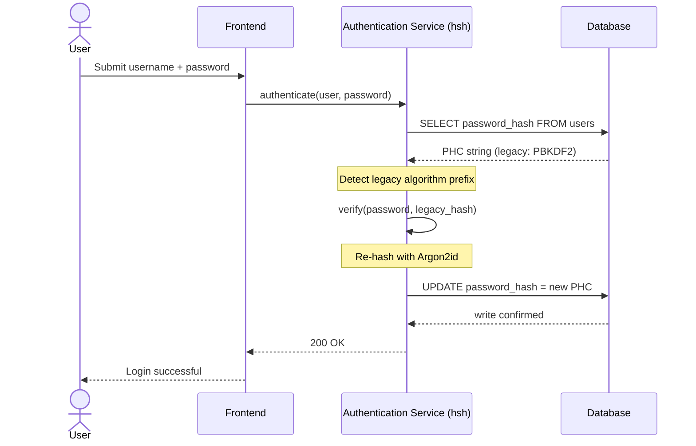
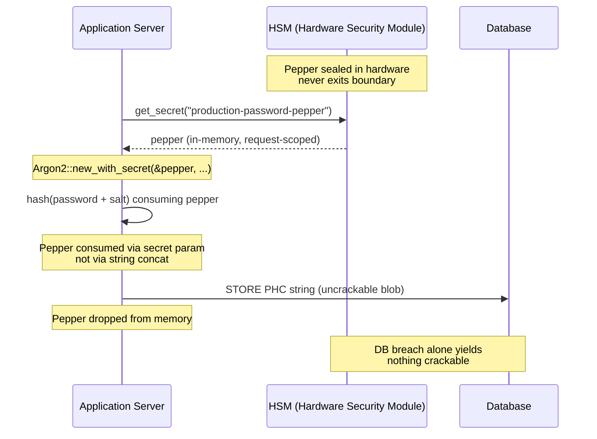

## நிறுவன வங்கியில் கடவுச்சொல் மேலாண்மையை பாதுகாத்தல்: hsh மூலம் பல-அல்காரிதம் ஹாஷிங் மற்றும் மேம்படுத்தல்கள்

> **நிர்வாக சுருக்கம்.** 2018 அச்சுறுத்தல் மாதிரிக்கு எதிராக கட்டப்பட்ட வங்கி அங்கீகாரம் 2026 ஒழுங்குமுறை ஆட்சியின் கீழ் இனி நோக்கத்திற்கு உகந்ததல்ல. GPU-முடுக்கப்பட்ட cracking, ASIC அடர்த்தி, மற்றும் நெருங்கிவரும் post-quantum எல்லை ஆகியவை PBKDF2 மற்றும் ஆரம்ப-அளவுரு scrypt-இன் பாதுகாப்பு விளிம்பை சரிந்துவிட்டன; DORA பிரிவு 5 அந்த சிதைவை வாரியத்திற்கு பொறுப்புள்ள ஒரு பொறுப்பாக மாற்றியுள்ளது. hsh, ஒரு ஓப்பன்-சோர்ஸ் தூய-Rust கட்டமைப்பு, இந்த பிரச்சனையை மூன்று அடுக்குகளில் இணையாக தீர்க்கிறது: ஒவ்வொரு வெற்றிகரமான உள்நுழைவின்போதும் ஒரு பராமரிப்பு காலம் இன்றி சேமிக்கப்பட்ட ஒரு சான்றை தற்போதைய Argon2id அளவுருக்களுக்கு மீண்டும் ஹாஷ் செய்யும் ஒரு `verify_and_upgrade` டிஸ்பேட்சர்; ஒரு தரவுத்தள மீறல் மட்டுமே crack செய்யக்கூடிய எதையும் வழங்காதபடி செய்யும் ஒரு HSM- அல்லது KMS-இன்டர்லாக் செய்யப்பட்ட பெப்பரிங் அடுக்கு; மற்றும் C-ஆதரவுடைய கிரிப்டோகிராஃபிக் நூலகங்களில் உள்ளார்ந்த foreign-function-interface தாக்குதல் மேற்பரப்பை அகற்றும் ஒரு மெமரி-பாதுகாப்பான supply chain. இதன் விளைவு DORA, Basel III செயல்பாட்டு-அபாய ஒழுங்கு, SM&CR மூத்த-மேலாளர் பொறுப்புணர்வு, மற்றும் NIST IR 8547 post-quantum இடப்பெயர்வு எல்லை ஆகியவற்றை பூர்த்தி செய்யும் ஒரு அடித்தளம் — ஒரு அங்கீகார எஸ்டேட்டை மேம்படுத்த வரலாற்று ரீதியாக தேவைப்பட்ட மொத்த-மீட்டமைப்பு திட்டம் இன்றி.

பெரும்பாலான நிறுவன வங்கி அங்கீகாரம் இன்னும் 2018 அச்சுறுத்தல் மாதிரிக்கு கடினப்படுத்தப்பட்ட ஒரு கடவுச்சொல் அடுக்கின் மீது தங்கியுள்ளது. அதை உடைக்கும் வன்பொருள் முன்னேறிவிட்டது. GPU பண்ணைகள் அளவீடு செய்யப்பட்டு, கிரிப்டோகிராஃபிக் ரீதியாக பொருத்தமான குவாண்டம் கம்ப்யூட்டர்கள் (CRQCs) நெருங்குகையில், பழைய ஹாஷிங் — PBKDF2, ஆரம்ப scrypt — தாக்குபவர்கள் ஆஃப்லைன் crack வரிசையில் செலவிடும் ஒவ்வொரு மணி நேர கணக்கீட்டின் கீழும் சிதைகிறது. இந்த சிதைவு அமைதியானது: நேற்று வலுவாக இருந்த ஹாஷ் இனி வலுவாக இல்லை என்பதை உற்பத்தி தரவுத்தளத்தில் எதுவும் உங்களுக்கு சொல்லாது.

[Digital Operational Resilience Act (DORA)](https://eur-lex.europa.eu/eli/reg/2022/2554/oj "Regulation (EU) 2022/2554 — Digital Operational Resilience Act") கீழ், சுழற்றப்படாத, பழைய கிரிப்டோகிராஃபிக் சொத்துக்களை உற்பத்தியில் விட்டுவைப்பது இனி தொழில்நுட்ப கடன் அல்ல. அது பெயரிடப்பட்ட ஒழுங்குமுறை பொறுப்பாகும்.

[hsh](https://github.com/sebastienrousseau/hsh "hsh — தூய-Rust கடவுச்சொல் ஹாஷிங் கட்டமைப்பு") இந்த இடைவெளியை மூடுகிறது. ஒரு தூய-Rust கட்டமைப்பாக, இது பல ஹாஷ் வடிவங்களை அருகருகே நிர்வகித்து, செயலில் உள்ள உள்நுழைவு அமர்வுகளின் போது பலவீனமான சான்றுகளை in-flight-ஆக மேம்படுத்துகிறது. அங்கீகார உள்கட்டமைப்பு ஒரு பராமரிப்பு காலம் இன்றி, கட்டாய மீட்டமைப்பு இன்றி, ஒரு நொடி செயலிழப்பு கூட இன்றி 2026 மீள்திறன் கட்டளைகளுடன் ஒத்திசைகிறது.

## 01. வங்கியில் கிரிப்டோகிராஃபிக் சிதைவு பிரச்சனை

hsh போன்ற ஒரு கட்டமைப்பின் அவசியத்தை புரிந்துகொள்ள, ஒரு கடவுச்சொல் ஹாஷின் வாழ்க்கைச் சுழற்சியை ஒருவர் புரிந்துகொள்ள வேண்டும். அல்காரிதம்கள் அழகாக வயதாகவில்லை; அவற்றை உடைக்கக் கிடைக்கும் வன்பொருளுக்கு ஒப்பீட்டளவில் அவை சிதைகின்றன.

**ASIC/GPU முடுக்க இடைவெளி.** PBKDF2 போன்ற அல்காரிதம்கள் CPU-களுக்கு கணக்கீட்டு ரீதியாக விலையுயர்ந்ததாக வடிவமைக்கப்பட்டன. இன்று, தாக்குபவர்கள் ஆஃப்லைன் அகராதி தாக்குதல்களை செயல்படுத்த மிக அதிக இணைக்கப்பட்ட GPU-களைப் பயன்படுத்துகிறார்கள். 2018-இல் உருவாக்கப்பட்ட ஒரு பழைய ஹாஷ் 2026 எதிரிக்கு எதிராக பரவலாக பலவீனமாக உள்ளது.

**பிக்-பேங் இடப்பெயர்வு அபாயம்.** ஒரு CISO PBKDF2-இலிருந்து Argon2id போன்ற ஒரு memory-hard அல்காரிதத்திற்கு மேம்படுத்த முடிவு செய்யும்போது, ​​அவர்கள் ஹாஷ்களை மீண்டும் மறைகுறியாக்க அவற்றை திரும்பப் பெற முடியாது. பாரம்பரிய தீர்வுகள் — பல-மில்லியன்-பயனர் கடவுச்சொல் மீட்டமைப்புகளை கட்டாயப்படுத்துவது — பாரிய வாடிக்கையாளர் உராய்வையும் செயல்பாட்டு அபாயத்தையும் ஏற்படுத்துகின்றன.

**C-நூலக supply chain.** வரலாற்று ரீதியாக, வங்கி மிடில்வேர் ஹாஷிங்கிற்காக `argonautica` போன்ற நூலகங்களை அல்லது raw C bindings-ஐ நம்பியுள்ளது. இந்த நூலகங்கள் ஒரு மறைந்த supply-chain அபாயத்தைக் கொண்டுள்ளன: அங்கீகார தொகுதியில் ஒரு memory-buffer overflow வங்கி ஸ்டேக்கின் மிகவும் சலுகை பெற்ற அடுக்கில் remote code execution (RCE)-க்கு வழிவகுக்கும்.

### அல்காரிதம் ஒப்பீடு — வன்பொருள் எதிர்ப்பு மற்றும் ட்யூனிங் மேற்பரப்பு

ஒரு வங்கி ஒரு இடப்பெயர்வு கார்பஸில் யதார்த்தமாக சந்திக்கும் மூன்று அல்காரிதம்கள் கிரிப்டோகிராஃபிக் primitive தேர்வில் குறைவாகவும், வன்பொருள் அழுத்தத்தின் கீழ் அவை எவ்வாறு வயதாகின்றன என்பதில் அதிகமாகவும் வேறுபடுகின்றன. கீழுள்ள அட்டவணை நடைமுறை நிலைப்பாட்டை சுருக்கமாகக் கூறுகிறது.

| அல்காரிதம் | Memory-hard | GPU / ASIC எதிர்ப்பு | ட்யூனிங் மேற்பரப்பு | 2026 நிலை |
| ---- | ---- | ---- | ---- | ---- |
| **PBKDF2** | இல்லை | குறைந்தது — GPU-இல் vectorise ஆகிறது; commodity வன்பொருளில் ஒரு guess-க்கு துணை-மில்லிநொடி. | இட்டரேஷன் எண்ணிக்கை மட்டுமே. | பழையது. இடப்பெயர்வின் போது verify-side fallback-ஆக மட்டுமே ஏற்றுக்கொள்ளத்தக்கது. |
| **scrypt** | ஆம் (மிதமான) | நடுத்தரம் — memory செலவு எளிய GPU பண்ணைகளை தோற்கடிக்கிறது; அளவீட்டில் ASIC-ஆல் amortise செய்யத்தக்கது. | `N` (CPU/memory), `r` (block size), `p` (parallelism). | Greenfield-க்கு நிராகரிக்கப்பட்டது. இடப்பெயர்வு கார்பஸில் செயலில் உள்ளது. |
| **Argon2id** | ஆம் (உயர்) | உயர் — memory- மற்றும் time-hard; side-channel மற்றும் TMTO தாக்குதல்களை எதிர்க்கிறது. | Memory செலவு (`m`), time செலவு (`t`), parallelism (`p`), secret (pepper). | பரிந்துரைக்கப்பட்ட இயல்புநிலை. OWASP, NIST SP 800-63B-4 வரைவு, FedRAMP. |

இடப்பெயர்வு திட்டத்திற்கான கருத்து குறுகியது: PBKDF2 ஒரு *verify-side* நிலை, ஒரு *write-side* இலக்கு அல்ல. ஒரு PBKDF2 பதிவில் உள்ள ஒவ்வொரு வெற்றிகரமான உள்நுழைவும் வெளியேறும் வழியில் ஒரு Argon2id பதிவை உருவாக்க வேண்டும்.

## 02. hsh 2026 கட்டமைப்பு லென்ஸ்

இந்த கட்டமைப்பு ஐந்து முக்கிய அடுக்குகளில் கட்டமைக்கப்பட்டுள்ளது, ஒவ்வொன்றும் ஒரு குறிப்பிட்ட வகை செயல்பாட்டு அபாயத்தைத் தணிக்க வடிவமைக்கப்பட்டுள்ளது.

### அட்டவணை 1: hsh கட்டமைப்பு அடுக்குகள் மற்றும் அபாய தணிப்பு

| அடுக்கு | வடிவமைப்பு முடிவு | ஏன் அது முக்கியம் | தவறாகக் கையாண்டால் அபாயம் |
| ---- | ---- | ---- | ---- |
| **கிரிப்டோகிராஃபிக் Primitives** | Argon2id, scrypt மற்றும் PBKDF2-ஐ ஆதரிக்கும் ஒருங்கிணைந்த PHC String வடிவம் | பின்நோக்கி இணக்கத்தன்மையைப் பராமரிக்கும் அதே வேளையில் GPU தாக்குதல்களுக்கு best-in-class எதிர்ப்பை வழங்குகிறது. | தரவு silos; வினாடிக்கு 100B+ guesses ஆஃப்லைனை அனுமதிக்கும் பலவீன அல்காரிதம்கள். |
| **Policy Engine** | `verify_and_upgrade` dispatch | உள்நுழைவின்போது பழையதிலிருந்து நவீன கொள்கைகளுக்கு மாற்றத்தை மாறும் வகையில் தானியக்கப்படுத்துகிறது. | பாதுகாப்பு சிதைவு; செயலில் உள்ள பயனர்கள் எளிதில் crack செய்யக்கூடிய பழைய ஹாஷ் வகைகளில் இருப்பது. |
| **Hardware Interlock** | HSM மற்றும் Cloud KMS "peppering" திறன்கள் | ஒரு தரவுத்தள மீறல் மட்டுமே வேட்பாளர் கடவுச்சொற்களை வெளிப்படுத்தாது என்பதை உறுதிசெய்கிறது. | ஒரு SQL injection மீறலுக்குப் பிறகு ஆஃப்லைன் brute-force தாக்குதல்கள் வெற்றிபெறுவது. |
| **Security Hygiene** | `deny.toml` அமலாக்கம் மற்றும் தூய Rust | பாதுகாப்பற்ற FFI மற்றும் நம்பப்படாத வெளிப்புற C-சார்புகளை முழுவதுமாக தடுக்கிறது. | பேரழிவு supply chain தாக்குதல்கள் மற்றும் memory-corruption CVEs. |

## 03. பூஜ்ஜிய-செயலிழப்பு மறு-ஹாஷ் பாதை

`verify_and_upgrade` முறை பூஜ்ஜிய தரவுத்தள செயலிழப்பை தேவைப்படும் ஒரு நுண்ணறிவு, நிலை-விழிப்புணர்வுள்ள dispatching அமைப்பின் மூலம் தரவு இடப்பெயர்வை தீர்க்கிறது.

ஒரு பயனர் தங்கள் சான்றுகளை சமர்ப்பிக்கும்போது, hsh சேமிக்கப்பட்ட Password Hashing Competition (PHC) string-ஐ படிக்கிறது. அதில் ஒரு பழைய ஹாஷ் இருந்தால் (எ.கா., காலாவதியான PBKDF2 configuration), அமைப்பு பின்வரும் ஓட்டத்தை செயல்படுத்துகிறது:

1. **அடையாளம் காணுதல்:** பழைய அல்காரிதம் மற்றும் அதன் குறிப்பிட்ட அளவுருக்களை பகுப்பாய்வு செய்கிறது.
2. **சரிபார்ப்பு:** பழைய ஹாஷுக்கு எதிராக வேட்பாளர் கடவுச்சொல்லை சரிபார்க்கிறது.
3. **நிகழ்நேர மேம்படுத்தல்:** ஒரு வெற்றிகரமான பொருத்தத்தின் மீது, அது மெமரியில் உள்ள plaintext வேட்பாளர் கடவுச்சொல்லை எடுத்து, மிகவும் பாதுகாப்பான Argon2id கொள்கையைப் பயன்படுத்தி உடனடியாக ஒரு புதிய ஹாஷைக் கணக்கிடுகிறது.
4. **நிலைத்தன்மை:** அது புதிய PHC string-ஐ வங்கி பயன்பாட்டிற்குத் திருப்பியளிக்கிறது, இது தரவுத்தளத்தில் பழைய பதிவை மேலெழுதுகிறது.

இந்த செயல்முறை இறுதி-பயனருக்கு முற்றிலும் வெளிப்படையானது. இது முதல் நாளிலேயே மிகவும் செயலில் உள்ள கணக்குகளை உயர்ந்த பாதுகாப்பு அடுக்குக்கு திறம்பட இடம்பெயர்த்து, காலப்போக்கில் வங்கியின் தாக்குதல் மேற்பரப்பை இயல்பாக வியத்தகு அளவில் குறைக்கிறது.

கீழுள்ள வரிசை, சேமிக்கப்பட்ட பதிவு ஒரு பழைய அல்காரிதத்தில் இருக்கும்போது ஒரு தனி உள்நுழைவு நிகழ்வின்போது என்ன நடக்கிறது என்பதைக் காட்டுகிறது. பயனர் எந்த மாற்றத்தையும் காணவில்லை; வங்கியின் அங்கீகார எஸ்டேட் ஒரு பதிவால் வலுவடைகிறது.



### அமலாக்க முறை — `verify_and_upgrade` dispatch

ஒரு அங்கீகார சேவைக்குள் ஒருங்கிணைப்பு மேற்பரப்பு சிறியது. பழைய குறியீட்டுப் பாதை fallback-ஆக இருக்கிறது; புதிய குறியீட்டுப் பாதை dispatcher ஆகும்.

```rust
use hsh::{Hasher, UpgradeResult};

struct UserRecord {
    username: String,
    password_hash: String, // PHC string
}

async fn authenticate(user: UserRecord, password_attempt: &str) -> Result<bool, AuthError> {
    let hasher = Hasher::new();
    match hasher.verify_and_upgrade(password_attempt, &user.password_hash) {
        Ok(UpgradeResult::Verified(is_valid)) => Ok(is_valid),
        Ok(UpgradeResult::Upgraded(new_hash)) => {
            db::update_user_hash(&user.username, new_hash).await?;
            Ok(true)
        }
        Err(_) => Err(AuthError::InvalidCredentials),
    }
}
```

மூன்று பண்புகள் முக்கியம்:

- **நிலை-விழிப்புணர்வு.** `verify_and_upgrade` PHC string prefix-ஐ ஆய்வு செய்கிறது. அல்காரிதம் மார்க்கர் பழையதாக இருந்தால், கட்டமைப்பு configure செய்யப்பட்ட Argon2id கொள்கைக்கு எதிராக தானாகவே மறு-ஹாஷை தூண்டுகிறது. அழைக்கும் குறியீட்டில் எந்த branching-ம் இல்லை.
- **Atomicity.** பழைய சரிபார்ப்பு வெற்றியடைந்த பிறகுதான், அதே அங்கீகார நிகழ்வுக்குள் மறு-ஹாஷிங் நடக்கிறது. தனி batch job இல்லை, திட்டமிடப்பட்ட இடப்பெயர்வு காலம் இல்லை, மற்றும் மீண்டும் உருட்டுவதற்கு அழிவுகரமான மொத்த இடப்பெயர்வும் இல்லை.
- **நிலைத்தன்மை.** `UpgradeResult::Upgraded` variant புதிய PHC string-ஐ சுமக்கிறது. பழைய பதிவுக்கு ஏற்கனவே இருக்கும் அதே தரவுப் பாதையின் மூலம் பயன்பாடு அதை நிலைநிறுத்துகிறது — இணையான எழுத்து மேற்பரப்பு இல்லை, two-phase எழுத்து நெறிமுறை இல்லை.

**தோல்வி முறைகள்.** மேம்படுத்தல் எழுதும்போது தரவுத்தள எழுத்து தோல்வியடைந்தால் அல்லது KMS சிறிது நேரம் அணுக முடியாமல் போனால், அமர்வு இன்னும் பழைய ஹாஷுக்கு எதிராக வெற்றியடைந்து பதிவு பழைய அல்காரிதத்திலேயே இருக்கும். அடுத்த வெற்றிகரமான உள்நுழைவு மேம்படுத்தலை மீண்டும் முயற்சிக்கிறது. பாதி-இடம்பெயர்ந்த நிலை இல்லை மற்றும் பயனருக்குத் தெரியும் தோல்வி இல்லை — இடப்பெயர்வு உள்நுழைவு நிகழ்வுகள் முழுவதும் ஏகதிசையானது (monotonic), மேலும் ஒரு தோல்வியடைந்த மேம்படுத்தலின் ஒரு-பதிவு-செலவு அடுத்த உள்நுழைவில் சரியாக ஒரு கூடுதல் மறுமுயற்சி மட்டுமே.

## 04. HSM / KMS இன்டர்லாக் மூலம் Peppered Hashes

நிலையான கடவுச்சொல் ஹாஷிங் நேரடி தரவுத்தள கசிவுகளுக்கு எதிராக பாதுகாக்கிறது, ஆனால் ஒரு தாக்குபவர் தரவுத்தளத்தை (ஹாஷ்கள் மற்றும் salts) பெற்றால், அவர்கள் ஆஃப்லைன் cracking-ஐ செயல்படுத்த முடியும்.

hsh ஒரு உறுதியான "peppered" பாதுகாப்பு அடுக்கை அறிமுகப்படுத்துகிறது. Hardware Security Modules (HSMs) அல்லது cloud-native Key Management Services (KMS) உடன் ஒருங்கிணைப்பதன் மூலம், இறுதி Argon2id வெளியீடு பாதுகாப்பான வன்பொருள் எல்லையை விட்டு வெளியேறாத ஒரு high-entropy key உடன் கிரிப்டோகிராஃபிக் ரீதியாக மூடப்படுகிறது. பயனர் தரவுத்தளம் exfiltrate செய்யப்பட்டால், தாக்குபவர் மறைகுறியாக்கப்பட்ட blobs-ஐ மட்டுமே வைத்திருக்கிறார். வங்கியின் உடல்ரீதியாக தனிமைப்படுத்தப்பட்ட HSM உள்கட்டமைப்பையும் மீறாமல் அவர்களால் கடவுச்சொற்களை crack செய்யத் தொடங்க முடியாது.

கீழுள்ள கட்டமைப்பு வரைபடம் secret பாதையைத் தடமறிகிறது. Pepper ஒருபோதும் தரவுத்தளத்தில் தரையிறங்காது; தரவுத்தளம் தானாகவே addressable எதையும் ஒருபோதும் வைத்திருப்பதில்லை. இரண்டு stores-ம் சுயாதீனமாக தோல்வியடையலாம் — இரண்டும் ஒன்றாக தோல்வியடைந்தால் மட்டுமே அமைப்பு ரகசியத்தன்மையை இழக்கிறது.



### அமலாக்க முறை — HSM-ஆதரவுடைய peppered Argon2id

Pepper ஒரு configuration கோப்பிலிருந்து அல்ல, request நேரத்தில் HSM-இலிருந்து பெறப்படுகிறது. `Argon2::new_with_secret` string concatenation மூலம் அல்லாமல், அல்காரிதத்தின் secret அளவுரு மூலம் அதை உட்கொள்கிறது.

```rust
use argon2::{
    Argon2, Algorithm, Version, Params,
    PasswordHasher, PasswordVerifier,
    password_hash::{PasswordHash, SaltString, rand_core::OsRng},
};

async fn authenticate_with_hsm(
    user: UserRecord,
    password_attempt: &str,
) -> Result<bool, AuthError> {
    let pepper = hsm::client::get_secret("production-password-pepper").await?;
    let hasher = Argon2::new_with_secret(
        &pepper,
        Algorithm::Argon2id,
        Version::V0x13,
        Params::default(),
    )
    .map_err(|_| AuthError::Internal)?;

    let parsed = PasswordHash::new(&user.password_hash)
        .map_err(|_| AuthError::InvalidCredentials)?;
    if hasher.verify_password(password_attempt.as_bytes(), &parsed).is_ok() {
        if is_legacy_hash(&user.password_hash) {
            let new_hash = hasher
                .hash_password(
                    password_attempt.as_bytes(),
                    &SaltString::generate(&mut OsRng),
                )
                .map_err(|_| AuthError::Internal)?
                .to_string();
            db::update_user_hash(&user.username, new_hash).await?;
        }
        return Ok(true);
    }
    Err(AuthError::InvalidCredentials)
}
```

இந்த வடிவத்திலிருந்து மூன்று DORA-ஒத்திசைந்த விளைவுகள் வெளிப்படுகின்றன:

- **Key rotation ஒரு key-management பிரச்சனையாக.** Pepper தரவுத்தளத்தில் அல்ல, HSM/KMS எல்லைக்குப் பின்னால் வாழ்கிறது. Rotation என்பது பயனர் எஸ்டேட் முழுவதும் ஒரு மறு-ஹாஷிங் பிரச்சாரம் அல்ல, ஒரு key-management மாற்றமாக மாறுகிறது. புதிய ஹாஷ்கள் தற்போதைய pepper பதிப்புடன் இணைகின்றன; பழைய ஹாஷ்கள் இயற்கையாக மேம்படும் வரை அவற்றின் இணைந்த பதிப்பின் கீழ் சரிபார்க்கின்றன.
- **கடமைகளின் பிரிப்பு.** Pepper-ஐ படிக்கும் சேவை அடையாளம் தணிக்கை செய்யத்தக்கதாகவும் least-privileged-ஆகவும் இருக்க வேண்டும். தொடர்புடைய HSM grant இன்றி ஒரு முழு தரவுத்தள exfiltration crack செய்யக்கூடிய எதையும் வழங்காது. தரவுத்தளம் இன்றி ஒரு HSM-grant சமரசம் addressable எதையும் வழங்காது. இந்த ஒற்றை தோல்விகள் இரண்டிலும் எதன் blast radius-ம் வரம்பிடப்பட்டுள்ளது.
- **Length extension மற்றும் concat பிழைகளைத் தவிர்த்தல்.** String concatenation-க்கு பதிலாக Argon2-இன் secret அளவுருவைப் பயன்படுத்துவது கிரிப்டோகிராஃபிக் gotchas-இன் ஒரு முழு வகையையும் — length-extension, தவறாக-தட்டச்சு செய்யப்பட்ட UTF-8 concatenation, salt/pepper-வரிசைப்படுத்தல் பிழைகள் — அமலாக்க மேற்பரப்பிலிருந்து அகற்றுகிறது.

## 05. ஒழுங்குமுறை ஒத்திசைவு: DORA, Basel III, மற்றும் SM&CR

- **DORA பிரிவுகள் 5 மற்றும் 6:** நிதி நிறுவனங்கள் ICT அபாய மேலாண்மை கட்டமைப்புகளைப் பராமரிக்க வேண்டும். சுழற்றப்படாத, ஒரு தசாப்தம் பழமையான கடவுச்சொல் ஹாஷ்களை நம்பியிருக்கும் ஒரு உத்தி இந்தக் கொள்கைகளை மீறுகிறது. கிரிப்டோகிராஃபிக் பாதுகாப்புகளைத் தொடர்ந்து உயர்த்த hsh ஒரு ஆவணப்படுத்தப்பட்ட, தானியங்கு பொறிமுறையை வழங்குகிறது.
- **Basel III:** ஒழுங்குமுறை மூலதனத்தை இழப்பு நிகழ்வுகளின் நிகழ்தகவு மற்றும் தீவிரத்துடன் இணைக்கிறது. HSM இன்டர்லாக்குடன் Argon2id-ஐ செயல்படுத்துவதன் மூலம், ஒரு தரவுத்தள மீறலின் தீவிரம் வியத்தகு அளவில் குறைக்கப்படுகிறது, குறைந்த செயல்பாட்டு அபாய மூலதன ஒதுக்கீட்டிற்கான அளவிடத்தக்க வாதங்களை ஆதரிக்கிறது.
- **SM&CR பொறுப்புணர்வு:** கிரிப்டோகிராஃபிக் சிதைவை தீவிரமாக சரிசெய்யும் ஒரு கட்டமைப்பை அங்கீகரிப்பது, பெயரிடப்பட்ட மூத்த மேலாளர்களுக்கு அபாயக் குறைப்பின் சரிபார்க்கத்தக்க, ஆவணப்படுத்தத்தக்க சங்கிலியை வழங்குகிறது.

## அடிக்கடி கேட்கப்படும் கேள்விகள்

**hsh ஒரு முதல்-அடுக்கு வங்கி அங்கீகார பாதைக்கு உற்பத்தி-தயாரா?**
நூலகம் ஓப்பன்-சோர்ஸ், ஆவணப்படுத்தப்பட்டது, மேலும் RustCrypto கடவுச்சொல்-ஹாஷிங் சூழலமைப்பை அடிக்கோடிடும் அதே `argon2` crate மூலம் Argon2id-ஐ செயல்படுத்துகிறது. முதல்-அடுக்கு தத்தெடுப்பு வங்கியின் சொந்த due-diligence-ஐப் பின்பற்றுகிறது: சுயாதீன குறியீடு மதிப்பாய்வு, reproducible-build சான்று, dependency-tree pinning, HSM-vendor ஒருங்கிணைப்பு சோதனை, மற்றும் Operational Risk sign-off. hsh அடித்தளத்தை வழங்குகிறது; வங்கி வரிசைப்படுத்தலை சான்றளிக்கிறது.

**`verify_and_upgrade` மொத்த-இடப்பெயர்வு அபாயத்தை எவ்வாறு தவிர்க்கிறது?**
சரிபார்ப்பாளர் parse நேரத்தில் PHC string-ஐ ஆய்வு செய்து, கடவுச்சொல்லைச் சரிபார்க்க பழைய அல்காரிதத்தை இயக்கி — சேமிக்கப்பட்ட அல்காரிதம் அல்லது அளவுரு தொகுப்பு தற்போதைய தளத்திற்குக் கீழே இருந்தால் — இணைந்த HSM pepper உடன் Argon2id கீழ் plaintext-ஐ மீண்டும் ஹாஷ் செய்து புதிய PHC string-ஐ atomic-ஆக திரும்ப எழுதுகிறது. பயனர் ஒரு சாதாரண உள்நுழைவை அனுபவிக்கிறார். ஒவ்வொரு வெற்றிகரமான அங்கீகாரத்திற்கும் ஒரு பதிவால் எஸ்டேட் வலுவடைகிறது. மீட்டமைப்பு பிரச்சாரம் இல்லை, பராமரிப்பு காலம் இல்லை, செயல்பாட்டு அபாய நிகழ்வு இல்லை.

**ஒருபோதும் உள்நுழையாத செயலற்ற கணக்குகளுக்கு என்ன நடக்கிறது?**
ஒருபோதும் அங்கீகரிக்காத பதிவுகள் ஒருபோதும் மீண்டும் ஹாஷ் செய்யப்படுவதில்லை. வங்கிகள் இதை இரண்டு நிரப்பு கொள்கைகளுடன் நிவர்த்தி செய்கின்றன: ஒரு ஆவணப்படுத்தப்பட்ட செயலற்ற வரம்பு (பெரும்பாலும் 18–24 மாதங்கள்), அதன் பிறகு கணக்கு ஒரு கட்டுப்படுத்தப்பட்ட மீட்டமைப்பு பிரச்சாரத்தின் கீழ் நிர்வாக ரீதியாக சுழற்றப்படுகிறது, மற்றும் வரையறுக்கப்பட்ட கூட்டங்களில் (உயர்-மதிப்பு, உயர்-சலுகை, ஒழுங்குபடுத்தப்பட்ட) உள்ள கணக்குகளுக்கு திட்டமிடப்பட்ட பராமரிப்பின்போது இயக்கப்படும் ஒரு synthetic மறு-ஹாஷ். இரண்டும் கொள்கைகள், நூலக நடத்தைகள் அல்ல; பணிக்கூறு உரிமையாளர் கவரேஜை நிரூபிக்க முடியும் என்பதற்காக hsh dispatch முடிவை audit telemetry-இல் பதிவு செய்கிறது.

**HSM pepper அங்கீகார பாதையில் ஒரு single point of failure-ஐ அறிமுகப்படுத்துகிறதா?**
கட்டண செய்திகளை கையொப்பமிட்டு KMS-ஆதரவுடைய keys-ஐ சுழற்றும் அதே HSM பாதையில் உள்ளது. அபாயம் வங்கியின் தற்போதைய நிலைப்பாட்டிற்கு ஒத்திருக்கிறது; hsh அதை அறிமுகப்படுத்துவதற்குப் பதிலாக அதைப் பெறுகிறது. தணிப்புகள் நிலையானவை: HA HSM ஜோடிகள், hot-spare KMS பகுதிகள், read-only முறைக்கு circuit-breaker fall-back உடன் request-scoped pepper மீட்டெடுப்பு, மற்றும் HSM கிடைக்காமைக்கான ஒரு வெளிப்படையான செயல்பாட்டு runbook. Pepper என்பது `argon2`-இன் secret அளவுரு, in-process-ஆக உட்கொள்ளப்பட்டு பயன்பாட்டிற்குப் பிறகு மெமரியிலிருந்து drop செய்யப்படுகிறது.

**Post-quantum இடப்பெயர்வுக்கு ஒப்பீட்டளவில் hsh எங்கே அமர்கிறது?**
hsh ஒரு கடவுச்சொல்-மற்றும்-secret-ஹாஷிங் கட்டமைப்பு, ஒரு key-encapsulation அல்லது signature primitive அல்ல. [NIST IR 8547](https://csrc.nist.gov/pubs/ir/8547/ipd "Transition to Post-Quantum Cryptography Standards")-இல் ஆவணப்படுத்தப்பட்ட PQC மாற்றம் key establishment (ML-KEM, FIPS 203) மற்றும் signatures (ML-DSA, FIPS 204; SLH-DSA, FIPS 205) ஆகியவற்றை இலக்காகக் கொண்டுள்ளது. hsh உள்ளடக்கும் ஹாஷிங் அடுக்கு அந்த இடப்பெயர்வுக்கு பெரும்பாலும் செங்குத்தானது (orthogonal). இரண்டும் அடித்தள மட்டத்தில் ஒன்றிணைகின்றன — இரண்டும் ஒரு மெமரி-பாதுகாப்பான, தணிக்கை செய்யத்தக்க, reproducible-build கிரிப்டோகிராஃபிக் supply chain-ஐ விரும்புகின்றன — இது இன்று hsh செயல்படுத்தும் சரியான நிலைப்பாடு.

## முடிவுரை

Deploy-செய்து-மறந்துவிடும் கடவுச்சொல் ஹாஷிங் முடிந்துவிட்டது. DORA கிரிப்டோகிராஃபிக் செயலற்ற தன்மையை தொழில்நுட்ப கடனிலிருந்து பெயரிடப்பட்ட ஒழுங்குமுறை பொறுப்பாக நகர்த்தியுள்ளது, மேலும் வன்பொருள் வளைவு ஒவ்வொரு ஆண்டும் செங்குத்தாகிறது. hsh-இன் பங்களிப்பு ஒரு வலுவான அல்காரிதம் அல்ல — Argon2id பல ஆண்டுகளாக கிடைக்கிறது. பங்களிப்பு என்பது செயலிழப்பை திட்டமிடாமல், பயனர் மீட்டமைப்புகளை கட்டாயப்படுத்தாமல், மற்றும் வங்கியின் அங்கீகார பாதையை C-அடிப்படையிலான FFI shims-ஐ நம்பாமல் அதற்கு இடம்பெயர்வதற்கான செயல்பாட்டு இயந்திரம்.

[hsh source code](https://github.com/sebastienrousseau/hsh "hsh — தூய-Rust கடவுச்சொல் ஹாஷிங் கட்டமைப்பு, MIT மற்றும் Apache 2.0 இரட்டை உரிமம்") MIT மற்றும் Apache 2.0 இரட்டை உரிமத்தின் கீழ் கிடைக்கிறது.

## குறிப்புகள்

Basel Committee on Banking Supervision (2011). *Basel III: A global regulatory framework for more resilient banks and banking systems*. Bank for International Settlements. இங்கே கிடைக்கும்: [https://www.bis.org/publ/bcbs189.pdf](https://www.bis.org/publ/bcbs189.pdf "Basel III: A global regulatory framework for more resilient banks and banking systems")

Biryukov, A., Dinu, D., Khovratovich, D., and Josefsson, S. (2021). *RFC 9106: Argon2 Memory-Hard Function for Password Hashing and Proof-of-Work Applications*. Internet Engineering Task Force. இங்கே கிடைக்கும்: [https://datatracker.ietf.org/doc/html/rfc9106](https://datatracker.ietf.org/doc/html/rfc9106 "RFC 9106 — Argon2 Memory-Hard Function for Password Hashing")

European Parliament and Council (2022). *Regulation (EU) 2022/2554 on digital operational resilience for the financial sector (DORA)*. இங்கே கிடைக்கும்: [https://eur-lex.europa.eu/eli/reg/2022/2554/oj](https://eur-lex.europa.eu/eli/reg/2022/2554/oj "Regulation (EU) 2022/2554 — DORA")

Financial Conduct Authority (2015). *Senior Managers and Certification Regime (SM&CR)*. இங்கே கிடைக்கும்: [https://www.fca.org.uk/firms/senior-managers-certification-regime](https://www.fca.org.uk/firms/senior-managers-certification-regime "Senior Managers and Certification Regime")

National Institute of Standards and Technology (2024). *Initial Public Draft — Transition to Post-Quantum Cryptography Standards (NIST IR 8547)*. இங்கே கிடைக்கும்: [https://csrc.nist.gov/pubs/ir/8547/ipd](https://csrc.nist.gov/pubs/ir/8547/ipd "NIST IR 8547 — Transition to Post-Quantum Cryptography Standards")

OWASP Foundation (2024). *Password Storage Cheat Sheet*. இங்கே கிடைக்கும்: [https://cheatsheetseries.owasp.org/cheatsheets/Password_Storage_Cheat_Sheet.html](https://cheatsheetseries.owasp.org/cheatsheets/Password_Storage_Cheat_Sheet.html "OWASP Password Storage Cheat Sheet")
