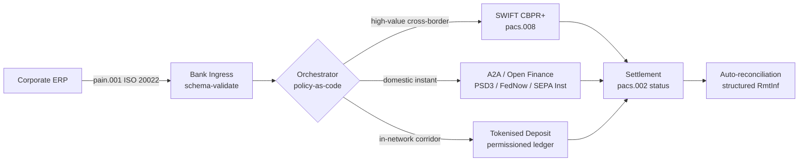

## எல்லை கடந்த 2026: நிறுவனக் கருவூலத்தில் ISO 20022, திறந்த நிதி மற்றும் டோக்கனாக்கப்பட்ட வைப்புகள்

> **நிர்வாகச் சுருக்கம்.** 2026 இல் எல்லை கடந்த நிறுவனக் கருவூலம் உறவு-மேலாண்மைச் சிக்கலாக இருப்பதற்கு முன்பே ஒரு பல-தட பொறியியல் சிக்கலாகும். PSD3 மற்றும் நிதித் தரவு அணுகல் (FiDA) ஒழுங்குமுறை திறந்த-வங்கிச் சேவையின் எல்லையை நிறுவனக் கருவூலத் தரவுக்குள் விரிவுபடுத்துகின்றன; நவம்பர் 2026 SWIFT MT/MX மாற்றம், CBPR+-இணக்கமான pacs.008 ஐ ஒரே சாத்தியமான எல்லை கடந்த வங்கிகளுக்கிடையேயான வடிவமாக்குகிறது; டோக்கனாக்கப்பட்ட வைப்புகளும் ஒழுங்குபடுத்தப்பட்ட ஸ்டேபிள்காயின் தடங்களும் அனுமதி-அடிப்படை வலைப்பின்னல்களுக்குள் கிட்டத்தட்ட T+0 இல் மொத்த தீர்வுக் கட்டத்தைக் கையாளுகின்றன. இந்தச் சுழற்சியில் வெற்றிபெறும் CIB, ஒரே தடத்தைத் தேர்ந்தெடுப்பது அல்ல; அவற்றைப் பிணைக்கும் ஒழுங்கமைப்புக் கட்டத்தைப் பொறியியல் செய்வதே. இந்தக் கட்டுரை நான்கு-தட கட்டமைப்பை (PSD3 கீழான A2A, SWIFT CBPR+, வங்கி-வழங்கிய டோக்கனாக்கப்பட்ட வைப்புகள், ஒழுங்குபடுத்தப்பட்ட ஸ்டேபிள்காயின்கள்) விவரிக்கிறது — ஒவ்வொரு தடமும் எதைச் சிறப்பாகச் செய்கிறது, கடன்-வெளிப்பாடு எல்லைகள் எங்கு விழுகின்றன, மற்றும் நிறுவனம் ஒரே கொடுப்பனவைப் பார்க்கவும் மேற்பார்வையாளர் ஒரே தணிக்கை செய்யக்கூடிய தடத்தைப் பார்க்கவும், அவற்றுக்கு மேலான கொள்கை-கோடு-வடிவ ஒழுங்கமைப்புக் கட்டம் எதை அமல்படுத்த வேண்டும் என்பதையும்.

ஒரு ஐரோப்பிய தொழில்துறை நிறுவனம் ஒரு புதன்கிழமை காலை பிரேசிலிய சப்ளையருக்கு EUR 4.2 மில்லியன் செலுத்துகிறது. கருவூல வேலைத்தளம் ஒரு வங்கியைத் தேர்ந்தெடுப்பதில்லை. அது ஒரு தடத்தைத் தேர்ந்தெடுக்கிறது — தடங்களின் வரிசையை. வாடிக்கையாளர் நோக்கிய அறிவுறுத்தல், PSD3 கீழ் ஒரு திறந்த நிதி வழங்குநர் வழியாக வழிநடத்தப்படும் A2A pain.001 செய்தியாக வந்து சேர்கிறது. வங்கி அதை ஒரு CIB தனியார் வலைப்பின்னலுக்குள் டோக்கனாக்கப்பட்ட வைப்புகள் மீது இரண்டு தொடர்பு அதிகார எல்லைகள் வழியாகக் கொண்டு செல்கிறது. நீண்ட வால் — டோக்கனாக்கப்பட்ட-வைப்பு உறவு இல்லாத துணை-சப்ளையருக்கான USD 80,000 விலைப்பட்டியல் சுத்திகரிப்பு — இன்னும் SWIFT CBPR+ மீது pacs.008 ஆகச் செல்கிறது. வாடிக்கையாளர் ஒரே கொடுப்பனவைப் பார்க்கிறார். கட்டமைப்பு நான்கு தடங்களைப் பார்க்கிறது. இது ஒன்றாகப் பிடித்திருப்பதற்கான ஒரே காரணம் [ISO 20022](/2023-09-29-automating-iso-20022-compliant-payment-file-creation-with-pain001/index.html).

இதுவே Mastercard [திறந்த வங்கிச் சேவையிலிருந்து திறந்த நிதிக்கான பரிணாமம்](https://www.mastercard.com/us/en/news-and-trends/Insights/2026/open-banking-to-open-finance-the-evolution-of-financial-data.html "Mastercard: திறந்த வங்கிச் சேவையிலிருந்து திறந்த நிதி, நிதித் தரவின் பரிணாமம்") பற்றி பேசும்போது விவரிக்கும் இயக்க மாதிரி — தரவும் கொடுப்பனவுகளும் ஒரே ஒழுங்கமைப்புக் கட்டமாக இணைந்து, தடத்தை வாடிக்கையாளர் அல்ல, அமைப்பே தேர்ந்தெடுக்கிறது. மூத்த வங்கித் தொழில்நுட்பவியலாளர்களுக்கான சுவாரஸ்யமான கேள்வி எந்தத் தடம் வெல்கிறது என்பதல்ல. ஒழுங்கமைப்புக் கட்டம் எவ்வாறு பொறியியல் செய்யப்படுகிறது, நிர்வகிக்கப்படுகிறது, சரிபார்க்கப்படுகிறது என்பதே.

## 01. அட்டைகளிலிருந்து A2A வரை — திறந்த நிதி மாற்றம்

அட்டைத் தடங்கள் மறைந்துவிடப் போவதில்லை. அவை மறுவடிவமைக்கப்படுகின்றன.

2025 முழுவதும், 2026 க்குள்ளும், [PSD3 மற்றும் நிதித் தரவு அணுகல் (FiDA) ஒழுங்குமுறை](https://www.consultancy.uk/news/42202/orchestrating-open-banking-for-platform-growth-2026-outlook "Consultancy.uk: தளம் வளர்ச்சிக்கான திறந்த வங்கிச் சேவையை ஒழுங்கமைத்தல், 2026 கண்ணோட்டம்") திறந்த-வங்கிச் சேவைக் கடமையை கொடுப்பனவுக் கணக்குகளுக்கு அப்பால் ஓய்வூதியங்கள், அடமானங்கள், சேமிப்புகள், காப்பீடு மற்றும் நிறுவனக் கருவூலத் தரவுக்குள் விரிவுபடுத்தின. நிறுவனக் கருவூலத்திற்கான தாக்கம் நேரடியானது: ஒரு CIB உறவு மேலாளர் இப்போது ஒரு நிறுவனத்தின் அறிவுறுத்தலின் பேரில், பல வங்கிகள் முழுவதும் அதன் முழுப் பணப்புழக்கச் சித்திரத்தை ஒரே API ஒப்பந்தத்தின் வழியாக நுகர முடியும்.

இரண்டு இயக்குநர்கள் நிறுவனங்கள் நுகரவிருக்கும் ஒழுங்கமைப்புக் கட்டத்தை வெளிப்படையாகக் கட்டமைத்துக் கொண்டிருக்கிறார்கள். Nexi தனது கையகப்படுத்தும் தடத்தை SEPA Instant மற்றும் அகில-ஐரோப்பிய RTGS வழித்தடங்கள் முழுவதும் A2A துவக்கத்திற்குள் விரிவுபடுத்தியுள்ளது, முழுவதும் ISO 20022 சொந்தமானது. Mastercard இன் திறந்த நிதித் தளம் — Aiia மற்றும் Finicity கையகப்படுத்தலின் மீது நங்கூரமிடப்பட்டது — அதற்கு அடியில் தரவு-திரட்டல் மற்றும் ஒப்புதல் கட்டத்தை வழங்குகிறது, முன்பு அட்டை அங்கீகாரங்களுக்குச் சேவை செய்த அதே API தோட்டத்தின் வழியாக கொடுப்பனவுத் துவக்கம் வெளிப்படுகிறது.

இந்த மாற்றம் மூன்று காரணங்களுக்காக முக்கியம்:

1. **அலகுப் பொருளாதாரம்.** PSD3 கீழ் துவக்கப்பட்ட A2A கொடுப்பனவிலிருந்து இடைமாற்றுக் கட்டணத்தை (interchange) அகற்றுகிறது. உயர்-டிக்கெட் B2B ஓட்டங்களுக்கு, சேமிப்பு கணிசமானது; குறைந்த-டிக்கெட் நுகர்வோர் ஓட்டங்களுக்கு, வணிகச் செலவுத் தொகுப்பு சரிந்துவிடுகிறது.
2. **தரவுத் தரம்.** ISO 20022 கீழான A2A, அட்டைகள் ஒருபோதும் கொண்டு செல்ல முடியாத கட்டமைக்கப்பட்ட செலுத்துகைத் தரவைக் கொண்டு செல்கிறது. 95% க்கு மேலான தன்னியக்க-சரிபார்ப்பு விகிதங்கள் இப்போது அடிப்படைத் தேவையாகிவிட்டன.
3. **இடர் மாதிரி.** A2A என்பது ஒரு அட்டை அங்கீகாரம் அல்ல, ஒரு கடன் பரிமாற்றம். மோசடிப் பரப்பு, திரும்பப்பெறல் மாதிரி, மற்றும் தகராறு மாதிரி அனைத்தும் வேறுபட்டவை. வாடிக்கையாளர் பாதுகாப்புக் கட்டம் மரபுரிமையாகப் பெறப்படுவதல்ல, மறுகட்டமைக்கப்படுகிறது என்பதை நிறுவனக் கருவூலக் குழுக்கள் புரிந்துகொள்ள வேண்டும்.

2026 இல் பல-தட முன்மொழிவை விற்கும் CIB, அணுகலை அல்ல, ஒழுங்கமைப்பை விற்கிறது. அணுகல் இப்போது ஒழுங்குபடுத்தப்பட்டுள்ளது.

## 02. தடங்களுக்கிடையேயான பொதுமொழியாக ISO 20022

பல-தடம் என்பது செயல்படுத்தக்கூடியதாக இருப்பதற்கான காரணம், செய்தி வடிவம் இப்போது எல்லாத் தடங்களிலும் நிலையானதாக இருப்பதே.

BIS கொடுப்பனவுகள் மற்றும் சந்தை உள்கட்டமைப்புக் குழு (CPMI) தனது [எல்லை கடந்த கொடுப்பனவுகளை மேம்படுத்துவதற்கான ISO 20022 இணக்கத் தேவைகளில்](https://www.bis.org/cpmi/publ/d230.pdf "BIS CPMI: எல்லை கடந்த கொடுப்பனவுகளை மேம்படுத்துவதற்கான ISO 20022 இணக்கத் தேவைகள்") கட்டமைப்பு வழக்கைத் தெளிவாக்கியது. நவம்பர் 2025 CBPR+ க்கு மாறியது எல்லை கடந்த வங்கிகளுக்கிடையேயான செய்தியிடலுக்கான MT103 / MT202 காலத்தை மூடியது. அந்தப் புள்ளியிலிருந்து, ஒவ்வொரு பெரிய தடமும் — SWIFT, FedNow, SEPA Instant, RTP, மற்றும் ஆசியா மற்றும் லத்தீன் அமெரிக்காவின் முக்கிய உடனடிக் கொடுப்பனவு அமைப்புகள் — ஒரே pacs.008 / pacs.009 / pain.001 இலக்கணத்தைப் பேசுகின்றன.

நிறுவனக் கருவூலத்திற்கான நடைமுறை விளைவு:

- **வழிநடத்தல் தரவு-உந்துதலானது.** கருவூல வேலைத்தளம் ஒரு pain.001 ஐ ஒருமுறை படித்து, செய்தியை மறுவரைபடம் செய்யாமல், வழித்தடம், டிக்கெட் அளவு, கடைசி நேரம், மற்றும் எதிர்க்கட்சி உறவின் அடிப்படையில் ஒவ்வொரு கொடுப்பனவிற்கும் தடத்தைத் தீர்மானிக்க முடியும்.
- **செலுத்துகைத் தரவு தாவலைத் தாண்டி நிலைத்திருக்கிறது.** கட்டமைக்கப்பட்ட செலுத்துகைப் புலங்கள் (`<RmtInf><Strd>`) துண்டிக்கப்படாமல் தொடர்பு எல்லைகள் வழியாகக் கடந்து செல்கின்றன. தரவு தடத்தின் எல்லையில் இழக்கப்படாததால் தன்னியக்க-சரிபார்ப்பு விகிதங்கள் உயர்கின்றன.
- **தடைப் பட்டியல் திரையிடல் தணிக்கை செய்யக்கூடியதாகிறது.** LEI குறிப்புகளுடன் கூடிய கட்டமைக்கப்பட்ட `<Dbtr>` / `<Cdtr>` / `<DbtrAgt>` / `<CdtrAgt>` புலங்கள், தடையற்ற-உரைப் பெயர் திரையிடலை மாற்றுகின்றன. தவறான-பொருத்த விகிதங்கள் குறைகின்றன. விசாரணை வரிசைகள் சுருங்குகின்றன.

கீழேயுள்ள வரைபடம் ஒரு தனிப்பட்ட pain.001 வங்கியின் நுழைவு வழியாக, கொள்கை-கோடு-வடிவ ஒழுங்கமைப்பாளருக்குள், மற்றும் வழித்தடமும் டிக்கெட் அளவும் கோரும் எந்தத் தடத்திற்கும் வெளியேறுவதைக் கண்டறிகிறது — ஒரே செய்தி, பல தடங்கள், மறுவரைபடம் இல்லை.

இந்த நிலைத்தன்மையின் விலை பொறியியல் ஒழுக்கம். ISO 20022 அனுமதிப்பதாகும். இரண்டு வங்கிகள் முழுமையாக CBPR+ இணக்கமாக இருந்தும், புல பயன்பாடு, எழுத்துத் தொகுப்பு, மற்றும் செலுத்துகை-தரவு அமைப்பில் வேறுபடும் pacs.008 செய்திகளை உருவாக்க முடியும். 2026 இல் எல்லை கடந்ததில் வெல்லும் CIB, தரநிலை கோருவதைவிடக் கடுமையான செய்தி விவரக்குறிப்பை அமல்படுத்துகிறது — மற்றும் தீர்வில் அல்ல, பாகுபடுத்தலில் நிராகரிக்கிறது.

## 03. டோக்கனாக்கப்பட்ட வைப்புகளும் நிலையான தடங்களும்

மொத்த தீர்வுக் கட்டத்திலேயே தடக் கதை சுவாரஸ்யமாகிறது.

[தானியக்கம், தற்செயல் தடங்கள், ISO 20022 மற்றும் ஸ்டேபிள்காயின்கள் பற்றிய Trade Treasury Payments பகுப்பாய்வில்](https://tradetreasurypayments.com/articles/automation-contingency-rails-iso-20022-and-stablecoins-the-2026-trends-reshaping-corporate-finance-and-b2b-payments "Trade Treasury Payments: தானியக்கம், தற்செயல் தடங்கள், ISO 20022 மற்றும் ஸ்டேபிள்காயின்கள், நிறுவன நிதி மற்றும் B2B கொடுப்பனவுகளை மறுவடிவமைக்கும் 2026 போக்குகள்") நன்கு கைப்பற்றப்பட்ட 2026 சித்திரம், மொத்த தீர்வுக் கட்டத்தை கட்டமைப்பு ரீதியாக வேறுபட்ட இரண்டு மாதிரிகளாகப் பிரிக்கிறது.

**வங்கி-வழங்கிய டோக்கனாக்கப்பட்ட வைப்புகள்.** ஒரு வணிக வங்கி ஒரு அனுமதி-அடிப்படைப் பேரேட்டில் டோக்கனாக்கப்பட்ட பொறுப்பை வழங்குகிறது — JPM Coin, HSBC இன் Orion-இணைக்கப்பட்ட வைப்பு டோக்கன், முக்கிய ஐரோப்பிய CIB சமமானவை. டோக்கன் என்பது வழங்கும் வங்கியின் மீதான ஒரு நேரடிக் கோரிக்கை. வலைப்பின்னலுக்குள் தீர்வு கிட்டத்தட்ட T+0 ஆகும். இணக்கம் வழங்கும் வங்கியின் பொறுப்பு. தடம் முழுமையாக ஒழுங்குபடுத்தப்பட்டது, முழுமையாகக் கண்டறியக்கூடியது, மற்றும் வழங்குநர் இணைத்துக்கொண்ட பங்கேற்பாளர்களுக்கு மட்டுப்படுத்தப்பட்டது.

**ஒருங்கிணைந்த ஸ்டேபிள்காயின் தடங்கள்.** ஒரு ஒழுங்குபடுத்தப்பட்ட ஸ்டேபிள்காயின் — முழுமையாக இருப்பு வைக்கப்பட்டது, தணிக்கை செய்யப்பட்டது, மற்றும் MiCA அல்லது சமமான பிராந்திய ஆட்சியின் கீழ் இயங்குவது — வங்கி-வழங்கிய டோக்கனாக்கப்பட்ட வைப்புகள் இன்னும் எட்டாத ஒரு வழித்தடத்தை தீர்க்கிறது. டோக்கன் என்பது வங்கி இருப்புநிலைக் குறிப்பின் மீதான அல்ல, இருப்பின் மீதான கோரிக்கை. இணக்கம் வழங்குநர், நுழைவு-வழி, மற்றும் வெளியேறு-வழிக்கு இடையே பகிரப்படுகிறது.

இந்த இரண்டு மாதிரிகளும் போட்டியிடுவதில்லை. அவை அடுக்கப்படுகின்றன. 2026 இல் ஒரு CIB எல்லை கடந்த தயாரிப்பு பொதுவாக வலைப்பின்னலுக்குள் கட்டத்திற்கு வங்கி-வழங்கிய டோக்கனாக்கப்பட்ட வைப்புகளையும், வலைப்பின்னலுக்குள் தடம் முடியும் வழித்தடத்திற்கு ஒரு ஒழுங்குபடுத்தப்பட்ட ஸ்டேபிள்காயினையும் பயன்படுத்துகிறது. நிறுவனம் ஒரே ISO 20022 கொடுப்பனவைப் பார்க்கிறது. அதற்கு அடியிலான தீர்வுக் கதை பல-டோக்கனானது.

வாரியக் குழு அளவிலான கேள்வி, முதல் நிரலாக்கக்கூடிய-பணப்புழக்க பரிசோதனைகளிலிருந்து இயக்க-இடர் குழுக்கள் கேட்டுவரும் அதே ஒன்று: டோக்கனின் மீது கடன் வெளிப்பாட்டை யார் சுமக்கிறார்கள், எவ்வளவு காலத்திற்கு? டோக்கனாக்கப்பட்ட வைப்புகள் ஒரு தெளிவான பதிலைத் தருகின்றன — எரிக்கப்படும் (burn) வரை வழங்கும் வங்கி. ஒருங்கிணைந்த ஸ்டேபிள்காயின் தடங்கள் இன்னும் நுட்பமான ஒன்றைத் தருகின்றன — இருப்பு, தணிக்கைச் சுழற்சி மற்றும் மீட்பு உத்தரவாதத்திற்கு உட்பட்டு. ஒவ்வொரு வழித்தடத்திற்கும் ஒவ்வொரு தடத்திற்கும் பதிலை ஆவணப்படுத்தாத ஒரு கருவூலக் குழு தனது இருப்புநிலைக் குறிப்பில் அளவிடப்படாத கடன் இடரைச் சுமந்து கொண்டிருக்கிறது.

## 04. தன்னாட்சிக் கருவூலத் தொகுப்பு

தடக் கட்டத்திற்கு மேலே ஒழுங்கமைப்புக் கட்டம் அமர்ந்திருக்கிறது. ஒழுங்கமைப்புக் கட்டத்திற்கு மேலே முகவர் கட்டம் அமர்ந்திருக்கிறது.

[தன்னாட்சிக் கருவூல அட்டவணை 2026: நிரலாக்கக்கூடிய பணப்புழக்கம் மற்றும் டோக்கனாக்கப்பட்ட வைப்புகள்](https://sebastienrousseau.com/2026-06-07-autonomous-treasury-index-programmable-liquidity-tokenised-deposits-2026 "Sebastien Rousseau: தன்னாட்சிக் கருவூல அட்டவணை 2026") இல் நான் கட்டமைப்பை விரிவாக விவரித்துள்ளேன். சுருக்கமான பதிப்பு: 2026 இல் முகவர்-அடிப்படைக் கருவூலம் என்பது கொள்கை-கோடு-வடிவமாக வெளிப்படுத்தப்படும் ஒழுங்கமைப்புக் கட்டமே, அதற்குள் எல்லைப்படுத்தப்பட்ட முகவர்கள் இயங்குகின்றனர்.

தொகுப்பு:

1. **தடக் கட்டம்.** SWIFT CBPR+, உடனடி A2A, டோக்கனாக்கப்பட்ட வைப்புகள், ஒழுங்குபடுத்தப்பட்ட ஸ்டேபிள்காயின்கள். ஒவ்வொரு தடத்திற்கும் வெளியிடப்பட்ட விவரக்குறிப்பு, கடைசி-நேர அட்டவணை, செலவு வளைவு, மற்றும் தீர்வு-இறுதித்தன்மை மாதிரி உள்ளது.
2. **ஒழுங்கமைப்புக் கட்டம்.** ISO 20022 உள்ளே, ISO 20022 வெளியே. வழித்தடம், டிக்கெட், கடைசி-நேரம், எதிர்க்கட்சி உறவு, மற்றும் கொள்கையின் அடிப்படையில் ஒவ்வொரு கொடுப்பனவிற்கும் தடத் தீர்மானம். கொள்கை பதிப்பிடப்பட்டது, கையொப்பமிடப்பட்டது, மற்றும் தணிக்கை செய்யக்கூடியது.
3. **முகவர் கட்டம்.** எல்லைப்படுத்தப்பட்ட கருவூல முகவர்கள் கருவி-அழைப்பு எல்லைகள், தணிக்கைப் பதிவுகள், மற்றும் அழிப்புச் சுவிட்சுகளுடன் ஒழுங்கமைப்புக் கொள்கையை இயக்குகிறார்கள். முகவர் தடத்தைத் தேர்ந்தெடுப்பதில்லை. கொள்கை தடத்தைத் தேர்ந்தெடுக்கிறது. முகவர் கொள்கையை இயக்குகிறார்.
4. **சரிபார்ப்புக் கட்டம்.** ISO 20022 pacs.008 / pacs.002 / camt.054 செய்திகள் மூல pain.001 அறிவுறுத்தலுக்கு எதிராகச் சரிபார்க்கப்படுகின்றன, கட்டமைக்கப்பட்ட செலுத்துகைத் தரவு கைமுறை தலையீடு இல்லாமல் வளையத்தை மூடுகிறது.

2026 இல் இந்தத் தொகுப்பை விற்கும் CIB ஒரே நேரத்தில் நான்கு விஷயங்களை விற்கிறது — மற்றும் அவற்றைத் தனித்தனியாக விலைப்படுத்துகிறது. அதை வாங்கும் நிறுவனம், ஒரே செய்தி தரநிலை, ஒரே கொள்கைக் கட்டம், ஒரே சரிபார்ப்பு ஊட்டத்துடன், தடங்கள் முழுவதும் விருப்பத்தேர்வைச் (optionality) வாங்குகிறது. அதுவே கட்டமைப்பு மாற்றம். மற்ற அனைத்தும் அமலாக்க விவரம்.

## அடிக்கடி கேட்கப்படும் கேள்விகள்

**"திறந்த நிதி" என்பது வெறுமனே மறுபெயரிடப்பட்ட திறந்த வங்கிச் சேவையா?**
இல்லை. PSD2 கீழான திறந்த வங்கிச் சேவை கொடுப்பனவுக் கணக்குகளை உள்ளடக்கியது. PSD3 மற்றும் நிதித் தரவு அணுகல் (FiDA) ஒழுங்குமுறை தரவு-பகிர்வுக் கடமையை ஓய்வூதியங்கள், அடமானங்கள், சேமிப்புகள், காப்பீடு, மற்றும் நிறுவனக் கருவூலத் தரவுக்குள் விரிவுபடுத்துகின்றன. நிறுவனக் கருவூலத்திற்கான தாக்கம் நேரடியானது: ஒரு CIB உறவு மேலாளர் இப்போது ஒரு நிறுவனத்தின் அறிவுறுத்தலின் பேரில், அதன் கொடுப்பனவு-கணக்கு வரலாற்றை மட்டுமல்ல, பல வங்கிகள் முழுவதும் அதன் முழுப் பணப்புழக்கச் சித்திரத்தை ஒரே API ஒப்பந்தத்தின் வழியாக நுகர முடியும்.

**தடம் அல்ல, ஒழுங்கமைப்புக் கட்டம் ஏன் கட்டமைப்பு கவனமாக இருக்கிறது?**
ஏனெனில் தடங்கள் இப்போது பொருள்-மயமாகிக் கொண்டிருக்கின்றன. SWIFT CBPR+ pacs.008, PSD3 கீழான A2A, டோக்கனாக்கப்பட்ட வைப்புகள், மற்றும் ஒழுங்குபடுத்தப்பட்ட ஸ்டேபிள்காயின்கள் அனைத்தும் செய்தி மட்டத்தில் அதே ISO 20022 இலக்கணத்தைக் கொண்டு செல்கின்றன. 2026 CIB ஐ வேறுபடுத்துவது, வழித்தடம், டிக்கெட் அளவு, தீர்வு-இறுதித்தன்மைத் தேவை, மற்றும் எதிர்க்கட்சி உறவின் அடிப்படையில் ஒவ்வொரு கொடுப்பனவிற்கும் தடத்தைத் தேர்ந்தெடுக்கும் — மற்றும் மேற்பார்வையாளர் கேட்கவிருக்கும் தணிக்கைத் தொலைமெட்ரியில் தேர்வைப் பதிவுசெய்யும் — கொள்கை-கோடு-வடிவ இயந்திரமே. அந்த இயந்திரம் இல்லாமல், பல-தடம் என்பது எந்த ஆட்சியும் இல்லாத வெறும் விருப்பத்தேர்வே.

**டோக்கனாக்கப்பட்ட-வைப்பு கட்டத்தில் கடன்-வெளிப்பாடு எல்லை எங்கு விழுகிறது?**
அனுமதி-அடிப்படைப் பேரேட்டில் உள்ள வங்கி-வழங்கிய டோக்கனாக்கப்பட்ட வைப்புகள் வழங்கும் வங்கியின் மீதான ஒரு நேரடிக் கோரிக்கை — கடன் வெளிப்பாடு எரிப்பில் (burn) முடிகிறது. ஒழுங்குபடுத்தப்பட்ட ஸ்டேபிள்காயின் தடங்கள் (EU இல் MiCA-மேற்பார்வையிடப்பட்டவை, UK இல் Bank of England இன் விவாதப்-பத்திர ஆட்சி, பிற இடங்களில் ஒப்பானவை) இருப்பின் மீதான கோரிக்கை, வெளிப்பாட்டு சாளரம் தணிக்கைச் சுழற்சி மற்றும் மீட்பு-உத்தரவாத விதிமுறைகளுக்கு உட்பட்டது. ஒவ்வொரு வழித்தடத்திற்கும் ஒவ்வொரு தடத்திற்கும் பதிலை ஆவணப்படுத்தாத ஒரு கருவூலக் குழு தனது இருப்புநிலைக் குறிப்பில் அளவிடப்படாத கடன் இடரைச் சுமந்து கொண்டிருக்கிறது.

**இந்தக் கட்டமைப்பில் SWIFT க்கு என்ன நடக்கிறது?**
SWIFT மறைந்துவிடுவதில்லை — அது நீண்ட வால் பகுதியை நங்கூரமிடுகிறது. வங்கி-வழங்கிய டோக்கனாக்கப்பட்ட வைப்புகள் இன்னும் எட்டாத வழித்தடங்கள் (பெரும்பாலான வளர்ந்துவரும்-சந்தை துணை-சப்ளையர் உறவுகள், பெரும்பாலான குறைந்த-அதிர்வெண் / குறைந்த-டிக்கெட் எல்லை கடந்த ஓட்டம்), மற்றும் நிறுவனம் அல்லது வங்கி CBPR+ தொடர்பு-வங்கிச் சேவை தணிக்கைத் தடத்தைக் கோரும் வழித்தடங்கள், தொடர்ந்து SWIFT pacs.008 மீது செல்கின்றன. 2026 கட்டமைப்பு "SWIFT + புதிய தடங்கள்", "SWIFT க்குப் பதிலாக புதிய தடங்கள்" அல்ல.

**இந்தத் தொகுப்பை வாங்கும்போது நிறுவனம் என்ன வாங்குகிறது?**
ஒரே செய்தி தரநிலை (ISO 20022), ஒரே கொள்கைக் கட்டம் (ஒழுங்கமைப்பு இயந்திரம்), மற்றும் ஒரே சரிபார்ப்பு ஊட்டத்துடன் (pacs.002 நிலை + camt.054 உறுதிப்படுத்தல் + கட்டமைக்கப்பட்ட camt.053 அறிக்கைகள்), தடங்கள் முழுவதும் விருப்பத்தேர்வு. நிறுவனம் நான்கு தனித்தனித் தட இணைப்புகளுக்குப் பணம் செலுத்தவில்லை. நான்கு தடங்களையும் இயக்க ரீதியாக ஒன்றாக நடந்துகொள்ளச் செய்யும் ஒழுங்கமைப்புக் கட்டத்திற்கு — மற்றும் அடுத்த மேற்பார்வைக் கோரிக்கைக்குப் பிறகான காலையில் "அந்த EUR 4.2 மில்லியன் கொடுப்பனவு எந்தத் தடத்தில் சென்றது, ஏன்?" என்பதற்குப் பதிலளிக்கச் செய்யும் தணிக்கைத் தடத்திற்கு — அது பணம் செலுத்துகிறது.

## முடிவுரை

2026 இல் எல்லை கடந்த நிறுவனக் கருவூலம் ஒரு பல-தட பொறியியல் சிக்கல். ISO 20022 என்பது பல-தடத்தை கையாளக்கூடியதாக்கும் இலக்கணம். PSD3 மற்றும் FiDA தரவு எல்லையை விரிவுபடுத்தி, திறந்த நிதியை நிறுவனக் கருவூல வேலைப்பாய்வுக்குள் தள்ளுகின்றன. டோக்கனாக்கப்பட்ட வைப்புகளும் ஒழுங்குபடுத்தப்பட்ட ஸ்டேபிள்காயின்களும் மொத்த தீர்வுக் கட்டத்தைக் கையாளுகின்றன. SWIFT இன்னும் நீண்ட வால் பகுதியை நங்கூரமிடுகிறது.

வெற்றிபெறும் CIB, ஒழுங்கமைப்புக் கட்டத்தைக் கட்டமைப்பதே — ஒரே தடத்தைத் தேர்ந்தெடுத்து அதன் மீது வணிகத்தையே பந்தயம் கட்டுவது அல்ல. வெற்றிபெறும் நிறுவனக் கருவூலக் குழு, ஒவ்வொரு வழித்தடத்திற்கும் ஒவ்வொரு தடத்திற்கும் கடன் வெளிப்பாட்டை ஆவணப்படுத்துவது, ஒழுங்குமுறையாளர் கோருவதைவிடக் கடுமையான ISO 20022 விவரக்குறிப்பை அமல்படுத்துவது, மற்றும் தடத் தீர்மானத்தை ஒவ்வொரு-கொடுப்பனவு தீர்ப்பாக அல்ல, கொள்கையாகக் கருதுவது.

சுவாரஸ்யமான வேலை ஒழுங்கமைப்புக் கட்டத்தில் உள்ளது. அதைக் கவனமாகக் கட்டமையுங்கள்.

## குறிப்புகள்

Bank for International Settlements, Committee on Payments and Market Infrastructures (2023). *Harmonised ISO 20022 data requirements for enhancing cross-border payments* (CPMI Papers No. 230). இங்கு கிடைக்கிறது: [https://www.bis.org/cpmi/publ/d230.htm](https://www.bis.org/cpmi/publ/d230.htm "BIS CPMI 230 — Harmonised ISO 20022 data requirements")

Bank for International Settlements (2024). *Project Agorá: cross-border payments with tokenised commercial bank deposits and central bank money*. BIS Innovation Hub. இங்கு கிடைக்கிறது: [https://www.bis.org/about/bisih/topics/fmis/agora.htm](https://www.bis.org/about/bisih/topics/fmis/agora.htm "BIS Project Agorá")

Bank of England (2023). *Regulatory regime for systemic payment systems using stablecoins and related service providers — Discussion Paper*. இங்கு கிடைக்கிறது: [https://www.bankofengland.co.uk/paper/2023/dp/regulatory-regime-for-systemic-payment-systems-using-stablecoins-and-related-service-providers](https://www.bankofengland.co.uk/paper/2023/dp/regulatory-regime-for-systemic-payment-systems-using-stablecoins-and-related-service-providers "Bank of England — Regulatory regime for stablecoins discussion paper")

European Commission (2023). *Proposal for a Directive on payment services and electronic money services (PSD3)*. இங்கு கிடைக்கிறது: [https://finance.ec.europa.eu/regulation-and-supervision/financial-services-legislation/implementing-and-delegated-acts/payment-services-directive_en](https://finance.ec.europa.eu/regulation-and-supervision/financial-services-legislation/implementing-and-delegated-acts/payment-services-directive_en "European Commission — Payment Services Directive proposal")

European Parliament and Council (2023). *Regulation (EU) 2023/1114 on markets in crypto-assets (MiCA)*. இங்கு கிடைக்கிறது: [https://eur-lex.europa.eu/eli/reg/2023/1114/oj](https://eur-lex.europa.eu/eli/reg/2023/1114/oj "Regulation (EU) 2023/1114 — Markets in Crypto-Assets (MiCA)")

Financial Action Task Force (2023). *International standards on combating money laundering and the financing of terrorism — Recommendation 16 on wire transfers*. இங்கு கிடைக்கிறது: [https://www.fatf-gafi.org/en/publications/Fatfrecommendations/Fatf-recommendations.html](https://www.fatf-gafi.org/en/publications/Fatfrecommendations/Fatf-recommendations.html "FATF Recommendations")

International Organization for Standardization (2020). *ISO 17442 Financial services — Legal entity identifier (LEI)*. இங்கு கிடைக்கிறது: [https://www.gleif.org/en/about-lei/iso-17442-the-lei-code-structure](https://www.gleif.org/en/about-lei/iso-17442-the-lei-code-structure "ISO 17442 — Legal Entity Identifier")

SWIFT (2024). *Cross-Border Payments and Reporting Plus (CBPR+) usage guidelines*. இங்கு கிடைக்கிறது: [https://www.swift.com/standards/iso-20022/iso-20022-programme](https://www.swift.com/standards/iso-20022/iso-20022-programme "SWIFT CBPR+ usage guidelines")
