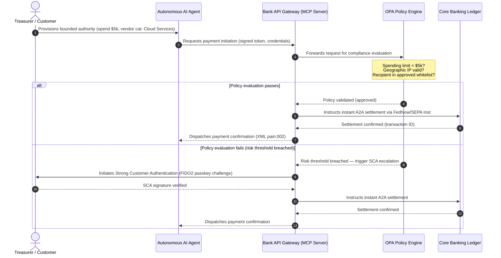

## 2026 உலகளாவிய கட்டண முன்னோட்டம்: ஏஜென்டிக், கண்ணுக்குத் தெரியாத, நிகழ்நேர உலகில் இயக்க மாதிரி, இடர் மற்றும் வருவாய்

உலகளாவிய பரிவர்த்தனை வங்கிகளுக்கு, 2026–2028 சுழற்சி ஒரு கட்டமைப்பு சாளரம். நவீன கட்டண உள்கட்டமைப்பு இனி ஒரு நிர்வாக பயன்பாடு அல்ல — அது வங்கி-தர தொழில்நுட்ப மூலோபாயத்தின் மையம். G-SIBகளுக்கும் முக்கிய பிராந்திய நிறுவனங்களுக்கும் உள்ளே, தொழில்நுட்பம், ஒழுங்குமுறை, மற்றும் வாடிக்கையாளர் எதிர்பார்ப்பு ஆகியவை ஒரே இயக்கத் தளமாக ஒருங்கிணைந்துள்ளன.

இந்தச் சுழற்சியை மூன்று சக்திகள் வரையறுக்கின்றன, ஒவ்வொன்றும் நேரடியாக ஒரு நிர்வாக-அறை கவலைக்கு வரைபடமாகிறது.

- **ஏஜென்டிக் வணிகம்** — சேனல் விநியோகம், தயாரிப்பு வடிவமைப்பு, பொறுப்பு ஒதுக்கீடு, மற்றும் மேற்பார்வை ஆய்வின் கீழ் மாதிரி இடர் மேலாண்மை.
- **கண்ணுக்குத் தெரியாத கட்டணங்கள்** — வாடிக்கையாளர் அனுபவம், வங்கிகள் தமது லெட்ஜரை நிறுவன மற்றும் வணிக முன்-முகங்களில் உட்பொதிக்கத் தவறினால் இடைத்தரகர்-நீக்க இடருடன்.
- **நிகழ்நேர செயல்படுத்தல்** — மூலதன வேகம், அதன் விளைவாக நிதிநிலை மேலாண்மை, கடன் இடர், இயக்க மீள்திறன், மற்றும் மோசடி பாதுகாப்பில் மாற்றம்.

நிதி பங்குகள் கணிசமானவை. மோசடி வேகத்திலும் நுட்பத்திலும் அளவிடப்படுகிறது; ஒழுங்குமுறை காலக்கெடுக்கள் கடினமானவை; மற்றும் தமது மைய அமைப்புகளைத் தீவிரமாக நவீனப்படுத்தும் வங்கிகள் கணிசமான கட்டண-வருவாய் வாய்ப்புகளைத் திறக்கின்றன. செயலின்மையின் விலை எதிர்மறையானது: உடனடி பரிவர்த்தனை நிராகரிப்புகள், இயக்கத் தடைகள், ஒழுங்குமுறை அபராதங்கள், மற்றும் விரைவான சந்தைப் பங்கு அரிப்பு.

## நிச்சயத் தன்மை ஏணி — எது தேதியிடப்பட்டது, எது ஒழுங்குபடுத்தப்பட்டது, எது முன்னறிவிப்பு

இந்த அறிக்கையில் உள்ள ஒவ்வொரு உருப்படியும் ஒரே நிச்சயத் தன்மையைச் சுமக்கவில்லை. வாரிய-நிலைக் கேள்வி என்னவென்றால், எந்த வேறுபாடுகள் காலக்கெடுக்கள், எவை மேற்பார்வை எதிர்பார்ப்புகள், மற்றும் எவை இன்னும் சந்தை திட்டங்கள் — ஏனெனில் பதில் பட்ஜெட் உரையாடலை மாற்றுகிறது.

| வகை | எடுத்துக்காட்டுகள் |
| --- | --- |
| **கடின காலக்கெடுக்கள்** | Swift CBPR+ கட்டமைக்கப்பட்ட-முகவரி மாற்றம் (14 நவம்பர் 2026); EPC SEPA திட்ட விதிநூல்கள் (15 நவம்பர் 2026) |
| **ஒழுங்குமுறை கடமைகள்** | DORA ICT இடர் + மீள்திறன் சோதனை + மூன்றாம்-தரப்பு மேற்பார்வை (EU); PSD3/PSR இன் கீழ் SCA பிரதிநிதித்துவம்; SR 11-7 + PRA SS1/23 இன் கீழ் MRM |
| **உயர்-நிகழ்தகவு சந்தை மாற்றங்கள்** | நிகழ்நேர கருவூல APIகள், AI-தலைமையிலான மோசடி பாதுகாப்பு, API-அடிப்படையிலான நிதிநிலை, டீப்·ஃபேக்-உந்துதலால் இயங்கும் உயிரியல் மோசடி |
| **மூலோபாய விருப்பங்கள்** | டோக்கனைஸ் செய்யப்பட்ட வைப்புத்தொகைகள், Project Agorá இன் கீழ் ஒருங்கிணைந்த லெட்ஜர்கள், ஏஜென்டிக்-வணிக வழித்தடங்கள், தொடர்ச்சியான FX (Wire 365) |
| **முன்னறிவிப்புகள்** | 2030 ஆம் ஆண்டுக்குள் ஆண்டுக்கு $3–$5 டிரில்லியன் ஏஜென்டிக்-வணிக ஓட்டங்கள் (McKinsey அடிப்படைக் கோடு) |

மேல் இரண்டு வரிசைகளை, வங்கி எந்தவொரு நன்மையையும் கைப்பற்றினாலும் இல்லாவிட்டாலும் பட்ஜெட் வரியை உந்தும் இணக்க உண்மைகளாகக் கருதுங்கள். கீழ் இரண்டு வரிசைகளையும் மூலோபாய விருப்பங்களாகக் கருதுங்கள் — திசையில் உயர்-நம்பிக்கை, ஆனால் அங்கு செயல்படுத்தல் நேரம் ஒழுங்குமுறையாளரின் நாட்காட்டி உள்ளீடு அல்லாமல் வாரிய தேர்வாகும்.

## உலகளாவிய கட்டண அதிகாரிகளின் ஒருங்கிணைவு

இந்த அறிக்கை நான்கு அதிகாரப்பூர்வ தொழில்துறை குரல்களின் 2026 கட்டண மற்றும் வணிக முன்னோட்டங்களைத் தொகுக்கிறது — [J.P. Morgan Payments](https://www.jpmorgan.com/payments/newsroom/payments-outlook-2026-trends-report-released "J.P. Morgan Payments — Outlook 2026"), [Global Payments](https://investors.globalpayments.com/news-events/press-releases/detail/497/global-payments-releases-its-2026-commerce-and-payment "Global Payments — 2026 Commerce and Payment Trends Report"), HSBC, மற்றும் The Payments Association — மேலும் அவற்றை [எல்லை தாண்டிய கட்டணங்களை மேம்படுத்துவதற்கான G20 வழிகாட்டி](https://www.fsb.org/2026/03/fsb-kicks-off-new-implementation-phase-to-enhance-cross-border-payments-through-public-private-partnership/ "FSB — cross-border payments implementation phase, March 2026") உடன் முக்கோணமாக்குகிறது.

ஒவ்வொரு நிறுவனமும் சூழலமைப்பை வெவ்வேறு சந்தை கோணத்திலிருந்து அணுகுகிறது, ஆனால் அவற்றின் கண்டுபிடிப்புகள் மூன்று மாறாதவைகளில் ஒருங்கிணைகின்றன.

1. **உடனடி, API-உந்து பாதைகள் அடிப்படைக் கோடு.** பாரம்பரிய தொகுதி-செயலாக்க மாதிரிகள் எல்லை தாண்டிய மற்றும் உயர்-மதிப்பு ஓட்டங்களுக்குப் புறக்கணிக்கப்படுகின்றன; அந்தப் பிரிவுகளில் பரிவர்த்தனை வேகம் எப்போதும் இயங்கும், நிகழ்நேர செய்தி-அனுப்புதலால் ஆணையிடப்படுகிறது.
2. **AI அச்சுறுத்தலும் பாதுகாப்பும் இரண்டுமாகும்.** உருவாக்கக் கருவிகளும் டீப்·ஃபேக்குகளும் பரிவர்த்தனை மோசடியை அளவிடுகின்றன, இது நிகழ்நேர, பல-அடுக்கு இயந்திர-கற்றல் எதிர்-பாதுகாப்புகளைத் தேவைப்படுத்துகிறது.
3. **டோக்கனைசேஷன் உற்பத்திக்குத் தயார் உள்கட்டமைப்பு.** லெட்ஜர்கள் டோக்கனைஸ் செய்யப்பட்ட வணிகப் பொறுப்புகளையும் மொத்த மத்திய வங்கி டிஜிட்டல் நாணயங்களையும் புரவலம் செய்ய ஒருங்கிணைகின்றன.

| அறிக்கை | முதன்மை பார்வையாளர்கள் | கவனம் | முக்கிய தூண் | வங்கி விளைவு |
| --- | --- | --- | --- | --- |
| **J.P. Morgan Payments** | நிறுவனக் கருவூலர்கள், G-SIBகள் | நிகழ்நேர நிதிநிலை, மோசடி | APIகள், AI உயிரியல் அளவீடு | தொடர்ச்சியான 365-நாள் தீர்வுக்கு நிதிநிலை, FX, மற்றும் இடர் அமைப்புகளை மீண்டும் கட்டமையுங்கள். |
| **Global Payments** | வணிகர்கள், மின்-வணிகம் | POS பரிணாமம், பல்சேனல் | ஏஜென்டிக் வணிகம், உராய்வற்ற செக்அவுட் | தன்னாட்சி AI ஏஜென்ட்களுக்குப் பாதுகாப்பான, API-கட்டுப்படுத்தப்பட்ட வணிகக் கட்டண வழித்தடங்களை உருவாக்குங்கள். |
| **HSBC Insights** | பன்னாட்டு நிறுவனங்கள் | ERP ஒருங்கிணைப்புகள் (SAP/Oracle), நிகழ்நேர பணம் | Treasury-as-a-Service, பண தெரிவுநிலை | பரிவர்த்தனை API தொகுப்புகளை பணமாக்குங்கள் மற்றும் நிகழ்நேர பண லெட்ஜர் அறிக்கையிடலை மூலத்தில் உட்பொதியுங்கள். |
| **The Payments Association** | பின்டெக்குகள், கட்டண நிறுவனங்கள் | ஸ்டேபிள்காயின்கள், டோக்கனைசேஷன், உலகளாவிய ஒழுங்குமுறை | ஒழுங்குபடுத்தப்பட்ட டிஜிட்டல் சொத்துக்கள், கொள்கை இணக்கம் | டோக்கனைஸ் செய்யப்பட்ட வைப்புத்தொகைகளுக்கு இருப்புநிலைத் தாள்களைத் தயார் செய்யுங்கள் மற்றும் PSD3/PSR பொறுப்பு அமைப்புகளை வழிநடத்துங்கள். |

நான்கு முன்னோட்டங்களும் பொது-துறை G20 கொள்கை உள்கட்டமைப்பின் மேல் இயங்கும் தனியார்-துறை இயக்க அடுக்கை திறம்பட வரையறுக்கின்றன, கொள்கை நோக்கத்தை வங்கிகளுக்குள் நிதிநிலை, டோக்கனைசேஷன், தரவு, மற்றும் மோசடி கட்டுப்பாடு பற்றிய உறுதியான முடிவுகளாக மொழிபெயர்க்கின்றன.

## தூண் 1 — ஏஜென்டிக் வணிகம் மற்றும் கண்ணுக்குத் தெரியாத கட்டணங்கள்

ஏஜென்டிக் வணிகம் என்பது மனிதன்-உந்து, கிளிக்-டு-பை செக்அவுட் இலிருந்து தன்னாட்சி, மாதிரி-உந்து பரிவர்த்தனை தொடக்கத்திற்கான மாற்றம். தொழில்துறை முன்னறிவிப்புகள் 2030 ஆம் ஆண்டுக்குள் தன்னாட்சி ஏஜென்ட்களால் மத்தியஸ்தம் செய்யப்படும் ஆண்டுக்கு $3–$5 டிரில்லியன் வணிகத்தில் ஒருங்கிணைகின்றன — ஒரு மனிதன் 'வாங்கு' என்பதை கிளிக் செய்யாமல் செயல்படுத்தப்படும் உலகளாவிய கட்டண அளவின் குறைந்த-ஒற்றை-இலக்கப் பங்கு.

சில்லறை மற்றும் வணிக சூழலமைப்பில் ஒரு தொடர்புடைய இடைவெளி உள்ளது. இப்போது ஒரு தெளிவான பெரும்பான்மை நுகர்வோர் கிட்டத்தட்ட உராய்வற்ற கட்டணங்களை எதிர்பார்க்கின்றனர், ஆனால் பாதிக்கும் குறைவான வணிகர்களே ஒரு-கிளிக் செக்அவுட் அல்லது API-அணுகக்கூடிய தயாரிப்பு பட்டியல்களுக்கு முன்னுரிமை அளித்துள்ளனர். AI ஏஜென்ட்களால் மனிதக் கண்களுக்காக வடிவமைக்கப்பட்ட பாரம்பரிய பல-பக்க செக்அவுட் திரைகளை வழிசெலுத்த முடியாது; அவற்றுக்கு கட்டமைக்கப்பட்ட, இயந்திரம்-முதல்-இயந்திர API கைகுலுக்கல்கள் தேவை.

### வங்கி முன்னுரிமைகள் மற்றும் இயக்க தாக்கம்

- **KYC மற்றும் AML உரிமை.** ஏஜென்டிக் பரிவர்த்தனைச் சங்கிலிக்குள் யார் இணக்கக் கடமையை வைத்திருக்கிறார்கள் என்பதை வங்கிகள் வரையறுக்க வேண்டும். ஒரு நுகர்வோரின் தனிப்பட்ட AI ஏஜென்ட் ஒரு வணிகரின் ஏஜென்டிக் செக்அவுட் மூலம் ஒரு பரிவர்த்தனையைத் தொடங்கினால், தொடக்கப் பிரதிநிதித்துவப்படுத்தப்பட்ட அதிகாரம் முதன்மைக் கணக்கு வைத்திருப்பவருடன் மறையியல் ரீதியில் பிணைக்கப்பட்டுள்ளது என்பதை வங்கி சரிபார்க்க வேண்டும்.
- **பொறுப்பு மற்றும் சார்ஜ்பேக் மறுவடிவமைப்பு.** கார்டு திட்டங்களும் A2A பாதைகளும் மனித அங்கீகாரத்தைச் சுற்றி வடிவமைக்கப்பட்டன. ஒரு AI ஏஜென்ட் தவறான கொள்முதல் செய்யும்போது — எடுத்துக்காட்டாக, தரவு-பாகுபடுத்தல் பிழையால் தவறான தொழில்துறை சரக்குகளை வாங்குதல் — வங்கிகள் நுகர்வோர், ஏஜென்ட் வழங்குநர், மற்றும் வணிகருக்கு இடையே பொறுப்பைத் தெளிவாக ஒதுக்க வேண்டும்.
- **ஏஜென்டிக் ஓட்டங்களை இடர்-மதிப்பிடுதல்.** கட்டண வழிநடத்தல் இயந்திரங்கள் ஏஜென்டிக் கட்டணங்களை மாறும் விதத்தில் இடர்-மதிப்பிட வேண்டும், ஒரு நிலையான தீர்வுப் பதிவு உருவாகும் வரை மனிதன்-அல்லாத தொடங்கப்பட்ட பரிவர்த்தனைகளுக்கு அதிக இருப்புத் தேவைகளை அல்லது இடைமாற்று விகிதங்களைப் பயன்படுத்த வேண்டும்.

### வரம்பிடப்பட்ட செயல் மற்றும் வரம்பிடப்பட்ட அதிகாரம்

"வரம்பற்ற செயலை" — ஒரு மென்பொருள் கோளாறு காரணமாக ஒரு நிறுவனக் கொள்முதல் ஏஜென்ட் முடிவற்ற மறுநிகழ்வுக் கொள்முதல் சுழற்சியை இயக்குதல் — தணிக்க, வங்கிகள் **வரம்பிடப்பட்ட-அதிகார API வாயில்களை** பயன்படுத்த வேண்டும். இந்த வாயில்கள் மூன்று பரிமாணங்களில் கொள்கை-நிலை வரம்புகளை அமல்படுத்துகின்றன.

1. **அடுக்கு நிதி வரம்புகள்** — ஏஜென்ட் செலவு பரிவர்த்தனை அளவு, தினசரி ஒட்டுமொத்த மதிப்பு, மற்றும் வணிக வகையால் கட்டுப்படுத்தப்படுகிறது.
2. **சூழல்-விழிப்புணர்வு பாதுகாப்புகள்** — லெட்ஜர் நிதியை வெளியிடுவதற்கு முன் இரண்டாம்நிலை சமிக்ஞைகள் (நாளின் நேரம், IP புவிஇடம், பரிவர்த்தனை அதிர்வெண்) மதிப்பிடப்படுகின்றன.
3. **மனிதன்-சுழற்சியில் ஏற்றம்** — ஒரு பரிவர்த்தனை இடர் வரம்புகளை மீறும் போதெல்லாம் PSD3 / PSR இன் கீழ் வலுவான வாடிக்கையாளர் அங்கீகாரம் (SCA) மூலம் கட்டாய மனித அங்கீகாரம் தூண்டப்படுகிறது.

கீழேயுள்ள Mermaid வரிசை பல வங்கிகள் வரம்பிடப்பட்ட-அதிகார ஏஜென்டிக் கட்டண ஓட்டமாக அடையாளம் காணும் இலக்கு கட்டமைப்பைக் காட்டுகிறது.

### Model Context Protocol (MCP)

உள்ளூர்மயமாக்கப்பட்ட AI மாதிரிகளை வங்கி-ஆளுகைச் செயல்படுத்தல் அடுக்குகளுடன் இணைக்க, தொழில்துறை [Model Context Protocol (MCP)](https://modelcontextprotocol.io "Model Context Protocol — open standard for LLM tool integration") ஐச் சுற்றி தரப்படுத்துகிறது — இது LLMகள் மைய அமைப்புகளுக்கு மூல அணுகல் இல்லாமல் தெளிவாக வரம்பிடப்பட்ட, தணிக்கை செய்யக்கூடிய கருவிகளையும் APIகளையும் அழைக்க அனுமதிக்கும் ஒரு திறந்த நெறிமுறை.

வங்கி APIகளை (கட்டண தொடக்கம், இருப்பு விசாரணை, தரப்பு சரிபார்ப்பு) ஒரு MCP சேவையகத்திற்குள் மடிப்பது LLMகளை தரவுத்தள அட்டவணைகள் மற்றும் அமைப்பு-மூல கட்டுப்பாடுகளிலிருந்து விலக்கி வைக்கிறது. மாதிரி லெட்ஜருடன் கட்டமைக்கப்பட்ட, தணிக்கை செய்யப்பட்ட, விகித-வரம்பிடப்பட்ட இறுதிப்புள்ளிகள் மூலம் மட்டுமே தொடர்பு கொள்கிறது — பாதுகாப்பு மாதிரிக்குள் புதைக்கப்படாமல் ஏஜென்டிக் கருவி செயல்படுத்தலின் எல்லையில் அமல்படுத்தப்படுகிறது.

## தூண் 2 — கருவூல மாற்றம் மற்றும் மறு-கற்பனை செய்யப்பட்ட நிதிநிலை

2026 இல் பரிவர்த்தனை வங்கியியலின் வேகம் நாள்-இறுதி தொகுதி செயலாக்கத்திலிருந்து எப்போதும் இயங்கும், நிகழ்நேர கருவூல செயல்பாடுகளுக்கான மாற்றத்தால் அமைக்கப்படுகிறது. பன்னாட்டு நிறுவனங்கள் இனி சிக்கிக்கொண்ட பணத்தைப் பொறுத்துக்கொள்வதில்லை — தீர்வு அமைப்புகள் மூடப்பட்டிருப்பதால் வார இறுதிகள் அல்லது விடுமுறை நாட்களில் உள்ளூர் கணக்குகளில் செயலற்று அமர்ந்திருக்கும் நிதிநிலை.

### நிகழ்நேர நிதிநிலைக்கான பொருளாதார வழக்கு

J.P. Morgan மற்றும் HSBC இரண்டும் மேம்பட்ட நிகழ்நேர பண மற்றும் தரவு திறன்களைக் கொண்ட நிறுவனங்கள் வருவாய் வளர்ச்சி மற்றும் மூலதன செயல்திறனில் சகாக்களை மிஞ்சுவதற்கு கணிசமாக அதிக வாய்ப்புள்ளதாக அறிக்கை செய்கின்றன, முக்கியமாக சிக்கிக்கொண்ட நிதிநிலையைக் குறைத்து செயல்-மூலதன சுழற்சிகளை மேம்படுத்துவதன் மூலம்.

அந்த மதிப்பைப் பிடிக்க, வங்கிகள் நிறுவன ERPகளை (SAP, Oracle) வங்கியின் லெட்ஜருக்கு நேரடியாக இணைக்க அனுமதிக்கும் **Treasury-as-a-Service (TaaS) API தயாரிப்புகளை** வழங்குகின்றன.

- **நிகழ்நேர இருப்பு APIகள்** `camt.052` திட்டத்தைப் பயன்படுத்தி — கோப்பு-பரிமாற்ற நெறிமுறைகளை உடனடி, நிகழ்வு-உந்து பண-நிலை அறிக்கையிடலால் மாற்றுகிறது.
- **மொத்த கட்டண தொடக்க APIகள்** `pain.001` ஐப் பயன்படுத்தி — ERP லெட்ஜரிலிருந்து விற்பனையாளர் கட்டணத் தொகுதிகளின் நேரடி, முழு-வழி செயல்படுத்தல்.
- **தொடர்ச்சியான FX APIகள்** — கருவூல இயந்திரங்கள் எல்லை தாண்டிய தீர்வுக்கு நிகழ்நேர, வழிமுறை அன்னிய-செலாவணி விகிதங்களைப் பூட்டுகின்றன, இரவோட்டு சந்தை-இடைவெளி இடரை நீக்குகின்றன.
- **மெய்நிகர் கணக்கு APIகள்** — நிறுவனங்கள் தானியங்கி பெறத்தக்கவை பொருத்துதல் மற்றும் லெட்ஜர் பிரிப்புக்காக ஆயிரக்கணக்கான துணை-கணக்குகளை மாறும் விதத்தில் உருவாக்கி மீளப் பெறுகின்றன.

### இயக்க மீள்திறன் மற்றும் DORA

எப்போதும் இயங்கும் நிதிநிலையை வழங்குவது வங்கியின் இடர் விவரக்குறிப்பை மாற்றுகிறது. அமைப்பு ரீதியில் முக்கியமான நிகழ்நேர கருவூல APIகளுக்கு, **ஐந்து-ஒன்பதுகள் (99.999 %) கிடைப்பு** வங்கிகள் மேற்பார்வையாளர்களுக்கு DORA-தர மீள்திறனை நிரூபிக்க தமக்குத் தாமே அமைத்துக்கொள்ளும் உள் பொறியியல் இலக்காக மாறி வருகிறது. DORA தானாகவே ஒரு உலகளாவிய ஐந்து-ஒன்பதுகள் எண்ணிக்கையைப் பரிந்துரைக்கவில்லை; அது ICT இடர் மேலாண்மை, சம்பவ அறிக்கையிடல், மீள்திறன் சோதனை, மூன்றாம்-தரப்பு இடர், மற்றும் முக்கியமான ICT வழங்குநர்களின் மேற்பார்வையை உள்ளடக்குகிறது — ஆனால் தொடர்ச்சியான சுமையின் கீழ் இடைப்பட்டு விழும் ஒரு கருவூல-API தளம் அதன் கடுமையான-ஆனால்-நம்பத்தகுந்த சூழல் பட்டியலை நம்பகமாகப் பாதுகாக்காது.

[டிஜிட்டல் இயக்க மீள்திறன் சட்டம் (DORA)](https://eur-lex.europa.eu/legal-content/EN/TXT/?uri=CELEX%3A32022R2554 "Regulation (EU) 2022/2554 — Digital Operational Resilience Act") இன் கீழ், அது ஒரு IT KPI அல்ல — அது ஒரு கடுமையான ஒழுங்குமுறைத் தேவை. நிகழ்நேர கருவூல API மேற்பரப்பும் லெட்ஜர் தரவுத்தளமும் முக்கியமான கட்டணங்களை தடைப்படுத்தாமல் அல்லது அமைப்பு நிதிநிலையை சமரசம் செய்யாமல் கடுமையான-ஆனால்-நம்பத்தகுந்த சைபர் தாக்குதல்கள், நெட்வொர்க் செயலிழப்புகள், மற்றும் ஹைப்பர்ஸ்கேலர் இடையூறுகளை உள்வாங்க முடியும் என்பதை வங்கிகள் நிரூபிக்க வேண்டும் என்று ஒழுங்குமுறையாளர்கள் எதிர்பார்க்கின்றனர். இதற்கு புவி-மிகைக் காப்பு, செயலில்-செயலில் பல-கிளவுட் தரவுத்தள கட்டமைப்புகள், நிகழ்நேர அச்சுறுத்தல்-கண்டறிதல் அடுக்குகள், மற்றும் தானியங்கி பின்னடைவு தேவை — தணிக்கை கோப்பில் மட்டுமல்ல, மாற்றச் செலவு வரியில் தெரியும்.

### தொடர்ச்சியான FX மற்றும் எல்லை தாண்டிய புதுமை

நிகழ்நேர கருவூலம் ஒரு ஒற்றை-நாணய எல்லைக்குள் வாழ முடியாது. G-SIBகள் தொடர்ச்சியான FX உள்கட்டமைப்பை பயன்படுத்துகின்றன — J.P. Morgan இன் [Wire 365](https://www.jpmorgan.com/insights/payments/fx-cross-border/wire-365-global-clearing "J.P. Morgan — Wire 365 global clearing reinvented") தளம் பாரம்பரிய மத்திய-வங்கி RTGS நேரங்களைத் தாண்டி, ஆண்டின் எந்த நாளிலும் எல்லை தாண்டிய கட்டணங்களையும் FX மாற்றங்களையும் செயலாக்குகிறது. அந்த அடுக்கு தூண் 3 இல் விவாதிக்கப்பட்ட டோக்கனைஸ் செய்யப்பட்ட-வைப்புத்தொகை மற்றும் ஒருங்கிணைந்த-லெட்ஜர் அமைப்புகளுடன் நேரடியாகப் பிணைகிறது.

## தூண் 3 — டோக்கனைஸ் செய்யப்பட்ட வைப்புத்தொகைகள் மற்றும் ஒருங்கிணைந்த லெட்ஜர்

டோக்கனைசேஷன் தனிமைப்படுத்தப்பட்ட கருத்து-நிரூபண முன்னோட்டங்களிலிருந்து அளவிடப்பட்ட, வங்கி-தர பணவியல் உள்கட்டமைப்புக்குப் பட்டம் பெற்றுள்ளது. கவனம் தனியார் ஸ்டேபிள்காயின்கள் மற்றும் ஊகக் கிரிப்டோ சொத்துக்களிலிருந்து **டோக்கனைஸ் செய்யப்பட்ட வணிக வங்கி வைப்புத்தொகைகள்** மற்றும் நிரல்படுத்தக்கூடிய ஒருங்கிணைந்த லெட்ஜர்களில் இயங்கும் **மொத்த மத்திய வங்கி டிஜிட்டல் நாணயங்கள் (wCBDCs)** ஆகியவற்றுக்கு நகர்ந்துள்ளது.

குறிப்பு கட்டமைப்பு [Project Agorá](https://www.bis.org/about/bisih/topics/fmis/agora.htm "BIS Project Agorá — tokenisation of wholesale cross-border payments") — BIS மற்றும் IIF ஆல் ஒருங்கிணைக்கப்பட்ட ஒரு முக்கிய பொது-தனியார் ஒத்துழைப்பு, **எட்டு மத்திய வங்கிகள்** மற்றும் 40க்கும் மேற்பட்ட தனியார் நிதி நிறுவனங்களை உள்ளடக்கியது (27 மே 2026 அன்று புதுப்பிக்கப்பட்ட BIS Agorá பக்கத்தின் படி). டோக்கனைஸ் செய்யப்பட்ட வணிக வங்கி வைப்புத்தொகைகள், எல்லை தாண்டிய தீர்வு உராய்வை நீக்கவும், இணக்கச் சோதனைகளை ஒருங்கிணைக்கவும், 24/7 அணு இறுதித்தன்மையை இயலச் செய்யவும் ஒரு பகிரப்பட்ட நிரல்படுத்தக்கூடிய லெட்ஜரில் டோக்கனைஸ் செய்யப்பட்ட மொத்த CBDCகளுடன் எவ்வாறு ஒருங்கிணைகின்றன என்பதை இந்தத் திட்டம் ஆராய்கிறது.

### ஐந்து-படி டோக்கனைசேஷன் பயணம்

G-SIBகள் மற்றும் முக்கிய பிராந்திய வங்கிகளுக்கு, டோக்கனைசேஷன் என்பது உள் மேம்பாட்டிலிருந்து திறந்த-சந்தை இடைச்செயல்பாட்டுத்தன்மைக்கு படிப்படியான பயணம்.

1. **உள் கருவூல நிதிநிலை** — வங்கியின் சொந்தக் கிளைகள் முழுவதும் உடனடி, 24/7 எல்லை தாண்டிய பரிமாற்றம் மற்றும் நிகர்வைச் செயல்படுத்த உள் நிறுவனப் பண இருப்புகளை (எ.கா. JPM Coin அல்லது சமமான தனியார் வங்கி லெட்ஜர்கள்) டோக்கனைஸ் செய்தல்.
2. **வரம்பிடப்பட்ட பல-வங்கி வழித்தடங்கள்** — தனித்துவமான நிறுவனங்கள் முழுவதும் வங்கிகளுக்கிடையேயான தீர்வையும் பகிரப்பட்ட லெட்ஜர் நிலையையும் சோதிக்க மூடப்பட்ட, ஒழுங்குபடுத்தப்பட்ட கூட்டமைப்புகள் (Project Agorá சாண்ட்பாக்ஸ்).
3. **தொடர்ச்சியான நிரல்படுத்தக்கூடிய FX** — ஒருங்கிணைந்த லெட்ஜரில் ஸ்மார்ட் ஒப்பந்தங்கள் உடனடி Payment-versus-Payment (PvP) FX ஐச் செயல்படுத்துகின்றன, நேர மண்டலங்கள் முழுவதும் தீர்வு இடரை நீக்குகின்றன.
4. **டோக்கனைஸ் செய்யப்பட்ட நிஜ-உலக சொத்துக்கள் (RWAs)** — டோக்கனைஸ் செய்யப்பட்ட பணப் பகுதி டோக்கனைஸ் செய்யப்பட்ட பத்திரங்கள், கடன், அல்லது வர்த்தக லெட்ஜர்களுடன் உடனடி Delivery-versus-Payment (DvP) இறுதித்தன்மைக்கு ஒருங்கிணைகிறது, மூலதனப் பூட்டலை நாட்களிலிருந்து மில்லிநொடிகளாகக் குறைக்கிறது.
5. **ஒழுங்குபடுத்தப்பட்ட பொது/கலப்பின இடைச்செயல்பாட்டுத்தன்மை** — பாதுகாப்பான வாயில் மடிப்புகள் நிறுவன நிதிநிலையை திறந்த பொது நெட்வொர்க்குகளுடன் பாதுகாப்பாகத் தொடர்புகொள்ள அனுமதிக்கின்றன.

### விவேக மற்றும் இருப்புநிலைத் தாள் தாக்கங்கள்

டோக்கனைஸ் செய்யப்பட்ட பணம் விவேக சார்ந்த கட்டமைப்புகள் வழியாக கவனமாக வழிநடத்தப்பட வேண்டும். ஒரு டோக்கனைஸ் செய்யப்பட்ட வைப்புத்தொகை ஒரு பாரம்பரிய வணிக வங்கி வைப்புத்தொகைக்குப் பொருளாதார ரீதியில் சமமாக இருக்க வேண்டும் என்று மேற்பார்வையாளர்கள் வலியுறுத்துகின்றனர் — அதாவது வங்கியின் இருப்புநிலைத் தாளில் அதே வைப்பு-காப்பீட்டு பாதுகாப்புடன் கூடிய ஒரு பாதுகாப்பற்ற பொறுப்பு.

இயக்க ரீதியில், டோக்கனைஸ் செய்யப்பட்ட வைப்புத்தொகைகள் பாரம்பரிய நிதிநிலை அழுத்த மாதிரிகள் உருவகப்படுத்த வடிவமைக்கப்படாத இடர்களை அறிமுகப்படுத்துகின்றன. ஸ்மார்ட் ஒப்பந்தங்கள் பாரம்பரிய அனுமானங்கள் பிடிக்காத வேகங்களிலும் அளவுகளிலும் நிரல்படுத்தக்கூடிய திரும்பப்பெறல்களைச் செயல்படுத்துகின்றன. Basel III இன் கீழ், இடர் இயந்திரம் நிரல்படுத்தக்கூடிய பண வெளியேற்றங்களை மாதிரியாக்க முடியும் என்பதையும், டோக்கனைஸ் செய்யப்பட்ட லெட்ஜர் தினசரி நிதிநிலை சுழற்சி முழுவதும் பாரம்பரிய RTGS அமைப்புகளுடன் தூய்மையாக இடைச்செயல்படும் என்பதையும் வங்கிகள் உறுதி செய்ய வேண்டும்.

### ஸ்டேபிள்காயின்கள் vs டோக்கனைஸ் செய்யப்பட்ட வைப்புத்தொகைகள் — ஒரு நுணுக்கமான நிலைப்பாடு

தனியார் முழு-இருப்பு ஸ்டேபிள்காயின்கள் (USDC, முதலியன) சில்லறை எல்லை தாண்டிய பணப் பரிமாற்றத்திலும் பரவலாக்கப்பட்ட வணிகத்திலும் சந்தைப் பங்கைத் தொடர்ந்து கைப்பற்றுகின்றன, ஆனால் வணிக வங்கி அமைப்பின் கடன்-உருவாக்கத் திறனும் தீர்வு இறுதித்தன்மையும் இல்லை.

சில்லறைப் பாதைகளில் போட்டியிடுவதற்குப் பதிலாக, பரிவர்த்தனை வங்கிகள் காவலகத்தை நிறுவுகின்றன, தமது சொந்த ஒழுங்குபடுத்தப்பட்ட டோக்கனைஸ் செய்யப்பட்ட பொறுப்புக் கருவிகளை வழங்குகின்றன, மற்றும் பாதுகாப்பான ஏற்று-/இறக்கு-வழி வாயில்களை உருவாக்குகின்றன. நிறுவன வாடிக்கையாளர்கள் மூலதனத்தை ஒழுங்குபடுத்தப்பட்ட எல்லைக்குள் வைத்துக்கொண்டே நிரலாக்க நெகிழ்வுத்தன்மையைப் பெறுகின்றனர்.

### டோக்கனைஸ் செய்யப்பட்ட பணத்தைப் பற்றி ஒரு வாரியம் கேட்க வேண்டிய கேள்விகள்

- **ஒருங்கிணைந்த லெட்ஜர் பங்கேற்பு.** Project Agorá போன்ற மொத்த பொது-தனியார் ஒருங்கிணைந்த-லெட்ஜர் முயற்சிகளில் பங்கேற்பதற்கான எமது செயலில் உள்ள மூலோபாய வழித்திட்டம் என்ன?
- **இருப்புநிலைத் தாள் மற்றும் இடர் மாதிரியாக்கம்.** எமது இடர் இயந்திரங்களும் மூலதன-போதுமான கட்டமைப்புகளும் ஸ்மார்ட்-ஒப்பந்த-தூண்டப்பட்ட டோக்கன் வெளியேற்றங்களின் வேகத்தைக் கணக்கிட அழுத்த-சோதனையைப் புதுப்பித்துள்ளனவா?
- **முதல்-நகர்வு வாடிக்கையாளர் பிரிவுகள்.** நிரல்படுத்தக்கூடிய, டோக்கனைஸ் செய்யப்பட்ட DvP/PvP தீர்விலிருந்து எமது நிறுவனக்-கருவூல மற்றும் வணிக-வங்கி வாடிக்கையாளர் பிரிவுகளில் எவை உடனடியாகப் பயனடையும்?

## தூண் 4 — கட்டமைக்கப்பட்ட தரவு மற்றும் மோசடி பாதுகாப்பு

2026 இல் உள்கட்டமைப்பு இணக்கம் **14/15 நவம்பர் 2026 கட்டமைக்கப்பட்ட-முகவரி மாற்றத்தால்** ஆதிக்கம் செலுத்தப்படுகிறது — இரண்டு அருகிலுள்ள காலக்கெடுக்கள், அவை ஒன்றாக எல்லை தாண்டிய மற்றும் EU-க்குள் பாதைகள் முழுவதும் கட்டமைக்கப்படாத-முகவரி பாதையை மூடுகின்றன. [SWIFT Standards Release (SR) 2026](https://www.swift.com/standards/iso-20022/removal-unstructured-address "SWIFT — Removal of unstructured address, November 2026") இன் கீழ், CBPR+ முழுமையாக கட்டமைக்கப்படாத `<AdrLine>` தொகுதிகளை **14 நவம்பர் 2026** முதல் ஏற்பதை நிறுத்துகிறது. 2025 EPC SEPA திட்ட விதிநூல்களின் கீழ், கட்டமைக்கப்படாத முகவரி வடிவம் **15 நவம்பர் 2026** வரை மட்டுமே அனுமதிக்கப்படுகிறது. மாற்றங்களுக்குப் பிறகு, கட்டமைக்கப்பட்ட கூறுகள் எதிர்பார்க்கப்படும் இடத்தில் கட்டமைக்கப்படாத முகவரியைச் சுமக்கும் எந்தவொரு எல்லை தாண்டிய அல்லது உள்நாட்டு செய்தியும் நெட்வொர்க்கால் தாமதப்படுத்தப்படும் அல்லது நிராகரிக்கப்படும்.

பெரும்பாலான நிறுவனங்களுக்கு தேதி தெரியும். பலர் அதை இடைமுக அடுக்கில் ஒரு மேலோட்டமான வரைபடமாக்கல் பயிற்சியாகக் கருதுகின்றனர். உண்மை ஒரு ஆழமான தரவு-தரம் மற்றும் தரவு-ஆளுகை சவால். பேரழிவுகர நிராகரிப்பு விகிதங்களைத் தவிர்க்க, கட்டண செயல்பாடுகளுக்கு ஒரு தெளிவான குறுக்கு-செயல்பாட்டு ஆளுகைச் சட்டகம் தேவை.

- **தயாரிப்பு மற்றும் செயல்பாடுகள்.** மூலத்தில் தரவு பிடிப்பு. வாடிக்கையாளர்-முகக் டிஜிட்டல் போர்ட்டல்கள், ஆன்போர்டிங் இடைமுகங்கள், மற்றும் நிறுவன ERP உள்ளீட்டுப் புலங்கள் கட்டண தொடக்கப் புள்ளியில் கட்டமைக்கப்பட்ட முகவரிப் புலங்களை (`<StrtNm>`, `<PstCd>`, `<TwnNm>`, `<Ctry>`) அமல்படுத்த வேண்டும்.
- **தொழில்நுட்பம்.** பாகுபடுத்துதல், வரைபடமாக்கல், திட்டம் சரிபார்ப்பு. சரிபார்ப்பு இயந்திரங்கள் பாரம்பரிய கோப்புகளை SWIFT இடைமுகத்தைத் தாக்கும் முன் தடுக்கின்றன. உள்ளூர்-பயன்படுத்தப்பட்ட இயந்திர-கற்றல் மாதிரிகள் பாரம்பரிய கட்டமைக்கப்படாத முகவரித் தொகுதிகளை `<PstlAdr>` இன் கீழ் XML-இணக்க குறிச்சொற்களாகப் பாகுபடுத்துகின்றன.
- **இணக்கம் மற்றும் இடர்.** தடை பரிசோதனை, பரிவர்த்தனை கண்காணிப்பு, மற்றும் AML தர்க்கம் கட்டமைக்கப்பட்ட XML புலங்களை உள்வாங்க புதுப்பிக்கப்படுகின்றன — தவறான-நேர்மறை விகிதங்களையும் கைமுறை விசாரணைகளையும் குறைக்கிறது.

### கட்டமைக்கப்பட்ட தரவுக்கான வணிக வழக்கு

ஒரு இணக்கச் செலவாகக் கருதப்பட்டால், கட்டமைக்கப்பட்ட-தரவுத் திட்டம் விலையுயர்ந்தது. ஒரு வருவாய் இயலுநராகக் கருதப்பட்டால், அது தனக்குத் தானே செலவை ஈடு செய்கிறது.

1. **மேம்பட்ட கடன் முடிவெடுத்தல்.** கட்டமைக்கப்பட்ட விலைப்பட்டியல், பணப் பரிமாற்றம், மற்றும் இறுதி-கடனாளித் தரவு வங்கிகளை நிறுவன வாடிக்கையாளர்களுக்கு தானியங்கி, துல்லியமான செயல்-மூலதன நிதியுதவி மற்றும் விநியோகச்-சங்கிலி விலைப்பட்டியல்-காரணிப்படுத்தல் திட்டங்களை உருவாக்க அனுமதிக்கிறது.
2. **தானியங்கி பெறத்தக்கவை பொருத்துதல்.** கட்டமைக்கப்பட்ட தரப்பு மற்றும் விலைப்பட்டியல் அடையாளங்காட்டிகளை வெளிப்படுத்துவது பிரீமியம் பண-சமரசம் மற்றும் மெய்நிகர்-கணக்கு பூலிங் தயாரிப்புகளை ஆதரிக்கிறது, புதிய பரிவர்த்தனை-கட்டண வருவாயை உருவாக்குகிறது.
3. **பணமாக்கக்கூடிய பரிவர்த்தனை பகுப்பாய்வு.** வங்கிகள் நுணுக்கமான நிகழ்நேர நிதிநிலை மற்றும் கொள்முதல்-முறை பகுப்பாய்வு டாஷ்போர்டுகளை நிறுவன CFOக்கள் மற்றும் கருவூலர்களுக்குத் தொகுத்து விற்கின்றன.

### ஒரு அடுக்கு AI மோசடி பாதுகாப்பு

பரிவர்த்தனை வேகங்கள் நிகழ்நேரத்திற்கு விரைவடையும்போது, மோசடி நுட்பங்கள் அளவிடப்பட்டுள்ளன. [Entrust இன் 2026 அடையாள மோசடி அறிக்கை](https://www.entrust.com/resources/reports/identity-fraud-report "Entrust 2026 Identity Fraud Report") டீப்·ஃபேக்குகளை **ஐந்தில் ஒரு உயிரியல் மோசடி முயற்சி** என்று வைக்கிறது; முந்தைய Entrust பகுப்பாய்வு டீப்·ஃபேக்குகளை குறிப்பாக **வீடியோ உயிரியல் மோசடி முயற்சிகளில் 40 %** என்று வைத்தது. எந்த வடிவமைப்பிலும், செயற்கை ஊடகம் இப்போது ஆன்போர்டிங் மற்றும் கட்டண ஓட்டங்களில் குரல் மற்றும் முக-அங்கீகார கட்டுப்பாடுகளைத் தோற்கடிப்பதற்கான ஒரு பொருள்சார்ந்த சேனலாகும்.

பாதுகாப்பு ஒரு **மூன்று-அடுக்கு AI மோசடி மாதிரி**.

1. **அடையாள அடுக்கு.** கட்டணத்தை பாதுகாக்க உயிரியல் ரீதியில் சரிபார்க்கப்பட்ட [FIDO2](https://fidoalliance.org/fido2/ "FIDO Alliance — FIDO2 specification") பாஸ்கீக்கள், மறையியல் ரீதியில் கையொப்பமிடப்பட்ட வன்பொருள் சாதன-பிணைப்பு, மற்றும் பரவலாக்கப்பட்ட டிஜிட்டல் ID பணப்பைகள்.
2. **நடத்தை அடுக்கு.** தானியங்கி பாட் செயல்படுத்தல் அல்லது அமர்வு-கடத்தல் முயற்சிகளைக் கண்டறிய தொடர்ச்சியான நடத்தை உயிரியல் அளவீடு — அமர்வு வழிசெலுத்தல் வேகம், தட்டச்சு தாளம், சாதன திசைப்படுத்தல்.
3. **பரிவர்த்தனை அடுக்கு.** [ISO 20022](/2023-09-29-automating-iso-20022-compliant-payment-file-creation-with-pain001/index.html) இன் கட்டமைக்கப்பட்ட புலங்கள் நிகழ்நேர இயந்திர-கற்றல் இடர் இயந்திரங்களை ஊட்டுகின்றன, சந்தேகத்திற்குரிய பரிவர்த்தனைகளை தொடங்கியதிலிருந்து மில்லிநொடிகளுக்குள் அடையாளம் காண பரிவர்த்தனை மேனிலைத் தரவை பகிரப்பட்ட நெட்வொர்க்-நிலை கூட்டமைப்பு நுண்ணறிவுடன் குறுக்கு-குறிப்பு செய்கின்றன.

மேற்பார்வையாளர்களைத் திருப்திப்படுத்த, பரிவர்த்தனை-அடுக்கு AI மாதிரிகள் கடுமையான **விளக்கத்தன்மை அளவுருக்களை** உள்ளடக்குகின்றன மற்றும் ஒரு பிரத்யேக மாதிரி இடர் மேலாண்மை (MRM) திட்டத்தின் கீழ் இயங்குகின்றன. [US Federal Reserve SR 11-7](https://www.federalreserve.gov/frrs/guidance/supervisory-guidance-on-model-risk-management.htm "US Federal Reserve — Supervisory Guidance on Model Risk Management, SR 11-7") மற்றும் Bank of England இன் [PRA SS1/23](https://www.bankofengland.co.uk/prudential-regulation/publication/2023/may/model-risk-management-principles-for-banks-ss "Bank of England PRA SS1/23 — Model Risk Management principles for banks") உடன் இணங்க, ஒரு தானியங்கி தடை அல்லது மோசடி எச்சரிக்கையைத் தூண்டிய குறிப்பிட்ட தரவுப் புள்ளிகளையும் வழிமுறை தர்க்கத்தையும் விளக்க வேண்டும் என்று ஒழுங்குமுறையாளர்கள் வங்கிகளிடமிருந்து எதிர்பார்க்கின்றனர்.

## 2026–2028 வாரிய-அறை நிகழ்ச்சி நிரல்

நான்கு தூண்களிலும் செயல்படுத்த, G-SIB மற்றும் பிராந்திய வங்கி மேலாண்மை அமைப்புகள் இயக்க மற்றும் தொழில்நுட்ப முதலீடுகளை ஒரு தெளிவான மூன்று-அடிவானம் வழித்திட்டத்தில் ஒழுங்கமைக்க வேண்டும்.

### அடிவானம் 1 — உடனடி இணக்கம் மற்றும் மைய கடினப்படுத்தல் (0–12 மாதங்கள்)

- **கவனம்.** ISO 20022 தரவுத் தரத்தைத் தரப்படுத்தி அடிப்படை நிகழ்நேர பரிவர்த்தனைப் பாதைகளைப் பாதுகாக்கவும்.
- **வெற்றிக் குறிகாட்டி (KPI).** 14/15 நவம்பர் 2026 மாற்றங்களுக்குப் பிறகு SWIFT மற்றும் SEPA இல் பூஜ்ஜியம் கட்டமைக்கப்படாத-முகவரி நிராகரிப்புகள்.
- **நிர்வாக உரிமையாளர்.** தலைமை இயக்க அதிகாரி / கட்டண செயல்பாடுகள் தலைவர்.
- **வழங்கல் வகை.** வருந்த-தேவையில்லாத நகர்வு. மைய தரவுத்தள திட்ட புதுப்பிப்புகள் மற்றும் SWIFT SR 2026 சரிபார்ப்பு இயந்திரம்.

### அடிவானம் 2 — தன்னியக்கம் மற்றும் ஏஜென்டிக் பாதுகாப்புகள் (12–24 மாதங்கள்)

- **கவனம்.** வரம்பிடப்பட்ட ஏஜென்டிக் API வாயில்கள் மற்றும் தொடர்ச்சியான மோசடி-பாதுகாப்பு கட்டமைப்பு.
- **வெற்றிக் குறிகாட்டி (KPI).** இயந்திரம்-முதல்-இயந்திர மற்றும் AI-தொடங்கப்பட்ட API பரிவர்த்தனைகளில் 100 % FIDO2 வன்பொருள் பிணைப்பு மற்றும் வரம்பிடப்பட்ட-அதிகார கொள்கை இயந்திரங்கள் மூலம் சரிபார்க்கப்பட்டன.
- **நிர்வாக உரிமையாளர்.** தலைமை தகவல் அதிகாரி / தலைமை இடர் அதிகாரி.
- **வழங்கல் வகை.** வருந்த-தேவையில்லாத நகர்வு (மோசடி பாதுகாப்பு) மற்றும் மூலோபாய விருப்பம் (ஏஜென்டிக் வணிகம்). MCP வெளியீடு மற்றும் மூன்று-அடுக்கு மோசடி AI.

### அடிவானம் 3 — தள டோக்கனைசேஷன் மற்றும் ஒருங்கிணைந்த லெட்ஜர்கள் (24–36 மாதங்கள்)

- **கவனம்.** கருவூல சொத்துக்களை டோக்கனைஸ் செய்யப்பட்ட வைப்புத்தொகைகளுக்கு மாற்றி பகிரப்பட்ட எல்லை தாண்டிய லெட்ஜர்களில் பங்கேற்கவும்.
- **வெற்றிக் குறிகாட்டி (KPI).** உயர்-மதிப்பு நிறுவனக் கருவூல தீர்வு அளவில் குறைந்தது 15 % டோக்கனைஸ் செய்யப்பட்ட வைப்புத்தொகைக் கருவிகள் அல்லது ஒருங்கிணைந்த-லெட்ஜர் ஏற்பாடுகள் (எ.கா. Project Agorá வழித்தடங்கள்) மூலம் இயல்பாகச் செயலாக்கப்பட்டது.
- **நிர்வாக உரிமையாளர்.** குழு கருவூலர் / பரிவர்த்தனை வங்கியியல் தலைவர்.
- **வழங்கல் வகை.** மூலோபாய விருப்பம். நிரல்படுத்தக்கூடிய லெட்ஜர் உள்கட்டமைப்பு, ஸ்மார்ட்-ஒப்பந்த நிதிநிலை விதிகள், DvP/PvP தீர்வு அடாப்டர்கள்.

## திங்கள்கிழமை காலை என்ன செய்வது — ஒரு ஆறு-உருப்படி வங்கி சரிபார்ப்புப் பட்டியல்

மூன்று-அடிவானம் வழித்திட்டம் சுழற்சித் திட்டம். கீழேயுள்ள சரிபார்ப்புப் பட்டியல் ஒரு CIO, COO, அல்லது பரிவர்த்தனை வங்கியியல் தலைவர், மீதமுள்ள திட்டம் எவ்வளவு முதிர்ச்சியடைந்திருந்தாலும், அடுத்த வேலை வாரத்தின் இறுதிக்குள் மேசையில் வைத்திருக்கக்கூடியது.

1. **சேனல் மற்றும் செய்தி வகையின் அடிப்படையில் கட்டமைக்கப்படாத முகவரி வெளிப்பாட்டைப் பட்டியலிடுங்கள்.** ஒவ்வொரு பாரம்பரிய கோப்பு வழி, ஒவ்வொரு பாரம்பரிய API இறுதிப்புள்ளி, இன்னும் தளர்-உரை `<AdrLine>` ஐ வெளியிடும் ஒவ்வொரு நிறுவன ERP. வெளியீடு: ஒவ்வொரு மூலத்திற்கும் ஒரு எண்ணிக்கை, ஒரு உரிமையாளர், மற்றும் ஒரு நிவாரண தேதி.
2. **ஏஜென்டிக்-கட்டண இடர் வகைப்பாட்டை நிறுவுங்கள்.** மனிதன்-அல்லாத தொடங்கப்பட்ட ஓட்டங்களை தொடக்க முறை (நுகர்வோர் ஏஜென்ட், வணிக ஏஜென்ட், நிறுவனக் கொள்முதல் ஏஜென்ட்), எதிர்-தரப்பு வகை, மற்றும் பாதை ஆகியவற்றால் வகைப்படுத்துங்கள். வெளியீடு: ஒரு-பக்க வகைப்பாடு மற்றும் ஒரு வழிநடத்தல்-இயந்திர டிக்கெட்.
3. **AI-தொடங்கப்பட்ட கட்டணங்களுக்கு பிரதிநிதித்துவப்படுத்தப்பட்ட-அதிகார கொள்கை வரம்புகளை வரையறுக்கவும்.** டிக்கெட் அளவு, வணிக வகை, புவியியல் மூலம் அடுக்கு வரம்புகள். வெளியீடு: OPA இயந்திரம் அமல்படுத்தக்கூடிய ஒரு வரைவு கொள்கை-குறியீடாக விவரக்குறிப்பு.
4. **DORA-முக்கியமான கருவூல APIகள் மற்றும் மூன்றாம்-தரப்பு சார்புகளை வரைபடமாக்குங்கள்.** எந்த APIகள் கடுமையான-ஆனால்-நம்பத்தகுந்த சூழல் பட்டியலில் அமர்ந்துள்ளன; அவை எந்த மூன்றாம் தரப்புகளைச் சார்ந்துள்ளன; எந்த ஒப்பந்தங்கள் ஏற்கனவே DORA பிரிவு 28 ஐ சந்திக்கின்றன. வெளியீடு: ஒவ்வொரு API க்கும் ஒரு முக்கிய-ICT-மூன்றாம்-தரப்பு பதிவேட்டு வரிசை.
5. **அளவிடக்கூடிய கருவூல மதிப்புடன் இரண்டு டோக்கனைஸ் செய்யப்பட்ட-வைப்புத்தொகை பயன்பாட்டு வழக்குகளை அடையாளம் காணுங்கள்.** உள் குறுக்கு-கிளை நிகர்வு மற்றும் ஒரு ஒற்றை Project-Agorá-அருகிலுள்ள வழித்தடம் ஆகியவை யதார்த்தமான முதல் இரண்டு. வெளியீடு: ஒவ்வொன்றுக்கும் ஒரு அளவிடப்பட்ட வணிக வழக்கு, உரிமையாளர் மற்றும் 90-நாள் முடிவு தேதியுடன்.
6. **மோசடி மற்றும் ஏஜென்டிக் முடிவெடுத்தலுக்கு ஒரு மாதிரி-இடர் கட்டுப்பாட்டுச் சட்டகத்தை உருவாக்குங்கள்.** மோசடி மற்றும் ஏஜென்டிக்-கட்டணப் பாதைகளில் உள்ள ஒவ்வொரு ML மாதிரியையும் SR 11-7 / PRA SS1/23 எதிர்பார்ப்புகளுக்கு வரைபடமாக்குங்கள்: ஆவணப்படுத்தப்பட்ட நோக்கம், தரவு வம்சாவளி, விளக்கத்தன்மை, கண்காணிப்பு, மேலெழுத்துப் பாதை. வெளியீடு: ஒவ்வொரு மாதிரிக்கும் ஒரு-பக்க MRM கட்டுப்பாட்டு அணி.

இந்தப் பட்டியலின் நோக்கம் அதில் ஏதேனும் புதுமையானது என்பதல்ல. நோக்கம் என்னவென்றால் அது இந்த வாரத்தில் தொடங்கும் அளவுக்கு சிறியது, அடுத்த நிர்வாகக் குழுவில் கண்காணிக்கும் அளவுக்கு அவதானிக்கக்கூடியது, மற்றும் ஆரம்ப வேலை திட்டத்துடன் போட்டியிடாமல் அதை ஊட்டும்படி நான்கு தூண்களுடன் கட்டமைப்பு ரீதியில் இணைந்தது.

## அடிக்கடி கேட்கப்படும் கேள்விகள்

**ஏஜென்டிக் வணிகம் உண்மையில் 2030 ஆம் ஆண்டுக்குள் $3–$5 டிரில்லியனை அடையுமா?**
McKinsey அடிப்படைக் கோடு 2030 ஆம் ஆண்டுக்குள் ஏஜென்டிக் வணிக விற்பனையில் $5 டிரில்லியனைச் சுட்டிக்காட்டுகிறது, சுயாதீன முன்னறிவிப்புகளின் வரம்பு $3 டிரில்லியனுக்கும் $5 டிரில்லியனுக்கும் இடையில் குவிகிறது. மாறுபாடு வணிகர்கள் இயந்திரம்-படிக்கக்கூடிய செக்அவுட் APIகளை எவ்வளவு தீவிரமாக அனுப்புகிறார்கள் மற்றும் வங்கிகள் SCA பிரதிநிதித்துவத்தின் கீழ் ஏஜென்ட்களை எவ்வளவு விரைவாக பரிவர்த்தனை செய்ய அனுமதிக்கின்றன என்பதைப் பிரதிபலிக்கிறது — இடையூறு ஏஜென்ட் திறன் பக்கத்தில் அல்ல, வங்கி மற்றும் வணிகர் பக்கத்தில் உள்ளது.

**14/15 நவம்பர் 2026 மாற்றங்கள் உள்நாட்டு SEPA ஓட்டங்களுக்கும் பொருந்துமா?**
ஆம். கட்டமைக்கப்பட்ட-முகவரி தேவை CBPR+ எல்லை தாண்டிய மற்றும் SEPA கட்டண செய்திகளுக்குப் பொருந்தும். இரண்டு பாதைகளையும் இயக்கும் வங்கிகளுக்கு இரண்டு இணை வரைபடங்கள் அல்ல, SWIFT இடைமுகத்திற்கு மேல்நோக்கி ஒற்றை நியதி முகவரி திட்டம் தேவை.

**ஒரு டோக்கனைஸ் செய்யப்பட்ட வைப்புத்தொகை ஒரு ஸ்டேபிள்காயின் போலவே இருக்கிறதா?**
இல்லை. ஒரு டோக்கனைஸ் செய்யப்பட்ட வைப்புத்தொகை என்பது ஒரு பாரம்பரிய வைப்புத்தொகைக்கு உரிய அதே வைப்பு-காப்பீட்டு பாதுகாப்புடன் கூடிய, ஒரு ஒழுங்குபடுத்தப்பட்ட வங்கியின் இருப்புநிலைத் தாளில் உள்ள ஒரு பாதுகாப்பற்ற பொறுப்பு. ஒரு ஸ்டேபிள்காயின் பொதுவாக ஒரு வங்கி-அல்லாத நிறுவனத்தால் வழங்கப்படும் முழு-இருப்புக் கருவி, கடன்-உருவாக்கத் திறன் இல்லாதது. Project Agorá இன் வடிவமைப்பு டோக்கனைஸ் செய்யப்பட்ட வைப்புத்தொகைகள் ஒரு பகிரப்பட்ட நிரல்படுத்தக்கூடிய லெட்ஜரில் மொத்த CBDCகளுடன் அருகில் அமர்வதாகக் கருதுகிறது; ஸ்டேபிள்காயின்கள் மொத்த தீர்வுப் பகுதியில் இடம்பெறவில்லை.

**Project Agorá தற்போதுள்ள wCBDC முன்னோட்டங்களுடன் எவ்வாறு தொடர்புடையது?**
Agorá என்பது ஒருங்கிணைக்கும் சட்டகம். தேசிய wCBDC பரிசோதனைகள் மத்திய-வங்கி-பணப் பகுதியை உள்ளடக்குகின்றன; Agorá டோக்கனைஸ் செய்யப்பட்ட வணிக வைப்புத்தொகைகளை அதே நிரல்படுத்தக்கூடிய லெட்ஜருக்குக் கொண்டு வருகிறது, இதனால் எல்லை தாண்டிய தீர்வு இரு பணவகைகளிலும் அணுத்தன்மை வாய்ந்தது. ஏழு பங்கேற்கும் மத்திய வங்கிகளும் 40+ தனியார் நிறுவனங்களும் அதை மொத்த டோக்கனைஸ் செய்யப்பட்ட பண கட்டமைப்புக்கான மிகப்பெரிய பொது-தனியார் வடிவமைப்புத் தளமாக மாற்றுகின்றன.

**ஒரு TaaS API க்கான குறைந்தபட்ச DORA இணக்க நிலைப்பாடு என்ன?**
புவி-மிகைக் காப்பு செயலில்-செயலில் பயன்பாடு, SM&CR (UK) இன் கீழ் பெயரிடப்பட்ட உரிமையாளர்களுடன் ஆவணப்படுத்தப்பட்ட கடுமையான-ஆனால்-நம்பத்தகுந்த சைபர் சூழல்கள், மற்றும் முக்கியமான கட்டணங்களைத் தடைப்படுத்தாத ஒரு சோதிக்கப்பட்ட பின்னடைவு. அது இல்லாமல், TaaS தயாரிப்பு ஒரு வருவாய் வரியாக இருப்பதற்கு முன் ஒரு ஒழுங்குமுறைப் பொறுப்பு.

## குறிப்புகள்

- Bank for International Settlements (BIS) Innovation Hub. (2026). *Project Agorá: exploring tokenisation of wholesale cross-border payments*. [BIS Project Agorá](https://www.bis.org/about/bisih/topics/fmis/agora.htm).
- Deutsche Bank. (2026). *Digital Money: a perspective on stablecoins, tokenised deposits and CBDCs*. [Deutsche Bank Flow](https://flow.db.com/publications/flow-white-papers-and-guides/digital-money-a-perspective-on-stablecoins-tokenised-deposits-and-cbdcs).
- European Parliament and Council. (2022). *Regulation (EU) 2022/2554 on Digital Operational Resilience (DORA)*. [DORA Regulation](https://eur-lex.europa.eu/legal-content/EN/TXT/?uri=CELEX%3A32022R2554).
- Financial Stability Board. (2026). *FSB kicks off new implementation phase to enhance cross-border payments*. [FSB statement](https://www.fsb.org/2026/03/fsb-kicks-off-new-implementation-phase-to-enhance-cross-border-payments-through-public-private-partnership/).
- Global Payments. (2025). *2026 Commerce and Payment Trends Report — press release*. [Global Payments press release](https://investors.globalpayments.com/news-events/press-releases/detail/497/global-payments-releases-its-2026-commerce-and-payment).
- J.P. Morgan Payments. (2026). *Payments Outlook 2026 Trends Report Released*. [J.P. Morgan Newsroom](https://www.jpmorgan.com/payments/newsroom/payments-outlook-2026-trends-report-released).
- J.P. Morgan Insights. (2026). *5 Payment Trends to Watch for in 2026*. [J.P. Morgan Trends](https://www.jpmorgan.com/insights/payments/trends-innovation/five-payment-trends-in-2026).
- J.P. Morgan FX & Cross-Border. (2026). *Wire 365: Global Clearing Reinvented*. [J.P. Morgan FX Wire 365](https://www.jpmorgan.com/insights/payments/fx-cross-border/wire-365-global-clearing).
- SWIFT. (2026). *ISO 20022 milestone for November 2026: unstructured addresses to be removed*. [SWIFT ISO 20022 Milestone](https://www.swift.com/news-events/news/iso-20022-milestone-november-2026-unstructured-addresses-be-removed).
- SWIFT Standards. (2026). *Removal of unstructured address*. [SWIFT Standards](https://www.swift.com/standards/iso-20022/removal-unstructured-address).
- Bank of England. (2023). *Supervisory Statement (SS1/23) — Model Risk Management principles for banks*. [Bank of England PRA SS1/23](https://www.bankofengland.co.uk/prudential-regulation/publication/2023/may/model-risk-management-principles-for-banks-ss).
- US Federal Reserve. (2011). *Supervisory Guidance on Model Risk Management (SR 11-7)*. [SR 11-7](https://www.federalreserve.gov/frrs/guidance/supervisory-guidance-on-model-risk-management.htm).
- McKinsey & Company. (2025). *McKinsey forecast: $5 trillion in agentic commerce sales by 2030* (via Digital Commerce 360). [McKinsey agentic forecast](https://www.digitalcommerce360.com/2025/10/20/mckinsey-forecast-5-trillion-agentic-commerce-sales-2030/).
- HSBC Business. (2026). *HSBC Business Insights*. [HSBC Insights](https://www.business.hsbc.com/en-gb/insights).
- Bright Defense. (2026). *Deepfake Statistics: A Growing Security Concern*. [Deepfake fraud statistics](https://www.brightdefense.com/resources/deepfake-statistics/).
- European Banking Authority. (2019). *Guidelines on outsourcing arrangements (EBA/GL/2019/02)*. [EBA Outsourcing Guidelines](https://www.eba.europa.eu/regulation-and-policy/internal-governance/guidelines-on-outsourcing-arrangements).
