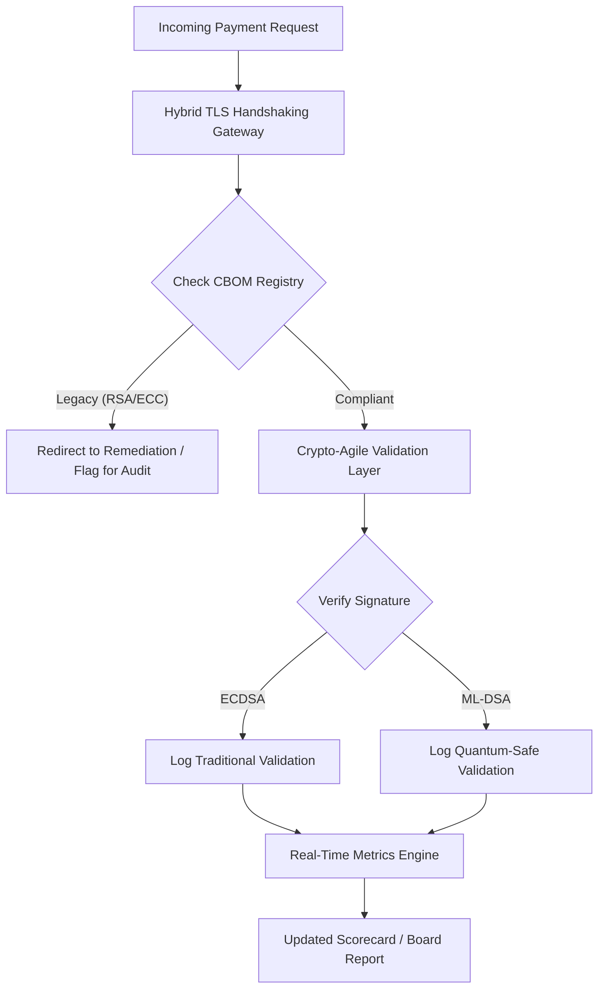

## 2026 குவாண்டம்-பிந்தைய பாதுகாப்பு ஸ்கோர்கார்டு: நம்பிக்கைப் பொறுப்பு கிரிப்டோகிராஃபிக் சுறுசுறுப்புக்கான ஒரு இயக்குநர் குழு-நிலை அளவீட்டு கட்டமைப்பு

குவாண்டம்-பிந்தைய பாதுகாப்பு இனி ஒரு ஆராய்ச்சித் திட்டமல்ல. "மேற்பார்வைக் கடிகாரம்" 2020-களின் பிற்பகுதியில் அமலாக்கக் காலக்கெடுவை நோக்கி நகர்ந்து கொண்டிருக்கிறது. [NIST FIPS 203 (ML-KEM)](https://csrc.nist.gov/pubs/fips/203/final) மற்றும் [NIST FIPS 204 (ML-DSA)](https://csrc.nist.gov/pubs/fips/204/final) இறுதி செய்யப்பட்டதன் மூலம் விசை உள்ளடக்கம் (key encapsulation) மற்றும் டிஜிட்டல் கையொப்பங்களுக்கான தரநிலைகள் குறியீடாக்கப்பட்டுள்ளன.

ஒழுங்குமுறை அமைப்புகள் இப்போது முதல்-அடுக்கு வங்கிகள் முன்னோடித் திட்டங்களைக் கடந்து செல்ல வேண்டும் என்று எதிர்பார்க்கின்றன. 2026-ல், கவனம் இந்தத் தரநிலைகளின் தொழில்மயமாக்கலுக்கு மாறியுள்ளது. தெளிவான இடமாற்றப் பாதையை நிரூபிக்கத் தவறுவது [டிஜிட்டல் இயக்கச் செயல்பாட்டு தாங்குதிறன் சட்டம் (DORA)](https://eur-lex.europa.eu/eli/reg/2022/2554/oj)-ன் கீழ் கணிசமான ஒழுங்குமுறை அபராதங்களைச் சுமத்துகிறது, மேலும் குவாண்டம்-இயலூக்கப்பட்ட மறைகுறியாக்க முறிப்பின் முன்கூட்டியே அறியக்கூடிய அச்சுறுத்தலை புறக்கணிக்கும் இயக்குநர்களுக்கு தனிப்பட்ட பொறுப்பையும் உண்டாக்கக்கூடும்.

## 01. இயக்குநர் குழு-நிலை குவாண்டம் ஸ்கோர்கார்டு

வணிக மற்றும் முதலீட்டு வங்கி (CIB) தளங்கள் முழுவதும் குவாண்டம் தயார்நிலை மற்றும் கிரிப்டோகிராஃபிக் ஆரோக்கியத்தை மதிப்பீடு செய்வதற்கு இயக்குநர் குழுக்களுக்கு பின்வரும் அளவீடுகள் ஒரு தரப்படுத்தப்பட்ட கட்டமைப்பை வழங்குகின்றன.

### அட்டவணை 1: PQC ஸ்கோர்கார்டு அளவீடுகளும் சகிப்புத்தன்மைகளும்

| அளவீடு | கணித சூத்திரம் | இயக்குநர் குழு-அங்கீகரிக்கப்பட்ட சகிப்புத்தன்மைகள் | சகிப்புத்தன்மைக்கு வெளியே இருந்தால் அபாயம் |
| ---- | ---- | ---- | ---- |
| **சரக்குப் பட்டியல் முழுமை சதவீதம் (ICP)** | (அடையாளம் காணப்பட்ட கிரிப்டோ சொத்துக்கள் / மொத்த மதிப்பிடப்பட்ட சொத்துக்கள்) × 100 | > 98% | உயர்-மதிப்பு தீர்வுத் தரவுப் பாதைகளில் நிழல் குறியாக்கமும் குருட்டுப் புள்ளிகளும். |
| **HNDL வெளிப்பாட்டு விகிதம் (HER)** | (பாரம்பரிய கிரிப்டோவில் நீண்டகால தரவு / மொத்த நீண்டகால தரவு) × 100 | < 5% | வர்த்தக ரகசியங்கள், இறையாண்மைக் கடன் பேரேடுகள், மற்றும் மொத்தக் கட்டணப் பதிவுகளின் நிரந்தரக் குலைவு. |
| **NIST இடமாற்ற முன்னேற்ற விகிதம் (MPR)** | (FIPS 203/204 இயங்கும் அமைப்புகள் / மொத்த முக்கிய அமைப்புகள்) × 100 | > 60% (2026 ஆண்டு இறுதிக்குள்) | ஒழுங்குமுறை இணக்கமின்மையும் G20-சீரமைக்கப்பட்ட எதிர்தரப்புகளிலிருந்து விலக்கமும். |
| **கிரிப்டோ-சுறுசுறுப்பு தயார்நிலை குறியீடு (CARI)** | (சுருக்கப்பட்ட கிரிப்டோ அடுக்குகள் கொண்ட செயலிகள் / மொத்த முக்கிய செயலிகள்) × 100 | > 85% | கடுமையான தொழில்நுட்பக் கடனும் எதிர்கால அல்காரிதம் நீக்கங்களுக்குப் பதிலளிக்க இயலாமையும். |

## 02. கிரிப்டோகிராஃபிக் பொருள் பட்டியல் (CBOM)

ICP அளவீடு ஒரு விரிவான **CBOM கண்டுபிடிப்பு கட்டம்** வழியாக அடிப்படை நிலைப்படுத்தப்படுகிறது. இது நிறுவனத்திற்குள் உள்ள ஒவ்வொரு கிரிப்டோகிராஃபிக் இறுதிப்புள்ளியையும் அடையாளம் காணும் ஒரு தானியங்கிச் செயல்முறை ஆகும்.

- **இறுதிப்புள்ளி கண்டுபிடிப்பு:** பாரம்பரிய RSA அல்லது ECC பயன்பாட்டைக் கண்டறிய, செயலில் உள்ள TLS அமர்வுகளுக்கு உள் மற்றும் கிளவுட் நெட்வொர்க்குகளை ஸ்கேன் செய்தல்.
- **விசை சரக்குப் பட்டியல்:** பொது/தனி விசை ஜோடிகளை அவற்றின் உரிமையாளர்களுடன் வரைபடமாக்குதல் மற்றும் சரியான காலாவதி தேதிகளை வரைபடமாக்குதல்.
- **சார்பு வரைபடமாக்கல்:** நீக்கப்பட்ட அல்காரிதம்களை நம்பியிருக்கும் மூன்றாம் தரப்பு நூலகங்கள் மற்றும் APIகளை அடையாளம் காணுதல்.

இந்தக் கண்டுபிடிப்பு கட்டம் ஒரு ஒற்றை உண்மை மூலத்தை உருவாக்குகிறது, இது நிதிச் செயல்திறனுக்கு இணையான நுட்பத்துடன் கிரிப்டோகிராஃபிக் ஆரோக்கியம் குறித்து அறிக்கையிட CISO-வை இயலச் செய்கிறது.

## 03. மொத்தக் கட்டணங்களில் HNDL வெளிப்பாட்டை அகற்றுதல்

எதிரிகள் மொத்தக் கட்டணங்களையும் நீண்டகால பெருநிறுவனத் தரவுத்தளங்களையும் தீவிரமாக இலக்கு வைக்கின்றனர். இந்த "Harvest-Now-Decrypt-Later" (HNDL) தாக்குதல்கள் இன்றைய குறியாக்கப்பட்ட போக்குவரத்தைத் தடுத்து காப்பகப்படுத்துவதை உள்ளடக்கியது.

இன்று கிரிப்டோகிராஃபிக் ரீதியாக பொருத்தமான குவாண்டம் கணினி (CRQC) இல்லாவிட்டாலும், இப்போது தடுக்கப்பட்ட தரவு எதிர்காலத்தில் பாதிப்புக்குள்ளாகும். இதைத் தணிக்க நீண்டகால தரவின் (எ.கா., அடையாளப் பதிவுகள், 30-ஆண்டு பத்திர ஒப்பந்தங்கள், மற்றும் சட்டக் காப்பகங்கள்) உயர்-முன்னுரிமை இடமாற்றம் தேவை, இது HER அளவீட்டை நேரடியாகக் குறைக்கிறது. கட்டண வழிகளைக் கலப்பின PQC-பாரம்பரிய குறியாக்கத்திற்கு (X25519-உடன் ML-KEM பயன்படுத்தி) மேம்படுத்துவது காப்பக அச்சுறுத்தல்களுக்கு எதிராக உடனடிப் பாதுகாப்பை வழங்குகிறது.

## 04. நன்கு வடிவமைக்கப்பட்ட இடைமுகங்கள் வழியாக கிரிப்டோ-சுறுசுறுப்பை செயல்படுத்துதல்

கிரிப்டோ-சுறுசுறுப்பு பொறியியல் சுருக்கமாக்கங்கள் வழியாக உணரப்படுகிறது. [KyberLib](https://sebastienrousseau.com/2026-06-12-kyberlib-post-quantum-banking-migration-standards-code-2026) போன்ற நவீன நூலகங்கள், முழு செயலி அடுக்கையும் மீண்டும் எழுதாமல் டெவலப்பர்கள் குவாண்டம்-பாதுகாப்பு தொகுதிகளை எவ்வாறு செயல்படுத்தலாம் என்பதை நிரூபிக்கின்றன.

- **சுருக்கப்பட்ட மறைப்புகள் (Wrappers):** செயலிகள் அல்காரிதம்-குறிப்பிட்ட வழக்கங்களை விட ஒரு பொதுவான `encrypt()` அல்லது `sign()` செயற்பாட்டை அழைக்கின்றன.
- **இயக்க-நேர மாற்றம்:** அடிப்படைத் தொகுதியை சிக்கலான குறியீட்டு பதிப்புகளை விட உள்ளமைவு மாற்றங்கள் வழியாக ECDSA-விலிருந்து ML-DSA-க்கு மாற்றலாம்.

இந்தக் கட்டமைப்பு, எதிர்காலத்தில் ஒரு குறிப்பிட்ட PQC அல்காரிதம் குலைந்தால், நிறுவனம் ஆண்டுகளுக்குப் பதிலாக மணிநேரங்களில் மாறிக்கொள்ள முடியும் என்பதை உறுதிசெய்கிறது.

## 05. குவாண்டம்-பாதுகாப்பு உள்நுழைவு சரிபார்ப்பு பணிப்பாய்வு

பின்வரும் வரைபடம், ஒரு குவாண்டம்-சுறுசுறுப்பு வங்கிச் சூழலில் பாதுகாப்பு எல்லைக்குள் நுழையும் தரவின் வாழ்க்கைச் சுழற்சியை விளக்குகிறது.

## முடிவுரை

ஒரு முதல்-அடுக்கு வங்கியின் கிரிப்டோகிராஃபிக் தளம் இனி ஒரு CISO கவலை அல்ல. அது நம்பிக்கைப் பொறுப்புக் கட்டமைப்பு. NIST FIPS 203 மற்றும் 204 அல்காரிதம்களை நிர்ணயிக்கின்றன; DORA பிரிவு 5 பொறுப்புக்கூறல் மேற்பரப்பை நிர்ணயிக்கிறது; SM&CR அதை ஒரு பெயரிடப்பட்ட மூத்த மேலாளருடன் பிணைக்கிறது. மேலே உள்ள ஸ்கோர்கார்டு — சரக்குப் பட்டியல் முழுமை, HNDL வெளிப்பாடு, இடமாற்ற முன்னேற்றம், கிரிப்டோ-சுறுசுறுப்பு — கிரிப்டோகிராஃபிக் குறியீட்டைப் படிக்க வேண்டிய அவசியமின்றி அந்தத் தளத்தை ஆளுகை செய்ய இயக்குநர் குழுவுக்குத் தேவையான நான்கு எண்களை வழங்குகிறது.

மிக முக்கியமான எண் HNDL வெளிப்பாடு ஆகும். இன்று ஒரு மொத்த-கட்டணக் காப்பகத்தில் அமர்ந்திருக்கும் ஒவ்வொரு பாரம்பரிய-குறியாக்கப் பதிவும், முதல் கிரிப்டோகிராஃபிக் ரீதியாக பொருத்தமான குவாண்டம் கணினி அனுப்பப்படும் நாளில் வாசிக்கக்கூடியதாக இருக்கும். எண்ணிக்கை அமைதியானதும் சமச்சீரற்றதுமாகும்: பாதுகாப்பாளர்கள் தாங்கள் வைத்திருக்கும் தரவின் மீது மட்டுமே செயல்பட முடியும், எதிரிகள் பல ஆண்டுகளுக்கு முன்பே தாங்கள் வெளியேற்றிய தரவின் மீது செயல்பட முடியும். 2024-ல் RSA-2048-உடன் குறியாக்கப்பட்ட ஒரு 30-ஆண்டு பெருநிறுவனப் பத்திர ஒப்பந்தம், ஒரு CRQC செயலில் வரும் நாளில் அதன் ரகசியத்தன்மை உத்தரவாதத்தை இழக்கும் ஒப்பந்தம் ஆகும்.

[KyberLib](https://sebastienrousseau.com/2026-06-12-kyberlib-post-quantum-banking-migration-standards-code-2026) மற்றும் அதன் இணைநிலைகள் இதை ஒரு பல-ஆண்டு தளம் மறு-எழுத்திலிருந்து ஒரு உள்ளமைவு மாற்றமாக மாற்றுகின்றன. குறியீட்டை எழுதுவது இயக்குநர் குழுவின் வேலை அல்ல. கிரிப்டோ-சுறுசுறுப்பு தயார்நிலை குறியீடு — ஒரு சுருக்கப்பட்ட கிரிப்டோகிராஃபிக் இடைமுகத்தின் பின்னால் உள்ள முக்கிய செயலிகளின் பங்கு — பன்னிரண்டு மாதங்களுக்குள் 85% வழியாக நகர வேண்டும் என்று கோருவதும், காலாண்டு ஸ்கோர்கார்டைப் படிப்பதும் இயக்குநர் குழுவின் வேலை.
