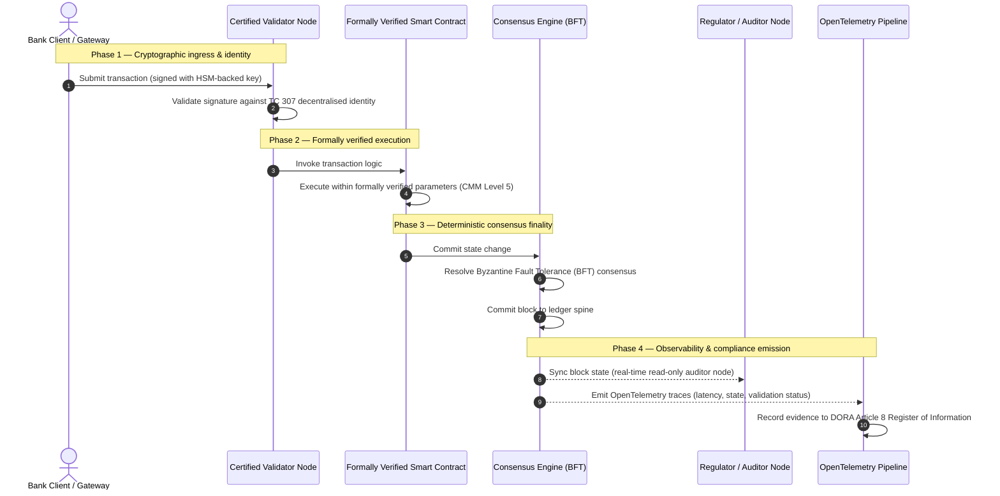

## சாட்சியத்திலிருந்து உண்மைக்கு: அடுத்த வங்கி நம்பிக்கை யுகத்தை சான்றளிக்கப்பட்ட பிளாக்செயின்கள் ஏன் வரையறுக்கும்

## நிறைவேற்று சுருக்கம் & மூலோபாய சூழல் (TL;DR)

2026-ல் மொத்த வங்கியியலும் உலகளாவிய பரிவர்த்தனைகளும் ஒரு வரலாற்று மாற்றப் புள்ளியில் அமர்ந்துள்ளன. நிதிச் சேவைகள் இயல்பாகவே டிஜிட்டல், நிகழ்நேர அழிப்பு (clearing) வலைப்பின்னல்களுக்கு மாறுவதாலும், செயற்கை நுண்ணறிவு நிகழ்தகவு அடிப்படையிலான தீர்மானமின்மையை அறிமுகப்படுத்துவதாலும், பாரம்பரிய அனலாக், முன்னோக்கிய உத்தரவாத மாதிரிகள் (நிலையான நிறுவன-அடிப்படையிலான தணிக்கைகள் போன்றவை) நவீன அபாய மேலாண்மை மற்றும் நம்பிக்கைப் பொறுப்பு தேவைகளைப் பூர்த்திசெய்யத் தவறுகின்றன.

ISO/IEC தொழில்நுட்பக் குழு 307 (TC 307) பரவலாக்கப்பட்ட லெட்ஜர் தொழில்நுட்பங்களுக்கு ஒரு தரப்படுத்தப்பட்ட அடிப்படையை நிறுவியுள்ளது. இருப்பினும், உண்மையான நிறுவன மற்றும் அமைப்பு ரீதியிலான ஏற்றுக்கொள்ளலுக்கு விவரணை வழிகாட்டுதலிலிருந்து பரிந்துரைக்கும், சுயாதீனமாக சான்றளிக்கக்கூடிய பிளாக்செயின் உத்தரவாதத்திற்கு மாறுவது தேவைப்படுகிறது. லெட்ஜர் ஆளுகை, ஒருமித்த ஒருமைப்பாடு, ஸ்மார்ட் கான்ட்ராக்ட் பாதுகாப்பு மற்றும் குறியாக்கவியல் நெகிழ்வுத்தன்மையை ஒரு கண்டிப்பான 5-நிலை திறன் முதிர்ச்சி மாதிரிக்கு (CMM) எதிராக மதிப்பிடுவதன் மூலம், வங்கிகள் ஒட்டுவேலை, விற்பனையாளர்-குறிப்பிட்ட அனுமானங்களிலிருந்து சான்றளிக்கக்கூடிய, வாரியத்தால்-தணிக்கை செய்யக்கூடிய நிதி உண்மைக்கு நகரலாம்.

## முக்கிய கருத்துகள்

* **நம்பிக்கைப் பொறுப்பு உராய்வு இடைவெளி**: நாம் தற்போது வங்கியை (Basel III), கிளவுடை (ISO 27001), மற்றும் AI ஆளுகை அமைப்புகளை (ISO 42001) சான்றளிக்க முடியும், ஆனால் எது உண்மை என்பதை பெருகிய முறையில் தீர்மானிக்கும் பரவலாக்கப்பட்ட லெட்ஜரை நம்மால் இன்னும் சான்றளிக்க முடியாது. இந்த சமச்சீரின்மை ஒரு முக்கிய செயல்பாட்டு பலவீனம்.
* **DORA நேரடி நம்பிக்கைப் பொறுப்பை அமல்படுத்துகிறது**: DORA பிரிவு 5-இன் கீழ், வங்கி இயக்குநர் வாரியங்கள் அனைத்து மூன்றாம்-தரப்பு மற்றும் லெட்ஜர் வரிசைப்படுத்தல்களின் செயல்பாட்டு பின்னடைவுத் திறனுக்கு நேரடியான, ஒப்படைக்க முடியாத தனிநபர் பொறுப்பை சுமக்கிறார்கள், தோல்விகளுக்கு கடுமையான SM&CR தனிநபர் தண்டனைகளுடன்.
* **AI தணிக்கை முதுகெலும்பு**: இயந்திர கற்றல் மீள்உருவாக்க முடியாத, நிகழ்தகவு அடிப்படையிலான விளைவுகளை அறிமுகப்படுத்தினாலும், சான்றளிக்கப்பட்ட பிளாக்செயின் தீர்மானமான நிலை பிடிப்பை வழங்குகிறது. மாதிரி பதிப்புகள், உள்ளீடுகள் மற்றும் சரிபார்ப்பு முடிவுகளை செயின்-மீது பதிவு செய்வது ISO 42001 மற்றும் மாதிரி அபாய மேலாண்மை தரநிலைகளை திருப்திப்படுத்துகிறது.
* **சான்றளிக்கப்பட்ட பிளாக்செயின் குறியீடு**: இந்தக் குறியீடு ஆளுகை, ஒருமித்தல், ஸ்மார்ட் கான்ட்ராக்ட்கள் மற்றும் கண்காணிப்பை 0-லிருந்து-5 CMM அளவீட்டில் சரிபார்க்கக்கூடிய, தணிக்கைக்கு-தயார் மதிப்பெண் அட்டையாக முறைப்படுத்தி, பொறியியல் அளவீடுகளை வாரியத்தால்-அங்கீகரிக்கப்பட்ட அபாய விருப்ப அறிக்கைகளாக மொழிபெயர்க்கிறது.

## 01. டிஜிட்டல் வங்கியியலில் நம்பிக்கைப் பொறுப்பு உராய்வு இடைவெளி

பாரம்பரிய வங்கியியலில், நம்பிக்கை உறவு சார்ந்தது, நிறுவனம் சார்ந்தது மற்றும் முன்னோக்கியது. இது இருதரப்பு லெட்ஜர் தனிமைப்படுத்தல்களில் முரண்பாடுகளை சரிகட்டி, நிலையான நேரப் புள்ளிகளில் நிதி நிலையை மதிப்பாய்வு செய்யும் சுயாதீன, மூன்றாம்-தரப்பு தணிக்கையாளர்களைச் சார்ந்துள்ளது. 2026-இன் நிகழ்நேர, API-இயக்கப்பட்ட சந்தைகளில், இந்த மாதிரி தடைசெய்யும் தாமதங்களையும் கட்டமைப்பு அபாயங்களையும் அறிமுகப்படுத்துகிறது.

பரிவர்த்தனைகள் உடனடியாக தீர்வாகும்போது, நாள்-உள்ளக நீர்மையக் குளங்கள் API நுழைவாயில்களால் மாறும்முறையில் நிர்வகிக்கப்படும்போது, மற்றும் சொத்து உரிமை பகிரப்பட்ட லெட்ஜர்களில் டோக்கனைஸ் செய்யப்படும்போது, முன்னோக்கிய தணிக்கைகள் தடுப்புக் கட்டுப்பாடுகள் என்பதைவிட தடயவியல் பயிற்சிகளாக மாறுகின்றன. நம்பிக்கைப் பொறுப்பாளர்கள் இனி நிறுவன அமைப்பை மட்டும் சான்றளிப்பதை நம்பியிருக்க முடியாது. அவர்கள் டிஜிட்டல் அடித்தளத்தையே சான்றளிக்க வேண்டும்.

தற்போது, வங்கிகள் ஒரு தெளிவான கட்டமைப்பு சமச்சீரின்மையின் கீழ் இயங்குகின்றன:

1. **சான்றளிக்கப்பட்ட கிளவுட் உள்கட்டமைப்பு**: வன்பொருள் முனைகள், மெய்நிகராக்கப்பட்ட கொள்கலன்கள் மற்றும் இயற்பியல் தரவு மையங்கள் ISO/IEC 27001 மற்றும் SOC 2 Type II கட்டுப்பாடுகளுக்கு எதிராக சரிபார்க்கப்படுகின்றன.
2. **சான்றளிக்கப்பட்ட மேலாண்மை செயல்முறைகள்**: செயல்பாட்டு அபாயக் கொள்கைகள், வணிக தொடர்ச்சி திட்டங்கள் மற்றும் அல்காரிதம் வரிசைப்படுத்தல்கள் கண்டிப்பான அபாய கட்டமைப்புகளின் கீழ் ஆளப்படுகின்றன.
3. **சான்றளிக்கப்படாத லெட்ஜர் இயந்திரங்கள்**: முக்கிய பரவலாக்கப்பட்ட ஒருமித்தல் வழிமுறைகள், சரிபார்ப்பாளர் முனை விநியோகச் சங்கிலிகள், ஸ்மார்ட் கான்ட்ராக்ட் எல்லைகள் மற்றும் வலைப்பின்னல் ஆளுகை மாதிரிகள் சான்றளிக்கப்படாத, தனிப்பயன் அல்லது கூட்டமைப்பு-குறிப்பிட்ட அனுமானங்களுக்கு விடப்படுகின்றன.

இந்த சமச்சீரின்மை ஒரு முக்கிய தோல்விப் புள்ளியாகும். ஒரு வங்கி பாதுகாப்பான, ISO 27001-சான்றளிக்கப்பட்ட கிளவுட் கொள்கலனுக்குள் சரிபார்க்கப்பட்ட பயன்பாட்டை இயக்கலாம், ஆனால் அந்தக் கொள்கலன் மையப்படுத்தப்பட்ட சரிபார்ப்பாளர் கட்டுப்பாடு, பாதிக்கக்கூடிய ஒருமித்தல் அளவுருக்கள் அல்லது தணிக்கை-செய்யப்படாத ஸ்மார்ட் கான்ட்ராக்ட்கள் கொண்ட பரவலாக்கப்பட்ட லெட்ஜருக்கு எழுதினால், பரிவர்த்தனை ஒருமைப்பாடு சமரசம் செய்யப்படுகிறது. இந்த இடைவெளியைக் கடக்க, லெட்ஜர் இயந்திரமே ஒரு சான்றளிக்கக்கூடிய உத்தரவாத பொருளாக மாற வேண்டும்.

## 02. ISO/IEC TC 307 தரப்படுத்தல் அடிப்படை

பரவலாக்கப்பட்ட லெட்ஜர்களை தரப்படுத்த தேவையான அடித்தள வேலை ISO/IEC தொழில்நுட்பக் குழு 307 (TC 307) (பிளாக்செயின் மற்றும் பரவலாக்கப்பட்ட லெட்ஜர் தொழில்நுட்பங்கள்) மூலம் நிறுவப்படுகிறது. பிளாக்செயினை ஒரு தனிமைப்படுத்தப்பட்ட தொழில்நுட்ப நெறிமுறையாகக் கருதுவதற்குப் பதிலாக, TC 307 அதை ஒரு நிறுவன நம்பிக்கை உள்கட்டமைப்பாக அணுகுகிறது, தனது வேலையை ஐந்து முக்கிய தூண்களில் ஒழுங்கமைக்கிறது:

1. **வகைப்பாடு மற்றும் சொல்லகராதி (ISO 22739)**: வெவ்வேறு அதிகார எல்லைகள், நிதித் திட்டங்கள் மற்றும் நிறுவனங்கள் முழுவதும் நிலையான சட்ட மற்றும் செயல்பாட்டு வரையறைகளை உறுதிசெய்து, ஒரு பொதுவான பெயரிடல் முறையை நிறுவுகிறது.
2. **குறிப்பு கட்டமைப்பு (ISO/TR 23245)**: இணக்கமான பரவலாக்கப்பட்ட லெட்ஜர் அமைப்பின் எல்லைகள், அடுக்குகள், தரவு ஓட்டங்கள் மற்றும் செயல்பாட்டு கூறுகளை வரையறுக்கிறது.
3. **பாதுகாப்பு, தனியுரிமை மற்றும் ஸ்மார்ட் கான்ட்ராக்ட்கள் (ISO/TR 23244 / ISO 23613)**: டிஜிட்டல் சொத்து அமைப்புகளுக்கான அடிப்படை பாதுகாப்பு வழிகாட்டுதல்களை நிறுவி, ஸ்மார்ட் கான்ட்ராக்ட் பாதிப்பு தணிப்பு மற்றும் வாழ்க்கைச்சுழற்சி ஆளுகைக்கான சிறந்த நடைமுறைகளை விவரிக்கிறது.
4. **இடைச்செயல்பாட்டு கட்டமைப்புகள்**: பன்முகத்தன்மை கொண்ட லெட்ஜர் வலைப்பின்னல்களுக்கு இடையேயான தரவு மற்றும் சொத்து-பரிமாற்ற வழிமுறைகளை நிவர்த்திசெய்து, தனிமைப்படுத்தப்பட்ட டோக்கனைஸ்டு தனிமைப்படுத்தல்கள் உருவாவதைத் தடுக்கிறது.
5. **பரவலாக்கப்பட்ட அடையாளம் மற்றும் நம்பிக்கை நங்கூரங்கள்**: லெட்ஜர்-அடிப்படையிலான குறியாக்கவியல் அடையாளங்காட்டிகளை முறையான பொது-விசை உள்கட்டமைப்புகளுடன் (PKI) மற்றும் அரசால்-அங்கீகரிக்கப்பட்ட பதிவேடுகளுடன் ஒருங்கிணைக்கிறது.

கூட்டாக, TC 307 DLT-ஐ ஒரு தனிப்பயன் பொறியியல் தேர்விலிருந்து ஒரு தரப்படுத்தப்பட்ட கட்டமைப்பு ஒழுங்குமுறையாக மாற்றுவதைச் சமிக்ஞை செய்கிறது. இருப்பினும், TC 307 முதன்மையாக விவரணையாகவே இருக்கிறது. நல்லது எப்படி இருக்கும் (வழிகாட்டுதல்) என்பதை அது வரையறுக்கிறது, ஆனால் முக்கிய அல்லது முக்கியமான செயல்பாடுகளின் (CIFs) உற்பத்தி வரிசைப்படுத்தல்களை அங்கீகரிக்க அபாய அதிகாரிகள் மற்றும் மேற்பார்வையாளர்கள் தேவைப்படும் பரிந்துரைக்கும் சரிபார்ப்பு நெறிமுறையை (உத்தரவாதம்) அது வழங்கவில்லை.

## 03. வழிகாட்டுதல் vs. உத்தரவாதம்: நம்பிக்கைப் பொறுப்பு வேறுபாடு

நிதிச் சந்தை பங்கேற்பாளர்கள் தொழில்நுட்பம் புதுமையானது அல்லது நேர்த்தியானது என்பதற்காக வரிசைப்படுத்துவதில்லை; அதை ஆளக்கூடியது, தணிக்கை செய்யக்கூடியது, பாதுகாக்கக்கூடியது மற்றும் மூலதன இருப்புத் தேவைகளுடன் சரிகட்டக்கூடியது ஆகும்போது அவர்கள் வரிசைப்படுத்துகிறார்கள். இதனால்தான் வங்கியியலில் தரப்படுத்தல் இயல்பாகவே இரண்டு அடுக்குகளாகத் தீர்வாகிறது:

* **வழிகாட்டுதல் (கட்டமைப்பு)**: சிறந்த நடைமுறைகள், குறிப்பு இலக்குகள் மற்றும் கட்டமைப்பு வழிகாட்டுதல்களை கோடிட்டுக் காட்டுகிறது (எ.கா., ISO/IEC TC 307, NIST கட்டமைப்புகள்).
* **உத்தரவாதம் (சான்று)**: கட்டமைப்பு வடிவமைக்கப்பட்டபடி செயல்படுத்தப்பட்டு இயங்குகிறது என்பதற்கான சுயாதீன, தொடர்ச்சியான மற்றும் மூன்றாம்-தரப்பால்-சரிபார்க்கக்கூடிய சாட்சியத்தை வழங்குகிறது (எ.கா., ISO 27001 சான்றளிப்பு, SOC 2 தணிக்கைகள், ஒழுங்குமுறை ஆய்வுகள்).

கிளவுட் உள்கட்டமைப்பை சான்றளிக்கும் அதே வேளையில் சான்றளிக்கப்படாத லெட்ஜர் ஒருமித்தலை நம்பியிருப்பது ஒரு முக்கியமான ஒழுங்குமுறை இடைவெளியாகும். "மாறாத" ஒரு பிளாக்செயின் அவசியம் "நிறுவன ரீதியாக நம்பப்பட்டது" அல்ல. மாறாத்தன்மை உள்ளிடப்பட்ட தரவு மாறாமல் இருப்பதை மட்டுமே உறுதிசெய்கிறது; சரிபார்ப்பாளர் முனைகள் பாதுகாப்பானவை என்பதையோ, ஒருமித்தல் நெறிமுறை கூட்டுச்சேர்க்கைக்கு எதிராக பின்னடைவுத் திறன் கொண்டது என்பதையோ, ஸ்மார்ட் கான்ட்ராக்ட் தர்க்கம் கணித ரீதியாக சரியானது என்பதையோ, அல்லது குறியாக்கவியல் விசை மேலாண்மை குவாண்டம்-பிந்தைய கட்டளைகளுக்கு இணங்குகிறது என்பதையோ அது சரிபார்க்காது.

இந்த இடைவெளியை மூட, 2026 சான்றளிக்கப்பட்ட பிளாக்செயின் குறியீடு இந்தத் தேவைகளை உலகளாவிய வங்கி ஒழுங்குமுறைகளுக்கு இணைக்கப்பட்ட அளவிடக்கூடிய திறன் முதிர்ச்சி மாதிரியாக (CMM) முறைப்படுத்துகிறது.

## 04. 2026 சான்றளிக்கப்பட்ட பிளாக்செயின் குறியீடு

மூத்த நிர்வாகம் தங்கள் லெட்ஜர் தளங்களை மதிப்பீடு செய்து சான்றளிக்க உதவ, இந்தக் குறியீடு பரவலாக்கப்பட்ட லெட்ஜர் உள்கட்டமைப்பை ஐந்து தணிக்கை செய்யக்கூடிய செயல்பாட்டு அடுக்குகளாக அமைத்து, 0-லிருந்து-5 CMM அளவீட்டில் மதிப்பிடுகிறது.

## அட்டவணை 1: சான்றளிக்கப்பட்ட பிளாக்செயின் குறியீட்டு கட்டமைப்பு

| குறியீட்டு அடுக்கு | திறன் முதிர்ச்சி நிலை (CMM) | தொழில்நுட்ப மற்றும் செயல்பாட்டு அளவீடு | ஒழுங்குமுறை / நம்பிக்கைப் பொறுப்பு கட்டுப்பாட்டு குறிப்பு |
| ---- | ---- | ---- | ---- |
| **லெட்ஜர் ஆளுகை** | **நிலை 0**: தற்காலிக கூட்டமைப்பு**நிலை 3**: தானியங்கு சரிபார்ப்பாளர் ஆய்வு & சுழற்சி**நிலை 5**: பரவலாக்கப்பட்ட, பல-தரப்பு குறியாக்கவியல் அடையாள நங்கூரமிடல் | சரிபார்க்கப்பட்ட நிதி நிறுவனங்களால் இயக்கப்படும் சரிபார்ப்பாளர் முனைகளின் %; சரிபார்ப்பாளர் தகராறுகளைத் தீர்க்கும் சராசரி நேரம்; முனைகளின் புவியியல் விநியோகம் | **DORA பிரிவு 5** (ஆளுகை மற்றும் அமைப்பு); **CPMI-IOSCO PFMI கொள்கை 2** (ஆளுகை) & **கொள்கை 3** (அபாயங்களின் விரிவான மேலாண்மைக்கான கட்டமைப்பு) |
| **ஒருமித்த ஒருமைப்பாடு** | **நிலை 0**: ஒற்றை-முனை அல்லது ஒளிபுகா POW**நிலை 3**: தீர்மானமான இறுதிநிலையுடன் தணிக்கை செய்யப்பட்ட BFT**நிலை 5**: தொடர்ச்சியான தாமத கண்காணிப்புடன் பல-அதிகார எல்லை, முறையாக சரிபார்க்கப்பட்ட ஒருமித்தல் | அதிகபட்ச சகிக்கக்கூடிய ஒருமித்தல் தாமதம்; கூட்டுச்சேர்க்கை-எதிர்ப்பு வரம்பு; உருவகப்படுத்தப்பட்ட முனை பிரிவின் கீழ் இயங்குநேர SLA | **DORA பிரிவு 6** (ICT அபாய மேலாண்மை கட்டமைப்பு); **CPMI-IOSCO PFMI கொள்கை 8** (தீர்வு இறுதிநிலை) |
| **அடையாளம் & குறியாக்கவியல்** | **நிலை 0**: பலவீனமான RSA / ECDSA விசைகள்**நிலை 3**: HSM-ஆதரவு விசை மேலாண்மையுடன் மல்டி-சிக்**நிலை 5**: குவாண்டம்-பாதுகாப்பான கலப்பின விசைகள் (FIPS 203 ML-KEM) மற்றும் பூஜ்ஜிய-அறிவு தனியுரிமை வாயில்கள் | HSM-ஆதரவு விசைகளுடன் கையொப்பமிடப்பட்ட லெட்ஜர் பரிவர்த்தனைகளின் %; PQC இடம்பெயர்வு தயார்நிலை மதிப்பெண்; ZK-சான்று தாமதம் | **NIST FIPS 203 / 204**; **ISO/IEC 27001** (தகவல் பாதுகாப்பு மேலாண்மை) |
| **ஸ்மார்ட் கான்ட்ராக்ட் உத்தரவாதம்** | **நிலை 0**: தணிக்கை-செய்யப்படாத solidity ஸ்கிரிப்ட்கள்**நிலை 3**: தானியங்கு தொகுப்பி சரிபார்ப்பு & வெளிப்புற தணிக்கை**நிலை 5**: சர்க்யூட்-பிரேக்கர் மேம்பாடுகளுடன் முறையாக சரிபார்க்கப்பட்ட, மாறாத ஸ்மார்ட் கான்ட்ராக்ட்கள் | கணித முறையான சரிபார்ப்புடன் கூடிய ஸ்மார்ட் கான்ட்ராக்ட்களின் %; தொகுப்பி எச்சரிக்கைகளின் எண்ணிக்கை; பாதிப்பு ஸ்கேன் கவரேஜ் | **அவுட்சோர்சிங் ஏற்பாடுகள் குறித்த EBA வழிகாட்டுதல்கள்** (பத்திகள் 81, 113-117); **DORA பிரிவு 30** (குறைந்தபட்ச ஒப்பந்த விதிமுறைகள்) |
| **தணிக்கை & கண்காணிப்பு** | **நிலை 0**: கைமுறை பதிவு சுரண்டல்**நிலை 3**: கட்டமைக்கப்பட்ட OTel தடயங்கள் & படிக்க-மட்டும் தணிக்கையாளர் முனைகள்**நிலை 5**: பிரிவு 8 பதிவேட்டுக்கு தானியங்கு, தொடர்ச்சியான சரிகட்டல் | OpenTelemetry தடயங்களால் மூடப்பட்ட பரிவர்த்தனைகளின் %; லெட்ஜர் தொகுதி-ஒப்படைப்பிலிருந்து தணிக்கையாளர்-முனை ஒத்திசைவுக்கான தாமதம் | **BCBS 239** (அபாய தரவு திரட்டல்); **DORA பிரிவு 8** (தகவல் பதிவேடு / ITS ஸ்கீமாக்கள்) |

## அட்டவணை 2: உலகளாவிய வங்கி தரநிலைகளுக்கு இணைக்கப்பட்ட முக்கிய நம்பிக்கை சமிக்ஞைகள்

| சமிக்ஞை / அளவுகோல் | அளவீடு | வங்கி தளங்களில் தாக்கம் | ஒழுங்குமுறை மூலம் |
| ---- | ---- | ---- | ---- |
| **ISO/IEC TC 307 முன்னேற்றம்** | ISO/TR தொழில்நுட்ப அறிக்கைகளிலிருந்து முறையான சான்றளிப்பு திட்டங்களுக்கு மாற்றம் | பரவலாக்கப்பட்ட லெட்ஜர் இயந்திரங்களை சான்றளிப்பதற்கான முதல் தரப்படுத்தப்பட்ட கட்டமைப்பை நிறுவுகிறது | **ISO/IEC JTC 1 / SC 44** (பரவலாக்கப்பட்ட லெட்ஜர் தொழில்நுட்பங்கள்) |
| **Project Agorá முன்மாதிரி கட்டம்** | 40+ பங்கேற்கும் வணிக வங்கிகள்; டோக்கனைஸ்டு வைப்புகளின் ஒருங்கிணைந்த லெட்ஜர் சோதனை | எல்லை-கடந்த அழிப்பை செய்தியனுப்பலிலிருந்து (SWIFT) அணு டோக்கனைஸ்டு தீர்வுக்கு மாற்றுகிறது | **சர்வதேச தீர்வுக்கான வங்கி (BIS) புதுமை மையம்** |
| **DORA பிரிவு 30 மூன்றாம்-தரப்பு தணிக்கை** | 100% முனை வழங்குநர்கள் மற்றும் உள்கட்டமைப்பு புரவலர்கள் பாதுகாப்பு அளவுகோல்களுக்கு எதிராக தணிக்கை செய்யப்படுகின்றனர் | "நிழல் சரிபார்ப்பாளர் முனைகளை" அகற்றுகிறது; முழு விநியோகச்சங்கிலி வெளிப்படைத்தன்மையை கட்டாயப்படுத்துகிறது | **ஐரோப்பிய மேற்பார்வை அதிகாரிகள் (ESA)** |
| **ISO/IEC 42001 (AI ஆளுகை)** | குறியாக்கவியல் ரீதியாக மாற்றமுடியாதாக்கப்பட்ட AI மாதிரி மற்றும் பயிற்சி பதிவுகள் செயின்-மீது | இயந்திர கற்றலுக்கான மாறாத சாட்சிய லெட்ஜராக ("தணிக்கை முதுகெலும்பு") பிளாக்செயினைப் பயன்படுத்துகிறது | **ISO/IEC 42001:2023** (தகவல் தொழில்நுட்பம் — செயற்கை நுண்ணறிவு) |
| **Basel III மூலதன போதுமான தன்மை** | ஆவணப்படுத்தப்பட்ட சிக்கல் குறைப்பின் அடிப்படையில் செயல்பாட்டு அபாய மூலதன இடையகங்களில் குறைப்பு | தரப்படுத்தப்பட்ட செயல்பாட்டு அபாய கட்டமைப்புகள் சரிபார்க்கப்பட்ட லெட்ஜர் பின்னடைவுத் திறனை நேரடியாக வரவு வைக்கின்றன | **வங்கி மேற்பார்வை மீதான Basel குழு (BCBS)** |

## 05. AI "தணிக்கை முதுகெலும்பு": தீர்மானமான உள்கட்டமைப்பு மீது நிகழ்தகவு நுண்ணறிவு

2026-ல் சான்றளிக்கப்பட்ட பிளாக்செயினுக்கான மிக சக்திவாய்ந்த மூலோபாய பாத்திரங்களில் ஒன்று செயற்கை நுண்ணறிவு வரிசைப்படுத்தல்களுக்கான **"தணிக்கை முதுகெலும்பாக"** செயல்படுவதாகும். நவீன நிதி அமைப்புகள் பெருகிய முறையில் நிகழ்தகவு அடிப்படையிலானவை. கடன் மதிப்பீடு, நிகழ்நேர மோசடி கண்டறிதல், அல்காரிதம் வர்த்தகம் மற்றும் தன்னாட்சி வாடிக்கையாளர் தொடர்புகள் காலப்போக்கில் பரிணமிக்கும், நகரும் மற்றும் தழுவும் இயந்திர கற்றல் மாதிரிகளால் இயக்கப்படுகின்றன. இந்த மாதிரிகள் தீர்மானமற்றவை: இரண்டு வெவ்வேறு நேரங்களில் அதே உள்ளீடு கொடுக்கப்பட்டால், மாறும் எடைகள் மற்றும் தொடர்ச்சியான பயிற்சி காரணமாக அவை வெவ்வேறு வெளியீடுகளை வழங்கக்கூடும்.

இந்த தீர்மானமின்மை **ISO/IEC 42001 (AI ஆளுகை)** மற்றும் மாதிரி அபாய மேலாண்மை (MRM) தரநிலைகளின் (**US Federal Reserve SR 11-7** மற்றும் **UK PRA SS1/23** போன்றவை) கீழ் ஒரு ஆழமான ஆளுகை சவாலை அறிமுகப்படுத்துகிறது: *கண்டிப்பாக மீள்உருவாக்க முடியாத முடிவுகளை நீங்கள் எப்படி தணிக்கை செய்வது, விளக்குவது மற்றும் பாதுகாப்பது?*

ஒரு சான்றளிக்கப்பட்ட பரவலாக்கப்பட்ட லெட்ஜர் தீர்மானமான எதிர்நிறையை வழங்குகிறது. AI மாதிரிகள் நிகழ்தகவு அடிப்படையில் இயங்கும் அதே வேளையில், சான்றளிக்கப்பட்ட பிளாக்செயின் அவற்றின் அளவுருக்களை தீர்மானமாக பதிவு செய்து, ஒரு மாற்றமுடியாத சாட்சிய முதுகெலும்பை நிறுவுகிறது:

* **மாதிரி பதிப்பிடல் மற்றும் எடை நங்கூரமிடல்**: வரிசைப்படுத்தப்பட்ட ஒவ்வொரு மாதிரி பதிப்பு, அதனுடன் தொடர்புடைய எடைகள் மற்றும் அதன் பயிற்சி தரவு செக்சம்கள் ஹேஷ் செய்யப்பட்டு உருவாக்க-நேரத்தில் லெட்ஜருக்கு எழுதப்படுகின்றன, **SLSA நிலை 3** விநியோகச்சங்கிலி தேவைகளை திருப்திப்படுத்துகின்றன.
* **சூழல் உள்ளீடு பதிவு**: ஒரு AI மாதிரி ஒரு முக்கியமான முடிவை (எ.கா., கடனை அங்கீகரித்தல் அல்லது பரிவர்த்தனையைக் கொடியிடல்) செயல்படுத்தும்போது, சரியான சூழல் உள்ளீடுகள் மற்றும் மாதிரி ஹேஷ்கள் லெட்ஜருக்கு எழுதப்பட்டு, சேதம்-தெளிவாகும் வரலாற்றை உருவாக்குகின்றன.
* **குறியீட்டு அணுகல் இல்லாமல் தணிக்கைத்தன்மை**: "ஜூன் 3 அன்று உங்கள் மாதிரி இந்த கடன் விண்ணப்பத்தை ஏன் நிராகரித்தது?" என்று ஒரு ஒழுங்குமுறையாளர் கேட்டால், வங்கி உரிமையான குறியீட்டை வெளிப்படுத்தவோ அல்லது சரியான மாதிரி நிலையை மீண்டும் உருவாக்க முயற்சிக்கவோ தேவையில்லை. அது உள்ளீடுகள், எடைகள் மற்றும் சரிபார்ப்பு நிலையின் குறியாக்கவியல் ரீதியாக கையொப்பமிடப்பட்ட, செயின்-மீதான லெட்ஜர் பதிவை முன்வைக்கிறது.

இயந்திர கற்றல் மாதிரிகளின் நிகழ்தகவு அடிப்படையிலான முடிவுகளை ஒரு சான்றளிக்கப்பட்ட பிளாக்செயினின் தீர்மானமான ஒருமித்தலுக்கு நங்கூரமிடுவதன் மூலம், நிறுவனம் தன்னாட்சி நடவடிக்கைகளின் பாதுகாக்கக்கூடிய, மறுஉருவாக்கக்கூடிய மற்றும் சுயாதீனமாக சரிபார்க்கக்கூடிய காலவரிசையை உருவாக்குகிறது.

## 06. சான்றளிக்கப்பட்ட ஒருமித்தல்-க்கு-தணிக்கை பைப்லைனை காட்சிப்படுத்துதல்

பின்வரும் வரிசை வரைபடம், ஒரு சான்றளிக்கப்பட்ட பிளாக்செயின் தளத்தின் வழியாக செல்லும் ஒரு பரிவர்த்தனையின் வாழ்க்கைச்சுழற்சியை விளக்குகிறது, சரிபார்ப்பு வாயில்கள், ஒருமித்த ஒருமைப்பாடு, ஸ்மார்ட் கான்ட்ராக்ட் செயலாக்கம் மற்றும் டெலிமெட்ரி வெளியீடு எவ்வாறு ஒன்றோடொன்று இணைந்து வாரியத்திற்கு-தயார் ஒழுங்குமுறை சாட்சியத்தை உருவாக்குகின்றன என்பதை நிரூபிக்கிறது:

இந்த பரிவர்த்தனை வரிசைக்கான முக்கியப் பாதைக்கு, ஒவ்வொரு சரிபார்ப்பு, செயலாக்கம் மற்றும் ஒருமித்தல் படியும் குறியாக்கவியல் ரீதியாக கையொப்பமிடப்பட வேண்டும், முனை-முதல்-முனை மூலவைப்பை உறுதிசெய்கிறது. ஒழுங்குமுறையாளரின் தணிக்கையாளர் முனை தொகுதி நிலையை நிகழ்நேரத்தில் ஒத்திசைக்கிறது, முன்னோக்கிய, கைமுறை நிதி சரிகட்டலின் தேவையை அகற்றுகிறது.

## 07. மூத்த மேலாளர்களுக்கான வாரியக்கூட விளையாட்டுப் புத்தகம்

நிறுவன நம்பிக்கையிலிருந்து உள்கட்டமைப்பு நம்பிக்கைக்கான மாற்றத்தை வெற்றிகரமாக வழிநடத்த, வங்கி நிர்வாகிகள் மற்றும் மூத்த மேலாளர்கள் உடனடியாக நான்கு முக்கிய கட்டளைகளை நிறைவேற்ற வேண்டும்:

1. **நிறுவன அபாய மேலாண்மையில் (ERM) லெட்ஜர் தணிக்கைகளை கட்டாயப்படுத்துங்கள்**: எந்த பரவலாக்கப்பட்ட லெட்ஜர் தளமும் — தனியார், பொது அல்லது கூட்டமைப்பு-அடிப்படையிலானது — 5-அடுக்கு **சான்றளிக்கப்பட்ட பிளாக்செயின் குறியீட்டு கட்டமைப்புக்கு** எதிராக தணிக்கை செய்யப்படாத வரை (குறைந்தபட்சம் CMM நிலை 3) முக்கிய அல்லது முக்கியமான செயல்பாடுகளுக்கு (CIFs) வரிசைப்படுத்தப்படக்கூடாது என்ற கொள்கையை அமல்படுத்துங்கள்.
2. **ISO 42001 AI சாட்சிய முதுகெலும்பாக பிளாக்செயின்களை ஒருங்கிணைக்கவும்**: அனைத்து அதிக-தாக்க இயந்திர கற்றல் மாதிரிகளையும் ஒரு சான்றளிக்கப்பட்ட பிளாக்செயினுடன் ஒருங்கிணைக்குமாறு தலைமை அபாய அதிகாரி மற்றும் முன்னணி AI கட்டிடக்கலைஞருக்கு அறிவுறுத்துங்கள், மாதிரி பதிப்புகள், எடைகள், உள்ளீடுகள் மற்றும் முடிவுகளின் சேதம்-தெளிவாகும் தணிக்கை லெட்ஜரை உருவாக்குங்கள்.
3. **சரிபார்ப்பாளர் முனை விநியோகச்சங்கிலியை தணிக்கை செய்யுங்கள் (DORA பிரிவு 30)**: சரிபார்ப்பாளர் முனைகளை புரவலமிடும் அல்லது DLT வலைப்பின்னல்களுக்கு கிளவுட் புரவலமிடலை நிர்வகிக்கும் அனைத்து மூன்றாம்-தரப்பு நிறுவனங்களையும் தணிக்கை செய்யுமாறு கொள்முதல் பிரிவை கோருங்கள், வங்கியின் உள்ளக கிளவுட் முனைகளுக்கு பயன்படுத்தப்படும் அதே இணைய பாதுகாப்பு மற்றும் செயல்பாட்டு பின்னடைவுத் திறன் தரநிலைகளுக்கு இணக்கத்தை கட்டாயப்படுத்துங்கள்.
4. **லெட்ஜர் கட்டமைப்புகளை CPMI-IOSCO மற்றும் BCBS 239-உடன் சீரமைக்கவும்**: லெட்ஜர் வெளியீட்டு டெலிமெட்ரியை **BCBS 239** தரவு அறிக்கையிடல் தேவைகளுடன் நேரடியாக சீரமைக்குமாறு தள பொறியியல் குழுவிற்கு அறிவுறுத்துங்கள், மேலும் ஒருமித்தல் மற்றும் தீர்வு இறுதிநிலை அளவுருக்கள் **CPMI-IOSCO கொள்கைகள் 8 மற்றும் 9**-க்கு கண்டிப்பாக இணங்குவதை உறுதிசெய்யுங்கள்.

## 08. அடிக்கடி கேட்கப்படும் கேள்விகள்

**ISO/IEC TC 307 ஒரு சான்றளிப்பு தரநிலையா?**
இல்லை. ISO/IEC TC 307 என்பது சொல்லகராதி, குறிப்பு கட்டமைப்புகள் மற்றும் பாதுகாப்பு வழிகாட்டுதல்களை நிறுவும் ஒரு தொழில்நுட்பக் குழு. அது "நல்லது எப்படி இருக்கும்" (வழிகாட்டுதல்) என்பதை வரையறுக்கும் அதே வேளையில், வங்கி மேற்பார்வையாளர்களை திருப்திப்படுத்த இந்த ஆவணங்களை முறையான, தணிக்கை செய்யக்கூடிய சான்றளிப்பு திட்டங்களாக (உத்தரவாதம்) தொழில்துறை செயல்படுத்த வேண்டும்.

**சான்றளிக்கப்பட்ட பிளாக்செயின் DORA இணக்கத்தை எவ்வாறு ஆதரிக்கிறது?**
DORA பிரிவு 5-இன் கீழ், வங்கி வாரியங்கள் தொழில்நுட்ப பின்னடைவுத் திறனுக்கு நேரடி, தனிநபர் பொறுப்பை சுமக்கின்றன. ஒரு சான்றளிக்கப்பட்ட பிளாக்செயின் ஒருமித்த ஒருமைப்பாடு, சரிபார்ப்பாளர் விநியோகச்சங்கிலி கட்டுப்பாடு மற்றும் ஸ்மார்ட் கான்ட்ராக்ட் பாதுகாப்பின் சரிபார்க்கக்கூடிய, குறியாக்கவியல் சாட்சியத்தை வழங்குகிறது, SM&CR தனிநபர் பொறுப்பு உரிமைகோரல்களுக்கு எதிராக பாதுகாக்க தேவையான ஆவணப்படுத்தக்கூடிய "நியாயமான படிகளை" வாரிய உறுப்பினர்களுக்கு வழங்குகிறது.

பாரம்பரிய லெட்ஜர் தணிக்கைக்கும் சான்றளிக்கப்பட்ட பிளாக்செயின் தணிக்கைக்கும் என்ன வித்தியாசம்?
பாரம்பரிய தணிக்கை முன்னோக்கியது, பரிவர்த்தனைகள் அழிக்கப்பட்ட பிறகு கைமுறை உள்ளீடுகள் மற்றும் நிலையான கோப்புகளை சரிபார்க்கிறது. ஒரு சான்றளிக்கப்பட்ட பிளாக்செயின் தணிக்கை தொடர்ச்சியானது மற்றும் நிகழ்நேரமானது; சரிபார்ப்பாளர் முனைகள், BFT ஒருமித்த இயந்திரம் மற்றும் முறையாக சரிபார்க்கப்பட்ட ஸ்மார்ட் கான்ட்ராக்ட்கள் பரிவர்த்தனைகளை தீர்மானமாக செயல்படுத்த சான்றளிக்கப்படுகின்றன, அமைப்பின் ஆரோக்கியத்தை தொடர்ச்சியாக சரிபார்க்கும் கட்டமைக்கப்பட்ட டெலிமெட்ரியை (OpenTelemetry) வெளியிடுகின்றன.

வங்கிப் பயன்பாட்டிற்கு பொது பிளாக்செயின்களை சான்றளிக்க முடியுமா?
பெரும்பாலான அதிகார எல்லைகளில், சரிபார்ப்பாளர் அடையாள சரிபார்ப்பு இல்லாமை, கணிக்க முடியாத gas/பரிவர்த்தனை செலவுகள் மற்றும் தீர்மானமற்ற இறுதிநிலை (எ.கா., நிகழ்தகவு அடிப்படையிலான proof-of-work/stake முட்கிளைகள்) காரணமாக தூய அனுமதியில்லா பொது பிளாக்செயின்கள் வங்கி ஒழுங்குமுறைகளை திருப்திப்படுத்தத் தவறுகின்றன. வங்கியியலில் சான்றளிக்கப்பட்ட பிளாக்செயின்கள் பொதுவாக நிறுவன அனுமதிப்பெற்ற அல்லது அதிக ஒழுங்குபடுத்தப்பட்ட பொது-கலப்பின கட்டமைப்புகளைப் பயன்படுத்துகின்றன, அங்கு சரிபார்ப்பாளர் முனை இயக்குநர்கள் அடையாளம் காணப்பட்ட மற்றும் தணிக்கை செய்யப்பட்ட நிதி நிறுவனங்களாக இருக்கிறார்கள்.

## 09. குறிப்புகள்

* Basel Committee on Banking Supervision (BCBS), 2013. *Principles for effective risk data aggregation and reporting (BCBS 239)*. Basel: Bank for International Settlements. கிடைக்குமிடம்: [https://www.bis.org/publ/bcbs239.pdf](https://www.bis.org/publ/bcbs239.pdf).
* Committee on Payments and Market Infrastructures and Technical Committee of the International Organization of Securities Commissions (CPMI-IOSCO), 2012. *Principles for financial market infrastructures*. Basel: Bank for International Settlements. கிடைக்குமிடம்: [https://www.bis.org/cpmi/publ/d101a.pdf](https://www.bis.org/cpmi/publ/d101a.pdf).
* European Banking Authority (EBA), 2019. *EBA/GL/2019/02 — Guidelines on outsourcing arrangements*. Paris: EBA. கிடைக்குமிடம்: [https://www.eba.europa.eu/regulation-and-policy/internal-governance/guidelines-on-outsourcing-arrangements](https://www.eba.europa.eu/regulation-and-policy/internal-governance/guidelines-on-outsourcing-arrangements).
* European Parliament and Council of the European Union, 2022. *Regulation (EU) 2022/2554 on digital operational resilience for the financial sector (DORA)*. Brussels: Official Journal of the European Union. கிடைக்குமிடம்: [https://eur-lex.europa.eu/legal-content/EN/TXT/?uri=CELEX%3A32022R2554](https://eur-lex.europa.eu/legal-content/EN/TXT/?uri=CELEX%3A32022R2554).
* ISO/IEC JTC 1/SC 42, 2023. *ISO/IEC 42001:2023 — Information technology — Artificial intelligence — Management system*. Geneva: International Organization for Standardization. கிடைக்குமிடம்: [https://www.iso.org/standard/81230.html](https://www.iso.org/standard/81230.html).
* ISO/IEC Technical Committee 307, 2020. *ISO/IEC 22739:2020 — Blockchain and distributed ledger technologies — Vocabulary*. Geneva: International Organization for Standardization. கிடைக்குமிடம்: [https://www.iso.org/standard/73771.html](https://www.iso.org/standard/73771.html).
* National Institute of Standards and Technology (NIST), 2026. *First Three Finalized Post-Quantum Encryption Standards (FIPS 203, 204, and 205)*. Gaithersburg: U.S. Department of Commerce. கிடைக்குமிடம்: [https://www.nist.gov/news-events/news/2024/08/nist-releases-first-3-finalized-post-quantum-encryption-standards](https://www.nist.gov/news-events/news/2024/08/nist-releases-first-3-finalized-post-quantum-encryption-standards).
