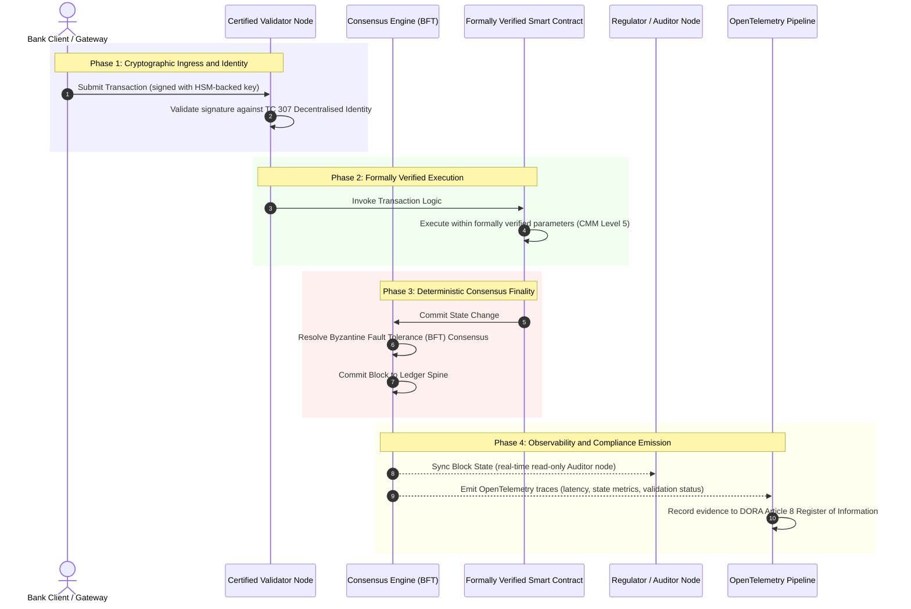

# சான்றுகளிலிருந்து உண்மைக்கு: சான்றளிக்கப்பட்ட பிளாக்செயின்கள் ஏன் வங்கி நம்பிக்கையின் அடுத்த சகாப்தத்தை வரையறுக்கும்

**மாற்ற முடியாதது என்பது நம்பப்பட்டது என்பதற்குச் சமமல்ல.** மொத்த வங்கியியல் நிகழ்நேரத் தீர்வுக்கும் நிகழ்தகவு சார்ந்த AI-க்கும் நகரும் போது, எது உண்மை என்பதைத் தீர்மானிக்கும் பேரேடு, வங்கிகளால் இன்னும் சான்றளிக்க முடியாத ஒரே அடுக்காக மாறியுள்ளது. அவை நிறுவனத்தை Basel III இன் கீழும், கிளவுட்டை ISO 27001 இன் கீழும், அவற்றின் AI-யை ISO 42001 இன் கீழும் சான்றளிக்கின்றன; ஆனால் பரவலாக்கப்பட்ட பேரேடு, அதன் நிர்வாகம், ஒருமித்த கருத்து, குறியாக்கவியல், ஸ்மார்ட் ஒப்பந்தங்கள் ஆகியவை விற்பனையாளர் சார்ந்த அனுமானத்திற்கு விடப்படுகின்றன. அந்த நம்பிக்கைப் பொறுப்பு இடைவெளியை நிரப்புவதற்கு ISO/IEC TC 307 வழிகாட்டுதலிலிருந்து பரிந்துரைக்கும் உறுதிப்பாட்டிற்கு நகர வேண்டும் என்று இந்த அறிக்கை வாதிடுகிறது: பொறியியல் அளவீடுகளை இயக்குநர் குழுவால் தணிக்கை செய்யத்தக்க, DORA-க்கு எதிராக காக்கத்தக்க உண்மையாக மாற்றும் 5-நிலை சான்றளிக்கப்பட்ட பிளாக்செயின் குறியீட்டிற்கு எதிராக பேரேட்டை மதிப்பிடுதல்.

<!-- lead-start -->
<aside class="post-lead" aria-label="கட்டுரைச் சுருக்கம்">

<strong>சுருக்கம்.</strong> வங்கிகள் நிறுவனம், கிளவுட், அவற்றின் AI ஆகியவற்றைச் சான்றளிக்கின்றன; ஆனால் எது உண்மை என்பதை மேலும் மேலும் தீர்மானிக்கும் பேரேட்டைச் சான்றளிப்பதில்லை. ISO/IEC TC 307 வழிகாட்டுதலை வழங்குகிறது, உறுதிப்பாட்டை அல்ல. 5-நிலை சான்றளிக்கப்பட்ட பிளாக்செயின் குறியீடு பேரேட்டு நிர்வாகம், ஒருமித்த கருத்து ஒருமைப்பாடு, அடையாளம் மற்றும் குறியாக்கவியல், ஸ்மார்ட்-ஒப்பந்த உறுதிப்பாடு, கண்காணிப்புத்தன்மை ஆகியவற்றை ஒரு திறன் முதிர்ச்சி மாதிரிக்கு எதிராக மதிப்பிட்டு, நம்பிக்கைப் பொறுப்பு இடைவெளியை நிரப்பி, நிகழ்தகவு சார்ந்த AI-க்கு ஒரு நிர்ணயமான தணிக்கை முதுகெலும்பை வழங்குகிறது.

<strong>முக்கியக் குறிப்புகள்</strong>

<ul class="post-lead-takeaways">
  <li><strong>நம்பிக்கைப் பொறுப்பு உராய்வு இடைவெளி.</strong> வங்கியை (Basel III), கிளவுட்டை (ISO 27001), AI நிர்வாக அமைப்பை (ISO 42001) சான்றளிக்க முடியும்; ஆனால் எது உண்மை என்பதைத் தீர்மானிக்கும் பரவலாக்கப்பட்ட பேரேட்டை இன்னும் சான்றளிக்க முடியாது. அந்த சமச்சீரற்ற தன்மை ஒரு நேரடி இயக்கச் சார்ந்த பாதிப்பு.</li>
  <li><strong>DORA இதைத் தனிப்பட்டதாக்குகிறது.</strong> DORA Article 5 இன் கீழ், மூன்றாம் தரப்பு மற்றும் பேரேட்டு அமலாக்கங்களின் மீள்திறனுக்கு வங்கி இயக்குநர் குழுக்கள் நேரடியான, ஒப்படைக்க முடியாத பொறுப்பைச் சுமக்கின்றன, தோல்விக்கு SM&amp;CR தனிப்பட்ட அபராதங்களுடன்.</li>
  <li><strong>AI தணிக்கை முதுகெலும்பு.</strong> இயந்திரக் கற்றல் மீளுருவாக்க முடியாதது; சான்றளிக்கப்பட்ட பிளாக்செயின் மாதிரி பதிப்புகள், உள்ளீடுகள், சரிபார்ப்பு முடிவுகளை நிர்ணயமான வகையில் ஆன்-செயினில் பதிவுசெய்து, ISO 42001 மற்றும் மாதிரி-அபாய-மேலாண்மைத் தரநிலைகளை நிறைவேற்றுகிறது.</li>
  <li><strong>சான்றளிக்கப்பட்ட பிளாக்செயின் குறியீடு.</strong> நிர்வாகம், ஒருமித்த கருத்து, குறியாக்கவியல், ஸ்மார்ட் ஒப்பந்தங்கள், கண்காணிப்புத்தன்மை ஆகியவை பொறியியல் அளவீடுகளை இயக்குநர் குழுவால் அங்கீகரிக்கப்பட்ட அபாயப் பசி அறிக்கைகளாக மொழிபெயர்க்கும் 0-முதல்-5 CMM மதிப்பீட்டு அட்டையாக மாறுகின்றன.</li>
</ul>

<strong>தொடர்புடைய வாசிப்பு:</strong> <a href="https://sebastienrousseau.com/2026-07-02-certified-blockchains-banking-trust-tc307-assurance-2026">சான்றளிக்கப்பட்ட பிளாக்செயின்களும் வங்கி நம்பிக்கையும்: TC 307 உறுதிப்பாடு</a>, <a href="https://sebastienrousseau.com/2026-07-24-global-payments-outlook-operating-model-risk-revenue">2026 உலகளாவிய கட்டணங்கள் கண்ணோட்டம்</a>.

</aside>
<!-- lead-end -->

> **நிர்வாகச் சுருக்கம்**
>
> - **மொத்த வங்கியியல் ஒரு திருப்புமுனையில் உள்ளது.** நிகழ்நேர அழிப்பும் நிகழ்தகவு சார்ந்த AI-யும் அனலாக், பின்நோக்கு உறுதிப்பாட்டு மாதிரியை உடைக்கின்றன: நிலையான, நிறுவனம் சார்ந்த தணிக்கைகள் நவீன அபாய-மேலாண்மை அல்லது நம்பிக்கைப் பொறுப்புக் கோரிக்கைகளை இனி பூர்த்திசெய்யாது.
> - **TC 307 ஒரு அடிப்படைத் தளம், ஒரு சான்றிதழ் அல்ல.** ISO/IEC TC 307 பரவலாக்கப்பட்ட பேரேடுகளுக்கான சொற்களஞ்சியம், குறிப்பு கட்டமைப்பு, பாதுகாப்பு வழிகாட்டுதலை தரப்படுத்தியுள்ளது; ஆனால் அது விளக்கமளிக்கும் தன்மை கொண்டது. நல்லது எப்படி இருக்கும் என்பதை அது வரையறுக்கிறது; உற்பத்தி அமலாக்கத்தை அங்கீகரிக்க அபாய அதிகாரிகளுக்கும் மேற்பார்வையாளர்களுக்கும் தேவையான பரிந்துரைக்கும் சரிபார்ப்பை அது வழங்காது.
> - **உறுதிப்பாடு என்பது பேரேட்டை மதிப்பிடுவது.** நிர்வாகம், ஒருமித்த கருத்து ஒருமைப்பாடு, ஸ்மார்ட்-ஒப்பந்தப் பாதுகாப்பு, குறியாக்கவியல் சுறுசுறுப்பு ஆகியவை ஒரு கடுமையான 5-நிலை திறன் முதிர்ச்சி மாதிரிக்கு எதிராக மதிப்பிடப்பட்டு, வங்கிகளை ஒட்டுவேலை, விற்பனையாளர் சார்ந்த அனுமானத்திலிருந்து சான்றளிக்கத்தக்க, இயக்குநர் குழுவால் தணிக்கை செய்யத்தக்க நிதி உண்மைக்கு நகர்த்துகின்றன.
> - **பேரேடு AI-க்கான தணிக்கை முதுகெலும்பு.** மாதிரி பதிப்புகள், உள்ளீடுகள், சரிபார்ப்பு முடிவுகளை நிர்ணயமான ஒருமித்த கருத்தில் நங்கூரமிடுவது, மீளுருவாக்க முடியாத இயந்திரக் கற்றலுக்கு ISO 42001, SR 11-7, PRA SS1/23 ஆகியவற்றின் கீழ் ஒரு காக்கத்தக்க, மறுகட்டமைக்கத்தக்க சான்றுப் பதிவை வழங்குகிறது.

## டிஜிட்டல் வங்கியியலில் நம்பிக்கைப் பொறுப்பு உராய்வு இடைவெளி

பாரம்பரிய வங்கியியலில், நம்பிக்கை என்பது உறவு சார்ந்தது, நிறுவனம் சார்ந்தது, பின்நோக்குடையது. இது சுயாதீன, மூன்றாம் தரப்பு தணிக்கையாளர்கள் நிலையான காலப் புள்ளிகளில் நிதி நிலையை மறுஆய்வுசெய்து, இருதரப்பு பேரேட்டு தனிமைப் பகுதிகள் முழுவதும் முரண்பாடுகளை ஒப்புரவாக்குவதைச் சார்ந்துள்ளது. 2026 இன் நிகழ்நேர, API-இயக்கப்பட்ட சந்தைகளில், இந்த மாதிரி தடைசெய்யத்தக்க தாமதங்களையும் கட்டமைப்புச் சார்ந்த அபாயங்களையும் அறிமுகப்படுத்துகிறது.

பரிவர்த்தனைகள் உடனடியாக தீர்வுசெய்யப்படும் போது, நாள்-அக பணப்புழக்கக் குளங்கள் API நுழைவாயில்களால் இயங்குமுறையில் நிர்வகிக்கப்படும் போது, சொத்து உரிமை பகிரப்பட்ட பேரேடுகள் முழுவதும் டோக்கனாக்கப்படும் போது, பின்நோக்குத் தணிக்கைகள் தடுப்புக் கட்டுப்பாடுகளாக அல்லாமல் தடயவியல் பயிற்சிகளாக மாறுகின்றன. நம்பிக்கைப் பொறுப்பாளர்கள் நிறுவனத்தைச் சான்றளிப்பதை மட்டுமே இனி நம்ப முடியாது. அவர்கள் டிஜிட்டல் அடித்தளத்தையே சான்றளிக்க வேண்டும்.

தற்போது, வங்கிகள் ஒரு தெளிவான கட்டமைப்புச் சார்ந்த சமச்சீரற்ற தன்மையின் கீழ் இயங்குகின்றன:

1. **சான்றளிக்கப்பட்ட கிளவுட் உள்கட்டமைப்பு**: வன்பொருள் கணுக்கள், மெய்நிகராக்கப்பட்ட கொள்கலன்கள், இயற்பியல் தரவு மையங்கள் ISO/IEC 27001 மற்றும் SOC 2 Type II கட்டுப்பாடுகளுக்கு எதிராக சரிபார்க்கப்படுகின்றன.  
2. **சான்றளிக்கப்பட்ட மேலாண்மைச் செயல்முறைகள்**: இயக்கச் சார்ந்த அபாயக் கொள்கைகள், வணிகத் தொடர்ச்சித் திட்டங்கள், படிமுறை அமலாக்கங்கள் கடுமையான அபாயக் கட்டமைப்புகளின் கீழ் நிர்வகிக்கப்படுகின்றன.  
3. **சான்றளிக்கப்படாத பேரேட்டு இயந்திரங்கள்**: முக்கிய பரவலாக்கப்பட்ட ஒருமித்த கருத்து பொறிமுறைகள், சரிபார்ப்பு கணு விநியோகச் சங்கிலிகள், ஸ்மார்ட் ஒப்பந்த எல்லைகள், பிணைய நிர்வாக மாதிரிகள் ஆகியவை சான்றளிக்கப்படாத, தனிப்பயன் அல்லது கூட்டமைப்பு-குறிப்பிட்ட அனுமானங்களுக்கு விடப்படுகின்றன.

இந்த சமச்சீரற்ற தன்மை ஒரு முக்கிய தோல்விப் புள்ளி. ஒரு வங்கி ஒரு பாதுகாப்பான, ISO 27001-சான்றளிக்கப்பட்ட கிளவுட் கொள்கலனுக்குள் ஒரு சரிபார்க்கப்பட்ட செயலியை இயக்கலாம்; ஆனால் அந்தக் கொள்கலன் மையப்படுத்தப்பட்ட சரிபார்ப்புக் கட்டுப்பாடு, பாதிக்கப்படக்கூடிய ஒருமித்த கருத்து அளவுருக்கள், அல்லது தணிக்கை செய்யப்படாத ஸ்மார்ட் ஒப்பந்தங்கள் கொண்ட ஒரு பரவலாக்கப்பட்ட பேரேட்டில் எழுதினால், பரிவர்த்தனை ஒருமைப்பாடு சமரசம்செய்யப்படுகிறது. இந்த இடைவெளியைக் குறைப்பதற்கு, பேரேட்டு இயந்திரமே ஒரு சான்றளிக்கத்தக்க உறுதிப்பாட்டுப் பொருளாக மாற வேண்டும்.

## ISO/IEC TC 307 தரப்படுத்தல் அடிப்படைத் தளம்

பரவலாக்கப்பட்ட பேரேடுகளைத் தரப்படுத்த தேவையான அடிப்படைப் பணி ISO/IEC தொழில்நுட்பக் குழு 307 (TC 307) (பிளாக்செயின் மற்றும் பரவலாக்கப்பட்ட பேரேட்டு தொழில்நுட்பங்கள்) மூலம் நிறுவப்படுகிறது. பிளாக்செயினை ஒரு தனிமைப்படுத்தப்பட்ட தொழில்நுட்ப நெறிமுறையாகக் கருதுவதற்குப் பதிலாக, TC 307 அதை ஒரு நிறுவனச் சார்ந்த நம்பிக்கை உள்கட்டமைப்பாகக் கருதி, தனது பணியை ஐந்து முக்கியத் தூண்களில் ஒழுங்கமைக்கிறது:

1. **வகைப்பாடும் சொற்களஞ்சியமும் (ISO 22739)**: வெவ்வேறு அதிகார எல்லைகள், நிதித் திட்டங்கள், நிறுவனங்கள் முழுவதும் நிலையான சட்ட மற்றும் இயக்கச் சார்ந்த வரையறைகளை உறுதிசெய்து, ஒரு பொதுவான பெயரிடல் முறையை நிறுவுகிறது.  
2. **குறிப்பு கட்டமைப்பு (ISO/TR 23245)**: இணக்கமான பரவலாக்கப்பட்ட பேரேட்டு அமைப்பின் எல்லைகள், அடுக்குகள், தரவுப் பாய்வுகள், செயல்பாட்டுக் கூறுகளை வரையறுக்கிறது.  
3. **பாதுகாப்பு, தனியுரிமை மற்றும் ஸ்மார்ட் ஒப்பந்தங்கள் (ISO/TR 23244 / ISO 23613)**: டிஜிட்டல் சொத்து அமைப்புகளுக்கான அடிப்படைப் பாதுகாப்பு வழிகாட்டுதல்களை நிறுவி, ஸ்மார்ட் ஒப்பந்தப் பாதிப்பு தணித்தல் மற்றும் வாழ்க்கைச் சுழற்சி நிர்வாகத்திற்கான சிறந்த நடைமுறைகளை விவரிக்கிறது.  
4. **இடைச்செயல்பாட்டுக் கட்டமைப்புகள்**: பன்முகத்தன்மையுள்ள பேரேட்டு பிணையங்களுக்கிடையேயான தரவு மற்றும் சொத்து-பரிமாற்றப் பொறிமுறைகளைக் கையாண்டு, தனிமைப்படுத்தப்பட்ட டோக்கனாக்கப்பட்ட தனிமைப் பகுதிகள் உருவாவதைத் தடுக்கிறது.  
5. **பரவலாக்கப்பட்ட அடையாளமும் நம்பிக்கை நங்கூரங்களும்**: பேரேடு சார்ந்த குறியாக்கவியல் அடையாளங்காட்டிகளை முறையான பொது-சாவி உள்கட்டமைப்புகள் (PKI) மற்றும் அரசு-அங்கீகரிக்கப்பட்ட பதிவேடுகளுடன் ஒருங்கிணைக்கிறது.

கூட்டாக, TC 307 DLT-யை ஒரு தனிப்பயன் பொறியியல் தேர்விலிருந்து ஒரு தரப்படுத்தப்பட்ட கட்டமைப்புச் சார்ந்த ஒழுங்குமுறைக்கு மாறுவதைக் குறிக்கிறது. இருப்பினும், TC 307 முதன்மையாக விளக்கமளிக்கும் தன்மை கொண்டதாகவே உள்ளது. நல்லது எப்படி இருக்கும் என்பதை அது வரையறுக்கிறது (வழிகாட்டுதல்), ஆனால் முக்கியமான அல்லது முக்கியத்துவம் வாய்ந்த செயல்பாடுகளின் (CIFs) உற்பத்தி அமலாக்கங்களை அங்கீகரிக்க அபாய அதிகாரிகளுக்கும் மேற்பார்வையாளர்களுக்கும் தேவைப்படும் பரிந்துரைக்கும் சரிபார்ப்பு நெறிமுறையை (உறுதிப்பாடு) அது வழங்காது.

## வழிகாட்டுதல் vs. உறுதிப்பாடு: நம்பிக்கைப் பொறுப்பு வேறுபாடு

நிதிச் சந்தைப் பங்கேற்பாளர்கள் தொழில்நுட்பம் புதுமையானது அல்லது நேர்த்தியானது என்பதற்காக அதை அமல்படுத்துவதில்லை; அது நிர்வகிக்கப்பட, தணிக்கை செய்யப்பட, காக்கப்பட, மூலதன இருப்புத் தேவைகளுடன் ஒப்புரவாக்கப்பட முடியும் போது அவர்கள் அதை அமல்படுத்துகின்றனர். வங்கியியலில் தரப்படுத்தல் இயற்கையாகவே இரு அடுக்குகளாகத் தீர்வாவதற்கு இதுவே காரணம்:

* **வழிகாட்டுதல் (கட்டமைப்பு)**: சிறந்த நடைமுறைகள், குறிப்பு இலக்குகள், கட்டமைப்பு வழிகாட்டுதல்களை (எ.கா., ISO/IEC TC 307, NIST கட்டமைப்புகள்) கோடிட்டுக் காட்டுகிறது.  
* **உறுதிப்பாடு (நிரூபணம்)**: கட்டமைப்பு வடிவமைக்கப்பட்டபடி அமல்படுத்தப்பட்டு இயங்குகிறது என்பதற்கு சுயாதீன, தொடர்ச்சியான, மூன்றாம் தரப்பால் சரிபார்க்கத்தக்க சான்றை (எ.கா., ISO 27001 சான்றிதழ், SOC 2 தணிக்கைகள், ஒழுங்குமுறை பரிசோதனைகள்) வழங்குகிறது.

கிளவுட் உள்கட்டமைப்பைச் சான்றளிக்கும் அதே வேளையில் சான்றளிக்கப்படாத பேரேட்டு ஒருமித்த கருத்தை நம்புவது ஒரு முக்கியமான ஒழுங்குமுறை இடைவெளி. "மாற்ற முடியாத" ஒரு பிளாக்செயின் அவசியம் "நிறுவனச் சார்ந்து நம்பப்பட்டது" அல்ல. மாற்றமுடியாத தன்மை உள்ளிடப்பட்ட தரவு மாறாமல் இருப்பதை மட்டுமே உறுதிசெய்கிறது; சரிபார்ப்பு கணுக்கள் பாதுகாப்பானவை என்பதையோ, ஒருமித்த கருத்து நெறிமுறை கூட்டுச் சதிக்கு எதிராக மீள்திறன் கொண்டது என்பதையோ, ஸ்மார்ட் ஒப்பந்த தர்க்கம் கணிதரீதியாக உறுதியானது என்பதையோ, குறியாக்கவியல் சாவி மேலாண்மை குவாண்டம்-பிந்தைய கட்டளைகளுடன் இணங்குகிறது என்பதையோ அது சரிபார்க்காது.

இந்த இடைவெளியை நிரப்ப, 2026 சான்றளிக்கப்பட்ட பிளாக்செயின் குறியீடு இந்தத் தேவைகளை உலகளாவிய வங்கி ஒழுங்குமுறைகளுக்கு வரைபடமாக்கப்பட்ட ஒரு அளவிடத்தக்க திறன் முதிர்ச்சி மாதிரியாக (CMM) முறைப்படுத்துகிறது.

## 2026 சான்றளிக்கப்பட்ட பிளாக்செயின் குறியீடு

மூத்த நிர்வாகம் தமது பேரேட்டு தளங்களை மதிப்பீடு செய்து சான்றளிப்பதை இயலச்செய்ய, இந்தக் குறியீடு பரவலாக்கப்பட்ட பேரேட்டு உள்கட்டமைப்பை ஐந்து தணிக்கை செய்யத்தக்க இயக்கச் சார்ந்த அடுக்குகளாகக் கட்டமைத்து, 0-முதல்-5 CMM அளவுகோலில் மதிப்பிடுகிறது.

### அட்டவணை 1: சான்றளிக்கப்பட்ட பிளாக்செயின் குறியீட்டுக் கட்டமைப்பு

| குறியீட்டு அடுக்கு | திறன் முதிர்ச்சி நிலை (CMM) | தொழில்நுட்ப மற்றும் இயக்கச் சார்ந்த அளவீடு | ஒழுங்குமுறை / நம்பிக்கைப் பொறுப்புக் கட்டுப்பாட்டுக் குறிப்பு |
| ---- | ---- | ---- | ---- |
| **பேரேட்டு நிர்வாகம்** | **Level 0**: தற்காலிக கூட்டமைப்பு**Level 3**: தானியங்கு சரிபார்ப்பு ஆய்வு & சுழற்சி**Level 5**: பரவலாக்கப்பட்ட, பல-தரப்பு குறியாக்கவியல் அடையாள நங்கூரமிடல் | ஆய்வுசெய்யப்பட்ட நிதி நிறுவனங்களால் இயக்கப்படும் சரிபார்ப்பு கணுக்களின் %; சரிபார்ப்பு தகராறுகளைத் தீர்க்கும் சராசரி நேரம்; கணுக்களின் புவியியல் விநியோகம் | **DORA Article 5** (நிர்வாகம் மற்றும் அமைப்பு); **CPMI-IOSCO PFMI Principle 2** (நிர்வாகம்) & **Principle 3** (அபாயங்களின் விரிவான மேலாண்மைக்கான கட்டமைப்பு) |
| **ஒருமித்த கருத்து ஒருமைப்பாடு** | **Level 0**: ஒற்றை-கணு அல்லது ஒளிபுகா POW**Level 3**: நிர்ணயமான இறுதிநிலையுடன் தணிக்கை செய்யப்பட்ட BFT**Level 5**: பல-அதிகார எல்லை, முறையாக சரிபார்க்கப்பட்ட ஒருமித்த கருத்து, தொடர்ச்சியான தாமதக் கண்காணிப்புடன் | பொறுத்துக்கொள்ளத்தக்க அதிகபட்ச ஒருமித்த கருத்து தாமதம்; கூட்டுச் சதி-எதிர்ப்பு வரம்பு; உருவகப்படுத்தப்பட்ட கணு பிரிவின் கீழ் இயங்குநேர SLA | **DORA Article 6** (ICT அபாய மேலாண்மைக் கட்டமைப்பு); **CPMI-IOSCO PFMI Principle 8** (தீர்வு இறுதிநிலை) |
| **அடையாளம் & குறியாக்கவியல்** | **Level 0**: பலவீனமான RSA / ECDSA சாவிகள்**Level 3**: HSM-ஆதரவு சாவி மேலாண்மையுடன் பல-கையொப்பம்**Level 5**: குவாண்டம்-பாதுகாப்பான கலப்பின சாவிகள் (FIPS 203 ML-KEM) மற்றும் பூஜ்ய-அறிவுத் தனியுரிமை வாயில்கள் | HSM-ஆதரவு சாவிகளுடன் கையொப்பமிடப்பட்ட பேரேட்டு பரிவர்த்தனைகளின் %; PQC இடம்பெயர்வுத் தயார்நிலை மதிப்பெண்; ZK-நிரூபண தாமதம் | **NIST FIPS 203 / 204**; **ISO/IEC 27001** (தகவல் பாதுகாப்பு மேலாண்மை) |
| **ஸ்மார்ட் ஒப்பந்த உறுதிப்பாடு** | **Level 0**: தணிக்கை செய்யப்படாத solidity ஸ்கிரிப்ட்கள்**Level 3**: தானியங்கு தொகுப்பி சரிபார்ப்பு & வெளிப்புற தணிக்கை**Level 5**: முறையாக சரிபார்க்கப்பட்ட, மாற்ற முடியாத ஸ்மார்ட் ஒப்பந்தங்கள், சர்க்யூட்-பிரேக்கர் மேம்பாடுகளுடன் | கணித முறையான சரிபார்ப்புடன் கூடிய ஸ்மார்ட் ஒப்பந்தங்களின் %; தொகுப்பி எச்சரிக்கைகளின் எண்ணிக்கை; பாதிப்பு ஸ்கேன் பரப்பளவு | **EBA Guidelines on Outsourcing Arrangements** (பத்திகள் 81, 113-117); **DORA Article 30** (குறைந்தபட்ச ஒப்பந்த விதிகள்) |
| **தணிக்கை & கண்காணிப்புத்தன்மை** | **Level 0**: கைமுறை பதிவு சேகரிப்பு**Level 3**: கட்டமைக்கப்பட்ட OTel தடங்கள் & படிக்க-மட்டும் தணிக்கையாளர் கணுக்கள்**Level 5**: Article 8 பதிவேட்டிற்குத் தானியங்கு, தொடர்ச்சியான ஒப்புரவாக்கம் | OpenTelemetry தடங்களால் மறைக்கப்பட்ட பரிவர்த்தனைகளின் %; பேரேட்டு தொகுதி-ஒப்படைப்பிலிருந்து தணிக்கையாளர்-கணு ஒத்திசைவு வரையிலான தாமதம் | **BCBS 239** (அபாயத் தரவுத் திரட்டல்); **DORA Article 8** (தகவல் பதிவேடு / ITS திட்டங்கள்) |

### அட்டவணை 2: உலகளாவிய வங்கித் தரநிலைகளுக்கு வரைபடமாக்கப்பட்ட முக்கிய நம்பிக்கை சமிக்ஞைகள்

| சமிக்ஞை / அளவுகோல் | அளவீடு | வங்கித் தளங்களில் தாக்கம் | ஒழுங்குமுறை மூலம் |
| ---- | ---- | ---- | ---- |
| **ISO/IEC TC 307 முன்னேற்றம்** | ISO/TR தொழில்நுட்ப அறிக்கைகளிலிருந்து முறையான சான்றளிப்புத் திட்டங்களுக்கு மாற்றம் | பரவலாக்கப்பட்ட பேரேட்டு இயந்திரங்களைச் சான்றளிப்பதற்கான முதல் தரப்படுத்தப்பட்ட கட்டமைப்பை நிறுவுகிறது | **ISO/IEC JTC 1 / SC 44** (பரவலாக்கப்பட்ட பேரேட்டு தொழில்நுட்பங்கள்) |
| **Project Agorá முன்மாதிரி கட்டம்** | 40+ பங்கேற்கும் வணிக வங்கிகள்; டோக்கனாக்கப்பட்ட வைப்புகளின் ஒருங்கிணைந்த பேரேட்டு சோதனை | எல்லைக்கடந்த அழிப்பை செய்தியனுப்பலிலிருந்து (SWIFT) அணுத் தன்மையுடைய டோக்கனாக்கப்பட்ட தீர்வுக்கு மாற்றுகிறது | **Bank for International Settlements (BIS) Innovation Hub** |
| **DORA Article 30 மூன்றாம் தரப்பு தணிக்கை** | பாதுகாப்பு அளவுகோல்களுக்கு எதிராக தணிக்கை செய்யப்பட்ட 100% கணு வழங்குநர்கள் மற்றும் உள்கட்டமைப்பு புரவலர்கள் | "நிழல் சரிபார்ப்பு கணுக்களை" அகற்றுகிறது; முழுமையான விநியோகச் சங்கிலி வெளிப்படைத்தன்மையைக் கட்டளையிடுகிறது | **European Supervisory Authorities (ESA)** |
| **ISO/IEC 42001 (AI நிர்வாகம்)** | குறியாக்கவியல் ரீதியாக மாற்றமுடியாதாக்கப்பட்ட AI மாதிரி மற்றும் பயிற்சிப் பதிவுகள் ஆன்-செயினில் | இயந்திரக் கற்றலுக்கான மாற்ற முடியாத சான்றுப் பேரேடாக ("தணிக்கை முதுகெலும்பு") பிளாக்செயினைப் பயன்படுத்துகிறது | **ISO/IEC 42001:2023** (தகவல் தொழில்நுட்பம், செயற்கை நுண்ணறிவு) |
| **Basel III மூலதனப் போதுமை** | ஆவணப்படுத்தப்பட்ட சிக்கல் குறைப்பின் அடிப்படையில் இயக்கச் சார்ந்த அபாய மூலதன இடையகங்களில் குறைப்பு | தரப்படுத்தப்பட்ட இயக்கச் சார்ந்த அபாயக் கட்டமைப்புகள் சரிபார்க்கப்பட்ட பேரேட்டு மீள்திறனுக்கு நேரடியாக மதிப்பளிக்கின்றன | **Basel Committee on Banking Supervision (BCBS)** |

## AI "தணிக்கை முதுகெலும்பு": நிர்ணயமான உள்கட்டமைப்பில் நிகழ்தகவு சார்ந்த நுண்ணறிவு

2026 இல் ஒரு சான்றளிக்கப்பட்ட பிளாக்செயினுக்கான மிக சக்திவாய்ந்த மூலோபாய பாத்திரங்களில் ஒன்று, செயற்கை நுண்ணறிவு அமலாக்கங்களுக்கு ஒரு **"தணிக்கை முதுகெலும்பாக"** செயல்படுவது. நவீன நிதி அமைப்புகள் மேலும் மேலும் நிகழ்தகவு சார்ந்தவையாக உள்ளன. கடன் மதிப்பீடு, நிகழ்நேர மோசடி கண்டறிதல், படிமுறை வர்த்தகம், தன்னாட்சி வாடிக்கையாளர் தொடர்புகள் ஆகியவை காலப்போக்கில் பரிணமிக்கும், நகரும், தழுவும் இயந்திரக் கற்றல் மாதிரிகளால் இயக்கப்படுகின்றன. இந்த மாதிரிகள் நிர்ணயமற்றவை: இரு வெவ்வேறு நேரங்களில் அதே உள்ளீடு கொடுக்கப்பட்டால், இயங்குமுறை எடைகள் மற்றும் தொடர்ச்சியான பயிற்சி காரணமாக அவை வெவ்வேறு வெளியீடுகளைத் தரக்கூடும்.

இந்த நிர்ணயமற்ற தன்மை **ISO/IEC 42001 (AI நிர்வாகம்)** மற்றும் **மாதிரி அபாய மேலாண்மை (MRM)** தரநிலைகளின் (**US Federal Reserve SR 11-7** மற்றும் **UK PRA SS1/23** போன்றவை) கீழ் ஒரு ஆழமான நிர்வாக சவாலை அறிமுகப்படுத்துகிறது: *கண்டிப்பாக மீளுருவாக்க முடியாத முடிவுகளை நீங்கள் எவ்வாறு தணிக்கை செய்கிறீர்கள், விளக்குகிறீர்கள், காக்கிறீர்கள்?*

ஒரு சான்றளிக்கப்பட்ட பரவலாக்கப்பட்ட பேரேடு நிர்ணயமான எதிர்நிறையை வழங்குகிறது. AI மாதிரிகள் நிகழ்தகவு ரீதியாக இயங்கும் அதே வேளையில், சான்றளிக்கப்பட்ட பிளாக்செயின் அவற்றின் அளவுருக்களை நிர்ணயமான வகையில் பதிவுசெய்து, ஒரு மாற்ற முடியாத சான்று முதுகெலும்பை நிறுவுகிறது:

* **மாதிரி பதிப்பிடலும் எடை நங்கூரமிடலும்**: அமல்படுத்தப்பட்ட ஒவ்வொரு மாதிரி பதிப்பு, அதனுடன் தொடர்புடைய எடைகள், அதன் பயிற்சித் தரவு காசோலைத்தொகைகள் ஆகியவை build-time இல் ஹாஷ் செய்யப்பட்டு பேரேட்டில் எழுதப்படுகின்றன, **SLSA Level 3** விநியோகச் சங்கிலித் தேவைகளை நிறைவேற்றுகின்றன.  
* **சூழல் உள்ளீடு பதிவு**: ஒரு AI மாதிரி ஒரு முக்கியமான முடிவை (எ.கா., கடனை அங்கீகரித்தல் அல்லது ஒரு பரிவர்த்தனையைக் குறியிடுதல்) செயல்படுத்தும் போது, சரியான சூழல் உள்ளீடுகளும் மாதிரி ஹாஷ்களும் பேரேட்டில் எழுதப்பட்டு, ஒரு சேதப்படுத்தலைக் காட்டும் வரலாற்றை உருவாக்குகின்றன.  
* **குறியீட்டு அணுகல் இல்லாமல் தணிக்கை செய்யத்தக்க தன்மை**: ஒரு ஒழுங்குமுறையாளர், "ஜூன் 3 அன்று உங்கள் மாதிரி இந்தக் கடன் விண்ணப்பத்தை ஏன் நிராகரித்தது?" என்று கேட்டால், வங்கி தனிச்சொத்துக் குறியீட்டை வெளிப்படுத்தவோ அல்லது சரியான மாதிரி நிலையை மீண்டும் உருவாக்க முயற்சிக்கவோ தேவையில்லை. அது உள்ளீடுகள், எடைகள், சரிபார்ப்பு நிலை ஆகியவற்றின் குறியாக்கவியல் ரீதியாக கையொப்பமிடப்பட்ட, ஆன்-செயின் பேரேட்டுப் பதிவை முன்வைக்கிறது.

இயந்திரக் கற்றல் மாதிரிகளின் நிகழ்தகவு சார்ந்த முடிவுகளை ஒரு சான்றளிக்கப்பட்ட பிளாக்செயினின் நிர்ணயமான ஒருமித்த கருத்தில் நங்கூரமிடுவதன் மூலம், நிறுவனம் தானியங்கு செயல்களின் ஒரு காக்கத்தக்க, மறுகட்டமைக்கத்தக்க, சுயாதீனமாக சரிபார்க்கத்தக்க காலவரிசையை உருவாக்குகிறது.

## சான்றளிக்கப்பட்ட ஒருமித்த-கருத்து-முதல்-தணிக்கை பைப்லைனை காட்சிப்படுத்துதல்

பின்வரும் வரிசை வரைபடம் ஒரு பரிவர்த்தனை ஒரு சான்றளிக்கப்பட்ட பிளாக்செயின் தளத்தின் வழியாகச் செல்லும் வாழ்க்கைச் சுழற்சியை விளக்குகிறது, சரிபார்ப்பு வாயில்கள், ஒருமித்த கருத்து ஒருமைப்பாடு, ஸ்மார்ட் ஒப்பந்த செயலாக்கம், டெலிமெட்ரி வெளியீடு ஆகியவை எவ்வாறு இணைந்து இயக்குநர் குழுவுக்குத் தயாரான ஒழுங்குமுறை சான்றை உருவாக்குகின்றன என்பதை நிரூபிக்கிறது:

இந்தப் பரிவர்த்தனை வரிசைக்கான முக்கியப் பாதைக்கு ஒவ்வொரு சரிபார்ப்பு, செயலாக்கம், ஒருமித்த கருத்துப் படியும் குறியாக்கவியல் ரீதியாக கையொப்பமிடப்பட வேண்டும், முனை-முதல்-முனை மூலவளத்தை உறுதிசெய்கிறது. ஒழுங்குமுறையாளரின் தணிக்கையாளர் கணு தொகுதி நிலையை நிகழ்நேரத்தில் ஒத்திசைக்கிறது, பின்நோக்கு, கைமுறை நிதி ஒப்புரவாக்கத்தின் தேவையை அகற்றுகிறது.

## மூத்த மேலாளர்களுக்கான இயக்குநர் குழு கையேடு

நிறுவனச் சார்ந்த நம்பிக்கையிலிருந்து உள்கட்டமைப்புச் சார்ந்த நம்பிக்கைக்கான மாற்றத்தை வெற்றிகரமாக நிர்வகிக்க, வங்கி நிர்வாகிகளும் மூத்த மேலாளர்களும் நான்கு முக்கிய ஆணைகளை உடனடியாகச் செயல்படுத்த வேண்டும்:

1. **நிறுவன அபாய மேலாண்மையில் (ERM) பேரேட்டு தணிக்கைகளைக் கட்டளையிடுதல்**: எந்தவொரு பரவலாக்கப்பட்ட பேரேட்டு தளமும் — தனிப்பட்டதோ, பொதுவானதோ, அல்லது கூட்டமைப்பு சார்ந்ததோ — 5-அடுக்கு **சான்றளிக்கப்பட்ட பிளாக்செயின் குறியீட்டுக் கட்டமைப்பிற்கு** (குறைந்தபட்சம் CMM Level 3) எதிராக தணிக்கை செய்யப்படாத வரை முக்கியமான அல்லது முக்கியத்துவம் வாய்ந்த செயல்பாடுகளுக்கு (CIFs) அமல்படுத்தப்படக்கூடாது என்ற கொள்கையை அமல்படுத்துங்கள்.  
2. **ISO 42001 AI சான்று முதுகெலும்பாக பிளாக்செயின்களை ஒருங்கிணைத்தல்**: அனைத்து உயர்-தாக்க இயந்திரக் கற்றல் மாதிரிகளையும் ஒரு சான்றளிக்கப்பட்ட பிளாக்செயினுடன் ஒருங்கிணைக்குமாறு தலைமை அபாய அதிகாரிக்கும் முதன்மை AI கட்டமைப்பாளருக்கும் வழிநடத்துங்கள், மாதிரி பதிப்புகள், எடைகள், உள்ளீடுகள், முடிவுகளின் சேதப்படுத்தலைக் காட்டும் தணிக்கைப் பேரேட்டை உருவாக்குங்கள்.  
3. **சரிபார்ப்பு கணு விநியோகச் சங்கிலியைத் தணிக்கை செய்தல் (DORA Article 30)**: சரிபார்ப்பு கணுக்களைப் புரவலராக்கும் அல்லது DLT பிணையங்களுக்கு கிளவுட் புரவலராக்கத்தை நிர்வகிக்கும் அனைத்து மூன்றாம் தரப்பு நிறுவனங்களையும் தணிக்கை செய்யுமாறு கொள்முதல் பிரிவைக் கோருங்கள், வங்கியின் உள் கிளவுட் கணுக்களுக்குப் பயன்படுத்தப்படும் அதே இணையப் பாதுகாப்பு மற்றும் இயக்கச் சார்ந்த மீள்திறன் தரநிலைகளுடன் இணக்கத்தைக் கட்டளையிடுங்கள்.  
4. **பேரேட்டு கட்டமைப்புகளை CPMI-IOSCO மற்றும் BCBS 239 உடன் சீரமைத்தல்**: பேரேட்டு வெளியீட்டு டெலிமெட்ரியை நேரடியாக **BCBS 239** தரவு அறிக்கையிடல் தேவைகளுடன் சீரமைக்குமாறு தள பொறியியல் குழுவிற்கு அறிவுறுத்துங்கள், மேலும் ஒருமித்த கருத்து மற்றும் தீர்வு இறுதிநிலை அளவுருக்கள் **CPMI-IOSCO கோட்பாடுகள் 8 மற்றும் 9** உடன் கடுமையாக இணங்குவதை உறுதிசெய்யுங்கள்.

## அடிக்கடி கேட்கப்படும் கேள்விகள்

**ISO/IEC TC 307 ஒரு சான்றளிப்புத் தரநிலையா?**  
இல்லை. ISO/IEC TC 307 என்பது சொற்களஞ்சியம், குறிப்பு கட்டமைப்புகள், பாதுகாப்பு வழிகாட்டுதல்களை நிறுவும் ஒரு தொழில்நுட்பக் குழு. அது "நல்லது எப்படி இருக்கும்" என்பதை வரையறுக்கும் அதே வேளையில் (வழிகாட்டுதல்), வங்கி மேற்பார்வையாளர்களைத் திருப்திப்படுத்த இந்த ஆவணங்களை முறையான, தணிக்கை செய்யத்தக்க சான்றளிப்புத் திட்டங்களாக (உறுதிப்பாடு) தொழில்துறை செயல்படுத்த வேண்டும்.

**ஒரு சான்றளிக்கப்பட்ட பிளாக்செயின் DORA இணக்கத்தை எவ்வாறு ஆதரிக்கிறது?**  
DORA Article 5 இன் கீழ், தொழில்நுட்ப மீள்திறனுக்கு வங்கி இயக்குநர் குழுக்கள் நேரடியான, தனிப்பட்ட பொறுப்பைச் சுமக்கின்றன. ஒரு சான்றளிக்கப்பட்ட பிளாக்செயின் ஒருமித்த கருத்து ஒருமைப்பாடு, சரிபார்ப்பு விநியோகச் சங்கிலிக் கட்டுப்பாடு, ஸ்மார்ட் ஒப்பந்தப் பாதுகாப்பு ஆகியவற்றின் சரிபார்க்கத்தக்க, குறியாக்கவியல் சான்றை வழங்கி, SM\&CR தனிப்பட்ட பொறுப்புக் கோரிக்கைகளுக்கு எதிராகக் காக்கத் தேவையான ஆவணப்படுத்தத்தக்க "நியாயமான படிகளை" இயக்குநர் குழு உறுப்பினர்களுக்கு வழங்குகிறது.

**ஒரு பாரம்பரிய பேரேட்டு தணிக்கைக்கும் ஒரு சான்றளிக்கப்பட்ட பிளாக்செயின் தணிக்கைக்கும் இடையேயான வேறுபாடு என்ன?**  
ஒரு பாரம்பரிய தணிக்கை பின்நோக்குடையது, பரிவர்த்தனைகள் அழிந்த பிறகு கைமுறை உள்ளீடுகளையும் நிலையான கோப்புகளையும் சரிபார்க்கிறது. ஒரு சான்றளிக்கப்பட்ட பிளாக்செயின் தணிக்கை தொடர்ச்சியானது மற்றும் நிகழ்நேரமானது; சரிபார்ப்பு கணுக்கள், BFT ஒருமித்த கருத்து இயந்திரம், முறையாக சரிபார்க்கப்பட்ட ஸ்மார்ட் ஒப்பந்தங்கள் ஆகியவை பரிவர்த்தனைகளை நிர்ணயமான வகையில் செயல்படுத்தச் சான்றளிக்கப்பட்டு, அமைப்பின் ஆரோக்கியத்தைத் தொடர்ச்சியாகச் சரிபார்க்கும் கட்டமைக்கப்பட்ட டெலிமெட்ரியை (OpenTelemetry) வெளியிடுகின்றன.

**வங்கிப் பயன்பாட்டிற்குப் பொது பிளாக்செயின்களைச் சான்றளிக்க முடியுமா?**  
பெரும்பாலான அதிகார எல்லைகளில், தூய அனுமதியில்லா பொது பிளாக்செயின்கள், சரிபார்ப்பு அடையாள சரிபார்ப்பு இல்லாமை, கணிக்க முடியாத gas/பரிவர்த்தனை செலவுகள், நிர்ணயமற்ற இறுதிநிலை (எ.கா., நிகழ்தகவு சார்ந்த proof-of-work/stake ஃபோர்க்குகள்) காரணமாக வங்கி ஒழுங்குமுறைகளைப் பூர்த்திசெய்யத் தவறுகின்றன. வங்கியியலில் சான்றளிக்கப்பட்ட பிளாக்செயின்கள் பொதுவாக நிறுவன அனுமதிசார் அல்லது அதிக ஒழுங்குபடுத்தப்பட்ட பொது-கலப்பின கட்டமைப்புகளைப் பயன்படுத்துகின்றன, அங்கு சரிபார்ப்பு கணு இயக்குநர்கள் அடையாளம் காணப்பட்டு தணிக்கை செய்யப்பட்ட நிதி நிறுவனங்களாக இருப்பர்.

## குறிப்புகள்

* Basel Committee on Banking Supervision (BCBS), 2013\. *Principles for effective risk data aggregation and reporting (BCBS 239\)*. Basel: Bank for International Settlements. இங்கு கிடைக்கிறது: [Basel Committee on Banking Supervision (BCBS), 2013\.](https://www.bis.org/publ/bcbs239.pdf "Basel Committee on Banking Supervision (BCBS), 2013\.").  
* Committee on Payments and Market Infrastructures and Technical Committee of the International Organisation of Securities Commissions (CPMI-IOSCO), 2012\. *Principles for financial market infrastructures*. Basel: Bank for International Settlements. இங்கு கிடைக்கிறது: [Committee on Payments and Market Infrastructures and Technical Committee of the International Organisation of Securities Commissions (CPMI-IOSCO), 2012\.](https://www.bis.org/cpmi/publ/d101.htm "Committee on Payments and Market Infrastructures and Technical Committee of the International Organisation of Securities Commissions (CPMI-IOSCO), 2012\.").  
* European Banking Authority (EBA), 2019\. *EBA/GL/2019/02, Guidelines on outsourcing arrangements*. Paris: EBA. இங்கு கிடைக்கிறது: [European Banking Authority (EBA), 2019\.](https://www.eba.europa.eu/regulation-and-policy/internal-governance/guidelines-on-outsourcing-arrangements "European Banking Authority (EBA), 2019\.").  
* European Parliament and Council of the European Union, 2022\. *Regulation (EU) 2022/2554 on digital operational resilience for the financial sector (DORA)*. Brussels: Official Journal of the European Union. இங்கு கிடைக்கிறது: [European Parliament and Council of the European Union, 2022\.](https://eur-lex.europa.eu/legal-content/EN/TXT/?uri=CELEX%3A32022R2554 "European Parliament and Council of the European Union, 2022\.").  
* ISO/IEC JTC 1/SC 42, 2023\. *ISO/IEC 42001:2023, Information technology, Artificial intelligence, Management system*. Geneva: International Organisation for Standardisation. இங்கு கிடைக்கிறது: [ISO/IEC JTC 1/SC 42, 2023\.](https://www.iso.org/standard/81230.html "ISO/IEC JTC 1/SC 42, 2023\.").  
* ISO/IEC Technical Committee 307, 2020\. *ISO/IEC 22739:2020, Blockchain and distributed ledger technologies, Vocabulary*. Geneva: International Organisation for Standardisation. இங்கு கிடைக்கிறது: [ISO/IEC Technical Committee 307, 2020\.](https://www.iso.org/standard/73771.html "ISO/IEC Technical Committee 307, 2020\.").  
* National Institute of Standards and Technology (NIST), 2026\. *First Three Finalised Post-Quantum Encryption Standards (FIPS 203, 204, and 205\)*. Gaithersburg: U.S. Department of Commerce. இங்கு கிடைக்கிறது: [National Institute of Standards and Technology (NIST), 2026\.](https://www.nist.gov/news-events/news/2024/08/nist-releases-first-3-finalized-post-quantum-encryption-standards "National Institute of Standards and Technology (NIST), 2026\.").
