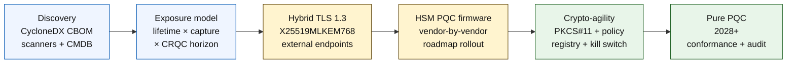

## 2026లో క్వాంటం-సేఫ్ బ్యాంకింగ్ ఇండెక్స్: పోస్ట్-క్వాంటం క్రిప్టోగ్రఫీ, QKD, క్రిప్టో-చురుకుదనం మరియు Harvest-Now-Decrypt-Later ప్రమాదం

2026లో క్వాంటం-సేఫ్ బ్యాంకింగ్ అనేది ఊహాగానం కాదు, కార్యాచరణ వలస గురించి. NIST మొదటి మూడు పోస్ట్-క్వాంటం క్రిప్టోగ్రఫీ ప్రమాణాలను ఖరారు చేసింది, ఇప్పుడు బ్యాంకులు ఏ వ్యవస్థలు RSA, ECC, TLS, సంతకాలు, HSMలు, సర్టిఫికేట్‌లు, చెల్లింపు ఛానెల్‌లు, ఆర్కైవ్‌లు మరియు దీర్ఘకాలిక గోప్యమైన డేటాపై ఆధారపడతాయో అర్థం చేసుకోవాలి. సూచిక ప్రశ్న సరళమైనది: ముప్పు కార్యాచరణలోకి రాకముందే సంస్థ క్రిప్టోగ్రఫీని భర్తీ చేయగలదా?

---

> **కార్యనిర్వాహక సారాంశం / ముఖ్యమైన అంశాలు**
>
> - **NIST ప్రమాణాలు ఇప్పుడు నిర్దిష్టమైనవి.** FIPS 203 కీ ఎన్‌క్యాప్సులేషన్ కోసం ML-KEM ను నిర్వచిస్తుంది, FIPS 204 సంతకాల కోసం ML-DSA ను నిర్వచిస్తుంది, మరియు FIPS 205 SLH-DSA ను స్థితిరహిత హాష్-ఆధారిత సంతక ప్రమాణంగా నిర్వచిస్తుంది.
> - **ఇన్వెంటరీ అనేది మొదటి పరిపక్వతా గేటు.** ఒక బ్యాంకు తాను కనుగొనలేనిదాన్ని వలస చేయలేదు: సర్టిఫికేట్‌లు, కీలు, ప్రోటోకాల్‌లు, అప్లికేషన్‌లు, విక్రేతలు, HSMలు, APIలు, ఆర్కైవ్‌లు మరియు ఎంబెడెడ్ వ్యవస్థలు మ్యాప్ చేయబడాలి.
> - **క్రిప్టో-చురుకుదనం అనేది శాశ్వత లక్ష్యం.** లక్ష్యం ఒక్కసారి అల్గోరిథం మార్పిడి కాదు; అది మొత్తం అప్లికేషన్‌లను తిరిగి రూపొందించకుండా క్రిప్టోగ్రాఫిక్ ప్రిమిటివ్‌లను మార్చగల సామర్థ్యం.
> - **దీర్ఘకాలిక డేటా తక్షణతను మారుస్తుంది.** Harvest-now-decrypt-later ప్రమాదం అంటే నేడు సంగ్రహించిన డేటా, తగినంత కాలం విలువైనదిగా ఉంటే, తర్వాత చదవగలిగేదిగా మారవచ్చు.
> - **[QKD](/2023-12-11-quantum-key-distribution-revolutionising-security-in-banking/index.html) అనేది ఒక ప్రత్యేక పరిపూరకం.** క్వాంటం కీ పంపిణీ అత్యధిక-విలువ ఛానెల్‌లకు సంబంధితంగా ఉండవచ్చు, కానీ ఇది సంస్థ-వ్యాప్త PQC వలసను భర్తీ చేయదు.
>
---

## ఈ సూచిక ఎందుకు 2026లో ముఖ్యమైనది

2024-2025లో మూడు మార్పులు క్వాంటం-సేఫ్‌ను పరిశోధన పరిశీలనా అంశం నుండి కొలవగలిగే బ్యాంకు కార్యక్రమంగా మార్చాయి. మొదట, NIST 13 ఆగస్టు 2024న ప్రాథమిక పోస్ట్-క్వాంటం ప్రమాణాలను ఖరారు చేసింది: [FIPS 203 (ML-KEM) ⧉](https://nvlpubs.nist.gov/nistpubs/FIPS/NIST.FIPS.203.pdf "FIPS 203 — Module-Lattice-Based Key-Encapsulation Mechanism"), [FIPS 204 (ML-DSA) ⧉](https://nvlpubs.nist.gov/nistpubs/FIPS/NIST.FIPS.204.pdf "FIPS 204 — Module-Lattice-Based Digital Signature Standard"), [FIPS 205 (SLH-DSA) ⧉](https://nvlpubs.nist.gov/nistpubs/FIPS/NIST.FIPS.205.pdf "FIPS 205 — Stateless Hash-Based Digital Signature Standard"). అల్గోరిథం-ఎంపిక చర్చ ఆ తేదీన ముగిసింది; 2026లో ఇంకా "ఏ పథకం గెలుస్తుంది" అంతర్గత పని-ధారలు నడుపుతున్న బ్యాంకులు 18 నెలలు వెనుకబడి ఉన్నాయి.

రెండవది, [NSA యొక్క CNSA 2.0 ⧉](https://media.defense.gov/2022/Sep/07/2003071834/-1/-1/0/CSA_CNSA_2.0_ALGORITHMS_.PDF "Commercial National Security Algorithm Suite 2.0") US ఫెడరల్ చివరి-స్థితిని 2033గా నిర్ణయించింది, సాఫ్ట్‌వేర్ మరియు ఫర్మ్‌వేర్ సంతకం కోసం 2027లో, బ్రౌజర్‌లు మరియు ఆపరేటింగ్ సిస్టమ్‌ల కోసం 2030లో ప్రారంభమయ్యే మధ్యంతర గడువులతో. US ఫెడరల్ ప్రతిపక్ష బహిర్గతత ఉన్న ఏ బ్యాంకు అయినా — FedNow, ట్రెజరీ కార్యకలాపాలు, ఫెడరల్ కస్టమర్ ఖాతాలు — ఫెడరల్ డేటాను తాకే వ్యవస్థల కోసం ఆ పరిధిలో ఉంటుంది. గడియారం ఇక ఊహాత్మకం కాదు.

మూడవది, [Harvest-Now-Decrypt-Later (HNDL) ⧉](https://csrc.nist.gov/Projects/post-quantum-cryptography "NIST Post-Quantum Cryptography programme") అనేది తక్షణతకు భారం-మోసే ప్రమాద వాదన. అధునాతన ప్రత్యర్థులు ఇప్పటికే ప్రధాన ఆర్థిక కేంద్రాలలో TLS-రక్షిత చెల్లింపు సందేశాలు, SWIFT ఎన్వలప్‌లు, KYC డాక్యుమెంటేషన్ మరియు దీర్ఘకాలిక ఆర్కైవ్ సైఫర్‌టెక్స్ట్‌ను సంగ్రహిస్తున్నారు. 2026లో సంగ్రహించిన డేటా, డిక్రిప్షన్ సమయంలో మాత్రమే గోప్యతా-సున్నితంగా ఉండాలి — 30-సంవత్సరాల మార్ట్‌గేజ్‌లు, జీవిత-బీమా అండర్‌రైటింగ్, MiFID II / GDPR లావాదేవీ రికార్డింగ్‌లు మరియు M&A నిల్వ ఆర్కైవ్‌ల కోసం, ఆ కిటికీ క్రిప్టోగ్రాఫికల్‌గా సంబంధిత క్వాంటం కంప్యూటర్ (CRQC) కోసం ప్రతి విశ్వసనీయ అంచనాను దాటి విస్తరిస్తుంది. ప్రత్యర్థికి నేడు క్వాంటం కంప్యూటర్ అవసరం లేదు. వారికి డేటా విలువ కోల్పోకముందే ఒకటి కావాలి.

ఆ సంధిస్థానం రాకముందే మీ సంస్థ వలసను అందించగలదా అని క్వాంటం-సేఫ్ బ్యాంకింగ్ ఇండెక్స్ కొలుస్తుంది. పని ఇక వలస చేయాలా వద్దా అనే దాని గురించి కాదు; అది వలస సమర్థించదగిన కాలక్రమంలో పూర్తవుతుందా అనే దాని గురించి.

## 2026 సూచిక నిర్మాణ శిల్పం

| సూచిక పొర | 2026 దిశ | సంసిద్ధతా కొలమానం | తప్పుగా నిర్వహిస్తే ప్రమాదం |
|---|---|---|---|
| **ఇన్వెంటరీ** | క్రిప్టోగ్రాఫిక్ ఆస్తులు, ప్రోటోకాల్‌లు, సర్టిఫికేట్‌లు, విక్రేతలు మరియు డేటా వర్గాలను మ్యాప్ చేయండి | ఇన్వెంటరీ చేసిన ఎస్టేట్ శాతం | తెలియని క్వాంటం-దుర్బల ఆధారితతలు |
| **బహిర్గతత** | గోప్యతా జీవితకాలం మరియు లావాదేవీ కీలకత ద్వారా వ్యవస్థలను వర్గీకరించండి | విలువ మరియు జీవితకాలం ద్వారా అధిక-ప్రమాద ఆస్తులు | తప్పు ప్రాధాన్యత గల వలస |
| **వలస** | NIST ప్రమాణాలకు అనుగుణంగా హైబ్రిడ్ మరియు PQC-సిద్ధ నమూనాలను అవలంబించండి | ML-KEM మరియు ML-DSA సంసిద్ధత | గడువులో అత్యవసర తిరిగి-వేదిక నిర్మాణం |
| **క్రిప్టో-చురుకుదనం** | అప్లికేషన్ లాజిక్‌ను క్రిప్టోగ్రాఫిక్ ప్రిమిటివ్‌ల నుండి వేరు చేయండి | పాలసీ-నియంత్రిత క్రిప్టో కవరేజ్ | ఎస్టేట్ అంతటా హార్డ్-కోడెడ్ అల్గోరిథమ్‌లు |
| **హామీ** | అంతర్‌కార్యాచరణ, పనితీరు, HSM మద్దతు, సర్టిఫికేట్‌లు మరియు విక్రేత సంసిద్ధతను పరీక్షించండి | పరీక్ష ఉత్తీర్ణతా రేటు మరియు మినహాయింపు బ్యాక్‌లాగ్ | విరిగిన ఛానెల్‌లు లేదా బలహీన ఫాల్‌బ్యాక్ నియంత్రణలు |

### బోర్డు-స్థాయి క్వాంటం స్కోర్‌కార్డ్

విశ్వసనీయ క్వాంటం సంసిద్ధతా స్కోర్‌కార్డ్‌కు కేవలం ప్రాజెక్టు స్థితులు కాదు, కచ్చితమైన శాతాలను ట్రాక్ చేయడం అవసరం:

1. **ఇన్వెంటరీ పరిపూర్ణత:** పూర్తిగా మ్యాప్ చేసిన క్రిప్టోగ్రాఫిక్ బిల్ ఆఫ్ మెటీరియల్స్ (CBOM) కలిగిన tier-1 అప్లికేషన్‌ల శాతం.
2. **HNDL బహిర్గతత:** హైబ్రిడ్ క్వాంటం-సేఫ్ కీ ఎన్‌క్యాప్సులేషన్ లేకుండా నెట్‌వర్క్‌ల ద్వారా ప్రసారమయ్యే దీర్ఘకాలిక గోప్యమైన డేటా (ఉదా., PII, వాణిజ్య రహస్యాలు) పరిమాణం.
3. **NIST వలస పురోగతి:** FIPS 203 (ML-KEM) మరియు FIPS 204 (ML-DSA) ప్రమాణాలకు వలస చేసిన అసమాన ఎన్‌క్రిప్షన్ కీలు మరియు డిజిటల్ సంతకాల శాతం.
4. **క్రిప్టో-చురుకుదన సంసిద్ధత:** కోడ్ రీకంపైలేషన్ అవసరం లేకుండా కేంద్రీకృత పాలసీ ద్వారా క్రిప్టోగ్రాఫిక్ అల్గోరిథమ్‌లను తిప్పగల కీలక వ్యవస్థల శాతం.

## ట్రాక్ చేయవలసిన ప్రస్తుత సంకేతాలు

| సంకేతం | బ్యాంకులకు దీని అర్థం | మూలం |
|---|---|---|
| **FIPS 203 ML-KEM** | సాధారణ ఎన్‌క్రిప్షన్ కీ స్థాపన కోసం ప్రాథమిక NIST ప్రమాణం | [NIST ⧉](https://www.nist.gov/news-events/news/2024/08/nist-releases-first-3-finalized-post-quantum-encryption-standards "First three finalized post-quantum encryption standards") |
| **FIPS 204 ML-DSA** | డిజిటల్ సంతకాల కోసం ప్రాథమిక NIST ప్రమాణం | [NIST ⧉](https://www.nist.gov/news-events/news/2024/08/nist-releases-first-3-finalized-post-quantum-encryption-standards "First three finalized post-quantum encryption standards") |
| **FIPS 205 SLH-DSA** | హాష్-ఆధారిత సంతక ప్రత్యామ్నాయం మరియు బ్యాకప్ డిజైన్ | [NIST ⧉](https://www.nist.gov/news-events/news/2024/08/nist-releases-first-3-finalized-post-quantum-encryption-standards "First three finalized post-quantum encryption standards") |
| **తక్షణ ఏకీకరణ ప్రోత్సహించబడింది** | పూర్తి ఏకీకరణకు సమయం పడుతుంది కాబట్టి ప్రమాణాలను ఏకీకృతం చేయడం ప్రారంభించమని NIST నిర్వాహకులకు స్పష్టంగా చెబుతుంది | [NIST ⧉](https://www.nist.gov/news-events/news/2024/08/nist-releases-first-3-finalized-post-quantum-encryption-standards "First three finalized post-quantum encryption standards") |
| **బ్యాంకు క్వాంటం కార్యక్రమాలు విస్తరిస్తున్నాయి** | ప్రధాన బ్యాంకులు PQC మార్పులకు సిద్ధమవుతూ క్వాంటం సాంకేతికతలను అన్వేషిస్తున్నాయి | [Quantum Insider ⧉](https://thequantuminsider.com/2026/03/27/15-plus-global-banks-probing-the-wonderful-world-of-quantum-technologies/ "Overview of global banks exploring quantum technologies") |

## వలస క్రిప్టోగ్రఫీ లెడ్జర్‌తో ప్రారంభమవుతుంది

ఈ దశలో వలస క్రమం బాగా అర్థమైంది. ప్రతి గేటు తదుపరిదాన్ని నడిపే సాక్ష్యాన్ని ఉత్పత్తి చేస్తుంది; ఒక గేటును దాటవేయడం లేదా కుదించడం అనేది సూచిక నిర్మాణ శిల్ప వైఫల్య నిలువువరుసలో కనిపించే అత్యవసర తిరిగి-వేదిక నిర్మాణ ప్రమాదాన్ని ఉత్పత్తి చేస్తుంది.

మొదటి డెలివరబుల్ ఒక కొత్త అల్గోరిథం కాదు; అది ఒక క్రిప్టోగ్రాఫిక్ బిల్ ఆఫ్ మెటీరియల్స్ (CBOM). వ్యాపార సేవలను అల్గోరిథమ్‌లు, లైబ్రరీలు, సర్టిఫికేట్‌లు, కీ పొడవులు, HSMలు, డేటా జీవితకాలాలు, విక్రేతలు మరియు కార్యాచరణ యజమానులతో అనుసంధానించే సజీవ ఇన్వెంటరీ బ్యాంకులకు అవసరం. ఆ లెడ్జర్ లేకుండా, క్వాంటం-సేఫ్ వలస ఊహాగానంగా మారుతుంది.

CBOM రికార్డు సెట్ ప్రతి క్రిప్టోగ్రాఫిక్ ప్రిమిటివ్ కోసం వీటిని సంగ్రహించాలి: ప్రోటోకాల్ లేదా ఇంటర్‌ఫేస్ (TLS 1.3, IPsec, SSH, అనుకూల చెల్లింపు-సందేశ ఫార్మాట్), అల్గోరిథం మరియు పరామితి సెట్ (RSA-2048, ECDH P-256, ML-KEM-768, ML-DSA-65), లైబ్రరీ మరియు వెర్షన్ (OpenSSL 3.4, BoringSSL కమిట్ హాష్, విక్రేత SDK బిల్డ్), హార్డ్‌వేర్ సరిహద్దు (HSM విభజన, TPM, సురక్షిత ఎన్‌క్లేవ్, లేదా ఏదీ కాదు), వర్తిస్తే సర్టిఫికేట్ గుర్తింపు, అప్లికేషన్ యజమాని, మరియు డేటా-వర్గీకరణ జీవితకాలం. 2025-2026లో ఉత్పత్తిలోకి వస్తున్న సాధనాలు — IBM Quantum Safe Inventory, ఓపెన్-సోర్స్ [CycloneDX CBOM స్పెసిఫికేషన్ ⧉](https://cyclonedx.org/capabilities/cbom/ "CycloneDX Cryptography Bill of Materials"), CryptoNext / Sandbox / PQShield నుండి ఎంటర్‌ప్రైజ్ స్కానర్‌లు — ప్రస్తుత CMDB పైప్‌లైన్‌లలోకి ఏకీకృతమవుతాయి. వాటిలో ఏదీ దానికదిగా పూర్తి కాదు; విక్రేత సాధనాలు మరియు అంకిత సిబ్బందితో కూడా 12-18 నెలల CBOM నిర్మాణ చక్రాన్ని అంచనా వేయండి.

ట్రాక్ చేయవలసిన కొలమానం కవరేజ్ కాదు, తాజాదనం. రెండు నెలలు వెనుకబడిన CBOM అనేది CBOM లేకపోవడం కంటే ఘోరమైనది, ఎందుకంటే ఏమి వలస చేయబడిందనే దాని గురించి భద్రతా బృందానికి తప్పుడు విశ్వాసాన్ని ఇస్తుంది.

## మొదట హైబ్రిడ్, ఎల్లప్పుడూ చురుకైనది

చాలా బ్యాంకులు ప్రతిదాన్ని ఒకేసారి మార్చవు. వాస్తవిక నమూనా హైబ్రిడ్ విస్తరణ, ఇక్కడ విక్రేతలు, ప్రోటోకాల్‌లు, సర్టిఫికేట్‌లు మరియు కార్యాచరణ సాధనాలు పరిపక్వం చెందుతూ ఉన్నప్పుడు శాస్త్రీయ మరియు పోస్ట్-క్వాంటం యంత్రాంగాలు కలిసి నడుస్తాయి. దీర్ఘకాలిక లక్ష్యం క్రిప్టో-చురుకుదనం: వ్యాపార అప్లికేషన్‌ను తిరిగి నిర్మించకుండా మార్చగల పాలసీ-నియంత్రిత క్రిప్టోగ్రాఫిక్ ఎంపికలు.

[Insert Interactive Component: Harvest-Now-Decrypt-Later (HNDL) Risk Calculator — A slider-based tool where executives input data shelf-life vs. estimated quantum timeline to see their exposure window.]

> **ముఖ్య అంతర్దృష్టి:** మీ డేటా 10 సంవత్సరాల పాటు గోప్యంగా ఉండాలి, మరియు క్రిప్టోగ్రాఫికల్‌గా సంబంధిత క్వాంటం కంప్యూటర్ (CRQC) 7 సంవత్సరాల దూరంలో ఉంటే, మీ వలస గడువు 7 సంవత్సరాలలో కాదు — అది 3 సంవత్సరాల క్రితమే ఉండింది.

ఆచరణలో దీని అర్థం, బాహ్యంగా-ఎదుర్కొనే ఎండ్‌పాయింట్‌ల కోసం హైబ్రిడ్ `X25519MLKEM768` కీ షేర్‌తో TLS 1.3 (Chrome / Firefox / Cloudflare / Akamai అన్నీ నేడు దీనికి మద్దతు ఇస్తాయి), HSM మరియు CA మౌలిక సదుపాయాలు అందుకునే వరకు శాస్త్రీయ సంతక చైన్‌లు, మరియు వ్యాపార అప్లికేషన్‌లను రీకంపైల్ చేయకుండా పాలసీ రిజిస్ట్రీ అల్గోరిథమ్‌లను తిప్పగల PKCS#11 అబ్‌స్ట్రాక్షన్ పొర. తదుపరి అల్గోరిథం మార్పు (ఎప్పుడు కాదు, జరుగుతుంది అని) ఆరు-వారాల భ్రమణమా లేదా మరో ఏడు-సంవత్సరాల కార్యక్రమమా అని క్రిప్టో-చురుకుదనం నిర్ణయిస్తుంది.

## QKD ఎక్కడ సరిపోతుంది

క్వాంటం కీ పంపిణీ సూచికలో అధిక-సున్నితత్వ ఛానెల్ ఎంపికగా చెందుతుంది, ప్రత్యేకంగా ఆర్థిక-మార్కెట్ మౌలిక సదుపాయాలు, కేంద్ర-బ్యాంకు అనుసంధానం మరియు అత్యంత సున్నితమైన సంస్థాగత ప్రవాహాల కోసం. దీన్ని PQCకి పరిపూరకంగా పరిగణించాలి, ఎంటర్‌ప్రైజ్ వలసను ఆలస్యం చేయడానికి సాకుగా కాదు.

## బ్యాంకు రకం ప్రకారం దీని అర్థం

### ప్రపంచవ్యాప్త వ్యవస్థాత్మకంగా ముఖ్యమైన బ్యాంకులు

కఠినమైన సమస్య స్థాయి: పదివేల TLS ఎండ్‌పాయింట్‌లు, వందల HSM విభజనలు, డజన్ల అంతర్గత సర్టిఫికేట్ అథారిటీలు, ఎంబెడెడ్ క్రిప్టోగ్రాఫిక్ ప్రిమిటివ్‌లతో వందల వ్యాపార అప్లికేషన్‌లు, మరియు బ్యాంకు సవరించలేని విక్రేత SDKలు. పెట్టుబడి మరో పైలట్ కాదు; అది CBOM సాధనాలు, ప్రతి కొత్త బిల్డ్‌లోకి వైర్ చేసిన PKCS#11 అబ్‌స్ట్రాక్షన్ పొర, PQC ఫర్మ్‌వేర్‌లో ముందుండటానికి ఒక విక్రేతను ఎంచుకుని మిగతా వాటిపై బహు-సంవత్సర తోకను అంగీకరించే HSM ఏకీకరణ ప్రణాళిక, మరియు FIPS 203 / 204 / 205 వలస పూర్తయిన చాలా కాలం తర్వాత శాశ్వత క్రిప్టో-చురుకుదన ఉపరితలంగా మారే పాలసీ రిజిస్ట్రీ.

### లావాదేవీ మరియు కార్పొరేట్ బ్యాంకులు

వలస పరిధి G-SIB స్థాయి కంటే సంకుచితమైనది కానీ HNDL బహిర్గతత తీవ్రమైనది: SWIFT సరిహద్దుల మధ్య సందేశ ప్రసారం, కార్పొరేట్-ప్రతిపక్ష PIIని మోసే నిర్మాణాత్మక చెల్లింపు డేటా, వాణిజ్య-ఆర్థిక డాక్యుమెంటేషన్‌ను కలిగి ఉన్న డాక్యుమెంట్-మార్పిడి వేదికలు, మరియు దీర్ఘ-నిల్వ నివేదిక ఆర్కైవ్‌లు. ప్రతి కస్టమర్-ఎదుర్కొనే ఎండ్‌పాయింట్‌పై హైబ్రిడ్ TLS మరియు నిల్వ ఆర్కైవ్‌ల కోసం విశ్రాంతిలో PQCకి ప్రాధాన్యత ఇవ్వండి. HSM-విక్రేత జవాబుదారీతనాన్ని ముందుకు నెట్టండి — టోకు సాంకేతిక బృందానికి తరచుగా లేని ప్రత్యక్ష సేకరణ పరపతి కార్పొరేట్-బ్యాంకింగ్ వేదిక బృందానికి ఉంటుంది.

### ప్రాంతీయ బ్యాంకులు

ఇప్పటికే క్రిప్టో-చురుకుదన ప్రిమిటివ్‌లను కలిగి ఉన్న విక్రేత స్టాక్‌ను కొనండి. CBOM ప్రచురించి, ML-KEM / ML-DSA మద్దతు కాలక్రమాలకు కట్టుబడి ఉన్న విక్రేత గల ఒక కోర్ బ్యాంకింగ్ వేదికను ఎంచుకోండి. విక్రేత HSM మార్గసూచిక బ్యాంకు వలస గడువుకు అనుగుణంగా ఉందని ధృవీకరించండి. మొదటి నుండి క్రిప్టో-చురుకుదనాన్ని నిర్మించడానికి అవసరమైన ఇంజనీరింగ్ సామర్థ్యం బహు-సంవత్సరాలది; విక్రేత ఆ ఖర్చును అనేక కస్టమర్‌ల అంతటా భరిస్తాడు మరియు బ్యాంకు ఆ ప్రయోజనాన్ని వారసత్వంగా పొందుతుంది. ధృవీకరణ పని — విక్రేత దావాలు సంస్థ MRM ప్రక్రియను తట్టుకుంటాయని తనిఖీ చేయడం — చట్టబద్ధమైన అంతర్గత పరిధి.

### ఫిన్‌టెక్‌లు, PSPలు మరియు మౌలిక సదుపాయాల ప్రదాతలు

2026లో బ్యాంకులకు అమ్మే విక్రేతలకు పోటీ ప్రశ్న "మీరు PQCకి మద్దతు ఇస్తారా" కాదు. అది "మీ వేదిక కోసం CycloneDX CBOM, HSM-విక్రేత మద్దతు మాత్రిక, మరియు లిఖిత అల్గోరిథం-భ్రమణ SLAను మీరు ఉత్పత్తి చేయగలరా." అవును అని సమాధానం ఇచ్చే విక్రేతలు 2026-2027లో tier-1 సేకరణ గేట్‌లను దాటుతారు. చేయలేని విక్రేతలు రెన్యువల్ చక్రాన్ని చేయగల పోటీదారుకు కోల్పోతారు.

## ముగింపు

2026లో క్వాంటం-సేఫ్ బ్యాంకింగ్ ఒక పరిశోధన పరిశీలనా అంశం కాదు; అది రెండు వక్రరేఖల సంధిస్థానం నిర్దేశించే గడువుతో కూడిన డెలివరీ కార్యక్రమం — సంస్థ నేడు కలిగి ఉన్న డేటా యొక్క గోప్యతా జీవితకాలం, మరియు క్రిప్టోగ్రాఫికల్‌గా సంబంధిత క్వాంటం కంప్యూటర్ రాక క్షితిజం. 2030లో నియంత్రకులు మరియు ప్రతిపక్షాలకు విశ్వసనీయంగా కనిపించే సంస్థలు 2024లో CBOM నిర్మాణాన్ని ప్రారంభించి, 2026 చివరి నాటికి ప్రతి బాహ్య ఎండ్‌పాయింట్‌పై హైబ్రిడ్ TLSను విస్తరించి, మొదటి రోజు నుండి ప్రతి కొత్త బిల్డ్‌లోకి క్రిప్టో-చురుకుదనాన్ని ఇంజనీర్ చేసినవి. చేయనివి, తమ ప్రత్యర్థి నేడు సంగ్రహిస్తున్న డేటా కోసం తమ వలస కిటికీ ఇప్పటికే మూసుకుపోయిందా అని కనుగొంటాయి.

ఏ కార్యాచరణ కార్యక్రమాన్ని కొలిచే విధంగానే వలసను కొలవండి: పరిధి తెలిసింది, క్రమం ప్రాధాన్యత ఇవ్వబడింది, గడువులకు కట్టుబడ్డారు, మినహాయింపు రిజిస్టర్‌లు నిజాయితీగా ఉన్నాయి. మీ స్వంత ఎస్టేట్‌ను ఎంత కఠినంగా చూస్తే, వలస కిటికీ అంత చిన్నదిగా అనిపిస్తుంది.

## తరచుగా అడిగే ప్రశ్నలు

**ఒక బ్యాంకు మొదట ఏమి ఇన్వెంటరీ చేయాలి?**

బాహ్యంగా బహిర్గతమైన TLS, చెల్లింపు ఛానెల్‌లు, కస్టమర్ ప్రామాణీకరణ, అంతర్-బ్యాంకు అనుసంధానం, HSM-మద్దతు గల సేవలు, దీర్ఘకాలిక ఆర్కైవ్‌లు, మరియు దీర్ఘ ఉపయోగకర జీవితం గల గోప్యమైన డేటాను నిర్వహించే వ్యవస్థలతో ప్రారంభించండి.

**PQC కేవలం సైబర్ భద్రతా సమస్యేనా?**

కాదు. ఇది చెల్లింపులు, గుర్తింపు, చట్టపరమైన సాక్ష్యం, లావాదేవీ సంతకం, కస్టమర్ నమ్మకం, డేటా నిల్వ, విక్రేత నిర్వహణ మరియు కార్యాచరణ స్థితిస్థాపకతను ప్రభావితం చేస్తుంది.

**క్రిప్టో-చురుకుదనం అంటే ఏమిటి?**

క్రిప్టో-చురుకుదనం అంటే హార్డ్-కోడెడ్ అప్లికేషన్ మార్పులకు బదులుగా పాలసీ మరియు వేదిక నియంత్రణల ద్వారా క్రిప్టోగ్రాఫిక్ ప్రిమిటివ్‌లను మార్చగల సామర్థ్యం.

**బ్యాంకులు మరిన్ని ప్రమాణాల కోసం వేచి ఉండాలా?**

కాదు. పూర్తి ఏకీకరణకు సమయం పడుతుంది కాబట్టి మొదటి తుది ప్రమాణాలను ఏకీకృతం చేయడం ప్రారంభించమని NIST నిర్వాహకులను ప్రోత్సహించింది.

## సూచనలు

- NIST, (2026). [First three finalized post-quantum encryption standards ⧉](https://www.nist.gov/news-events/news/2024/08/nist-releases-first-3-finalized-post-quantum-encryption-standards "First three finalized post-quantum encryption standards").
