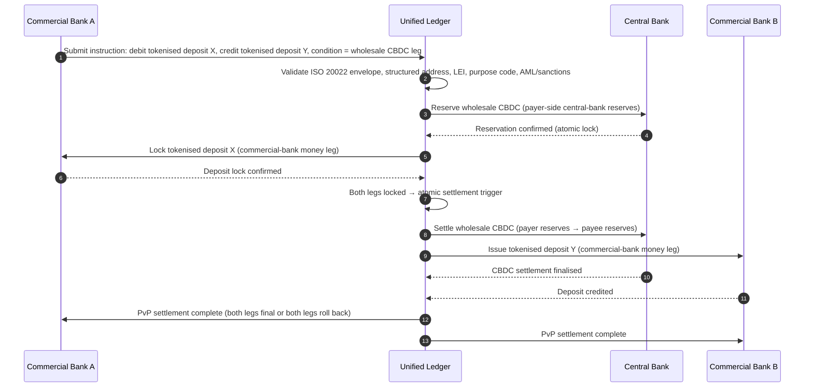

## 2026లో హోల్‌సేల్ చెల్లింపుల సూచిక: ISO 20022, టోకనైజ్డ్ డిపాజిట్లు, రియల్-టైమ్ రైల్స్, మరియు సరిహద్దు-దాటు సెటిల్‌మెంట్

2026లో హోల్‌సేల్ చెల్లింపులు రెండు ఏకకాల మార్పుల ద్వారా పునర్రూపొందించబడుతున్నాయి: నిర్మాణాత్మక చెల్లింపు డేటా మరియు ప్రోగ్రామబుల్ సెటిల్‌మెంట్. SWIFT యొక్క నవంబర్ 2026 నిర్మాణాత్మక-చిరునామా మైలురాయి డేటా నాణ్యతను నిర్వహణ నమూనాలోకి బలవంతంగా తీసుకువస్తుంది, అదే సమయంలో BIS Project Agorá మరియు టోకనైజ్డ్ డిపాజిట్లు సరిహద్దు-దాటు సెటిల్‌మెంట్ మరింత అటామిక్, పారదర్శకంగా, మరియు ఎల్లప్పుడూ-ఆన్‌గా మారగలదా అని పరీక్షిస్తున్నాయి.

---

> **కార్యనిర్వాహక సారాంశం / ముఖ్యాంశాలు**
>
> - **నవంబర్ 2026 అనేది ఒక కఠినమైన డేటా మైలురాయి.** SR 2026 మార్పు తర్వాత నిర్మాణాత్మకం-కాని చిరునామాలను కలిగి ఉన్న చెల్లింపులకు ఇక మద్దతు ఉండదని SWIFT చెబుతోంది.
> - **నిర్మాణాత్మక డేటా ఉత్పత్తి మౌలిక సదుపాయంగా మారుతుంది.** పట్టణం మరియు దేశం కనీసం నిర్దేశిత ఫీల్డ్‌లలో ఉండాలి, ఇది చెల్లింపు-డేటా నాణ్యతను క్లయింట్, కార్యనిర్వహణ, మరియు అనుసరణ సమస్యగా మారుస్తుంది.
> - **టోకనైజ్డ్ డిపాజిట్లు ఒక హోల్‌సేల్ డిజైన్ ఎంపిక.** Project Agorá ఒక ఏకీకృత లెడ్జర్ నమూనాలో టోకనైజ్డ్ వాణిజ్య బ్యాంకు డిపాజిట్లు మరియు టోకనైజ్డ్ కేంద్ర బ్యాంకు రిజర్వ్‌లను అన్వేషిస్తుంది.
> - **సూచిక వేగాన్ని మాత్రమే కాదు, సెటిల్‌మెంట్ నాణ్యతను కొలవాలి.** ఫైనాలిటీ, పారదర్శకత, రిపేర్ రేట్లు, లిక్విడిటీ వినియోగం, అనుసరణ డేటా, మరియు క్లయింట్ దృశ్యత తక్షణ అమలుకు సమానంగా ముఖ్యమైనవి.
> - **సరిహద్దు-దాటు చెల్లింపులు ప్రభుత్వ-ప్రైవేట్ ఎజెండాగానే ఉంటాయి.** FSB ప్రభుత్వ మరియు ప్రైవేట్-రంగ సమన్వయంతో అమలు ద్వారా G20 రోడ్‌మ్యాప్‌ను నడిపిస్తూనే ఉంది.
>
---

## ఈ సూచిక ముఖ్యమైన సంవత్సరం 2026 ఎందుకు

Stanford AI Index ఉపయోగకరమైనది ఎందుకంటే అది వేగంగా కదిలే సాంకేతిక రంగాన్ని కొలవగలిగే దానిగా పరిగణిస్తుంది: పరిశోధన ఫలితం, సాంకేతిక పనితీరు, బాధ్యతాయుతమైన విస్తరణ, ఆర్థికశాస్త్రం, రంగ స్వీకరణ, విధానం, మరియు ప్రజా భావన అన్నీ ఒకే చట్రంలోకి తీసుకురాబడతాయి ([Stanford HAI ⧉](https://hai.stanford.edu/ai-index/2026-ai-index-report "The 2026 AI Index Report")). బ్యాంకులు మరియు ఆర్థిక సంస్థలకు ఇప్పుడు మౌలిక సదుపాయాల కోసం అదే క్రమశిక్షణ అవసరం. ఏజెంటిక్ AI, క్వాంటమ్-సురక్షిత భద్రత, క్లౌడ్ నేటివ్ స్థితిస్థాపకత, మరియు హోల్‌సేల్ చెల్లింపులు ఇక వేర్వేరు ఆవిష్కరణ మార్గాలు కావు; అవి ఒకే నిర్వహణ నమూనాలోకి కలిసిపోతున్నాయి.

ఒక బ్యాంకుకు ఆచరణాత్మక ప్రశ్న ప్రతి రంగం ముఖ్యమైనదా అనేది కాదు. అది సంస్థ ఒకేసారి అన్నింటిలో సంసిద్ధతను కొలవగలదా అనేది. ఒక బ్యాంకు ఏజెంటిక్ AIని విస్తరించగలదు అయినా దాని క్రిప్టోగ్రఫీ మైగ్రేషన్-సిద్ధంగా లేకపోతే అది పెళుసుగా ఉండవచ్చు. అది క్లౌడ్ ప్లాట్‌ఫారమ్‌లను ఆధునీకరించగలదు అయినా చెల్లింపు డేటా నిర్మాణాత్మకం కాకుండా ఉంటే విఫలం కావచ్చు. అది టోకనైజేషన్ పైలట్‌లను నడపగలదు అయినా సెటిల్‌మెంట్, లిక్విడిటీ, గుర్తింపు, మరియు ఆడిట్ పొరలు కలిసి రూపొందించబడకపోతే వ్యవస్థాగత ప్రమాదాన్ని సృష్టించవచ్చు.

## 2026 సూచిక నిర్మాణం

| సూచిక పొర | 2026 దిశ | సంసిద్ధత మెట్రిక్ | తప్పుగా నిర్వహిస్తే ప్రమాదం |
|---|---|---|---|
| **ISO 20022 డేటా** | నిర్మాణాత్మకం-కాని టెక్స్ట్ నుండి పాలించబడిన నిర్మాణాత్మక ఫీల్డ్‌లకు మారడం | నిర్మాణాత్మక-చిరునామా సంసిద్ధత మరియు రిజెక్ట్ రేటు | చెల్లింపు రిజెక్ట్‌లు మరియు మాన్యువల్ రిపేర్ |
| **రైల్ ఆర్కెస్ట్రేషన్** | RTGS, ఇన్‌స్టంట్, కరస్పాండెంట్, స్టేబుల్‌కాయిన్, మరియు టోకనైజ్డ్ రైల్స్ మీదుగా రూట్ చేయడం | ఖర్చు, వేగం, ఫైనాలిటీ, మరియు అధికార-పరిధి-అవగాహన రూటింగ్ | నకిలీ నియంత్రణలతో ఛిన్నాభిన్నమైన రైల్స్ |
| **టోకనైజ్డ్ సెటిల్‌మెంట్** | ఘర్షణను తగ్గించే చోట టోకనైజ్డ్ డిపాజిట్లు మరియు కేంద్ర బ్యాంకు డబ్బును ఉపయోగించడం | DvP, PvP, అటామిక్ సెటిల్‌మెంట్ కవరేజ్ | వ్యాపార వర్క్‌ఫ్లో విలువ లేని పైలట్ ఆస్తులు |
| **లిక్విడిటీ** | ఇంట్రాడే లిక్విడిటీ, ఇరుక్కుపోయిన నగదు, మరియు సెటిల్‌మెంట్ కిటికీలను ఉత్తమీకరించడం | ఆదా చేసిన లిక్విడిటీ మరియు సెటిల్‌మెంట్-వైఫల్య తగ్గింపు | లిక్విడిటీపై వేగవంతమైన ఖాళీలు |
| **అనుసరణ** | AML, ఆంక్షలు, FATF, మరియు ఆడిట్ అవసరాలను చెల్లింపు డేటాలో పొందుపరచడం | స్ట్రెయిట్-త్రూ అనుసరణ మరియు వివరణీయత | బలమైన నియంత్రణలు లేకుండా సంపన్నమైన డేటా |

## ప్రపంచ ప్రాధాన్యతలకు మ్యాప్ చేయబడిన ముఖ్య హోల్‌సేల్-చెల్లింపు సంకేతాలు

2026 సంకేత సమూహం ఒక పరిశోధన ఎజెండా కాదు. అది ఒక బ్యాంకు ముఖ్య చెల్లింపు అధికారి ఇప్పటికే కొలవబడుతున్న ఒక డెలివరీ చెక్‌లిస్ట్. పరిష్కార పని మూడు చోట్ల కనిపిస్తుంది: మెసేజ్ ఎన్వలప్, రైల్ ఆర్కెస్ట్రేషన్ పొర, మరియు సెటిల్‌మెంట్ లెడ్జర్.

| సంకేతం | G20 / SWIFT / BIS ప్రామాణికం | సాంకేతిక ప్లాట్‌ఫారమ్ అమలు |
|---|---|---|
| **65% చెల్లింపు మెసేజ్‌లు ఇంకా నిర్మాణాత్మకం-కాని చిరునామాలను కలిగి ఉన్నాయి** | [SWIFT SR 2026 — నిర్మాణాత్మక-చిరునామా మైలురాయి, నవం 2026 ⧉](https://www.swift.com/news-events/news/iso-20022-milestone-november-2026-unstructured-addresses-be-removed "ISO 20022 November 2026 structured address milestone") | మెసేజ్ SWIFTNet అడాప్టర్‌ను తాకే ముందు చెల్లింపు మిడిల్‌వేర్‌లో స్కీమా వ్యాలిడేషన్; కార్పొరేట్-చానెల్ + కరస్పాండెంట్-బ్యాంక్ ఇన్‌గ్రెస్ వద్ద ఆటోమేటెడ్ చిరునామా పార్సింగ్. |
| **FSB G20 లక్ష్యం: 2027 నాటికి 75% సరిహద్దు-దాటు చెల్లింపులు 1 గంటలోపు పూర్తి** | [FSB సరిహద్దు-దాటు చెల్లింపుల రోడ్‌మ్యాప్, 2026 అమలు దశ ⧉](https://www.fsb.org/2026/03/fsb-kicks-off-new-implementation-phase-to-enhance-cross-border-payments-through-public-private-partnership/ "FSB cross-border payments implementation phase") | ముందుగా-అంగీకరించిన లిక్విడిటీ కిటికీలతో రియల్-టైమ్ FX-మార్పిడి గేట్‌వేలు; క్లయింట్ పోర్టల్‌లోకి T+0 నిర్ధారణ హుక్‌లు; 1 గం ఎన్వలప్‌ను చేరుకోలేని ఏ కారిడార్‌నైనా మినహాయించే రైల్-రూటింగ్ ఇంజిన్. |
| **FSB G20 లక్ష్యం: సగటు సరిహద్దు-దాటు లావాదేవీ ఖర్చు 1% లోపు, రిటైల్ 3% లోపు** | [FSB G20 పరిమాణాత్మక లక్ష్యాలు ⧉](https://www.fsb.org/2026/03/fsb-kicks-off-new-implementation-phase-to-enhance-cross-border-payments-through-public-private-partnership/ "FSB cross-border payments implementation phase") | ప్రతి కారిడార్‌పై ఖర్చు-ఆపాదన టెలిమెట్రీ (FX స్ప్రెడ్, కరస్పాండెంట్ ఫీజు, లిఫ్టింగ్ ఖర్చు); కోట్‌కు ముందు అనుసరణ-రహిత ధరలను బహిర్గతం చేసే మార్జిన్ పాలసీ రిజిస్ట్రీ. |
| **BIS Project Agorá ఏడు కేంద్ర బ్యాంకులు + 41 వాణిజ్య బ్యాంకుల మీదుగా ప్రోటోటైప్ దశలోకి ప్రవేశిస్తుంది** | [BIS Project Agorá ⧉](https://www.bis.org/about/bisih/topics/fmis/agora.htm "Project Agorá") | ఏకీకృత-లెడ్జర్ ఇంటిగ్రేషన్ స్పెక్: టోకనైజ్డ్-డిపాజిట్ లెడ్జర్ నోడ్ + హోల్‌సేల్-CBDC సెటిల్‌మెంట్ ప్లేన్ + KYC/AML హుక్‌లు; బ్యాంకు కారిడార్ వాటాకు తగినట్లు పరిమాణం చేయబడిన ఆన్-చైన్ లిక్విడిటీ పూల్‌లు. |
| **Deutsche Bank "డిజిటల్ మనీ" చట్రం క్లయింట్ నిర్మాణంలో స్ఫటికీకరిస్తుంది** | [Deutsche Bank — Digital Money: stablecoins, tokenised deposits and CBDCs ⧉](https://flow.db.com/publications/flow-white-papers-and-guides/digital-money-a-perspective-on-stablecoins-tokenised-deposits-and-cbdcs "Digital Money: stablecoins, tokenised deposits and CBDCs") | ప్రతి చెల్లింపుకు స్టేబుల్‌కాయిన్ / టోకనైజ్డ్-డిపాజిట్ / CBDC ఎంపికను నైరూప్యం చేసే వాలెట్-అజ్ఞేయ సెటిల్‌మెంట్ API; క్లయింట్‌ది కాకుండా బ్యాంకు పాలసీ రిజిస్ట్రీపై మూల్యాంకనం చేయబడిన ప్రోగ్రామబుల్ షరతులు. |

## చెల్లింపు డేటా మలుపు బిందువు

ISO 20022 ఒక మెసేజింగ్-ఫార్మాట్ ప్రాజెక్ట్ నుండి ఒక డేటా-నాణ్యత నిర్వహణ నమూనాకు మారింది. లబ్ధిదారు, రుణగ్రహీత, రుణదాత, ఏజెంట్, పట్టణం, దేశం, ప్రయోజనం, మరియు పార్టీ డేటా బలహీనంగా ఉంటే, బ్యాంకు రిజెక్ట్‌లు, రిపేర్‌లు, ఆంక్షల ఘర్షణ, క్లయింట్ నిరాశ, మరియు బలహీన విశ్లేషణలను ఎదుర్కొంటుంది.

**SR 2026 దీన్ని ఒక సలహా కాదు, ఒక కఠినమైన ఒప్పందంగా చేస్తుంది.** SWIFT Standards Release 2026 (నవంబర్ 2026) నెట్‌వర్క్ పొర వద్ద నిర్మాణాత్మక-చిరునామా నియమాన్ని అమలు చేస్తుంది — `<TwnNm>` మరియు `<Ctry>` కలిగి ఉండని `<PstlAdr>` మూలకం ఉన్న మెసేజ్‌లు రిపేర్ కోసం ఫ్లాగ్ చేయబడకుండా, స్వీకరణ సమయంలో SWIFTNet వ్యాలిడేషన్ స్టాక్ ద్వారా రిజెక్ట్ చేయబడతాయి. రిపేర్ క్యూ బ్యాక్-ఆఫీస్ ఖర్చు లైన్‌గా ఉండటం ఆగిపోయి క్లయింట్‌కు-కనిపించే ఆలస్యంతో ఒక సెటిల్‌మెంట్-వైఫల్య సంఘటనగా మారుతుంది. SR 2026ను "మరింత కఠినమైన మార్గదర్శకం"గా పరిగణిస్తున్న కార్యనిర్వహణ బృందాలు తప్పు రన్‌బుక్ నుండి పని చేస్తున్నాయి.

### ISO 20022 కింద నిర్మాణాత్మక చెల్లింపు డేటా అనుసరణ

పరిష్కార ఉపరితలం ఇరుకైనది మరియు స్పష్టంగా నిర్వచించబడింది. దిగువన ఉన్న XML మూలకాలు నవంబర్ 2026 SWIFTNet వ్యాలిడేషన్ స్టాక్ నిజంగా మెసేజ్‌లను ఎక్కడ విఫలం చేస్తుందో అవి; మిగతా అన్నీ దిగువ ప్రవాహ పరిణామాలు.

| డేటా మూలకం | ISO 20022 XML ట్యాగ్ | నవంబర్ 2026 SWIFT అవసరం | సాంకేతిక పరిష్కార వ్యూహం |
|---|---|---|---|
| **నిర్మాణాత్మక చిరునామా** | `<TwnNm>` + `<Ctry>` కలిగిన `<PstlAdr>` | తప్పనిసరి. నిర్మాణాత్మకం-కాని `<AdrLine>` టెక్స్ట్ స్వీకరణ SWIFTNet అడాప్టర్ వద్ద నెట్‌వర్క్ రిజెక్షన్‌ను ప్రేరేపిస్తుంది. | చెల్లింపు ప్రారంభంలో ఆటోమేటెడ్ చిరునామా పార్సింగ్; కార్పొరేట్-చానెల్ ఫారమ్ పునర్రచనలు; తదుపరి డెబిట్‌కు ముందు ప్రతి ప్రతిపక్షంపై బ్యాక్-బుక్ శుభ్రపరచడం. |
| **లీగల్ ఎంటిటీ ఐడెంటిఫైయర్ (LEI)** | `<OrgId>` కింద `<Id>` | వ్యక్తి-కాని ఆర్థిక ప్రతిపక్ష ధృవీకరణ కోసం అత్యధికంగా సిఫార్సు చేయబడింది; అనేక CBPR+ కారిడార్‌లలో తప్పనిసరి. | కార్పొరేట్ ఆన్‌బోర్డింగ్ వద్ద LEI లుకప్ + GLEIF క్రాస్-చెక్; రిఫరెన్స్-డేటా సేవల ద్వారా బ్యాక్-బుక్ ప్రతిపక్షాలకు స్వయంచాలక సుసంపన్నం. |
| **చెల్లింపు ప్రయోజన కోడ్‌లు** | `<Cd>` కలిగిన `<Purp>` | ఆటోమేటెడ్ AML / ఆంక్షల స్క్రీనింగ్ కోసం అనేక ప్రాంతీయ రియల్-టైమ్ కారిడార్‌లలో (CBPR+, SEPA Inst, TIPS) తప్పనిసరి. | లెగసీ బ్యాంక్-అంతర్గత లావాదేవీ కోడ్‌లను ప్రామాణిక ISO 20022 ExternalPurposeCode జాబితాకు మ్యాప్ చేయడం; కార్పొరేట్-చానెల్ UIలో ప్రయోజన ఎంపికను బహిర్గతం చేయడం; తెలియని కోడ్‌లపై డిఫాల్ట్-డినై. |
| **అంతిమ పార్టీలు** | `<UltmtDbtr>` / `<UltmtCdtr>` | G20 FATF ట్రావెల్-రూల్ + ఆంక్షల పరామితులను సంతృప్తిపరచడానికి అంతిమ లబ్ధిదారు సందర్భాన్ని బహిర్గతం చేయడం; అనేక చెల్లింపు-రకం కోడ్‌లకు తప్పనిసరి. | లెడ్జర్ ఉప-ఖాతాల నుండి ఎండ్-టు-ఎండ్ పార్టీ పేర్లను వెలికితీయడం; KYC గ్రాఫ్‌కు వ్యతిరేకంగా సమన్వయం; ప్రతి నిర్ధారణపై అంతిమ పార్టీని బహిర్గతం చేయడం. |
| **చెల్లింపు సమాచారం (నిర్మాణాత్మక)** | `<RfrdDocInf>`తో `<RmtInf><Strd>` | CBPR+ దశ 2 కింద సమన్వయ ఇన్‌వాయిస్-లింక్డ్ కార్పొరేట్ చెల్లింపులకు అవసరం. | కార్పొరేట్ పోర్టల్‌లో కోట్-సమయంలో నిర్మాణాత్మక చెల్లింపు సమాచారాన్ని సంగ్రహించడం; అధిక-విలువ ప్రవాహాల కోసం ఫ్రీ-టెక్స్ట్ ఫాల్‌బ్యాక్‌ను రిజెక్ట్ చేయడం. |

## టోకనైజ్డ్ డిపాజిట్లు మరియు హోల్‌సేల్ CBDC

టోకనైజ్డ్ డిపాజిట్లు ప్రోగ్రామబిలిటీని జోడిస్తూనే వాణిజ్య-బ్యాంకు డబ్బు నమూనాను కాపాడతాయి. హోల్‌సేల్ కేంద్ర బ్యాంకు డబ్బు సెటిల్‌మెంట్ ఫైనాలిటీని కాపాడుతుంది. ఆసక్తికరమైన డిజైన్ నమూనా ఈ కలయిక: క్లయింట్ సంబంధాలు మరియు క్రెడిట్ మధ్యవర్తిత్వం కోసం వాణిజ్య బ్యాంకు డబ్బు, అంతిమ సెటిల్‌మెంట్ మరియు వ్యవస్థాగత విశ్వాసం కోసం కేంద్ర బ్యాంకు డబ్బు.

Project Agorá ఈ కలయికను నిర్దిష్టం చేస్తుంది. దిగువ నిర్మాణం అనేది వాణిజ్య-బ్యాంకు డిపాజిట్ లెడ్జర్ మరియు హోల్‌సేల్-CBDC సెటిల్‌మెంట్ ప్లేన్ రెండింటినీ ఉపయోగించి, ఒక ఏకీకృత లెడ్జర్ ద్వారా సమన్వయం చేయబడిన ఒక అటామిక్, చెల్లింపు-వర్సెస్-చెల్లింపు (PvP) సరిహద్దు-దాటు సెటిల్‌మెంట్ కోసం BIS ప్రామాణిక నమూనా.

సెటిల్‌మెంట్ నిర్మాణం ద్వారా అటామిక్: రెండు లెగ్‌లు కమిట్ అవుతాయి లేదా రెండూ రోల్ బ్యాక్ అవుతాయి. హోల్‌సేల్-CBDC లెగ్‌పై సెటిల్‌మెంట్ ఫైనాలిటీ కరస్పాండెంట్ ప్రమాదం లేకుండా వాణిజ్య-బ్యాంకు టోకనైజ్డ్-డిపాజిట్ బదిలీని ప్రభావవంతంగా చేస్తుంది. ఏకీకృత లెడ్జర్ అనేది సమన్వయ ప్లేన్, స్వతంత్రంగా ఒక చెల్లింపు వ్యవస్థ కాదు — కేంద్ర బ్యాంకు ఇప్పటికీ సెటిల్‌మెంట్ ఆస్తిని జారీ చేస్తుంది మరియు వాణిజ్య బ్యాంకు ఇప్పటికీ డిపాజిట్ బాధ్యతను నమోదు చేస్తుంది.

## కొత్త హోల్‌సేల్ చెల్లింపు ఉత్పత్తి

ఉత్పత్తి ఇక కేవలం ఒక చెల్లింపు కాదు. ఇది అమలు, డేటా, లిక్విడిటీ, అనుసరణ, ట్రేసబిలిటీ, మరియు మినహాయింపు నిర్వహణ యొక్క ఒక కట్ట. ఈ సామర్థ్యాలను API‌లు మరియు క్లయింట్ డాష్‌బోర్డ్‌ల ద్వారా బహిర్గతం చేయగల బ్యాంకులు మౌలిక సదుపాయాల అనుసరణను క్లయింట్ విలువగా మారుస్తాయి.

## ఇది బ్యాంకు రకం ప్రకారం అర్థం ఏమిటి

### ప్రపంచవ్యాప్తంగా వ్యవస్థాగతంగా ముఖ్యమైన బ్యాంకులు

ప్రపంచ బ్యాంకులు ఈ సూచికను ఒక ఎంటర్‌ప్రైజ్ నిర్మాణ స్కోర్‌కార్డ్‌గా పరిగణించాలి. ప్రాధాన్యత మరో ప్రూఫ్ ఆఫ్ కాన్సెప్ట్ కాదు; స్వయంప్రతిపత్త వర్క్‌ఫ్లోలు, క్రిప్టోగ్రాఫిక్ మైగ్రేషన్, క్లౌడ్ ఆధారపడటం, మరియు చెల్లింపు ఆధునీకరణను ఒకే ప్రమాద మరియు విలువ వ్యవస్థగా పాలించగలమనే ఆధారం.

### లావాదేవీ బ్యాంకులు మరియు కార్పొరేట్ బ్యాంకులు

లావాదేవీ బ్యాంకులు హోల్‌సేల్ చెల్లింపులు, నిర్మాణాత్మక డేటా, లిక్విడిటీ, టోకనైజ్డ్ డిపాజిట్లు, మరియు ఏజెంటిక్ ట్రెజరీ సేవలపై దృష్టి పెట్టాలి. అత్యంత విలువైన క్లయింట్ ప్రతిపాదన కేవలం వేగవంతమైన డబ్బు కదలిక మాత్రమే కాదు; అది తక్కువ దర్యాప్తులు మరియు మెరుగైన వర్కింగ్-క్యాపిటల్ దృశ్యతతో వివరణీయ, ఆడిట్-చేయదగిన, ప్రోగ్రామబుల్ డబ్బు కదలిక.

### ప్రాంతీయ బ్యాంకులు

ప్రాంతీయ బ్యాంకులు కార్యక్రమ విస్తరణను నివారించడానికి ఈ సూచికను ఉపయోగించాలి. వారు ప్రతి సరిహద్దును నడిపించాల్సిన అవసరం లేదు, కానీ AI పాలన, పోస్ట్-క్వాంటమ్ ఇన్వెంటరీ, క్లౌడ్ ఎగ్జిట్ ఆధారం, మరియు చెల్లింపు డేటా సంసిద్ధతపై విశ్వసనీయ స్థానాలు వారికి అవసరం.

### ఫిన్‌టెక్‌లు, PSP‌లు, మరియు మౌలిక సదుపాయ ప్రదాతలు

ఫిన్‌టెక్‌లు మరియు మౌలిక సదుపాయ ప్రదాతలు తమ ఉత్పత్తి రోడ్‌మ్యాప్‌లను కొలవదగిన బ్యాంకు సంసిద్ధతకు అనుగుణంగా అమర్చుకోవాలి. ఉత్తమ ప్రతిపాదనలు ఇంటిగ్రేషన్ ప్రమాదాన్ని తగ్గిస్తాయి, ఆధారాన్ని బలపరుస్తాయి, మరియు సంక్లిష్ట మౌలిక సదుపాయాలను బ్యాంకులు పాలించడాన్ని సులభతరం చేస్తాయి.

## ముగింపు

సూచిక-శైలి నివేదిక యొక్క విలువ ఏమిటంటే అది ఛిన్నాభిన్నమైన సాంకేతిక ఎజెండాను ఒక కొలవదగిన నిర్వహణ నమూనాగా మారుస్తుంది. 2026లో, ఆర్థిక మౌలిక సదుపాయాలలో విజేతలు అత్యధిక పైలట్‌లు కలిగిన సంస్థలు కావు. వారు స్వయంప్రతిపత్తి, భద్రత, స్థితిస్థాపకత, సెటిల్‌మెంట్, ఆర్థికశాస్త్రం, మరియు పాలన మీదుగా ఒకేసారి సంసిద్ధతను నిరూపించగల సంస్థలు అవుతారు.

## తరచుగా అడిగే ప్రశ్నలు

**ISO 20022 ఇంకా 2026 సమస్య ఎందుకు?**

ఎందుకంటే చెల్లింపు డేటా నిర్మాణాత్మకం, పాలించబడి, మూలం వద్ద సంగ్రహించబడి, మరియు చానెల్‌లు, క్లయింట్‌లు, మరియు మార్కెట్ మౌలిక సదుపాయాల మీదుగా ఉపయోగించదగినంత వరకు మైగ్రేషన్ పూర్తి కాదు.

**టోకనైజ్డ్ డిపాజిట్ అంటే ఏమిటి?**

టోకనైజ్డ్ డిపాజిట్ అనేది వాణిజ్య బ్యాంకు డబ్బు యొక్క డిజిటల్ ప్రాతినిధ్యం, ఇది బ్యాంకు-డిపాజిటర్ సంబంధాన్ని కాపాడుతూనే ప్రోగ్రామబుల్ సెటిల్‌మెంట్‌ను ప్రారంభించేలా రూపొందించబడింది.

**టోకనైజ్డ్ డిపాజిట్లు స్టేబుల్‌కాయిన్‌లను భర్తీ చేస్తాయా?**

అన్నిచోట్లా కాదు. కొన్ని డిజిటల్-ఆస్తి మరియు సరిహద్దు-దాటు సందర్భాలలో స్టేబుల్‌కాయిన్‌లు ఉపయోగకరంగా ఉండవచ్చు, అదే సమయంలో నియంత్రిత హోల్‌సేల్ బ్యాంకింగ్ కోసం టోకనైజ్డ్ డిపాజిట్లు నిర్మాణాత్మకంగా ఆకర్షణీయంగా ఉంటాయి.

**బ్యాంకులు ఏమి కొలవాలి?**

నిర్మాణాత్మక-డేటా సంసిద్ధత, చెల్లింపు రిజెక్ట్‌లు, రిపేర్ ఖర్చు, సెటిల్‌మెంట్ సమయం, లిక్విడిటీ వినియోగం, రైల్ రూటింగ్ ఫలితాలు, మరియు క్లయింట్ దృశ్యతను కొలవండి.

## సూచనలు

- SWIFT, (2026). [ISO 20022 November 2026 structured address milestone ⧉](https://www.swift.com/news-events/news/iso-20022-milestone-november-2026-unstructured-addresses-be-removed "ISO 20022 November 2026 structured address milestone").
- BIS Innovation Hub, (2026). [Project Agorá ⧉](https://www.bis.org/about/bisih/topics/fmis/agora.htm "Project Agorá").
- FSB, (2026). [Cross-border payments implementation phase ⧉](https://www.fsb.org/2026/03/fsb-kicks-off-new-implementation-phase-to-enhance-cross-border-payments-through-public-private-partnership/ "Cross-border payments implementation phase").
- Deutsche Bank, (2026). [Digital Money: stablecoins, tokenised deposits and CBDCs ⧉](https://flow.db.com/publications/flow-white-papers-and-guides/digital-money-a-perspective-on-stablecoins-tokenised-deposits-and-cbdcs "Digital Money: stablecoins, tokenised deposits and CBDCs").
