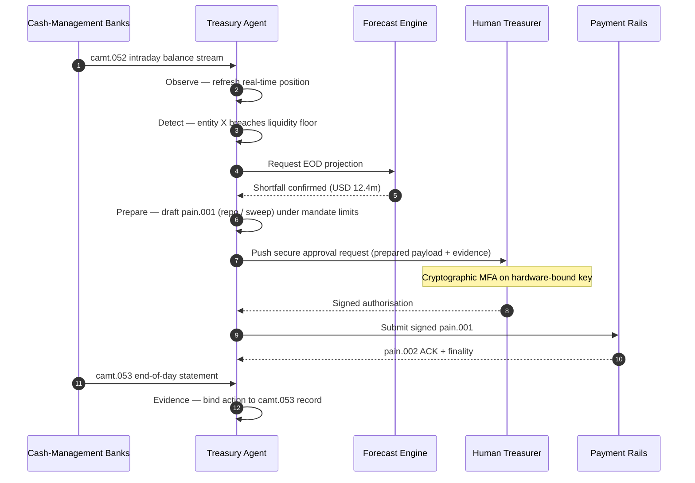

## 2026లో అటానమస్ ట్రెజరీ ఇండెక్స్: ఏజెంటిక్ ట్రెజరీ, ప్రోగ్రామబుల్ లిక్విడిటీ, టోకనైజ్డ్ డిపాజిట్‌లు, మరియు రియల్-టైమ్ నగదు నియంత్రణ

అటానమస్ ట్రెజరీ అనేది ఏజెంటిక్ AI, హోల్‌సేల్ చెల్లింపులు, టోకనైజ్డ్ డిపాజిట్‌లు, మరియు రియల్-టైమ్ లిక్విడిటీకి సహజ కలయిక బిందువు. 2026లో, ఉత్తమ ట్రెజరీ ఆర్కిటెక్చర్‌లు కేవలం నగదును అంచనా వేయవు; అవి ఖాతాలు, కరెన్సీలు, రైల్‌లు, మరియు సెటిల్‌మెంట్ ఆస్తుల మీదుగా పరిమితమైన లిక్విడిటీ చర్యలను సిఫారసు చేస్తాయి, వివరిస్తాయి, మరియు చివరికి అమలు చేస్తాయి.

---

> **ఎగ్జిక్యూటివ్ సారాంశం / ముఖ్యాంశాలు**
>
> - **ట్రెజరీ నివేదన నుండి నియంత్రణకు మారుతోంది.** రియల్-టైమ్ బ్యాలెన్స్‌లు, అంచనాలు, చెల్లింపు స్థితి, మరియు లిక్విడిటీ కదలిక ఒకే వర్క్‌ఫ్లోలో భాగమవుతున్నాయి.
> - **ఏజెంటిక్ AI ఒక కొత్త ట్రెజరీ ఇంటర్‌ఫేస్‌ను సృష్టిస్తుంది.** ఏజెంట్లు స్థానాలను పర్యవేక్షించగలవు, అసాధారణతలను గుర్తించగలవు, ఫండింగ్ చర్యలను సిద్ధం చేయగలవు, మరియు నిర్వచించిన మాండేట్‌ల పరిధిలో నిర్ణయాలను ఎస్కలేట్ చేయగలవు.
> - **ప్రోగ్రామబుల్ డబ్బు నగదు లెగ్‌ను మారుస్తుంది.** టోకనైజ్డ్ డిపాజిట్‌లు మరియు హోల్‌సేల్ CBDC ప్రయోగాలు అటామిక్ సెటిల్‌మెంట్, షరతుల చెల్లింపులు, మరియు ఎల్లప్పుడూ-ఆన్ లిక్విడిటీ కోసం కొత్త అవకాశాలను సృష్టిస్తాయి.
> - **ఇండెక్స్ అధికారాన్ని కొలవాలి.** ప్రశ్న ఏజెంట్ ఒక చర్యను సూచించగలదా అని కాదు; అధికారం, పరిమితులు, ఆమోదాలు, మరియు సాక్ష్యం స్పష్టంగా ఉన్నాయా అనేది.
> - **ట్రెజరీ విలువ కొలవదగినది.** ఆదా అయిన లిక్విడిటీ, తగ్గిన మాన్యువల్ దర్యాప్తులు, నివారించిన సెటిల్‌మెంట్ వైఫల్యాలు, మరియు విడుదల చేసిన వర్కింగ్ కాపిటల్ విజయాన్ని నిర్వచించాలి.
>
---

## 2026 ఈ ఇండెక్స్ ముఖ్యమైన సంవత్సరం ఎందుకు

స్టాన్‌ఫోర్డ్ AI ఇండెక్స్ ఉపయోగకరంగా ఉంటుంది ఎందుకంటే అది వేగంగా మారుతున్న సాంకేతిక రంగాన్ని కొలవగలిగే విషయంగా పరిగణిస్తుంది: పరిశోధన ఫలితం, సాంకేతిక పనితీరు, బాధ్యతాయుత విస్తరణ, ఆర్థికశాస్త్రం, రంగ స్వీకరణ, విధానం, మరియు ప్రజా అభిప్రాయం ఒకే చట్రంలోకి తీసుకురాబడతాయి ([Stanford HAI ⧉](https://hai.stanford.edu/ai-index/2026-ai-index-report "The 2026 AI Index Report")). బ్యాంకులు మరియు ఆర్థిక సంస్థలు ఇప్పుడు మౌలిక సదుపాయాల కోసం అదే క్రమశిక్షణ అవసరం. ఏజెంటిక్ AI, క్వాంటం-సేఫ్ భద్రత, క్లౌడ్ నేటివ్ రెసిలియన్స్, మరియు హోల్‌సేల్ చెల్లింపులు ఇక వేర్వేరు ఆవిష్కరణ ట్రాక్‌లు కావు; అవి ఒకే ఆపరేటింగ్ మోడల్‌లోకి కలుస్తున్నాయి.

బ్యాంకుకు ఆచరణాత్మక ప్రశ్న ప్రతి రంగం ముఖ్యమైనదా అని కాదు. అది సంస్థ ఈ అన్నింటిలోనూ ఒకేసారి సంసిద్ధతను కొలవగలదా అనేది. ఒక బ్యాంకు ఏజెంటిక్ AIని విస్తరించి కూడా, దాని క్రిప్టోగ్రఫీ మైగ్రేషన్-సిద్ధంగా లేకపోతే పెళుసుగా ఉండవచ్చు. ఇది క్లౌడ్ ప్లాట్‌ఫారమ్‌లను ఆధునికీకరించి కూడా, చెల్లింపు డేటా నిర్మాణం లేకుండా ఉంటే విఫలం కావచ్చు. ఇది టోకనైజేషన్ పైలట్‌లను నడిపి కూడా, సెటిల్‌మెంట్, లిక్విడిటీ, గుర్తింపు, మరియు ఆడిట్ పొరలు కలిసి రూపొందించబడకపోతే వ్యవస్థాగత ప్రమాదాన్ని సృష్టించవచ్చు.

## 2026 ఇండెక్స్ ఆర్కిటెక్చర్

| ఇండెక్స్ పొర | 2026 దిశ | సంసిద్ధత మెట్రిక్ | సరిగ్గా నిర్వహించకపోతే ప్రమాదం |
|---|---|---|---|
| **దృశ్యమానత** | ఖాతా, చెల్లింపు, లిక్విడిటీ, మరియు ఎక్స్‌పోజర్ డేటాను ఏకీకృతం చేయడం | రియల్-టైమ్ నగదు స్థానాల కవరేజ్ | విఛిన్నమైన నగదు దృశ్యమానత |
| **అంచనా వేయడం** | బ్యాలెన్స్‌లు, ప్రవాహాలు, మరియు ఫండింగ్ అవసరాలను అంచనా వేయడానికి AIని ఉపయోగించడం | అంచనా ఖచ్చితత్వం మరియు మినహాయింపు రేటు | బలహీన డేటాపై తప్పుడు విశ్వాసం |
| **స్వయంప్రతిపత్తి** | సిఫారసులు మరియు చర్యల కోసం ఏజెంట్లకు పరిమిత అధికారం ఇవ్వడం | మాండేట్ కవరేజ్ మరియు ఆమోద నాణ్యత | అనధికార లేదా వివరించని చర్య |
| **ప్రోగ్రామబిలిటీ** | విలువను జోడించే చోట టోకనైజ్డ్ డిపాజిట్‌లు మరియు స్మార్ట్ షరతులను ఉపయోగించడం | షరతుల చెల్లింపు మరియు అటామిక్ సెటిల్‌మెంట్ వినియోగ కేసులు | సాంకేతిక-నేతృత్వ ట్రెజరీ పైలట్‌లు |
| **నియంత్రణలు** | పరిమితులు, ఆంక్షలు, FX, లిక్విడిటీ, మరియు ఆడిట్ నియంత్రణలను పొందుపరచడం | ప్రతి ట్రెజరీ చర్యకు నియంత్రణ సాక్ష్యం | అమలు తర్వాత మాన్యువల్ గవర్నెన్స్ |

## పర్యవేక్షించాల్సిన ప్రస్తుత సంకేతాలు

| సంకేతం | బ్యాంకులకు దీని అర్థం | మూలం |
|---|---|---|
| **ఆర్థిక సేవలలో 52% ఏజెంటిక్ AI స్వీకరణ** | ట్రెజరీ ఇప్పుడు గవర్న్ చేయబడిన ప్లాట్‌ఫారమ్‌ల ద్వారా ఏజెంటిక్ వర్క్‌ఫ్లోలను గ్రహించగలదు | [Cambridge CCAF ⧉](https://www.jbs.cam.ac.uk/faculty-research/centres/alternative-finance/publications/2026-global-ai-in-financial-services-report/ "2026 Global AI in Financial Services Report") |
| **Project Agorá షరతుల చెల్లింపులు** | టోకనైజేషన్ షరతుల మరియు ఎల్లప్పుడూ-ఆన్ చెల్లింపు సామర్థ్యాలను ప్రారంభించవచ్చు | [BIS ⧉](https://www.bis.org/about/bisih/topics/fmis/agora.htm "Project Agorá") |
| **Bank of England Digital Securities Sandbox** | DLT-జారీ చేసిన బాండ్‌లు మరియు ఈక్విటీలు డెలివరీ-వర్సెస్-పేమెంట్ (DvP) ఆధారంగా సెటిల్ అవుతాయి — ఆస్తి లెగ్ మరియు నగదు లెగ్ (హోల్‌సేల్ CBDC లేదా టోకనైజ్డ్ కమర్షియల్-బ్యాంక్ డిపాజిట్‌లు) ఒకే అటామిక్ లావాదేవీలో సెటిల్ అవుతాయి, ప్రధాన ప్రతిపక్ష ప్రమాదాన్ని తొలగిస్తాయి | [Bank of England ⧉](https://www.bankofengland.co.uk/financial-stability/digital-securities-sandbox "Digital Securities Sandbox") |
| **SWIFT నిర్మాణాత్మక చిరునామా గడువు** | ట్రెజరీ డేటా మూలంలోనే సరిగ్గా సంగ్రహించబడాలి | [SWIFT ⧉](https://www.swift.com/news-events/news/iso-20022-milestone-november-2026-unstructured-addresses-be-removed "ISO 20022 November 2026 structured address milestone") |
| **పెద్ద FIలు AI విలువను కొలవడానికి కష్టపడతాయి** | ట్రెజరీ ఆటోమేషన్‌కు కఠినమైన ఆర్థిక మెట్రిక్‌లు అవసరం | [Cambridge CCAF ⧉](https://www.jbs.cam.ac.uk/faculty-research/centres/alternative-finance/publications/2026-global-ai-in-financial-services-report/ "2026 Global AI in Financial Services Report") |

## ట్రెజరీ ఏజెంట్ మాండేట్

ట్రెజరీ ఏజెంట్‌ను సాధారణ-ప్రయోజన సహాయకంగా రూపొందించకూడదు. దానికి ఒక మాండేట్ అవసరం: ఖాతాలను గమనించడం, మినహాయింపులను గుర్తించడం, ఫండింగ్ అంతరాలను అంచనా వేయడం, చర్యలను సిద్ధం చేయడం, ఆమోదాలను అభ్యర్థించడం, పరిమితుల లోపల అమలు చేయడం, మరియు సాక్ష్యాన్ని ఉత్పత్తి చేయడం. ప్రతి దశకు వేరే అధికార నమూనా ఉండాలి.

నియంత్రణ లూప్ Observe → Detect → Forecast → Prepare → Request Approval అని నడుస్తుంది — మరియు ఆగిపోతుంది. ఏజెంట్ ఎప్పుడూ క్రిప్టోగ్రాఫిక్ ప్రామాణీకరణ సరిహద్దును దాని స్వంతంగా దాటదు. క్రింది రేఖాచిత్రం ఒక పూర్తి చక్రాన్ని గుర్తిస్తుంది: `camt.052` టెలిమెట్రీలో బహుళ-మిలియన్-డాలర్ ఇంట్రాడే లిక్విడిటీ లోటు బయటపడుతుంది, ఏజెంట్ రోజు-చివరి స్థానాన్ని అంచనా వేస్తుంది, పూర్తిగా-రూపొందించిన `pain.001`గా రెపో లేదా ఇంటర్‌కంపెనీ స్వీప్‌ను సిద్ధం చేస్తుంది, మరియు హార్డ్‌వేర్-బౌండ్ కీపై బహుళ-కారక క్రిప్టోగ్రాఫిక్ సైన్-ఆఫ్ కోసం మానవ ట్రెజరర్‌కు అందజేస్తుంది. ఏజెంట్ అప్పుడు సంతకం చేసిన పేలోడ్‌ను సమర్పిస్తుంది; ఖరారు `pain.002` ACKగా మరియు తదుపరి రికార్డ్ `camt.053`గా వస్తుంది.

సరిహద్దే ముఖ్య అంశం — నిజమైన డబ్బును తరలించే ప్రతి చర్య ఏజెంట్ దాని స్వంతంగా సంతృప్తి పరచలేని క్రిప్టోగ్రాఫిక్ గేట్ వెనుక ఉంటుంది.

## ప్రోగ్రామబుల్ లిక్విడిటీ

ప్రోగ్రామబుల్ లిక్విడిటీ అంటే షరతుల ప్రకారం విలువను తరలించే సామర్థ్యం: ఒక పరిమితి అతిక్రమించబడితే, తనఖా అర్హత కలిగి ఉంటే, ఒక ప్రతిపక్షం స్క్రీనింగ్‌లో ఉత్తీర్ణమైతే, సెటిల్‌మెంట్ ఖరారు అందుబాటులో ఉంటే, లేదా ఇంట్రాడే లిక్విడిటీ బఫర్ చాలా తక్కువగా ఉంటే. టోకనైజ్డ్ డిపాజిట్‌లు మరియు హోల్‌సేల్ సెటిల్‌మెంట్ ప్లాట్‌ఫారమ్‌లు ఈ నమూనాలను మరింత ఆచరణాత్మకంగా చేస్తాయి.

ప్రోగ్రామబుల్ అంటే ప్రమాణం-బయట అని కాదు. అమలు మార్గం `pain.001` — [ISO 20022](/2023-09-29-automating-iso-20022-compliant-payment-file-creation-with-pain001/index.html) కస్టమర్ క్రెడిట్ ట్రాన్స్‌ఫర్ ఇనిషియేషన్. ఏజెంట్ సిద్ధం చేసిన చర్య పూర్తిగా-రూపొందించిన `pain.001` పేలోడ్, ఇది కార్పొరేట్ ERP ఉపయోగించే అదే ఛానెల్‌లో బ్యాంకుకు రూట్ చేయబడుతుంది, అదే స్కీమాకు వ్యతిరేకంగా ధృవీకరించబడుతుంది, అదే మోసం మరియు ఆంక్షల ఇంజిన్‌ల ద్వారా స్కోర్ చేయబడుతుంది, మరియు అదే `pain.002` స్థితి నివేదికలపై అంగీకరించబడుతుంది. షరతుల పొర (పరిమితి, తనఖా అర్హత, ఖరారు లభ్యత, బఫర్ ఫ్లోర్) సందేశం పైన ఉంటుంది — ఇది `pain.001` *పంపబడాలా* అనేదాన్ని నియంత్రిస్తుంది, అది *ఏ రూపం* తీసుకుంటుందో కాదు. షరతులను వ్యక్తపరచడానికి ప్రత్యేక పేలోడ్‌లను ఆవిష్కరించే ట్రెజరీ ప్లాట్‌ఫారమ్‌లు బ్యాంకు-వినియోగ మార్గం నుండి బయటపడి, తిరిగి ద్వైపాక్షిక ఏకీకరణలోకి పడతాయి.

## ట్రెజరీ కంట్రోల్ రూమ్

ఆపరేటింగ్ మోడల్ ఒక కంట్రోల్ రూమ్‌లా కనిపించాలి: స్థానాలు, అంచనాలు, చెల్లింపు స్థితులు, పరిమితి వినియోగం, మినహాయింపులు, ఆమోదాలు, మరియు సాక్ష్యం ఒకే ఇంటర్‌ఫేస్‌లో. ఇమెయిల్‌లు, స్ప్రెడ్‌షీట్‌లు, బ్యాంకు పోర్టల్‌లు, మరియు అనుసంధానం లేని డాష్‌బోర్డ్‌లను కలిపి కుట్టడానికి బృందాలు అవసరమయ్యే ట్రెజరీ స్టాక్‌లను ఇండెక్స్ శిక్షించాలి.

ఆ ఇంటర్‌ఫేస్ వెనుక ఉన్న డేటా ప్లేన్ ISO 20022 నగదు నిర్వహణ. ఇంట్రాడే స్థానం `camt.052` — బ్యాంక్-టు-కస్టమర్ అకౌంట్ రిపోర్ట్ — ప్రతి నగదు-నిర్వహణ బ్యాంకు నుండి ఏజెంట్ పరిశీలన పొరలోకి బ్యాంకు ప్రచురించే ఫ్రీక్వెన్సీలో స్ట్రీమ్ చేయబడుతుంది (టైర్-1 GTB ప్రొవైడర్‌లకు నిమిషాలు, పొడవైన తోకకు చక్రం-చివర). రోజు-చివరి రీకన్సిలియేషన్ `camt.053` — బ్యాంక్-టు-కస్టమర్ స్టేట్‌మెంట్ — ఏజెంట్ అంచనా తదుపరి ఉదయం గ్రేడ్ చేయబడే ఆడిట్ చేయదగిన రికార్డు. PDF స్టేట్‌మెంట్‌లను చదివే లేదా బ్యాంకు పోర్టల్‌లను స్క్రీన్-స్క్రేప్ చేసే ట్రెజరీ ప్లాట్‌ఫారమ్‌లు ఇండెక్స్ యొక్క లెవెల్ 4ను చేరుకోలేవు; అంచనా లూప్ చర్య తీసుకోవడానికి సకాలంలో మూసివేయడానికి ఇంట్రాడే టెలిమెట్రీ నిర్మాణాత్మక `camt.052`గా రావాలి.

## బ్యాంకు రకం వారీగా దీని అర్థం

### గ్లోబల్ సిస్టమిక్‌గా ముఖ్యమైన బ్యాంకులు

గ్లోబల్ బ్యాంకులు ఈ ఇండెక్స్‌ను ఎంటర్‌ప్రైజ్ ఆర్కిటెక్చర్ స్కోర్‌కార్డ్‌గా పరిగణించాలి. ప్రాధాన్యత మరో ప్రూఫ్ ఆఫ్ కాన్సెప్ట్ కాదు; ఇది స్వయంప్రతిపత్త వర్క్‌ఫ్లోలు, క్రిప్టోగ్రాఫిక్ మైగ్రేషన్, క్లౌడ్ ఆధారితత్వం, మరియు చెల్లింపు ఆధునీకరణను ఒకే ప్రమాద మరియు విలువ వ్యవస్థగా గవర్న్ చేయవచ్చనే సాక్ష్యం.

### ట్రాన్సాక్షన్ బ్యాంకులు మరియు కార్పొరేట్ బ్యాంకులు

ట్రాన్సాక్షన్ బ్యాంకులు హోల్‌సేల్ చెల్లింపులు, నిర్మాణాత్మక డేటా, లిక్విడిటీ, టోకనైజ్డ్ డిపాజిట్‌లు, మరియు ఏజెంటిక్ ట్రెజరీ సేవలపై దృష్టి పెట్టాలి. అత్యంత విలువైన క్లయింట్ ప్రతిపాదన కేవలం వేగవంతమైన డబ్బు కదలిక మాత్రమే కాదు; ఇది తక్కువ దర్యాప్తులతో మరియు మెరుగైన వర్కింగ్-కాపిటల్ దృశ్యమానతతో వివరించదగిన, ఆడిట్ చేయదగిన, ప్రోగ్రామబుల్ డబ్బు కదలిక.

### ప్రాంతీయ బ్యాంకులు

ప్రాంతీయ బ్యాంకులు ప్రోగ్రామ్ విస్తరణను నివారించడానికి ఇండెక్స్‌ను ఉపయోగించాలి. అవి ప్రతి సరిహద్దును నడిపించాల్సిన అవసరం లేదు, కానీ AI గవర్నెన్స్, పోస్ట్-క్వాంటం ఇన్వెంటరీ, క్లౌడ్ ఎగ్జిట్ సాక్ష్యం, మరియు చెల్లింపు డేటా సంసిద్ధతపై నమ్మదగిన స్థానాలు అవసరం.

### ఫిన్‌టెక్‌లు, PSPలు, మరియు ఇన్‌ఫ్రాస్ట్రక్చర్ ప్రొవైడర్‌లు

ఫిన్‌టెక్‌లు మరియు ఇన్‌ఫ్రాస్ట్రక్చర్ ప్రొవైడర్‌లు తమ ఉత్పత్తి రోడ్‌మ్యాప్‌లను కొలవదగిన బ్యాంకు సంసిద్ధతకు అనుగుణంగా మార్చాలి. ఉత్తమ ప్రతిపాదనలు ఏకీకరణ ప్రమాదాన్ని తగ్గిస్తాయి, సాక్ష్యాన్ని బలోపేతం చేస్తాయి, మరియు సంక్లిష్ట మౌలిక సదుపాయాలను బ్యాంకులకు గవర్న్ చేయడాన్ని సులభతరం చేస్తాయి.

## ముగింపు

ఇండెక్స్-శైలి నివేదిక విలువ ఏమిటంటే అది విఛిన్నమైన సాంకేతిక ఎజెండాను కొలవదగిన ఆపరేటింగ్ మోడల్‌గా మారుస్తుంది. 2026లో, ఆర్థిక మౌలిక సదుపాయాలలో విజేతలు అత్యధిక పైలట్‌లు కలిగిన సంస్థలు కాదు. అవి స్వయంప్రతిపత్తి, భద్రత, రెసిలియన్స్, సెటిల్‌మెంట్, ఆర్థికశాస్త్రం, మరియు గవర్నెన్స్‌లో ఒకేసారి సంసిద్ధతను నిరూపించగల సంస్థలు.

## తరచుగా అడిగే ప్రశ్నలు

**అటానమస్ ట్రెజరీ అంటే ఏమిటి?**

అటానమస్ ట్రెజరీ అనేది నిర్వచించిన నియంత్రణల పరిధిలో ట్రెజరీ చర్యలను పర్యవేక్షించడానికి, సిఫారసు చేయడానికి, మరియు సంభావ్యంగా అమలు చేయడానికి AI ఏజెంట్లు, రియల్-టైమ్ డేటా, మరియు ప్రోగ్రామబుల్ చెల్లింపులను ఉపయోగించడం.

**ట్రెజరీ ఏజెంట్లకు చెల్లింపులను అమలు చేయడానికి అనుమతించాలా?**

ఇరుకైన మాండేట్‌లు, బలమైన పరిమితులు, స్పష్టమైన ఆమోదాలు, మరియు పూర్తి ఆడిటబిలిటీ పరిధిలో మాత్రమే. అమలు అధికారం పరిణతి ద్వారా సంపాదించబడాలి.

**టోకనైజ్డ్ డిపాజిట్‌లు ట్రెజరీకి ఎలా సహాయపడతాయి?**

అవి కమర్షియల్-బ్యాంక్ డబ్బు సంబంధాలను కాపాడుకుంటూ ప్రోగ్రామబుల్ సెటిల్‌మెంట్, అటామిక్ అమలు, మరియు సంభావ్యంగా మెరుగైన ఇంట్రాడే లిక్విడిటీ నియంత్రణకు మద్దతు ఇవ్వగలవు.

**మొదటి అమలు దశ ఏమిటి?**

స్వయంప్రతిపత్తిని మంజూరు చేయడానికి ముందు రియల్-టైమ్ దృశ్యమానత మరియు డేటా నాణ్యతను నిర్మించండి. ఏజెంట్లు తాము ఖచ్చితంగా చూడలేని నగదును సురక్షితంగా ఆప్టిమైజ్ చేయలేవు.

## ప్రస్తావనలు

- Cambridge Centre for Alternative Finance, (2026). [2026 Global AI in Financial Services Report ⧉](https://www.jbs.cam.ac.uk/faculty-research/centres/alternative-finance/publications/2026-global-ai-in-financial-services-report/ "2026 Global AI in Financial Services Report").
- SWIFT, (2026). [ISO 20022 November 2026 structured address milestone ⧉](https://www.swift.com/news-events/news/iso-20022-milestone-november-2026-unstructured-addresses-be-removed "ISO 20022 November 2026 structured address milestone").
- BIS Innovation Hub, (2026). [Project Agorá ⧉](https://www.bis.org/about/bisih/topics/fmis/agora.htm "Project Agorá").
- Bank of England, (2026). [Shaping the UK's digital financial future ⧉](https://www.bankofengland.co.uk/speech/2025/january/sasha-mills-speech-at-the-tokenisation-summit "Shaping the UK's digital financial future").
