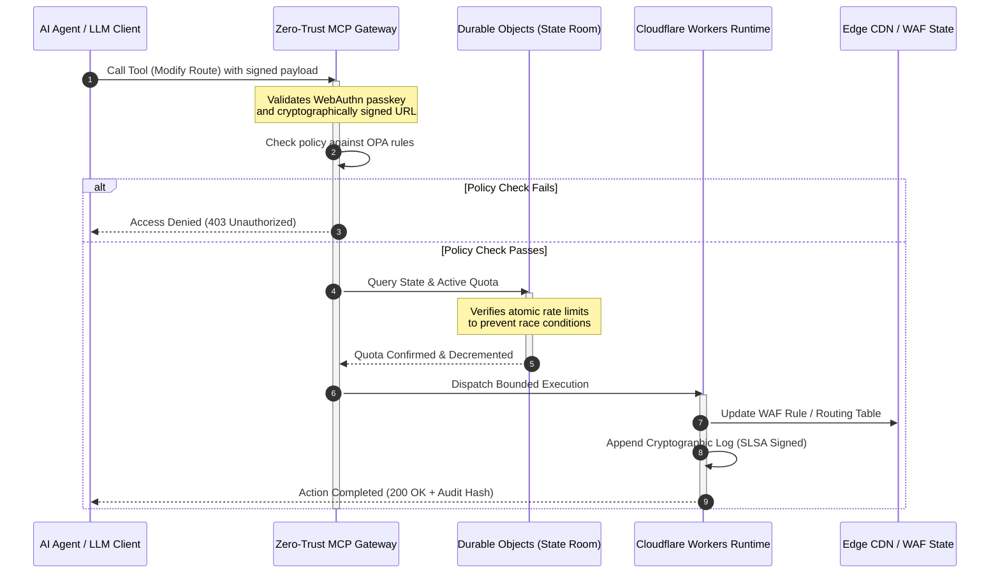

## CloudCDN: 2026లో AI-స్థానిక ఎడ్జ్ కోసం ఒక ఓపెన్-సోర్స్ బ్లూప్రింట్

CDN చర్చ ముగిసింది. ఎడ్జ్ ఇక కాష్ కాదు; ఇది AI-స్థానిక సాఫ్ట్‌వేర్ కోసం కంట్రోల్ ప్లేన్. ఏజెంట్లు సాధనాలను పిలుస్తూ, డేటాను తరలిస్తూ, కాష్‌లను శుభ్రం చేస్తూ, సంతకం చేసిన URLలను అభ్యర్థిస్తూ, మరియు వర్క్‌ఫ్లోలను సమన్వయం చేస్తూ ఉండగా, అపారదర్శక డ్యాష్‌బోర్డ్‌లు మరియు యాజమాన్య కంట్రోల్ ప్లేన్‌ల పాత నమూనా కేవలం అసౌకర్యంగా ఉండటం మానేసి నియంత్రణాత్మక బాధ్యతగా మారుతుంది. CloudCDN ఒక భిన్నమైన నమూనా కోసం వాదిస్తుంది: భద్రత, ప్రాప్యత, పనితీరు, మరియు ఆడిటబిలిటీని విక్రేత వాగ్దానాలుగా కాకుండా అమలు చేయదగిన డిఫాల్ట్‌లుగా పరిగణించే ఒక ఓపెన్, పరిశీలించదగిన, ఏజెంట్-నియంత్రించదగిన ఎడ్జ్ ప్లాట్‌ఫారమ్.

ఈ వ్యాసానికి ఓపెన్-సోర్స్ సూచన బిందువు [cloudcdn.pro ⧉](https://github.com/sebastienrousseau/cloudcdn.pro "cloudcdn.pro"). ఈ రిపాజిటరీ అనేది ఆద్యంతం చదవగలిగే మరియు స్వతంత్రంగా అమలు చేయగలిగే ఒక మల్టీ-టెనెంట్, AI-స్థానిక CDN: Cloudflare PoPలలో సబ్-100ms TTFB, MCP నియంత్రణ, Durable Objects రేట్ లిమిటింగ్, WCAG-AA ప్రాప్యత, సంతకం చేసిన URLలు, పాస్‌కీలు, SLSA Level 3, మరియు 100% కవరేజ్ వద్ద 3,185 పరీక్షలు.

---

> **కార్యనిర్వాహక సారాంశం / ముఖ్యాంశాలు**
>
> - **ఎడ్జ్ కార్యాచరణ సరిహద్దుగా మారుతుంది.** CloudCDN ప్రామాణిక CDN నోడ్‌లను సబ్-మిల్లీసెకండ్ భద్రత, రూటింగ్, మరియు యాక్సెస్ కంట్రోల్‌ను అమలు చేసే క్రియాశీల పాలసీ గేట్‌లుగా మారుస్తుంది.
> - **Durable Objects రేట్ లిమిటింగ్‌ను అటామిక్‌గా చేస్తాయి.** రియల్-టైమ్, ప్రపంచవ్యాప్తంగా స్థిరమైన కోటా అమలు, చివరికి-స్థిరమైన లిమిటర్‌లు దాడిదారులకు మరియు పనిచేయని ఏజెంట్లకు తెరిచి ఉంచే రేస్-కండిషన్ విండోను మూసివేస్తుంది.
> - **ఏజెంట్లు 42 హద్దులతో కూడిన MCP సాధనాల ద్వారా మౌలిక సదుపాయాలను నిర్వహిస్తాయి.** ఏదైనా అమలు కావడానికి ముందు ప్రతి ఇన్వొకేషన్ WebAuthn పాస్‌కీలు, సంతకం చేసిన పేలోడ్‌లు, మరియు OPA పాలసీకి వ్యతిరేకంగా ధృవీకరించబడుతుంది.
> - **సప్లై చెయిన్ ఉత్పత్తిలో ఒక భాగం.** Sigstore/Cosign ద్వారా SLSA Level 3 ప్రొవెనెన్స్ ప్రతి రిలీజ్‌ను దాని ఆడిట్ చేయబడిన మూలానికి క్రిప్టోగ్రాఫికల్‌గా అనుసంధానిస్తుంది.
> - **టెలిమెట్రీ అనేది సమ్మతి ఆధారం.** ఎడ్జ్ కార్యకలాపాలు DORA ఆర్టికల్ 5, BCBS 239, మరియు Basel III కార్యాచరణ-రిస్క్ మూలధనానికి — తర్వాత చేసే రిపోర్టింగ్ ద్వారా కాకుండా నేరుగా మ్యాప్ అవుతాయి.
>
---

## ఈ ఓపెన్-సోర్స్ ప్రాజెక్ట్ 2026లో ఎందుకు ముఖ్యం

2026లో ఎంటర్‌ప్రైజ్ IT స్టాటిక్ మౌలిక సదుపాయాల ప్రొవిజనింగ్ నుండి రియల్-టైమ్, ఈవెంట్-ఆధారిత డేటా ఆర్కెస్ట్రేషన్‌కు మారింది. రెండు మార్కెట్ శక్తులు ఈ మార్పును నడిపిస్తున్నాయి.

మొదటిది ఏజెంటిక్ AI యొక్క విస్తరణ. స్వయంప్రతిపత్తి కలిగిన మోడల్‌లు మరియు సాఫ్ట్‌వేర్ ఏజెంట్లు ఇప్పుడు సంక్లిష్టమైన కార్యాచరణ పనులను నిర్వహిస్తున్నాయి — స్వయంచాలక ముప్పు ఉపశమనం, రూటింగ్ నిర్ణయాలు, రియల్-టైమ్ లెడ్జర్ బ్యాలెన్సింగ్. అవి డ్యాష్‌బోర్డ్‌లను ఉపయోగించవు. అవి సాధనాలను పిలుస్తాయి.

రెండవది [డిజిటల్ ఆపరేషనల్ రెసిలియన్స్ యాక్ట్ (DORA) ⧉](https://eur-lex.europa.eu/legal-content/EN/TXT/?uri=CELEX%3A32022R2554 "Regulation (EU) 2022/2554 on digital operational resilience for the financial sector") యొక్క క్రియాశీల అమలు. బ్యాంకింగ్ సంస్థలు ఇక అపారదర్శక, యాజమాన్య మూడవ-పక్ష CDNలపై ఆధారపడలేవు. నియంత్రకులు సాఫ్ట్‌వేర్ సప్లై చెయిన్‌లోకి పూర్తి దృశ్యమానత, ధృవీకరించదగిన నిష్క్రమణ సామర్థ్యం, మరియు మార్చలేని క్రిప్టోగ్రాఫిక్ ఆడిట్ ట్రయిల్‌లను డిమాండ్ చేస్తారు.

కేంద్రీకృత సర్వర్ ఆర్కిటెక్చర్‌లు రియల్-టైమ్ ఆర్కెస్ట్రేషన్ శోషించలేని లేటెన్సీ జరిమానాలను విధిస్తాయి. యాజమాన్య CDNలు బ్లాక్ బాక్స్‌లుగా పనిచేస్తాయి, ఇవి సంస్థలను తాము చూడలేని, రుజువు చేయలేని సప్లై-చెయిన్ రాజీకి బహిర్గతం చేస్తాయి. CloudCDN ఈ అంతరాన్ని ఒక పారదర్శక, జీరో-ట్రస్ట్, ఓపెన్-సోర్స్ బ్లూప్రింట్‌తో మూసివేస్తుంది, ఇది ఎడ్జ్‌ను క్రియాశీల కంట్రోల్ ప్లేన్‌గా మారుస్తుంది. టెక్నాలజీ కార్యనిర్వాహకుల కోసం, ఇది చర్చను సమ్మతి ఖర్చు నుండి స్థితిస్థాపకతపై రాబడికి మారుస్తుంది: స్వయంచాలక, ఆడిట్-సిద్ధ కార్యాచరణ పైప్‌లైన్‌ల ద్వారా సంరక్షించబడిన మూలధనం.

## ఆర్కిటెక్చర్ దృష్టికోణం

CloudCDN ఆర్కిటెక్చర్ ఐదు పొరలుగా నిర్మించబడింది, కేంద్రీకృత మిడిల్‌వేర్‌ను స్థానికీకరించిన, స్టేట్‌ఫుల్ ఎడ్జ్ ప్రిమిటివ్‌లతో భర్తీ చేస్తుంది:

| పొర | డిజైన్ నిర్ణయం | ఇది ఎందుకు ముఖ్యం | తప్పుగా నిర్వహిస్తే రిస్క్ |
|---|---|---|---|
| **ఎడ్జ్ రన్‌టైమ్** | Cloudflare Workers మరియు Pages | కేంద్రీకృత VM లేటెన్సీని తొలగిస్తుంది; ప్రపంచవ్యాప్తంగా సబ్-మిల్లీసెకండ్ పాలసీలను అమలు చేస్తుంది | పాలసీ క్రమశిక్షణ లేకుండా పనితీరు లాభాలు అస్తవ్యస్తమైన ఎడ్జ్ డ్రిఫ్ట్‌ను ఉత్పత్తి చేస్తాయి |
| **స్టేట్ సమన్వయం** | Durable Objects | ప్రాంతాలలో రేట్ లిమిట్‌లు మరియు భాగస్వామ్య స్టేట్ కోసం అటామిక్, రియల్-టైమ్ స్థిరత్వాన్ని హామీ ఇస్తుంది | పంపిణీ చేయబడిన రేస్ కండిషన్‌లు, API వనరుల దుర్వినియోగం, దాటవేయబడిన పరిధి కోటాలు |
| **ఏజెంట్ ఇంటర్‌ఫేస్** | జీరో-ట్రస్ట్ MCP గేట్‌వే | AI ఏజెంట్లు నియంత్రిత హద్దుల్లో మౌలిక సదుపాయాలను నిర్వహించేలా 42 ప్రత్యేకమైన MCP సాధనాలను బహిర్గతం చేస్తుంది | అనియంత్రిత సాధన ఇన్వొకేషన్ మరియు అనధికార కాన్ఫిగరేషన్ మార్పులు |
| **యాక్సెస్ కంట్రోల్** | WebAuthn పాస్‌కీలు మరియు సంతకం చేసిన URLలు | ఆడిట్ చేయదగిన కార్యకలాపాల కోసం స్టాటిక్ పాస్‌వర్డ్‌లను క్రిప్టోగ్రాఫిక్ సంతకాలతో భర్తీ చేస్తుంది | బలహీనంగా ఆపాదించబడిన మార్పులు; పరిధి ఉల్లంఘనకు దారితీసే క్రెడెన్షియల్ చౌర్యం |
| **నాణ్యత గేట్‌లు** | SLSA Level 3 మరియు 100% పరీక్ష కవరేజ్ | బిల్డ్ మూలాన్ని గణితశాస్త్రపరంగా ధృవీకరిస్తుంది; హానికరమైన డిపెండెన్సీ ఇంజెక్షన్‌ను నిరోధిస్తుంది | సాఫ్ట్‌వేర్ సప్లై చెయిన్ ద్వారా చొప్పించబడిన హానికరమైన కోడ్ |

## ట్రాక్ చేయవలసిన కార్యాచరణ సంకేతాలు

ఎడ్జ్ సంసిద్ధత కొలవదగినది. ఇవి ఉద్దేశ్యం కాకుండా అమలు సామర్థ్యాన్ని ప్రదర్శించే పరిమాణాత్మక సూచికలు:

| సంకేతం | మెట్రిక్ / బెంచ్‌మార్క్ | నియంత్రణాత్మక సూచన | ప్లాట్‌ఫారమ్ అమలు |
|---|---|---|---|
| **42 MCP సాధనాలు** | స్వయంచాలక నిర్వహణ కోసం హద్దులతో కూడిన సాధన-రిజిస్ట్రీ గణన | COBIT 2019 (BAI06) | OPA పాలసీలకు వ్యతిరేకంగా ఏజెంట్ సంతకాలను ధృవీకరించే MCP గేట్‌వే |
| **Durable Objects** | జీరో-లీక్, సబ్-మిల్లీసెకండ్ అటామిక్ కోటా అమలు | DORA ఆర్టికల్ 6 | గ్లోబల్ API కోటా స్టేట్‌ను ట్రాక్ చేసే Durable Objects |
| **పాస్‌కీలు మరియు సంతకం చేసిన URLలు** | FIDO2 WebAuthn ద్వారా 100% అడ్మిన్ సెషన్‌లు ధృవీకరించబడ్డాయి | DORA ఆర్టికల్ 30 | ఎడ్జ్ రూటర్‌లో పొందుపరచబడిన క్రిప్టోగ్రాఫిక్ సంతక తనిఖీలు |
| **SLSA Level 3** | క్రిప్టోగ్రాఫికల్‌గా సంతకం చేసిన బిల్డ్ మేనిఫెస్ట్‌లు (Sigstore) | DORA ఆర్టికల్ 30 | సంతకం చేసిన బిల్డ్ మెటాడేటాను ఉత్పత్తి చేసే GitHub Actions పైప్‌లైన్‌లు |
| **3,185 యూనిట్ పరీక్షలు** | 100% కవరేజ్; ప్రతి రిలీజ్‌లో రిగ్రెషన్ గేట్‌లు | NIST CSF 2.0 (PR.DS-01) | ఏదైనా పరీక్ష విఫలమైతే అమలును నిలిపివేసే CI పైప్‌లైన్‌లు |

## CDN ఒక క్రియాశీల కంట్రోల్ ప్లేన్‌గా మారుతుంది

సాంప్రదాయ CDNలు నిష్క్రియ, స్టాటిక్ కంటెంట్ యాక్సిలరేషన్ చుట్టూ రూపొందించబడ్డాయి. CloudCDN ఈ నమూనాను పునర్నిర్వచిస్తుంది. Cloudflare Workers మరియు Durable Objects అనుసంధానంతో, ఎడ్జ్ ఒక క్రియాశీల, స్టేట్‌ఫుల్ పాలసీ గేట్‌గా పనిచేస్తుంది.

ఒక AI ఏజెంట్ లేదా స్వయంచాలక ప్రక్రియ మౌలిక సదుపాయాల కాన్ఫిగరేషన్ మార్పును లేదా రూటింగ్ సర్దుబాటును అభ్యర్థించినప్పుడు, అది హానికరమైన, కేంద్రీకృత డేటాబేస్‌తో మాట్లాడదు. అభ్యర్థన సమీప ఎడ్జ్ నోడ్ వద్ద అడ్డగించబడుతుంది మరియు ఏదైనా అమలు కావడానికి ముందు గుర్తింపు, పాలసీ, మరియు కోటా తనిఖీల ద్వారా నడపబడుతుంది:

ఆ క్రమంలోని ప్రతి దశ ఒక ఆపాదించదగిన, సంతకం చేసిన రికార్డును ఉత్పత్తి చేస్తుంది. కంటెంట్‌ను వేగవంతం చేసే CDNకి మరియు పరిపాలించదగిన కంట్రోల్ ప్లేన్‌కి మధ్య ఉన్న తేడా అదే.

## ఓపెన్ సోర్స్ ట్రస్ట్ నమూనాను ఎందుకు మారుస్తుంది

చీఫ్ ఇన్ఫర్మేషన్ సెక్యూరిటీ ఆఫీసర్‌ల కోసం, అపారదర్శక యాజమాన్య CDNలు సంచిత రిస్క్‌ను ప్రదర్శిస్తాయి. క్లోజ్డ్-సోర్స్ ఎడ్జ్ నెట్‌వర్క్‌లు బ్లాక్ బాక్స్‌లు: విక్రేత అంతర్గత రాజీని ఎదుర్కొంటే, ఉల్లంఘన బహిరంగంగా వెల్లడయ్యే వరకు బ్యాంకుకు జీరో దృశ్యమానత ఉంటుంది.

CloudCDN ఆ అసమానతను మూడు యంత్రాంగాలపై నిర్మించిన పూర్తిగా ఆడిట్ చేయదగిన, ఓపెన్-సోర్స్ ట్రస్ట్ నమూనాతో భర్తీ చేస్తుంది:

1. **గణితశాస్త్ర బిల్డ్ ప్రొవెనెన్స్.** SLSA Level 3 కింద, ప్రతి రిలీజ్ దాని ఓపెన్-సోర్స్ GitHub రిపాజిటరీకి క్రిప్టోగ్రాఫికల్‌గా అనుసంధానించబడుతుంది. Cloudflare యొక్క గ్లోబల్ ఎడ్జ్ నోడ్‌లపై నడుస్తున్న బైనరీ సరిగ్గా ఆడిట్ చేయబడిన సోర్స్ కోడ్‌ను కలిగి ఉందని CISO — ఒప్పందపరంగా కాకుండా గణితశాస్త్రపరంగా — ధృవీకరించవచ్చు.
2. **నిరంతర, బహిరంగ భద్రతా ఆడిట్‌లు.** కోడ్‌బేస్ స్వయంచాలక స్కాన్‌లు, బహిరంగ దుర్బలత్వ వెల్లడి, మరియు పీర్-రివ్యూ కోడ్ ఆడిట్‌లకు లోబడి ఉంటుంది. అస్పష్టత ఒక నియంత్రణ కాదు; సమీక్ష అవును.
3. **విక్రేత లాక్-ఇన్ లేదు (DORA ఆర్టికల్ 28).** క్లిష్టమైన మూడవ-పక్ష ప్రొవైడర్‌ల నుండి స్పష్టమైన, పరీక్షించిన నిష్క్రమణ వ్యూహాన్ని రుజువు చేయాలని DORA బ్యాంకులను కోరుతుంది. CloudCDN ఓపెన్ సోర్స్ కావడం మరియు ప్రామాణిక సర్వర్‌లెస్ ప్రిమిటివ్‌లపై నిర్మించబడటం వల్ల, సంస్థలు ఎడ్జ్ కాన్ఫిగరేషన్‌లను Cloudflare నుండి ఇతర సర్వర్‌లెస్ రన్‌టైమ్‌లకు లేదా ప్రైవేట్ Kubernetes క్లస్టర్‌లకు మార్చగలవు — మరియు ఆ సామర్థ్యాన్ని నియంత్రకుడికి రుజువు చేయగలవు.

## బ్యాంక్-గ్రేడ్ ఎడ్జ్ నమూనా

CloudCDN గ్లోబల్ ఆర్థిక రంగం యొక్క సమ్మతి ప్రమాణాలను చేరుకోవడానికి రూపొందించబడింది, సాంకేతిక ఎడ్జ్ కార్యకలాపాలను పర్యవేక్షకులు వాస్తవంగా పరిశీలించే ఫ్రేమ్‌వర్క్‌లకు నేరుగా మ్యాప్ చేస్తుంది:

- **మోడల్ రిస్క్ నిర్వహణ ([US Fed SR 11-7 ⧉](https://www.federalreserve.gov/supervisionreg/srletters/sr1107.htm "Supervisory Guidance on Model Risk Management") / UK PRA SS1/23).** కార్యాచరణ పనులను అమలు చేసే స్వయంప్రతిపత్తి మోడల్‌లు మోడల్-రిస్క్ గవర్నెన్స్ కిందకు వస్తాయి. CloudCDN యొక్క MCP గేట్‌వే ఏజెంటిక్ సాధనాలను పరిమాణాత్మక మోడల్‌లుగా పరిగణిస్తుంది: కఠినమైన పాలసీ హద్దులు, రియల్-టైమ్ లాగింగ్, మరియు అధిక-ప్రభావ చర్యల కోసం తప్పనిసరి హ్యూమన్-ఇన్-ది-లూప్ ఓవర్‌రైడ్‌లు.
- **BCBS 239 (రిస్క్ డేటా అగ్రిగేషన్).** ఎడ్జ్ వద్ద లావాదేవీ డేటాను సంగ్రహించడం, ట్యాగ్ చేయడం, మరియు నిర్మించడం ద్వారా, కార్యాచరణ మెట్రిక్‌లు రియల్-టైమ్‌లో ఉత్పత్తి అవుతాయి — డేటా సమగ్రత, సకాలంలో అందుబాటు, మరియు నియంత్రణాత్మక ట్రేసబిలిటీ కోసం BCBS 239 అవసరాలకు సరిపోతుంది.
- **DORA ఆర్టికల్ 5 (బోర్డు జవాబుదారీతనం).** కార్యాచరణ స్థితిస్థాపకత కోసం అంతిమ వ్యక్తిగత బాధ్యతను బోర్డు భరిస్తుంది. CloudCDN ఎడ్జ్ టెలిమెట్రీని సాంకేతికేతర డైరెక్టర్లు ఒక వ్యక్తిగత-బాధ్యత ఆడిట్‌లోకి తీసుకువెళ్లగల పరిమాణాత్మక, ధృవీకరించదగిన ఆధారంగా అనువదిస్తుంది.
- **Basel III కార్యాచరణ-రిస్క్ మూలధనం.** బ్యాంకులు కార్యాచరణ రిస్క్‌కు వ్యతిరేకంగా నియంత్రణాత్మక మూలధనాన్ని కలిగి ఉంటాయి. స్వయంచాలక DR ఫెయిల్‌ఓవర్ మరియు SLSA Level 3 ప్రొవెనెన్స్ సంస్థ యొక్క కార్యాచరణ రిస్క్ ప్రొఫైల్‌ను తగ్గిస్తాయి — కేవలం ఆడిట్‌ను సంతృప్తిపరచడం కాదు, బ్యాలెన్స్ షీట్‌పై మూలధనాన్ని సంరక్షిస్తాయి.

## బ్యాంక్ రకం ప్రకారం దీని అర్థం ఏమిటి

### గ్లోబల్ సిస్టమిక్‌గా ముఖ్యమైన బ్యాంకులు (G-SIBs)

G-SIBs బహుళ అధికార పరిధులలో భారీ లావాదేవీ వాల్యూమ్‌లను నడుపుతాయి. ప్రాధాన్యత విచ్ఛిన్నమైన లెగసీ పరిధి నియంత్రణలను ఒకే, ఏకీకృత ఎడ్జ్ ప్లేన్‌తో భర్తీ చేయడం. CloudCDN నమూనాను అమలు చేయడం ద్వారా G-SIB భద్రతా పాలసీలు, API గేట్‌వేలు, మరియు ఏజెంటిక్ గవర్నెన్స్‌ను ప్రపంచవ్యాప్తంగా ప్రామాణీకరించగలదు — మరియు త్రైమాసిక తడబాటుగా కాకుండా ఆపరేషన్ యొక్క ఉప-ఉత్పత్తిగా DORA-సమ్మతమైన సాక్ష్య పైప్‌లైన్‌లను ఉత్పత్తి చేయగలదు.

### లావాదేవీ మరియు కార్పొరేట్ బ్యాంకులు

లావాదేవీ బ్యాంకుల కోసం, క్లయింట్-ముఖ ఉత్పత్తి అనేది అమలు వేగం, భద్రత, మరియు డేటా పారదర్శకత యొక్క ఒక కట్ట. CloudCDN నమూనా ఈ బ్యాంకులను కార్పొరేట్ ట్రెజరర్‌లకు సురక్షితమైన API డ్యాష్‌బోర్డ్‌లు మరియు రియల్-టైమ్ నగదు-ట్రాకింగ్ సేవలను బహిర్గతం చేయడానికి అనుమతిస్తుంది — ఎంటర్‌ప్రైజ్ డిపాజిట్‌లను రక్షించే ఒక స్థితిస్థాపక ఎడ్జ్ భంగిమ.

### ప్రాంతీయ మరియు చిన్న బ్యాంకులు

ప్రాంతీయ బ్యాంకులు ఇంజనీరింగ్ బడ్జెట్‌లు లేకుండా G-SIBs వలె అదే ముప్పు నటులను ఎదుర్కొంటాయి. ఒక ఓపెన్-సోర్స్, బ్యాంక్-గ్రేడ్ ఎడ్జ్ బ్లూప్రింట్ నియంత్రణలను బాక్స్ నుండి బయటకు అందిస్తుంది: యాజమాన్య లైసెన్స్ ఖర్చులు లేకుండా తక్షణ నియంత్రణాత్మక అమరిక, మరియు దాన్ని రుజువు చేయడానికి సోర్స్ కోడ్.

## బోర్డ్‌రూమ్ ప్లేబుక్

కార్యాచరణ స్థితిస్థాపకత ఇక అదృశ్య బ్యాక్-ఆఫీస్ IT మెట్రిక్ కాదు; ఇది వ్యక్తిగత బాధ్యతతో ముడిపడిన ఒక బోర్డ్‌రూమ్ ప్రాధాన్యత. 2026లో నియంత్రకులు, క్లయింట్లు, మరియు వాటాదారుల నమ్మకాన్ని నిలుపుకునే సంస్థలు టెక్నాలజీని ధృవీకరించదగిన, గమనించదగిన ఆస్తిగా పరిగణిస్తాయి.

సీనియర్ టెక్నాలజీ నాయకుల కోసం రోడ్‌మ్యాప్ చిన్నది:

1. **ఆధారాన్ని ఒక ఉత్పత్తిగా తప్పనిసరి చేయండి.** ఎడ్జ్ వద్ద స్వయంచాలక, స్వీయ-పత్రీకరణ పైప్‌లైన్‌ల కోసం బడ్జెట్ కేటాయించండి — ఆడిటర్ కోసం సమకూర్చినది కాదు, ఆపరేషన్ ద్వారా ఉత్పత్తి చేయబడిన ఆధారం.
2. **స్టేట్‌ఫుల్ ఎడ్జ్ నియంత్రణకు తరలండి.** రేట్ లిమిటింగ్, WAF, మరియు గుర్తింపు ధృవీకరణను కేంద్రీకృత సర్వర్‌ల నుండి తీసివేసి అటామిక్ ఎడ్జ్ ప్రిమిటివ్‌లపైకి తీసుకురండి.
3. **క్రిప్టోగ్రాఫిక్ ఏజెంటిక్ హద్దులను ఏర్పాటు చేయండి.** ప్రతి స్వయంచాలక సాధన ఇన్వొకేషన్ కోసం పాస్‌కీ మరియు OPA ధృవీకరణతో జీరో-ట్రస్ట్ MCP గేట్‌వేలను అమలు చేయండి.
4. **ఓపెన్-సోర్స్ బిల్డ్ ఆడిట్‌లను తప్పనిసరి చేయండి.** SLSA Level 3 బిల్డ్ ప్రొవెనెన్స్‌ను ఒక ఆకాంక్షగా కాకుండా అమలుకు షరతుగా చేయండి.

## తరచుగా అడిగే ప్రశ్నలు

**CloudCDN DORA ఆడిట్‌ల కోసం సిద్ధంగా ఉందా?**

అవును. CloudCDN రిజిస్టర్ ఆఫ్ ఇన్ఫర్మేషన్‌పై ITS టెంప్లేట్‌లకు (RT.01 నుండి RT.15) మరియు DORA ఆర్టికల్ 30 ఒప్పంద నిబంధనలకు నేరుగా మ్యాప్ అయ్యే స్వయంచాలక సమ్మతి ఆధారాన్ని ఉత్పత్తి చేయడానికి రూపొందించబడింది.

**రేట్ లిమిటింగ్ కోసం Durable Objects ఉపయోగించడం వల్ల ప్రయోజనం ఏమిటి?**

సాంప్రదాయ పంపిణీ చేయబడిన రేట్ లిమిటర్‌లు చివరికి-స్థిరత్వంపై ఆధారపడతాయి, ఇది దాడిదారులు లేదా పనిచేయని ఏజెంట్లు దోపిడీ చేయగల లేటెన్సీ విండోను వదిలివేస్తుంది. Durable Objects ప్రపంచవ్యాప్తంగా తక్షణ, అటామిక్ స్థిరత్వాన్ని హామీ ఇస్తాయి, రేస్-కండిషన్ విండోను పూర్తిగా మూసివేస్తాయి.

**CloudCDNను AI-స్థానికంగా చేసేది ఏమిటి?**

దాని MCP-నియంత్రిత కార్యకలాపాలు మరియు ఏజెంట్-అవేర్ కంట్రోల్ మోడల్. మౌలిక సదుపాయాలు క్రిప్టోగ్రాఫిక్ గుర్తింపు మరియు పాలసీ హద్దులతో 42 నియంత్రిత సాధనాల ద్వారా నిర్వహించబడతాయి — కేవలం మానవ డ్యాష్‌బోర్డ్‌లు కాకుండా, స్వయంప్రతిపత్తి వర్క్‌ఫ్లోల కోసం రూపొందించబడ్డాయి.

**ఓపెన్-సోర్స్ కోడ్ జీరో-డే దోపిడీల రిస్క్‌ను పెంచుతుందా?**

లేదు. యాజమాన్య, క్లోజ్డ్-సోర్స్ CDNలు అస్పష్టత ద్వారా భద్రతపై ఆధారపడతాయి. CloudCDN యొక్క కోడ్‌బేస్ నిరంతరం స్వయంచాలక పరీక్ష, బహిరంగ పీర్ రివ్యూ, మరియు SLSA Level 3 ధృవీకరణకు లోబడి ఉంటుంది — ఒక ధృవీకరించదగినంత అధిక ట్రస్ట్ థ్రెషోల్డ్.

## సూచనలు

- European Parliament and Council of the European Union, (2022). [Regulation (EU) 2022/2554 on digital operational resilience for the financial sector (DORA) ⧉](https://eur-lex.europa.eu/legal-content/EN/TXT/?uri=CELEX%3A32022R2554 "Regulation (EU) 2022/2554 on digital operational resilience for the financial sector (DORA)"). Brussels: Official Journal of the European Union.
- Basel Committee on Banking Supervision (BCBS), (2013). [Principles for effective risk data aggregation and risk reporting (BCBS 239) ⧉](https://www.bis.org/publ/bcbs239.htm "Principles for effective risk data aggregation and risk reporting (BCBS 239)"). Basel: Bank for International Settlements.
- Board of Governors of the Federal Reserve System, (2011). [Supervisory Guidance on Model Risk Management (SR Letter 11-7) ⧉](https://www.federalreserve.gov/supervisionreg/srletters/sr1107.htm "Supervisory Guidance on Model Risk Management (SR Letter 11-7)"). Washington D.C.: Federal Reserve.
- Cloudflare, (2026). [Durable Objects documentation: stateful edge coordination ⧉](https://developers.cloudflare.com/durable-objects/ "Durable Objects documentation"). San Francisco: Cloudflare.
- Cloudflare, (2026). [Building AI agents with MCP, authentication and Durable Objects ⧉](https://blog.cloudflare.com/building-ai-agents-with-mcp-authn-authz-and-durable-objects/ "Building AI agents with MCP, authentication and Durable Objects").
- GitHub, (2026). [cloudcdn.pro repository ⧉](https://github.com/sebastienrousseau/cloudcdn.pro "cloudcdn.pro repository").
