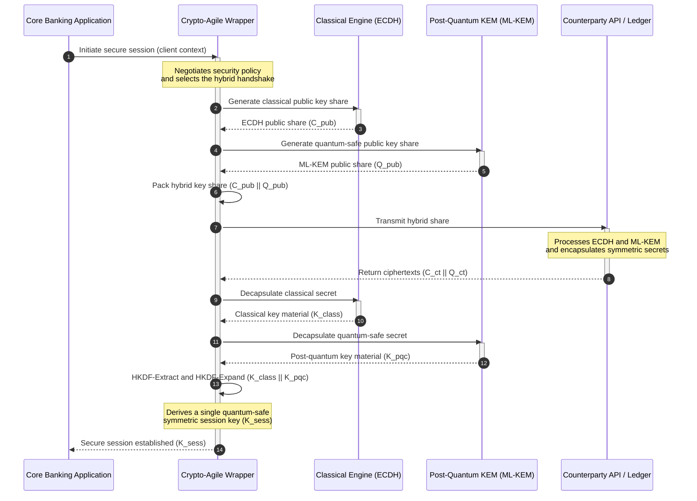

## KyberLib మరియు 2026లో పోస్ట్-క్వాంటం బ్యాంకింగ్ మైగ్రేషన్: ప్రమాణాల నుండి కోడ్ వరకు

పోస్ట్-క్వాంటం మైగ్రేషన్ ఇక ప్రణాళికా వ్యాయామంగా మిగలలేదు. 2026లో ఇది ఒక క్రియాశీల నిర్వహణ అవసరం, మరియు నియంత్రణ ఉద్దేశ్యానికీ ఇంజనీరింగ్ అమలుకూ మధ్య ఉన్న అంతరమే ఇప్పుడు ముప్పు నిలిచి ఉన్న చోటు. [KyberLib ⧉](https://github.com/sebastienrousseau/kyberlib "kyberlib") ఆ అంతరంలో కొంత భాగాన్ని పూడుస్తుంది: ఖరారైన FIPS 203 పారామితులకు అనుగుణంగా ML-KEM‌ను అమలు చేసి, దానిని ఒక బ్యాంకు లావాదేవీ ఎస్టేట్‌కు నిజంగా అవసరమైన క్రిప్టో-చురుకైన సరిహద్దుల్లో చుట్టే ఉత్పత్తి-ఆధారిత, మెమరీ-సురక్షిత Rust లైబ్రరీ.

---

> **కార్యనిర్వాహక సారాంశం / ముఖ్య అంశాలు**
>
> - **ముప్పు ఇప్పటికే క్రియాశీలంగా ఉంది.** ప్రత్యర్థులు నేడు "Store Now, Decrypt Later" హార్వెస్టింగ్‌ను నడుపుతున్నారు; క్రిప్టోగ్రాఫికల్‌గా సంబంధిత క్వాంటం కంప్యూటర్ వచ్చే రోజున డేటా గోప్యత గత కాలానికి కూడా వర్తించేలా విఫలమవుతుంది.
> - **ప్రమాణాలు ఖరారయ్యాయి.** NIST FIPS 203 (ML-KEM) మరియు FIPS 204 (ML-DSA) ఆడిట్ కమిటీలకు స్పష్టమైన, పరీక్షించదగిన బెంచ్‌మార్క్‌ను అందిస్తాయి — ఇక "ప్రమాణాల కోసం వేచి ఉన్నాము" అనే రక్షణ లేదు.
> - **KyberLib ఇంజనీరింగ్ బ్లూప్రింట్.** మెమరీ-సురక్షిత Rust, HSMలు మరియు స్మార్ట్ కార్డుల కోసం `no_std` కంపైలేషన్, మరియు క్లాసికల్ ఇంటర్‌ఆపరబిలిటీని కాపాడే హైబ్రిడ్ హ్యాండ్‌షేక్ నమూనాలు.
> - **క్రిప్టో-చురుకుదనం మన్నికైన లక్ష్యం.** స్థిరమైన అబ్‌స్ట్రాక్షన్ సరిహద్దులు అప్లికేషన్ పునర్రచనలు లేకుండా ప్రిమిటివ్‌లను మార్చనిస్తాయి — ఇది ఏ ఒక్క అల్గోరిథం కంటే ఎక్కువ కాలం నిలిచే పాఠం.
> - **బోర్డులు బాధ్యత మోస్తాయి.** DORA ఆర్టికల్ 5 డైరెక్టర్లపై వ్యక్తిగత బాధ్యతను ఉంచుతుంది; పరిశీలించదగిన, గమనించదగిన మైగ్రేషన్ కోడ్ దానిని సంతృప్తిపరిచే సాక్ష్యం.
>
---

## ఈ ఓపెన్-సోర్స్ ప్రాజెక్ట్ 2026లో ఎందుకు ముఖ్యం

అసమమిత క్రిప్టోగ్రఫీ కాలం చెల్లేదిశగా చేరుకుంటుండగా, ముప్పు క్రిప్టోగ్రాఫికల్‌గా సంబంధిత క్వాంటం కంప్యూటర్ నిర్మించబడేంత వరకు వేచి ఉండదు. ప్రత్యర్థులు ఇప్పుడే **"Store Now, Decrypt Later" (SNDL)** దాడులను అమలు చేస్తున్నారు — కార్పొరేట్ బ్యాంకు లావాదేవీలు, వాణిజ్య రహస్యాలు, సంస్థాగత సంభాషణల ఎన్‌క్రిప్టెడ్ రవాణా స్ట్రీమ్‌లను హార్వెస్ట్ చేసి, క్వాంటం సామర్థ్యాలు పరిపక్వమైనప్పుడు వాటిని డీక్రిప్ట్ చేయాలనే ఉద్దేశ్యంతో. ఒక బ్యాంకుకు, నేడు వైర్‌పై ఉన్న ప్రతి క్లాసికల్ హ్యాండ్‌షేక్ ఆలస్యంగా పేలే తేదీ కలిగిన గోప్యతా ఉల్లంఘనే.

నియంత్రణ సంస్థలు నిర్దిష్ట బాధ్యతలతో స్పందించాయి:

1. **DORA ఆర్టికల్ 6 (ICT రిస్క్ నిర్వహణ)** సంస్థలు తమ క్రిప్టోగ్రాఫిక్ ఎస్టేట్ అంతటా దుర్బలత్వాలను మ్యాప్ చేయాలని, గుర్తించాలని, తగ్గించాలని కోరుతుంది — ఎవరూ జాబితా చేయని మిడిల్‌వేర్‌లో పాతుకుపోయిన అసమమిత కీ ఎక్స్‌ఛేంజ్‌తో సహా.
2. **NIST FIPS 203 మరియు 204** కీ ఎన్‌క్యాప్సులేషన్ (ML-KEM) మరియు డిజిటల్ సంతకాల (ML-DSA) కోసం అధికారిక పోస్ట్-క్వాంటం ప్రమాణాలను స్థాపిస్తాయి, తద్వారా ఆడిట్ కమిటీలకు మైగ్రేషన్ పురోగతిని కొలవగల ప్రమాణీకృత బెంచ్‌మార్క్‌ను అందిస్తాయి.

ప్రత్యక్ష కార్యకలాపాలకు అంతరాయం కలిగించకుండా ఈ మైగ్రేషన్‌ను అమలు చేయడానికి పాలసీ పత్రాల నుండి **పరిశీలించదగిన, ఓపెన్-సోర్స్ క్రిప్టోగ్రాఫిక్ మౌలిక సదుపాయాల** వైపు కదలడం అవసరం. [KyberLib ⧉](https://github.com/sebastienrousseau/kyberlib "kyberlib") ఖచ్చితంగా అదే అందిస్తుంది: FIPS 203‌కు అనుగుణమైన మెమరీ-సురక్షిత Rust లైబ్రరీ, ఇది పోస్ట్-క్వాంటం పరివర్తనను కొలవగల, ధృవీకరించదగిన ఇంజనీరింగ్ పైప్‌లైన్‌గా మారుస్తుంది — మరియు సాంకేతిక పెట్టుబడి సంభాషణను స్పష్టమైన Return on Resilience వైపు మళ్ళిస్తుంది.

## ఆర్కిటెక్చర్ దృక్కోణం

KyberLib స్థిరమైన API సరిహద్దుల వెనుక ఉంటుంది, ఇది తక్కువ-స్థాయి క్రిప్టోగ్రాఫిక్ ప్రిమిటివ్‌లలో మార్పుల నుండి బ్యాంకు యొక్క ప్రధాన లావాదేవీ అప్లికేషన్‌లను వేరుచేస్తుంది.

| పొర | రూపకల్పన నిర్ణయం | ఎందుకు ముఖ్యం | తప్పుగా నిర్వహిస్తే ముప్పు |
|---|---|---|---|
| **ప్రిమిటివ్** | FIPS 203 ML-KEM కీ ఎన్‌క్యాప్సులేషన్ | క్లాసికల్ Diffie-Hellman మరియు RSA కీ ఎక్స్‌ఛేంజ్‌ను లాటిస్-ఆధారిత నిర్మాణాలతో భర్తీ చేస్తుంది | ఖరారైన FIPS 203 పారామితులతో అననుగుణ్యత, ఇది విఫలమైన అనుగుణ్యత ఆడిట్‌లకు దారితీస్తుంది |
| **భాష** | మెమరీ-సురక్షిత Rust అమలు | C/C++కు స్థానికమైన మెమరీ-కరప్షన్ దుర్బలత్వాలను (బఫర్ ఓవర్‌ఫ్లోలు, use-after-free) తొలగిస్తుంది | డిపెండెన్సీ విస్తరణ బిల్డ్-చైన్ సమగ్రతను రాజీ చేస్తుంది |
| **అబ్‌స్ట్రాక్షన్** | స్థిరమైన క్రిప్టో-చురుకైన సరిహద్దులు | ప్రమాణాలు అభివృద్ధి చెందుతున్నప్పుడు అప్లికేషన్‌లు ఏకీకృత ఇంటర్‌ఫేస్ వెనుక అల్గోరిథంలను మార్చుకుంటాయి | హార్డ్-కోడెడ్ ప్రిమిటివ్‌లు ప్రతి భవిష్యత్ మైగ్రేషన్‌లో మాన్యువల్ పునర్రచనలను బలవంతం చేస్తాయి |
| **డిప్లాయ్‌మెంట్** | హైబ్రిడ్ ఎన్‌క్రిప్షన్ హ్యాండ్‌షేక్‌లు | డ్యూయల్-ర్యాప్డ్ ఎన్వలప్‌లో పోస్ట్-క్వాంటం KEMలను క్లాసికల్ అల్గోరిథంలతో కలుపుతుంది | లెగసీ ఇంటర్‌ఆపరబిలిటీ నష్టం లేదా నిశ్శబ్ద కాన్ఫిగరేషన్ డ్రిఫ్ట్ |
| **హామీ** | SLSA Level 3 ప్రొవెనెన్స్ మరియు పరిశీలించదగిన పరీక్షలు | కోడ్ మూలం మరియు ప్రొవెనెన్స్‌కు హామీ ఇస్తుంది; ఉదాహరణలను వరుసవరుసగా ఆడిట్ చేయవచ్చు | సెక్యూరిటీ థియేటర్ — అమలు లోపాలు ఉత్పత్తిలో బయటపడే బ్లాక్-బాక్స్ లైబ్రరీలు |

## గమనించవలసిన నిర్వహణ సంకేతాలు

పర్యవేక్షక బోర్డులకు మరియు నియంత్రణ సంస్థలకు పోస్ట్-క్వాంటం అనుగుణ్యతను నిరూపించడం అంటే నిర్దిష్ట, పరిమాణాత్మక మెట్రిక్‌లను ట్రాక్ చేయడం:

| సంకేతం | మెట్రిక్ | నియంత్రణ సూచన | ప్లాట్‌ఫారమ్ అమలు |
|---|---|---|---|
| **FIPS 203 ML-KEM అనుగుణ్యత** | ఖరారైన పారామితులతో (ML-KEM-512/768/1024) 100% అనుగుణ్యత | NIST FIPS 203 | KyberLib మాడ్యూల్స్ లోపల కంపైల్ చేయబడిన పారామితి-ధృవీకృత లాటిస్ క్రిప్టోగ్రఫీ |
| **క్రిప్టోగ్రాఫిక్ జాబితా** | అన్ని సిస్టమ్‌ల అంతటా అసమమిత కీ-ఎక్స్‌ఛేంజ్ వినియోగం యొక్క పూర్తి జాబితా | NIST SP 1800-38 | క్రియాశీల సైఫర్ సూట్‌లను కేంద్రీయ రిజిస్ట్రీకి లాగ్ చేసే స్వయంచాలక స్కానింగ్ ఏజెంట్‌లు |
| **హైబ్రిడ్ కీ ఎక్స్‌ఛేంజ్** | హైబ్రిడ్ ఎన్వలప్‌లో అమలయ్యే రవాణా-పొర హ్యాండ్‌షేక్‌ల శాతం | DORA ఆర్టికల్ 6 | క్లాసికల్ TLS 1.3 హ్యాండ్‌షేక్‌లను PQC ఎన్‌క్యాప్సులేషన్‌లో చుట్టే నెట్‌వర్క్ ప్రాక్సీలు |
| **`no_std` కంపైలేషన్** | పరిమిత లక్ష్యాల కోసం Rust ప్రామాణిక లైబ్రరీ లేకుండా కంపైల్ చేయగల సామర్థ్యం | DORA ఆర్టికల్ 30 | హార్డ్‌వేర్ సెక్యూరిటీ మాడ్యూల్స్ కోసం KyberLibలో షరతులతో కూడిన `no_std` కంపైలేషన్ |
| **క్రిప్టో-చురుకుదన సూచిక** | API గేట్‌వే అంతటా క్రిప్టోగ్రాఫిక్ ప్రిమిటివ్‌ను మార్చడానికి పట్టే నిమిషాల సమయం | UK PRA SS1/23 | రన్‌టైం చరరాశుల ద్వారా అల్గోరిథం కేటాయింపును నిర్వహించే అబ్‌స్ట్రాక్ట్ రూటింగ్ రిజిస్ట్రీలు |

## పోస్ట్-క్వాంటం క్రిప్టోగ్రఫీ కోసం Rust ఎందుకు ముఖ్యం

ML-KEM వంటి పోస్ట్-క్వాంటం అల్గోరిథంలను అమలు చేయడానికి బహుపది వలయాలపై సంక్లిష్టమైన, తక్కువ-స్థాయి గణిత ప్రక్రియలు అవసరం. చారిత్రకంగా, ఆ ప్రక్రియలను ఉత్పత్తి వేగంతో నడపడం అంటే చేతితో రాసిన C/C++ లేదా అసెంబ్లీ — ఒక బ్యాంకు అతి తక్కువగా పొరపాటు చేయగల కోడ్‌లో మెమరీ కరప్షన్‌కు పెద్ద దాడి ఉపరితలం.

Rust క్రిప్టోగ్రాఫిక్ ఇంజనీరింగ్ యొక్క భద్రతా స్థితిని మూడు నిర్దిష్ట మార్గాలలో మారుస్తుంది:

1. **కంపైల్-టైం మెమరీ భద్రత.** Rust యాజమాన్య నమూనా బఫర్ ఓవర్‌ఫ్లోలు, డబుల్ ఫ్రీలు, మరియు use-after-free లోపాలు కంపైల్ సమయంలోనే నివారించబడతాయని హామీ ఇస్తుంది. కీ పరిమాణాలు మరియు సైఫర్‌టెక్స్ట్‌లు వాటి క్లాసికల్ ప్రతిరూపాల కంటే గణనీయంగా పెద్దగా ఉండే పోస్ట్-క్వాంటం లైబ్రరీలకు ఇది తీవ్రంగా ముఖ్యం.
2. **నిర్ధారిత, జీరో-కాస్ట్ అబ్‌స్ట్రాక్షన్‌లు.** Rust గార్బేజ్ కలెక్టర్ లేకుండా నేటివ్ మెషిన్ కోడ్‌గా కంపైల్ అవుతుంది, కాబట్టి భద్రతను కాపాడుతూ అమలు వేగం మరియు మెమరీ ఫుట్‌ప్రింట్ C-ఆధారిత లైబ్రరీలతో సరిపోతాయి లేదా వాటిని మించిపోతాయి.
3. **`no_std` అనుకూలత.** KyberLib Rust ప్రామాణిక లైబ్రరీ లేకుండా కంపైల్ అవుతుంది, కాబట్టి ఇది పరిమిత, బేర్-మెటల్ వాతావరణాలలో — హార్డ్‌వేర్ సెక్యూరిటీ మాడ్యూల్స్ మరియు స్మార్ట్ కార్డులతో సహా — నడుస్తుంది, తద్వారా బ్యాంకు-స్థాయి క్రిప్టోగ్రఫీని భౌతిక భద్రతా సరిహద్దుల్లో ఉంచుతుంది.

## క్రిప్టో-చురుకైన ఆర్కిటెక్చర్‌ను రూపొందించడం

క్రిప్టోగ్రాఫిక్ మైగ్రేషన్‌లలో సాంప్రదాయ వైఫల్య రీతి హార్డ్-కోడింగ్: అల్గోరిథం-నిర్దిష్ట అంచనాలు నేరుగా అప్లికేషన్ లాజిక్‌లో పొందుపరచబడి, ప్రతి పరివర్తనలో బాధాకరంగా మళ్ళీ కనుగొనబడతాయి. 2026 కోసం మన్నికైన లక్ష్యం **క్రిప్టో-చురుకుదనం** — అల్గోరిథంలను స్థిరమైన ఇంటర్‌ఫేస్ వెనుక మార్చుకోగల మాడ్యూల్స్‌గా పరిగణించే ఒక అబ్‌స్ట్రాక్షన్ పొర, తద్వారా తదుపరి మైగ్రేషన్ ఎస్టేట్-మొత్తం పునర్రచన కాకుండా కాన్ఫిగరేషన్ మార్పు అవుతుంది.

క్రింది క్రమం KyberLib యొక్క క్రిప్టో-చురుకైన ర్యాపర్ ఒక హైబ్రిడ్ (క్లాసికల్ ప్లస్ పోస్ట్-క్వాంటం) కీ-ఎక్స్‌ఛేంజ్ హ్యాండ్‌షేక్‌ను ఎలా సమన్వయం చేస్తుందో చూపిస్తుంది:

హైబ్రిడ్ ఎన్వలప్ నిర్వహణపరంగా ముఖ్యమైన వివరం. పోస్ట్-క్వాంటం ప్రిమిటివ్‌లు సంవత్సరాల ఉత్పత్తి పరిశీలనను కూడబెట్టేంత వరకు, సెషన్ కీ క్లాసికల్ మరియు పోస్ట్-క్వాంటం రహస్యం రెండింటి నుండి ఉత్పన్నమవుతుంది: ఛానెల్‌ను తిరిగి పొందడానికి దాడిదారుడు ECDH **మరియు** ML-KEM రెండింటినీ ఛేదించాలి. మైగ్రేట్ కాని సహ-పార్టీలు పని చేస్తూనే ఉంటాయి; మైగ్రేట్ అయిన సహ-పార్టీలు వెంటనే లాటిస్-ఆధారిత రక్షణను పొందుతాయి.

## బోర్డ్‌రూమ్ ప్లేబుక్

పోస్ట్-క్వాంటం భద్రత అనేది బ్యాక్-ఆఫీస్ ఎన్‌క్రిప్షన్ ఆందోళన కాదు; ఇది వ్యక్తిగత వాటాలతో కూడిన బోర్డ్‌రూమ్ పరిపాలన సమస్య. సీనియర్ మేనేజర్లు మైగ్రేషన్‌ను విశ్వసనీయ బాధ్యత దృష్టితో చూడాలి:

- **DORA ఆర్టికల్ 5 (పరిపాలన మరియు సంస్థ)** ICT భద్రతకు వ్యక్తిగత బాధ్యతను డైరెక్టర్ల బోర్డుపై ఉంచుతుంది. ఓపెన్-సోర్స్, గమనించదగిన పరీక్షలు వ్యక్తిగత-బాధ్యత ఆడిట్ కోరే ప్రత్యక్ష సాక్ష్యం — "మేము పరిశీలించదగిన FIPS 203 అమలును ఎంచుకున్నాము మరియు ఇవి దాని అనుగుణ్యత రన్‌లు" అనేది సమర్థించదగిన సమాధానం; "మా విక్రేత మాకు హామీ ఇచ్చారు" అనేది కాదు.
- **మోడల్ రిస్క్ నిర్వహణ (US Fed SR 11-7 / UK PRA SS1/23)** ధరల నమూనాలకు వర్తించినంతగానే క్రిప్టోగ్రాఫిక్ ర్యాపర్ ఆర్కిటెక్చర్‌లకూ వర్తిస్తుంది. అబ్‌స్ట్రాక్షన్ పొరలు తీవ్రమైన అంతరాయ దృశ్యాలలో పనితీరుతో సహా MRM ధృవీకరణ ద్వారా వెళ్ళాలి.
- **Basel III నిర్వహణ-ప్రమాద మూలధనం** నిరూపించబడిన నియంత్రణ పరిపక్వతకు ప్రతిఫలం ఇస్తుంది. పరీక్షించబడిన హైబ్రిడ్ హ్యాండ్‌షేక్‌లు సంస్థ యొక్క దీర్ఘకాలిక నిర్వహణ ప్రమాద ప్రొఫైల్‌ను తగ్గిస్తాయి, మూలధన ప్రీమియంను తగ్గిస్తాయి మరియు క్రియాశీల ట్రెజరీ విస్తరణ కోసం బ్యాలెన్స్-షీట్ సామర్థ్యాన్ని విడుదల చేస్తాయి.

## బ్యాంకు రకాన్ని బట్టి దీని అర్థం ఏమిటి

### గ్లోబల్ సిస్టమిక్‌గా ముఖ్యమైన బ్యాంకులు (G-SIBs)

G-SIBలు లెగసీ-భారీ లావాదేవీ ఎస్టేట్‌లను నడుపుతాయి, కాబట్టి వాటి కీలక పరిమితి కనుగొనడం: అసమమిత కీ ఎక్స్‌ఛేంజ్ నిజంగా ఎక్కడ జరుగుతుందో తెలుసుకోవడం. NIST SP 1800-38 మార్గదర్శకత్వం కింద నిరంతర క్రిప్టోగ్రాఫిక్ జాబితాలు మొదట వస్తాయి; ఆ తర్వాత KyberLib జాబితా బహిర్గతం చేసే ప్రతి ఆధునిక నోడ్ అంతటా పోస్ట్-క్వాంటం కీ ఎన్‌క్యాప్సులేషన్‌ను అమలు చేయడానికి ప్రమాణీకృత, మెమరీ-సురక్షిత లైబ్రరీని అందిస్తుంది.

### లావాదేవీ మరియు కార్పొరేట్ బ్యాంకులు

చెల్లింపు రైళ్ళ అంతటా గోప్యత ఫ్రాంచైజీ. KyberLib బేర్-మెటల్ `no_std` లక్ష్యాలకు కంపైల్ అవుతుంది కాబట్టి, లావాదేవీ బ్యాంకులు పోస్ట్-క్వాంటం హ్యాండ్‌షేక్‌లను నేరుగా ఎడ్జ్ చెల్లింపు-రూటింగ్ మరియు లిక్విడిటీ-నిర్వహణ హార్డ్‌వేర్ లోపల డిప్లాయ్ చేయవచ్చు — కేవలం అప్లికేషన్ పొరలో మాత్రమే కాదు.

### ప్రాంతీయ మరియు చిన్న బ్యాంకులు

ప్రాంతీయ సంస్థలు G-SIB పరిశోధన బడ్జెట్‌లు లేకుండా అదే రాజ్య-ప్రాయోజిత హార్వెస్టింగ్‌ను ఎదుర్కొంటాయి. పరిశీలించదగిన, ఓపెన్-సోర్స్ Rust అమలు బ్లాక్-బాక్స్ విక్రేత రోడ్‌మ్యాప్‌లతో చర్చించకుండా NIST FIPS 203 అనుగుణ్యతకు వెంటనే టర్న్-కీ మార్గాన్ని వాటికి అందిస్తుంది.

## రోడ్‌మ్యాప్‌ల నుండి కంపైల్ అయ్యే కోడ్ వరకు

పోస్ట్-క్వాంటం పరివర్తన ఒక క్రియాశీల ఇంజనీరింగ్ పని, మరియు 2026 అంతటా పర్యవేక్షకులు, సహ-పార్టీలు మరియు కార్పొరేట్ ట్రెజరర్ల నమ్మకాన్ని నిలుపుకునే సంస్థలు అమూర్త రోడ్‌మ్యాప్‌ల నుండి గమనించదగిన, కంపైల్ అయ్యే కోడ్ వైపు కదిలేవే. కార్యనిర్వాహక ఆదేశం నేరుగా అనుసరిస్తుంది: లెగసీ కీ-ఎక్స్‌ఛేంజ్ పాయింట్లను ఆడిట్ చేయండి, అత్యధిక-విలువ ఛానెల్‌లపై హైబ్రిడ్ హ్యాండ్‌షేక్‌లను డిప్లాయ్ చేయండి, మరియు ప్రతి భవిష్యత్ ప్రిమిటివ్ మార్పును సాధారణంగా చేసే స్థిరమైన అబ్‌స్ట్రాక్షన్ సరిహద్దులను నిర్మించండి. KyberLib ఆ ప్రతి దశను స్లైడ్‌వేర్ నిబద్ధత కాకుండా కొలవగల నిర్వహణ సామర్థ్యంగా మారుస్తుంది.

## తరచుగా అడిగే ప్రశ్నలు

**KyberLib ఖరారైన NIST ప్రమాణాలకు అనుగుణంగా ఉందా?**

అవును. KyberLib FIPS 203లో ఖరారు చేయబడిన ML-KEM పారామితుల చుట్టూ రూపొందించబడింది, తద్వారా కంపైల్ చేయబడిన లైబ్రరీని ఫెడరల్ మరియు ప్రపంచ నియంత్రణ అంచనాలతో సమలేఖనం చేస్తుంది.

**పోస్ట్-క్వాంటం లైబ్రరీకి ప్రత్యేక హార్డ్‌వేర్ అవసరమా?**

లేదు. KyberLib యొక్క Rust అమలు ప్రామాణిక సిస్టమ్ ఆర్కిటెక్చర్‌లకు కంపైల్ అవుతుంది. దాని `no_std` సామర్థ్యం అదనంగా భౌతిక కీ కస్టడీ అవసరమైన ప్రత్యేక హార్డ్‌వేర్ సెక్యూరిటీ మాడ్యూల్స్ మరియు స్మార్ట్ కార్డులపై నడపనిస్తుంది.

**"Store Now, Decrypt Later" ప్రస్తుత అనుగుణ్యతను ఎలా ప్రభావితం చేస్తుంది?**

రవాణా పొర క్లాసికల్ RSA లేదా ECCపై ఆధారపడితే, దాడిదారులు నేడు ట్రాఫిక్‌ను హార్వెస్ట్ చేసి క్వాంటం సామర్థ్యం పరిపక్వమైన తర్వాత దానిని డీక్రిప్ట్ చేయవచ్చు. ఇప్పుడు డిప్లాయ్ చేయబడిన హైబ్రిడ్ కీ ఎక్స్‌ఛేంజ్ సంగ్రహించబడిన డేటాను లాటిస్-ఆధారిత రక్షణ వెనుక ఉంచుతుంది.

**పోస్ట్-క్వాంటం ప్రిమిటివ్‌ల వైపు నేరుగా కదలడానికి బదులు హైబ్రిడ్ హ్యాండ్‌షేక్‌లు ఎందుకు?**

హైబ్రిడ్ ఎన్వలప్‌లు సెషన్ కీని క్లాసికల్ మరియు పోస్ట్-క్వాంటం రహస్యం రెండింటి నుండి ఉత్పన్నం చేస్తాయి, కాబట్టి రెండూ ఛేదించబడేంత వరకు భద్రత నిలుస్తుంది. కొత్త ప్రిమిటివ్‌లు ఉత్పత్తి పరిశీలనను కూడబెట్టుకుంటుండగా, ఇది మైగ్రేట్ కాని సహ-పార్టీలతో ఇంటర్‌ఆపరబిలిటీని కాపాడుతుంది.

## సూచనలు

- National Institute of Standards and Technology, (2024). [FIPS 203: Module-Lattice-Based Key-Encapsulation Mechanism Standard ⧉](https://www.nist.gov/news-events/news/2024/08/nist-releases-first-3-finalized-post-quantum-encryption-standards "NIST FIPS 203 announcement").
- Board of Governors of the Federal Reserve System, (2011). [Supervisory Guidance on Model Risk Management (SR Letter 11-7) ⧉](https://web.archive.org/web/20260414150921/https://www.federalreserve.gov/supervisionreg/srletters/sr1107.htm "Federal Reserve SR 11-7").
- European Parliament and Council of the European Union, (2022). [Regulation (EU) 2022/2554 on digital operational resilience for the financial sector (DORA) ⧉](https://eur-lex.europa.eu/legal-content/EN/TXT/?uri=CELEX%3A32022R2554 "DORA Regulation").
- NIST National Cybersecurity Center of Excellence, (2025). [Migration to Post-Quantum Cryptography (NIST SP 1800-38) ⧉](https://www.nccoe.nist.gov/projects/migration-post-quantum-cryptography "NIST SP 1800-38").
- GitHub, (2026). [kyberlib open-source repository ⧉](https://github.com/sebastienrousseau/kyberlib "kyberlib repository").
