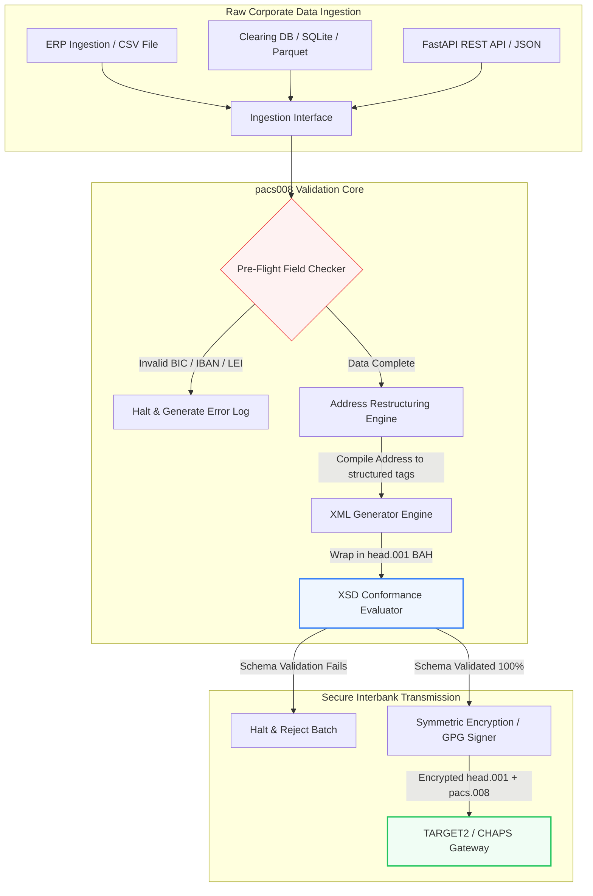

## 2026లో ఓపెన్-సోర్స్ Python‌తో ISO 20022 pacs.008 ఇంటర్‌బ్యాంక్ చెల్లింపులను ఆటోమేట్ చేయడం

ఆడిట్ చేయదగిన, స్కీమా-ధ్రువీకరించబడిన Python పైప్‌లైన్ ద్వారా వారసత్వ ఆర్థిక డేటా మరియు నిర్మాణాత్మక ఇంటర్‌బ్యాంక్ సందేశాల మధ్య అంతరాన్ని తగ్గించడం.

ఈ వ్యాసానికి ఓపెన్-సోర్స్ సూచన స్థానం [pacs008 ⧉](https://github.com/sebastienrousseau/pacs008 "pacs008 — open-source Python library"). ఈ రిపోజిటరీ [ISO 20022](/2023-09-29-automating-iso-20022-compliant-payment-file-creation-with-pain001/index.html) pacs.008 FI-నుండి-FI కస్టమర్ క్రెడిట్ బదిలీ XML సందేశాలను ఆటోమేట్ చేయడానికి ఒక Python లైబ్రరీగా ఉంచబడింది.

## ఈ ఓపెన్-సోర్స్ ప్రాజెక్ట్ 2026లో ఎందుకు ముఖ్యం

ప్రపంచవ్యాప్త ఇంటర్‌బ్యాంక్ చెల్లింపు క్లియరింగ్ మౌలిక సదుపాయం దాదాపు అర్ధ శతాబ్దంలో అత్యంత లోతైన ఆధునీకరణకు లోనవుతోంది.

జూన్ 2026లో, ఆర్థిక సేవల రంగం **నవంబర్ 14, 2026 SWIFT నిర్మాణాత్మక చిరునామా క్లిఫ్**‌కు వేగంగా చేరుకుంటోంది. ఈ తేదీ నుండి, SWIFT CBPR+ మార్గదర్శకాలు, TARGET2, CHAPS, Fedwire మరియు కెనడియన్ Lynx‌లతో పాటు, నిర్మాణరహిత తపాలా చిరునామా పంక్తులను (`<PstlAdr>` బ్లాక్‌లలో కేవలం `<AdrLine>` ఉపయోగించి) అధికారికంగా నిలిపివేస్తాయి. పాల్గొనే అన్ని ఆర్థిక సంస్థలు చిరునామాలను హైబ్రిడ్ ఫార్మాట్ (నిర్మాణాత్మక `<TwnNm>` మరియు `<Ctry>`, మిగిలిన వివరాల కోసం గరిష్ఠంగా రెండు `<AdrLine>` ఎలిమెంట్‌లతో) లేదా పూర్తిగా నిర్మాణాత్మక ఫార్మాట్ (వీధి పేరు, భవన సంఖ్య మరియు పోస్టల్ కోడ్ కోసం వ్యక్తిగత ఎలిమెంట్‌లు)‌లో ప్రసారం చేయాలి. ఈ ప్రమాణాన్ని అందుకోని ఏ సందేశమైనా నెట్‌వర్క్ సరిహద్దు వద్ద తిరస్కరించబడుతుంది.

ఆర్థిక సంస్థలకు, ఈ పరివర్తన ప్రధాన కార్యాచరణ పరిమితులను సృష్టిస్తుంది:

1. **సరిహద్దు-తిరస్కరణ జరిమానా.** నిర్మాణాత్మక-చిరునామా ప్రమాణాలను అందుకోని చెల్లింపులు తక్షణ నెట్‌వర్క్ తిరస్కరణలను ఎదుర్కొంటాయి, ఇది లావాదేవీపరమైన ఆలస్యాలు, లిక్విడిటీ అడ్డంకులు మరియు కార్యాచరణ బ్యాక్‌లాగ్‌లను ప్రేరేపిస్తుంది.
2. **SEPA చెల్లింపుదారు ధ్రువీకరణ (VoP).** SEPA జోన్ లోపల ఉన్న అన్ని చెల్లింపు సేవా ప్రదాతలు (PSPలు) క్రెడిట్ బదిలీలను అమలు చేయడానికి ముందు లబ్ధిదారుని పేరు మరియు IBAN మధ్య సరిపోలికను ధ్రువీకరించాలని ఆదేశిస్తుంది, ఇది సందేశ ప్రారంభానికి మరో ధ్రువీకరణ గేట్‌ను జోడిస్తుంది.

[Pacs008](https://github.com/sebastienrousseau/pacs008) ఈ సమస్యను పరిష్కరిస్తుంది. ఇది ఒక ఓపెన్-సోర్స్, తేలికపాటి Python లైబ్రరీ, ఇది ముడి ఆర్థిక డేటాను పూర్తిగా ధ్రువీకరించబడిన, స్కీమా-సమ్మతమైన ISO 20022 pacs.008 ఇంటర్‌బ్యాంక్ కస్టమర్ క్రెడిట్ బదిలీ సందేశాలుగా మార్చడాన్ని ఆటోమేట్ చేస్తుంది. వారసత్వం-నుండి-నిర్మాణాత్మక డేటా అంతరాన్ని తగ్గించడం ద్వారా, pacs008 అధిక Return on Resilience (RoR)‌ను అందిస్తుంది, పని మూలధనాన్ని కాపాడుతుంది మరియు ప్రపంచవ్యాప్త రెయిల్స్ అంతటా రియల్-టైమ్ అమలును భద్రపరుస్తుంది.

## pacs008 2026 ఆర్కిటెక్చర్ దృష్టికోణం

pacs008 లైబ్రరీ ఒక పృథక్కరించబడిన ధ్రువీకరణ మరియు ఉత్పత్తి ఇంజిన్‌గా నిర్మించబడింది, ముడి ఇన్‌పుట్‌లు క్రమబద్ధంగా విశ్లేషించబడి, సుసంపన్నం చేయబడి, ప్రామాణిక ఎన్వలప్‌లలో చుట్టబడేలా చూస్తుంది:

| పొర | డిజైన్ నిర్ణయం | ఇది ఎందుకు ముఖ్యం | సరిగ్గా నిర్వహించకపోతే రిస్క్ |
|---|---|---|---|
| **ఇన్‌పుట్ పొర** | CSV, JSON, SQLite మరియు Parquet గ్రహణం | బ్యాంకింగ్ ఏకీకరణ బృందాలను వారి డేటా ఇప్పటికే ఉన్న చోటే కలుస్తుంది, ప్లాట్‌ఫారమ్ మైగ్రేషన్‌లను నివారిస్తుంది. | ముడి, ధ్రువీకరించని లేదా పాడైన డేటా పేలోడ్‌ల గ్రహణం. |
| **ధ్రువీకరణ పొర** | అధికారిక XSD స్కీమాలు మరియు అనుకూల వ్యాపార నియమాలకు వ్యతిరేకంగా ప్రి-ఫ్లైట్ ధ్రువీకరణ | చెల్లింపు ఫైల్ క్లియరింగ్ నెట్‌వర్క్‌కు ప్రసారం చేయబడకముందే అమలును ఆపి, లోపాలను ఫ్లాగ్ చేస్తుంది. | చెల్లని XML ఫైల్‌లు తక్షణ నెట్‌వర్క్ తిరస్కరణలు మరియు క్లియరింగ్ ఆలస్యాలను ప్రేరేపించడం. |
| **BAH ఎన్వలప్ పొర** | స్వయంచాలక Business Application Header (head.001) రేపింగ్ | `<MsgDefIdr>` ట్యాగ్ ఆధారంగా సందేశ పంపిణీ మరియు రూటింగ్‌ను ప్రామాణీకరిస్తుంది. | అవసరమైన బాహ్య ఎన్వలప్ లేకుండా ముడి pacs.008 పేలోడ్‌లను ప్రసారం చేయడం, సిస్టమ్ తిరస్కరణకు కారణమవుతుంది. |
| **సీరియలైజేషన్ పొర** | ప్రామాణిక XML మరియు ISO-సమ్మత JSON (TS 23029) మద్దతు | XML మరియు JSON పేలోడ్‌ల మధ్య ప్రత్యక్ష అనువాదాన్ని అనుమతిస్తుంది, ఆధునిక REST API మరియు Kafka స్ట్రీమింగ్‌కు మద్దతు ఇస్తుంది. | అధికారిక ISO మార్గదర్శకాలను ఉల్లంఘించే విచ్ఛిన్న డేటా ప్రాతినిధ్యాలు. |
| **గమనశీలత పొర** | UETR‌పై కీ చేయబడిన OpenTelemetry ట్రేసింగ్ | వివరణాత్మక అమలు మార్గాలు మరియు లాగ్‌లను క్యాప్చర్ చేస్తుంది, రియల్-టైమ్ ఆడిట్ సామర్థ్యాన్ని అందిస్తుంది. | ట్రేసింగ్ అంతరాలు కార్యాచరణ దృశ్యమానత మరియు ఆడిటింగ్‌ను నిరోధించడం. |

## ముఖ్య ఇంటర్‌బ్యాంక్ సంకేతాలు మరియు నియంత్రణ మైలురాళ్లు

లావాదేవీపరమైన కార్యాచరణ స్థితిస్థాపకతను ప్రదర్శించడానికి, సీనియర్ టెక్నాలజీ మరియు రిస్క్ మేనేజర్లు నిర్దిష్ట, పరిమాణాత్మక సమ్మతి సూచికలను ట్రాక్ చేయాలి:

| సంకేతం | మెట్రిక్ / కార్యాచరణ ప్రమాణం | G20 / SWIFT / DORA సూచన | సాంకేతిక ప్లాట్‌ఫారమ్ అమలు |
|---|---|---|---|
| **నిర్మాణాత్మక చిరునామా సమ్మతి** | నిర్దేశిత `<TwnNm>` మరియు `<Ctry>`‌లతో పూర్తిగా నిర్మాణాత్మక `<PstlAdr>` ఫీల్డ్‌లను ఉపయోగించే pacs.008 సందేశాల %. | SWIFT SR 2026 గడువు | నిర్మాణరహిత చిరునామా పంక్తులను తిరస్కరించే pacs008‌లో ప్రి-ఫ్లైట్ స్కీమా తనిఖీలు. |
| **SEPA చెల్లింపుదారు ధ్రువీకరణ** | సందేశ అమలుకు ముందు లబ్ధిదారుని పేరు మరియు IBAN మధ్య సరిపోలిక ధ్రువీకరణ. | SEPA VoP నియంత్రణ | IBAN/BIC‌పై ప్రి-వాలిడేషన్ ప్రశ్నలను అమలు చేసే అంతర్నిర్మిత VoP హెల్పర్ క్లాస్‌లు. |
| **BAH head.001 ఏకీకరణ** | Business Application Headers‌లో విజయవంతంగా చుట్టబడిన బహిర్గత చెల్లింపు పేలోడ్‌ల శాతం. | TARGET2 / CBPR+ మార్గదర్శకాలు | బాహ్య XML ఎన్వలప్‌ను స్వయంచాలకంగా సంకలనం చేసే BAH రేపింగ్ ఉపవ్యవస్థ. |
| **LEI మాడ్యులో చెక్‌సమ్** | డెబిటర్ మరియు క్రెడిటర్ `<LEI>` బ్లాక్‌లపై ISO 7064 మాడ్యులో 97-10 చెక్-డిజిట్ ధ్రువీకరణ. | Bank of England ఆదేశం | 20-అక్షరాల ఐడెంటిఫైయర్ యొక్క సమగ్రతను ధృవీకరించే అల్గోరిథమిక్ చెకర్. |
| **UETR ట్రాకింగ్ ఖచ్చితత్వం** | ఉత్పత్తి చేయబడిన చెల్లింపులలో 100% చెల్లుబాటు అయ్యే Unique End-to-End Transaction Reference‌తో ఇంజెక్ట్ చేయబడతాయి. | SWIFT UETR స్పెసిఫికేషన్‌లు | 36-అక్షరాల UUIDv4 సూచన కోడ్ యొక్క స్వయంచాలక ఉత్పత్తి మరియు ట్రేసింగ్. |

## ఇంటర్‌బ్యాంక్ ఆటోమేషన్‌కు Python ఎందుకు ఆదర్శ ప్రవేశ మార్గం

2026లో ఆధునిక చెల్లింపు హబ్‌లు మరియు ట్రెజరీ కార్యకలాపాల బృందాలు డేటా పరివర్తన, ఆర్థిక మోడలింగ్ మరియు ERP డేటాబేస్ ఏకీకరణ కోసం Python‌పై బాగా ఆధారపడతాయి.

ఓపెన్-సోర్స్ Python లైబ్రరీని ఉపయోగించడం ద్వారా, సంస్థలు గణనీయమైన ప్రయోజనాలను సాధిస్తాయి:

1. **తక్కువ అభిజ్ఞాత్మక భారం మరియు అధిక అంతర్‌ప్రచాలనీయత.** Python ఒక సమన్వయ వారధిగా పనిచేస్తుంది. వారసత్వ డేటాబేస్‌ల నుండి ముడి చెల్లింపు సూచనలను లాగి, వాటిని సంక్లిష్ట అంతర్జాతీయ బ్యాంకింగ్ నియమాలకు వ్యతిరేకంగా ధ్రువీకరించి, ఒకే ఏకీకృత వర్క్‌ఫ్లోలో సమ్మతమైన XML‌ను అవుట్‌పుట్ చేసే సరళమైన స్క్రిప్ట్‌లను రాయడానికి ఇది డెవలపర్‌లను అనుమతిస్తుంది.
2. **"బ్లాక్-బాక్స్" అపారదర్శక అనువాదకుల నిర్మూలన.** యాజమాన్య బ్యాంకింగ్ పోర్టల్‌లు తరచుగా అనుకూల చెల్లింపు ఫైల్ అనువాదకుల కోసం అధిక లైసెన్సింగ్ రుసుములను వసూలు చేస్తాయి. ఈ అనువాదకులు యాజమాన్య బ్లాక్ బాక్స్‌లు, డేటా ఎలా ప్రాసెస్ చేయబడుతుందో లేదా కీలు ఎక్కడ నిల్వ చేయబడతాయో ఆడిట్ చేయడాన్ని భద్రతా బృందాలకు అసాధ్యం చేస్తాయి. pacs008 వంటి ఓపెన్-సోర్స్, తనిఖీ చేయదగిన లైబ్రరీ పూర్తి కోడ్ పారదర్శకతను నిర్ధారిస్తుంది.
3. **సజావైన CI/CD ఏకీకరణ.** Pacs008 నిరంతర ఏకీకరణ మరియు విస్తరణ పైప్‌లైన్‌లలో నేరుగా ఏకీకృతమవుతుంది, డెవలపర్‌లు తమ ప్రామాణిక సాఫ్ట్‌వేర్ డెలివరీ జీవితచక్రంలో భాగంగా చెల్లింపు ఫైల్ పరీక్షను ఆటోమేట్ చేయడానికి అనుమతిస్తుంది.

## పరిమిత ఇంటర్‌బ్యాంక్ పైప్‌లైన్‌ను రూపొందించడం

ఇంటర్‌బ్యాంక్ క్లియరింగ్‌లో ఒక ప్రధాన బలహీనత "అనియంత్రిత బ్యాచ్ ఉత్పత్తి" — స్పష్టమైన, పరిమిత ధ్రువీకరణ లూప్ లేకుండా ఫైల్‌లను ఉత్పత్తి చేయడం. Pacs008 కఠినంగా నియంత్రించబడిన, బహుళ-దశల లావాదేవీ పైప్‌లైన్ లోపల కోర్ ధ్రువీకరణ ఇంజిన్‌గా పనిచేయడానికి రూపొందించబడింది.

BAH ఎన్వలప్‌లో చుట్టబడిన క్రిప్టోగ్రాఫికల్‌గా సురక్షితమైన, స్కీమా-సమ్మతమైన pacs.008 ఫైల్‌ను ఉత్పత్తి చేయడానికి ముడి లావాదేవీ డేటా pacs008 పైప్‌లైన్ ద్వారా ఎలా వెళుతుందో దిగువ కార్యాచరణ ప్రవాహం చూపిస్తుంది:

## బోర్డ్‌రూమ్ ప్లేబుక్ మరియు విశ్వస్త బాధ్యత

ఇంటర్‌బ్యాంక్ చెల్లింపు ఆటోమేషన్ ఒక బోర్డ్-స్థాయి రిస్క్-నిర్వహణ మరియు కార్పొరేట్-పరిపాలన సమస్య. సీనియర్ మేనేజర్లు లావాదేవీ డేటా నాణ్యతను విశ్వస్త బాధ్యత మరియు కార్యాచరణ రిస్క్ తగ్గింపు దృష్టికోణం ద్వారా పరిష్కరించాలి:

- **DORA ఆర్టికల్ 5 (బోర్డ్ జవాబుదారీతనం).** సంస్థ యొక్క ICT కార్యకలాపాల స్థితిస్థాపకత మరియు భద్రత కోసం బోర్డ్ సభ్యులపై ప్రత్యక్ష, వ్యక్తిగత బాధ్యతను ఉంచుతుంది. ఇంటర్‌బ్యాంక్ క్లియరింగ్ ఒక కీలక కార్పొరేట్ విధి కాబట్టి, కార్యాచరణ అంతరాయాలు లేదా ఆలస్యమైన చెల్లింపులను నివారించడానికి బలమైన, ధ్రువీకరించబడిన మరియు స్వయంచాలక లావాదేవీ నియంత్రణలను అమలు చేశామని బోర్డులు ప్రదర్శించాలి.
- **BCBS 239 (రిస్క్ డేటా అగ్రిగేషన్ మరియు రిపోర్టింగ్).** ఆర్థిక లావాదేవీ రిపోర్టింగ్ ఖచ్చితమైనది, పూర్తి మరియు రియల్-టైమ్‌లో ఉత్పత్తి చేయబడాలని డిమాండ్ చేస్తుంది. Pacs008 చెల్లింపు డేటా మూలం వద్ద శుభ్రంగా నిర్మాణాత్మకంగా మరియు ధ్రువీకరించబడేలా నిర్ధారించడం ద్వారా సంస్థలు BCBS 239 సమ్మతిని సాధించడంలో సహాయపడుతుంది, వారసత్వ స్ప్రెడ్‌షీట్‌లను పీడించే డేటా అంతరాలు మరియు మాన్యువల్ సయోధ్య లోపాలను తొలగిస్తుంది.
- **కార్యాచరణ రిస్క్ మూలధన ఛార్జీల ఉపశమనం (Basel III).** Basel III మార్గదర్శకాల ప్రకారం, అధిక చెల్లింపు లోప రేట్లు మరియు మాన్యువల్ జోక్య ఓవర్‌హెడ్ బ్యాంక్ యొక్క కార్యాచరణ రిస్క్ మూలధన అవసరాలను పెంచుతాయి, లేకపోతే రుణాలు లేదా పెట్టుబడి కోసం విస్తరించగల మూలధనాన్ని బంధిస్తాయి. చెల్లింపు పైప్‌లైన్‌ను ఆటోమేట్ చేయడం ఈ మూలధన ప్రీమియంలను నేరుగా తగ్గిస్తుంది, బ్యాలెన్స్-షీట్ విలువను కాపాడుతుంది.

## బ్యాంక్ రకం ద్వారా దీని అర్థం ఏమిటి

### గ్లోబల్ సిస్టమాటికల్లీ ఇంపార్టెంట్ బ్యాంకులు (G-SIBs)

G-SIBలు భారీ, క్రాస్-బోర్డర్ కార్పొరేట్ లావాదేవీ వాల్యూమ్‌లను నిర్వహిస్తాయి. వారి ప్రాథమిక సవాలు క్లియరింగ్ నెట్‌వర్క్‌ను తాకకముందు నిర్మాణరహిత వారసత్వ డేటా యొక్క పరిష్కారం. తమ కార్పొరేట్ బ్యాంకింగ్ గేట్‌వేలలో pacs008‌ను ఏకీకృతం చేయడం ద్వారా, G-SIBలు తమ కార్పొరేట్ క్లయింట్‌లకు స్వయంచాలక ధ్రువీకరణ యుటిలిటీలను అందించగలవు, మాన్యువల్ చెల్లింపు మరమ్మతుల ఓవర్‌హెడ్‌ను తగ్గించి, SWIFT నెట్‌వర్క్ అంతటా రియల్-టైమ్ అమలును భద్రపరుస్తాయి.

### లావాదేవీ మరియు కార్పొరేట్ బ్యాంకులు

లావాదేవీ బ్యాంకులకు, చెల్లింపు డేటా నాణ్యత ఒక పోటీ భేదకం. pacs008 వంటి ఓపెన్-సోర్స్, తనిఖీ చేయదగిన ధ్రువీకరణ సాధనాన్ని కార్పొరేట్ ట్రెజరీ క్లయింట్‌లకు అందించడం ద్వారా, ఈ బ్యాంకులు ఆన్‌బోర్డింగ్‌ను వేగవంతం చేయగలవు, చెల్లింపు ఫైల్ తిరస్కరణలను తగ్గించగలవు మరియు ఉన్నత స్ట్రెయిట్-త్రూ ప్రాసెసింగ్ రేట్ల ద్వారా కస్టమర్ నమ్మకాన్ని నిర్మించగలవు.

### ప్రాంతీయ మరియు చిన్న బ్యాంకులు

ప్రాంతీయ బ్యాంకులు G-SIBల భారీ టెక్నాలజీ బడ్జెట్‌లు లేకుండా అంతర్జాతీయ చెల్లింపు ప్రమాణాలతో సమ్మతిని కొనసాగించాలి. Pacs008 ఒక తేలికపాటి, ఖర్చు-సమర్థవంతమైన మరియు పూర్తిగా సమ్మతమైన Python-ఆధారిత పరిష్కారాన్ని అందిస్తుంది, ఖరీదైన యాజమాన్య మిడిల్‌వేర్ లైసెన్సులు లేకుండా ఆధునిక, నిర్మాణాత్మక చెల్లింపు ప్రారంభ సామర్థ్యాలను అందించడానికి చిన్న సంస్థలను అనుమతిస్తుంది.

## ముగింపు: ఇంటర్‌బ్యాంక్ క్లియరింగ్ రోడ్‌మ్యాప్

రాబోయే SWIFT నవంబర్ 2026 నిర్మాణాత్మక-చిరునామా గడువు కార్పొరేట్ ట్రెజరీ కార్యకలాపాలకు ఒక కఠినమైన సరిహద్దును సూచిస్తుంది. వారసత్వ స్ప్రెడ్‌షీట్‌లు, మాన్యువల్ డేటా ఎంట్రీ మరియు నిర్మాణరహిత చెల్లింపు ఫైల్‌లపై ఆధారపడటం ఒక క్రియాశీల వ్యాపార రిస్క్.

లావాదేవీ కొనసాగింపును భద్రపరచడానికి మరియు కార్యాచరణ ఓవర్‌హెడ్‌ను తగ్గించడానికి, సీనియర్ టెక్నాలజీ మరియు ఫైనాన్స్ మేనేజర్లు నేడు స్పష్టమైన క్లియరింగ్ రోడ్‌మ్యాప్‌ను అమలు చేయాలి:

1. **మూలం వద్ద ధ్రువీకరణను అమలు చేయండి.** అన్ని చెల్లింపు సూచనలు కార్పొరేట్ ERP సరిహద్దులను వదిలిపెట్టకముందే అధికారిక ISO 20022 XSD స్కీమాల ప్రకారం ధ్రువీకరించబడి, ఫార్మాట్ చేయబడాలని ఆదేశించండి.
2. **డేటా పైప్‌లైన్‌ను ఆడిట్ చేయండి.** మాన్యువల్ స్ప్రెడ్‌షీట్ ప్రాసెసింగ్ నుండి దూరంగా మారి, pacs008 ఉపయోగించి స్వయంచాలక, తనిఖీ చేయదగిన Python-ఆధారిత వర్క్‌ఫ్లోలను అమలు చేయండి.
3. **హైబ్రిడ్ భద్రతను అమలు చేయండి.** ఉత్పత్తి చేయబడిన చెల్లింపు ఫైల్‌లు ప్రసారానికి ముందు క్రిప్టోగ్రాఫికల్‌గా సంతకం చేయబడి, ఎన్‌క్రిప్ట్ చేయబడేలా నిర్ధారించండి, జీరో-ట్రస్ట్ నెట్‌వర్క్ అంచనాలను తీర్చండి.
4. **విశ్వస్త ప్రాధాన్యతలతో సమలేఖనం చేయండి.** చెల్లింపు ఆటోమేషన్ మరియు డేటా నాణ్యత మెట్రిక్‌లను బోర్డుకు అధికారికంగా నివేదించండి, ఈ పెట్టుబడిని DORA కింద కీలక కార్యాచరణ రిస్క్ తగ్గింపు కార్యక్రమంగా రూపొందించండి.

## తరచుగా అడిగే ప్రశ్నలు

**pacs008 రాబోయే SWIFT SR 2026 చిరునామా నియమాలతో సమ్మతమేనా?**

అవును. Pacs008 కఠినమైన SWIFT నవంబర్ 2026 నిర్మాణాత్మక చిరునామా మైలురాయికి మద్దతు ఇవ్వడానికి రూపొందించబడింది, తపాలా చిరునామా ఎలిమెంట్‌లను (పట్టణం, దేశం, పోస్ట్‌కోడ్) నిర్దేశిత ISO 20022 XML ఫీల్డ్‌లుగా తప్పనిసరి వేరుచేయడాన్ని అమలు చేస్తుంది.

**pacs008 చెల్లింపు పేలోడ్‌లను Business Application Headers‌లో చుట్టగలదా?**

అవును. Pacs008 స్థానికంగా Business Application Header (BAH head.001) రేపింగ్‌కు మద్దతు ఇస్తుంది కాబట్టి, ఇది TARGET2, CHAPS మరియు CBPR+ నెట్‌వర్క్‌లకు అవసరమైన బాహ్య ఎన్వలప్‌ను స్వయంచాలకంగా సంకలనం చేస్తుంది.

**యాజమాన్య ఫైల్ అనువాదకుల కంటే ఓపెన్-సోర్స్ లైబ్రరీ ఎందుకు ప్రాధాన్యత?**

యాజమాన్య అనువాదకులు అపారదర్శక బ్లాక్ బాక్స్‌లు, భద్రతా ఆడిట్‌లను అసాధ్యం చేస్తాయి. pacs008 వంటి ఓపెన్-సోర్స్, సహ-సమీక్షించబడిన లైబ్రరీ పూర్తి కోడ్ పారదర్శకతను అందిస్తుంది, ప్రాసెసింగ్ సమయంలో ఏ సున్నితమైన చెల్లింపు డేటా బహిర్గతం కాదని ధృవీకరించడానికి భద్రతా బృందాలను అనుమతిస్తుంది.

**pacs008 ఏ ఐడెంటిఫైయర్‌లను ధ్రువీకరిస్తుంది?**

Pacs008 ISO 7064 మాడ్యులో 97-10 చెక్‌సమ్ గణనలను ఉపయోగించి Bank Identifier Codes (BICs) మరియు Legal Entity Identifiers (LEIs) కోసం అంతర్నిర్మిత ధ్రువీకరణదారులతో పాటు, IBAN చెక్-డిజిట్ ధ్రువీకరణ మరియు UETR ప్రత్యేకత తనిఖీలతో వస్తుంది.

## సూచనలు

- SWIFT, (2024). *ISO 20022 November 2026 Structured Address Milestone*. La Hulpe: SWIFT. వద్ద అందుబాటులో ఉంది: [SWIFT ISO 20022 Milestone ⧉](https://www.swift.com/standards/iso-20022/iso-20022-bytes/call-action-november-2026 "SWIFT ISO 20022 milestone").
- Basel Committee on Banking Supervision (BCBS), (2013). *Principles for effective risk data aggregation and risk reporting (BCBS 239)*. Basel: Bank for International Settlements. వద్ద అందుబాటులో ఉంది: [BCBS 239 Principles ⧉](https://www.bis.org/publ/bcbs239.htm "BCBS 239 principles").
- European Parliament and Council of the European Union, (2022). *Regulation (EU) 2022/2554 on digital operational resilience for the financial sector (DORA)*. Brussels: Official Journal of the European Union. వద్ద అందుబాటులో ఉంది: [DORA Regulation ⧉](https://eur-lex.europa.eu/legal-content/EN/TXT/?uri=CELEX%3A32022R2554 "DORA regulation").
- GitHub, (2026). *pacs008 open-source repository*. వద్ద అందుబాటులో ఉంది: [pacs008 Repository ⧉](https://github.com/sebastienrousseau/pacs008 "pacs008 repository").
