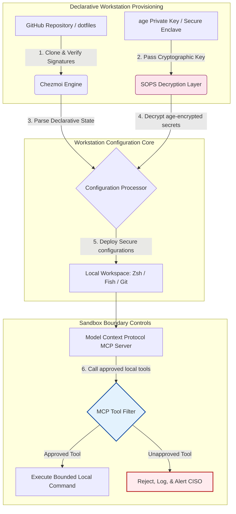

## 2026లో AI-అవగాహన కలిగిన Dotfiles: MCP, SLSA, మరియు మల్టీ-షెల్ సమానత్వం కోసం సురక్షిత, పునరుత్పాదక డెవలపర్ వర్క్‌స్టేషన్‌ను నిర్మించడం

స్థానిక AI మోడల్‌లు మరియు ఏజెంటిక్ డెవలపర్ టూల్స్ యుగంలో డిక్లరేటివ్ వర్క్‌స్టేషన్ కాన్ఫిగరేషన్ మరియు సురక్షిత సాఫ్ట్‌వేర్ సప్లై చెయిన్‌ల మధ్య అంతరాన్ని పూడ్చడం.

ఈ వ్యాసానికి ఓపెన్-సోర్స్ సూచన బిందువు [dotfiles ⧉](https://github.com/sebastienrousseau/dotfiles "dotfiles — declarative workstation configuration"). ఈ రిపోజిటరీ ఇలా ఉంచబడింది: macOS, Linux, మరియు WSL కోసం డిక్లరేటివ్ dotfiles, మల్టీ-షెల్ సమానత్వం, సెకను-లోపు ప్రారంభం, SLSA-సంతకం చేసిన విడుదలలు, మరియు AI/MCP-అవగాహన కలిగిన కాన్ఫిగరేషన్‌ను అందిస్తుంది.

## 2026లో ఈ ఓపెన్-సోర్స్ ప్రాజెక్ట్ ఎందుకు ముఖ్యం

జూన్ 2026లో, డెవలపర్ వర్క్‌స్టేషన్ సాఫ్ట్‌వేర్ సప్లై చెయిన్‌లో అత్యంత బలహీనమైన కడ్డీ మరియు అధునాతన రాజ్య-ప్రాయోజిత మరియు నేరస్థ సైబర్ సిండికేట్‌లకు అధిక-విలువ లక్ష్యం.

టెర్మినల్-ఆధారిత AI కోడింగ్ సహాయకుల (Claude Code వంటివి) పెరుగుదల మరియు Model Context Protocol (MCP) అవలంబనతో అభివృద్ధి ఎన్విరాన్‌మెంట్ యొక్క భద్రతా దృశ్యం సమూలంగా మారిపోయింది. స్థానిక డెవలపర్ టెర్మినల్‌లు ఇప్పుడు ఈ పనులను చేయగల క్రియాశీల, స్వయంప్రతిపత్త AI ఏజెంట్‌లను హోస్ట్ చేస్తాయి:

- స్థానిక సోర్స్ ఫైల్‌లను చదవడం మరియు సవరించడం.
- స్థానిక CLI టూల్స్‌ను (`git`, `npm`, `aws`, `kubectl`) కాల్ చేయడం.
- షెల్ ఎన్విరాన్‌మెంట్ వేరియబుల్స్, స్థానిక డేటాబేస్‌లు, మరియు కాన్ఫిగరేషన్ సెట్టింగ్‌లను పరిశీలించడం.

డెవలపర్ యొక్క స్థానిక ఎన్విరాన్‌మెంట్‌కు కఠినమైన సరిహద్దులు లేకపోతే, ఈ స్వయంప్రతిపత్త AI టూల్స్ అనుకోకుండా సున్నితమైన వ్యక్తిగత డేటాను చదవవచ్చు, పబ్లిక్ LLM APIలకు క్లౌడ్ ఆధారాలను లీక్ చేయవచ్చు, లేదా ఆటోమేటెడ్ బిల్డ్‌ల సమయంలో హానికరమైన ప్యాకేజీలను అమలు చేయవచ్చు.

Digital Operational Resilience Act (DORA) మరియు NIST Cybersecurity Framework (CSF) 2.0 కింద, ఆర్థిక సంస్థలు సాఫ్ట్‌వేర్ సప్లై చెయిన్‌ను యాక్సెస్ చేసే ప్రతి పరికరం యొక్క ప్రొవెనెన్స్ మరియు భద్రతా సమగ్రతను ధృవీకరించడం చట్టపరంగా అవసరం. "స్నోఫ్లేక్ ల్యాప్‌టాప్‌లు" — మాన్యువల్‌గా కాన్ఫిగర్ చేసిన, ఆడిట్ చేయని, తప్పిపోతున్న కాన్ఫిగరేషన్‌లు — ఇకపై ప్రపంచ బ్యాంకింగ్ ప్రమాణాలకు అనుగుణంగా లేవు.

[సెబాస్టియన్ రూసో యొక్క Dotfiles](https://github.com/sebastienrousseau/dotfiles) ఈ సమస్యను పరిష్కరిస్తుంది. ఇది ఒక ఓపెన్-సోర్స్, డిక్లరేటివ్ వర్క్‌స్టేషన్ మేనేజ్‌మెంట్ ఫ్రేమ్‌వర్క్, ఇది సురక్షిత, పునరుత్పాదక డెవలపర్ వర్క్‌స్టేషన్‌లను స్థాపిస్తుంది. ప్రామాణీకరించిన, ఆడిట్ చేయగల కాన్ఫిగరేషన్ బేస్‌లైన్‌ను అమలు చేయడం ద్వారా, ఈ ప్రాజెక్ట్ అధిక రిటర్న్ ఆన్ రెసిలియన్స్ (RoR)ను అందిస్తుంది, డెవలపర్ ఆన్‌బోర్డింగ్ సమయాన్ని వారాల నుండి గంటలకు తగ్గిస్తుంది మరియు సున్నితమైన ఆర్థిక సప్లై చెయిన్‌లను ఎండ్‌పాయింట్ దుర్బలత్వాల నుండి రక్షిస్తుంది.

## AI-అవగాహన వర్క్‌స్టేషన్ 2026 ఆర్కిటెక్చర్ లెన్స్

dotfiles ఫ్రేమ్‌వర్క్ ఒక సురక్షిత, డిక్లరేటివ్ ఎన్విరాన్‌మెంట్ మేనేజర్‌గా పనిచేస్తుంది — అన్ని స్థానిక షెల్‌లు, టూల్స్, మరియు రహస్యాలు క్రమబద్ధంగా నిర్వహించబడతాయి, ఆడిట్ చేయబడతాయి, మరియు వేరుచేయబడతాయి:

| లేయర్ | డిజైన్ నిర్ణయం | ఇది ఎందుకు ముఖ్యం | తప్పుగా నిర్వహిస్తే ప్రమాదం |
|---|---|---|---|
| **ప్రొవిజనింగ్ లేయర్** | Chezmoi ద్వారా డిక్లరేటివ్ కాన్ఫిగరేషన్ నిర్వహణ | macOS, Linux, మరియు WSL అంతటా పూర్తిగా పునరుత్పాదక వర్క్‌స్టేషన్‌లను నిర్మిస్తుంది, డ్రిఫ్ట్‌ను తొలగిస్తుంది. | ఆడిట్ చేయని, దుర్బలమైన స్థానిక స్థితులతో స్నోఫ్లేక్ కాన్ఫిగరేషన్‌లు. |
| **షెల్ లేయర్** | మల్టీ-షెల్ సమానత్వం (Zsh, Fish, Nushell) | వివిధ ఎన్విరాన్‌మెంట్‌ల అంతటా సమానమైన, సెకను-లోపు ప్రారంభం మరియు స్థిరమైన అలియాస్ ప్రవర్తనలను నిర్ధారిస్తుంది. | ఊహించని స్క్రిప్ట్ ఫలితాలకు కారణమయ్యే షెల్ కమాండ్ అస్థిరతలు. |
| **రహస్యాల లేయర్** | SOPS మరియు age ఉపయోగించి ఫైల్ ఎన్‌క్రిప్షన్ | హార్డ్‌కోడ్ చేసిన ఆధారాలు మరియు ముడి కీలు Gitకు కమిట్ చేయబడకుండా లేదా స్థానిక LLMలకు బహిర్గతం కాకుండా నిరోధిస్తుంది. | పబ్లిక్ రిపోజిటరీ చరిత్రలలోకి లీక్ చేయబడిన లేదా స్థానిక ఏజెంట్‌లచే రాజీపడిన ఆధారాలు. |
| **AI/MCP లేయర్** | Model Context Protocol సరిహద్దు నియంత్రణలు | స్థానిక AI ఏజెంట్‌లను ఆమోదించిన టూల్స్ నిర్దిష్ట జాబితాకు పరిమితం చేస్తుంది, అన్ని స్థానిక అమలులను లాగ్ చేస్తుంది. | పరిమితి లేని AI ఏజెంట్‌లు స్థానికంగా అదుపు తప్పిన లేదా విధ్వంసక కమాండ్‌లను అమలు చేయడం. |
| **సప్లై చెయిన్ లేయర్** | SLSA-సంతకం చేసిన విడుదలలు మరియు Sigstore ధృవీకరణ | బూట్‌స్ట్రాప్ స్క్రిప్ట్‌లు మరియు కాన్ఫిగరేషన్ ఫైల్‌ల ప్రామాణికతను క్రిప్టోగ్రాఫికల్‌గా నిరూపిస్తుంది. | డెవలపర్ ఎన్విరాన్‌మెంట్‌లలోకి హానికరమైన బ్యాక్‌డోర్‌లను చొప్పించే రాజీపడిన సెటప్ స్క్రిప్ట్‌లు. |

## ముఖ్యమైన వర్క్‌స్టేషన్ భద్రత మరియు ఆటోమేషన్ సంకేతాలు

అభివృద్ధి ఎస్టేట్ అంతటా సంపూర్ణ భద్రతను నిర్వహించడానికి, చీఫ్ ఇన్ఫర్మేషన్ సెక్యూరిటీ ఆఫీసర్లు (CISOలు) మరియు టెక్నాలజీ మేనేజర్లు నిర్దిష్ట, పరిమాణాత్మక కార్యనిర్వాహక సూచికలను ట్రాక్ చేయాలి:

| సంకేతం | మెట్రిక్ / కార్యనిర్వాహక బెంచ్‌మార్క్ | NIST CSF / DORA సూచన | సాంకేతిక ప్లాట్‌ఫారమ్ అమలు |
|---|---|---|---|
| **వర్క్‌స్టేషన్ పునరుత్పాదకత** | కాన్ఫిగరేషన్ డ్రిఫ్ట్ లేకుండా డిక్లరేటివ్ dotfile రిపోజిటరీల ద్వారా పూర్తిగా నిర్వహించబడే డెవలపర్ ల్యాప్‌టాప్‌ల %. | NIST CSF 2.0 (PR.DS-01) | టెర్మినల్ ప్రారంభంలో స్వయంచాలకంగా అమలయ్యే Chezmoi డ్రిఫ్ట్ డిటెక్షన్ ఆడిట్‌లు. |
| **ఆధార పరిశుభ్రత** | స్థానిక కాన్ఫిగరేషన్ ఫైల్‌ల అంతటా సాదా పాఠంలో నిల్వ చేయబడిన సున్నా ఎన్‌క్రిప్ట్ చేయని రహస్యాలు లేదా కీలు. | DORA ఆర్టికల్ 6 (ICT భద్రత) | Git ప్రీ-కమిట్ హుక్‌లు మరియు ఎన్‌క్రిప్ట్ చేయని ఫైల్‌లను తిరస్కరించే స్థానిక స్కాన్‌లు. |
| **బిల్డ్ ప్రొవెనెన్స్** | క్రిప్టోగ్రాఫికల్‌గా సంతకం చేసిన మేనిఫెస్ట్‌లను ఉపయోగించి ధృవీకరించబడిన 100% వర్క్‌స్టేషన్ బూట్‌స్ట్రాప్ యుటిలిటీలు. | DORA ఆర్టికల్ 30 (సప్లై చెయిన్) | సెటప్ పైప్‌లైన్‌లలో పొందుపరచబడిన Sigstore మరియు SLSA లెవల్ 3 ధృవీకరణ. |
| **డెవలపర్ ఆన్‌బోర్డింగ్ సమయం** | ముడి హార్డ్‌వేర్ కేటాయింపు నుండి పూర్తిగా కాన్ఫిగర్ చేసిన, అనుగుణమైన అభివృద్ధి వర్క్‌స్పేస్ వరకు గడిచిన సమయం. | రిటర్న్ ఆన్ రెసిలియన్స్ (RoR) | 15 నిమిషాల లోపు ఎన్విరాన్‌మెంట్‌ను కంపైల్ చేసే స్వయంచాలక, డిక్లరేటివ్ సెటప్ స్క్రిప్ట్‌లు. |
| **AI ఏజెంట్ పరిమిత యాక్సెస్** | స్థానిక AI టూల్స్ నిర్వచించిన డైరెక్టరీ పరిమితుల్లో రీడ్-ఓన్లీ డిఫాల్ట్‌లతో పనిచేస్తాయని ధృవీకరణ. | మోడల్ రిస్క్ మేనేజ్‌మెంట్ | ఏజెంట్ టూల్ కేటలాగ్‌లను ఆమోదించిన కార్యకలాపాలకు పరిమితం చేసే MCP కాన్ఫిగరేషన్ ప్రొఫైల్‌లు. |

## వర్క్‌స్టేషన్ భద్రతకు డిక్లరేటివ్ కాన్ఫిగరేషన్ ఎందుకు ప్రధానం

డెవలపర్ వర్క్‌స్టేషన్ సెటప్‌కు సాంప్రదాయ విధానాలు చాలా వరకు మాన్యువల్‌గా ఉంటాయి, ఫలితంగా "స్నోఫ్లేక్ ల్యాప్‌టాప్‌లు" ఏర్పడతాయి — డెవలపర్లు కస్టమ్ టూల్స్‌ను ఇన్‌స్టాల్ చేయడం, వేరియబుల్స్‌ను సర్దుబాటు చేయడం, మరియు స్థానిక స్క్రిప్ట్‌లను సవరించడం వల్ల కాలక్రమేణా కాన్ఫిగరేషన్‌లు తప్పిపోయే ఎన్విరాన్‌మెంట్‌లు. ఈ డ్రిఫ్ట్ అనేక కీలక దుర్బలత్వాలను సృష్టిస్తుంది:

1. **ట్రాక్ చేయని షాడో కాన్ఫిగరేషన్‌లు.** తప్పిపోతున్న ల్యాప్‌టాప్‌లు తరచుగా పాతదైన, దుర్బలమైన సాఫ్ట్‌వేర్ ప్యాకేజీలను లేదా కార్పొరేట్ భద్రతా టూల్స్‌ను దాటవేసే స్థానిక స్క్రిప్ట్‌లను నడుపుతాయి.
2. **రహస్యాల లీకేజ్.** డెవలపర్లు తరచుగా API కీలు, GitHub టోకెన్‌లు, లేదా AWS ఆధారాలను నేరుగా సాదా-పాఠ స్క్రిప్ట్‌లలో లేదా షెల్ ప్రొఫైల్‌లలో హార్డ్‌కోడ్ చేస్తారు, వాటిని దొంగతనానికి అత్యంత దుర్బలంగా చేస్తారు.
3. **అసమర్థ ఆన్‌బోర్డింగ్.** కొత్త డెవలపర్ వర్క్‌స్టేషన్‌ను మాన్యువల్‌గా సెటప్ చేయడానికి రెండు వారాల ఇంజనీరింగ్ సమయం వరకు పట్టవచ్చు, ఇది టీమ్ వేగాన్ని ప్రభావితం చేస్తుంది.

Chezmoi ఉపయోగించి డిక్లరేటివ్, మోడల్-ఆధారిత కాన్ఫిగరేషన్‌కు మారడం ద్వారా, మొత్తం డెవలపర్ వర్క్‌స్పేస్ ఒక వెర్షన్-నియంత్రిత, పునరుత్పాదక రికార్డ్ సిస్టమ్‌గా మారుతుంది. ప్రతి మార్పు, అలియాస్, ప్యాకేజ్ డిపెండెన్సీ, మరియు భద్రతా డిఫాల్ట్ Gitలో డాక్యుమెంట్ చేయబడుతుంది, సంస్థాగత అనుసరణ విధానాలకు వ్యతిరేకంగా ధృవీకరించబడుతుంది, మరియు భౌతిక ల్యాప్‌టాప్‌కు వర్తింపజేయబడకముందు క్రిప్టోగ్రాఫికల్‌గా ధృవీకరించబడుతుంది.

## పరిమిత AI డెవలపర్ ఎన్విరాన్‌మెంట్‌ను రూపొందించడం

స్థానిక AI ఏజెంట్‌లు మరియు MCP టూల్స్ స్థానిక ఆస్తులకు పరిమితి లేని యాక్సెస్‌ను పొందకుండా నిరోధించడానికి, వర్క్‌స్టేషన్ ఒక పరిమిత అమలు తలంగా పనిచేయాలి.

కింది కార్యనిర్వాహక ప్రవాహం dotfiles ఫ్రేమ్‌వర్క్ Chezmoi, SOPS, మరియు ageను ఎలా సమన్వయం చేసి సురక్షిత dotfilesను డీక్రిప్ట్ చేసి అమలు చేస్తుందో చూపిస్తుంది, అదే సమయంలో MCP టూల్స్‌ను కాల్ చేసే స్థానిక AI ఏజెంట్‌ల కోసం ఒక వేరుచేయబడిన, శాండ్‌బాక్స్ చేయబడిన అమలు సరిహద్దును నిర్వహిస్తుంది:

## బోర్డ్‌రూమ్ ప్లేబుక్ మరియు ఫిడ్యూషియరీ బాధ్యత

డెవలపర్ వర్క్‌స్టేషన్ భద్రత మరియు సప్లై-చెయిన్ సమగ్రత కీలక బోర్డ్‌రూమ్ ప్రాధాన్యతలు. సీనియర్ మేనేజర్లు ఫిడ్యూషియరీ బాధ్యత, నియంత్రణ అనుసరణ, మరియు వ్యాపార-విలువ సంరక్షణ దృష్టికోణం నుండి డెవలపర్ ఎన్విరాన్‌మెంట్ ప్రమాదాన్ని పరిష్కరించాలి:

- **DORA ఆర్టికల్ 5 (బోర్డ్ జవాబుదారీతనం).** సంస్థ యొక్క ICT ప్రమాద నిర్వహణకు నిర్వహణ సంస్థ (బోర్డ్) అంతిమ బాధ్యత వహిస్తుందని నిర్దేశిస్తుంది. డెవలపర్ వర్క్‌స్టేషన్‌లు సాఫ్ట్‌వేర్ సప్లై చెయిన్‌కు గేట్‌వే కాబట్టి, ఎండ్‌పాయింట్‌లు సురక్షితమైనవి, పూర్తిగా ఆడిట్ చేయగలవి, మరియు కఠినమైన, పునరుత్పాదక కాన్ఫిగరేషన్ ఫ్రేమ్‌వర్క్‌ల కింద నిర్వహించబడతాయని నియంత్రణ ఆడిట్‌లను సంతృప్తిపరచడానికి బోర్డ్ డైరెక్టర్లు ధృవీకరించాలి.
- **NIST CSF 2.0 అనుసరణ (ఎండ్‌పాయింట్ భద్రత).** ప్రామాణీకరించిన, సురక్షిత కాన్ఫిగరేషన్‌లను నడుపుతున్న అధీకృత మరియు ధృవీకరించిన పరికరాలు మాత్రమే కార్పొరేట్ నెట్‌వర్క్‌లు మరియు రిపోజిటరీలను యాక్సెస్ చేయగలవని డిమాండ్ చేస్తుంది. డిక్లరేటివ్ dotfiles భద్రతా టీమ్‌లకు అన్ని డెవలపర్ ఎన్విరాన్‌మెంట్‌లు సంస్థ యొక్క భద్రతా బేస్‌లైన్‌కు అనుగుణంగా ఉన్నాయని గణితశాస్త్రపరంగా నిరూపించడానికి అనుమతిస్తాయి, ఆడిట్ చేయని "స్నోఫ్లేక్" సెటప్‌ల ప్రమాదాన్ని తొలగిస్తాయి.
- **బ్యాలెన్స్-షీట్ విలువ సంరక్షణ.** ఒకే ఒక్క రాజీపడిన డెవలపర్ ఆధారం లేదా సప్లై-చెయిన్ ఉల్లంఘన ఒక సంస్థకు నివారణ, నియంత్రణ జరిమానాలు, మరియు కీర్తి నష్టంలో మిలియన్ల డాలర్లు ఖర్చవుతుంది. సురక్షిత, డిక్లరేటివ్ డెవలపర్ ఎన్విరాన్‌మెంట్‌కు మారడం ఈ ప్రమాదాన్ని నేరుగా తగ్గిస్తుంది, బ్యాలెన్స్-షీట్ విలువను సంరక్షిస్తుంది మరియు కస్టమర్ నమ్మకాన్ని రక్షిస్తుంది.

## బ్యాంక్ రకం ప్రకారం దీని అర్థం ఏమిటి

### గ్లోబల్ సిస్టమిక్‌గా ముఖ్యమైన బ్యాంకులు (G-SIBలు)

G-SIBలు అనేక ఖండాలు మరియు నియంత్రణ అధికార పరిధులలో వేలాది డెవలపర్ వర్క్‌స్టేషన్‌లను నిర్వహిస్తాయి. వాటి ప్రాథమిక సవాలు భారీ ఇంజనీరింగ్ టీమ్‌ల అంతటా కాన్ఫిగరేషన్ స్థిరత్వాన్ని నిర్వహించడం మరియు ఆధార లీకేజ్‌ను నిరోధించడం. Chezmoi ఉపయోగించి డిక్లరేటివ్, ఓపెన్-సోర్స్ dotfiles మోడల్‌ను అవలంబించడం ద్వారా, G-SIBలు ఎండ్‌పాయింట్ భద్రతను ప్రామాణీకరించవచ్చు, అనుసరణ ఆడిటింగ్‌ను ఆటోమేట్ చేయవచ్చు, మరియు ప్రపంచ సంస్థ అంతటా డెవలపర్ ఆన్‌బోర్డింగ్ సమయాలను వారాల నుండి నిమిషాలకు తగ్గించవచ్చు.

### లావాదేవీ మరియు కార్పొరేట్ బ్యాంకులు

లావాదేవీ బ్యాంకులు సున్నితమైన చెల్లింపు గేట్‌వేలు మరియు హోల్‌సేల్ క్లియరింగ్ మౌలిక సదుపాయాలను నిర్వహిస్తాయి. ఈ ఉత్పత్తి ఎన్విరాన్‌మెంట్‌లకు అమలు చేసిన కోడ్ యొక్క సంపూర్ణ సమగ్రతను నిరూపించడం చర్చించలేని నియంత్రణ డిమాండ్. సురక్షిత, SLSA-అనుగుణ dotfiles ఫ్రేమ్‌వర్క్ కింద డెవలపర్ వర్క్‌స్టేషన్‌లను ప్రామాణీకరించడం సాఫ్ట్‌వేర్ సప్లై చెయిన్ పూర్తిగా ఆడిట్ చేయబడిందని మరియు స్థానిక డెవలపర్ ఎండ్‌పాయింట్ దుర్బలత్వాల నుండి రక్షించబడిందని హామీ ఇస్తుంది.

### ప్రాంతీయ మరియు చిన్న బ్యాంకులు

ప్రాంతీయ బ్యాంకులు G-SIBల భారీ భద్రతా బడ్జెట్‌లు లేకుండా అధిక సైబర్‌ భద్రతా ప్రమాణాలను నిర్వహించాలి. ఈ ఓపెన్-సోర్స్ dotfiles ఫ్రేమ్‌వర్క్ ఒక తేలికపాటి, ఖర్చు-సమర్థవంతమైన, మరియు అత్యంత సురక్షితమైన Python మరియు Rust-స్నేహపూర్వక పరిష్కారాన్ని అందిస్తుంది, చిన్న సంస్థలు ఖరీదైన యాజమాన్య సాఫ్ట్‌వేర్ లైసెన్స్‌లు లేకుండా ఎంటర్‌ప్రైజ్-గ్రేడ్ ఎండ్‌పాయింట్ భద్రత మరియు సప్లై-చెయిన్ రక్షణను అమలు చేయడానికి వీలు కల్పిస్తుంది.

## ముగింపు: డెవలపర్ వర్క్‌స్టేషన్ రోడ్‌మ్యాప్

డెవలపర్ వర్క్‌స్టేషన్ ఇకపై ఒక పరిధీయ పరికరం కాదు; ఇది సాఫ్ట్‌వేర్ సప్లై చెయిన్‌లో ఒక కీలక నియంత్రణ తలం. మాన్యువల్‌గా కాన్ఫిగర్ చేసిన, ఆడిట్ చేయని "స్నోఫ్లేక్ ల్యాప్‌టాప్‌లు" కార్పొరేట్ ఆస్తులను యాక్సెస్ చేయడానికి అనుమతించడం తీవ్రమైన కార్యనిర్వాహక మరియు నియంత్రణ ప్రమాదం.

సాఫ్ట్‌వేర్ సప్లై చెయిన్‌ను భద్రపరచడానికి మరియు స్థానిక AI-ఏజెంట్ దుర్బలత్వాల నుండి ఎండ్‌పాయింట్‌లను రక్షించడానికి, సీనియర్ టెక్నాలజీ మరియు భద్రతా మేనేజర్లు ఈరోజే స్పష్టమైన అభివృద్ధి రోడ్‌మ్యాప్‌ను అమలు చేయాలి:

1. **డిక్లరేటివ్ ప్రొవిజనింగ్‌ను తప్పనిసరి చేయండి.** మాన్యువల్, డాక్యుమెంట్-ఆధారిత సెటప్ ప్రక్రియలను దశలవారీగా తొలగించండి మరియు అన్ని డెవలపర్ ఎన్విరాన్‌మెంట్‌లు Chezmoi ఉపయోగించి డిక్లరేటివ్‌గా ప్రొవిజన్ చేయబడాలని తప్పనిసరి చేయండి.
2. **రహస్యాల పరిశుభ్రతను అమలు చేయండి.** స్థానిక వర్క్‌స్టేషన్ కాన్ఫిగరేషన్‌ల అంతటా సాదా పాఠంలో సున్నా ముడి ఆధారాలు, కీలు, లేదా API టోకెన్‌లు నిల్వ చేయబడవని నిర్ధారించడానికి కఠినమైన ప్రీ-కమిట్ హుక్‌లు మరియు స్కానింగ్ యుటిలిటీలను అమలు చేయండి.
3. **AI శాండ్‌బాక్స్ సరిహద్దులను స్థాపించండి.** స్థానిక AI కోడింగ్ సహాయకులు మరియు ఏజెంట్‌లను ఆమోదించిన, రీడ్-ఓన్లీ టూల్స్ మరియు డైరెక్టరీలకు పరిమితం చేయడానికి సురక్షిత, పరిమిత MCP కాన్ఫిగరేషన్ ప్రొఫైల్‌లను అమలు చేయండి.
4. **సప్లై చెయిన్‌ను భద్రపరచండి.** అమలుకు ముందు అన్ని బూట్‌స్ట్రాప్ స్క్రిప్ట్‌లు మరియు ఎన్విరాన్‌మెంట్ కాన్ఫిగరేషన్‌లు SLSA లెవల్ 3 ప్రొవెనెన్స్ ఉపయోగించి క్రిప్టోగ్రాఫికల్‌గా ధృవీకరించబడతాయని నిర్ధారించండి.

## తరచుగా అడిగే ప్రశ్నలు

**Chezmoi అంటే ఏమిటి మరియు దాన్ని dotfiles కోసం ఎందుకు ఉపయోగిస్తారు?**

Chezmoi ఒక ఓపెన్-సోర్స్, సురక్షిత, డిక్లరేటివ్ dotfile మేనేజర్. ఇది డెవలపర్‌లను వారి స్థానిక కాన్ఫిగరేషన్‌లను వెర్షన్-నియంత్రిత రిపోజిటరీగా నిర్వహించడానికి అనుమతిస్తుంది, వివిధ ఆపరేటింగ్ సిస్టమ్‌ల (macOS, Linux, WSL) అంతటా సంపూర్ణ స్థిరత్వం మరియు పునరుత్పాదకతను నిర్ధారిస్తుంది.

**ఈ ఫ్రేమ్‌వర్క్ రహస్యాలను ఎలా రక్షిస్తుంది?**

ఈ ఫ్రేమ్‌వర్క్ సున్నితమైన ఆధారాలను (GitHub టోకెన్‌లు లేదా క్లౌడ్ యాక్సెస్ కీలు వంటివి) dotfile రిపోజిటరీలోనే నేరుగా ఎన్‌క్రిప్ట్ చేయడానికి SOPS (Secrets Operations) మరియు age ఫైల్ ఎన్‌క్రిప్షన్‌ను ఉపయోగిస్తుంది. ఇది కీలు సాదా పాఠంలో కమిట్ చేయబడకుండా లేదా అనధికార స్థానిక AI ఏజెంట్‌లచే చదవబడకుండా నిరోధిస్తుంది.

**Model Context Protocol (MCP) అంటే ఏమిటి మరియు అది భద్రతను ఎలా ప్రభావితం చేస్తుంది?**

MCP అనేది AI మోడల్‌లు స్థానిక టూల్స్‌ను సురక్షితంగా అమలు చేయడానికి మరియు ఫైల్‌లను యాక్సెస్ చేయడానికి అనుమతించే ఒక ఓపెన్ ప్రమాణం. dotfiles ఫ్రేమ్‌వర్క్ స్థానిక AI టూల్స్ మరియు ఏజెంట్‌లను ఆమోదించిన డైరెక్టరీలు మరియు కమాండ్‌లకు పరిమితం చేయడానికి కఠినమైన MCP కాన్ఫిగరేషన్ ఫైల్‌లను అమలు చేస్తుంది.

**ఈ ఫ్రేమ్‌వర్క్ ఏ షెల్‌లకు మద్దతు ఇస్తుంది?**

Bash, Zsh, Fish, Nushell, మరియు PowerShell — macOS, Linux, మరియు WSL అంతటా సమానత్వంతో, తద్వారా డెవలపర్ ఏ టెర్మినల్ తెరిచినా కమాండ్ ప్రవర్తన ఒకేలా ఉంటుంది.

## సూచనలు

- Open Source Security Foundation (OpenSSF), (2024). *Supply-chain Levels for Software Artifacts (SLSA)*. ఇక్కడ లభ్యం: [SLSA Framework ⧉](https://slsa.dev/ "SLSA framework").
- NIST, (2024). *NIST Cybersecurity Framework 2.0*. Gaithersburg: National Institute of Standards and Technology. ఇక్కడ లభ్యం: [NIST CSF 2.0 ⧉](https://www.nist.gov/cyberframework "NIST Cybersecurity Framework 2.0").
- European Parliament and Council of the European Union, (2022). *Regulation (EU) 2022/2554 on digital operational resilience for the financial sector (DORA)*. Brussels: Official Journal of the European Union. ఇక్కడ లభ్యం: [DORA Regulation ⧉](https://eur-lex.europa.eu/legal-content/EN/TXT/?uri=CELEX%3A32022R2554 "DORA regulation").
- GitHub, (2026). *dotfiles open-source repository*. ఇక్కడ లభ్యం: [dotfiles Repository ⧉](https://github.com/sebastienrousseau/dotfiles "dotfiles repository").
