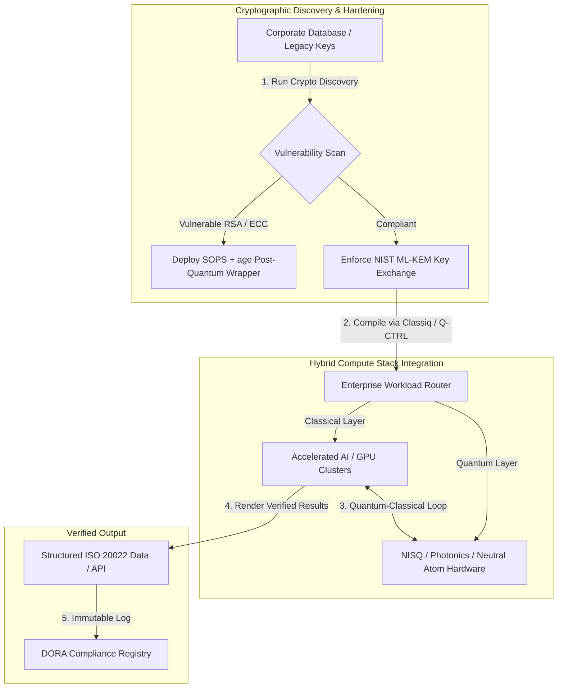

## క్విట్‌ల నుండి లాభాలకు: Economist యొక్క 5th Annual Commercialising Quantum Global 2026 సదస్సు నుండి వ్యూహాత్మక ముఖ్యాంశాలు

ఎంటర్‌ప్రైజ్ సంసిద్ధత, పోస్ట్-క్వాంటం క్రిప్టోగ్రఫీ మైగ్రేషన్‌లు, హైబ్రిడ్ కంప్యూట్ స్టాక్‌లు, మరియు క్వాంటం సెన్సింగ్ మరియు నెట్‌వర్కింగ్ యొక్క ఉద్భవిస్తున్న వాణిజ్య దృశ్యం.

**సంక్షిప్తంగా.** 2026 జూన్ 16–17న లండన్‌లోని Business Design Centreలో Economist Impact ఆతిథ్యం ఇచ్చిన 5th Annual Commercialising Quantum Global 2026 సదస్సు, ఎంటర్‌ప్రైజ్, ఫైనాన్స్, విధానం మరియు పరిశోధన అంతటా 1,100కి పైగా ప్రపంచ నాయకులను ఒకచోట చేర్చింది. కేంద్ర ఇతివృత్తం ఒక స్పష్టమైన నిర్మాణాత్మక మలుపును సూచించింది: క్వాంటం సాంకేతికత ఊహాజనిత ప్రయోగశాల విజ్ఞానం నుండి ఆచరణాత్మక, హైబ్రిడ్ ఎంటర్‌ప్రైజ్ వర్క్‌ఫ్లోలకు మారింది. 2026 తొలి ఐదు నెలల్లోనే సేకరించిన $1.3 బిలియన్ వెంచర్ క్యాపిటల్ మద్దతుతో, బోర్డ్‌రూమ్ చర్చ ఇకపై భౌతిక క్విట్‌లను లెక్కించడంపై కేంద్రీకృతం కాలేదు, కానీ "నో-రిగ్రెట్స్" హైబ్రిడ్ కంప్యూట్ స్టాక్‌లను స్థాపించడం, "harvest-now, decrypt-later" (SNDL) క్రిప్టోగ్రాఫిక్ ముప్పు నుండి డిజిటల్ ఆస్తులను రక్షించడం, మరియు GPS-స్వతంత్ర నావిగేషన్ కోసం సమీప-భవిష్యత్ క్వాంటం సెన్సింగ్ వ్యవస్థలను మోహరించడంపై కేంద్రీకృతమైంది.

## ముఖ్య ముఖ్యాంశాలు

- **ఎంటర్‌ప్రైజ్ ఆచరణాత్మక వర్క్‌ఫ్లోలకు మారడం.** పరిశ్రమ నాయకులు (HorizonX యొక్క [Steve Suarez](https://www.linkedin.com/in/stevesuarez), HSBC యొక్క [Phil Intallura](https://www.linkedin.com/in/intallura)) క్వాంటం ఏకీకరణ ఇకపై భౌతిక శాస్త్ర సమస్య కాదు కానీ ఒక కార్యాచరణ సమస్య అని నొక్కి చెప్పారు. బ్యాంకులు మరియు ఎంటర్‌ప్రైజ్‌లు ప్రతిభను సిద్ధం చేయడానికి మరియు క్రియాశీల వర్క్‌లోడ్‌లను ఆప్టిమైజ్ చేయడానికి హైబ్రిడ్ క్వాంటం-క్లాసికల్ పైలట్‌లను మోహరిస్తున్నాయి.
- **పోస్ట్-క్వాంటం క్రిప్టోగ్రఫీ (PQC) ఒక బోర్డ్ ప్రాధాన్యత.** భద్రత మరియు న్యాయ నిపుణులు (CMS UK, Microsoft యొక్క [Joanne Miller](https://www.linkedin.com/in/joanne-miller-nso), EY యొక్క [Craig Farrell](https://www.linkedin.com/in/craig-farrell)) PQC మోహరించడానికి సంస్థలు తప్పులేని హార్డ్‌వేర్ కోసం వేచి ఉండలేవని హెచ్చరించారు. "Harvest-now, decrypt-later" హార్వెస్టింగ్ నేడే జరుగుతోంది, ఇది NIST ML-KEM ప్రమాణాలకు మైగ్రేషన్‌ను ఒక తక్షణ విశ్వసనీయ ఆందోళనగా చేస్తోంది.
- **క్వాంటం సెన్సింగ్ సమీప-భవిష్యత్ లాభదాయకతకు నాయకత్వం వహిస్తుంది.** తప్పులేని కంప్యూటింగ్ ఇంకా సంవత్సరాల దూరంలో ఉండగా, క్వాంటం సెన్సింగ్ (Infleqtion యొక్క [Matthew Kinsella](https://www.linkedin.com/in/matthewkinsella)) వేగంగా విస్తరిస్తోంది. క్వాంటం క్లాక్‌లు మరియు జడత్వ సెన్సర్‌లు GPS-స్వతంత్ర నావిగేషన్, జాతీయ భద్రత, మరియు అత్యంత-స్థిరమైన శక్తి గ్రిడ్‌లలో మోహరించబడుతున్నాయి.
- **సార్వభౌమత్వం, క్లస్టర్‌లు మరియు విధాన ఆవశ్యకత.** UK సైన్స్ మంత్రి [Lord Vallance](https://www.linkedin.com/in/patrick-vallance) మరియు [Lord William Hague](https://www.linkedin.com/in/williamhague) పరిశోధనను పారిశ్రామిక-స్థాయి "సూపర్‌క్లస్టర్‌లు"గా మార్చే జాతీయ లక్ష్యాలను వివరించారు, ఇవి National Quantum Computing Centre (NQCC)తో సమన్వయం చేసుకుంటాయి. రాబోయే EU Quantum Act సార్వభౌమ కంప్యూటింగ్ సామర్థ్యం కోసం భౌగోళిక-రాజకీయ పరుగును మరింత నొక్కి చెబుతుంది.
- **Quantcore qBIG బహుమతిని గెలుచుకుంది.** University of Glasgow స్పిన్-అవుట్ Quantcore, తన అద్భుతమైన నయోబియం-ఆధారిత సూపర్‌కండక్టింగ్ భాగాల కోసం IOP qBIG బహుమతిని పొందింది, ఇవి సంప్రదాయ పదార్థాల కంటే అధిక ఉష్ణోగ్రతల వద్ద పనిచేస్తాయి, క్రయోజెనిక్ మౌలిక సదుపాయ ఖర్చును గణనీయంగా తగ్గిస్తాయి.

**సంబంధిత పఠనం:** [KyberLib and the Post-Quantum Banking Migration in 2026: From Standards to Code](https://sebastienrousseau.com/2026-06-12-kyberlib-post-quantum-banking-migration-standards-code-2026/), [The Banking Resilience Index in 2026: AI, Cloud, Quantum, Payments, and Third-Party Concentration Risk](https://sebastienrousseau.com/2026-06-08-banking-resilience-index-ai-cloud-quantum-payments-third-party-risk-2026/), [The Cloud Native Banking Index in 2026: DORA, Platform Engineering, Sovereign Cloud, and Operational Resilience](https://sebastienrousseau.com/2026-06-05-cloud-native-banking-index-dora-resilience-platform-engineering-2026/).

## 01. 2026 సదస్సు బోర్డ్‌రూమ్‌కు ఎందుకు ముఖ్యం

Economist యొక్క Commercialising Quantum Global సదస్సు 2026 ఎడిషన్, కార్పొరేట్ ప్రపంచం డీప్ టెక్‌ను ఎలా అంచనా వేస్తుందో అనేదానిలో ఒక శాశ్వత మార్పును సూచించింది.

చారిత్రకంగా, క్వాంటం కంప్యూటింగ్ దశాబ్దాల-కాల శాస్త్రీయ ప్రయత్నంగా R&D విభాగాలకు కేటాయించబడింది. 2026 జూన్‌లో, ఈ దృక్పథం కాలం చెల్లినది. సంస్థలు "భౌతిక-కేంద్రిత" ఉత్సుకత నుండి "వ్యాపార-కేంద్రిత" అమలుకు మారాలి. దీనికి రెండు కారణాలు ఉన్నాయి:

1. **క్వాంటం-AI కలయిక.** అధిక-పనితీరు కంప్యూటింగ్ (HPC) స్టాక్‌లు క్లాసికల్, వేగవంతమైన AI, మరియు NISQ (Noisy Intermediate-Scale Quantum) నోడ్‌లను ఒకే, ఏకీకృత కంప్యూట్ పొరలో విలీనం చేస్తున్నాయి. క్వాంటం-సిద్ధమైన అప్లికేషన్‌లను నిర్మించడం ఆలస్యం చేసే సంస్థలు, వ్యూహాత్మక ప్రయోజనాన్ని పొందే గవాక్షం ఊహించిన దానికంటే వేగంగా మూసుకుంటోందని కనుగొంటాయి.
2. **భౌగోళిక-రాజకీయ మరియు విశ్వసనీయ ఆవశ్యకత.** UK యొక్క లక్ష్య-నేతృత్వ క్వాంటం కార్యక్రమం మరియు రాబోయే EU Quantum Actతో, క్వాంటం సామర్థ్యం జాతీయ సార్వభౌమత్వం మరియు కార్పొరేట్ కొనసాగింపు విషయంగా మారింది.

అంతేకాకుండా, పోస్ట్-క్వాంటం సైబర్ భద్రత ఇకపై భవిష్యత్ సమ్మతి అవసరం కాదు. శత్రు "store now, decrypt later" (SNDL) దాడుల ముప్పు అంటే నేడు అడ్డగించబడిన కార్పొరేట్ డేటా, వాణిజ్య క్వాంటం వ్యవస్థలు విస్తరించినప్పుడు డీక్రిప్ట్ చేయబడుతుంది, ఇది Digital Operational Resilience Act (DORA) వంటి ప్రపంచ కార్యాచరణ స్థితిస్థాపకత ఆదేశాల కింద తక్షణ బాధ్యతను సృష్టిస్తుంది.

## 02. Commercialising Quantum 2026 వ్యూహాత్మక దృక్కోణం

ఎంటర్‌ప్రైజ్ టెక్నాలజీ నాయకులు క్వాంటం పరిపక్వతను ఐదు విభిన్న కార్యాచరణ పొరల మీద మ్యాప్ చేయాలి, కాలపరిమితి హోరిజాన్‌లు మరియు బ్యాలెన్స్-షీట్ నష్టాలను అంచనా వేయాలి.

### పట్టిక 1: Commercialising Quantum 2026 వ్యూహాత్మక దృక్కోణం

| పొర | కార్పొరేట్ దృష్టి | కాలపరిమితి / హోరిజాన్ | ముఖ్య కార్పొరేట్ నష్టం |
| ---- | ---- | ---- | ---- |
| **హార్డ్‌వేర్ & కంపైలర్** | పోటీ విధానాల మధ్య ఎంపిక (సూపర్‌కండక్టింగ్, ట్రాప్డ్ అయాన్‌లు, న్యూట్రల్ ఆటమ్‌లు, ఫోటానిక్స్) | 3 – 5 సంవత్సరాలు (తప్పులేనితనం) | ఒక ముగింపు-లేని ఆర్కిటెక్చర్‌లో లాక్ కావడం లేదా ఒకే ప్లాట్‌ఫారమ్‌కు చాలా ముందుగానే మద్దతు ఇవ్వడం. |
| **క్రిప్టోగ్రాఫిక్ దృఢీకరణ** | క్రిప్టోగ్రాఫిక్ ఆధారితాల ఆవిష్కరణ మరియు జాబితా; NIST ML-KEMకు మైగ్రేషన్ | తక్షణం (క్రియాశీల మైగ్రేషన్) | DORA మరియు NIST CSF 2.0 కింద వ్యవస్థాగత డేటా ఉల్లంఘనలు మరియు సమ్మతి వైఫల్యాలు. |
| **క్వాంటం సెన్సింగ్** | GPS-స్వతంత్ర నావిగేషన్, అత్యంత-స్థిరమైన క్లాక్‌లు, మరియు గ్రావిమీటర్‌ల మోహరింపు | 1 – 2 సంవత్సరాలు (తక్షణ వాణిజ్యం) | GPS జామింగ్ కారణంగా లాజిస్టిక్స్, షిప్పింగ్, మరియు శక్తి గ్రిడ్‌ల కార్యాచరణ అంతరాయం. |
| **సిస్టమ్ ఏకీకరణ** | క్వాంటం హార్డ్‌వేర్‌ను ఇప్పటికే ఉన్న క్లాసికల్ HPC మరియు సూపర్ కంప్యూటింగ్ డేటా సెంటర్‌లలోకి అనుసంధానించడం | 1 – 3 సంవత్సరాలు (హైబ్రిడ్ దశ) | అధిక లేటెన్సీ, డేటా-బదిలీ అడ్డంకులు, మరియు విచ్ఛిన్నమైన కంప్యూట్ సైలోలు. |
| **ఎంటర్‌ప్రైజ్ సాఫ్ట్‌వేర్** | ఉన్నత-స్థాయి అబ్‌స్ట్రాక్షన్ పొరలు మరియు APIల ద్వారా క్వాంటం అల్గోరిథమ్‌లను బహిర్గతం చేయడం (Classiq, Q-CTRL) | తక్షణం (నైపుణ్య నిర్మాణం) | వాస్తవ ఇంజనీరింగ్ అమలు నుండి ప్రతిభ మరియు వర్క్‌ఫ్లో ఒంటరితనం. |

## 03. ముఖ్య క్వాంటం సంకేతాలు మరియు బోర్డ్‌రూమ్ ట్రిగ్గర్‌లు

టెక్నాలజీ నాయకులు తమ క్వాంటం పెట్టుబడులకు మార్గనిర్దేశం చేయడానికి నిర్దిష్ట, పరిమాణాత్మక మార్కెట్ మరియు నియంత్రణ మెట్రిక్‌లను పర్యవేక్షించాలి.

### పట్టిక 2: ముఖ్య క్వాంటం సంకేతాలు మరియు బోర్డ్‌రూమ్ ట్రిగ్గర్‌లు

| సంకేతం | పరిమాణాత్మక మెట్రిక్ | నియంత్రణ / విధాన సూచన | అమలుచేయదగిన ప్లాట్‌ఫారమ్ ప్రాధాన్యత |
| ---- | ---- | ---- | ---- |
| **క్వాంటం నిధుల ఉప్పెన** | 2026 తొలి ఐదు నెలల్లో ప్రపంచవ్యాప్తంగా $1.3 బిలియన్ సేకరించబడింది | Return on Resilience (RoR) | బడ్జెట్‌లను ఊహాజనిత పైలట్‌ల నుండి "నో-రిగ్రెట్స్" హైబ్రిడ్ క్వాంటం-క్లాసికల్ వర్క్‌లోడ్‌లకు మార్చండి. |
| **డేటా డీక్రిప్షన్ బహిర్గతం** | పబ్లిక్ ఛానెల్‌ల మీద ప్రసారం చేయబడిన 100% ఎన్‌క్రిప్టెడ్ డేటా SNDL హార్వెస్టింగ్‌కు బహిర్గతం | DORA Article 6 (ICT భద్రత) | ఎస్టేట్ అంతటా బలహీన RSA/ECC కీలను గుర్తించడానికి క్రిప్టోగ్రాఫిక్ ఆవిష్కరణ సాధనాలను అమలు చేయండి. |
| **సార్వభౌమ మౌలిక సదుపాయం** | £2.5 బిలియన్ UK National Quantum Strategy కేటాయింపు | UK Quantum Missions / Lord Vallance | NQCC వంటి జాతీయ సూపర్‌క్లస్టర్‌లతో స్థానిక భాగస్వామ్యాలను ఏర్పాటు చేయండి. |
| **సమ్మతి గడువులు** | నవంబర్ 14, 2026 SWIFT నిర్మాణాత్మక-చిరునామా మార్పు | SWIFT SR 2026 ఆదేశం | నిర్మాణాత్మక XML స్పెసిఫికేషన్‌లను చేరుకోవడానికి ఇంటర్‌బ్యాంక్ డేటాబేస్‌లను శుభ్రపరచండి మరియు ఫార్మాట్ చేయండి. |

## 04. ప్రధాన సదస్సు అంశాలలోకి లోతైన పరిశీలన

### క్వాంటం ఒక పెట్టుబడి మలుపుకు చేరుకుంది

వెంచర్ క్యాపిటల్ నిధులు గణనీయమైన వేగాన్ని అనుభవించాయి, 2026 తొలి ఐదు నెలల్లోనే **$1.3 బిలియన్** సేకరించాయి. మునుపటి సంవత్సరాల ఊహాజనిత హైప్ చక్రాల మాదిరిగా కాకుండా, ప్రస్తుత మూలధన తరంగం వాస్తవ-ప్రపంచ, సమీప-భవిష్యత్ వర్క్‌లోడ్‌లచే మద్దతు పొందింది. Classiq మరియు IBM Quantum Platform నుండి వక్తలు, సాఫ్ట్‌వేర్ అబ్‌స్ట్రాక్షన్ పొరలు మరియు స్వయంచాలక కంపైలర్‌లు నిపుణులు కాని డెవలపర్ బృందాలను నేటి క్లాసికల్ మౌలిక సదుపాయాలపై హైబ్రిడ్ క్వాంటం-క్లాసికల్ అల్గోరిథమ్‌లను అమలు చేయడానికి ఎలా అనుమతిస్తాయో ప్రదర్శించారు. ఈ "నో-రిగ్రెట్స్" వ్యూహం సంస్థలను తక్షణమే క్వాంటం-సిద్ధమైన ప్రతిభ మరియు వర్క్‌ఫ్లోలను నిర్మించడానికి అనుమతిస్తుంది.

### "harvest now, decrypt later"పై న్యాయ మరియు నియంత్రణ హెచ్చరికలు

న్యాయ భాగస్వాములు మరియు సైబర్ భద్రత కార్యనిర్వాహకులు డేటా నష్టం యొక్క తక్షణత చుట్టూ ప్రధాన నిమగ్నతను రేకెత్తించారు. స్పాన్సర్ చేసే న్యాయ సంస్థ CMS UK మరియు Microsoft CSO [Joanne Miller](https://www.linkedin.com/in/joanne-miller-nso) నుండి ప్రతినిధులు సీనియర్ నిర్వహణకు ఒక కఠినమైన హెచ్చరికను అందించారు: *పోస్ట్-క్వాంటం క్రిప్టోగ్రఫీని మోహరించే ముందు తప్పులేని హార్డ్‌వేర్ రావడానికి వేచి ఉండటం ఒక కీలకమైన విశ్వసనీయ వైఫల్యం.*

"store now, decrypt later" (SNDL) నమూనా కింద, శత్రు నటులు నేడు ఎన్‌క్రిప్టెడ్ కార్పొరేట్ డేటాను క్రియాశీలంగా హార్వెస్ట్ చేస్తున్నారు, క్రిప్టోగ్రాఫికల్‌గా సంబంధిత క్వాంటం కంప్యూటర్‌లు ఉద్భవించిన వెంటనే దాన్ని డీక్రిప్ట్ చేయాలనే ఉద్దేశ్యంతో. దీర్ఘకాలిక సున్నితమైన డేటాసెట్‌లు, మేధో సంపత్తి, మరియు చారిత్రక కస్టమర్ రికార్డులను రక్షించడానికి సంస్థలు తక్షణమే పోస్ట్-క్వాంటం రక్షణలను (NIST ML-KEM వంటివి) మోహరించాలి.

### "క్వాంటం సెన్సింగ్" హైప్ పునఃసమీకరణ

తప్పులేని క్వాంటం కంప్యూటింగ్ ఇంకా సంవత్సరాల దూరంలో ఉండగా, సదస్సు క్వాంటం సెన్సింగ్‌ను వాస్తవ-ప్రపంచ మోహరింపు యొక్క మొదటి నిజంగా లాభదాయకమైన తరంగంగా హైలైట్ చేసింది. Infleqtion యొక్క చీఫ్ ఎగ్జిక్యూటివ్ [Matthew Kinsella](https://www.linkedin.com/in/matthewkinsella), క్వాంటం క్లాక్‌లు, జడత్వ సెన్సర్‌లు, మరియు రేడియో-ఫ్రీక్వెన్సీ వ్యవస్థలు అనేక పరిశ్రమల అంతటా ఎలా వేగంగా విస్తరిస్తున్నాయో వివరించారు.

ఈ సాంకేతికతలు భౌతిక స్థిరాంకాలను ఉప-అణు ఖచ్చితత్వంతో కొలిచేందున, అవి **GPS-స్వతంత్ర నావిగేషన్**, అత్యంత-స్థిరమైన శక్తి గ్రిడ్‌లు, మరియు లోతైన-అంతరిక్ష దూరసంచారాన్ని సాధ్యం చేస్తాయి. పెరుగుతున్న GPS-జామింగ్ ముప్పులను ఎదుర్కొంటున్న విమానయానం, సముద్ర రవాణా, మరియు జాతీయ-రక్షణ వ్యవస్థలకు ఈ అనువర్తనాలు అత్యంత సంబంధితమైనవి.

### పర్యావరణ వ్యవస్థ మరియు క్లస్టర్ సహకారం

UK క్వాంటం పర్యావరణ వ్యవస్థ, దేశీయ ఆవిష్కరణ సూపర్‌క్లస్టర్‌లను ప్రదర్శించడానికి లండన్ సదస్సును ఉపయోగించింది. National Quantum Computing Centre (NQCC) మరియు Digital Catapult నుండి ప్రత్యక్ష నవీకరణలు, ప్రారంభ-దశ డీప్-టెక్ స్పిన్-అవుట్‌లు క్వాంటం హార్డ్‌వేర్‌ను నేరుగా క్లాసికల్ సూపర్ కంప్యూటింగ్ డేటా సెంటర్‌లలోకి అనుసంధానించడం ద్వారా "సాంకేతిక విభజన"ను ఎలా అధిగమించగలవో వివరించాయి.

స్కాటిష్ క్వాంటం స్టార్టప్ Quantcore సహ-వ్యవస్థాపకుడు [Wridhdhisom Karar](https://www.linkedin.com/in/wridhdhisomkarar), కంపెనీ యొక్క నయోబియం-ఆధారిత సూపర్‌కండక్టింగ్ భాగాల కోసం ప్రతిష్ఠాత్మక Institute of Physics (IOP) Quantum Business Innovation and Growth (qBIG) బహుమతిని స్వీకరించారు. ఈ భాగాలు సంప్రదాయ పదార్థాల కంటే అధిక ఉష్ణోగ్రతల వద్ద పనిచేస్తాయి, క్వాంటం ప్రాసెసర్‌లను విస్తరించడానికి అవసరమైన క్రయోజెనిక్ మౌలిక సదుపాయ ఖర్చును గణనీయంగా తగ్గిస్తాయి.

### HSBC కేస్ స్టడీ: క్వాంటం కోసం వేచి ఉండటం ఎందుకు "అనవసర తప్పిదం"

Economist యొక్క 5th Annual Commercialising Quantum Event (2026)లో [**Philip Intallura, Ph.D.**](https://www.linkedin.com/in/intallura) (HSBC యొక్క గ్లోబల్ హెడ్ ఆఫ్ క్వాంటం టెక్నాలజీస్, UK ప్రభుత్వ సలహాదారు, మరియు బోర్డ్ సలహాదారు) నుండి అంతర్దృష్టులు ఒక శక్తివంతమైన బోర్డ్‌రూమ్ ఆదేశాన్ని అందించాయి: *"మీరు ప్రారంభించే ముందు తప్పులేని క్వాంటం కోసం వేచి ఉండటం ఒక అనవసర తప్పిదం."*

ఆర్థిక సంస్థల్లో సాధారణమైన "వేచి-చూడు" విధానం మూడు తప్పుడు ఊహలపై నిర్మించబడిన స్వీయ-గోల్ అని Dr Intallura వాదించారు:

- **సమీప-భవిష్యత్ ROI నిజమైనది.** అనుభావిక పరీక్షలో, HSBC ప్రస్తుతం ఉత్పత్తిలో నడుస్తున్న మోడల్‌లను అధిగమించింది, క్వాంటం పనిని వ్యాపారంలోని ఇతర భాగాలకు అనుసంధానించింది, తన అతిపెద్ద క్లయింట్‌లలో కొందరితో సంబంధాలను మరింత లోతుగా చేయడానికి క్వాంటంను ఉపయోగించింది, మరియు **HSBC Innovation Banking**లోకి గణనీయమైన కొత్త వ్యాపారాన్ని ఆకర్షించింది.
- **క్వాంటం ఒక నిటారు స్వీకరణ వక్రరేఖ.** సామర్థ్యాన్ని నిర్మించడం, వ్యూహాన్ని నిర్దేశించడం, నిధులను సురక్షితం చేయడం, మరియు భారీగా నియంత్రించబడిన సంస్థలో ప్రయోగ చక్రాలను నడపడం చిన్న ప్రయత్నం కాదు. ప్రక్రియలు వ్యవస్థాత్మకంగా పరీక్షించబడాలి మరియు సాంకేతికత కోసం అనుసరించబడాలి.
- **క్వాంటం ఒక పర్యావరణ వ్యవస్థ.** ఏ ఒక్క ఆటగాడూ ఒంటరిగా అక్కడకు చేరుకోలేడు. HSBC అమలు చేసిన ప్రతి పరిశోధన పత్రం, POC, మరియు పైలట్ ఒక క్వాంటం ప్రొవైడర్‌తో సన్నిహిత సహకారంతో ఉంది — మరియు కొన్ని సందర్భాల్లో, సహకారం విద్యారంగం, నియంత్రకులు, మరియు ప్రభుత్వం వరకు విస్తరించింది.

**ముగింపు బోర్డ్‌రూమ్ ఆదేశం:** *"తప్పులేనితనం మొదటి రోజున మీకు అవసరమయ్యే సామర్థ్యం, మీరు ఇప్పుడు నిర్మించే సామర్థ్యం."*

## 05. కార్పొరేట్ క్వాంటం ఏకీకరణ మరియు క్రిప్టోగ్రఫీ పైప్‌లైన్

క్వాంటం సంసిద్ధతను నిర్మిస్తూ డిజిటల్ ఆస్తులను సురక్షితం చేయడానికి, ఎంటర్‌ప్రైజ్ ఒక స్పష్టమైన ఏకీకరణ పైప్‌లైన్‌ను ఏర్పాటు చేయాలి.

## 06. బోర్డ్‌రూమ్ ప్లేబుక్: అమలుచేయదగిన ఆవశ్యకతలు

Commercialising Quantum Global 2026 సదస్సు అంతర్దృష్టులను తక్షణ వ్యాపార విలువగా మార్చడానికి, సీనియర్ నిర్వహణ కింది నాలుగు-దశల బోర్డ్‌రూమ్ ప్లేబుక్‌ను అమలు చేయాలి:

1. **క్రిప్టోగ్రాఫిక్ ఆవిష్కరణను ఆదేశించండి.** అన్ని క్రిప్టోగ్రాఫిక్ ఆస్తులను జాబితా చేయమని Chief Information Security Officer (CISO)ను నిర్దేశించండి, పోస్ట్-క్వాంటం మైగ్రేషన్ కోసం సిద్ధం కావడానికి ఎంటర్‌ప్రైజ్ అంతటా ప్రతి లెగసీ RSA మరియు ECC కీని మ్యాప్ చేయండి.
2. **ఒక "నో-రిగ్రెట్స్" హైబ్రిడ్ వ్యూహాన్ని మోహరించండి.** పరిపూర్ణ హార్డ్‌వేర్ కోసం వేచి ఉండటం మానుకోండి. అంతర్గత ప్రతిభను అభివృద్ధి చేయడానికి మరియు నేడు సంక్లిష్ట లాజిస్టిక్స్ లేదా నష్ట పోర్ట్‌ఫోలియోలను ఆప్టిమైజ్ చేయడానికి క్వాంటం-ప్రేరిత సాఫ్ట్‌వేర్ మరియు హైబ్రిడ్ క్లాసికల్-క్వాంటం పైలట్‌లలో పెట్టుబడి పెట్టండి.
3. **లాజిస్టిక్స్ కోసం క్వాంటం సెన్సింగ్‌ను అంచనా వేయండి.** మీ సంస్థ ప్రపంచ సరఫరా గొలుసులు, షిప్పింగ్, లేదా క్లిష్టమైన మౌలిక సదుపాయాలపై ఆధారపడితే, భౌగోళిక-రాజకీయ అంతరాయ నష్టాలను తగ్గించడానికి క్వాంటం సెన్సింగ్ వ్యవస్థలను (GPS-స్వతంత్ర నావిగేషన్ వంటివి) క్రియాశీలంగా అంచనా వేయండి.
4. **జూన్ 30 Insight Hour కోసం నమోదు చేసుకోండి.** ఎంటర్‌ప్రైజ్ నష్ట నిర్వహణ మరియు ప్రతిభ కేటాయింపు వ్యూహాలను ట్రాక్ చేయడాన్ని కొనసాగించడానికి, 2026 జూన్ 30న సాయంత్రం 3:00 PM BST వద్ద జరిగే వర్చువల్ **Commercialising Quantum Global Insight Hour** (IonQ మద్దతుతో) కోసం మీ టెక్నాలజీ నాయకులు నమోదు చేసుకున్నట్లు నిర్ధారించుకోండి.

## 07. తరచుగా అడిగే ప్రశ్నలు

**"harvest now, decrypt later" (SNDL) అంటే ఏమిటి మరియు అది నేడు ఎందుకు ముఖ్యం?**
SNDL అంటే నేడు ఎన్‌క్రిప్టెడ్ డేటాను అడ్డగించి నిల్వ చేయడం, క్రిప్టోగ్రాఫికల్‌గా సంబంధిత క్వాంటం కంప్యూటర్‌లు అందుబాటులోకి వచ్చిన తర్వాత దాన్ని డీక్రిప్ట్ చేయాలనే ఉద్దేశ్యంతో. దీర్ఘకాలిక సున్నితమైన డేటాసెట్‌లు — మేధో సంపత్తి, కస్టమర్ రికార్డులు, ప్రభుత్వ సమాచార మార్పిడులు — ఇప్పటికే లక్ష్యంగా చేయబడుతున్నాయి. NIST ML-KEMకు మైగ్రేట్ చేయడం బోర్డ్ వాయిదా వేయలేని ఒక విశ్వసనీయ నిర్ణయం.

**కంప్యూటింగ్‌కు బదులుగా క్వాంటం సెన్సింగ్ ఎందుకు మొదటి వాణిజ్య తరంగం?**
క్వాంటం సెన్సర్‌లు భౌతిక స్థిరాంకాలను ఉప-అణు ఖచ్చితత్వంతో కొలుస్తాయి మరియు క్వాంటం కంప్యూటింగ్‌కు అవసరమైన తప్పులేని హార్డ్‌వేర్ అవసరం లేదు. క్వాంటం క్లాక్‌లు, గ్రావిమీటర్‌లు, మరియు జడత్వ సెన్సర్‌లు ఇప్పటికే GPS-స్వతంత్ర నావిగేషన్, అత్యంత-స్థిరమైన శక్తి గ్రిడ్‌లు, మరియు లోతైన-అంతరిక్ష సమాచార మార్పిడుల కోసం పైలట్ మోహరింపులో ఉన్నాయి.

**HSBC యొక్క క్వాంటం పని కేవలం R&D మాత్రమేనా లేదా అది కొలవదగిన లాభాలను అందించిందా?**
సదస్సులో Philip Intallura ప్రకారం, HSBC ప్రస్తుతం ఉత్పత్తిలో నడుస్తున్న మోడల్‌లను అధిగమించింది, తన అతిపెద్ద క్లయింట్‌లతో సంబంధాలను మరింత లోతుగా చేయడానికి క్వాంటంను ఉపయోగించింది, మరియు HSBC Innovation Bankingలోకి గణనీయమైన కొత్త వ్యాపారాన్ని ఆకర్షించింది. పని పరిశోధన నుండి కార్యాచరణ ఏకీకరణకు మారింది.

## 08. సూచనలు

- **Economist Impact, (2026).** *5th Annual Commercialising Quantum Global 2026.* ప్రత్యక్ష సదస్సు కార్యనిర్వహణలు, జూన్ 16–17, 2026. లండన్: Business Design Centre. ఇక్కడ అందుబాటులో ఉంది: [Economist Impact](https://events.economist.com/commercialising-quantum/).
- **National Institute of Standards and Technology (NIST), (2024).** *First Three Finalized Post-Quantum Encryption Standards (FIPS 203, 204, and 205).* Gaithersburg: U.S. Department of Commerce. ఇక్కడ అందుబాటులో ఉంది: [NIST Standards](https://www.nist.gov/news-events/news/2024/08/nist-releases-first-3-finalized-post-quantum-encryption-standards).
- **European Parliament and Council of the European Union, (2022).** *Regulation (EU) 2022/2554 on digital operational resilience for the financial sector (DORA).* Brussels: Official Journal of the European Union. ఇక్కడ అందుబాటులో ఉంది: [DORA Regulation](https://eur-lex.europa.eu/legal-content/EN/TXT/?uri=CELEX%3A32022R2554).
- **SWIFT, (2024).** *[ISO 20022](/2023-09-29-automating-iso-20022-compliant-payment-file-creation-with-pain001/index.html) November 2026 Structured Address Milestone.* La Hulpe: SWIFT. ఇక్కడ అందుబాటులో ఉంది: [SWIFT ISO 20022 milestone](https://www.swift.com/standards/iso-20022/iso-20022-bytes/call-action-november-2026).
