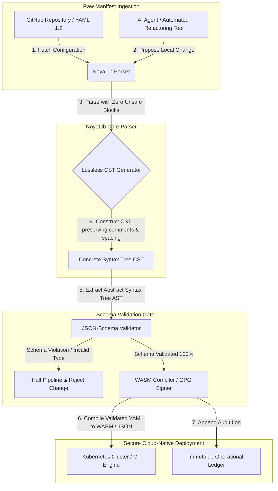

## 2026లో AI, MCP మరియు ఆర్థిక మౌలిక సదుపాయాల కోసం YAMLకు ఎందుకు సురక్షితమైన Rust స్టాక్ అవసరం

సురక్షితమైన Rust YAML స్టాక్ ముఖ్యం ఎందుకంటే YAML ఇప్పుడు CI/CD పైప్‌లైన్‌లు, Kubernetes మ్యానిఫెస్ట్‌లు, [Open Policy Agent](https://www.openpolicyagent.org/) నియమాలు మరియు Model Context Protocol (MCP) టూల్ రిజిస్ట్రీలను మోస్తోంది — మరియు ఒక్క అస్పష్టమైన పార్స్ ఒక క్లియరింగ్ వ్యవస్థను విచ్ఛిన్నం చేయవచ్చు, ఒక సెక్యూరిటీ గ్రూప్‌ను తప్పుగా కాన్ఫిగర్ చేయవచ్చు, లేదా స్థానిక AI ఏజెంట్‌కు తప్పు అనుమతులను అప్పగించవచ్చు. [NoyaLib](https://github.com/sebastienrousseau/noyalib) అనేది ఆ మౌలిక సదుపాయాలను డిఫాల్ట్‌గా సురక్షితంగా చేయడానికి రూపొందించబడిన స్వచ్ఛమైన-Rust, జీరో-అన్‌సేఫ్ [YAML 1.2](https://yaml.org/spec/1.2.2/) పార్సింగ్ మరియు ధ్రువీకరణ పర్యావరణ వ్యవస్థ.

## త్వరిత సమాధానం

**ఒక్క వాక్యంలో NoyaLib అంటే ఏమిటి?** NoyaLib అనేది జీరో `unsafe` కోడ్‌తో, అధికారిక 406-పరీక్షల YAML సూట్‌లో 100 % స్పెక్ అనుసరణతో, నష్టరహిత Concrete Syntax Treeతో, మరియు రియల్-టైమ్ [JSON Schema](https://json-schema.org/) ధ్రువీకరణతో కూడిన ఒక ఓపెన్-సోర్స్, స్వచ్ఛమైన-Rust YAML 1.2 పార్సర్ మరియు ధ్రువీకరణ పర్యావరణ వ్యవస్థ — AI-ఏజెంట్, MCP, Kubernetes మరియు ఆర్థిక-మౌలిక సదుపాయాల కాన్ఫిగరేషన్‌ను డిఫాల్ట్‌గా సురక్షితంగా చేయడానికి రూపొందించబడింది.

## కార్యనిర్వాహక సారాంశం

అస్పష్టమైన పార్స్ లేదా స్కీమా ఉల్లంఘన బహుళ-బిలియన్-డాలర్ల ఉత్పత్తి క్లియరింగ్ వ్యవస్థను విచ్ఛిన్నం చేసే వరకు YAML నిరాడంబరంగా కనిపిస్తుంది. 2026లో, YAML అనేది [CI/CD](https://docs.github.com/en/actions/learn-github-actions/workflow-syntax-for-github-actions) పైప్‌లైన్‌లు, [Kubernetes](https://kubernetes.io/docs/concepts/configuration/overview/) మ్యానిఫెస్ట్‌లు, [Open Policy Agent](https://www.openpolicyagent.org/) నియమాలు మరియు Model Context Protocol (MCP) టూల్ రిజిస్ట్రీల కోసం వాస్తవిక ప్రమాణం. అపారదర్శక వారసత్వ పార్సర్‌లు — మెమరీ దుర్బలతలు మరియు విధ్వంసక పార్సింగ్‌తో — ఆమోదయోగ్యం కాని భద్రతా ప్రమాదం. NoyaLib అనేది స్వచ్ఛమైన-Rust, జీరో-అన్‌సేఫ్ YAML 1.2 పర్యావరణ వ్యవస్థ: మొత్తం 406 అధికారిక సూట్ పరీక్షలలో 100 % స్పెక్ అనుసరణ, వ్యాఖ్యలు మరియు అంతరాలను భద్రపరిచే నష్టరహిత Concrete Syntax Tree (CST), మరియు అంతర్నిర్మిత JSON-Schema ధ్రువీకరణ. ఫలితంగా YAML ఒక ఆడిట్ చేయదగిన, సురక్షితమైన మరియు ఏజెంట్-ప్రవేశయోగ్య కాన్ఫిగరేషన్ కంట్రోల్ ప్లేన్‌గా పునర్నిర్మించబడుతుంది.

## ప్రధాన అంశాలు

- **కాన్ఫిగరేషన్ అనేది ఉత్పత్తి కోడ్.** ఒక్క లోపభూయిష్ట YAML ఫైల్ క్లౌడ్-స్థానిక సెక్యూరిటీ గ్రూప్‌లను లేదా AI-ఏజెంట్ అనుమతులను తప్పుగా కాన్ఫిగర్ చేయవచ్చు. NoyaLib YAMLను కీలక మౌలిక సదుపాయంగా పరిగణిస్తుంది.
- **జీరో-అన్‌సేఫ్ డిజైన్.** పూర్తిగా సురక్షితమైన Rustలో జీరో `unsafe` బ్లాక్‌లతో నిర్మించబడిన NoyaLib, కోర్ పార్సింగ్ లేయర్‌లలో మెమరీ-భద్రతా దుర్బలతలను — బఫర్ ఓవర్‌ఫ్లోలు, రిమోట్ కోడ్ ఎగ్జిక్యూషన్‌లను — తొలగిస్తుంది.
- **సంపూర్ణ 406/406 స్పెక్ అనుసరణ.** కాన్ఫిగరేషన్ నిర్మాణాలను గణితశాస్త్రపరంగా ధ్రువీకరిస్తుంది, స్టేజింగ్ మరియు ఉత్పత్తి పరిసరాల మధ్య పార్సింగ్ వ్యత్యాసాలు మరియు నిర్మాణాత్మక డ్రిఫ్ట్‌లను తొలగిస్తుంది.
- **నష్టరహిత Concrete Syntax Tree.** వ్యాఖ్యలు మరియు ఫార్మాటింగ్‌ను విస్మరించే వారసత్వ పార్సర్‌ల మాదిరిగా కాకుండా, NoyaLib అంతరాలు మరియు ఉల్లేఖనాలను భద్రపరుస్తుంది, AI ఏజెంట్ల ద్వారా సురక్షితమైన, రౌండ్-ట్రిప్ స్వయంచాలక రీఫ్యాక్టరింగ్‌ను సాధ్యం చేస్తుంది.
- **బోర్డు-స్థాయి ధర్మకర్తృత్వ విలువ.** కాన్ఫిగరేషన్ సమగ్రతను [DORA Article 5](https://eur-lex.europa.eu/legal-content/EN/TXT/?uri=CELEX%3A32022R2554) మరియు [Basel III](https://www.bis.org/bcbs/publ/d424.htm) కార్యాచరణ-నష్ట మూలధన కొలమానాలతో అనుసంధానిస్తుంది, సీనియర్ యాజమాన్యాన్ని వ్యక్తిగత బాధ్యత నుండి నేరుగా రక్షిస్తుంది.

**సంబంధిత పఠనం:** [KyberLib మరియు 2026లో పోస్ట్-క్వాంటం బ్యాంకింగ్ మైగ్రేషన్: ప్రమాణాల నుండి కోడ్‌కు](https://sebastienrousseau.com/2026-06-12-kyberlib-post-quantum-banking-migration-standards-code-2026/), [2026లో క్లౌడ్ నేటివ్ బ్యాంకింగ్ ఇండెక్స్: DORA, ప్లాట్‌ఫారమ్ ఇంజనీరింగ్, సార్వభౌమ క్లౌడ్ మరియు కార్యాచరణ స్థితిస్థాపకత](https://sebastienrousseau.com/2026-06-05-cloud-native-banking-index-dora-resilience-platform-engineering-2026/), [2026లో AI-అవగాహన Dotfiles: MCP, SLSA మరియు మల్టీ-షెల్ సమానత్వం కోసం సురక్షితమైన, పునరుత్పాదక డెవలపర్ వర్క్‌స్టేషన్‌ను నిర్మించడం](https://sebastienrousseau.com/2026-06-16-ai-aware-dotfiles-secure-reproducible-workstation-2026/).

## 01. 2026లో సురక్షితమైన Rust YAML స్టాక్ ఎందుకు ముఖ్యం

జూన్ 2026లో, ఎంటర్‌ప్రైజ్ IT మౌలిక సదుపాయాలు అత్యంత విస్తృతమైనవి మరియు క్రమంగా స్వయంచాలకమైనవి.

YAML నిశ్శబ్దంగా మొత్తం సాఫ్ట్‌వేర్-ఇంజనీరింగ్ స్టాక్ కోసం భారం-మోసే కాన్ఫిగరేషన్ భాషగా మారింది. ఇది ఉత్పత్తి కళాకృతులను కంపైల్ చేసే నిరంతర-సమగ్రత (CI) వర్క్‌ఫ్లోలను, ప్రపంచ క్లౌడ్-స్థానిక క్లస్టర్‌లను ఆర్కెస్ట్రేట్ చేసే [Kubernetes](https://kubernetes.io/docs/concepts/overview/) మ్యానిఫెస్ట్‌లను, మరియు స్థానిక AI ఏజెంట్లకు స్థానిక కార్యకలాపాలను నిర్వహించే అనుమతిని మంజూరు చేసే [Model Context Protocol](https://modelcontextprotocol.io/) (MCP) సర్వర్ స్కీమాలను మోస్తుంది.

వారసత్వ YAML పార్సర్‌లు — [PyYAML](https://pyyaml.org/), [yaml-cpp](https://github.com/jbeder/yaml-cpp), [libyaml](https://github.com/yaml/libyaml) — రెండు నిర్మాణాత్మక ప్రమాదాలను మోస్తాయి:

1. **టైప్-కోఎర్షన్ దుర్బలతలు (the "Norway problem").** వారసత్వ పార్సర్‌లు తరచుగా కోట్ చేయని స్ట్రింగ్‌లను (దేశ కోడ్ `NO`ను బూలియన్ `false`గా, `yes`/`no`ను కూడా అలాగే) కోఎర్స్ చేస్తాయి — [YAML 1.1 vs 1.2 boolean tag](https://yaml.org/type/bool.html) చూడండి — దీనివల్ల కీలక వ్యవస్థ వైఫల్యాలు లేదా నిశ్శబ్ద భద్రతా తప్పు-కాన్ఫిగరేషన్‌లు సంభవిస్తాయి.
2. **మెమరీ-భద్రతా దోపిడీలు.** C/C++లో వ్రాయబడిన అపారదర్శక పార్సర్‌లు మెమరీ-లీక్ మరియు బఫర్-ఓవర్‌ఫ్లో దోపిడీలతో బాధపడతాయి, ఇవి కోర్ బిల్డ్ సర్వర్‌లపై రిమోట్ కోడ్ ఎగ్జిక్యూషన్ (RCE)కు దారితీయవచ్చు.

[NoyaLib](https://github.com/sebastienrousseau/noyalib) ఈ సవాళ్లను పరిష్కరిస్తుంది. ఇది స్వచ్ఛమైన-Rust, జీరో-అన్‌సేఫ్ YAML 1.2 పార్సింగ్ మరియు ధ్రువీకరణ పర్యావరణ వ్యవస్థ. సంపూర్ణ 406/406 స్పెక్ అనుసరణను సాధించడం ద్వారా మరియు పార్స్ సమయంలో నేరుగా కఠినమైన JSON-Schema ధ్రువీకరణను అమలు చేయడం ద్వారా, NoyaLib అధిక **Return on Resilience (RoR)**ను అందిస్తుంది — కాన్ఫిగరేషన్-ప్రేరిత డౌన్‌టైమ్‌ను నిరోధిస్తుంది మరియు ఆర్థిక-గ్రేడ్ సాఫ్ట్‌వేర్ సప్లై చైన్‌లను భద్రపరుస్తుంది.

## 02. NoyaLib 2026 ఆర్కిటెక్చర్ లెన్స్

NoyaLib పర్యావరణ వ్యవస్థ ఒక సురక్షితమైన, నష్టరహిత కాన్ఫిగరేషన్ పార్సర్‌గా పనిచేస్తుంది. ప్రతి స్థానిక మరియు క్లౌడ్ మ్యానిఫెస్ట్ నిర్మాణాత్మకంగా ధ్రువీకరించబడుతుంది మరియు అత్యల్ప ఎగ్జిక్యూషన్ లేయర్‌లో రక్షించబడుతుంది.

### పట్టిక 1: NoyaLib ఆర్కిటెక్చర్ లేయర్‌లు మరియు నష్ట తగ్గింపు

| లేయర్ | డిజైన్ నిర్ణయం | ఇది ఎందుకు ముఖ్యం | తప్పుగా నిర్వహిస్తే ప్రమాదం |
| ---- | ---- | ---- | ---- |
| **పార్సర్ లేయర్** | జీరో `unsafe` బ్లాక్‌లతో YAML 1.2 అనుసరణ, స్వచ్ఛమైన-Rust పార్సర్ | అత్యల్ప ఎగ్జిక్యూషన్ లేయర్‌లో మెమరీ-భద్రతా దుర్బలతలు మరియు బఫర్ ఓవర్‌ఫ్లోలను తొలగిస్తుంది. | కోర్ బిల్డ్ సర్వర్‌లపై రిమోట్ కోడ్ ఎగ్జిక్యూషన్ (RCE). |
| **అనుసరణ లేయర్** | 406/406 అధికారిక YAML 1.2 సూట్ పరీక్షలలో 100 % అనుసరణ | స్టేజింగ్ మరియు ఉత్పత్తి మధ్య పార్సింగ్ వ్యత్యాసాలు మరియు టైప్-కోఎర్షన్ డ్రిఫ్ట్‌ను తొలగిస్తుంది. | "Norway problem" టైప్-కోఎర్షన్ లోపాలు సెక్యూరిటీ గ్రూప్‌లను నిలిపివేస్తాయి. |
| **సింటాక్స్-ట్రీ లేయర్** | నష్టరహిత Concrete Syntax Tree (CST) | రౌండ్-ట్రిప్ పార్సింగ్ మరియు ప్రోగ్రామాటిక్ రీఫ్యాక్టరింగ్ సమయంలో వ్యాఖ్యలు, అంతరాలు మరియు క్రమాన్ని భద్రపరుస్తుంది. | స్వయంచాలక AI రీఫ్యాక్టరింగ్ డెవలపర్ ఉల్లేఖనాలను నాశనం చేస్తుంది. |
| **ధ్రువీకరణ లేయర్** | పార్సింగ్ సమయంలో [JSON Schema (Draft 2020-12)](https://json-schema.org/draft/2020-12/release-notes) ధ్రువీకరణ | కాన్ఫిగరేషన్ ఫైల్‌లు ఉత్పత్తి క్లస్టర్‌లను చేరుకోకముందే వాటిపై కఠినమైన డేటా మోడల్‌లను అమలు చేస్తుంది. | లోపభూయిష్ట కాన్ఫిగరేషన్ ఫైల్‌లు క్లౌడ్-స్థానిక క్లస్టర్ క్రాష్‌లను ప్రేరేపిస్తాయి. |
| **ఇంటర్‌ఫేస్ లేయర్** | WebAssembly (WASM) మరియు MCP బైండింగ్‌లు | కాన్ఫిగరేషన్ ధ్రువీకరణ నేరుగా బ్రౌజర్‌లు, ఎడ్జ్ నోడ్‌లు మరియు స్థానిక ఏజెంట్ టూల్‌కిట్‌ల లోపల నడవడానికి అనుమతిస్తుంది. | ఎడ్జ్ పరికరాలపై ధ్రువీకరణ నడవలేని టూలింగ్ సైలోలు. |

## 03. కీలక వర్క్‌స్టేషన్ మరియు కాన్ఫిగరేషన్ భద్రతా సంకేతాలు

అభివృద్ధి మరియు కార్యకలాపాల ఎస్టేట్ అంతటా సంపూర్ణ భద్రతను నిర్వహించడానికి, చీఫ్ ఇన్ఫర్మేషన్ సెక్యూరిటీ ఆఫీసర్‌లు (CISOలు) నిర్దిష్ట, పరిమాణాత్మక కొలమానాలను పర్యవేక్షించాలి.

### పట్టిక 2: వర్క్‌స్టేషన్ మరియు కాన్ఫిగరేషన్ భద్రతా సంకేతాలు

| సంకేతం | కొలమానం / కార్యాచరణ ప్రమాణం | NIST CSF / DORA సూచన | సాంకేతిక ప్లాట్‌ఫారమ్ అమలు |
| ---- | ---- | ---- | ---- |
| **పార్సర్ అనుసరణ** | అధికారిక YAML 1.2 పరీక్షా సూట్ అంతటా 100 % ఉత్తీర్ణ రేటు (406/406 పరీక్షలు). | [DORA Article 6](https://eur-lex.europa.eu/legal-content/EN/TXT/?uri=CELEX%3A32022R2554) (ICT భద్రత) | CI ఎగ్జిక్యూషన్‌కు ముందు అన్ని మ్యానిఫెస్ట్‌లను ధ్రువీకరించే NoyaLib పార్సర్ కోర్. |
| **మెమరీ భద్రతా ప్రొఫైల్** | పార్సర్ మరియు సీరియలైజర్ డిపెండెన్సీల లోపల జీరో `unsafe` Rust బ్లాక్‌లు. | DORA Article 30 (సప్లై చైన్) | cargo బిల్డ్‌లలో స్వయంచాలక కంపైలర్ తనిఖీలు ([`forbid(unsafe_code)`](https://doc.rust-lang.org/reference/attributes/diagnostics.html#the-forbid-attribute)). |
| **స్కీమా ధ్రువీకరణ** | పార్స్ చేయబడిన కాన్ఫిగరేషన్ ఫైల్‌లలో 100 % చెల్లుబాటు అయ్యే [JSON Schema](https://json-schema.org/) మోడల్‌లకు వ్యతిరేకంగా ధృవీకరించబడతాయి. | [NIST CSF 2.0](https://www.nist.gov/cyberframework) (PR.DS-01) | స్కీమా ఉల్లంఘనలపై బిల్డ్ పైప్‌లైన్‌లను నిలిపివేసే రియల్-టైమ్ ధ్రువీకరణ గేట్. |
| **కాన్ఫిగరేషన్ డ్రిఫ్ట్** | స్థానిక కాన్ఫిగరేషన్ ఫైల్‌లను git-వెర్షన్డ్ స్థితికి రియల్-టైమ్ గుర్తింపు మరియు పునరుద్ధరణ. | Return on Resilience (RoR) | అన్ని స్థానిక ఫైల్ మార్పులను లాగ్ చేసే నిరంతర టెలిమెట్రీ. |
| **ఏజెంట్ యాక్సెస్ నియంత్రణ** | MCP కాన్ఫిగరేషన్‌ల ద్వారా పనిచేసే స్థానిక AI టూల్స్ కోసం పరిమిత, రీడ్-ఓన్లీ అనుమతులు. | మోడల్ నష్ట నిర్వహణ ([SR 11-7](https://www.federalreserve.gov/supervisionreg/srletters/sr1107.htm)) | ఏజెంట్ కార్యకలాపాలను ఆమోదించబడిన డైరెక్టరీలకు పరిమితం చేసే MCP సర్వర్ సరిహద్దులు. |

## 04. అపారదర్శక కాన్ఫిగరేషన్ పార్సింగ్ యొక్క తప్పుడు భావన

క్లౌడ్-స్థానిక కార్యకలాపాలలో ఒక ప్రధాన దుర్బలత *అపారదర్శక పార్సింగ్* — నిర్మాణాత్మక మెటాడేటాను (వ్యాఖ్యలు, వైట్‌స్పేస్, డాక్యుమెంట్ క్రమం) విస్మరించే లేదా కంపైలేషన్ సమయంలో నిశ్శబ్దంగా టైప్‌లను కోఎర్స్ చేసే పార్సర్‌లను ఉపయోగించడం. ఈ ప్రవర్తన రెండు తీవ్రమైన భద్రతా ప్రమాదాలను ప్రవేశపెడుతుంది:

1. **విధ్వంసక రీఫ్యాక్టరింగ్.** ఒక AI కోడింగ్ అసిస్టెంట్ లేదా స్వయంచాలక రీఫ్యాక్టరింగ్ టూల్ ఒక డిప్లాయ్‌మెంట్ మ్యానిఫెస్ట్‌ను నవీకరించినప్పుడు, సాంప్రదాయ పార్సర్‌లు డెవలపర్ వ్యాఖ్యలు మరియు ఫార్మాటింగ్‌ను విస్మరిస్తాయి, మానవ సమీక్షలు మరియు సంఘటన-అనంతర ఫోరెన్సిక్స్ కోసం అవసరమైన సందర్భాన్ని నాశనం చేస్తాయి.
2. **పార్సింగ్ వ్యత్యాసాలు.** ఒక స్టేజింగ్ పరిసరం Python-ఆధారిత పార్సర్‌ను ఉపయోగించి, ఉత్పత్తి ఒక C-ఆధారిత పార్సర్‌ను నడిపిస్తే, YAML 1.2 స్పెక్ అనుసరణలో చిన్న తేడాలు ఒక చెల్లుబాటు అయ్యే స్టేజింగ్ మ్యానిఫెస్ట్ ఉత్పత్తిలో విఫలం కావడానికి లేదా భిన్నంగా ప్రవర్తించడానికి కారణమవుతాయి, దాచిన భద్రతా దుర్బలతలను సృష్టిస్తాయి.

NoyaLib యొక్క **నష్టరహిత Concrete Syntax Tree (CST)** దీన్ని పరిష్కరిస్తుంది. ఇది పార్స్-అండ్-సీరియలైజ్ లూప్ సమయంలో ప్రతి స్పేస్, వ్యాఖ్య మరియు డాక్యుమెంట్ లైన్‌ను భద్రపరుస్తుంది. స్వయంచాలక AI అసిస్టెంట్‌లు మానవ-వ్రాసిన ఉల్లేఖనాలలో 100 %ను భద్రపరుస్తూ కాన్ఫిగరేషన్ ఫైల్‌లను ఎడిట్ చేయవచ్చు, రీఫ్యాక్టర్ చేయవచ్చు మరియు కమిట్ చేయవచ్చు — ఒక సంపూర్ణ ఆడిట్ ట్రెయిల్.

## 05. పరిమిత AI కాన్ఫిగరేషన్ పైప్‌లైన్‌ను రూపొందించడం

హానికర కాన్ఫిగరేషన్ మార్పులు ఉత్పత్తి పరిసరాలను చేరుకోకుండా నిరోధించడానికి, సంస్థ ఒక కఠినంగా పరిమితమైన, స్కీమా-ధ్రువీకరించిన కాన్ఫిగరేషన్ పైప్‌లైన్‌ను అమలు చేయాలి.

క్రింది కార్యాచరణ ప్రవాహం NoyaLib ముడి YAMLను ఎలా పార్స్ చేస్తుంది, ఒక నష్టరహిత CSTను నిర్మిస్తుంది, ఒక JSON-Schema మోడల్‌కు వ్యతిరేకంగా ASTను ధ్రువీకరిస్తుంది, మరియు బ్రౌజర్ లేదా ఎడ్జ్ పరిసరాల కోసం WebAssembly బైండింగ్‌లను కంపైల్ చేస్తుందో చూపిస్తుంది.

## 06. బోర్డ్‌రూమ్ ప్లేబుక్ మరియు ధర్మకర్తృత్వ బాధ్యత

కాన్ఫిగరేషన్ భద్రత మరియు సాఫ్ట్‌వేర్-సప్లై-చైన్ సమగ్రత కీలక బోర్డ్‌రూమ్ ప్రాధాన్యతలు. సీనియర్ మేనేజర్‌లు కాన్ఫిగరేషన్ నిర్వహణను ధర్మకర్తృత్వ కర్తవ్యం మరియు కార్యాచరణ స్థితిస్థాపకత లెన్స్ ద్వారా చేరుకోవాలి.

- **DORA Article 5 (బోర్డు జవాబుదారీతనం).** సంస్థ యొక్క ICT నష్టాన్ని నిర్వహించడానికి బోర్డు అంతిమ, ప్రతినిధీకరించలేని బాధ్యతను కలిగి ఉంటుందని నిర్దేశిస్తుంది. కాన్ఫిగరేషన్ ఫైల్‌లు కీలక క్లౌడ్-స్థానిక సెక్యూరిటీ గ్రూప్‌లు మరియు చెల్లింపు-రూటింగ్ మార్గాలను నియంత్రిస్తాయి కాబట్టి, ఈ మ్యానిఫెస్ట్‌లను పార్స్ చేసే వ్యవస్థలు మెమరీ-సురక్షితమైనవి మరియు పూర్తిగా స్పెక్-అనుసరణ కలిగినవని బోర్డులు నియంత్రణ ఆడిట్‌లను సంతృప్తిపరచడానికి ధృవీకరించాలి. ([Regulation (EU) 2022/2554](https://eur-lex.europa.eu/legal-content/EN/TXT/?uri=CELEX%3A32022R2554))
- **BCBS 239 (నష్ట డేటా సమీకరణ మరియు నివేదన).** నష్ట నివేదన మరియు మౌలిక సదుపాయాల కొలమానాలు ఖచ్చితమైనవి, పూర్తివి మరియు కఠినమైన డేటా-నాణ్యత నియంత్రణల కింద ఉత్పత్తి చేయబడాలని కోరుతుంది. NoyaLib కాన్ఫిగరేషన్ ఫైల్‌లను మూలం వద్ద కఠినమైన స్కీమాలకు వ్యతిరేకంగా పార్స్ చేసి ధ్రువీకరించడం ద్వారా BCBS 239కు మద్దతు ఇస్తుంది, నిశ్శబ్ద డేటా లీకేజ్ లేదా తప్పు-కాన్ఫిగరేషన్-ప్రేరిత అంతరాయాలను నిరోధిస్తుంది. ([BCBS 239 standard](https://www.bis.org/publ/bcbs239.htm))
- **కార్యాచరణ-నష్ట మూలధన ఛార్జీల తగ్గింపు (Basel III).** కాన్ఫిగరేషన్-ప్రేరిత అంతరాయాలు Basel III కింద కార్యాచరణ-నష్ట మూలధన ఛార్జీలను నేరుగా పెంచుతాయి, బ్యాలెన్స్-షీట్ మూలధనాన్ని కట్టివేస్తాయి. NoyaLib వంటి సురక్షితమైన, స్వచ్ఛమైన-Rust పార్సర్‌పై ఎంటర్‌ప్రైజ్ కాన్ఫిగరేషన్ స్టాక్‌ను ప్రమాణీకరించడం ఈ నష్టాన్ని కనిష్టీకరిస్తుంది, మూలధనాన్ని భద్రపరుస్తుంది మరియు కస్టమర్ నమ్మకాన్ని రక్షిస్తుంది. ([Basel III standards](https://www.bis.org/bcbs/publ/d424.htm))

## 07. బ్యాంక్ రకం ద్వారా దీని అర్థం ఏమిటి

### గ్లోబల్ సిస్టమిక్‌గా ముఖ్యమైన బ్యాంకులు (G-SIBs)

G-SIBలు బహుళ అధికార పరిధులలో వేలాది మైక్రోసర్వీసులు మరియు డిప్లాయ్‌మెంట్ పైప్‌లైన్‌లను నిర్వహిస్తాయి. వాటి ప్రాథమిక సవాలు అపారమైన క్లౌడ్-స్థానిక ఎస్టేట్‌ల అంతటా కాన్ఫిగరేషన్ స్థిరత్వాన్ని నిర్వహించడం మరియు భద్రతా డ్రిఫ్ట్‌ను నిరోధించడం. NoyaLib వంటి సురక్షితమైన Rust YAML స్టాక్‌పై ప్రమాణీకరించడం అన్ని Kubernetes మ్యానిఫెస్ట్‌లు, CI/CD పైప్‌లైన్‌లు మరియు భద్రతా విధానాలు ఒక ఏకరూప, మెమరీ-సురక్షిత చట్రం కింద పార్స్ చేయబడతాయి మరియు ధ్రువీకరించబడతాయని హామీ ఇస్తుంది — ఆడిట్ చేయని "స్నోఫ్లేక్" కాన్ఫిగరేషన్‌ల ప్రమాదాన్ని తొలగిస్తుంది.

### లావాదేవీ మరియు కార్పొరేట్ బ్యాంకులు

లావాదేవీ బ్యాంకులు సున్నితమైన చెల్లింపు గేట్‌వేలు మరియు హోల్‌సేల్ క్లియరింగ్ మౌలిక సదుపాయాలను నిర్వహిస్తాయి. ఈ ఉత్పత్తి పరిసరాలకు అమలు చేయబడిన కోడ్ మరియు కాన్ఫిగరేషన్ యొక్క సంపూర్ణ భద్రతను నిరూపించడం ఒక చర్చించలేని నియంత్రణ అవసరం. NoyaLibను ఏకీకృతం చేయడం సాఫ్ట్‌వేర్ సప్లై చైన్ పూర్తిగా ఆడిట్ చేయబడింది, నష్టరహితం మరియు పార్సింగ్ దుర్బలతల నుండి రక్షించబడిందని హామీ ఇస్తుంది — DORA Article 6 మరియు [PCI DSS v4.0](https://www.pcisecuritystandards.org/document_library/) సెక్షన్ 6కు స్పష్టంగా మ్యాప్ అయ్యే ఒక నియంత్రణ.

### ప్రాంతీయ మరియు చిన్న బ్యాంకులు

ప్రాంతీయ బ్యాంకులు G-SIB-స్థాయి సాంకేతిక బడ్జెట్‌లు లేకుండా అధిక సైబర్‌భద్రతా ప్రమాణాలను నిర్వహించాలి. ఓపెన్-సోర్స్ NoyaLib చట్రం ఒక తేలికపాటి, ఖర్చు-సమర్థవంతమైన మరియు అత్యంత సురక్షితమైన Rust-స్నేహపూర్వక పరిష్కారాన్ని అందిస్తుంది, యాజమాన్య లైసెన్స్ ఫీజులు లేకుండా చిన్న సంస్థలు ఎంటర్‌ప్రైజ్-గ్రేడ్ కాన్ఫిగరేషన్ భద్రత మరియు సప్లై-చైన్ రక్షణను అమలు చేయడానికి వీలు కల్పిస్తుంది.

## 08. ముగింపు: కాన్ఫిగరేషన్ భద్రతా రోడ్‌మ్యాప్

డెవలపర్ వర్క్‌స్టేషన్ మరియు క్లౌడ్-స్థానిక మౌలిక సదుపాయాల కాన్ఫిగరేషన్‌లు సాఫ్ట్‌వేర్ సప్లై చైన్‌లో కీలక కంట్రోల్ ప్లేన్‌లు. ఆడిట్ చేయని, అస్పష్టమైన లేదా అసురక్షిత కాన్ఫిగరేషన్ ఫైల్‌లు కార్పొరేట్ ఆస్తులను చేరుకోవడానికి అనుమతించడం ఒక ఆమోదయోగ్యం కాని కార్యాచరణ మరియు నియంత్రణ ప్రమాదం.

సాఫ్ట్‌వేర్ సప్లై చైన్‌ను భద్రపరచడానికి మరియు కాన్ఫిగరేషన్ దుర్బలతల నుండి ఎండ్‌పాయింట్‌లను రక్షించడానికి, సీనియర్ సాంకేతిక మరియు భద్రతా మేనేజర్‌లు ఈరోజు స్పష్టమైన అభివృద్ధి రోడ్‌మ్యాప్‌ను అమలు చేయాలి:

1. **డిక్లరేటివ్ కాన్ఫిగరేషన్‌ను తప్పనిసరి చేయండి.** మాన్యువల్, ఆడిట్ చేయని కాన్ఫిగరేషన్ సర్దుబాట్లను దశలవారీగా తొలగించండి మరియు అన్ని మ్యానిఫెస్ట్‌లు వెర్షన్-నియంత్రిత, డిక్లరేటివ్ రికార్డ్ వ్యవస్థగా నిర్వహించబడాలని తప్పనిసరి చేయండి.
2. **స్కీమా ధ్రువీకరణను అమలు చేయండి.** డిప్లాయ్‌మెంట్‌కు ముందు అన్ని కాన్ఫిగరేషన్ ఫైల్‌లు చెల్లుబాటు అయ్యే JSON-Schema మోడల్‌లకు వ్యతిరేకంగా ధృవీకరించబడేలా కఠినమైన ప్రీ-కమిట్ హుక్‌లు మరియు స్కానింగ్ యుటిలిటీలను అమలు చేయండి.
3. **నష్టరహిత రౌండ్-ట్రిప్పింగ్‌ను అమలు చేయండి.** అన్ని స్వయంచాలక AI కోడింగ్ అసిస్టెంట్‌లు మరియు రీఫ్యాక్టరింగ్ టూల్స్ వ్యాఖ్యలు, అంతరాలు మరియు డెవలపర్ సందర్భాన్ని భద్రపరచడానికి నష్టరహిత పార్సింగ్‌ను ఉపయోగించేలా నిర్ధారించండి.
4. **సప్లై చైన్‌ను భద్రపరచండి.** అన్ని కాన్ఫిగరేషన్ సెటప్‌లు మరియు పార్సింగ్ యుటిలిటీలు ఎగ్జిక్యూషన్‌కు ముందు NoyaLib వంటి స్వచ్ఛమైన-Rust, జీరో-అన్‌సేఫ్ లైబ్రరీలను ఉపయోగించి క్రిప్టోగ్రాఫికల్‌గా ధృవీకరించబడేలా నిర్ధారించండి. ([SLSA framework](https://slsa.dev/))

## 09. తరచుగా అడిగే ప్రశ్నలు

**NoyaLib అంటే ఏమిటి మరియు అది YAML పార్సింగ్ కోసం ఎందుకు ఉపయోగించబడుతుంది?**
NoyaLib అనేది ఒక ఓపెన్-సోర్స్, స్వచ్ఛమైన-Rust, జీరో-అన్‌సేఫ్ YAML 1.2 పార్సర్. ఇది అధికారిక 406-పరీక్షల సూట్ అంతటా 100 % స్పెక్ అనుసరణను సాధిస్తుంది, పార్సింగ్ సమయంలో కఠినమైన [JSON Schema](https://json-schema.org/) ధ్రువీకరణను అమలు చేస్తుంది, మరియు WASM మరియు [MCP](https://modelcontextprotocol.io/) బైండింగ్‌లను బహిర్గతం చేస్తుంది — AI ఏజెంట్లు, Kubernetes మరియు ఆర్థిక మౌలిక సదుపాయాల కోసం దీన్ని సురక్షితమైన Rust YAML స్టాక్‌గా చేస్తుంది.

**కాన్ఫిగరేషన్ పార్సింగ్ కోసం జీరో-అన్‌సేఫ్ డిజైన్ ఎందుకు ముఖ్యం?**
C/C++లో వ్రాయబడిన వారసత్వ పార్సర్‌ల లోపల మెమరీ-భద్రతా దుర్బలతలు — బఫర్ ఓవర్‌ఫ్లోలు, use-after-free — కోర్ బిల్డ్ సర్వర్‌లపై రిమోట్ కోడ్ ఎగ్జిక్యూషన్‌కు దారితీయవచ్చు. [`#![forbid(unsafe_code)]`](https://doc.rust-lang.org/reference/attributes/diagnostics.html#the-forbid-attribute)తో కూడిన NoyaLib యొక్క స్వచ్ఛమైన-Rust డిజైన్ ఈ దుర్బలతలను కంపైల్ సమయంలో గణితశాస్త్రపరంగా తొలగిస్తుంది.

**నష్టరహిత Concrete Syntax Tree (CST) అంటే ఏమిటి మరియు అది ఎందుకు ముఖ్యం?**
సాంప్రదాయ పార్సర్‌లు వ్యాఖ్యలు మరియు ఫార్మాటింగ్‌ను విస్మరిస్తాయి, AI ఏజెంట్ల ద్వారా స్వయంచాలక ఎడిట్‌లను విధ్వంసకంగా చేస్తాయి. NoyaLib యొక్క నష్టరహిత Concrete Syntax Tree ప్రతి వ్యాఖ్య, స్పేస్ మరియు డాక్యుమెంట్ లైన్‌ను భద్రపరుస్తుంది — తద్వారా AI అసిస్టెంట్‌లు డెవలపర్ సందర్భం, సంఘటన-అనంతర ఫోరెన్సిక్స్ మరియు ఆడిట్ ట్రెయిల్‌ను చెక్కుచెదరకుండా ఉంచుతూ కాన్ఫిగరేషన్ ఫైల్‌లను సురక్షితంగా ఎడిట్ చేయవచ్చు మరియు రీఫ్యాక్టర్ చేయవచ్చు.

**NoyaLib DORA, BCBS 239 మరియు Basel IIIకి ఎలా మ్యాప్ అవుతుంది?**
DORA Article 5 ICT-నష్ట జవాబుదారీతనాన్ని బోర్డుపై ఉంచుతుంది; BCBS 239 నష్ట నివేదనపై డేటా-నాణ్యత నియంత్రణలను కోరుతుంది; Basel III కార్యాచరణ-నష్ట మూలధనంపై పన్ను విధిస్తుంది. కోడ్‌గా కాన్ఫిగరేషన్ కోసం ఆ నియంత్రణలు కోరే స్కీమా-ధ్రువీకరించిన, మెమరీ-సురక్షిత పార్స్ లేయర్‌ను NoyaLib అందిస్తుంది — నియంత్రణ మ్యాపింగ్‌ను సూటిగా మరియు కార్యాచరణ-నష్ట మూలధన ఛార్జీని చిన్నదిగా చేస్తుంది.

## 10. సూచనలు

- **YAML, (2026).** *YAML 1.2 specification*. ఇక్కడ లభ్యం: [YAML 1.2 spec](https://yaml.org/spec/1.2.2/).
- **JSON Schema, (2026).** *JSON Schema Draft 2020-12 release notes*. ఇక్కడ లభ్యం: [JSON Schema Draft 2020-12](https://json-schema.org/draft/2020-12/release-notes).
- **European Parliament and Council of the European Union, (2022).** *Regulation (EU) 2022/2554 on digital operational resilience for the financial sector (DORA)*. Brussels: Official Journal of the European Union. ఇక్కడ లభ్యం: [DORA regulation](https://eur-lex.europa.eu/legal-content/EN/TXT/?uri=CELEX%3A32022R2554).
- **Basel Committee on Banking Supervision, (2013).** *Principles for effective risk data aggregation and risk reporting (BCBS 239)*. Basel: Bank for International Settlements. ఇక్కడ లభ్యం: [BCBS 239 standard](https://www.bis.org/publ/bcbs239.htm).
- **Basel Committee on Banking Supervision, (2017).** *Basel III: finalising post-crisis reforms*. Basel: Bank for International Settlements. ఇక్కడ లభ్యం: [Basel III standards](https://www.bis.org/bcbs/publ/d424.htm).
- **Anthropic, (2025).** *Model Context Protocol (MCP) specification*. ఇక్కడ లభ్యం: [Model Context Protocol](https://modelcontextprotocol.io/).
- **GitHub, (2026).** *noyalib open-source repository*. ఇక్కడ లభ్యం: [NoyaLib repository](https://github.com/sebastienrousseau/noyalib).
