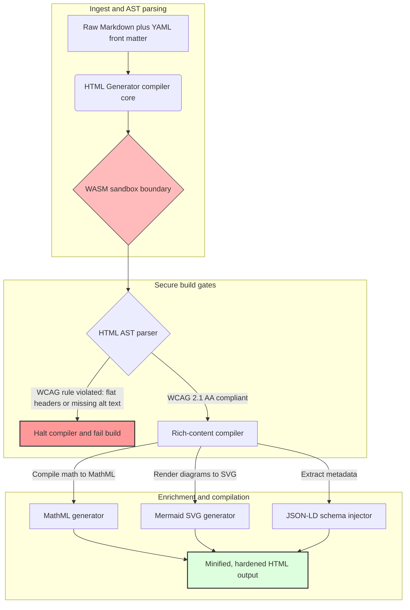

## 2026లో Rustతో Markdownను ప్రాప్యత గల, SEO-సిద్ధ, నిర్మిత HTMLగా మార్చడం

2026లో, వెబ్ కంటెంట్ మానవ పాఠకులంత గానే AI శోధన క్రాలర్లు, LLM-ఆధారిత శోధన ఇంజిన్లు, మరియు Retrieval-Augmented Generation (RAG) పైప్‌లైన్ల ద్వారా వినియోగించబడుతోంది. చదునైన లేదా లోపభూయిష్ట HTML యంత్ర-ఆవిష్కరణీయతను దెబ్బతీస్తుంది, అదే సమయంలో [యూరోపియన్ యాక్సెసిబిలిటీ యాక్ట్ (EAA)](https://www.accessibility-act.eu/) మరియు [US ADA Title III](https://www.ada.gov/topics/title-iii/) వంటి కఠినమైన ప్రపంచ నియంత్రణలను పాటించకపోవడం ఇప్పుడు స్పష్టమైన పౌర బాధ్యత. [HTML Generator](https://github.com/sebastienrousseau/html-generator) అనేది ఆ అంతరాలను — అమలు తర్వాత ప్యాచ్‌లలో కాకుండా కంపైలర్ వద్దనే — మూసివేయడానికి రూపొందించబడిన అధిక-పనితీరు గల Rust లైబ్రరీ.

## త్వరిత సమాధానం

**ఒక్క వాక్యంలో HTML Generator అంటే ఏమిటి?** HTML Generator అనేది ఒక ఓపెన్-సోర్స్, స్వచ్ఛమైన-Rust Markdown-నుంచి-HTML కంపైలర్; ఇది బిల్డ్ సమయంలో [WCAG 2.1 AA](https://www.w3.org/TR/WCAG21/)ను అమలు చేస్తుంది, సెమాంటిక్ ల్యాండ్‌మార్క్‌లు మరియు ARIA లక్షణాలను స్వయంచాలకంగా రూపొందిస్తుంది, YAML ఫ్రంట్ మ్యాటర్ నుంచి స్కీమా-అనుకూల [JSON-LD](https://json-ld.org/) మెటాడేటాను ఇంజెక్ట్ చేస్తుంది, Mermaid రేఖాచిత్రాలను మరియు గణితాన్ని ప్రాప్యత గల SVG మరియు MathMLగా రెండర్ చేస్తుంది, మరియు ఒక [WebAssembly](https://webassembly.org/) శాండ్‌బాక్స్ లోపల నడుస్తుంది — కార్పొరేట్ ప్రచురణను ఒక కంపైల్-గేటెడ్, విశ్వసనీయ-స్థాయి నియంత్రణ తలంగా మారుస్తుంది.

## కార్యనిర్వాహక సారాంశం

Markdown రెండరింగ్ చిన్నదిగా కనిపిస్తుంది. ప్రచురణ-స్థాయి HTML ఒక అనుసరణ సమస్య. జూన్ 2026లో, ప్రతి కార్పొరేట్ స్పర్శబిందువు — పెట్టుబడిదారుల సంబంధాల పోర్టళ్లు, నియంత్రణ దాఖలులు, కస్టమర్ డాక్యుమెంటేషన్, API సూచనలు, మార్కెటింగ్ ఎస్టేట్‌లు — మానవులు మరియు యంత్రాలు రెండింటిచేతా పార్స్ చేయబడుతుంది. ప్రతి పేజీపై రెండు ఒత్తిడులు ఢీకొంటాయి: [EAA](https://www.accessibility-act.eu/) మరియు [ADA Title III](https://www.ada.gov/topics/title-iii/) ప్రాప్యతను బోర్డు-స్థాయి చట్టపరమైన బహిర్గతంగా మారుస్తాయి, అదే సమయంలో AI గ్రహణం మరియు RAG పైప్‌లైన్లు నిర్మిత, యంత్ర-పఠనీయ అవుట్‌పుట్‌కు బహుమతినిస్తాయి. ప్రామాణిక Markdown లైబ్రరీలు రెండు గేట్‌లనూ విఫలపరిచే చదునైన HTMLను ఉత్పత్తి చేస్తాయి. HTML Generator పత్ర రూపకల్పనను ఒక కంపైల్-గేటెడ్ పైప్‌లైన్‌గా పరిగణిస్తుంది: WCAG ధృవీకరణ ఒక బిల్డ్ లోపం, JSON-LD మాన్యువల్ ముద్ర లేకుండా YAML ఫ్రంట్ మ్యాటర్ నుంచి వస్తుంది, MathML మరియు Mermaid ప్రాప్యతగా రెండర్ అవుతాయి, మరియు మొత్తం ఇంజిన్ ఒక WebAssembly లక్ష్యంగా రవాణా అవుతుంది కాబట్టి విశ్వసనీయత లేని పత్రాల పార్సింగ్ హోస్ట్ నుంచి శాండ్‌బాక్స్‌గా ఉంటుంది.

## ముఖ్యాంశాలు

- **కోడ్-గా-ప్రాప్యత కొత్త ప్రాతిపదిక.** EAA వినియోగదారు డిజిటల్ సేవలకు ప్రాప్యతను తప్పనిసరి చేస్తుంది. HTML Generator కంపైల్ సమయంలో పత్ర వృక్షాన్ని మూల్యాంకనం చేస్తుంది, సెమాంటిక్ ల్యాండ్‌మార్క్‌లు మరియు ARIA లక్షణాలను స్వయంచాలకంగా రూపొందిస్తుంది — తక్కువ అమలు-తర్వాత సవరణలు, తక్కువ నివారణ బడ్జెట్‌లు, ఉత్పత్తికి తప్పిపోయిన alt-text రవాణా కాదు.
- **AI ఆవిష్కరణ కోసం నిర్మిత డేటా.** ఆధునిక శోధన మరియు RAG యంత్ర-పఠనీయ మెటాడేటాపై ఆధారపడతాయి. కంపైలర్ YAML ఫ్రంట్ మ్యాటర్‌ను పార్స్ చేసి [Schema.org-అనుకూల JSON-LD](https://schema.org/)ను నేరుగా పత్ర శీర్షికలోకి ఇంజెక్ట్ చేస్తుంది, తద్వారా కంటెంట్ [Google Rich Results](https://developers.google.com/search/docs/appearance/structured-data/intro-structured-data), [Bing Webmaster](https://www.bing.com/webmasters), మరియు LLM-ఆధారిత క్రాలర్ల ద్వారా పూర్తిగా వ్యాఖ్యానించదగినదిగా అవుతుంది.
- **సాంకేతిక కంటెంట్ శ్రేష్ఠత.** సాంకేతిక ప్రచురణ చదునైన టెక్స్ట్ కాదు. HTML Generator ముడి Markdown గణిత విస్తరణలను ప్రాప్యత గల [MathML](https://www.w3.org/Math/)గా కంపైల్ చేస్తుంది, మరియు [Mermaid.js](https://mermaid.js.org/) రేఖాచిత్రాలను స్పందనశీల SVGగా రెండర్ చేస్తుంది — రెండూ అపారదర్శక చిత్రాలకు దిగజారకుండా WCAG-అనుకూల నిర్మాణాన్ని కాపాడతాయి.
- **WebAssembly శాండ్‌బాక్సింగ్.** విశ్వసనీయత లేని Markdownను పార్స్ చేయడం ఒక భద్రతా ప్రమాదం. [WASM](https://webassembly.org/)ను లక్ష్యంగా చేసుకోవడం ద్వారా, HTML Generator ఒక వేరుచేయబడిన శాండ్‌బాక్స్ లోపల అమలు అవుతుంది, ఇది ఏకపక్ష కోడ్ అమలును నిరోధించి హోస్ట్ సిస్టమ్‌ను రక్షిస్తుంది — నేరుగా [DORA Article 6](https://eur-lex.europa.eu/legal-content/EN/TXT/?uri=CELEX%3A32022R2554) ICT-భద్రతా బాధ్యతలను సంతృప్తిపరుస్తుంది.
- **బోర్డుల కోసం విశ్వసనీయ రక్షణ.** సాంకేతిక అనుసరణ లోపం బోర్డు గదిలోకి చేరింది. కంపైలర్-గేటెడ్ HTML ఇంజిన్‌పై ప్రామాణీకరించడం వల్ల DORA, EAA, మరియు ADA Title III కింద డైరెక్టర్లు మరియు సీనియర్ మేనేజ్‌మెంట్‌ను వ్యక్తిగత పౌర మరియు నియంత్రణ బహిర్గతం నుంచి కాపాడుతుంది.

**సంబంధిత చదవదగినవి:** [2026లో AI, MCP, మరియు ఆర్థిక మౌలిక సదుపాయం కోసం YAMLకు ఎందుకు సురక్షితమైన Rust స్టాక్ అవసరం](https://sebastienrousseau.com/2026-06-18-noyalib-safe-yaml-rust-ai-mcp-financial-infrastructure-2026/), [2026లో AI-యుగ ప్రచురణ కోసం డిఫాల్ట్‌గా-సురక్షిత స్టాటిక్ సైట్ జనరేటర్](https://sebastienrousseau.com/2026-06-17-static-site-generator-secure-default-ai-era-publishing-2026/), [CloudCDN: 2026లో AI-స్థానిక ఎడ్జ్ కోసం ఒక ఓపెన్-సోర్స్ బ్లూప్రింట్](https://sebastienrousseau.com/2026-06-11-cloudcdn-open-source-blueprint-ai-native-edge-2026/).

## 01. 2026లో ప్రాప్యత-మొదటి HTML కంపైలర్ ఎందుకు ముఖ్యం

కార్పొరేట్ వెబ్ ఎస్టేట్‌లు, డాక్యుమెంటేషన్ లైబ్రరీలు, మరియు ఉత్పత్తి సహాయ కేంద్రాలు కీలకమైన డిజిటల్ స్పర్శబిందువులు. అవి ఇప్పుడు రెండు తీవ్రమైన, ఖండన ఒత్తిడులకు లోబడి ఉన్నాయి.

మొదటిది **AI గ్రహణం మరియు ఆవిష్కరణీయత**. కంటెంట్ పెరుగుతున్న స్థాయిలో పెద్ద భాషా నమూనాలు మరియు Retrieval-Augmented Generation పైప్‌లైన్ల ద్వారా ప్రాసెస్ చేయబడుతోంది. చదునైన లేదా లోపభూయిష్ట HTML క్రాలర్ పార్సింగ్‌ను గందరగోళపరుస్తుంది, ఆధునిక శోధన విధానాలకు — [Google Search Generative Experience](https://blog.google/products/search/generative-ai-search/), [ChatGPT](https://chat.openai.com/) బ్రౌజింగ్, మరియు ఎంటర్‌ప్రైజ్ RAG ఏజెంట్లతో సహా — కార్పొరేట్ పరిశోధన మరియు డాక్యుమెంటేషన్‌ను అదృశ్యంగా వదిలేస్తుంది.

రెండవది **కఠినమైన ప్రపంచ ప్రాప్యత చట్టం**. [యూరోపియన్ యాక్సెసిబిలిటీ యాక్ట్](https://www.accessibility-act.eu/) (జూన్ 2025 నుంచి పూర్తిగా వర్తిస్తుంది) మరియు [US ADA Title III](https://www.ada.gov/topics/title-iii/) కింద, కార్పొరేట్ ప్రచురణ ప్లాట్‌ఫారమ్‌లు పూర్తి డిజిటల్ ప్రాప్యతను హామీ ఇవ్వాలి. [WCAG 2.1 AA](https://www.w3.org/TR/WCAG21/)ను పాటించకపోవడం ఇక ఇంజినీరింగ్ పర్యవేక్షణ లోపం కాదు; ఇది బహుళ-మిలియన్-డాలర్ల పరిష్కారాలను ఉత్పత్తి చేసిన పౌర మరియు నియంత్రణ బాధ్యత.

[HTML Generator](https://github.com/sebastienrousseau/html-generator) రెండు ఒత్తిడులనూ నేరుగా పరిష్కరిస్తుంది. ఇది Markdownను ప్రాప్యత గల, SEO-సిద్ధ, నిర్మిత HTMLగా మార్చడానికి రూపొందించబడిన ఒక థ్రెడ్-సురక్షిత Rust లైబ్రరీ. పత్ర రూపకల్పనను ఒక కంపైలర్-గేటెడ్ పైప్‌లైన్‌గా పరిగణించడం ద్వారా, ఈ ఇంజిన్ అధిక **Return on Resilience (RoR)**ను అందిస్తుంది — AI ఆవిష్కరణ కోసం యంత్ర-పఠనీయతను గరిష్ఠీకరిస్తూ ప్రాప్యత వ్యాజ్యం నుంచి బ్యాలెన్స్ షీట్‌లను రక్షిస్తుంది.

## 02. HTML Generator 2026 ఆర్కిటెక్చర్ దృష్టికోణం

ఈ ఫ్రేమ్‌వర్క్ ముడి Markdown టెక్స్ట్‌ను క్రిప్టోగ్రాఫికల్‌గా ధృవీకరించిన, అత్యంత ప్రాప్యత గల స్టాటిక్ ఆస్తులుగా మార్చే ఒక సురక్షిత, బహుళ-దశల కంపైలేషన్ పైప్‌లైన్‌గా రూపొందించబడింది.

### పట్టిక 1: HTML Generator ఆర్కిటెక్చర్ పొరలు మరియు ప్రమాద ఉపశమనం

| పొర | రూపకల్పన నిర్ణయం | ఇది ఎందుకు ముఖ్యం | తప్పుగా నిర్వహిస్తే ప్రమాదం |
| ---- | ---- | ---- | ---- |
| **ఇన్‌పుట్ పొర** | Markdown ప్లస్ YAML ఫ్రంట్ మ్యాటర్ పార్సర్ | రచయితలను వారు ఉన్న చోటే కలుస్తుంది; నిర్మాణ మెటాడేటా నుంచి గద్యాన్ని వేరు చేస్తుంది. | అస్థిర మెటాడేటా, విరిగిన సైట్‌మ్యాప్‌లు, ఇండెక్సింగ్ అంతరాలు. |
| **నిర్మాణ పొర** | ARIA ట్యాగ్‌లతో స్వయంచాలక విషయసూచిక మరియు సెమాంటిక్ ల్యాండ్‌మార్క్‌లు | నిర్మాణం ద్వారానే నావిగేషన్ చేయదగిన, ప్రాప్యత గల పత్ర వృక్షాలను ఉత్పత్తి చేస్తుంది. | స్క్రీన్ రీడర్లను విచ్ఛిన్నం చేసి WCAGను ఉల్లంఘించే చదునైన HTML. |
| **సమృద్ధ-కంటెంట్ పొర** | స్థానిక MathML మరియు Mermaid.js SVG రెండరింగ్ | సూత్రాలు మరియు రేఖాచిత్రాలను ప్రాప్యత గల SVG మరియు MathMLగా కంపైల్ చేస్తుంది. | క్లయింట్-సైడ్ JS రెండరింగ్ ఆలస్యం మరియు విరిగిన సహాయక-సాంకేతిక అవుట్‌పుట్. |
| **SEO మరియు డేటా పొర** | సమగ్ర JSON-LD మరియు నిర్మిత-మెటాడేటా రూపకల్పన | [Schema.org](https://schema.org/) అనుకూల JSON-LDను నేరుగా శీర్షికలోకి ఇంజెక్ట్ చేస్తుంది. | శోధన ఇంజిన్లు మరియు AI క్రాలర్లు రచయిత, సందర్భం, లైసెన్సింగ్‌ను తప్పుగా చదవడం. |
| **రన్‌టైమ్ పొర** | WebAssembly లక్ష్యంతో స్థానిక Rust కంపైలర్ | సర్వర్లు, ఎడ్జ్ నోడ్‌లు, మరియు బ్రౌజర్లలో సురక్షిత, శాండ్‌బాక్స్ చేసిన అమలును ప్రారంభిస్తుంది. | విశ్వసనీయత లేని Markdown పార్సింగ్ సమయంలో ఏకపక్ష కోడ్ అమలు. |

## 03. కీలక వెబ్ భద్రత మరియు ప్రాప్యత సంకేతాలు

ప్రజలకు-ఎదురయ్యే ప్రచురణ ఆస్తులు ఆధునిక నియంత్రణ మరియు భద్రతా ఆడిట్‌లను సంతృప్తిపరుస్తాయని ధృవీకరించడానికి, సీనియర్ సాంకేతిక అధికారులు నిర్దిష్ట, పరిమాణాత్మక కొలమానాలను పర్యవేక్షించాలి.

### పట్టిక 2: వెబ్ భద్రత మరియు ప్రాప్యత సంకేతాలు

| సంకేతం | కొలమానం / కార్యాచరణ ప్రమాణం | EAA / DORA / W3C సూచన | సాంకేతిక అమలు |
| ---- | ---- | ---- | ---- |
| **ప్రాప్యత అనుగుణ్యత** | కంపైల్ చేసిన పేజీలలో 100 % WCAG 2.1 AA నియమాలకు ధృవీకరించబడింది. | [EAA](https://www.accessibility-act.eu/) మరియు [ADA Title III](https://www.ada.gov/topics/title-iii/) | చిత్ర alt ట్యాగ్‌లు మరియు సెమాంటిక్ ల్యాండ్‌మార్క్‌లను మూల్యాంకనం చేసే బిల్డ్-సమయ HTML పార్సర్. |
| **WASM అమలు శాండ్‌బాక్స్** | విశ్వసనీయత లేని Markdown ఇన్‌పుట్‌లలో 100 % వేరుచేయబడిన WebAssembly రన్‌టైమ్‌లో కంపైల్ చేయబడ్డాయి. | [DORA Article 6](https://eur-lex.europa.eu/legal-content/EN/TXT/?uri=CELEX%3A32022R2554) (ICT భద్రత) | హోస్ట్ సర్వర్ నుంచి పార్సింగ్ పరిసరాన్ని వేరుచేయడం. |
| **నిర్మిత-మెటాడేటా కవరేజ్** | ప్రచురించిన వ్యాసాలలో 100 % చెల్లుబాటు అయ్యే, స్కీమా-అనుకూల JSON-LD శీర్షికలతో ఇంజెక్ట్ చేయబడ్డాయి. | [Schema.org](https://schema.org/) విశేషాలు | స్వయంచాలక ఫ్రంట్-మ్యాటర్ పార్సింగ్ మరియు JSON-LD ఆబ్జెక్ట్‌లుగా మార్పిడి. |
| **కంపైలేషన్ నిర్గమన సామర్థ్యం** | సాధారణ హార్డ్‌వేర్‌పై సెకనుకు 10,000 పైన పేజీల లక్ష్యం. | Return on Resilience (RoR) | అత్యధికంగా సమాంతరీకరించిన Rust AST కంపైలర్. |
| **సమృద్ధ-స్నిప్పెట్ ధృవీకరణ** | [Google Rich Results](https://search.google.com/test/rich-results) మరియు [Schema validator](https://validator.schema.org/) రన్‌లపై సున్నా పార్సింగ్ లోపాలు. | Google Search మార్గదర్శకాలు | బిల్డ్ పైప్‌లైన్ సమయంలో రూపొందించిన JSON-LD నిర్మాణ ధృవీకరణ. |

## 04. సరళమైన Markdown రెండరింగ్ యొక్క అపోహ

Markdownను HTMLగా మార్చడం ఒక సరళమైన టెక్స్ట్-భర్తీ వ్యాయామం అనేది సాంకేతిక నిర్వాహకుల మధ్య ఒక సాధారణ అపోహ. చాలా ప్రామాణిక లైబ్రరీలు Markdown ఫార్మాటింగ్‌ను చదునైన, నిర్మాణం లేని HTMLగా అనువదిస్తాయి. అవుట్‌పుట్ బ్రౌజర్‌లో చూపు గల పాఠకునికి రెండర్ అవుతుంది, కానీ ఇది ఒక అనుసరణ ఉచ్చును సూచిస్తుంది.

చదునైన HTMLకు సాధారణంగా మూడు విషయాలు లోపిస్తాయి.

1. **సరైన శీర్షిక అనుక్రమాలు.** ప్రామాణిక Markdown శీర్షిక క్రమాన్ని అమలు చేయదు. ఒక `<h1>` నుంచి `<h4>`కు దూకడం WCAG 2.1 AAను ఉల్లంఘిస్తుంది మరియు స్క్రీన్ రీడర్ల కోసం పత్ర నావిగేషన్‌ను విచ్ఛిన్నం చేస్తుంది.
2. **స్పష్టమైన పట్టిక సెమాంటిక్స్.** ప్రామాణిక Markdown పట్టికలు ప్రాప్యత గల పార్సింగ్‌కు అవసరమైన సరైన `<th>` పరిధి మరియు `<tbody>` లక్షణాలతో అరుదుగా రెండర్ అవుతాయి.
3. **యంత్ర-పఠనీయ మెటాడేటా.** ప్రామాణిక HTMLకు ఆధునిక AI శోధన ప్లాట్‌ఫారమ్‌లు మరియు RAG గ్రహణ వ్యవస్థలు ఆధారపడే JSON-LD హుక్‌లు లోపిస్తాయి.

HTML Generator Markdownను ఒక **అబ్‌స్ట్రాక్ట్ సింటాక్స్ ట్రీ (AST)**గా పార్స్ చేయడం ద్వారా దీన్ని పరిష్కరిస్తుంది. ఇంజిన్ HTMLను ఉద్గారించడానికి ముందు పత్ర నిర్మాణాన్ని మూల్యాంకనం చేస్తుంది, శీర్షిక గూడుకట్టడాన్ని ధృవీకరిస్తుంది, తగిన ARIA లక్షణాలను ఇంజెక్ట్ చేస్తుంది, మరియు ప్రతి మీడియా ఆస్తి ప్రత్యామ్నాయ టెక్స్ట్‌ను కలిగి ఉందని నిర్ధారిస్తుంది — ప్రాప్యతను మాన్యువల్ ఆడిట్ నుంచి హామీ ఇవ్వబడిన కంపైల్-సమయ అస్థిరాంకంగా మారుస్తుంది.

## 05. కోడ్-గా-ప్రాప్యత బిల్డ్ పైప్‌లైన్‌ను రూపొందించడం

ప్రాప్యత లేని లేదా ఇండెక్స్ చేయని ఆస్తులు ప్రజా అమలుకు ఎప్పుడూ చేరకుండా నిరోధించడానికి, ప్రాప్యత తప్పనిసరిగా ఒక కఠినమైన కంపైలర్ గేట్ అయి ఉండాలి. కింది పైప్‌లైన్ HTML Generator ఎలా Markdownను మూల్యాంకనం చేస్తుందో, WebAssembly-వేరుచేసిన ధృవీకరణను నడుపుతుందో, మరియు దృఢమైన, నిర్మిత HTMLను ఎలా ఉద్గారిస్తుందో చూపిస్తుంది.

## 06. బోర్డు గది కార్యప్రణాళిక మరియు విశ్వసనీయ బాధ్యత

ఆధునిక ప్రాప్యత మరియు వెబ్-భద్రత అనుసరణ చర్చించలేని బోర్డు గది సమస్యలు. సీనియర్ మేనేజ్‌మెంట్ ప్రచురణ మౌలిక సదుపాయాన్ని చట్టపరమైన ప్రమాదం, ఆర్థిక పరిరక్షణ, మరియు నియంత్రణ బహిర్గతం అనే దృష్టికోణం ద్వారా సమీపించాలి.

- **యూరోపియన్ యాక్సెసిబిలిటీ యాక్ట్ (EAA).** ప్రజా మరియు ప్రైవేట్ డిజిటల్ పోర్టళ్లపై ప్రత్యక్ష, చట్టపరంగా కట్టుబడిన అనుసరణ ఆదేశాలను విధిస్తుంది. అనుసరణ లోపం తీవ్రమైన ఆర్థిక జరిమానాలు, పౌర వ్యాజ్యం, మరియు EU మార్కెట్ నుంచి ఆస్తిని తక్షణ ఉపసంహరణను ఉత్పత్తి చేయవచ్చు. కోడ్-గా-ప్రాప్యతను ఏకీకృతం చేయడం ద్వారా, అనుసరణ లేని కోడ్ రవాణా కాలేదని బోర్డులు ధృవీకరించగలవు — ప్రతిచర్యాత్మక నివారణను ఒక నిర్మాణాత్మక చట్టపరమైన కవచంగా మారుస్తుంది.
- **DORA Article 6 (సురక్షిత ICT పరిసరాలు).** ICT-పరిసర భద్రత కోసం కఠినమైన నియమాలను స్థాపిస్తుంది. Markdown కంపైలేషన్‌ను ఒక WebAssembly శాండ్‌బాక్స్ లోపల వేరుచేయడం ద్వారా, కస్టమర్-అప్‌లోడ్ చేసిన డాక్యుమెంటేషన్ లేదా భాగస్వామి ఫీడ్‌లను పార్స్ చేయడం హోస్ట్ సర్వర్లను ఏకపక్ష కోడ్ అమలుకు గురిచేయలేదని సంస్థలు నిర్ధారిస్తాయి, కీలకమైన బ్యాంకింగ్ పోర్టళ్లను రక్షిస్తాయి.
- **అనుసరణ ఆడిట్‌లలో ఖర్చు తగ్గింపు.** సాంప్రదాయ ప్రాప్యత అనుసరణ ఖరీదైన, వెనుకటి-దృష్టి అమలు-తర్వాత ఆడిట్‌లపై ఆధారపడుతుంది — సైట్‌కు ఏటా పదివేల డాలర్లు. WCAG ధృవీకరణను ఒక కంపైల్-సమయ నిరోధంగా అమలు చేయడం ఆ వెనుకటి ఖర్చులను తొలగిస్తుంది, అనుసరణ బడ్జెట్‌ను రక్షణ నుంచి ఆవిష్కరణకు మారుస్తుంది.

## 07. బ్యాంకు / ఎంటర్‌ప్రైజ్ రకం ప్రకారం దీని అర్థం ఏమిటి

### ప్రపంచవ్యాప్తంగా వ్యవస్థాత్మకంగా ముఖ్యమైన బ్యాంకులు (G-SIBs)

G-SIBs అనేక అధికార పరిధులలో వేలాది పరిశోధన పత్రాలు, నియంత్రణ బహిర్గతాలు, మరియు పెట్టుబడిదారుల-సంబంధాల పత్రాలను ప్రచురించే భారీ, బహుభాషా ప్రజా ఎస్టేట్‌లను నిర్వహిస్తాయి. వాటి సవాలు స్థాయి మరియు బహుళ-భాష సమానత్వం. HTML Generator యొక్క WebAssembly లక్ష్యం మరియు అధిక-నిర్గమన Rust ఇంజిన్ పెద్ద-స్థాయి, స్థానికీకరించిన పరిశోధన లైబ్రరీలను — రెండరింగ్ ఆలస్యం లేదా ప్రాప్యత తిరోగమనం లేకుండా — సెకన్లలో ప్రపంచవ్యాప్తంగా నవీకరించడానికి, కంపైల్ చేయడానికి, మరియు అమలు చేయడానికి అనుమతిస్తాయి.

### లావాదేవీ మరియు కార్పొరేట్ బ్యాంకులు

లావాదేవీ బ్యాంకుల కోసం, కస్టమర్ పోర్టళ్లు, డాక్యుమెంటేషన్ కేంద్రాలు, మరియు డెవలపర్ API మార్గదర్శకాలు కీలకమైన డిజిటల్ స్పర్శబిందువులు. ఆ ఆస్తులను HTML Generator ద్వారా కంపైల్ చేయడం అంటే క్లయింట్-ఎదురయ్యే ఛానెళ్లు XSS బహిర్గతం లేకుండా, డిపెండెన్సీ-హైజాక్ వెక్టర్లు లేకుండా, మరియు ప్రాప్యత లోపాలు లేకుండా ఉంటాయి — సంస్థాగత విశ్వాసాన్ని కాపాడి వ్యాజ్య ఉపరితలాన్ని తగ్గిస్తుంది.

### ప్రాంతీయ బ్యాంకులు మరియు ఫిన్‌టెక్‌లు

ప్రాంతీయ బ్యాంకులు మరియు చురుకైన ఫిన్‌టెక్‌లు G-SIB ఇంజినీరింగ్ బడ్జెట్‌లు లేకుండా డిజిటల్ అనుభవంపై పోటీ పడతాయి. HTML Generator ఆ బృందాలకు పెట్టెలోంచే ఒక ఎంటర్‌ప్రైజ్-స్థాయి ప్రచురణ పైప్‌లైన్‌ను ఇస్తుంది, చిన్న ఎస్టేట్‌లు నియంత్రకులు మరియు కాబోయే కార్పొరేట్ క్లయింట్లు ఇద్దరి పరిశీలనను తట్టుకునే ప్రాప్యత గల, SEO-సిద్ధ, శాండ్‌బాక్స్ చేసిన ఆస్తులను రవాణా చేయడానికి అనుమతిస్తుంది.

## 08. ప్రచురణ మౌలిక సదుపాయ రోడ్‌మ్యాప్

కార్పొరేట్ ప్రజలకు-ఎదురయ్యే వెబ్ ఎస్టేట్‌లు కార్యాచరణ దృఢత్వం యొక్క ఒక కీలక భాగం. నెమ్మదిగా, డైనమిక్‌గా దుర్బలమైన, డేటాబేస్-ఆధారిత వెబ్ ఇంజిన్లు — లేదా సంతకం చేయని స్టాటిక్ ఆస్తులు — పై ఆధారపడటం ఒక ఆమోదయోగ్యం కాని వ్యాపార ప్రమాదం.

ప్రజా డిజిటల్ స్పర్శబిందువులను భద్రపరచడానికి మరియు ప్రాప్యత వ్యాజ్యం నుంచి బ్యాలెన్స్ షీట్‌లను రక్షించడానికి, సీనియర్ సాంకేతిక మరియు భద్రతా నిర్వాహకులు స్పష్టమైన రోడ్‌మ్యాప్‌ను అమలు చేయాలి.

1. **స్టాటిక్ ఆర్కిటెక్చర్లకు మారండి.** పరిశోధన, మార్కెటింగ్, మరియు డాక్యుమెంటేషన్ ఎస్టేట్‌ల కోసం లెగసీ డైనమిక్ CMS ప్లాట్‌ఫారమ్‌లను దశలవారీగా తొలగించండి. కంటెంట్‌ను HTML Generator వంటి కంపైలర్-గేటెడ్ పైప్‌లైన్లలోకి తరలించండి.
2. **బిల్డ్ సమయంలో ప్రాప్యతను అమలు చేయండి.** కోడ్-గా-ప్రాప్యతను అమలు చేయండి. ఏదైనా WCAG 2.1 AA ఉల్లంఘనపై కంపైలేషన్ పైప్‌లైన్లను స్వయంచాలకంగా విఫలం చేయండి.
3. **WebAssemblyలో పార్సింగ్‌ను వేరుచేయండి.** విశ్వసనీయత లేని ఇన్‌పుట్ ఎప్పుడూ హోస్ట్ సిస్టమ్‌లను తాకకుండా అన్ని పత్ర మరియు కంటెంట్ పార్సింగ్‌ను ఒక WASM రన్‌టైమ్ లోపల శాండ్‌బాక్స్ చేయండి.
4. **సమృద్ధ JSON-LD మెటాడేటాను ఇంజెక్ట్ చేయండి.** AI ఆవిష్కరణీయతను గరిష్ఠీకరించడానికి ప్రతి ప్రచురించిన ఆస్తి స్కీమా-అనుకూల JSON-LD శీర్షికలను కలిగి ఉందని నిర్ధారించండి.

## 09. తరచుగా అడిగే ప్రశ్నలు

**HTML Generator ప్రాప్యతను ఎలా అమలు చేస్తుంది?**

ఇది బిల్డ్ సమయంలో రూపొందించిన HTML అబ్‌స్ట్రాక్ట్ సింటాక్స్ ట్రీను పార్స్ చేస్తుంది, పత్రాన్ని [WCAG 2.1 AA](https://www.w3.org/TR/WCAG21/) నియమాలకు వ్యతిరేకంగా మూల్యాంకనం చేస్తుంది. ఒక నియమం ఉల్లంఘించబడితే — తప్పిపోయిన alt లక్షణం, ఒక శీర్షిక దూకుడు, ఒక లేబుల్ లేని ఫారం నియంత్రణ — కంపైలర్ బిల్డ్‌ను ఆపివేస్తుంది, ప్రాప్యతను అమలు-తర్వాత ఆడిట్ పని కాకుండా ఒక కంపైల్-సమయ అస్థిరాంకంగా పరిగణిస్తుంది.

**WebAssembly వేరుచేయడం ఎందుకు ముఖ్యం?**

[WebAssembly](https://webassembly.org/) Markdown పార్సింగ్ ఇంజిన్‌ను హోస్ట్ సర్వర్ నుంచి వేరుచేయబడిన, ఒక వేరుచేయబడిన శాండ్‌బాక్స్ లోపల అమలు చేయడానికి అనుమతిస్తుంది. ఒక శత్రుత్వ నటుడు పార్సర్ దుర్బలత్వాలను దోపిడీ చేయడానికి రూపొందించిన ఒక Markdown పత్రాన్ని అప్‌లోడ్ చేసినప్పుడు కూడా, అమలు చిక్కుకుంటుంది — హోస్ట్ సిస్టమ్‌లను రక్షిస్తుంది మరియు DORA Article 6 ICT-భద్రతా బాధ్యతలను సంతృప్తిపరుస్తుంది.

**2026లో JSON-LD శోధన ఆవిష్కరణీయతకు ఎలా ప్రయోజనం చేకూరుస్తుంది?**

[JSON-LD](https://json-ld.org/) పత్ర శీర్షికలో నిర్మిత, యంత్ర-పఠనీయ మెటాడేటాను అందిస్తుంది. [Google Rich Results](https://developers.google.com/search/docs/appearance/structured-data/intro-structured-data), Bing క్రాలర్లు, మరియు LLM-ఆధారిత శోధన ఏజెంట్లు రచయిత, లైసెన్స్, ప్రచురణ తేదీ, మరియు సెమాంటిక్ సందర్భాన్ని తక్షణమే గుర్తిస్తాయి — ప్రామాణిక HTML యొక్క అస్పష్టతను దాటవేస్తూ AI-ఆధారిత ఆవిష్కరణలో ఉపరితల విస్తీర్ణాన్ని పెంచుతాయి.

**HTML Generator ప్రేక్షకులు ఎవరు?**

స్టాటిక్-సైట్ నిర్మాతలు, డాక్యుమెంటేషన్ బృందాలు, సాంకేతిక రచయితలు, Rust డెవలపర్లు, మరియు ప్రాప్యత-కీలక లేదా నియంత్రకులకు-ఎదురయ్యే ఎస్టేట్‌లను రవాణా చేసే ప్లాట్‌ఫారమ్ ఇంజినీర్లు. ఇది [Static Site Generator (SSG)](https://github.com/sebastienrousseau/static-site-generator) వంటి పెద్ద సురక్షిత-ప్రచురణ పైప్‌లైన్ల లోపల ఒక ఆచరణీయ కంటెంట్-ప్రాసెసింగ్ పొర కూడా.

## 10. సూచనలు

- World Wide Web Consortium (W3C), 2024. [వెబ్ కంటెంట్ యాక్సెసిబిలిటీ గైడ్‌లైన్స్ (WCAG) 2.1 ⧉](https://www.w3.org/TR/WCAG21/ "Web Content Accessibility Guidelines 2.1").
- Schema.org, 2026. [Schema.org నిర్మిత-డేటా విశేషాలు ⧉](https://schema.org/ "Schema.org structured-data specifications").
- European Parliament and Council of the European Union, 2022. [ఆర్థిక రంగం కోసం డిజిటల్ కార్యాచరణ దృఢత్వంపై నియంత్రణ (EU) 2022/2554 (DORA) ⧉](https://eur-lex.europa.eu/legal-content/EN/TXT/?uri=CELEX%3A32022R2554 "DORA Regulation").
- European Commission, 2025. [యూరోపియన్ యాక్సెసిబిలిటీ యాక్ట్ ⧉](https://www.accessibility-act.eu/ "European Accessibility Act").
- US Department of Justice, 2024. [ADA Title III ⧉](https://www.ada.gov/topics/title-iii/ "ADA Title III").
- WebAssembly Community Group, 2026. [WebAssembly విశేషం ⧉](https://webassembly.org/ "WebAssembly").
- GitHub, 2026. [HTML Generator రిపోజిటరీ ⧉](https://github.com/sebastienrousseau/html-generator "HTML Generator open-source repository").
